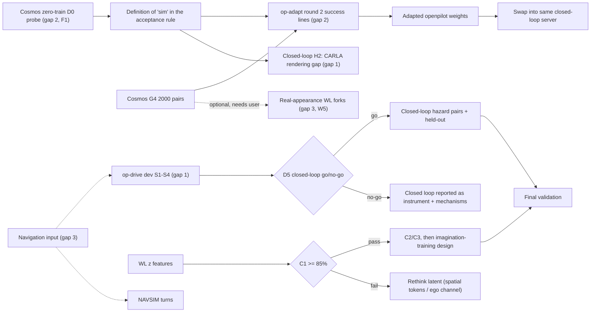

# 中期前的三个缺口：闭环、验收原则、世界模型（给外部专家的咨询稿，2026-09-29）

这份文档写给不熟悉本仓库的自动驾驶 / 世界模型方向的同行，目的是请你们在约 10 天后（约 10-09）的中期汇报之前，判断我们在三个缺口上的计划是否合理、优先级是否排对。
所有数字抄自 [decisions.md](decisions.md) 和它引用的 todo 与结果表，写本文时没有跑任何实验；在 box 上只读过两个状态文件（WL 流水线、op-drive 输出目录）确认进度。
决策日志里标「**待定**」的条目在这里仍按待定对待；标「GPT 按登记判格，待人复核」的读数本文一律记作**未复核**，不作为证据。
成果全景与证据分级见 [midterm-inventory.md](midterm-inventory.md)，排期见 [tmp/2026-09-29-midterm-plan.md](../tmp/2026-09-29-midterm-plan.md)。

---

## 0. 一页背景（自足，不需要读别的文档）

### 0.1 论点：trick or trade

我们的论文主张可以一句话概括为「trick or trade」：**在大规模工业数据上训练、真正部署过的驾驶模型，轻度适配后比为榜单调出来的模型更会开车**；
榜单分数（score）和驾驶能力（capability）是两件事，要分开量。「工业数据模型」主要指 openpilot（comma.ai 的量产驾驶辅助栈，端到端视觉策略，训练数据来自大量用户车辆；
我们用它的 Cinque 与 Lebowski 两个 2025–2026 年模型）和 V-JEPA 2（Meta 的视频自监督 JEPA 模型，Joint-Embedding Predictive Architecture：在 embedding 空间而不是像素空间预测被遮挡的视频内容）。
「trick」指榜单上的配方：对准评测 metric 的打分头、特定的输入契约、闭环里的规则兜底。

目前支撑这个论点、证据较硬的结果（详细分级见 inventory 第 3 节）：

| 结果 | 数字 | 证据强度 |
|:--|:--|:--|
| 只修输入契约（input contract：榜单给 agent 的是 2 Hz、1.5 s 的历史帧，openpilot 要 20 Hz），同一个 openpilot 在 NAVSIM navtest 上 PDMS 从 52.1 到 84.2，与 TransFuser（84.0）同量级 | n = 12 146 token，全量；devkit 复现 log / cv 分数 | A-（第 37 条） |
| 冻结 openpilot `temporal` 特征（策略时序模块输出的 512 维向量）+ 薄 head，在 WOD 和 nuScenes 上都比 Qwen / V-JEPA / SigLIP 等通用 backbone 好一个量级 | 两个数据集独立复现，ADE −18% / −22% | A-（第 40 条） |
| 同一份冻结特征只把选轨方式换成对准 PDM 子分的打分头，PDMS +6.3 [+5.7, +6.9]，行为没有任何变化 | 3 seed × 2 模型 | A-（第 40 条第 6 点） |
| WOD-E2E 零样本：openpilot Cinque RFS 8.005，高于 cv 7.10；NAVSIM 榜单前 10 的几个模型在同批帧上低于 cv（推算，待统一重算） | 479 帧全量 | B / C（第 34、46 条） |

### 0.2 主方法与验收原则

主方法（2026-09-28 定，尚未开始）是：**openpilot 的策略在一个 JEPA latent 世界模型里用 Dreamer 式想象训练（imagination training：策略只在世界模型推演出的 latent 轨迹上展开和更新，不进模拟器）来学会对突发 hazard 反应**。
latent 取 openpilot `temporal` ⊕ V-JEPA 2 ViT-L 三相机 mean-pool（共 3 584 维，5 Hz）；世界模型是一个 23 M 参数的 Transformer 预测器（8 步历史 → 10 步未来 Δz）。
CARLA（开源驾驶模拟器）只做两件事：提供让世界模型学到正确动作效应的**干预数据**（动作不由看见场景的策略选择的数据），以及最终验证。CARLA 里直接做闭环 RL 太慢，扩不上去。

验收原则（用户定）：**「真学会了，虚拟和真实场景都应该会开」**。任何只在 CARLA 里有效、或只在真实数据上有效的改进都不算学会。

### 0.3 我们的考卷与指标（后文反复出现）

- **配对考卷（P5 v1 BA）**：CARLA 里 101 条路线 × 3 seed 的 x⁺ / x⁻ 配对，同一世界、同一 seed，x⁺ 有 hazard（行人横穿、cut-in 等），x⁻ 把 hazard 藏掉；expert 是 CARLA 的 BehaviorAgent。
  **翻转率（flip rate）**：考生输出在 x⁺ 与 x⁻ 之间朝正确方向变化超过噪声门槛 τ 的比例；**null false-flip**：只换天气时的误翻率，地板约 5%。
- **配对差分（pair-differential supervision）**：只对同一配对两侧输出之差做监督，目标是 expert 两侧行为之差。
- **D0 probe**：在 openpilot 某一层特征上训练线性 logistic probe，读「走廊内有没有行人」，报样本外 AUC。
- **Bench2Drive（B2D）**：CARLA 上的闭环榜单，220 条短路线，每条含一个 scenario。**DS**（Driving Score，0–100，路线完成度 × 违规罚分乘积）、**RC**（Route Completion）、**SR**（Success Rate）。
- **HUGSIM**：用 3DGS（3D Gaussian Splatting）重建真实场景（nuScenes、Waymo、KITTI-360、PandaSet）的闭环模拟器，4 Hz，主指标 **HD-Score**（每步 PDMS 均值 × RC）。
- **NAVSIM**：基于 nuPlan 的开环榜单，**PDMS / EPDMS**（v1 / v2 的规则化驾驶分，0–100）；navhard two-stage 的第二阶段是 3DGS 合成场景。
- **WOD-E2E**：Waymo 的端到端开环榜单，主指标 **RFS**（Rater Feedback Score，0–10，按人工评分过的轨迹信任域打分）。

### 0.4 预算与时间

- 中期约 10-09（今天 09-29 记为 D0，D2 = 10-01，D5 = 10-04，D8 = 10-07，D10 = 10-09）。
- 剩余经费约 5 000 元。D0–D2 有 7 张 RTX PRO 6000D（每张约 55% 上一代 box 的算力、83.6 GiB）、175 核；**D2 之后降到 2 张卡**（约 330 元 / 天），每卡约 6 个 CARLA server。
- D2–D5：卡 A 做 openpilot 适配第二轮（sim + real）和 NAVSIM 补导航；卡 B 做 openpilot 闭环接入。D5–D8：闭环（B2D 子集 + HUGSIM）与开环榜。D8–D10：出图、写报告。世界模型只在 2 卡阶段插空做前置检查 C1–C4，想象训练放到中期之后。

### 0.5 三个缺口一览

| 缺口 | 我们想说的话 | 现在能说的话 | 下一个决定点 |
|:--|:--|:--|:--|
| 1 闭环 | 轻度适配的 openpilot 在闭环里开得比无感知 base 好，且不是因为开得慢 | 没有任何 openpilot 的正式闭环分数；唯一加分（+9.7 DS）被同均速对照解释掉 | D5 闭环 go / no-go |
| 2 验收原则 | 同一次适配让 openpilot 在 CARLA 和真实数据上都学会对行人反应 | 没有一个正例；CARLA 上学到的东西搬到真实数据有害，真实数据上学到的一点点搬不回 CARLA | D5 op-adapt 第二轮读数 |
| 3 世界模型 | 干预数据上的 latent 世界模型动作效应方向正确，推演出的后果能用来选动作、进而训练策略 | 第一次实验（W）判据全不过，只有事后诊断；WL（09-29）：纵向动作效应读对了（刹车 > 保持 90.5%），C2 全过，但 C1 的 shift 一条、C3、C4 不过；NAVSIM 上导航输入三次都没用 | D2–D3 WL C1 |

---

## 1. 缺口一：闭环没有正面结果

### 1.1 缺什么

**我们想做的 claim**：「openpilot（Cinque，至多轻度适配）接进 Bench2Drive 闭环，外加的只是真车上驾驶员与导航做的事（路线、路口打方向、设定速度、按 resume），
在配对比较里 DS 高于无感知的路线 base，且在同均速对照下仍然更好；在 HUGSIM 的真实外观闭环里 HD-Score 不低于官方基线。」

**现有证据为什么不支持**：

| 读数 | 数字 | n / seed | 为什么不够 | 来源 |
|:--|:--|:--|:--|:--|
| openpilot 原生 plan 直接开（native） | 6 / 6 条从不起步，blocked；第 33 条的 DS 2.7 已因适配 bug（plan 原点差 1.78 m）作废 | 6 条诊断路线，1 seed | 模型不起步，不是分数问题 | 第 33、57 条 |
| 无感知 base（路线几何 + 8 m/s 巡航） | DS 56.6，RC 93.5 | 10 条 dev，1 seed | 说明 B2D 短路线的大半分数来自「按路线走完」 | 第 57 条 |
| e2e（base 横向 + openpilot 纵向 modifier + 停车锁存） | DS 66.2，对 base **+9.7 [−5.5, +27.0]**，4 好 / 3 差 / 3 平 | 10 条，1 seed | CI 跨零；**同均速对照 baseslow（base 按 e2e 的均速慢开）DS 67.7 ≥ e2e**，按登记判「+9.7 可以用开得慢解释」 | 第 57 条诊断 (a) |
| e2e 去掉 20 s 兜底放行 | DS 36.4，5 / 10 blocked | 10 条 | e2e 的 41 次放行里 24 次靠兜底，即靠「驾驶员」 | 第 57 条诊断 (b) |
| acc（只接 lead 头的 IDM） | 两次运行 58.2 / 62.9，对 base +1.6 / +6.3 | 10 条 | 同配置两次运行在**一条路线上差 47 DS** | 第 57 条 |
| switch / oplat（openpilot 横向驾驶） | 26.1 / 8.5，对 base −30.5 [−42.6, −19.1] / −48.1 | 10 条 | 7 / 10 出车道；复盘见 1.2 | 第 57 条、[integration 文档](openpilot-closedloop-integration.md) |
| HUGSIM 零样本 | **没有计分运行**；只有 4 Hz 帧率代价与适配清单 | — | 预登记在 [experiments/hugsim/results/hugsim-exam-plan/README.md](../experiments/hugsim/results/hugsim-exam-plan/README.md)，64 场景计分未跑 | — |
| Alpamayo 1.5（对照模型）B2D | DS 60.8，SR 2 / 5 | n = 5，1 seed | 全量停在 17 / 220 | 第 33 条 |

一句话：**闭环里至今没有一个 openpilot 的数字同时满足「CI 不跨零」和「不能用开得慢解释」**，HUGSIM 一列是空的。

### 1.2 根因分析

下面把已知原因按「诊断过的」和「猜的」分开。

**已诊断（有逐 tick 证据）**

1. **起不了步是模型的静止先验**。静止且前方无障碍时，plan 5 s 只走 0.97 m（中位），meta 头「驾驶员此刻踩刹车」0.80，画面估的自车速度 −0.02 m/s（知道自己停着），前车读得准。
   一旦被带到 1 m/s 以上，plan 反而要加速（1–4 m/s 时 5 s 后比当前快 3.5–6 m/s）。HUGSIM 清单第 5 项同样：两个模型从全停 400 步不动。
   这与 Codevilla et al.（ICCV 2019，"Exploring the Limitations of Behavior Cloning for Autonomous Driving"）说的 inertia problem 是同一现象：在人类日志里「静止」与「继续静止」高度相关。
   真车上缺的只是驾驶员按 resume，所以我们把 resume 当作允许的外部输入。WOD-E2E 零样本读数也与此一致：起始车速 < 0.5 m/s 的 120 帧上，所有零样本模型都不比 cv（继续停着）好（第 34 条）。
2. **不转弯是因为 turn desire 在路口前不改 plan**。desire 是 openpilot 唯一的「意图」输入（8 类 one-hot 脉冲：左 / 右转、左 / 右变道等）。转弯前 0–20 m，带 turnLeft desire 的 plan 在 15 m 处只跟了路线横移的 −5%，无 desire 的 twin −10%，进弯以后两者都跟 100%。
   即 openpilot 不发起路口转弯，只跟随已经开始的转弯。
3. **switch 的 −30 DS 主要是接法问题，不是车道保持失败**（09-29 从旧日志复盘，[交接](../tmp/2026-09-29-op-closedloop-state.md)）：路线在路口里弯但命令不是 LEFT / RIGHT，不在转弯区，openpilot 顺着看到的路直行；
   openpilot 段没有设定速度上限（开到 15.7 m/s）；车离开路线后 base 的 rejoin 失败。非路口 lane-follow 步上 openpilot plan 与路线在 15 m 处距离 p50 0.08 m、p95 0.32 m，也就是路线画得准时 openpilot 与路线重合。
4. **幽灵停车的机制**：只看不开时（shadow），openpilot 在 e2e 停车位置的 33–50% 也要求明显减速；闭环里 80% 且更深（v(3 s)/v(0) 中位 0.34 对 0.7）；
   真正停下来是 CARLA 在 1–2 m/s 轻刹就刹停（e2e 39 次 0.15 s 内从 > 1 m/s 掉到 < 0.2 m/s）加上我们的锁存把低速当成「openpilot 让停」。一半来自画面、一半来自闭环放大 + 执行层 + 仲裁逻辑。
5. **openpilot 在 CARLA 里读不出行人**：P5 上 openpilot `temporal` / `vision` 行人 AUC 0.506–0.515，而真实 nuScenes 上原模型对车道内 10 m 内行人 0.83（第 42、55 条）。所以 CARLA 闭环里「openpilot 避开行人」本来就不该期待。
6. **B2D 的分数结构**：base 无感知就有 56.6，DS 是 RC × 罚分乘积，openpilot 结构上做不了的「按路线走完」占了大头。openpilot 的贡献只能以配对差报。
7. **HUGSIM 适配上已查清的**：4 Hz 帧率使 openpilot 2 s 横向误差 +25%（Cinque）/ +38%（Lebowski），纵向 +11–14%（`h4-dilate`，comma1M 8 段）；
   官方 iLQR 控制器的 heading 转置缺陷使两个 openpilot 模型在 10 个清单场景上 20 / 20 原地打转（同场景 route follower 7 / 10 完成）；fixed 控制器下 Cinque 在 PandaSet 021 自己把 plan 缩到 0 并停住、之后不再起步。

**有竞争的假设（还没分开）**

| 假设 | 说法 | 支持 | 反对 / 未知 | 什么证据能分开 |
|:--|:--|:--|:--|:--|
| H1 接法 | 剩下的失败都是仲裁、区划、执行层这类「接法」问题，改完 openpilot 能在 lane-follow 段赢 base | 第 3、4 点都是具体可修的；lane-follow 段对齐 p95 0.32 m | 未在闭环里验证 | op-drive 的 L 阶段（只隔离横向）与 dev S1–S4 |
| H2 渲染域差 | CARLA 画面本身让 openpilot 变差（行人读不出、某些 town 车道线概率 0.03–0.16） | 行人 AUC 0.51 对真实 0.83；24944（Town02 夜雾）、27297、27870 车道线概率低 | 车道线在多数路线 0.7–0.9；车辆 cut-in 在 CARLA 上读得出（HighwayCutIn 翻转 86–89%） | 在同一批路线上对比 Cosmos 重画帧与原始 CARLA 帧下的 openpilot shadow 读数（车道线概率、lead、行人 AUC） |
| H3 指标不敏感 | 即使 openpilot 有贡献，B2D DS 也量不出来：route completion 主导、单次噪声大 | base 56.6；一条路线同配置差 47 DS；突发 hazard family 对前几名已饱和（第 38 条） | — | 换成 hazard 条件的闭环配对读数（见 1.4 F2），看信号是否出现 |
| H4 能力不够 | openpilot 的纵向反应在闭环里本来就弱，modifier 只是让车变慢 | baseslow ≥ e2e；幽灵停车 | StaticCutIn 36 → 100、两条路口 42 → 60 这类逐路线好转可以归到 lead 头 / plan | 违规按时刻归因：drive 少掉的违规当时谁在约束（op-drive 已登记这个读法） |
| H5 渲染故障污染 | CARLA 新 server 第一条 route 的黄昏变暗、Large Map 同图前驱后的整幅泛光，可能影响任何闭环读数 | WL 数据里 130 / 2 814 个 run（4.6%）有此类故障 | op-drive 的 dev 路线不在 Town12/13；黄昏变暗只在新 server 第一条 route | 渲染诊断 lane 的开关（`B2D_KEEP_STREET_LIGHTS` 等）上线后，闭环 run 逐帧亮度扫描 |

**噪声与统计功效（推算）**：op-arb 的 e2e − base 在 10 条路线上 CI 半宽约 16 DS，反推逐路线配对差的 SD 约 26 DS。
按常规 80% 功效、双侧 α = 0.05，检测真效应 +10 DS 需要约 53 条路线，+5 DS 需要约 210 条（n ≈ (2.8 × 26 / δ)²；多 seed 平均会降低路线内噪声，降多少未知）。
所以 op-drive 登记的 dev 10 条 × 2 seed、held-out 19 条 × 2 seed **只能给方向，给不出 CI 下界 > 0**，除非效应 ≥ 20 DS。这一点决定了下面方案的排序。

### 1.3 D2–D10 的计划与可能结局

计划（已登记，[fc65452:todos/2026-09-29-op-drive.md](https://github.com/VennIntelligence/jev-drive/blob/fc65452/todos/2026-09-29-op-drive.md)，09-29 登记于任何新数字之前，smoke 已起，dev 结果未出）：
openpilot 在路线的 lane-follow 段开横向（两种执行：P7 跟 plan 路径 / openpilot action 头的 desired curvature 直接转 steer），路口、变道区与分歧兜底（15 m 处偏离路线 > 1.0 m）交给路线几何；
纵向 = min(设定速度 8 m/s 与曲率限速, lead 头 IDM, plan)；停车锁存只在 openpilot 自己要求停时触发，放行靠 plan、前车离开或驾驶员 resume（静止 5 s）；低速滑行修掉 CARLA 轻刹即刹停。
对照：dbase、同均速 dbaseslow、只换纵向的 dlon。成功线 S1–S4（dev 10 条 × 2 seed，路线内对 seed 平均后配对）：S1 均值赢 dbase 且好路线数 ≥ 差路线数；S2 均值赢 dbaseslow 且违规总数更少；
S3 openpilot 横向距离占比 ≥ 50%、纵向约束 binding ≥ 20%、blocked ≤ dbase + 2；S4 横向偏离中位 ≤ 0.5 m、出车道 + 偏离路线 ≤ dbase + 2。过了才冻结设计跑 held-out 19 条。
HUGSIM 计分按预登记在 D5–D8 跑（64 场景，official 与 fixed 两个控制器配对）。

| 结局 | 主观概率 | 对故事的含义 |
|:--|:--|:--|
| A. dev 四条全过，held-out S1 / S2 方向一致 | 25% | 可以说「openpilot 在 lane-follow 段自己开，比无感知与同均速对照都好」，但 CI 仍会跨零（功效不够），只能写「方向一致、两个独立路线集」；必须同时报外加规则的份额 |
| B. S1、S3、S4 过，S2 不过（赢 base 但不赢 baseslow） | 30% | 和 op-arb 同一个结论：openpilot 的纵向贡献等价于开慢。闭环段改讲「仪器 + 机制」，见第 4.2 节 |
| C. S3 / S4 不过（横向不可信，或 openpilot 实际很少在控制） | 25% | openpilot 在 CARLA 里横向开不了；需要分清 H1 与 H2（渲染），D5 前分不清就按 no-go 处理 |
| D. 基础设施问题（渲染故障、server 崩溃、卡号变动）让 dev 在 D5 前出不来 | 20% | 同 no-go；HUGSIM 与开环榜照常 |

HUGSIM 的可能结局（计分未跑，只能按清单推）：fixed 控制器下 openpilot 能开完一部分场景，但 Cinque 的自停和右转失败会拖分；official 控制器下大概率接近 0（清单 20 / 20 打转）。
预登记以 official 为 headline，这意味着 HUGSIM 的主结果很可能是「openpilot 在官方控制器下 ≈ 0」，而这主要反映控制器缺陷 × 会外推自身 yaw 的模型，不是驾驶能力。**这是需要专家判断的地方（问题 Q1.4）。**

### 1.4 候选修复（按成本收益排序）

| # | 方案 | 要什么 | 风险 | 可证伪的成功线 |
|:--|:--|:--|:--|:--|
| F1 | **按登记跑完 op-drive**（dev → held-out） | 约 40 worker·h，1 张卡 6 worker 约 7–10 h 墙钟；D2–D4 | 功效不够（1.2 节）；dev 已被看过 | 登记的 S1–S4；held-out 上 S1 / S2 方向与 dev 一致 |
| F2 | **闭环 hazard 配对**：复用 G lane 的 ghost test 基础设施（把 hazard actor 藏到地下、删掉 scenario 登记，路线 / seed / 天气不变），在 drive 与 dbase 上各跑 x⁺（hazard 在）与 x⁻（hazard 藏），读「x⁺ 比 x⁻ 多出来的违规」和「x⁻ 上的误停率」 | ghost harness 已在四个榜单模型上跑过（第 58 条）；80 条 hazard 路线 × 2 世界 × 2 臂 × 2 seed ≈ 640 run ≈ 65–105 worker·h，1 卡约 12–18 h；D5–D7 | openpilot 在 CARLA 读不出行人（H2），行人 hazard 预期为零；车辆 cut-in / 前车急刹才有信号 | 在车辆类 hazard 上 drive 的 (x⁺ 违规 − x⁻ 违规) 比 dbaseslow 少，配对 CI 上界 < 0；同时 x⁻ 上 drive 误停率 ≤ dbaseslow + 5 pp。这个读数把「开得慢」自动消掉，因为 x⁻ 是同一速度策略下的对照 |
| F3 | **HUGSIM 按预登记计分**，另报 engage 与 fixed 控制器 | 64 场景 × 2 模型 × 2 控制器 + LTF + cv；预登记估算 ≤ 10 h；D5–D8，与 F2 抢卡 B | 官方控制器打转；Cinque 自停；4 Hz handicap | 按预登记：fixed 下 openpilot HD-Score 对我们自己在同 64 场景上跑的 LTF 配对差 CI（不预设方向）；official 下照实报 |
| F4 | 加大 B2D 路线数以求 CI：220 条 val 中非 Town12/13 的全部，drive vs dbaseslow × 2 seed | 约 300–400 run，≈ 40–60 worker·h | 只有 S1–S4 dev 过了才值得；功效仍只够检测 ≥ +10 DS | drive − dbaseslow 配对 CI 下界 > 0 |
| F5 | 换 CARLA 画面：闭环中不可行（Cosmos 每 clip 约 91 s），但可以离线做 shadow 对照（H2 检验）：同一批 dev 路线录像经 Cosmos G4 重画后喂 openpilot，对比车道线概率、lead、plan 与路线对齐 | 约 10 条路线 × 数百帧，几 GPU·h（Cosmos 在 D2 前的 7 卡窗口里最便宜） | Cosmos 自身伪影 | 若 Cosmos 帧上车道线概率在低分 town 从 0.03–0.16 升到 > 0.5、plan 对齐 p95 下降，则 H2 成立，CARLA 闭环读数应按「渲染域差下限」解释 |
| F6 | NAVSIM navhard two-stage 当作「伪闭环」列：第二阶段是 3DGS 合成的偏离后续开（NAVSIM v2 的 pseudo-simulation 口径） | 已有：GIMM 33.3 EPDMS；补导航后重测（缺口三 3.4） | 不是真闭环，reviewer 可能不认 | 仅作补充列，不作闭环 claim |

**我们目前倾向的顺序**：F1（在跑）→ D5 看 dev → 过则 F2 + F3 并行，不过则只做 F3 与 F5；F4 只在 A 结局且卡有余时做。
F2 是本文最想请专家评价的方案：它直接回答「openpilot 在闭环里看见了什么」，并把 base 与速度混淆从读数里拿掉，代价是只能测车辆类 hazard。

### 1.5 给专家的问题

- **Q1.1** Bench2Drive 的无感知路线 base 就有 DS 56.6。对一个没有 route 输入、设计上由驾驶员管路线的量产策略，「对无感知 base 与同均速 base 的配对 DS 差」是不是可接受的闭环 claim？还是应当只报 hazard 条件的闭环配对（F2），完全放弃 DS？
- **Q1.2** 我们让路线几何接管路口、变道区和 15 m 分歧（真车上 = 驾驶员打方向），并允许静止 5 s 后自动 resume。你们认为这些外加规则的边界应划在哪里才不算 trick？有没有已发表的对照（例如评测 openpilot 或 ACC / lane-keeping 系统的闭环协议）可以借用？
- **Q1.3** 逐路线配对差 SD 约 26 DS（推算）。在 2 张卡、约 3 天闭环预算下，你们会把算力花在更多路线（F4）、更多 seed，还是换成低方差的 hazard 配对读数（F2）？
- **Q1.4** HUGSIM 预登记以 official 控制器为 headline（为了与论文数字可比），而 official 控制器的 heading 缺陷让 openpilot 20 / 20 原地打转。我们应当维持预登记（报 ≈ 0 并附 fixed 配对），还是现在（计分之前）修改登记，以 fixed 为 headline？
- **Q1.5** openpilot 在 CARLA 里读不出行人（AUC 0.51），真实数据上近处 0.83。闭环论文里把 CARLA 行人 hazard 列为「sim 渲染域外」、只在车辆 hazard 上下结论，会不会被认为是挑题？

---

## 2. 缺口二：验收原则没有一个正例

### 2.1 缺什么

**我们想做的 claim**：「同一次对 openpilot 的轻度适配，让它在 CARLA（sim）和真实数据（real）上都更会对行人反应，并且正常驾驶不变差。」这是验收原则「真学会了，虚拟和真实都会开」的第一个正例。

**现有证据为什么不支持**：到今天为止试过的每一条路，都只在一侧成立。

| 路线 | sim 读数 | real 读数 | 判格 | 来源 |
|:--|:--|:--|:--|:--|
| 冻结特征 + 配对差分 reaction head（M-C，Qwen ⊕ openpilot，线性） | P5 行人翻转 43.3% [35.0, 50.7]，3 seed 43.3 / 43.6 / 42.4；null 5.1% | 直接加到真实 prior 上：WOD RFS −1.02 [−1.21, −0.82]；NAVSIM PDMS −8.2 [−8.9, −7.5] | sim 过，real **有害** | 第 42、44 条 E1 |
| 20 Hz student（openpilot ⊕ YOLO 检测 embedding，不含 Qwen） | P5 行人 51–57% | NAVSIM PDMS −1.30 [−1.55, −1.04]，12 / 12 组有害；WOD −0.11 [−0.20, −0.03] | sim 过，real 有害（小一个量级） | 第 44 条 G0 |
| 真实数据训的 gate 乘 CARLA Δ（G1） | — | WOD 回到 prior（−0.03 [−0.09, +0.04]），NAVSIM 仍 −1.61 [−2.14, −1.08]；事后常数对照与 gate 持平，逐帧选择没有贡献 | 只是把 Δ 整体缩小 | 第 44 条 G1 |
| log 里挖孪生对（E3） | — | 分叉不是场景造成的（接近物体比例反而低 37 pp） | 不开训练 | 第 44 条 E3 |
| 真实帧 inpainting 抹人造对（E2 / G3） | 编辑对训的 head P5 行人 0% | WOD −2.16 [−2.38, −1.95]（navtrain 对）；WOD 对单独训 ≈ 0 | 不过 | 第 44 条 E2、G3 |
| HUGSIM 3DGS 车辆配对重训（G2） | I3 上无 head 超过 prior | WOD 线性 M-C −3.4，student 贴线、随 seed 变 | 不过 | 第 44 条 G2 |
| P3 3DGS 行人插入 / 删除考卷 | — | 用户看片判不可用（供体滑行、光晕、删车涂抹） | 停 | 第 44 条 P3 节 |
| 真实片段 ControlNet 同生成器配对 | — | 用户判删人不干净 | 暂停 | 第 59 条 |
| **op-adapt B 第一轮**：openpilot vision 最后一段（stage 4）解冻 + 走廊行人辅助 loss + 正常帧蒸馏，只用真实 nuScenes 监督 | P5 D0 AUC 0.506 → 0.515，Δ +0.009 [+0.003, +0.016]（线：≥ 0.60） | nuScenes val `temporal` AUC 0.709 → 0.786，Δ **+0.076 [+0.004, +0.166]**（线 +0.10）；3 seed +0.076 / +0.094 / +0.073；正常帧漂移 6 cm、WOD ADE +0.36% [−0.28, +1.03] | real 差一点没过，sim **完全没动**；「不坏」成立 | 第 55 条 |
| Hydra 打分头 + g₂·Δ（「能力包」） | 兼容检查不过，P5 不可判 | NAVSIM −5.14 / −8.33 | 不成立 | 第 53 条 |

**未复核读数**（不作证据）：第 53 条 Q4a「零约束」版（NAVSIM 不掉、Cinque 行人翻转随 seed 变、Lebowski 不过）；第 44 / 48 条 Q6（V-JEPA 双流 0 / 3 candidate seed；单帧 vs 4 帧）。

另外要说清楚的限定：**我们现在所有「sim 学会」的读数都是线性可读性或开环翻转率，没有一个是行为（plan 对行人的停车率）**；real 一侧的行为读数也没有可用的量具（P3 停了，第 59 条暂停）。
所以即使第二轮两边的 AUC 都过线，它也只是「表征层面的正例」，不是「会开」。

### 2.2 根因分析

**已诊断**

1. **CARLA 配对激发的 Δ 在真实分布上是一个有方向的系统偏置**（第 44、53 条）：E1 在直行帧上的激活率（16.7%）不低于行人帧（14.4%）；标准化到 WOD 统计量只把损害减半；student 的 Δ 幅值中位只有 0.1–0.2 m，但方向与场景无关，直行 token 上掉得最多。
   即 head 读到的是「CARLA 画面 vs 真实画面」的方向，不是行人。
2. **openpilot 在真实数据上本来就看得见近处行人**：原 `temporal` 对车道内 10 m 内行人 AUC 0.83，stage 3 输出（当前帧、线性）0.83；读不出的是 20 m 以外（0.56）。
   所以第 42 条「vision 层没有行人」只在 CARLA 上成立，已就地限定。
3. **B 的线性上限很近**：stage 3 已有 0.83，B 把 `temporal` 拉到 0.79，补回了 stage 4 → policy 这段落差（约 0.12）的六成；登记的 +0.10 离这个上限只剩 +0.12，门槛本身偏紧。
4. **真实数据里「必须反应」的行人事件很少**：WOD train 走廊内有行人的帧只连成约 230 个独立事件（G3c）；P3 删除型考卷在 WOD v2 1 000 段里只有约 10 段满足「必须反应」规则。

**竞争假设：为什么 real 上学到的带不到 CARLA**

| 假设 | 说法 | 证据 | 怎么分开 |
|:--|:--|:--|:--|
| G-a 渲染域差 | openpilot 的 vision 在 CARLA 行人（外观、步态、光照）上根本不激活；这是 CARLA 的问题，不是模型的 | 真实 0.83 对 CARLA 0.51；车辆在 CARLA 上可读（cut-in 翻转 86–89%） | **零训练**：原模型的 D0 probe 在 Cosmos G4 重画的 CARLA 配对上重算。若 AUC 从 0.51 跳到 ≥ 0.70，G-a 成立 |
| G-b 标签 / 监督太弱 | nuScenes 只有 203 个正例、2 Hz keyframe；监督只是「有没有」，不含时间和行为 | CI 宽 [+0.004, +0.166]；远处增益 +0.10–0.14 | 第二轮 real 侧换 WOD 113 k 帧（YOLO 标签）+ navtrain 103 k（GT），看 real Δ 是否随数据量涨 |
| G-c 目标错位 | 线性可读性不是行为；policy 头即使读得出也不一定改 plan | 第 42 条：M-C 读出行人需要配对差分，均匀 imitation 翻转 0–3% | 第二轮加行为读数：plan 在 x⁺ / x⁻ 上的减速翻转（P5 考卷原样），不只看 AUC |
| G-d Cosmos 捷径 | 第二轮若 sim 上涨，可能是学到了 Cosmos 伪影（车内痕迹 1 / 10、4 / 303 对亮度差 > 20）而不是行人 | 第 56 条：「只差行人」只在锚定区外按构造成立 | sim 读数必须在 **原始 CARLA** 与 **Cosmos 重画** 两种画面上各报一遍，考题场景与训练对严格分开（训练用 Town12 长路线切片，考卷用 Town13、小地图、B2D 行人路线） |

我们的判断（推测，未验证）：G-a 是第一嫌疑，因为它同时解释了「CARLA 上所有 real→sim 的读数都贴地板」和「CARLA 上训的东西到真实上是方向性偏置」两件事。如果 G-a 成立，
验收原则里的「sim」应该改为「经 sim2real 渲染后的 sim」，而原始 CARLA 行人只能作为渲染域外的已知限制——这是一个**需要事先说清、不能看完数据再改**的定义问题（Q2.2）。

### 2.3 D2–D5 的计划与可能结局

计划（尚未登记成功线）：op-adapt B 第二轮，卡 A，stage 4 解冻 + hazard loss + 蒸馏；训练数据 = Cosmos G4 全量 2 000 对（CARLA 配对经 Cosmos-Transfer2.5 重画成真实感：x⁻ 翻译一次，x⁺ 在行人像素区外每步锚定到 x⁻ 的 latent，
约 118 GPU·h；D0–D2 在 5 张卡上生成，10 对 stage 的 checklist 过了才开 Cosmos）+ 真实 WOD train 113 068 帧（YOLO 检测 + 平地抬升标签，11.7% 帧 uncertain 要遮掉）与 navtrain 103 288 token（GT 框）。
B 的算力很小（0.07 GPU·h / 10 万样本），瓶颈是监督信号。inventory 建议的成功线：P5 D0 AUC ≥ 0.60 且真实走廊行人 Δ ≥ +0.10、正常帧漂移仍 ≤ 0.10 m，外加一个行为读数。

| 结局 | 主观概率 | 含义 |
|:--|:--|:--|
| A. real Δ ≥ +0.10，原始 CARLA D0 ≥ 0.60，行为读数两边都涨 | 10% | 验收原则第一个正例（表征 + 开环行为层面），中期可以作为主结果之一 |
| B. real 过线，sim 只在 Cosmos 画面上涨、原始 CARLA 不动 | 35% | 支持 G-a；故事变成「openpilot 的 sim 缺陷是渲染域差，经 sim2real 渲染后两边都学会」——前提是这个定义事先登记 |
| C. real 过线或接近，sim 两种画面都不动 | 25% | 配对监督没有被模型用上（G-c）或 stage 4 不够；验收原则仍无正例 |
| D. sim 上涨但 real 掉或漂移变大 | 15% | Cosmos 捷径（G-d）或 sim 数据压过 real；需要重新配比 |
| E. Cosmos 全量或第二轮在 D5 前出不来 | 15% | 中期只报第一轮 + Cosmos pilot |

### 2.4 候选修复

| # | 方案 | 要什么 | 风险 | 可证伪的成功线 |
|:--|:--|:--|:--|:--|
| F1 | **零训练先测 G-a**：原 openpilot（和第一轮 B 模型）的 D0 probe 在 Cosmos 重画的 CARLA 行人配对上重算（stage 10 的 10 对、以及全量里先出来的几百对） | < 1 GPU·h；D1–D2，在 7 卡窗口里 | 10 对样本少，要等全量前几百对 | 原模型 AUC ≥ 0.70（对原始 CARLA 0.51）→ G-a 成立；< 0.60 → G-a 不成立，G-b / G-c 是主因 |
| F2 | **在任何第二轮数字之前登记成功线**，并把「sim」拆成原始 CARLA 与 Cosmos 两列，加行为读数（P5 考卷上 openpilot 原生 plan 的减速翻转与 null 误翻） | 0 GPU；D2 | 无 | 登记本身；判格按两列分开报 |
| F3 | op-adapt B 第二轮按计划跑，3 seed | 每 seed 约 0.5–1 GPU·h 训练 + 特征与读数；D2–D5 | 见 2.3 | F2 登记的线 |
| F4 | 把配对差分从「加 head」换成「对 plan 输出做配对差分」（监督 openpilot 自己的 plan 在 x⁺ / x⁻ 之间的差，目标是 expert 的减速差），蒸馏照旧压正常帧 | 同 F3 的量级；需要写一个 plan 层面的 loss | 目标来自 BehaviorAgent，可能让 plan 在真实数据上过度保守 | P5 行为翻转 ≥ null + 10 pp（两种画面），真实正常帧漂移 ≤ 0.10 m，NAVSIM / WOD 不降（CI 上界 ≤ +2% ADE） |
| F5 | 特征对齐（domain-adversarial，Ganin & Lempitsky 2015；或 MMD）：在 stage 4 上加 CARLA / real 判别器的反向梯度 | 小；1–2 天实现 | 对齐可能抹掉行人信号；第 44 条 E1 显示「标准化到目标统计量」只减半损害 | 域分类 AUC 从 1.0 降到 < 0.7 且 real 行人 AUC 不降 |
| F6 | 中间表示抽象（Müller et al., CoRL 2018 "Driving Policy Transfer via Modularity and Abstraction" 的思路）：行人反应走检测 token（YOLO image-plane token 已在 P5 上 48–57%），openpilot 只管 R 层 | 已有 student；缺真实数据上的正例 | 第 44 条 G0：student 零样本到真实仍有害（小）；G3：读得出编辑但修正无用 | 真实数据上 student + gate 的 NAVSIM 行人组 PDMS Δ CI 下界 > 0 |
| F7 | CARLA 行人剂量-反应考卷（dose-response：距离 = 车速 × TTC 2 / 3 / 4.5 s，横向位置 × 行人状态 × 本车状态；必须反应格与无威胁格分开计分），原始 CARLA 与 Cosmos 两种画面各考一遍 | 用户已同意方向（[todo](https://github.com/VennIntelligence/jev-drive/blob/fc65452/todos/2026-09-28-ped-dose-response.md)），GPU 6 空出后才搭；约 1–2 天 + CARLA 渲染 | 与 Cosmos 训练对必须严格分场景 | 作为行为层面的 sim 量具；不是修复本身 |

**倾向**：F1 → F2 → F3，F4 视 F3 的行为读数决定；F5、F6 放到中期之后。F1 最便宜、信息量最大：它决定验收原则里「sim」的定义，也直接影响缺口一（H2）和缺口三（世界模型只见过原始 CARLA latent）。

### 2.5 给专家的问题

- **Q2.1** 我们用线性 probe AUC 和开环配对翻转率当「学会」的代理。对一个视觉策略的中期结果，外部审稿人会接受哪种最低限度的行为证据？在真实数据上没有可靠的反事实行人编辑（3DGS 插入、ControlNet 删人都被目检否决）的前提下，真实一侧的行为读数应该怎么做？
- **Q2.2** 如果 F1 证明 openpilot 在原始 CARLA 行人上不激活、在 Cosmos 重画后激活，把验收原则中的「sim」定义为「sim2real 渲染后的 sim」是否合理？还是会被看作移动球门？
- **Q2.3** 在生成模型重画的配对上做配对差分，模型可能学到生成器痕迹。除了「区外按构造相同」和原始 / Cosmos 双画面报告，你们会要求什么检验（例如换 seed 的 Cosmos 重画作 null、只重画 x⁻ 的安慰剂对）？
- **Q2.4** openpilot 的 stage 3 已有 0.83 的线性行人信息，stage 4 → policy 丢了约 0.12。适配应当优先改 stage 4（我们现在的 B），还是改 policy（时序部分）让它把已有信息用于 plan？后者和第三个缺口的想象训练是同一块参数。
- **Q2.5** CARLA 配对激发的 Δ 到真实上是方向性偏置（第 44 条）。这是否是已知现象（sim 上的差分监督学到域方向）？有没有文献给出稳健的做法？

---

## 3. 缺口三：世界模型只有一次失败和事后诊断；导航输入的风险

### 3.1 缺什么

**我们想做的 claim**：「在干预数据上训练的 JEPA latent 世界模型，动作效应的方向和量级都对（C1）；推演出的 latent 能预测动作会不会出事（C2），且在没见过的动作类型上优于 model-free 对照；
用它在 openpilot 的候选里选动作，比永远用 openpilot 原生 plan 更安全、进度相当（C3）。因此它可以作为 openpilot 策略的想象训练场。」

**现有证据**：

| 读数 | 数字 | 状态 |
|:--|:--|:--|
| W（第一次，训练日志上的 action-conditioned 世界模型）判据 1：x⁺ / x⁻ 配对分离 AUC ≥ 0.70 | 只有障碍过（2 s 0.712）；行人 0.541、cut-in 0.694 | 不过（GPT 按登记判，之后人工诊断） |
| W 判据 2：动作敏感（刹停比保持的推演「前车更远」）≥ 70% | 纵向 **6.5%**，横向 30.5% | 不过；方向是反的 |
| 事后诊断（seed 0 重训四个变体） | 行人判据的上限只有 0.54（x⁺ 在 t₀ + h 真有行人的只有 8%）；latent MSE 比 persistence 低 60%，打乱未来动作误差 ×2.6–2.9；专家日志里「接下来刹车」的窗口 2 s 后前车比匀速窗口近 6.9–10.4 m（运动学应远 5.3–5.9 m） | 诊断合理但是事后的；第 54 条状态待定、强度 C |
| WL（干预数据重做）数据 | 402 个分叉点、2 814 个分支 run + 380 个 D2 随机干预 run，3 192 / 3 194 完成，170.5 worker·h；位姿剔组 4 / 402（1.0%），渲染故障剔 run 171 / 2 814（6.1%），32 个分叉点退出成对读数 | 生成完成；z 已出（307 587 行，09-29 中午） |
| WL C1–C4（09-29，4 臂 × 3 seed，见第 61 条） | C1 刹车 > 保持 **90.5%**（W 原版 10.3%）、Δd 误差 2.62 m，但 shift 一致率 61.7%（线 75%）→ C1 不过；C2 全过（AUC 0.909，留出动作上对 Q +0.40）；C3 x⁺ unsafe 只降 30%（线 50%）不过；C4 行人 0%、cut-in 3–6%（prior 85.5%）不过 | 第 61 条，待定 |
| 想象训练 | 没开始，设计未与用户定 | — |

另外两处「JEPA」的证据弱点要一并说明：
- **V-JEPA 2 没有显示出比通用模型更好**：冻结 mean-pool V-JEPA 2 在配对差分下行人翻转 47.0% 对 Qwen 41.5%，CI 重叠，第 48 条明确「不写更好」；pre-onset 测量（第 24 条 d‴）测不动；W 诊断里 V-JEPA 块的行人 probe 0.77 / 0.82 低于 Qwen 0.87。
  支持「工业数据模型更好」的只有 openpilot 一个例子。
- 第 48 条 Q6 的单帧 / 4 帧对照是**未复核**读数。

### 3.2 根因分析（W 为什么失败）

**已诊断**：动作—场景因果混淆（causal confusion，de Haan, Jayaraman & Levine, NeurIPS 2019 讨论的是模仿学习里的同类问题）。在「看见了才反应」的专家日志里，未来动作是未来场景的信号：
刹车窗口之后前车更近，预测器学到的正是这个相关（刹车 − 保持的预测 d_front −4.5 m，运动学 +9.2 m），同时预测的 ego 车速 100% 朝对的方向降。
只用 V-JEPA 块训练反向更重（1.6%），只用 `temporal` 12.6%，所以不是 openpilot 的策略意图 token 造成的。**任何只用反应式策略日志训练、把未来动作当输入的预测器都会学到它，包括 openpilot 自己的 on-policy 日志。**

**仍是猜测 / 未检验**：

| 假设 | 说法 | 什么会推翻 |
|:--|:--|:--|
| D-a 数据（诊断的主张） | 换成干预数据后动作效应方向就对 | WL 同一预测器在干预数据上 C1 < 85%（**未触发**：刹车 > 保持 90.5%，W 原版 10.3%） |
| D-b latent 对 ego 运动后果不敏感 | pooled 特征对「前车距离」这类量的线性编码弱，预测器即使学对了，probe 也读不出 | C1 在干预数据上仍低；或 W 原版在 WL 分叉点上也 ≥ 85%（那诊断第 3 条要重写）（纵向**未触发**：90.5% / W 原版 10.3%；横向 shift 一致率 61.7% 没过线，横向仍未排除） |
| D-c probe 链路噪声 | C1 通过 probe 读推演 latent 的 d_front，误差 = 预测误差 + probe 误差；真实 z 上 d_front probe 本身的精度没单独报 | 先报真实 z 上 d_front probe 的误差与 Δd 分辨率 |
| D-d 渲染噪声进 z | WL 诊断发现同一世界状态下渲染像素不同（雨滴、LOD），`temporal` 余弦 0.95–0.999；分叉后 1 s `hold` 对 `op` 的 1 − cos 中位 0.044 | 噪声（p95 4.5 × 10⁻³）比 hold / op 信号小一个量级，预计不致命 |

### 3.3 导航输入的风险（NAVSIM 与闭环共用）

我们计划在 D2–D5「补左右导航后测 NAVSIM v1 / v2」，原因是转弯是 openpilot 在 NAVSIM 上唯一的大缺口（全量：直行 PDMS 87.9，左 / 右转 77.5 / 73.6；navhard EPDMS 33.3）。
但**每一次把导航喂给模型都没有收益，甚至有害**：

| # | 读数 | 数字 | 来源 |
|:--|:--|:--|:--|
| 1 | Alpamayo 1.5 的 nav 文本，NAVSIM 3 000 token | nav − no-nav **−2.0 EPDMS [−3.5, −0.6]**，左转 −3.8 | 第 37 条 |
| 2 | Alpamayo nav 文本，WOD-E2E / nuScenes | WOD 转弯帧 −0.016 [−0.19, +0.14]（n = 52）；nuScenes L2 +0.002 m | 第 34、39 条 |
| 3 | openpilot turn desire，NAVSIM | 一致拖分 −1.0 到 −3.4 | 第 37 条 |
| 4 | WOD routing intent 当 desire 脉冲 | Cinque 原生 RFS **−0.13 [−0.23, −0.05]**，静止帧 −0.66 [−0.99, −0.35]；只有 pre-onset ADE 降 0.21–0.23 m | 第 40 条第 5 点 |
| 5 | CARLA 闭环 turn desire | 路口前不改 plan（−5% 对无 desire −10%） | 第 57 条 |
| 6 | ego 侧 command 进 head（`cls_late`，冻结 `temporal` + command）| 左 / 右转 PDMS 71.5 / 68.4，**低于**无 route 的原生 plan 78.1 / 75.8（2 000 token 子集；不同读出方式，混淆了 head 本身） | [openpilot-openloop-integration.md](openpilot-openloop-integration.md) |
| 反例 | HUGSIM 清单 0383 左转 | Cinque 无 desire 只转 −6°，有 desire −45°；comma1M 离线 turnRight 让 4 s 横向 +1.1 m | HUGSIM 预登记 R2 |

读法：desire 在「车已经在路口里、看得见弯」的场景里能起作用（HUGSIM 反例、闭环进弯后 100%），在「路口前、需要发起转弯」时不起作用。
所以简单地把 NAVSIM 的 driving command 映射成 desire，预期会重复 #3 的结果。inventory 的建议是改成 ego 侧的 route-conditioned 修正头，但 #6 表明 ego 侧 command 进一个薄 head 也没让转弯变好。
猜测（未验证）：openpilot 的训练数据里 turn desire 与「驾驶员已经开始转方向」高度相关，模型学到的是跟随而不是发起；NAVSIM 的 command 只有左 / 右 / 直三值，信息量本身低（TransFuser++ 的 "Hidden Biases of End-to-End Driving Models"，Jaeger et al., ICCV 2023，讨论过 target point 相对离散 command 的差别）。

### 3.4 D2–D10 的计划与可能结局

**世界模型**：z 出来后按登记训练（23 M 预测器，3 seed × 臂 main / intonly / holdout / worig，约 3 GPU·h），读 C1–C3，C4 之后接。判据（登记于 09-27，一字未改）：
C1 `brake_hard` 对 `hold` 推演 2 s 后「刹车更远」≥ 85% 且推演 Δd 与真实 Δd 之差中位 ≤ 3 m，`shift_*` 障碍离开本车道一致 ≥ 75%，W 原版并排作阳性对照；
C2 C-learn 在推演 latent 上对真实 unsafe 标签 AUC ≥ 0.85、成对排序 ≥ 80%，且对 model-free Q 不劣，在留出动作类型（`shift_R`、`op_slow`）上优于 Q；
C3 选择规则在 x⁺ 上 unsafe 率比「永远选 `op`」低 ≥ 50%，x⁻ 上进度 ≥ 90%。想象训练中期前不开始。

| 结局 | 主观概率 | 含义 |
|:--|:--|:--|
| A. C1 过、W 原版在同批分叉点上仍反向 | 55% | 诊断被确认（「问题在数据」），中期可以报「失败 → 可检验的诊断 → 检验通过」。这是最可能的正面结果 |
| A′. A 且 C2(b) 过（留出动作上胜过 Q） | 20%（包含在 A 里） | 世界模型有组合泛化，想象训练的必要性有依据 |
| A″. A 但 C2(a) 过、(b) 不过 | 25%（包含在 A 里） | 世界模型在见过的动作上与 model-free 一样；「为什么需要世界模型」只能靠规模论据（想象 rollout 比 CARLA 快 10⁵ 倍以上） |
| B. C1 不过、W 原版也不过 | 25% | 诊断的数据解释不够，问题在 latent（D-b）；按登记下一步是空间 token 或显式 ego 状态通道，主方法的 latent 选择要重新论证 |
| C. W 原版在 WL 分叉点上也 ≥ 85% | 5% | 诊断第 3 条要重写（W 的反向是评测点选择造成的） |
| D. z 或训练在 D5 前出不来 | 15% | 中期只能讲 W + 诊断 + 数据已就绪 |

**导航**：设计还没登记。结局大致两种：补导航后转弯 PDMS 追近直行（主观 25%），或重复前面的 null / 负结果（75%）。后者时转弯差距应当作为 openpilot「没有 route」的已知限制报告，而不是修到看起来好。

### 3.5 候选修复

**世界模型**

| # | 方案 | 要什么 | 风险 | 可证伪的成功线 |
|:--|:--|:--|:--|:--|
| W1 | **按登记跑 C1–C3**（先 C1 单 seed smoke，再 3 seed 一次出表） | ≈ 3–5 GPU·h；D2–D3（2 卡阶段插空） | z 生成晚 | 登记的 C1–C3 |
| W2 | 先补 D-c 的诊断：真实 z 上 d_front probe 的误差与分辨率，以及 oracle（真实未来 z）上 C1 读数的上限 | < 0.5 GPU·h；和 W1 同时 | 无 | oracle C1 ≥ 95%；否则 C1 的 85% 线要按 probe 上限解释 |
| W3 | 若 C1 不过：残差式预测（Δz 在一个由 ego 运动学给出的先验之上预测残差）或加显式 ego 状态 / 前车距离通道；latent 换空间 token（行人 probe Qwen 0.87、YOLO token 0.82 对 W latent 0.76） | 1–2 天实现 + 几 GPU·h | 中期前来不及完整做 | 同 C1 |
| W4 | 想象训练的最小可证伪版本（中期后）：只训 openpilot `temporal` 之后的纵向残差，horizon 约 2 s，ensemble 分歧惩罚（MOPO，Yu et al., NeurIPS 2020；MOReL，Kidambi et al., NeurIPS 2020 的悲观思路）与对原 openpilot 的 KL / 蒸馏约束；**验收不走 B2D 闭环**，而是在 WL 评测分叉点上把学到的动作在 CARLA 里真实执行 3 s（与 C3 同一套真实结果） | 想象训练本身便宜（每 GPU·h 约 4 × 10⁷ 条递归 rollout）；CARLA 验证复用 WL harness，约 0.07 worker·h / 分支 | 策略钻世界模型的空子；只在 CARLA latent 上训，真实外观未覆盖 | x⁺ 上 unsafe 率比 `op` 低且 CI 下界 > 0，x⁻ 上进度 ≥ 90%，真实数据（WOD / NAVSIM）上原生 plan 不变差 |
| W5 | 真实外观：把 Cosmos G4 用在 WL 分叉片段上 | 会改变 Cosmos 2 000 对的用途，要用户拍板 | 与缺口二抢 Cosmos 预算 | — |

相关工作（供专家对照我们的设计）：Dreamer 系列（Hafner et al., DreamerV1 ICLR 2020、DreamerV2 ICLR 2021、DreamerV3 2023）；MILE（Hu et al., NeurIPS 2022，CARLA 里的 model-based imitation）；
Think2Drive（Li et al., ECCV 2024，在 latent 世界模型里做 model-based RL 解 CARLA v2 场景，用的是特权输入）；DINO-WM（Zhou et al., 2024，冻结 DINOv2 patch 特征上的世界模型用于规划）；
V-JEPA 2 的 action-conditioned 版本 V-JEPA 2-AC（Assran et al., 2025，在 latent 里用 CEM 规划机械臂动作）；comma.ai 自己的 "Learning to Drive from a World Model"（2025，用学到的模拟器 on-policy 训练 openpilot 策略）。
最后一篇与我们的主方法最接近，**我们的新意必须和它划清界限**（Q3.3）。

**导航**

| # | 方案 | 要什么 | 风险 | 成功线（要先登记） |
|:--|:--|:--|:--|:--|
| N1 | 不补导航，按 command 分组报告，把转弯差距写成「没有 route 的已知限制」 | 0 | 故事里 NAVSIM 转弯一直低 | — |
| N2 | 在 navtrain 上微调 openpilot policy 的一小部分（例如 desire 嵌入 + 最后几层），让 turn desire 在路口前改 plan，蒸馏压住直行 | 与 op-adapt B 同一套训练代码，< 1 GPU·h | 可能学到 NAVSIM 的 2 Hz 输入分布；与缺口二抢卡 A | navtest 左 / 右转 PDMS 各提高 ≥ 5，直行不降 > 0.5（配对 CI）；WOD 上 RFS 不降 |
| N3 | ego 侧 route-conditioned 残差头叠在原生 plan 上（只在转弯 command 时开） | 小 | #6 已有同方向的负结果 | 同 N2 |

**倾向**：W1 + W2 优先；导航先做 N1（零成本），卡 A 在 op-adapt 第二轮之后若有空再试 N2，并在任何数字之前登记。

### 3.6 给专家的问题

- **Q3.1** 我们在 pooled 冻结 latent（openpilot 512 维 + V-JEPA 3 072 维）上做 action-conditioned 预测，用冻结 probe 读推演结果。对「前车距离这类量的动作后果」，你们会预期 pooled latent 够用吗？还是应该直接在 openpilot 自己的结构化输出（lead、plan、车道线）上建世界模型？
- **Q3.2** 干预数据只有 7 种脚本动作 × 3 个分叉 tick（加 D2 随机窗口）。这对后续 Dreamer 式策略学习是否足够？策略会不会离开数据支撑、钻世界模型的空子？在这种数据量下你们推荐哪种悲观机制？
- **Q3.3** comma.ai 已经用世界模型训练 openpilot 策略。我们在 JEPA latent（而不是像素 / 他们的 latent）里、针对突发 hazard 反应做想象训练，这个差异够不够构成方法贡献？如果不够，你们会把贡献放在哪一层（干预数据、因果混淆诊断、sim+real 验收）？
- **Q3.4** 中期时如果只有 C1–C3（没有想象训练），应当怎么表述主方法的进度才不算夸大？
- **Q3.5** 导航：三条读数说明把 command / nav 文本 / desire 喂进去都没用。在 NAVSIM 上是否值得为转弯花卡时间？如果值得，N2（微调 openpilot 让 desire 在路口前生效）与 N3（ego 侧残差头）你们选哪个？
- **Q3.6** V-JEPA 2 在我们所有读数里都没有显示出优于 Qwen。论文主线里保留「JEPA」是否仍有依据，还是应当改成「openpilot latent + 任意视频 backbone」并把 JEPA 作为可替换组件？

---

## 4. 跨缺口

### 4.1 依赖关系

图里要看的三条依赖：

1. **Cosmos 上的零训练 probe 决定三个缺口里「sim」的含义**。如果 openpilot 只是看不见 CARLA 渲染的行人，缺口一的行人 hazard、缺口二的 sim 读数、缺口三的 latent（全部来自原始 CARLA 画面）都受同一个域差影响。这是整个计划里最便宜也最该先做的一步。
2. **世界模型的最终验收依赖闭环接入**。想象训练出来的策略要在 CARLA 闭环里开；如果 D5 闭环 no-go，缺口三的 W4 就必须用分叉点真实执行（不经 B2D 仲裁）来验收，这正是我们倾向的做法。
3. **适配后的权重只是换进同一个 server**（op-drive 的 session 接口不变），所以缺口二的结果可以在 D5–D8 直接进缺口一的闭环，前提是 D5 go。

### 4.2 如果中期时缺口一、三仍开着：退路故事

按 inventory 建议的故事顺序，主体不依赖闭环和世界模型：

1. **分数不是能力**：B2D 前几名的差在评测噪声内（单次 SD 0.80 DS，两次之差 ±2.3）；打分头只换选轨目标 +6.3 PDMS 而行为不变。
2. **trick vs trade**：openpilot / Alpamayo 零样本在 WOD 上高于 cv，榜单模型在同批帧上低于 cv（先在 Mac 上统一重算配对 CI）。
3. **trade 的代价来自契约**：NAVSIM 52.1 → 84.2。
4. **openpilot 能改、便宜、不坏**：stage 4 + 蒸馏 0.07 GPU·h / 10 万样本，正常帧漂移 6 cm，WOD ADE 不变；「变好」还没过线。
5. **能力怎么量**：配对考卷与配对差分；CARLA 内正结果，真实数据上的受控负结果（第 44 条），作为「sim 学到的东西能不能带到 real」的第一批量化证据。
6. **闭环当作仪器而不是成绩**：无感知 base 就有 DS 56.6（B2D 量的是按路线走完）；同均速对照把 +9.7 解释掉；ghost test 在四个榜单模型上没测出位置记忆（第 58 条，没有阳性对照，只能说「没测出」）；openpilot 起不了步与不转弯的机制。
7. **世界模型**：预登记的失败 → 因果混淆诊断 → 干预数据检验（C1 的结果无论正负都照实报）。明确说「主方法的核心一步（想象训练）还没开始，是下一阶段经费要做的事」。

这个版本的风险是领导问「所以能不能在虚拟和真实里都会开」时，答案是「还没有」。我们认为这比拿 +9.7 或未复核读数充数更经得起追问。

### 4.3 Go / no-go 日历

| 日 | 日期 | 决定 | 依据 | 过 | 不过 |
|:--|:--|:--|:--|:--|:--|
| D1 | 09-30 | Cosmos 上零训练 D0 probe（缺口二 F1） | 原模型在 Cosmos 重画行人配对上的 AUC | ≥ 0.70：登记「sim = Cosmos 画面为主判、原始 CARLA 为限制」 | < 0.60：sim 维持原始 CARLA，G-b / G-c 为主因 |
| D2 | 10-01 | 降到 2 卡前：Cosmos 全量与 WL z 必须 DONE；登记 op-adapt 第二轮成功线（含行为读数）与导航方案（或决定 N1） | lane DONE 文件 | 降卡 | 与用户确认是否延一天 7 卡（约 1 160 元） |
| D3 | 10-02 | 世界模型 C1 | WL 登记判据 | 进 C2 / C3，开始写想象训练设计文档（与用户讨论，不启动） | 按登记转向 latent；中期报「诊断被推翻」 |
| D4 | 10-03 | op-drive dev S1–S4 | 登记成功线 | 冻结设计、跑 held-out | 记录原因，dev 此后算调过的集 |
| **D5** | **10-04** | **闭环 go / no-go** | S1–S4 dev 全过，held-out 已起跑且无基础设施阻塞 | 卡 B 做 F2 闭环 hazard 配对 + HUGSIM；适配后权重换进 server | 卡 B 只做 HUGSIM 计分（按预登记），闭环段按 4.2 第 6 点讲 |
| D5 | 10-04 | op-adapt 第二轮读数 | D2 登记的线 | 适配后模型进 NAVSIM / WOD / 闭环 | 中期报第一轮 + 第二轮的限定 |
| D7 | 10-06 | HUGSIM 计分与 NAVSIM / WOD 适配后分数出齐 | — | 进图 | 缺的列写「未跑」，不补推算 |
| D8 | 10-07 | 冻结所有图表 | — | — | — |
| D10 | 10-09 | 中期汇报 | — | — | — |

几条纪律：D5 的判据现在就写在这里，看到 dev 数字之后不改；所有「未复核」读数在汇报前要么有人复核，要么不引用；任何一个缺口只有「CI 不跨零」且「排除了已知混淆（开得慢、渲染故障、Cosmos 伪影）」的结果才写进结论，其余写作方向或限定。

### 4.4 最想让专家回答的三件事（汇总）

1. 闭环 claim 用「对无感知 base + 同均速 base 的配对 DS」，还是换成「hazard 在 / 藏的闭环配对」（Q1.1、Q1.3）？
2. 验收原则里的「sim」可不可以定义成「sim2real 渲染后的 sim」，前提是零训练 probe 先证明原始 CARLA 行人是渲染域外（Q2.2）？
3. 相对 comma.ai 的世界模型训练和 Dreamer / Think2Drive 一系，JEPA latent + 干预数据 + sim/real 双验收的组合，贡献应落在哪一层（Q3.3、Q3.6）？
