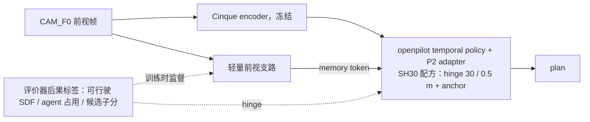

# 下一轮方向与计划

2026-10-09 改写。合并并取代 10-08 的两份规划稿（原 `plan.md` 与 `fable_plan.md`，后者已删），按 10-09 与用户讨论后定下的方向重排。
今晚的执行清单在 [overnight.md](overnight.md)。记号：d### 指 `research/decisions/###.md`；「推」是从已记录的数算出来的；「估」没有测量依据。
本稿没有提交 job、没有改代码。box 上只做了一件事：删掉 AlpaSim part004 校验失败的分片并排了重拉（第 2.2 节）。

## 0. 定下的方向

1. **方法和夺冠分成两条线，互不绑定。** 论文线要新颖，比赛线只做工程细节。
2. **论文线**：评价器给出的后果信号（可行驶 SDF、agent 占用、候选子分）用来监督表征，不只监督 plan 头和选择器。
   载体是一条轻量前视支路，经现有 adapter memory 通道进 openpilot temporal policy。
3. **不借别人的强模型。** WA-JEPA 的 encoder（WA-Cf）、WA-JEPA 整模型、garage checkpoint 都不进方法，也不进参赛 driver；
   V-JEPA 2.1 ViT-L 只作重量级参照臂。上限对照用真值几何 oracle，不用竞品表征。
4. **目标改写**：不承诺追平 WA-JEPA 的 navtest 91.71。目标是不用多视角视频预训练、以很小的成本拿回大部分差距；
   分数增量另从 navhard（离轨行）和 AlpaSim（at-fault 零分）拿。
5. **比赛线**：driver 是 AP2（d189）。做 NC、DAC、progress、冷启动、时延这些细节；navtest / navhard 上过线的改动按 AlpaSim 输入标准重训后才进提交。
6. **顺序**：今晚只做 navsim / navhard 上有基准的三件事；AlpaSim 全量公开 scene 等数据落盘再跑。
7. 一句话主张的调性等实验读数再定。工作表述：评价器该监督「怎么看路」，而不是只在输出端挑轨迹；对照是 future-latent 预训练。

d177 第 3 点相应改为：「从后果学」保留；「冻结工业表征」改为「工业 policy 加一条后果监督的表征支路」；判据仍是跨榜迁移。

## 1. 现在的位置

| 榜 | 我们最好的 | WA-JEPA | 差 | 相近臂之间能分辨的效应 |
|---|---|---|---|---|
| navtest EPDMS（12 146 token） | 90.08，SH30 + selector 门 B（d193）；SH30 89.55（d170） | 91.71 | −1.63 [−2.25, −1.01] | ±0.15–0.3 |
| navhard two-stage（225 组，G 帧） | 35.21（d193）；SH30 33.67，S1 75.90 / S2 44.68 | 35.41，S1 81.90 / S2 43.53 | −0.20 [−3.95, +3.67] | ±1.5–2 |
| HUGSIM 64 HD | 0.439，SH30（d170）；加 selector 0.437（d194） | 0.451（d138） | 无同口径配对 | ±0.01–0.03 |
| WOD-E2E RFS | test 8.099，val 8.187（WLG，d180 / d169） | val 零样本 7.587（d183） | 不对等 | val ±0.17 |
| AlpaSim nuPlan，本地 48 个公开 scene | SH30 0.9465，AP2 0.9320（d185 / d189） | 0.9777（d188） | 一个零分 scene = 0.021 | 48 scene 不能下结论 |

显著落后的只有 navtest。navhard 的 S1 落后、S2 持平或略高；榜上 scorer 族在 48–61，我们和 WA-JEPA 都在榜尾，论文里要如实对比。

### 1.1 navtest 的差距在哪（SH30 对 WA-JEPA，−2.16）

按转角分桶（`experiments/op_parity/results/strong_hinge/navtest_strata.md`；贡献为推：差 × token 数 / 12 146）：

| 桶 | token | SH30 | WA-JEPA | 差 | 对总差距的贡献 |
|---|--:|--:|--:|--:|--:|
| > 45° | 1 517 | 79.49 | 87.41 | −7.92 [−9.77, −5.90] | −0.99 |
| 20–45° | 1 637 | 83.35 | 88.23 | −4.88 [−6.47, −3.25] | −0.66 |
| 5–20° | 2 592 | 89.81 | 90.65 | −0.85 | −0.18 |
| < 5° | 6 400 | 93.41 | 94.05 | −0.64 | −0.34 |

四分之三的差距在占 26% 的转弯 token 上；左转 −6.42、右转 −7.38。子分（SH30 对 WA-JEPA）：NC 98.60 / 99.40，DAC 97.13 / 98.20，TTC 98.00 / 98.89，
LK 97.37 / 98.44，EP 87.16 / 87.87，DDC 99.48 / 99.71。差距主要在乘性项 DAC 与 NC。

**急弯「转不过去」没有修掉。** > 45° 上 DAC 失败 10.18% → 9.03%（强 hinge，d170），降的是切内角（4.78% → 4.28%）；
转不过去 2.60% → 2.47%，CI [−0.42, +0.15]，没动；> 45° 对 WA-JEPA 的 7.9 分差从 RMH10 起就没变。
d153：急弯失败里切内角占 54%、转不过去占 26%。d166：WA-Cf 的增益正落在「转不过去」上，hinge 够不到。
selector 门 B 在转弯桶 +2.93（EC 吃掉 0.86），只在开环成立，HUGSIM 闭环为 0（d194）。
B2D 路口的 forced 急弯（R < 10 m，d122 / d127）也仍是 0/3 与 1/12，那条 lane 已暂停。

### 1.2 冻结表征是上限（论文线的依据）

- d147：同一 thin head，Cinque 视觉的 DAC 失败 5.12%，WA-Cf 3.41%；差距约 2/3 起于冻结 encoder。
- d160：WA-Cf 作 memory，pilot navtest +0.95 [+0.47, +1.37]，> 20° DAC −1.33 pp，NC + TTC −0.63 pp。memory 通道是唯一验证过的入口。
- d165：冻结 V-JEPA 2.1 读路沿与 WA-Cf 一样准（> 45° 0.91 对 0.86 m），对 planner 却没用（闭合 0.35）。缺的是驾驶目标的监督，不是几何本身，也不是 backbone 大小。
- d166：只给真值 SDF 与 ego 的小 decoder，> 20° DAC 失败 6.82%，WA-Cf 6.88%；但真值边界直接喂 plan 通路没有被读。证据强度中偏弱。
- d192：同一 margin 头，冻结 Cinque 0.475 m，WA-Cf（1/4 数据、单帧）0.392 m；10 万 token 处曲线仍在降。
- d158：agent hinge 在冻结特征上 loss 不降。d191 / d193 / d194：冻结特征上的选择器开环 +0.53，闭环 0。

### 1.3 AlpaSim 本地 48 scene 的丢分（推，来自三份逐 scene 表）

scene score：at-fault 碰撞、offroad、出 4 m corridor 任一项为 0，否则 `min(progress / 0.8, 1)`。

| driver | 均分 | 丢分（scene 当量） | 零分 | 偏慢 |
|---|--:|--:|---|---|
| SH30 | 0.9465 | 2.57 | 2.0（78%），2 个 at-fault 碰撞，均在减速到 3 m/s 以下时 | 0.57，11 个 scene |
| AP2 | 0.9320 | 3.26 | 3.0（92%），3 个 at-fault 碰撞 | 0.26，4 个 scene |
| WA-JEPA（参照） | 0.9777 | 1.07 | 1.0，1 个 offroad | 0.07 |

SH30 与 AP2 共撞 4 个不同的 scene，只有 1 个共有；逐 scene 取较好者是 0.974。重复运行的方差没量过，不重合的碰撞可能部分是噪声。
这 48 个 scene 全来自同一天同一辆车的 Las Vegas 采集，没有出现 offroad 或出 corridor 的零分，急弯和近距前车这两类已知弱点没有被采到。
本地零分率 4.2% / 6.3%，榜首 0.940 对应约 6% 零分：真正未知的是本地到私有集的落差，不是这张表。

## 2. 两条线

### 2.1 论文线：后果监督的轻量表征支路

- **机制**：支路只在训练时接受后果标签监督（稠密 SDF 场、agent 占用、局部候选族 F19 的子分，d190 的 held-out 标签），
  plan 模仿与强 hinge 经 memory 通道回传。推理只用图像、ego、command，不用地图。
- **支路大小**：取过线的最小者。候选从小到大：Cinque 自身加 LoRA（不加模型）、小 ConvNet 或 DINOv2-S/B（通用小初始化）、V-JEPA 2.1 ViT-L LoRA（只作参照）。
- **输出接口**：latent token 进 memory，SDF 与占用作辅助监督。若 oracle 显示显式几何已够，再试只输出紧凑几何图的最轻形态。
- **离轨行**：真实帧 warp 出横向 ±0.5 m、小幅 yaw 的扰动行（重投影引擎现成，d141），只取 v > 3 m/s 的行以避开 d143 的起步伪影，目标是日志未来在扰动位姿下的重表达。
- **selector**：只作开环榜的按榜成分如实写，不进闭环，不是主线。

**主图**：同一评价器信号放在 plan 头（d170，+0.87）、选择器（d193，+0.53）、支路三个位置各涨多少；外加有无后果头、真值 oracle 上限、支路大小对分数。

**相对文献**（10-08 检索，关键词驱动，「没找到」不等于没有）。已有的：scorer 蒸馏与候选选择（Hydra-MDP、GTRS、DrivoR、iPad、TOAD）；
评测器筛过的伪教师（Drive-JEPA、CLOVER、DriveZero）；离轨恢复数据（RAP、SimScale）；闭环后训练（RoaD、OPTED、MPA 2511.21584）；
video-SSL encoder 的 NAVSIM 适配（WA-JEPA、Drive-JEPA、DA-WAM，辅助目标都是 future latent）。
检索范围内空着的：「后果监督」对「future-latent 预训练」作为表征适配信号的直接对照；同一信号在 head 层对表征层的受控对照；
同一成分在每个榜上的 with / without。机制级新意中偏低，主张靠受控读数成立。

**不利证据**：d145，解冻 Cinque 三个臂都 < +0.5（lr 5e-6、无几何目标、带 anchor）；WA-JEPA Tab.4，stage 1 视频预训练值 +2.2，后果监督能否顶替没有证据；
d166，几何只帮「不出路」，不减切内角；d143 / d146，on-policy 训练让 HUGSIM 起步停滞变多（离轨行只用静态横向扰动，HUGSIM 起步进护栏）；
d137，某些配方让 comma1M 原生相机直路 ADE × 2.6（遗忘护栏）。

**预期**（估）：ViT-L 支路的 navtest 区间是 90.4–91.3，轻量支路更靠下，由 oracle 与大小阶梯给出；navhard 37–40（离轨行 +2 到 +4）；
HUGSIM 0 到 +0.03；WOD 不动，沿用 WLG；AlpaSim 的零分率是否下降要全量公开集才量得出。

### 2.2 比赛线：AP2 加工程细节

**规则要点**（docs/alpasim.md）：注册 10-18 截止，要组织邮箱；每队每 UTC 月 3 次正式提交，失败也计数；warm-up 每 30 天 3 次，只回状态；
公榜 10-31 关闭，4 页技术报告同日截止且不匿名；每 track 两个奖（first place、innovation）；host 队不参奖；排序先按 rank 区间上界，再按 at-fault 距离，最后才是 PCS（issue 166）；
throughput 是整次评测的墙钟预算（issue 139），数值只在提交 status 里，超了算评测失败；仿真时钟等 driver，时延不进控制延迟。

**榜（nuPlan track，2026-10-08 抓取）**

| 条目 | PCS | 平均 scene score | at-fault 距离 |
|---|--:|--:|--:|
| py123d-garage `093`（host，不参奖） | 1823 | 0.9377 | 0.981 |
| SymPhi `sp-1002a` | 1818 | 0.9396 | 0.814 |
| Lucifer AI | 1555 | 0.879 | 0.407 |
| RDY Mobility | 1446 / 1473 | 0.902 / 0.875 | 0.463 |
| 发布版 garage checkpoint（YAX_NAM 等） | 约 1485 | 0.848 | 0.23–0.33 |
| host 直行基线 | 1309 | 0.7995 | 0.258 |
| Lucifer AI `wajepa-s2-20260904` | 1037 | 0.762 | 0.626 |

非 host 队只有 SymPhi 在榜首区间，第二档 0.85–0.90。两支队报告本地好、官方差（issue 191、194）。我们没有任何私有集读数。

**哪些 NAVSIM 上的分能迁移**：NC 对应 at-fault 碰撞零分（我们本地唯一的零分来源）；DAC 里 plan 本身出界的部分对应 offroad 与出 corridor；EP 对应 progress。
不迁移：EC、HC、LK、TLC；对 devkit 跟踪器的预补偿（d161，AlpaSim 用 MPC）；selector 未证实。
navhard S2（3DGS 渲染的离轨后续）是 AlpaSim 最近的离线代理：AlpaSim 里第 3 次决策的 online plan 离日志 1.73 m，离线 0.58 m（d189）。

**工程项**：
- 时延：`drive` 中位 100 ms，其中 CPU warp 58 ms，另有 JPEG 解码 43 ms；搬到 GPU。时延不扣分，但超 throughput 会废掉一次正式提交。
- 容器（均来自 issue）：response 不带 `terminate_session=True`；不解析 GPU 名；torch 支持 sm_90；ONNX 线程数显式设；16 个 replica 的 `get_version` 在 300 s 内返回；read-only root 实测。
- at-fault 碰撞逐例复盘（frame dump 现成）；近距前车多读 1.95 m（d153）是首要嫌疑。
- 执行层规则（lead margin、低通、死区）在 HUGSIM 上被否（d113、d114、d157），但 AlpaSim 的他车是 log replay、不反应，要在 AlpaSim 上单独读一次。
- controller gains 作用有限，不指望。route waypoint 进 adapter 已试过、不采用（d189 的 AR 臂）。

**提交的用法**：先走 warm-up 验容器；#1 尽早交 AP2，读第一个私有集分数和 throughput limit；#2 约 10-22，AP2 加当时在 navtest / navhard 上过线并重训的改动；
#3 定稿，10-28 前交，月底排队长。进了榜首区间比的是 at-fault 距离，定稿前的调参目标是 at-fault 事件数。

**公开集数据**（box，10-08 23:15）：15 个 shard 里 001、002、003、005 已落盘（约 400 scene）；004 的 sha256 校验失败，坏分片已删，
`jev:alpasim-dl2` 会在当前下载退出后重跑 `fetch_data.sh all` 补齐；006–009 在下，010–015 未开始。mirror 总带宽约 6–7 MB/s，剩约 300 GB，估 13 小时。磁盘剩 801 GB。

**由用户定的事**：
- 匿名：报告不匿名，写出「openpilot 冻结 encoder + adapter + hinge」会和队名连在一起，CVPR 审稿人认得出。选项：接受外露；或参赛但不交报告、放弃评奖。要在 #1 之前定。
- 条款：有参赛者转述要求提交物以 Apache-2.0 公开并给 NVIDIA 宽泛许可（issue 188，二手），原文登录后才看得到。
- 注册是否已完成、Docker 机器在哪，本稿没有核到。

## 3. 检验与判定线

线在这里写死；每项开跑前各写一份预登记。先小后大：pilot 规模先读一次，明确为负就停。

| 编号 | 线 | 问什么 | 设计 | 代价（估） | 判定线 | 判负之后 |
|---|---|---|---|---|---|---|
| N1 | 两条线 | NC 失败是哪一类，纵向微调能救多少 | SH30 在 navtest 的约 170 个 NC 失败 token 与 TTC 失败按类型分，标出 WA-JEPA 过了哪些；同路径纵向缩放族的 oracle | 只用现成 bench 输出与 CPU 打分 | 不是 go / no-go；给出每类占比与纵向 oracle 的回收率 | — |
| O1 | 论文 | 一条完美的几何支路最多值多少 | 真值 SDF、真值 agent 占用编成 token 走 memory 通道，d160 的 pilot 协议；臂：SDF、占用、两者、打乱对照 | 几卡时 | navtest pilot 对无 memory 臂 ≥ +0.7 且 CI 下界 > +0.3（WA-Cf 是 +0.95）；另报 > 45° 转不过去与 NC + TTC | < +0.3：缺的不是几何，支路要走更丰富的 latent，轻量路线重估 |
| R1 | 两条线 | 离轨行值多少 | SH30 配方加约 10% warp 扰动行，2 seed；navhard、navtest、AP2 输入标准的离线读数 | 2–6 卡时 | navhard ≥ +2.0 且 CI 下界 > 0；navtest ≥ −0.2；HUGSIM 起步停滞不增、HD ≥ −0.03 | 不进配方 |
| L1 | 论文 | 多小的支路够用 | 同一套后果监督，换 backbone（Cinque LoRA / 小通用初始化 / ViT-L 参照），d160 stage 0 与 pilot | 约 30 卡时，3–4 天 | stage 0 闭合 ≥ 0.5 且 pilot navtest ≥ +0.5、CI 下界 > 0；取过线的最小者 | 都 < 0.3：支路停，论文收缩为现线加离轨行 |
| L2 | 论文 | 后果头有没有用 | L1 主臂对去掉后果头的臂 | 含在 L1 | stage 0 失败率差 ≥ 1.0 pp 且 CI 不含 0 | 主张收缩为「planner 监督的支路」，与 WA-JEPA Tab.4a 同类 |
| F1 | 论文 | 全量与五榜 | 过线支路 + 离轨行，2 seed，五榜；护栏：WOD val ≥ −0.10，comma1M 直路 ADE ≤ 1.2 × 基线 | 40–60 卡时 | 10-20：navtest ≥ 90.8（2 seed 均值）且 R1 过线，才按 CVPR 排 | 不投本轮，比赛不受影响 |
| C0 | 比赛 | 本地零分的真实分布，重复运行的噪声 | 已落盘的全部公开 scene 上跑 SH30、AP2，AP2 重复一次 | 每 400 scene 约 0.35 卡时 | 给出零分分类表与 at-fault 事件数 | — |
| C1 | 比赛 | 碰撞是哪一类 | 碰撞 scene 逐例看 frame dump | 不占卡 | — | — |
| C2 | 比赛 | 两个 driver 是否互补到值得仲裁 | 用 C0 的逐 scene 分数算 best-of-two，扣掉重复运行的噪声 | 0 | oracle 减最好的单个 driver ≥ 0.015 才做分歧门控仲裁 | 不做 |

## 4. 日历

| 日期 | 论文线 | 比赛线 |
|---|---|---|
| 10-09 夜 | N1、O1、R1（[overnight.md](overnight.md)） | 数据继续下载 |
| 10-10 | 读 O1；过线则起 L1 / L2 | 用户：warm-up 与正式提交 #1（AP2）；已落盘 scene 上跑 C0、C1 |
| 10-11 – 10-13 | L1 / L2；R1 全量；N1 指出的 NC 修法 pilot | 全量公开集 C0；warp 上 GPU；碰撞修法 |
| 10-14 | 定支路 | — |
| 10-15 – 10-20 | F1 全量；10-20 go / no-go | 10-18 注册截止 |
| 10-21 – 10-31 | 五榜 × 2 seed 与消融 | 提交 #2（约 10-22）、#3（10-28 前）；报告 10-31 |
| 11-01 – 11-16 | 写作；CVPR 注册 11-10，全文 11-16 AoE | 结果目标 11-15 |

算力：3 卡到 10-31 约 1 650 卡时，d181 量到利用率 56%；上表合计约 150–250 卡时，不需要扩卡。先满的是 CPU（在线解码与 warp）和磁盘。

## 5. 停掉的线

- WA-JEPA 相关全部：WA-Cf 作 memory 的全量、蒸馏、WA-JEPA 作 AlpaSim driver（另有事实：bf16 0.37 s 对 0.1 s 目标，作者称 flow 减到 1–3 步 EPDMS 约 65.5，榜上第三方条目 0.762）。d160 的 +0.95 只留作参照行。
- garage checkpoint 微调参赛；AlpaSim 内的闭环在策学习（公开 scene 即 navtest 的 log，训练过的权重不能再报 navtest / navhard）。
- selector 作为独立主线（门限扫描、时间一致性），等闭环读数再定；hinge 强度扫描（d172）；replay hinge（d161）。
- WOD 上的偏好微调、薄 head、转弯速度先验（d171、d173、d175）；WOD 档冻结在 WLG。
- 冻结特征上的 agent hinge、lead 余量规则、自路沿一致性（d157、d158、d179）；ego 历史探针（d156）；navtrain + WOD 一套权重（d174）。
- factor_wm、重投影 DAgger、世界模型训练场（d177）；B2D / CARLA 的全部 lane（标 paused）。

## 6. 没核实的与未决的

1. 我们的 driver 在私有集上是多少，throughput limit 是多少：只有正式提交能回答。
2. 本地公开集的排序能否迁移到榜单：两支参赛队说不能，主办方说相对排序大致可以。
3. O1 的上限。它决定轻量路线是否成立，也决定「转不过去」能否由几何支路修掉。
4. 自训支路在付得起的 epoch 数内能否到闭合 0.5（WA 的 encoder 端到端训了 139 epoch）。
5. WA-JEPA 的视频预训练是否见过 navtest 的 log（d160、d165 都留着），它决定「差距」是否公平。
6. NAVSIM 分数作为能力证据的外部质疑：MemoryDrivoR 不看当前相机也有 91.1 / 45.0，论文里要一个换掉当前相机的对照臂，还没设计。
7. 直行 token 上局部族的 oracle 没量过；selector 的 fold 标签只有一个 seed。
8. 文献数字多数由小模型从 arXiv HTML 抽取，只核过 OPTED、SimScale、RAP、TOAD 的表与四篇摘要页；prior-art 里只有 MPA 与 PAVE 的摘要页是亲自打开的。
9. 第 2.1 节的预期区间都是从 pilot 或别人的论文折算的，没有一个是量出来的。

## 来源

- 决定：d113、d114、d122、d127、d132、d137、d138、d141、d143 – d147、d153、d156 – d161、d165、d166、d169 – d175、d177、d179 – d181、d183 – d194。
- 仓库：`docs/alpasim.md`；`experiments/alpasim/results/{sh30,wajepa,ap2}_smoke.md`；`experiments/op_parity/results/strong_hinge.md`、
  `strong_hinge/navtest_strata.md`、`full_navtest_arms.md`、`navhard.md`。
- 文献笔记：`research/lit/2026-10-08-*`（只在这台 Mac 上）。
- AlpaSim：榜单 API（2026-10-08）；NVlabs/alpasim issue 139、166、184、188、191、194。
- CVPR 2027：https://cvpr.thecvf.com/Conferences/2027/CallForPapers （注册 11-10，全文 11-16 AoE）。
