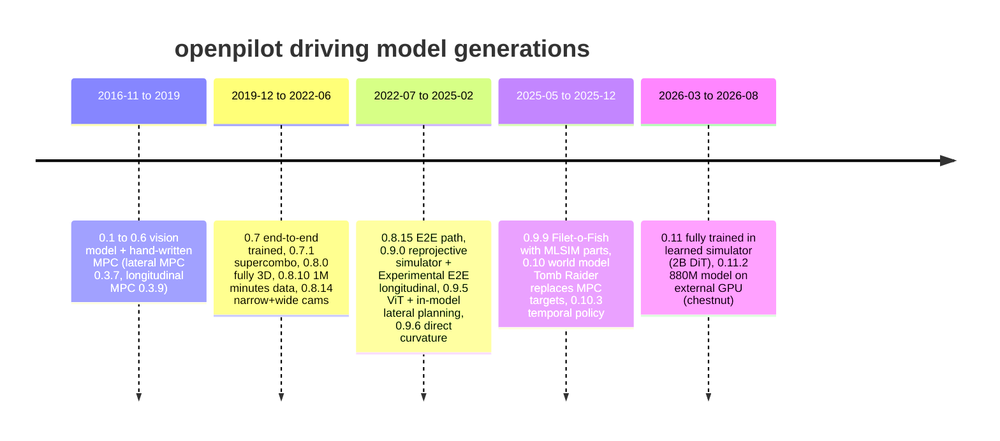

# openpilot 从未打榜，数据也不是最多

截至 2026-09-24，**没有找到任何 openpilot / supercombo 在 CARLA Leaderboard、Bench2Drive、NAVSIM v1/v2、nuPlan、WOD-E2E、HUGSIM 上按标准协议提交或被主流论文放进对比表的记录**；唯一一次公开数据集上的量化评测是 OpenDriveLab 2022 年的 OP-Deepdive（arXiv 2206.08176，2022-06），原版 supercombo 在 nuScenes 上用自定义指标跑出来的结果很差，作者原话是 "we fail to achieve a reasonable result"。openpilot 自 2016-11 的 0.1 到 2026-08 的 0.11.2，训练范式换了五代：vision model 加手写 MPC、端到端 supercombo、reprojective simulator 上的 on-policy 训练、world model 监督，最后到 0.11 "完全在 learned simulator 里训练"。用户的判断拆成两半看。前一半"openpilot 融合了最多的驾驶资源"不成立：它的 world model 用 **2.5M 分钟（约 41.7k 小时）** 视频，NVIDIA Alpamayo 训练用了 **80k 小时私有多相机数据**，车端 policy 一直是小 transformer，而且 openpilot 是只看前视相机、不跟 route 的 L2 系统，从来没有在路口导航类场景上被检验过。后一半"专门驾驶模型强于千问等通用 VLM 微调"作为一般规律也不成立：Bench2Drive 和 NAVSIM 榜首是非 VLM 模型，WOD-E2E 2025 第一名却是 Qwen2.5-VL 3B 的 Poutine，各榜上 VLM 与 specialist 的差距在 0.2–4 分之间，比 RL post-training、expert 对齐、传感器配置这些训练配方带来的差距还小。判断里站得住的部分在量产侧：没有一家量产系统把"开源通用 VLM + driving 微调"放进主控制回路，同配方下 specialist 用少 1–2 个数量级的参数拿到持平的分数。商用级的开源驾驶模型，目前只有 openpilot（L2 售后）一个 open-weight learned 模型真正在消费车上跑；Autoware 是唯一有监管级证据的开源商用 L4，但它是 modular 栈；Alpamayo 的权重默认 non-commercial，NVIDIA 自己把它定位为 teacher。

## openpilot 在六个公开榜上零提交，接口不兼容是主因

本节的检索方式是论文检索加榜单关键词搜索，没有逐行翻 NAVSIM HuggingFace 榜、Bench2Drive 榜和 leaderboard.carla.org 的全部提交，所以"未发现"指搜索没有命中，不等于逐行核对过。在 "openpilot" 加 Bench2Drive / NAVSIM / CARLA leaderboard 的检索里，返回的全是 TransFuser、Hydra-MDP、LEAD/TFv6 这类方法（[Bench2Drive](https://arxiv.org/html/2406.03877v2)、[carla_garage](https://github.com/autonomousvision/carla_garage/blob/leaderboard_2/README.md)）。2025 年一篇用 CCTest 加 CARLA Leaderboard 比较"四个端到端 autopilot"的论文，评的是 InterFuser、MILE、TransFuser、LMDrive，没有 openpilot（[arXiv 2501.12090，2025-01](https://arxiv.org/abs/2501.12090)）。comma 自己的 world model 论文只做了三类评测：MetaDrive 里的 on-policy unit test（lane convergence 24 个场景、lane change 20 个场景）、1500 个 holdout segment 上的 off-policy trajectory MAE，以及真实车队的 engagement 比例，全文没有提 nuScenes、NAVSIM 或 CARLA benchmark（[arXiv 2504.19077，2025-04](https://arxiv.org/html/2504.19077v1)）。

唯一的公开数据集量化来自 OP-Deepdive。作者拿不到 comma 的训练代码和数据，只能自己复现一个模型，再把原版 supercombo（openpilot 2020 年起视觉、标定和规划合一的网络）也跑一遍。指标是自定义的：按距离分段的平均 Euclidean 误差（D.E.）和 AP@0.5/1/2 m 命中率，和 UniAD/VAD 论文里的 nuScenes L2/collision 不可比（[OP-Deepdive PDF §4](https://arxiv.org/pdf/2206.08176)）。

| 模型（nuScenes，OP-Deepdive Table 2） | D.E. 0–10 m | D.E. 10–20 m | D.E. 20–30 m | D.E. 30–50 m | AP@1 0–10 m |
|---|---|---|---|---|---|
| 原版 supercombo | 1.96 | 5.80 | 8.54 | 11.36 | 0.408 |
| OP-Deepdive 复现 | 2.02 | 4.39 | 5.25 | 6.51 | 0.510 |
| supercombo 在 nuScenes 上 finetune | **1.39** | **3.57** | **4.78** | **6.25** | **0.568** |

原版 supercombo 在远距离段的误差是 finetune 版的近两倍；作者把失败归因于 nuScenes 不是 30 FPS。换到 comma 自家的 comma2k19 高速数据上，原版 AP@0.5(0–10 m) 为 0.797，表现正常（[GitHub OpenDriveLab/Openpilot-Deepdive](https://github.com/OpenDriveLab/Openpilot-Deepdive)），所以这组数字反映的是 domain、帧率和相机不匹配，不能用来判断 supercombo 本身的能力。OP-Deepdive 里的 CARLA 只用来验证双模型部署的逻辑是否正确，给的是定性轨迹图，没有 DS。

学术界用 openpilot 做闭环实验的工作不少，但几乎全在 security / dependability 方向，报告的是攻击成功率和 hazard rate，不是驾驶能力分数。DSN 2022 在 openpilot + CARLA 上做 context-aware 攻击，hazard 成功率 **83.4%**，其中 99.7% 没有触发任何告警（[arXiv 2204.06768，2022-04](https://arxiv.org/abs/2204.06768)）；ASIA CCS '25 针对 ACC 感知的攻击用的是 openpilot v0.8.9 + CARLA 0.9.11，关掉人类干预时成功率 100%，打开后 82.6%（[arXiv 2307.08939，2023-07](https://arxiv.org/html/2307.08939v4)）；此外还有 Dirty Road Patch（[arXiv 2009.06701，2020-09](https://arxiv.org/abs/2009.06701)）、DSN 2025 的 adversarial patch 防护（[arXiv 2504.18990，2025-04](https://arxiv.org/abs/2504.18990)），以及一篇已被作者撤回的 bit-flip fault injection（[arXiv 2604.03753，2026-04](https://arxiv.org/abs/2604.03753)）。这些工作基本停在 0.8.x（2021–2022 年的 supercombo），没有跟到 world model 训练出来的新模型。

打不了榜的原因是结构性的，不是 license 问题：ONNX 权重就在仓库里，OP-Deepdive 在 CARLA 里跑的就是它。障碍主要有四层。第一是输入：模型只接收经过外参 warp 到标准 virtual camera 的前视 narrow + wide 两路图像，resize 到 128×256，依赖高帧率连续视频（[OP-Deepdive §3](https://arxiv.org/pdf/2206.08176)）；0.11 的 policy 用 2 s、5 fps 的上下文（[blog 0.11](https://blog.comma.ai/011release/)）。NAVSIM 和 nuScenes 只有 2 Hz 关键帧，喂不进去。第二是没有 route 输入：0.9.5 曾把导航指令（left/straight/right 三值、覆盖 ±500 m）作为输入，0.9.7 为了降低训练栈复杂度把它从 Experimental mode 中移除（[blog 0.9.5](https://blog.comma.ai/095release/)、[blog 0.9.7](https://blog.comma.ai/097release/)）。Bench2Drive 需要在路口按 route 转弯，supercombo 做不到，只能靠 desire（openpilot 的变道意图输入）变道。第三是输出格式：旧版 supercombo 输出一个长度 6609 的张量，把 plan、lane line、lead、pose 编码在一起；0.11 直接输出 steering 和 acceleration，要转成 4 s waypoint 就得额外写一层适配。第四是控制：执行依赖 car-specific tuning。**把这些适配全部补上之后，打出来的分数主要反映适配层，而不是模型本身（推断）。**

comma 从没公开解释过为什么不打学术榜，我们没找到 George Hotz 或员工的直接引语。间接证据指向同一个方向：comma 的论文写到，off-policy trajectory MAE 更低的策略在 on-policy 测试中反而失败，因此把车队 engagement 当作主指标（[arXiv 2504.19077](https://arxiv.org/html/2504.19077v1)）；0.11 的版本对比也只用 LPIPS、高速 speed convergence 和 "percentage of segments with Experimental mode enabled"（[blog 0.11](https://blog.comma.ai/011release/)）。open-loop 数据集在 comma 看来有误导性，渲染仿真又和真实图像差得太远，学术榜的两大类正好都被他们排除了。**这一层是推断，不是 comma 的原话。**

## 十年五代训练范式，把手写规则逐层换成 learned 模块

openpilot 的主线是一步步去掉手写规则：先让 path 由模型直出，再让 longitudinal 由模型直出，然后用 world model 的 plan 替代 MPC（model predictive control，按动力学模型滚动优化控制量）的训练目标，最后用 learned simulator 替代 reprojective simulator（按估计深度把真实视频重投影到偏移位姿、生成反事实视角的仿真器）。下图中的日期取自 `RELEASES.md` 和各版 release blog。

| 阶段 | 代表版本与日期 | 训练范式的关键变化 | 数据规模（comma 自述） |
|---|---|---|---|
| 1 | 0.1（2016-11-29）– 0.6（2019-07） | vision model 出 lane line/lead，MPC 做横纵向；0.6 "double the pixels and ten times the temporal context" | "crowdsourced data"，未给量 |
| 2 | 0.7（2019-12-13）、0.7.1 supercombo（2020-01）、0.8.0 fully 3D（2020-11） | 端到端训练，标定与驾驶模型合一；0.8.14 同时用 narrow + wide 两路相机 | 0.8.8：5000+ h / 3000+ 用户；0.8.10：1M 分钟（约 16.7k h） |
| 3 | 0.8.15（2022-07）、0.9.0（2022-11-21）、0.9.5（2023-11） | path 改由 E2E 输出；0.9.0 在 reprojective simulator 中训练，"36 hours from scratch"，Experimental mode 端到端 longitudinal；0.9.5 改用 vision transformer | "Trained on a new dataset"（0.9.2） |
| 4 | 0.9.9 Filet-o-Fish（2025-05）、0.10 Space Lab 2（2025-08） | world model "Tomb Raider" 的 plan 取代 lateral MPC 的 action 作训练目标；Experimental mode 的 longitudinal MPC 换成 E2E planning；VAE latent 32×16×32 | 0.10.1：world model 参数 2×、训练 segment 4× |
| 5 | 0.11（2026-03-17）、0.11.2（2026-08-12） | "Fully trained using a learned simulator"；world model 为 2B DiT（Rectified Flow，15 步 Euler）；0.11.2 推出 880M 模型跑外接 GPU | world model 训练用 2.5M 分钟（约 41.7k h） |

来源：[RELEASES.md](https://raw.githubusercontent.com/commaai/openpilot/master/RELEASES.md)、[blog 0.9.9](https://blog.comma.ai/099release/)、[blog 0.10](https://blog.comma.ai/010release/)、[blog 0.11](https://blog.comma.ai/011release/)、[blog chestnut](https://blog.comma.ai/chestnut/)、[blog mlsim](https://blog.comma.ai/mlsim/)。数据列里的数字五年涨了约 8×；阶段 3→5 的核心变化是训练环境，而不是网络结构。

"代"有两种数法。按训练范式是上表五代；按 release 是 0.1 到 0.11.2，每个 minor 版本几乎都换模型。comma 从 2025 年起给模型取代号（Filet-o-Fish、Space Lab 2、Tomb Raider、WMI model），社区 fork sunnypilot 的 model library 收录了 **82+ 或 128+** 个 comma 官方和社区模型，两个数字来自不同页面，未核实（[sunnylink.wiki](https://sunnylink.wiki/models)、[The Comma Space](https://www.thecommaspace.com/category/driving-models/)）。2019–2024 年各代 supercombo 的参数量和输入分辨率官方都没有公开。

comma 公开的效果数字都很局部：0.10 的 Space Lab 把 stop-and-go 中被忽略的低速帧从 78% 降到 52%（[blog 0.10](https://blog.comma.ai/010release/)）；world model 训练的 policy 在车队中的 engagement 为时间 29.92% / 里程 52.49%，reprojective 版为 27.63% / 48.10%（[arXiv 2504.19077](https://arxiv.org/html/2504.19077v1)）。第三方最硬的数据是 Consumer Reports 2020-11 的 ADAS 排名：comma two 78 分第一，Super Cruise 69，Tesla Autopilot 57（[The Drive](https://www.thedrive.com/news/37833/consumer-reports-ranks-this-aftermarket-driver-assistance-kit-above-tesla-autopilot-cadillac-super-cruise)）。不过那次比的是 L2 的车道保持和驾驶员监控体验，不是驾驶智能。官网称 "300+ million miles"、"20,000+ active users"、"56% miles engaged"、"325+ car models"（[comma.ai/openpilot](https://comma.ai/openpilot)），都是 comma 自述；它和 Wikipedia 上 2025 年的 "100M+ 英里、10,000+ 用户" 差得较多，口径未知。**没有找到 disengagement rate 或 per-mile 事故统计**，L2 系统本来也不需要向 DMV 报告。

## "openpilot 融合了最多驾驶资源"在数据、模型和能力范围上都不成立

先看数据。openpilot 的规模在开源里确实罕见，但放到工业界不算大；可比口径下，它比 NVIDIA 一个 teacher 模型的训练集还小一半。

| 系统 | 训练数据规模 | 是否公开 | 来源 / 可信度 |
|---|---|---|---|
| openpilot 0.8.10（2021-11） | 1M 分钟 ≈ 16.7k h | 否 | [RELEASES.md](https://raw.githubusercontent.com/commaai/openpilot/master/RELEASES.md)，comma 自述 |
| openpilot 0.11 world model（2026-03） | 2.5M 分钟 ≈ 41.7k h，前视两路相机 | 否 | [blog 0.11](https://blog.comma.ai/011release/)，comma 自述 |
| comma 公开数据 comma2k19 | 33 h，CA-280 高速通勤 | 是 | [arXiv 1812.05752，2018-12](https://arxiv.org/abs/1812.05752) |
| NVIDIA Alpamayo 1 / 1.5 | **80k h 多相机**，>10 亿图像，300 万条 reasoning trace | 否（开放部分 1.7k h） | [HF model card](https://huggingface.co/nvidia/Alpamayo-1.5-10B)、[NVIDIA Newsroom](https://nvidianews.nvidia.com/news/alpamayo-autonomous-vehicle-development) |
| XPeng VLA 2.0 | "1 亿 clips 极端场景" | 否 | [Electrek](https://electrek.co/2026/04/29/xpeng-vla-2-test-drive-tesla-not-alone-full-self-driving/)，厂商口径，未核实 |
| Tesla FSD v12–v14 | 未公开；v14 参数量"约 10×" | 否 | [Not a Tesla App](https://www.notateslaapp.com/news/2999/tesla-fsds-10x-parameter-update-many-new-features-release-in-september)，厂商口径 |
| Apollo Go（运营规模，非训练集） | 累计 2.4 亿 km 无人驾驶里程（至 2025-10） | 否 | [CNBC](https://www.cnbc.com/2025/11/03/china-baidu-robotaxis-alphabet-waymo-.html) |

读法：openpilot 的 41.7k h 约为 Alpamayo 私有训练集的一半，而且只有前视两路相机，Alpamayo 是 4 路相机起步。Tesla 的车队数据量没有可引用的一手数字，但它的车队规模和城市 FSD 场景覆盖显然远超 20k 个售后设备用户，这一点本报告不给数值。

再看模型。车端 driving policy `driving_supercombo.onnx` 从文件直接读出是 **30.0M 参数**（fp16，每步 0.85 GMAC）；外接 GPU 跑的 0.11.2 大模型 "Lebowski" 实测 **877.4M 参数**，release notes 的 880M 与 chestnut blog 的 "1B" 指的就是它（细节见文末"追问"一节）。本节初版把车端模型写成"由 30× 倒推约 30M，推断"，现在已由权重文件证实。车端算力从 2021 年 comma three 的 Snapdragon 845 到 2025-11 的 comma four 没有变过，模型扩容只能靠外接 AMD RX 9060 8GB（[blog chestnut](https://blog.comma.ai/chestnut/)、[comma four](https://blog.comma.ai/comma-four/)）。作为对照，Alpamayo 1.5 是 10B（Cosmos-Reason2 8.2B + 2.3B action expert），Alpamayo 2 Super 总计 34B（32B VLM + 2.3B diffusion expert；初版写成"32B 与 34B 两说，未核实"，HF card 与 NVIDIA 产品页核对后确认 32B 指 backbone、34B 指总量）。

最后是能力范围，这是用户判断里最容易被忽略的一点。openpilot 是 SAE Level 2：默认模式只做 lane centering 加 ACC，Experimental mode 能为红绿灯和 stop sign 停车，驾驶员必须随时准备接管（[comma.ai/openpilot](https://comma.ai/openpilot)）。它的输入没有 route，没有侧后相机，也没有 LiDAR，执行器受原车 LKAS/ACC 的扭矩和加速度上限约束。Bench2Drive 考的是路口转弯、让行、紧急避让这类城区交互，NAVSIM 考 4 s 多车交互下的 PDMS。这些能力 openpilot 的训练目标里就不包含，它在这些榜上打不出成绩在意料之中。因此"最多的驾驶智能"只在"量产 L2 高速车道保持 + 纵向跟停"这个很窄的 ODD 里才有说服力。

替 openpilot 说句公道话，它的真正长处也在这里。它是唯一一个 open-weight、learned、并且在 325+ 款消费车上真实闭环运行多年的模型（[RELEASES.md](https://raw.githubusercontent.com/commaai/openpilot/master/RELEASES.md)）；它的训练是真正的 on-policy，评测是真实车队的 engagement，而 comma 自己的实验表明，学术界常用的 off-policy 指标会误导策略选择。这些是工程和方法论上的优势，和"融合了最多驾驶资源"不是一回事。还有一个细节：0.11.1 的 driver monitoring 模型 "LM GT3" 改用 **VLM 生成的标签**训练，取代了原来的自定义分类器（[blog 0.11.1](https://blog.comma.ai/0111release/)）。comma 自己也在把通用 VLM 用作数据工具，只是不放进控制回路。

## 榜上 specialist 与 VLM 相差 0.2–4 分，训练配方比主干更关键

下面的 "specialist" 指没有 LLM 主干的模型（TransFuser 系、DiffusionDrive 系、scorer 类）；"VLM-based" 指主干是通用 VLM（Qwen-VL、InternVL、Gemini、Emu3 等）再做驾驶微调的模型；WAM（world-action model，用视频生成模型或 V-JEPA 类 world model 作主干、直接输出动作）单列一类，因为它两边都不属于。

**Bench2Drive（CARLA 220 条短路线；DS 为 route completion 乘违规折扣，SR 为成功率）**

| Method | DS | SR | 类型 | Backbone / 延迟 |
|---|---|---|---|---|
| PDM-Lite（privileged 规则专家，上限参考） | 97.0 | 92.3 | 规则 | — |
| TFv6（LEAD） | **95.2 ± 0.3** | **86.8 ± 0.7** | specialist | RegNetY-032，cam + LiDAR + radar |
| TFv6 camera-only 360° | 91.6 ± 0.7 | 79.5 ± 2.0 | specialist | RegNetY-032 |
| LinkVLA | 91.01 | 74.55 | VLM | InternVL2-1B，C2F 解码 48 ms |
| HiP-AD | 86.8 | 69.1 | specialist | ResNet-50 |
| SimLingo | 85.07 | 67.27 | VLM | InternVL2-1B，34 ms |
| TFv5 | 83.5 | 67.3 | specialist | RegNetY-032 + LiDAR |
| AutoVLA | 78.84 | 57.73 | VLM | Qwen2.5-VL |
| ORION | 77.74 | 54.62 | VLM | 65 ms |

来源：[LEAD Table 5，arXiv 2512.20563（2025-12）](https://arxiv.org/pdf/2512.20563)、[LinkVLA，arXiv 2603.01441（2026-03）](https://arxiv.org/pdf/2603.01441)。纯相机条件下，最好的 VLM（LinkVLA）落后最好的 specialist 0.6 DS；TFv5→TFv6 靠 expert 对齐和传感器配置涨了 11.7 DS，远大于主干类型带来的差距。换到 Longest6 v2 长路线，TFv6 62 DS，SimLingo 22，HiP-AD 7，说明短路线会掩盖长时误差积累。

**NAVSIM v1 navtest（PDMS，human 94.8）**

| Method | PDMS | 类型 |
|---|---|---|
| DA-WAM | 93.7 | WAM / scorer（V-JEPA 2.1）— 仅见二手评审页，未核实 |
| DriveSuprim | 93.5 | specialist scorer — 仅见聚合站，未核实 |
| SimWAM | 91.5 | WAM |
| DiffusionDriveV2 | 91.2 | specialist（ResNet-34 + GRPO） |
| SGDrive | 91.1 | VLM |
| ReCogDrive | 90.8 | VLM + diffusion planner |
| DriveVLA-W0 | 90.2（自报 improved 版约 93.0，配置未核实） | VLM / world model（Emu3 系） |
| AutoVLA | 89.1 | VLM（Qwen2.5-VL） |
| DiffusionDrive | 88.1 | specialist（约 60M） |

来源：[SimWAM Table 1，arXiv 2608.07468（2026-08）](https://arxiv.org/pdf/2608.07468)、[DiffusionDriveV2，arXiv 2512.07745（2025-12）](https://arxiv.org/abs/2512.07745)、[Pith 对 arXiv 2608.19085 的评审](https://pith.science/paper/2608.19085)、[sota2 聚合页](https://www.sota2.com/research/sota/open-loop-autonomous-driving-planning-on-navsim)、[DriveVLA-W0，arXiv 2510.12796（2025-10）](https://arxiv.org/pdf/2510.12796)。只看已核实的行，specialist DiffusionDriveV2 与 VLM SGDrive 相差 0.1；DiffusionDrive→V2 只加 GRPO 就涨了 3.1，比任何"VLM vs specialist"的差距都大。

**NAVSIM v2（navtest one-stage EPDMS，human 90.3；navhard two-stage EPDMS 的 Stage 2 用 3DGS 合成扰动后观测）**

| Method | navtest EPDMS | navhard EPDMS | 类型 |
|---|---|---|---|
| SimWAM | **90.2** | **37.6** | WAM |
| DriveFine（RL） | 89.7 | 30.5 | VLM |
| DriveLaW | 88.6 | 30.6 | world model |
| SGDrive | 86.2 | 25.5 | VLM |
| DriveVLA-W0 | 86.1（EC 仅 58.9） | 24.4 | VLM / world model |
| DiffusionDrive | 84.5 | 27.5 | specialist |
| ReCogDrive | 83.6 | 25.7 | VLM |
| TransFuser | 76.7 | 23.1 | specialist |

来源：[SimWAM Table 2/3](https://arxiv.org/pdf/2608.07468)。navtest 上 VLM 能比 DiffusionDrive 高 1–5 分，到了 navhard 反而普遍低于它（24–26 vs 27.5），只有经过 RL 的 DriveFine 例外。VLM 在 navtest 上的高分没有转化成对扰动后状态更好的泛化。ICCV 2025 NAVSIM v2 challenge 第一名 SimpleVSF（private_test_hard 53.06）是"传统 trajectory generator + VLM 打分融合"的 hybrid（[arXiv 2510.17191，2025-10](https://arxiv.org/html/2510.17191v1)）。

**WOD-E2E 2025 challenge（test set RFS，满分 10；RFS 为 rater 对长尾场景轨迹打的偏好分）**

| Rank | Method | RFS | ADE | 类型 / backbone |
|---|---|---|---|---|
| 1 | Poutine | **7.986** | **2.741** | VLM：Qwen2.5-VL 3B，GRPO 以 RFS 为 reward |
| 2 | UniPlan | 7.779 | 2.986 | specialist：DiffusionDrive（约 60M） |
| 3 | HMVLM | 7.736 | 3.071 | VLM：Qwen2.5 |
| 4 | DiffusionLTF | 7.717 | 2.977 | specialist：DiffusionDrive |
| 5 | AutoVLA | 7.556 | 2.958 | VLM：Qwen2.5，RL 以 ADE 为 reward |
| baseline | NaiveEMMA | 7.528 | 3.018 | Gemini Flash |

来源：[WOD-E2E Table 8，arXiv 2510.26125（2025-10）](https://arxiv.org/html/2510.26125v1)、[Poutine，arXiv 2506.11234（2025-06）](https://arxiv.org/abs/2506.11234)。这是唯一一个 VLM 明确拿第一的榜，但领先 specialist 只有 0.21 RFS。更关键的对照在同为 Qwen2.5 主干的两个方法之间：Poutine 用 RFS 作 reward，AutoVLA 用 ADE 作 reward，后者 7.56，低于两个 60M specialist。起决定作用的是 reward 是否对齐评测指标，而不是有没有用 VLM。2026 年没有正式 challenge，leaderboard 仍然开放（[WOD-E2E v3](https://arxiv.org/html/2510.26125v3)）。

这四张表合起来，对用户假设的后一半给出了相当明确的回答。"specialist 天然胜过 VLM 微调"不是普遍规律：榜首归属随 benchmark 而变，差距在 0.2–4 分之间，RL post-training、expert 对齐、传感器配置、reward 设计这些配方差异带来的波动比它更大。假设里站得住的部分在效率上：同配方下，specialist 用 60M 级参数就能打平 1–8B 的 VLM，延迟也低（SimLingo 34 ms 是 VLM 里的特例，LinkVLA 自回归版要 361 ms）。VLM 的优势目前只在人类偏好型的长尾指标和语言指令跟随上看得到，例如 LinkVLA 在 Bench2Drive 指令子任务上 Lane Change 达 97.42%。另外，2026 年 NAVSIM 榜首附近的 SimWAM、DA-WAM、DriveLaW 都是 video / JEPA world model 主干，"specialist vs VLM"这个二分法本身已经在失效。

量产侧和榜单的证据方向一致：**没有一家量产系统把开源通用 VLM 的 driving 微调放进主控制回路**。Li Auto 的 MindVLA 采用 LLM base "designed and trained from scratch" 的 MoE（[CnEVPost](https://cnevpost.com/2025/03/18/li-auto-unveils-mindvla-autonomous-driving-architecture/)）；XPeng VLA 2.0 去掉了 vision→language→action 的显式语言中间层，公司还在采访中称语言对驾驶可能是 "poison"（[Electrek 2026-06](https://electrek.co/2026/06/05/xpeng-vla-interview-cvpr-language-poison-tesla-fsd/)，只读到标题）；Waymo 的生产栈是 fast 端到端 driver 负责实时控制、Gemini 训练的 VLM 作慢速 reasoning partner，理由是纯 VLM "too slow for real-time control"（[Waymo blog 2025-12](https://waymo.com/blog/2025/12/demonstrably-safe-ai-for-autonomous-driving/)，经搜索摘要，未读全文）；EMMA 仍是研究模型（[Waymo EMMA blog](https://waymo.com/blog/2024/10/introducing-emma/)）。Tesla FSD 是单一端到端网络，v14 只加入了"小版本"的语言 reasoning（厂商口径）。所以量产对用户直觉的支持方式是"要自研驾驶专用 foundation model"，而不是"要用 openpilot 这类小 specialist"。

## 商用级开源驾驶模型只有三种形态，且都不是 open-weight E2E 上 L4

| 项目 | 类型 | 开放内容与 license | 真实部署证据 | 公开 benchmark |
|---|---|---|---|---|
| openpilot（comma） | learned E2E，L2 售后 | 代码 + 权重，MIT | 325+ 车型，20k+ 用户，300M+ 英里（均为 comma 自述）；CR 2020 第一 | 无标准榜 |
| Autoware（TIER IV） | modular 栈；2026-03 新增 hybrid/E2E 分支 | 开源 | **日本 L4 认证与 permit**；小松市付费巴士 18,000+ 人次（至 2025-02） | 无 |
| Baidu Apollo 开源版 | modular 栈 | Apache-2.0，最新 11.0 | Apollo Go 跑的是 enterprise 版，不是开源版 | 无 |
| NVIDIA Alpamayo 1/1.5/2 Super | reasoning VLA，10B/10B/34B | 权重 OpenMDW-1.1；R1 card 写 non-commercial，NVIDIA 2026-08-04 blog 称全家族可商用，两处冲突（初版只写了 non-commercial） | model card 只写 "on-vehicle road tests"；NVIDIA 定位为 teacher | 1.5：AlpaSim 1.37±0.10，minADE@6.4s 0.916 m；2 Super：1.50±0.13，0.911 m |
| Xiaomi MiMo-Embodied | 驾驶 + 具身 VLM | 开放权重 | 问答型基础模型，不在车载控制回路 | 自称 12 个驾驶 benchmark SOTA |
| DiffusionDrive / UniAD / Hydra-MDP 等 | 学术 E2E planner | MIT 等 | 至多实车 demo 视频 | NAVSIM 88.1（DiffusionDrive）等 |

来源：[comma.ai/openpilot](https://comma.ai/openpilot)、[TIER IV 2023-10](https://tier4.co.jp/en/updates/press-release/20231020)、[Automotive World](https://www.automotiveworld.com/news-releases/tier-iv-certified-for-level-4-autonomous-bus-service-in-ishikawa-prefecture/)、[TIER IV 2026-03](https://www.prnewswire.com/news-releases/tier-iv-unveils-ai-based-level-4-autonomous-driving-accelerating-global-platform-expansion-across-japan-us-and-europe-302714131.html)、[Apollo issue #12283](https://github.com/ApolloAuto/apollo/issues/12283)（搜索摘要转述，非百度官方原文）、[HF Alpamayo-R1](https://huggingface.co/nvidia/Alpamayo-R1-10B)、[HF Alpamayo-1.5](https://huggingface.co/nvidia/Alpamayo-1.5-10B)、[MiMo-Embodied，arXiv 2511.16518（2025-11）](https://huggingface.co/papers/2511.16518)、[DiffusionDrive](https://github.com/hustvl/diffusiondrive)、[Hydra-MDP，arXiv 2406.06978（2024-06）](https://arxiv.org/html/2406.06978v1)。表中能满足"商用"这一条的只有前两行，而且一个是 L2 售后，另一个是限定 ODD 的低速 modular 栈。

按部署证据的强度分三层。第一层是开源栈直接商用：Autoware 经 TIER IV 取得日本 L4 认证和 permit，驱动付费巴士，但它是 modular 栈，服务在固定线路、低速、限定 ODD 内；它 2026-03 发布的 AI/E2E 栈在东京、匹兹堡、慕尼黑都还只是带 safety driver 的测试。第二层是开源栈的同源闭源版商用：Apollo 开源版与 Apollo Go 之间就是这种关系，Apollo Go 的里程不能算作开源 Apollo 的部署证据。第三层是 open-weight learned 模型直接上车：到目前为止只有 openpilot。

最容易被误读的是 Mercedes CLA。Electrek 写 CLA "ship with Nvidia's entire AV stack, including the new Alpamayo reasoning capabilities"（[Electrek](https://electrek.co/2026/01/05/nvidia-unveils-open-source-ai-for-autonomous-driving-ships-in-mercedes-benz-cla-in-q1-2026/)），但 NVIDIA 自己的 CLA 技术博客只写了 "AI end-to-end stack for core driving, alongside a parallel classical safety stack"，没有提到 Alpamayo（[NVIDIA Blog](https://blogs.nvidia.com/blog/drive-av-software-mercedes-benz-cla/)）。NVIDIA 对 Alpamayo 的官方定位是 "teacher models that developers can fine-tune and distill"（[NVIDIA Newsroom](https://nvidianews.nvidia.com/news/alpamayo-autonomous-vehicle-development)）。**比较合理的解读是：同一技术家族的能力被蒸馏进了闭源的 DRIVE AV student，车上跑的不是 open weight 本身（推断，缺一手技术说明）。** 一篇行业评论总结得更直白："the vehicle runs a compressed representation of what the teacher learned"，公开数据 1.7k h 对私有 80k h，约 47×（[Automotive Cloudwatch](https://automotivecloudwatch.substack.com/p/alpamayo-moves-the-cost-of-autonomy)）。

## 结论

证据修正了用户判断里的两个隐含前提。第一，"驾驶专用"和"驾驶资源最多"是两件事：openpilot 是驾驶专用的，但它的数据、模型和 ODD 都属于 L2 高速场景，资源规模不及 NVIDIA 的一个 teacher，更不用说 Tesla 和中国车企的车队；它的独特价值在于 on-policy 训练和真实车队评测，这恰好是学术榜覆盖不到的维度。第二，榜单上决定胜负的变量是配方（RL reward 是否对齐指标、expert 质量、传感器、闭环数据），不是主干是 VLM 还是 specialist。同一个 Qwen2.5 主干，换 reward 就能在 WOD-E2E 上从第五名变成第一名。量产侧的共识介于两者之间：主回路用自研驾驶 foundation model 或紧凑的 E2E 网络，通用 VLM 退到慢速 reasoning、自动标注和 teacher 的位置，comma 用 VLM 给 DM 模型打标签也是同一种用法。开放世界里，"商用级"与"open weight 的 E2E 模型"这两个条件目前还没有同时被满足过。

## 对 jev-drive 的含义（推断，未经实验验证）

我们的设置是 frozen VLM feature 加 thin planning head，在 WOD-E2E、NAVSIM、Bench2Drive 上评测。上面的证据带来三点推论。其一，**不需要为"用了 VLM 主干"辩护，也不应指望主干本身带来分数**：同配方下 VLM 和 specialist 差 0.2–4 分，所以 thin head 的训练配方（RL 或 reward 是否对齐 RFS / EPDMS、闭环数据、expert 质量）很可能比换哪一个 VLM 更影响结果。可以用同一 frozen feature 分别做 imitation-only 和 metric-aligned post-training 的 head 来验证，如果后者的增益大于换 backbone 的增益，这条推论就成立。其二，**WOD-E2E 是 VLM feature 最可能占优的榜**（长尾、人类偏好型 RFS），NAVSIM navhard 和 Bench2Drive 长路线则是 VLM 类方法普遍弱的地方；报告结果时应按 benchmark 分开下结论，并把 DiffusionDrive（约 60M）作为同配方的 specialist 对照，而不是只和其他 VLM 比。其三，openpilot 不适合作为我们的 baseline：接口不兼容（前视两路、无 route、5 fps 视频上下文），适配层会主导分数；它的 world model 训练和"off-policy 指标会误导"的结论，倒是值得作为我们闭环评测设计的方法论参考。要验证这一点，可以看我们的 head 在 open-loop 指标（L2 / ADE）上的排序和在 Bench2Drive DS 上的排序是否一致。

## 追问：Alpamayo 规格、openpilot 最新可下载模型、通用驾驶能力的证据（2026-09-24 补充）

本节回答三个追问：Alpamayo 到底多大、吃什么吐什么、多少 Hz；openpilot 能下载到的最新最强模型是哪个；按"通用驾驶能力"而不是按榜单调优来看，这些大驾驶模型的证据是什么。来源 notes 在 `research/lit/research_notes/开源驾驶模型与OpenPilot打榜现状/` 下的 `alpamayo_specs.md`、`openpilot_latest_model.md`、`other_open_models_and_scaling.md`。

### 两个模型的接口

| | Alpamayo 1 / 1.5 | Alpamayo 2 Super | openpilot 车端（0.11.x） | openpilot 大模型 Lebowski（0.11.2） |
|---|---|---|---|---|
| 参数 | 8.2B VLM + 2.3B action expert ≈ 10B | 32B VLM + 2.3B diffusion expert ≈ 34B | 30.0M | 877.4M（99.5 GMAC/步） |
| 相机 | 4 路（front-wide、front-tele、cross-left、cross-right），320×576 | 6 路环视 | 前视 narrow + wide，warp 到 128×256（YUV 打包） | 同左 |
| 时序上下文 | 每路 4 帧 @10 Hz（0.4 s）+ ego 历史 16 点 @10 Hz（1.6 s） | 4 帧 | vision 取当前帧和 0.2 s 前帧，feature 历史 25 步 ≈ 5 s | 同左 |
| 导航 | R1：left/right/straight；1.5 / 2：自然语言（"turn left in 200m"） | 自然语言 | **无**（只有 desire 变道脉冲） | 无 |
| 输出 | 6.4 s、64 点 @10 Hz 轨迹（内部是 unicycle 的 accel + curvature），外加 Chain-of-Causation 文本 | 同左 + meta-action、VQA、2D grounding | 33 点非均匀 plan 覆盖 0–10 s，lane line、lead 等；控制量由 plan 插值 | 同左 + `action` 头直接给 curvature / accel |
| 运行频率 | 论文 99 ms（RTX PRO 6000，2 相机、单条轨迹）；公开 1.5 checkpoint 4 相机×4 帧、6 条轨迹实测 717 ms ≈ 1.4 Hz，优化后 151 ms ≈ 6.6 Hz；Jetson Thor ≈ 944 ms | 单卡 H100 峰值显存 72 GB | 20 Hz | 20 Hz（外接 RX 9060） |
| 训练数据 | 80k h 私有多相机，25 国 2500+ 城市；公开 PhysicalAI-AV 1.7k h | ≈115k h | world model 2.5M 分钟 ≈ 41.7k h | 同左 |
| 获取 | HF `nvidia/Alpamayo-1.5-10B` 等，gated | HF card 2026-08 | `commaai/openpilot` master | HF `commaai/openpilot-lfs`（git 历史里的 `big_driving_supercombo.onnx`），匿名可取 |

来源：[Alpamayo-R1 arXiv 2511.00088（2025-11）](https://arxiv.org/abs/2511.00088)、各版 HF model card、FlashDrive 第三方实测、openpilot 仓库与 HF LFS；openpilot 两列的参数量和 IO shape 是下载 ONNX 后直接读出的。Lebowski 就是 0.11.2 出货版本这一点是**按提交时间线推断**的。master 上当前的大模型是更小的 "Cinque Terre v3"（382M，HF `commaai/openpilot_driving_models`，MIT）。comma 还在 2026-09-01 公开了 `commaai/worldmodel-4B`（MIT）和对应的 autoencoder，0.11 blog 里的 2B DiT 本身没有找到公开权重。

读法：Alpamayo 按公开 checkpoint 的默认配置跑不到实时，NVIDIA 的定位是 cloud teacher，车上跑的是蒸馏出来的 student，而 student 没有公开。openpilot 是真正 20 Hz 闭环的控制器，但只看前方、没有 route。两者的接口几乎不重叠：前者是多相机、带导航、10 Hz 的轨迹 planner，后者是前视、无导航、20 Hz 的 L2 控制器。我们在自己的 RTX PRO 6000 上实测（2026-09-24，[Alpamayo smoke run](../todos/2026-09-24-alpamayo-smoke/README.md)）：Alpamayo 1.5 默认配置 batch 1 单轨迹 p50 983 ms、6 条轨迹 2722 ms，只改配置（SDPA、torch.compile、flow 5 步）能降到 697 / 2184 ms，离 10 Hz 仍差一个量级；6 条轨迹的大头是 HF generate 把图像和 prefill 重复 6 遍。

### Scaling law 在驾驶上成立吗

| 证据 | 规模 | 结论 |
|---|---|---|
| Waymo，[arXiv 2506.08228（2025-06）](https://arxiv.org/abs/2506.08228) | 约 447k h 数据，84 个模型，0.9M–118M 参数 | loss 对 compute 呈 power-law，**closed-loop 失败率也随 compute 按 power-law 下降**；compute-optimal 模型比同 compute 的 LLM 小约 50× |
| Alpamayo-R1 自己的 ablation | backbone 0.5B→7B；数据 500k→2M segments | minADE 降 11%；数据端 0.880→0.874 m，基本饱和 |
| Alpamayo 1.5（10B）→ 2 Super（34B） | 参数 3.4×，数据 80k→115k h | minADE 0.916→0.911 m，AlpaSim 1.37→1.50，差距落在误差条内 |
| NVIDIA，[arXiv 2504.04338（2025-04）](https://arxiv.org/abs/2504.04338) | IL 小模型 | open-loop FDE 按指数约 −0.40 下降，但闭环 MDBF 在约 256 h 处饱和 |
| [arXiv 2412.02689（2024-12）](https://arxiv.org/abs/2412.02689) | IL 小模型 | open-loop 有 power-law，closed-loop 没有 |
| Tesla（厂商口径） | "约 10× 参数"的模型 | 2025-08 说要作为 v14；2026-04 推迟到 v15，理由是小模型进步更快 |

读法：open-loop 指标在驾驶上确实随规模改善；闭环上给出正面证据的只有 Waymo，而且它的最优模型只在 100M 量级。Alpamayo 从 10B 到 34B 几乎没有换来可测的提升。所以"LLM 式 scaling 在车上成立"目前只能部分支持：数据和 compute 在涨，最优参数量却远小于 LLM；闭环能力看起来更依赖 RL、self-play、sim co-training 这类闭环训练信号（推断）。

### 通用驾驶能力的证据：没有人测过

用户问的不是榜单分数，而是不对着某个榜调也能开好车的能力。能回答这个问题的实验是：大驾驶模型**不做微调**，直接在它没见过的 benchmark 或分布上跑。目前的情况是：

- Alpamayo、MiMo-Embodied、Qwen-Drive、Cosmos 系列都**没有发表过** zero-shot 的 NAVSIM、Bench2Drive、WOD-E2E 分数。凡是上榜的数字，都是在目标 split 上训过或微调过的。
- 现有的第三方 zero-shot 测试里，Alpamayo 表现不一：nuReasoning 上 1.5 的 NPS 50.45，全表最低；KITScenes 上 Alpamayo 2 的 planning 最好（MMS 5.06），但推理和动作完全一致的场景只占 14%。两者都是新 benchmark，样本量和可信度都有限。
- 分布迁移带来的掉分，比方法之间的差距大一个数量级：同一方法从 navtest 到 navhard、跨城市（[arXiv 2603.11417](https://arxiv.org/abs/2603.11417)）、到 WOD-E2E long-tail 都会大幅下降，而方法之间在 navtest 上只差几分。所以榜单分差本来就不是通用驾驶能力的好读数。

另外几个可以对比的 open-weight 模型：Qwen-Drive-1.0-4B（Qwen3.5-4B + 1.1B diffusion planner，Apache-2.0，NAVSIM 90.7 / WOD-E2E 7.91，但它的训练集包含 NAVSIM 和 WOD-E2E，这两个分数是 in-domain 的；arXiv 号的年月有待核对）、MiMo-Embodied-7B（MIT，RL 后 NAVSIM 91.0）、DriveVLA-W0（在 70M 帧私有数据上做过 scaling，但只放出 NAVSIM 训练的 checkpoint）。Cosmos-Reason、Cosmos-Predict 和 Vista 是 world model 或 reasoning backbone，不是 planner。用车队级私有数据训练、又放出 planner 权重的，目前只有 Alpamayo 一家。Waymo、Wayve、Tesla、XPeng、Li Auto、DeepRoute、Momenta、Huawei、Horizon 都没有放出权重。

**结论**：用户"大数据量驾驶专用模型应该不差"的判断，现在既没有被证实也没有被证伪，因为这个实验没人做过。Alpamayo 1.5 用 4 路相机加自然语言导航，接口和 WOD-E2E 的 8 路相机、NAVSIM 的 8 路相机都有交集。在我们的 RTX PRO 6000 96 GB 上 zero-shot 跑一遍 WOD-E2E val 和 NAVSIM navhard，就能直接给出"通用大驾驶模型不微调能拿多少分"的第一个公开数字（推断，尚未立项）。openpilot 要吃 20 Hz 连续前视视频，也没有 route，放到这几个榜上都不合适。
