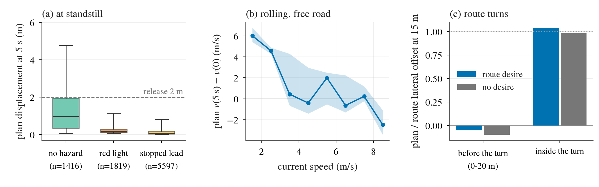
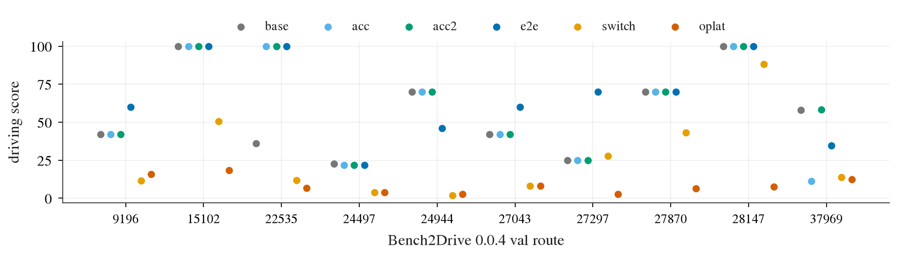
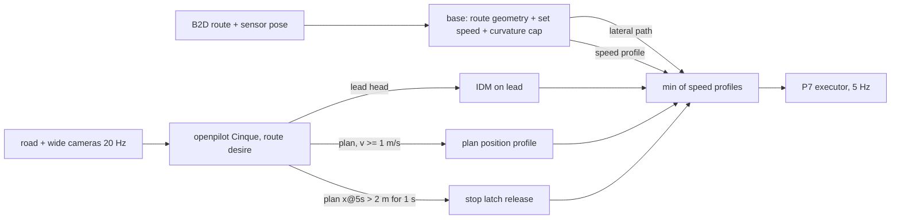

# openpilot 进 Bench2Drive 闭环：为什么起不了步、不转弯，以及「base + openpilot modifier」怎么接

2026-09-28。计划、登记与执行日志在 [todos/2026-09-28-op-closedloop.md](../todos/2026-09-28-op-closedloop.md)，小表在 [results/op_arb/](results/op_arb/)，
代码 `scripts/op_arb_agent.py`（agent 与各仲裁模式）、`scripts/op_arb_server.py`（openpilot server）、`scripts/op_arb.sh`（启动）、`jevdrive/op_arb_report.py`（读数）、`jevdrive/op_arb_figs.py`（图）。
本文供用户与 main 讨论；所有数字都是 GPU 6 测试卡上的小规模 pilot（phase 1 诊断 6 条路线、phase 2 评测 10 条路线，TM seed 0 单次），只能给方向。

## 结论先行

1. **起不了步是模型的静止先验，不是执行层、不是缺车速输入、也不是把前车读错。** native（openpilot 原生 plan → P7）6 / 6 条诊断路线车速始终为 0；
   静止且前方无障碍时 plan 5 s 只走 0.97 m（中位），action accel −0.02，meta 头预测「驾驶员此刻踩刹车」0.80；画面估的自车速度 −0.02 m/s（知道自己停着），前车读得很准（lead_prob 1.00、x 3.9 m）。
   一旦被带到 1 m/s 以上，plan 反而要加速（1–4 m/s 时 5 s 后比当前快 3.5–6 m/s）：缺的只是真车上驾驶员按 resume 的那一下。
2. **不转弯是因为 openpilot 不发起路口转弯，turn desire 在路口前不改变 plan。** 转弯前 0–20 m，带 turnLeft desire 的 plan 在 15 m 处只跟了路线横移的 −5%，不给 desire 的 twin 是 −10%；进弯以后两者都跟 100%。
   闭环里把路口交给 openpilot（oplat）10 / 10 条失败，DS 8.5，3 条 route deviation。
3. **base 本身就很强，这是本研究最需要讨论的一点。** 一个没有任何感知、只按路线走、8 m/s 巡航的 base，在 10 条 dev 路线上 DS 56.6、RC 93.5（native openpilot 是 0，第 33 条 / CL3 / K0 / K1 是 7–10）。
   Bench2Drive 的短路线里，大部分分数来自「按路线走完」，而这正是 openpilot 结构上做不了的那部分。
4. **openpilot 当 modifier 加了东西，但信号弱、噪声大。** 纵向 = min(base, openpilot lead 头 IDM, openpilot plan)、plan 引起的停车锁存到 openpilot 放行（e2e）：DS 66.2，对 base +9.7 [−5.5, +27.0]（4 条好 / 3 条差 / 3 条同）。
   好在：StaticCutIn 36 → 100（lead 头避免了两次追尾）、VehicleTurningRoutePedestrian 25 → 70（没撞行人）、两条路口 42 → 60（没闯灯）；差在：plan 在闭环里频繁把车带停在无事可停的地方
   （42 次锁存里 30 次真值「无障碍」，41 次放行里 24 次靠 20 s 兜底），车均速 0.96 m/s 对 base 2.69，T_Junction 与 MergerIntoSlowTraffic 因此超时或丢分。
   只接 lead 头（acc）两次运行 58.2 / 62.9，对 base +1.6 / +6.3，主要就是 StaticCutIn 那一条；**同配置两次运行在一条路线上差 47 DS**，所以 10 条单 seed 只能给方向。
5. **让 openpilot 横向驾驶（switch、oplat）明显更差**：DS 26.1 / 8.5，对 base −30.5 [−42.6, −19.1] / −48.1。openpilot 自己开时 7 / 10 条出车道、5 条 blocked。
6. **推荐**：base（路线几何 + 巡航）管横向与起步，openpilot 只做纵向 modifier（lead 头 ACC + 行驶中的 plan 约束），停车锁存由 openpilot 自己放行。
   这与 openpilot 真车 experimental 模式的分工一致（驾驶员管路线与 resume），加在外面的东西是通用的几何与一条 IDM；最大的 trick 风险不在这些规则，而在第 3 点：B2D 的分数大半是 base 的。
   论文里 openpilot 的贡献必须用「对 base 的配对差」和按 hazard 归因的违规来报，不能报绝对 DS。
7. **行人在 CARLA 里不要指望 openpilot**（第 55 条：真实 nuScenes 上 AUC 0.83，CARLA P5 上 0.506，只用真实数据改 vision 也带不过来）。27297 上 e2e 没撞行人，更可能是它当时正被 plan 压得很慢。

## 1. 背景：已有的闭环读数

名词：DS（Driving Score，Bench2Drive 闭环总分，0–100）、RC（Route Completion，路线完成百分比）、SR（Success Rate，完成且除 min-speed 外零违规的路线比例）；
P7 是我们验收过的轨迹执行器（第 41 条）；desire 是 openpilot 唯一的「意图」输入，8 类 one-hot（无、左转、右转、左变道、右变道……），按 modeld 的做法只在上升沿给一个脉冲；
openpilot 没有 route、target point，也没有车速输入（车速只从画面估）。

| 来源 | 接法 | 结果 |
|:--|:--|:--|
| 迁移文档 D1（09-25，5 条） | openpilot 原生 plan → Zoo PID | 20 个路线 × 配置里 12 个从头到尾没动 |
| 迁移文档 D5 smoke3（9 条） | 纯 Lebowski / + TCP 起步与路口伙伴 / TCP 单独 | DS 9.9 / 65.4 / 73.9；纯 openpilot 路口 0 / 3；加伙伴后模型只开了 32% 的时间，分数低于 TCP 单独 |
| night-queue-3 CL0 / OPL（09-26） | Cinque / Lebowski 原生 plan → P7；+ TCP 起步 | 3 / 3 条 blocked；加 TCP 起步后伙伴接管 89% 的 tick，按登记不接受 |
| night-queue-3 CL3 / CL6（220 条 × 3 seed） | Cinque `temporal` 上的薄 head 轨迹 → P7 | DS 8.0–9.8、8.8，碰撞 410–470 次 |
| night-queue-4 K0 / K1（220 条 × 3 seed，本文补读） | 同一特征上 `ridge_late` / TFv6 的 route + target speed 表示 | DS 7.2–7.8 / 7.0–7.4，RC 33–35 / 21–22，blocked 54–75 次 |
| 作者执行层参照（CL10） | BridgeDrive / BLUE / SimLingo | DS 96.1 / 88.8 / 86.8 |

所以「openpilot 在 B2D 上 DS 8–10」这个数的来源其实有两类：原生 plan 根本不起步（D1、CL0、OPL），和我们在 openpilot 特征上学的读出（CL3–CL6、K0/K1）一路撞车、卡死。
后者说明「学一个小的 route-conditioned 读出当 base」这条路已经被试过：K1 用的正是 TFv6 高分所依赖的 route + target speed 表示（第 31 条），闭环 DS 没有比 K0 高。

## 2. 失败诊断（phase 1，6 条路线）

两个臂在同一条 openpilot 流上（Cinque，20 Hz，原生 road + wide rig，5 s 预热，后轴变换，路线 desire，P7 5 Hz），只差谁开车：
**native** 是 openpilot 自己的 plan 开；**oshadow** 是只用来诊断的特权司机开（路线几何 + 真值前车 / 行人 IDM + 路线上的红灯停车），openpilot 同帧跑在 shadow 里，
server 上另开一个同帧、desire 恒为 0 的 twin session。每个 openpilot step（每 tick）记下它的全部输出头：plan 的位置与速度、action 头的 accel、
lead 头（前车距离、速度、存在概率 lead_prob）、meta 头（openpilot 预测的驾驶员 gas / brake 踩踏概率，0 s 与 2 s）、desire_pred、pose（画面估的自车速度），
以及只用于评估的真值上下文（路径内前车 / 行人距离、路线上下一个停止线距离与灯色）。路线（Bench2Drive 0.0.4 val，不是 220 考卷）：
334 SignalizedJunctionLeftTurn、27787 VanillaSignalizedTurnEncounterRedLight、24721 HardBreakRoute、26872 NonSignalizedJunctionLeftTurn、26537 ParkingExit、17749 DynamicObjectCrossing。

(a) 静止 tick 上 openpilot plan 5 s 处的位移，按真值情境分组（箱 = 四分位，须 = 5–95%）；(b) oshadow 带着车在无障碍路段行驶时，plan 5 s 处速度与当前速度之差；(c) 路口转弯前 0–20 m 和转弯中，
plan 在前方 15 m 处的横向偏移占路线横向偏移的比例（1 = 跟着路线转，0 = 直行），有 route desire 与无 desire 的 twin 并排。

### 2.1 起不了步：openpilot 在静止时的 plan 本身就是「再等等」

native 6 / 6 条路线车速始终为 0，60 s 后被判 blocked（DS 0）。原因不在执行层：P7 在这些 tick 上做的就是 plan 让它做的事。静止 tick 上的 openpilot 输出：

| 情境（真值） | 步数 / 路线 | plan v@3 s | plan x@5 s | action accel | lead_prob | lead x | gas@0 s | brake@0 s | 画面估车速 |
|:--|--:|--:|--:|--:|--:|--:|--:|--:|--:|
| 无障碍（30 m 内无车无人、40 m 内无红黄灯） | 1 416 / 5 | 0.13 m/s | **0.97 m** | −0.02 | 0.13 | 36 m | 0.03 | 0.80 | −0.02 |
| 红 / 黄灯 ≤ 30 m | 1 819 / 3 | 0.02 | 0.18 | 0.01 | 0.19 | 35 | 0.01 | 0.92 | −0.02 |
| 路径内前车 ≤ 15 m | 5 597 / 3 | 0.01 | 0.08 | −0.04 | 1.00 | 3.9 | 0.02 | 0.86 | −0.03 |

（中位数；native 与 oshadow 合并，分臂的表见 [standstill.csv](results/op_arb/p1/standstill.csv)。）

四点读法：

1. **不是缺车速输入。** 画面估出的自车速度在静止时是 −0.02 m/s，模型知道自己停着。
2. **不是把静止前车读错。** 真有前车时 lead_prob 1.00、lead x 3.9 m，读得很准；没有前车时 lead_prob 0.13。起步失败在无障碍路段照样发生。
3. **是「停着就继续停着」的先验。** 无障碍时 plan 5 s 只走 0.97 m，action accel 甚至是负的；meta 头给出的「驾驶员此刻踩刹车」概率 0.80，「踩油门」0.03。
   这和 openpilot 的真车用法一致：它的训练数据里，车停稳以后何时走由驾驶员决定（按 resume 或踩油门），模型学到的是「人类在这种画面里通常还停着」的条件期望。
   plan 对情境**有排序**（x@5 s 区分「该走」与「该等」的 AUC 0.86，lead x 0.91，见 [standstill_auc.csv](results/op_arb/p1/standstill_auc.csv)），但绝对量只有 1 m 级，任何照 plan 走的执行层都不会起步。
4. **它不看红绿灯，至少静止时不看。** 27787 的起点就在停止线后 3 m：绿灯的 10 s 和红灯的 20 s 里 plan x@5 s 都在 0.1 m 左右；变化的只是有横穿车流时 gas@2 s 从 0.13 掉到 0.01。
   所以「红灯还是绿灯」这件事，openpilot 在停止线前的输出里几乎没有。

**一旦在走，它就会加速。** oshadow 把车带起来以后，无障碍路段上 plan 5 s 处的速度比当前快：1–2 m/s 时 +6.0 m/s，2–4 m/s 时 +3.5 m/s，4–8 m/s 时 ±0.5 以内（图 (b)，[cruise.csv](results/op_arb/p1/cruise.csv)），
8 m/s 以上是 −2.5（它在城区想开 6 m/s 左右）。也就是说起步失败**只发生在静止这一个点上**，不是 D4 当时推测的「低速时 plan 一直偏慢」：只要有人把车带过 1 m/s，openpilot 自己就会开起来。
这正是真车上「engage while rolling」和「驾驶员按 resume」补上的那一格。

### 2.2 不转弯：openpilot 不发起路口转弯，turn desire 几乎不起作用

oshadow 路线上的 3 个左转路口（334、27787、26872），比较前方 15 m 处 plan 的横向偏移与路线本身的横向偏移（图 (c)，[turn.csv](results/op_arb/p1/turn.csv)）：

| 位置 | 步数 | 路线在 15 m 处的横移 | plan（route desire）跟了多少 | twin（无 desire）跟了多少 | desire_pred 里「要转弯」的概率 |
|:--|--:|--:|--:|--:|--:|
| 转弯前 0–20 m | 79 | 2.8 m | **−0.05** | −0.10 | 0.38（两者相同） |
| 转弯中 | 169 | 6.6 m | 1.04 | 0.98 | 0.62（两者相同） |

转弯前，带 turnLeft desire 的 plan 在 15 m 处几乎是直的（只跟了路线横移的 −5%），和不给 desire 的 twin 没有区别；车已经被 base 带进弯以后，openpilot 才顺着画面里的弯继续（跟 100%），这时有没有 desire 也一样。
desire_pred（模型自己预测的驾驶员意图）在两个 session 里逐位相同，说明它只看画面，不受 desire 输入影响。
这与第 49 条开环里「laneChange desire 方向总对但幅度只有半条车道」一致，而且更弱：**turn desire 在路口前不改变 plan**，也就不存在「给 desire 就能让 openpilot 转弯」这条路。
openpilot 在真车上本来就不在路口转弯（驾驶员接管方向盘），它学到的是车道保持加「已经在弯里就顺着弯」。

### 2.3 它在闭环里能提供什么：前车强、红灯弱、行人样本太少

oshadow 行驶中（> 2 m/s）的 tick，按真值「必须减速」事件对「无障碍」行驶 tick 算 AUC（[hazard_auc.csv](results/op_arb/p1/hazard_auc.csv)）：

| 事件（真值） | 步数 / 路线 | plan 3 s 内减速量 | −action accel | lead_prob | brake@0 s | hard brake |
|:--|--:|--:|--:|--:|--:|--:|
| 前车 TTC < 4 s 且 < 30 m | 80 / 2 | 0.95 | **0.97** | 0.73 | 0.93 | 0.74 |
| 红 / 黄灯 < 30 m | 108 / 2 | 0.68 | 0.64 | 0.43 | 0.76 | 0.73 |
| 行人在路径内 < 20 m | 30 / 1 | 0.83 | 0.91 | 0.63 | 0.76 | 0.44 |

（对照：无障碍行驶 718 步。）前车类 hazard 上 openpilot 的纵向信号很强，这是 lead 头和 ACC 的本行；红灯只有 0.64–0.76，意味着它会闯一部分红灯；
行人只有 1 条路线 30 步，不下结论。**行人反应在 CARLA 里不能指望 openpilot 自己给**：第 55 条（op-adapt）测到原版 Cinque 在真实 nuScenes 上读得出 ≤ 10 m 的车道内行人（AUC 0.83，信息在 trunk 里），
但在 CARLA P5 行人上是 0.506 的随机水平，只用真实数据改 vision 层也带不过来；第 42 条的 CARLA probe 同样是 0.51。所以这里的 0.9 很可能是行人从停着的车后出来时对「车」的反应（推测，要 P5 式配对才能分开），
行人是一个 sim 域差，不是 openpilot 在真车上缺的能力。这直接影响 modifier 的触发设计：在 CARLA 里，openpilot 能可靠触发的只有前车类（lead 头、plan 减速），红灯部分可靠，行人与 VRU 基本不行。

## 3. 仲裁方案

共同的 base（每个方案都一样）：路线几何（Bench2Drive 发给所有 agent 的 dense route，用传感器位姿 rejoin，`RouteAdapter`）+ 速度 governor（设定速度 8 m/s、曲率上横向加速度 ≤ 2 m/s²、加速度 ≤ 1.5 m/s²、终点停车）。
它没有任何感知，只做两件事：按路线走，和「驾驶员设定的巡航速度」。openpilot 是 modifier：它能让车更慢、停下、（switch / oplat 里）自己转方向，但不能让车比 base 更快。

| 方案 | 机制 | openpilot 管什么 / base 管什么 | 真车上对应 | trick 风险 |
|:--|:--|:--|:--|:--|
| base（消融） | base 单独开，openpilot 只记日志 | 0 / 全部 | openpilot 关掉 | — |
| acc | 纵向 = min(base 速度剖面, openpilot lead 头上的 IDM)，横向 = base | 跟车、跟停、前车起步 / 路线、巡航、红灯（不管） | chill 模式（ACC + 驾驶员管路口） | 低：IDM 是通用跟车律，lead 头是 openpilot 原生输出 |
| e2e | acc + 车速 ≥ 1 m/s 时 openpilot plan 的位置剖面也当上限（min）；plan 造成的停车锁存，等 plan 5 s 位移 > 2 m 持续 1 s 放行，20 s 兜底 | 以上 + 红灯 / 弯道 / 行人减速 / 路线、巡航、起步、兜底放行 | experimental 模式（端到端纵向）+ 驾驶员按 resume | 中：放行阈值是在 6 条诊断路线上定的一个数；20 s 兜底是「不耐烦的驾驶员」 |
| switch | 车速 ≥ 2 m/s 且不在路口转弯区时 openpilot 原生 plan 开（横纵都是它）；起步、转弯区（左右转命令前 15 m 到后 5 m）用 e2e | 直路上横纵全归它 / 起步、路口转向 | D3 的 TCP 伙伴换成 base | 中：转弯区用的是路线命令，与 D3 相同 |
| oplat | switch 去掉转弯区：openpilot 带 desire 自己过路口 | 除起步和锁存外全部 | 纯 openpilot + resume | 低，但诊断预期它不会转弯 |
| 小的学习型 base（未跑） | route-conditioned 读出（K1 式）代替几何 base | — | — | 高且已失败：K0 / K1 闭环 DS 7–8 |
| desire 脉冲过路口（未单独跑） | 路口前按路线发 turn desire，让 openpilot 自己转 | — | 驾驶员打灯 | 诊断显示 turn desire 不改变 plan，已含在 oplat 里 |
| 混合（blending）而不是切换 | 横向按置信度混 openpilot 与 base 的偏移 | — | — | 诊断显示直路上两者重合（|plan − route| 0.2°），转弯前 openpilot 是直的，混合只会把转弯拉直，未跑 |

### 3.1 pilot 结果（phase 2，10 条 dev 路线，TM seed 0）

路线（Bench2Drive 0.0.4 val，与 phase 1 不重）：27043 SignalizedJunctionRightTurn、15102 VanillaSignalizedTurnEncounterGreenLight、24944 T_Junction、27870 VanillaNonSignalizedTurn、22535 StaticCutIn、
37969 MergerIntoSlowTrafficV2、24497 ConstructionObstacle、27297 VehicleTurningRoutePedestrian、9196 OppositeVehicleTakingPriority、28147 SignalizedJunctionLeftTurnEnterFlow。
表来自 [arms.csv](results/op_arb/p2/arms.csv)、[paired.csv](results/op_arb/p2/paired.csv)、[per_route.csv](results/op_arb/p2/per_route.csv)；「openpilot binding」= 非预热 tick 里 openpilot 的约束（lead / plan / 锁存 / 原生 plan）是最紧那一个的比例。

| 方案 | DS | RC | SR | 车辆 / 行人 / 静物碰撞 | 闯红灯 | blocked | 出车道 | openpilot binding（tick / 距离） | 对 base 的 DS 差 [95% CI]，好 / 差 / 同 |
|:--|--:|--:|--:|:--|--:|--:|--:|:--|:--|
| base（openpilot 关） | 56.6 | 93.5 | 0.2 | 5 / 2 / 1 | 4 | 0 | 1 | 0 / 0 | — |
| acc | 58.2 | 85.3 | 0.3 | 2 / 2 / 2 | 4 | 0 | 1 | 0.20 / 0.19 | +1.6 [−14.0, +19.1]，1 / 2 / 7 |
| acc2（同配置重复运行，见执行日志的 bug 一条） | 62.9 | 93.3 | 0.3 | 3 / 2 / 1 | 4 | 0 | 1 | 0.19 / 0.23 | +6.3 [−0.3, +19.2]，1 / 1 / 8 |
| **e2e** | **66.2** | 89.9 | 0.3 | 4 / 0 / 1 | 3 | 0 | 1 | 0.76 / 0.60 | **+9.7 [−5.5, +27.0]，4 / 3 / 3** |
| switch | 26.1 | 56.1 | 0.0 | 10 / 0 / 6 | 0 | 5 | 7 | 0.62 / 0.87 | −30.5 [−42.6, −19.1]，1 / 9 / 0 |
| oplat | 8.5 | 16.8 | 0.0 | 7 / 0 / 6 | 1 | 2 | 4 | 0.48 / 0.89 | −48.1 [−63.7, −33.2]，0 / 10 / 0 |
| 参照：native（phase 1 的 6 条） | 0.0 | 0.0 | 0 | — | — | 6 | — | 1 | — |

逐路线 DS，每个点是一个方案在一条路线上的单次运行。看三件事：base / acc / acc2 在 7 条路线上重合（openpilot 的 lead 头只在 22535 上决定了结果）；e2e 在 9196、27043、27297 上高出一截、在 24944、37969 上掉下来；switch / oplat 几乎全在底部。

读法：

- **openpilot 的 lead 头是可靠的 modifier，但在这 10 条里用得上的只有一条。** acc 的 binding 有 82% 发生在真值 30 m 内无车的 tick 上（它对 30 m 以外的慢车也在减速），这些不改变结果；
  22535（StaticCutIn）是唯一一条 base 追尾、acc 不追尾的路线。
- **openpilot 的 plan 约束同时带来好处和「幽灵停车」。** e2e 里 plan 是最紧约束的 tick 有 69% 真值无障碍、18% 红黄灯；42 次锁存（plan 把车带停）里 30 次在无障碍处，7 次红灯、4 次前车。
  plan 的停车有真信号（三条路线上避免了闯灯或碰撞），但假阳性更多；锁存的放行信号（plan 5 s 位移 > 2 m）只放行了 17 次，24 次靠 20 s 兜底。
  推测机制：闭环里车一旦按 plan 减速，模型 5 s 的隐状态历史就看到自己在减速，接着预测继续减速直到停（人类数据里「开始减速」常常就是「要停」），这是一个自我强化的停车吸引子，
  开环 shadow 里（phase 1，车由别人开）看不到。验证：同一位置在 oshadow（别人开）与 e2e（自己开）下 plan 的减速量配对比较，或在 plan 约束里只用 plan 相对它自己当前速度估计的减速（`plan_form` rel）再跑一次。
- **B2D 的 DS 奖励慢。** e2e 平均车速 0.96 m/s，base 2.69，DS 却更高：DS 只按违规打折，慢本身几乎不扣分（这些运行每条都有十几次 min-speed 违规，但 15102 上 base 带着 20 次 min-speed 违规照样 DS 100）。这与第 38 条「保守驾驶本身抬高 hazard SR」是同一件事，
  所以 e2e 的 +9.7 里有多少是「看见了」、多少是「开得慢所以撞不上」，这 10 条分不开。按路线看 e2e 比 base 少掉的违规：27043、9196 各少一次闯红灯（碰撞仍在），27297 少两次撞行人（但多一次闯红灯），
  而 22535 的两次追尾 acc 也避免了（那是 lead 头的功劳）；这些位置 e2e 的车速都很低。
- **openpilot 自己横向开会离开路线。** switch 让 openpilot 在直路上接管横纵，7 / 10 条出车道、5 条 blocked，碰撞多数记在 base 接回之后（车已经偏出车道）；oplat 连路口也给它，3 条直接 route deviation。
  这与 phase 1 里 shadow plan 在直路上与路线只差 0.2° 不矛盾：shadow 里车一直在路线上，闭环里 openpilot 的横向误差会累积，而且它在低速（大部分时间 < 2 m/s）的横向本来就差（第 49 条 desire 幅度随车速变小是同一现象）。机制没有单独隔离。

## 4. 推荐设计

- **分工**：横向永远是 base（路线几何）；纵向 = min(base 巡航剖面, lead 头 IDM, 行驶中的 plan 剖面)；plan 造成的停车锁存，openpilot 自己的 plan 给出「要走」时放行，20 s 兜底。
  这就是 e2e 臂，也是 openpilot experimental 模式在真车上的分工：驾驶员给路线、设定速度、按 resume，模型管纵向。openpilot 占多少：非预热 tick 里 76% 由 openpilot 的约束决定速度（按距离 60%），横向 0%。
- **为什么不是 switch / blending**：openpilot 在直路上的横向与路线重合（没东西可加），进路口前不转（加进来只会把弯拉直），自己开时累积偏离（switch −30 DS）。横向给它唯一有意义的场景是绕行，而第 49 条和 Q1 都说它不绕。
- **为什么不是小的学习型 base**：K0 / K1 已经是「openpilot 特征上的 route-conditioned 读出」，闭环 DS 7–8；几何 base 零训练就是 56.6。学出来的 base 只在它能看见东西时才值得，而那是 openpilot 该做的事。
- **trick 风险（逐项）**：路线几何与设定速度（B2D 给每个 agent 的路线；真车上是导航与驾驶员，通用，风险低）；20 s 兜底放行（真车上驾驶员的耐心，是 B2D 专用的数字，中）；放行阈值 2 m / 1 s（6 条诊断路线上定的一个数，中）；
  IDM 参数（通用教科书值，低）。最大的风险是结构性的：base 单独 56.6，所以任何「openpilot + base」的绝对 DS 都主要是 base 的；只有对 base 的配对差才是 openpilot 的。
- **下一步要修的一件事**：plan 约束的幽灵停车。候选（先登记再跑）：`plan_form` rel（只取 plan 相对它自己当前速度估计的减速）；或 plan 约束只在 meta brake_press 同时高时生效（`plan_gate` brake，phase 1 里 brake@0 对前车 / 红灯的 AUC 0.93 / 0.76）。
  两者都已在 `op_arb_agent.py` 里实现为开关，没跑。

## 5. 要不要等适配线（op-adapt B / C、世界模型想象训练）

不用等，大部分集成与它们正交；但有两处会随它们变，要留接口。

| 部分 | 依赖适配线吗 | 现在能做 |
|:--|:--|:--|
| base（路线几何、巡航、曲率限速）、P7、起步锁存状态机、IDM | 不依赖 | 已实现（`op_arb_agent.py`），可以直接上 220 条 |
| 仲裁接口（openpilot 只输出 plan / lead / meta，外面取 min） | 不依赖：适配后的 Cinque 输出同样的头，换权重即可 | 已实现；op-adapt 的 PyTorch port 与 ORT 同输出，换进 server 是一行 |
| 静止起步 | 不依赖。这是训练数据里「resume 由人触发」造成的先验，vision 层的适配改不了它；世界模型里的想象训练理论上能学会「何时走」，但在那之前锁存 + 放行是必要的 | 保持锁存；想象训练出来后，放行信号直接换成它的 plan |
| 路口转弯 | 不依赖。desire 在路口前不改变 plan；除非适配线加 route / nav 输入（目前两条线都没有），base 一直负责 | — |
| 行人 / VRU 反应 | **依赖，而且目前两条线都不解决**：第 55 条说 CARLA 行人是 sim 域差，真实数据的适配带不过来 | 闭环考 VRU 时要么接 sim + real 混训后的模型，要么明写「openpilot 在 CARLA 看不见行人」 |
| plan 的幽灵停车 | 可能依赖：如果是闭环自我强化（推测），在世界模型里做 on-policy 的想象训练正好对着它；vision 适配不会改 | 先用 `plan_form` rel / `plan_gate` brake 两个开关在 dev 上测，登记后跑 |

所以现在就能推进的是：用 e2e 的仲裁在 220 条（或 dev + held-out）上给出 base、acc、e2e 三臂 3 seed 的配对差，作为「openpilot 当 modifier 能加多少」的基线；
适配线出来以后，同一个 agent 只换 server 里的权重，再跑同一组配对，读数就是「适配加了多少」。

## 预算

CARLA 只在 GPU 6（与 G 的 pilot 共卡，本 lane 2 个 server），phase 1 约 1.3 worker·h、两次 smoke 约 0.5、phase 2（五臂加一次 base 重跑）约 7.7，合计约 9.5 worker·h（上限 20）。
单 tick 约 0.5–1.1 s 墙钟，主要是共卡时两路 1928×1208 相机的渲染；openpilot + twin 每步约 90 ms。

## 6. 讨论的开放问题

1. **base 占了大半分数，论文怎么报？** 建议只报对 base 的配对差（按 hazard family 与违规归因），不报绝对 DS；或者换一个 base 做不到的考卷（第 38 条说 B2D 的差距在规划 / 让行类路线）。要不要这样定？
2. **慢是不是作弊？** e2e 均速是 base 的 1/3，DS 却更高。是否在读数里加一个进度 / 速度护栏（例如对 base 的平均车速不低于 x%），或者报「每 km 违规」而不是 DS？
3. **20 s 兜底放行算不算 trick？** 它对应真车上驾驶员不耐烦按 resume；去掉它 e2e 会在幽灵停车处永久停住。要不要把「兜底放行次数」作为一个必须报的数？
4. **起步放行交给谁？** 现在是 openpilot 自己的 plan（5 s 位移 > 2 m）。phase 1 里它在 8 段「该等」里 0 误放，但在 13 段「该走」里只放了 4 段。要不要允许一个同样小的外部信号（例如只看 lead 头：前车离开即走），代价是红灯前会走（它不看灯）？
5. **幽灵停车的机制**：是闭环自我强化（推测），还是 CARLA 画面里的什么东西（路边停车、路口形状）让它想停？用 oshadow 与 e2e 同一位置的 plan 配对就能分开，要不要先做这个再上 220 条？
6. **横向要不要彻底放弃 openpilot？** 当前证据（switch −30、oplat −48、desire 不转弯、不绕行）都说放弃；唯一的保留是绕行（第三层），那需要外部的模式头（Q2 / X 那条线），与 openpilot 无关。
