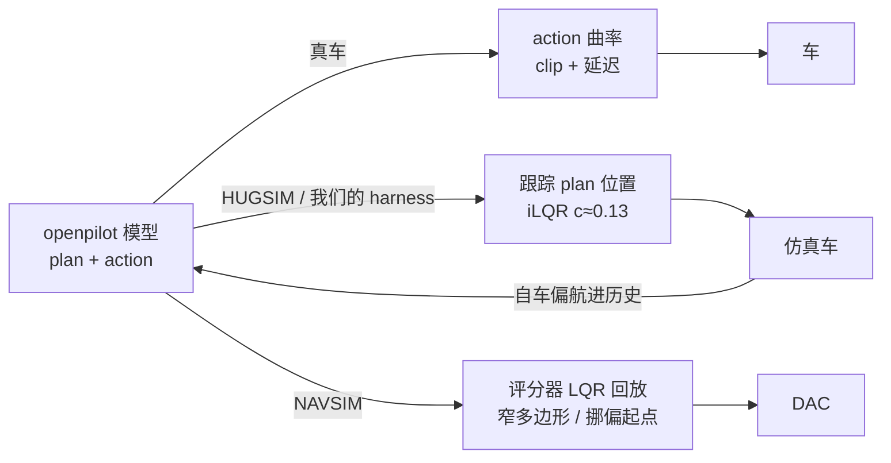

# openpilot 跨榜诊断综合（2026-10-05）

覆盖第 88–119 条。问题是：openpilot 在 WOD、navtest 和实车上「正常」，在 navhard、HUGSIM、B2D 上「不正常」，原因各在哪一层、该怎么改。结论先行：**能区分正常与不正常的不是相机几何、不是渲染画面，而是「榜怎样把 openpilot 接进闭环和评分」这一层**；在这一层之下，剩下的是三项真正的能力缺口（路口转弯幅度、借道判断、该走时不走），以及一个早该统一的适配版本管理问题。

## 排除了什么

| 怀疑对象 | 结论 | 证据 |
|:--|:--|:--|
| 相机高度 / 尺度 | 存在（世界读成约 0.7），但 WOD 上一模一样，不是区分因素；降高只换进度、不换可行驶区 | 第 104、108 条 |
| 地平线、广角视场 | 五个榜都与 openpilot 名义布局一致 | 第 104 条第 10 点、第 108 条 |
| 渲染画面 | 逐帧差小；起步增益 +43% 只在 nuScenes，其余三个数据集不复现 | 第 109 条 |
| 历史帧质量 | 真实 10 Hz 历史比 GIMM 只高 +0.51 [−0.51, +1.54] | 第 116 条 |
| 场景类型 | 打转场景只由起步时计划自身偏向区分，36 个场景特征都分不开 | 第 110 条 |
| 「真车控制器 c 小」 | 真车加驾驶员的 c 并不小（comma1M）；openpilot 限值本身也不小 | 第 113、115 条 |

读法：前四行都是「输入侧」的怀疑，全部排除；第五、六行说明问题不在某类场景或车辆物理上。

## 剩下的统一图景

*读法：真车走上面那条，action 头对 1–2° 起步偏向几乎不响应，环路断开；HUGSIM 走中间那条，跟踪 plan，环路增长 > 1，大偏向就发散；NAVSIM 走下面那条，一半的可行驶区失败来自评分器自己。*

**闭环接口（HUGSIM）。** openpilot 对起步偏航的高增益是它自身的性质，真实 WOD 起步上步 1 局部增益 9.3，比 HUGSIM 还大（第 111 条）。真车不打转，是因为车上跟随的是 action 头的期望曲率：等效 c 0.013，而跟踪 plan 的 iLQR 是 0.127（第 118 条）。换成 openpilot 自己的横向路径后打转 10 → 0；非打转 HD −0.009 [−0.058, +0.042] 没过「不伤」线，但代价大半是基线里被碰撞提前结束、模型本来就要停的场景（第 119 条第 1 点）。纵向也换成 action 加速度则起步失败（HD −0.077，第 119 条）：HUGSIM 的起步是初速 1.0 m/s 加 5 s 同一帧预热，不是真车的起步，而第 100 条测得去掉静止预热起步偏向 ×0.2。我们自己设计的三条规则（均匀低通、死区、纵向加快，第 113、114、117 条）都没过线，均匀低通在 B2D 上还掉 4.1（第 113 条第 6 点）。

**评分接口（navhard）。** DAC 失败约一半在评分器一侧：多边形漏掉真实铺装 26–29%（目测四分之三确是路面，越出中位 3.5 cm）、LQR 跟踪滞后 21%；约 20% 是第二阶段挪偏的起点，多数从那里没有可行弧；计划错误约三成，上限约 4.7 分（第 112 条）。这部分只能作为榜的限定写清楚，不应再拿 navhard DAC 当路沿或转向能力的读数。

**能力缺口（三项，跨榜都在）。**

| 缺口 | 表现 | 证据 | 该在哪层修 |
|:--|:--|:--|:--|
| 路口转弯幅度 | action 方向对（93%），幅度只有所需的 0.43–0.55；desire 管不了转弯；图像指令能训进去但闭环没过线 | 第 118 条第 5 点、第 92、99、102 条 | 指令通道（模型侧），B2D 目前靠路线几何兜底 |
| 借道判断 | B2D 要绕障就得借道（gap 规则 DS 与侧撞一起涨，没有拐点）；实车上 openpilot 会违规借道；示例 2520 里看见了超车车辆仍摆进去 | 第 105 条第 7 点、用户实车经验、loss_budget_examples | 模型侧（何时该借、何时不该），规则只能调宽严 |
| 该走时不走 | HUGSIM 卡死 run 里计划和 action 都在说停；B2D 19324 把 4 m 外的警车当前车卡死 | 第 119 条第 1 点、loss_budget_examples | 待归因（场景 / 前车误读 / 起步），碰撞归因也没做 |

读法：三项都不是哪个榜独有的，修法都落在模型或指令上，不在接口层。

**适配版本。** it_dw3 的增益只出现在我们渲染、几何有偏差的榜上，WOD 不显著、B2D 加选择器显著掉（第 107 条）；起步配对 ln 系列压不下大信号增益（第 106 条）；天空箭头 q3NA / q3SA 各自单独测过。现在有至少三条互不相干的微调线，没有一份共同的护栏测试。

## 怎么改（按顺序）

1. **统一闭环接口为「openpilot 在车上的方式」**：横向走 action 曲率（clip_curvature + lateralDelay），纵向暂时保持跟踪 plan（第 119 条），路口在 B2D 继续用路线几何。同时检验 HUGSIM 的起步方式：去掉 5 s 同一帧预热、改成从静止正常起步，这是我们 harness 的选择，不是榜的规定。在这个接口下重新给 shipped Cinque 定基线（HUGSIM 64 场景多次、B2D 19 路线 × 4 seed），以后所有臂对它比。
2. **评分器侧的发现写成榜的限定，停止追 navhard DAC**，只保留计划一侧约 4.7 分作为能力目标。
3. **先盘点再合并适配**：列出每个微调版本的训练目标、改动层、各榜读数；把三项能力缺口和既有护栏（navhard 早转集合、起步偏向、WOD 不掉、B2D 不掉）做成一份共同的评测集；之后只训一个合并版本，冲突（如借道对 bypass、抑制起步偏向对早转）在这份评测集上显式检验。
4. **能力缺口的顺序**：路口转弯幅度最先（B2D 现在靠路线几何，换成模型自己的指令通道是论文主线的一部分）；借道判断第二（需要「该借 / 不该借」的成对样本，B2D 障碍路线与实车违规借道各一侧）；该走时不走先做归因（便宜，CPU），再决定。

我们的判断是：第 1、2 步是接口与口径，做完后各榜的分数才在同一个 openpilot 上可比；第 3、4 步才是值得投训练的地方。

**还没回答的**：统一接口下 HUGSIM 非打转 HD 是否真的不掉（需要多次重复缩窄 CI）；去掉静止预热后起步是否自然；三项能力缺口在真实数据上的发生率（实车 rlog 缺失，只有 comma1M 视频与位姿）。
