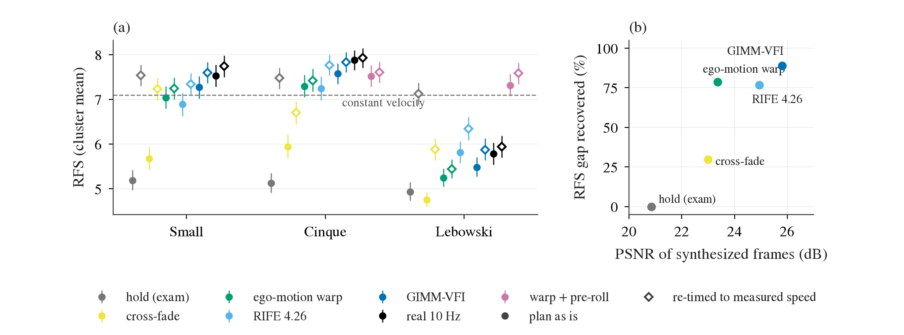
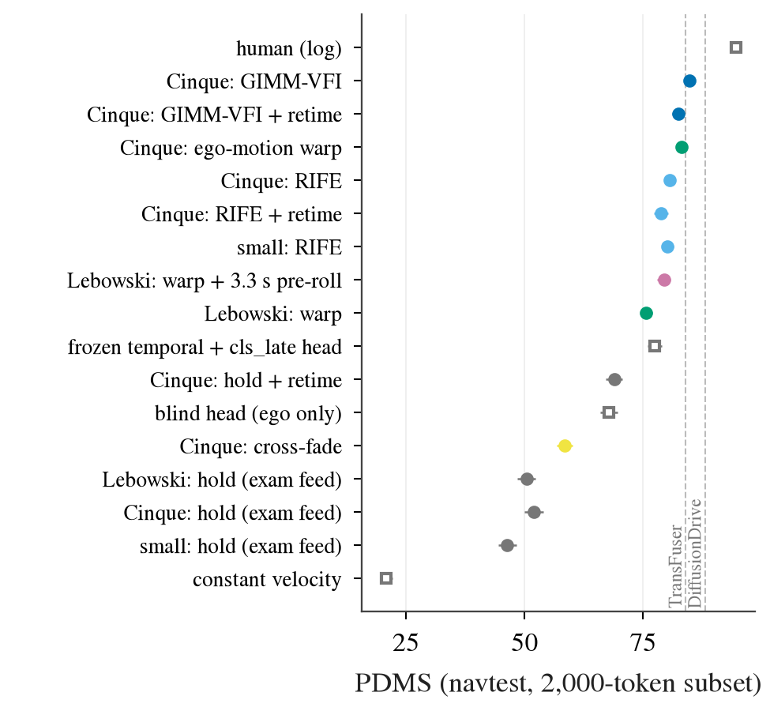

# openpilot 接入开环榜：输入契约、补帧与适配（2026-09-28）

这篇回答一件事：把 openpilot（comma.ai 的量产 L2 驾驶模型，用它的三个 open-weight 版本 small 30M、Cinque v3 382M、Lebowski 877M）放上开环榜时，
怎么接才能让分数反映模型本身，而不是输入契约（input contract：榜单给 agent 的输入是什么、多少帧、什么时间轴、输出要什么坐标系）没对上。
NAVSIM 优先，WOD-E2E 和 nuScenes 其次。全部是小规模诊断，没有跑大实验：补帧约 2 GPU·h，openpilot 推理约 40 次 × 2 000 场景（ORT 会话受 CPU 发射开销限制，GPU 负载很轻），NAVSIM 打分纯 CPU。
代码 [jevdrive/op_interp.py](../jevdrive/op_interp.py)、[scripts/op_interp.py](../scripts/op_interp.py)，小表 [results/op-interp/](results/op-interp/)，
box 上的 run dir `$DATA_DIR/runs/op_interp/`。前置结论见 [decisions.md](decisions.md) 第 34、36、37、39、40 条和 [openpilot-openloop-standing.md](openpilot-openloop-standing.md)。

## 0. 结果先行

1. **NAVSIM 上 openpilot 原生 plan 的低分几乎全是输入契约。** navtest 随机 2 000 个 token 上，同一个 Cinque、同一组 4 张 2 Hz 关键帧，
   只把「保持」（第 37 条考试的喂法）换成补帧：PDMS 51.9 → **84.7**（GIMM-VFI）/ 83.1（ego-motion warp，零学习）/ 80.6（RIFE）。
   84.7 比同一子集上冻结 `temporal` + `cls_late` head（77.5）高 7.2 [5.6, 8.8]，与文献 TransFuser（84.0，全量 navtest，不可配对）同量级；离 human 94.5 还差 10。
2. **WOD 上有真实帧可以当尺子，补帧确实在往真实输入靠。** 479 个 rater 帧，1.5 s 真实 10 Hz 帧喂 Cinque 得 RFS 7.88，保持只有 5.13（比 cv 7.10 还低）；
   GIMM 收回这 2.75 分里的 89%，warp 79%，RIFE 77%，cross-fade 只有 30%。
3. **补帧器选 GIMM-VFI（质量）或 ego-motion warp（零学习、纯 CPU）；RIFE 最便宜但最弱。** 只需补 t0 − 0.2k 的 6 帧（与全 10 Hz 补帧 RFS 逐位相同）。
   GIMM 全量 navtest 约 7.4 GPU·h，warp 约 2.3 CPU·h。
4. **其余契约项按 NAVSIM 配对影响排**：时间轴（补帧）+29 到 +33 PDMS ≫ 杠杆臂坐标变换 1.5–2.9 ≫ 标定 0.9（CI 刚跨零）≫ 平移式坐标 bug 0.2 ≈ 轨迹重采样 0.0。
   Lebowski 另有记忆长度问题（要 4.8 s，只给 1.5 s）：warp 外推 3.3 s 预热 +3.8 PDMS、WOD 上 +2.1 RFS。
5. **按实测车速重定时（retime）在两个榜上方向相反，不进默认接法**：保持输入上它单项就 +17 PDMS / +2.3 RFS，但补帧之后在 NAVSIM 上 −1.8 到 −3.2 PDMS、在 WOD 上 +0.1 到 +0.5 RFS。
6. **合法性**：从榜单给的 4 帧补帧、向后外推预热、用 ego status，都在 NAVSIM 契约内（规则允许公开预训练权重，要在报告里写明）；从 nuPlan 原始日志拿额外的 10 Hz 帧不在契约内，
   navhard 第二阶段和 private test 也根本没有这些帧。WOD-E2E 和 nuScenes 自带 10–12 Hz 历史，不需要补帧。
7. **剩下的差距在转弯和进度**：GIMM 这一行直行 88.0、左 / 右转 78.1 / 75.8（DAC 89–91），起步帧 86.2；进度 EP 73 对 human 87，4 s 终点比 log 短 3.4 m。
   openpilot 没有 route 输入，转弯靠猜。这是 B / C 适配要补的，不再是输入契约。

## 1. 名词和设置

- **保持（hold，sample-and-hold）**：20 Hz 的每一步显示最近一张 ≤ t 的帧。这是之前 NAVSIM 考试（第 37 条）的喂法。
- **历史合成**：把 4 张关键帧（t = −1.5、−1.0、−0.5、0 s）变成 t = −1.5 … 0 的 10 Hz 序列，每张在 20 Hz 时钟上显示两步
  （与第 36 条 WOD 上「只给 1.5 s 的 10 Hz 帧」`ctx1.5` 的喂法逐位相同，所以理想补帧器的上限就是 `real`）。所有方法都在 openpilot 自己的 model frame
  （road / wide 两路 512 × 256 YUV420）上做，换数据集不用改。五种方法：
  - **cross-fade**：两张相邻关键帧按时间线性混合；
  - **ego-motion warp**：取时间上最近的关键帧，按自车位姿（2 Hz 位姿 + 速度的三次 Hermite 插值）经路面平面重投影到目标时刻；路面以上一律当作 60 m 外，静态世界假设；
  - **RIFE 4.26**（Practical-RIFE，2024-09，MIT，任意 t 的光流 VFI（video frame interpolation，视频插帧））；
  - **GIMM-VFI-R**（NeurIPS 2024，连续时间的隐式运动场，LPIPS 微调权重，S-Lab 非商用许可）；
  - **real**：WOD 上真实的 10 Hz 帧，作上限。
- **retime（重定时）**：openpilot 没有车速输入，它从相邻 0.2 s 的两帧里「看」出自车速度。把原生 plan 按 r = v_实测 / v_plan(0) 重新参数化，p′(t) = p(r t)，
  r 限在 [0.25, 2]，任一速度 < 1 m/s 时不动。v_实测 是榜单 ego status 里的速度。车上 openpilot 的控制器同样从 CAN 车速出发，所以这是契约适配，不是加信息。
- **pre-roll（预热）**：−1.5 s 之前的帧由 −1.5 s 关键帧沿按首个样本速度、角速度向后外推的轨迹做 ego-motion warp 生成，补满 recurrent 队列（Cinque 1.6 s，Lebowski 4.8 s）。
- **坐标变换**：openpilot plan 的原点在相机、轴在 calib 系；榜单要后轴。`lever` = 正确的杠杆臂变换 rear(t) = d + p(t) − R(ψ_t) d（之前考试用的）；
  `nolever` = 把相机位移当后轴位移；`shift` = 整条 plan 平移安装偏置（第 33 条 B2D 适配 bug 的形式）。
- **RFS**（Rater Feedback Score，WOD-E2E 的主指标，0–10，cluster mean）；**PDMS**（NAVSIM v1 的主指标，官方 devkit 打分）。
- 数据：WOD-E2E val 全部 479 个 rater 帧（有真实 10 Hz 帧可作上限）；NAVSIM navtest 按 seed 0 随机抽 2 000 个 token（只有 2 Hz 帧，没有上限可对）。
  NAVSIM 子集上 hold 的 PDMS 51.90，与全量考试在同一批 token 上的 51.88 对上（复现检查）。
- 模型：Cinque 为主（WOD 上原生 plan 最强，第 34 条）；small、Lebowski 做副读数。后端 TensorRT fp16（small fp32），与之前考试相同。

## 2. 帧率契约值多少，补帧能收回多少（WOD-E2E，有真实帧作上限）

479 个 rater 帧，RFS 的 95% CI 按 cluster 内重抽；Δ 是对同模型 `real` 的逐帧配对差。「收回」= (行 − hold) / (real − hold)。
drift 是 5 s plan 与 `real` 输入下 plan 的平均 L2 距离（m），衡量补帧伪影把 plan 推离了多少。

| 输入（1.5 s 历史） | Cinque RFS [CI] | 收回 | Δ vs real [CI] | 5 s 纵向偏差 (m) | drift (m) | + retime RFS | + retime 收回 |
|:--|:--|--:|:--|--:|--:|--:|--:|
| real 10 Hz（上限） | **7.88** [7.66, 8.10] | 100% | 0 | +0.2 | 0 | 7.92 | 102% |
| GIMM-VFI | 7.57 [7.34, 7.80] | 89% | −0.36 [−0.53, −0.20] | −1.4 | 1.9 | **7.83** | **98%** |
| warp + 0.1 s pre-roll（补满 1.6 s） | 7.52 [7.28, 7.76] | 87% | −0.27 [−0.46, −0.09] | −1.5 | 1.7 | 7.60 | 90% |
| ego-motion warp | 7.29 [7.05, 7.54] | 79% | −0.50 [−0.68, −0.32] | −2.3 | 1.8 | 7.42 | 83% |
| RIFE 4.26 | 7.24 [6.98, 7.50] | 77% | −0.64 [−0.85, −0.44] | −0.3 | 2.8 | 7.77 | 96% |
| cross-fade | 5.94 [5.69, 6.21] | 30% | −1.93 [−2.17, −1.69] | −4.5 | 7.9 | 6.70 | 57% |
| hold（NAVSIM 考试的喂法） | 5.13 [4.91, 5.35] | 0% | −2.76 [−3.00, −2.53] | **+20.9** | 11.5 | 7.47 | 85% |
| 参照：考试输入（10 Hz、10 s）/ cv / 原地不动 | 8.00 / 7.10 / 5.38 | | | | | | |

| 模型 | hold | best 补帧（base） | real 1.5 s | hold + retime | 补帧 + retime | real + retime | 考试输入（10 s） |
|:--|--:|--:|--:|--:|--:|--:|--:|
| small | 5.19 | 7.27（GIMM） | 7.53 | 7.53 | 7.59（GIMM） | 7.74 | 7.64 |
| Cinque | 5.13 | 7.57（GIMM） | 7.88 | 7.47 | 7.83（GIMM） | 7.92 | 8.00 |
| Lebowski | 4.94 | 5.81（RIFE） | 5.78 | 7.13 | **7.58**（warp + 3.3 s pre-roll） | 5.94 | 7.89 |

图 1：(a) 三个 openpilot 在 WOD 479 个 rater 帧上、七种 1.5 s 历史喂法下的 RFS（实心 = 原生 plan，空心 = retime 后；误差线为 cluster 分层 bootstrap 95% CI）。
看每组从灰到黑的上升：保持输入在 cv（虚线）之下，补帧把 small / Cinque 拉回 cv 之上，retime 再把剩下的大半补上；Lebowski 只有 pre-roll（紫）才回来。
(b) Cinque 上补帧 PSNR（road 视图，对真实 10 Hz 帧）与收回比例：cross-fade 与 ego-motion warp 的 PSNR 差不多，收回差 2.6 倍——要的是运动对，不是像素对。

读法：

1. **上限**：a−b 的差（real − hold）small 2.34、Cinque 2.75、Lebowski 0.84（Lebowski 的 real 1.5 s 本来就只有 5.78，缺的是记忆）。
   这就是第 36 条「NAVSIM 式时间轴横向 ×9、纵向 ×25」在 RFS 上的量：保持输入让模型把 0.5 s 的位移当成 0.2 s 的，5 s 终点平均冲出 21 m。
2. **补帧收回 77–89%，剩下的 11–23% 是伪影**：补出来的帧给了正确的时间轴，但运动估计仍有偏——warp 和 GIMM 的 5 s 终点偏短 1.4–2.3 m（静态世界 / 平滑光流让相对运动偏小），
   RIFE 在行驶帧上偏长 2.2 m。plan 相对 `real` 的 drift 1.8–2.8 m，而 hold 是 11.5 m。
3. **retime 与补帧是互补的两件事**：retime 只修速度这一个标量，所以单用在保持输入上已经 85%（small 100%）；它修不了路径形状和前车相对运动，
   补帧 + retime 比 hold + retime 再高 0.30–0.36（Cinque），离 `real` 只剩 0.05–0.10。retime 在 `real` 上也不伤（+0.05 [−0.15, +0.15]）。
   但到了 NAVSIM，补帧之后再 retime 反而扣 PDMS（第 4 节读法第 3 点），所以它不进默认接法。
4. **暖机长度**：Cinque 的队列要 1.6 s，只缺 0.1 s，warp pre-roll 补上后 +0.23（7.29 → 7.52）；把真实帧砍到只剩最后 0.5 s，原生 plan 掉到 7.31，retime 后反而 8.04——
   短历史的主要损失也在速度估计，retime 一并修了。Lebowski 缺 3.3 s，pre-roll 让它从 5.24（warp）到 7.32，是本节最大的单项增益。
5. **只有 5 Hz 相位的帧有用（实测）**：GIMM 只在 t0 − 0.2k 的 6 个时刻补帧（其余保持）与全 10 Hz 补帧的 RFS 逐位相同（7.571），
   plan 平均差 0.02 m，479 帧里 9 帧差 > 1 m（推测来自 GIMM 两次运行的批大小不同带来的数值差，没有单独查）。和 Cinque 的结构一致：t0 的输出只读 5 Hz 队列里的帧。
   所以每个 NAVSIM 场景只需补 6 帧 × 2 视图。

## 3. 补帧器怎么选：质量、成本、许可

**2026 年的候选**（检索截至 2026-09-28，出处在各行）：

| 方法 | 类型 | 两端条件 / 任意 t | 大运动 | 权重（box 可达性） | 许可 | 实测 / 公开成本 |
|:--|:--|:--|:--|:--|:--|:--|
| RIFE 4.26（Practical-RIFE，2024-09） | 光流 VFI | 两端 / 任意 t | 弱（SNU-FILM extreme 上最差一档） | HF `hzwer/RIFE` | MIT | **0.08 s / 场景**（12 帧 × 2 视图，512 × 256，共享卡） |
| GIMM-VFI（NeurIPS 2024） | 隐式运动场 VFI | 两端 / 连续 t | 强（X4K 2K/4K 上优于 EMA-VFI） | HF `GSean/GIMM-VFI` | S-Lab 非商用 | **2.2 s / 场景**（只补 6 帧）；3.0 s（12 帧）；~10 GB（batch 8） |
| ego-motion warp（本文） | 几何，无学习 | 单端 + 自车位姿 | 路面精确，物体静态假设 | — | — | 0.7 CPU·s / 场景 |
| SGM-VFI（CVPR 2024）、BiM-VFI（CVPR 2025）、EMA-VFI、MoMo | 光流 / 扩散 VFI | 两端 | SGM / BiM 为大运动设计 | 只在 Google Drive | Apache / 研究用 | 未测（box 拉 GDrive 困难） |
| VFIMamba（NeurIPS 2024）、TLB-VFI（ICCV 2025） | VFI | 两端 / 任意 t | 中 | HF | Apache / 未写 | 未测 |
| SPEED（ACM MM 2026）、LDF-VFI（2026）、HFD（CVPR 2025） | 一步 / 少步扩散 VFI | 两端 | 自报 SOTA | 未放权重或只有代码 | — | 0.07–3.4 s / 帧（论文） |
| Wan2.1 FLF2V-14B、CogVideoX-Interp、Framer | 首尾帧视频生成 | 两端 | 强，但会编内容 | HF | Apache / 学术 | 分钟级 / clip |
| Cosmos-Predict2.5、Vista、Epona、GEM 等驾驶世界模型 | 视频预测 | **只能条件过去**，接不上下一张真实关键帧 | — | HF | NVIDIA Open / Apache / MIT | 2B：229 s / clip（H100） |

读法：

1. **GIMM-VFI 是这次测到的最好补帧器**（WOD 收回 89%，NAVSIM 84.7），RIFE 便宜 30 倍但两边都最弱；零学习的 ego-motion warp 在两个榜上都与 RIFE 同档或更好（NAVSIM 上更好 2.5 PDMS）。
   所以默认用 GIMM，warp 作不引入外部模型的对照（第 7 节）。
2. **benchmark 上的 VFI 排名只能参考**：这些榜量的是 30–1000 fps 源上的 2×/8×，NAVSIM 是前向行驶的相机、0.5 s 一跳、近处物体在 1080p 上移几百像素。
   我们在 WOD 上直接量 openpilot 的 RFS，比 PSNR 更贴近要回答的问题（图 1b）。
3. **视频生成类不划算**：首尾帧生成（Wan FLF2V）一个 clip 要分钟级，navtrain 10 万场景不可行；驾驶世界模型只条件过去，补出来的帧接不上下一张真实关键帧，
   在「两张真实帧之间填中间」这件事上结构不对。它们适合的是另一件事：给 Lebowski 生成比 1.5 s 更早的「过去」（pre-roll），目前 ego-motion warp 已经做到 7.3–7.6。
4. **没有找到前人做过「用 VFI 把低帧率 benchmark 喂给时序驾驶模型」**；最接近的是 OP-Deepdive（arXiv 2206.08176）在 nuScenes 2 Hz 上跑原版 supercombo，结果很差、归因于帧率，没补帧。

**全量成本**（按本卡实测，RTX 6000D 与其他 lane 共享）：

| | navtest（12 146） | navtrain（103 288，给 head / 适配训练用） |
|:--|--:|--:|
| RIFE（6 帧 / 场景） | ~8 min GPU | ~1.1 GPU·h |
| GIMM-VFI（6 帧 / 场景） | ~7.4 GPU·h | ~63 GPU·h |
| ego-motion warp / pre-roll | ~2.3 CPU·h（125 核上 1 min） | ~20 CPU·h |
| openpilot 推理（31 步 / 场景） | 与现在相同 | 与现在相同 |

## 4. NAVSIM：契约修复逐项的配对影响

navtest 按 seed 0 随机 2 000 个 token（按 command 与起步分组：直行 1 187、左转 343、右转 230、起步 v0 < 1 m/s 240；新加坡左行 339 个），官方 v1.1 devkit 打 PDMS，另报对 log 未来的 ADE / FDE 和 4 s 纵向偏差（与评分器无关的读数）。
hold 行与全量考试在同一批 token 上的分数对上（51.90 对 51.88，配对 −0.02 [−0.08, +0.02]）。Δ 是逐 token 配对差，token bootstrap 95% CI。
GIMM 在这里只补 5 Hz 相位的 6 帧（第 2 节第 5 点）。全部行在 [nav_results.csv](results/op-interp/nav_results.csv)，配对差在 [nav_paired.txt](results/op-interp/nav_paired.txt)。

**Cinque，各输入 × 输出适配**：

| 输入 | PDMS [CI] | NC | DAC | EP | TTC | ADE / FDE (m) | 4 s 纵向偏差 (m) | + retime PDMS | + retime ADE |
|:--|:--|--:|--:|--:|--:|:--|--:|--:|--:|
| GIMM-VFI | **84.7** [83.7, 85.6] | 98.3 | 96.1 | 73.3 | 95.6 | 2.27 / 4.15 | −3.4 | 82.4 | **1.42** |
| ego-motion warp | 83.1 [81.9, 84.3] | 97.3 | 93.6 | 75.0 | 94.0 | 1.55 / 3.29 | −0.2 | 79.9 | 1.79 |
| RIFE 4.26 | 80.6 [79.4, 81.8] | 96.3 | 94.1 | 70.7 | 91.9 | 2.61 / 4.74 | −1.8 | 78.8 | 1.79 |
| cross-fade | 58.5 [56.8, 60.2] | 84.1 | 88.1 | 48.5 | 76.0 | 7.87 / 13.97 | −0.1 | 62.7 | 4.04 |
| hold（考试喂法） | 51.9 [49.9, 53.9] | 78.6 | 75.8 | 55.6 | 67.8 | 8.72 / 15.52 | **+13.3** | 68.9 | 1.83 |
| 参照：冻结 `temporal` + `cls_late`（navtrain 拟合，hold 输入） | 77.5 [76.0, 79.0] | 96.5 | 87.3 | 72.7 | 90.3 | | | | |
| 参照：blind `cls ego` / cv / human | 67.8 / 20.7 / 94.5 | | | | | | | | |

**逐项配对影响**（每项只改一处，其余按「GIMM 或 warp 或 RIFE、lever、线性重采样、CAM_F0 外参标定」）：

| 契约项 | 变化 | ΔPDMS [95% CI] | 说明 |
|:--|:--|:--|:--|
| 时间轴 | hold → RIFE（Cinque） | **+28.7 [+26.7, +30.6]** | small +33.9、Lebowski（warp）+25.3 |
| 补帧器 | RIFE → warp / warp → GIMM | +2.5 [+1.1, +3.9] / +1.6 [+0.5, +2.7] | GIMM 对 RIFE +4.1 [+3.0, +5.2] |
| 速度（retime） | hold 上 | **+17.0 [+15.4, +18.6]** | 单项最大的「便宜修复」 |
| | 补帧后（RIFE / warp / GIMM） | −1.8 [−2.9, −0.7] / −3.2 [−4.0, −2.3] / −2.3 [−3.2, −1.4] | 见下面读法第 3 点 |
| 暖机（pre-roll） | Lebowski warp，+3.3 s | **+3.8 [+2.2, +5.3]** | 79.4；WOD 上 +2.1 RFS |
| | Cinque，+1.5 s（warp / RIFE） | −1.4 [−2.3, −0.5] / +0.8 [−0.0, +1.6] | 方向不一致，Cinque 不加 |
| 坐标变换 | lever → nolever（hold / RIFE / warp） | −2.9 [−3.7, −2.1] / −1.5 [−2.1, −0.8] / −2.9 [−3.8, −2.1] | 相机在后轴前 1.65 m，转弯时杠杆臂 |
| | lever → shift（RIFE / warp） | −0.2 [−0.4, −0.0] / −0.2 [−0.5, −0.0] | 开环下整体平移几乎不扣分（闭环里是第 33 条的大 bug） |
| 标定 | CAM_F0 外参 → 名义安装（RIFE） | −0.9 [−1.9, +0.1] | nuPlan 前视的安装角很小（约 1°），第 36 条说 2° yaw 才明显 |
| 轨迹重采样 | 线性 → 三次样条（RIFE / warp） | +0.0 [−0.0, +0.1] | T_IDXS 在 0–4 s 已经很密 |
| 交通方向 | 新加坡左行（339 / 2 000 个 token）按地图给 traffic convention | 未单独测 | 之前考试已经这么做 |

图 2：navtest 2 000 个 token 上各接法的 PDMS（误差线为 token bootstrap 95% CI；空心方块是参照行，竖虚线是文献全量 navtest 的 TransFuser / DiffusionDrive，只作量级）。
看颜色：灰色（保持输入）三个模型都在 46–52，补帧（蓝、绿）把它们一起推到 79–85，超过同一批 token 上的冻结特征 + head（77.5）。

读法：

1. **时间轴是唯一的大项**：三个模型的 hold 行挤在 46–52，补帧后在 79–85，这 25–34 分正是第 37 条里「openpilot 只比 cv 高 15–20 分」的来源。
   其余所有契约项加起来不到 5 分。
2. **NAVSIM 与 WOD 对补帧器的排序基本一致**（GIMM 最好，warp 与 RIFE 接近），warp 在 NAVSIM 上更好（+2.5，而且 ADE 1.55 是全表最小、纵向几乎无偏）：
   nuPlan 的相机更低（1.52 m 对 WOD 1.81 m），路面在画面里占比更大，平面假设更准；这是推测，没有单独测。
3. **retime 的符号取决于指标**：补帧后 openpilot 看出的速度比 ego status 慢 7–22%（r 中位数 warp 1.07、RIFE 1.22），retime 把 plan 拉回实测速度，
   对 log 的 ADE 在 RIFE / GIMM 上明显变好（2.61 → 1.79，2.27 → 1.42），PDMS 却掉 2–3 分（DAC 与 TTC 掉，EP 只涨 1–2）。PDMS 的乘法项奖励「慢一点」，
   WOD 的 RFS 奖励接近 rater。一个在两个榜上符号相反、又和指标偏好直接耦合的旋钮，放进默认接法就是在挑指标，所以默认不用，只作消融报告；保持输入时它是必需的（+17）。
4. **Lebowski 的瓶颈是 4.8 s 记忆**：warp 本身只到 75.7（EP 56，太慢），加 3.3 s 预热到 79.4、ADE 从 3.74 降到 1.57。
5. **small 与 Cinque 在补帧输入下打平**（RIFE 80.2 对 80.6），WOD 上 Cinque 更好（7.57 对 7.27，GIMM）。NAVSIM 的 PDMS 对三个模型的区分度小于 WOD 的 RFS。

## 5. 协议合法性（分榜）

| 榜 | 契约给 agent 的 | 从契约内的帧补帧 / retime / pre-roll | 取额外真实帧 |
|:--|:--|:--|:--|
| NAVSIM v1 / v2（navtest、navhard、private_test_hard） | 当前帧 + 3 张过去帧，1.5 s、2 Hz，8 路相机（我们只用 CAM_F0）；ego status（位姿、速度、加速度、driving command） | **合法**：只用 ≤ t0 的输入；规则允许「所有公开数据集和预训练权重」（2024 / 2025 challenge 规则页），要在技术报告里写明；禁止未来帧。GIMM 的 S-Lab 许可只限非商用，研究提交可用 | **不在契约内**：规则没明说，但 agent 接口只有这 4 帧；navhard 第二阶段是 3DGS 合成场景、private_test_hard 是私有日志，根本没有中间帧。不采用 |
| WOD-E2E（2025 challenge；2026 页面未找到） | 8 路相机、10 Hz；test 段给目标时刻之前的 12 s；自车过去 4 s（4 Hz）；routing intent | 不需要补帧（10 Hz 已有，20 Hz 时钟上每帧显示两步，第 34 条），retime 合法且在 `real` 上中性 | 12 s 内的历史帧就是契约内的。**待核**：test TFRecord 里每个目标帧实际带多少张过去帧，提交前要逐帧核对（[openpilot-openloop-standing.md](openpilot-openloop-standing.md) 第 6 节的 test 提交链路） |
| nuScenes 开环规划（ST-P3 / UniAD / VAD 口径） | 没有官方规划赛，没有输入规则；常见做法只用 2 Hz keyframe（UniAD queue 3、VAD queue 4） | 不需要：CAM_FRONT 的 12 Hz sweep 是公开数据的一部分、只用过去帧，第 39 条考试就是这么喂的；要写明「用了 sweep」 | sweep 本身就是公开发布的过去帧，合法；与只用 keyframe 的方法比时要注明输入不同 |

补一句适配器本身的「是不是 trick」：五个接法都不看榜单的评分器、不在 navtest 上调参（retime 的 r 上下限、pre-roll 的外推方式都是写代码时定的，没有按分数挑），
而且在有真实帧的 WOD 上逐项验证过「往 real 靠」而不是「往分数靠」（retime 在 real 上 +0.05、CI 跨零）。这和第 35 条说的对准评分器的 R 层配方不同。

## 6. 剩下的差距在哪，B / C 适配要补什么

按 driving command 与起步帧拆（2 000 个 token，PDMS / DAC / EP，[nav_by_command.txt](results/op-interp/nav_by_command.txt)）：

| 行 | 直行（1 187） | 左转（343） | 右转（230） | 起步 v0 < 1（240） |
|:--|:--|:--|:--|:--|
| Cinque GIMM（补帧，无 route） | **88.0** / 98.3 / 77.4 | 78.1 / 90.7 / 68.6 | 75.8 / 89.1 / 62.9 | 86.2 / 99.6 / 70.0 |
| Cinque warp | 88.4 / 96.8 / 82.5 | 74.4 / 84.8 / 70.6 | 74.3 / 83.9 / 66.8 | 77.5 / 99.6 / 52.2 |
| 冻结 `temporal` + `cls_late`（有 command） | 78.7 / 89.5 / 74.5 | 71.5 / 79.3 / 68.0 | 68.4 / 79.1 / 61.7 | 88.6 / 95.4 / 81.4 |
| human | 94.7 / 100 / 87.3 | 94.3 / 100 / 86.5 | 93.1 / 100 / 83.5 | 95.1 / 100 / 88.3 |

1. **直行已经接近上限一侧**：88 对 human 95，差在进度（EP 77 对 87）和 NC / TTC 各 1–4 分。
2. **转弯差 16–18 分，主要是 DAC**（出可行驶区域 9–11%）：openpilot 没有 route 输入，路口转向靠它自己猜（第 40 条：desire 当 route 用反而拖分）。
   这是模型接口缺的东西，不是输入契约，补帧修不了。
3. **起步帧**：GIMM 86 与 head 89 同量级，warp 只有 78（静态世界的 warp 在静止时给不出任何运动，模型起步慢，EP 52）。
4. 对 [op-adapt](../todos/2026-09-28-op-adapt.md) 的含义：B / C 适配若以 NAVSIM 为验收之一，改动的收益应主要落在「转弯 DAC」和「进度」上；
   原生 plan 的直行已经 88，那里再涨多半是 R 层配方（第 35、40 条），不是能力。route 怎么进（desire 已判不行）是比补帧更大的一项。

## 7. 推荐的接法

1. **输入**：4 张关键帧 → 在 openpilot model frame 上补 t0 − 0.2k（k = 1 … 7，不含关键帧）的 6 张，其余时刻保持。补帧器默认 **GIMM-VFI**（最好），
   **ego-motion warp** 作零学习、纯 CPU 的对照（差 1.6 PDMS，不引入任何外部模型，最容易说清楚不是 trick）；RIFE 只在要极便宜时用。
   Lebowski 另加 3.3 s warp 预热；Cinque / small 不加。标定用 CAM_F0 外参（已是如此）；traffic convention 按地图。
2. **输出**：原生 plan → 杠杆臂变换到后轴 → 线性重采样到 0.5 s × 8。**不做 retime**（第 4 节读法第 3 点）；只在输入不得不保持时（没有补帧能力的场合）用它。
3. **报告**：原生 plan 的榜单数字按这条 pipeline 出，同时报 hold 的旧数字、每一项的配对增量（第 4 节表），并附 WOD 上的真实帧上限对照，说明适配收回了多少、没有超过真实输入。
4. **与 head 路线的关系**：第 40 条的「冻结 `temporal` + head」是在 hold 输入下抽的特征，补帧输入下特征会变，head 要在同一输入下重抽 navtrain 特征
   （GIMM 约 63 GPU·h、warp 约 20 CPU·h + openpilot 推理），这件事没做（开放问题 1）。

## 8. 开放问题（给讨论）

1. **head 路线要不要换到补帧输入？** 原生 plan 经适配后 84.7（GIMM），已经比 hold 输入下的 `temporal` + `cls_late`（同一子集 77.5）高 7.2；第 40 条的 Hydra 式打分头在全量 navtest 上是 84.2。补帧会让 `temporal` 更像训练分布，
   但 head 已经在 hold 特征上把失真吸收了（第 37 条修正）。便宜的检验：navtest 子集上补帧输入抽 `temporal`、直接用现有 head（分布移位的方向），再决定是否重抽 navtrain。
2. **B / C 适配（[op-adapt](../todos/2026-09-28-op-adapt.md)）在什么输入上训？** 如果最终要上 NAVSIM，训练帧应该走同一条补帧管线（否则训练是 20 Hz 真实帧、考试是补出来的帧，又是一个契约差）；
   nuScenes sweep 可以做成「2 Hz + 补帧」和「12 Hz 真实」的配对，顺带教模型对补帧伪影不敏感。这本身是否算 trick，需要一起定。
3. **retime 要不要进默认？** 这里的判断是「在两个榜上符号相反的旋钮不进默认」。另一种一样说得通的规则是「按对 log 的 ADE 在训练 split 上选适配」（与评分器无关），
   按它 NAVSIM 上会选 GIMM + retime（ADE 1.42，PDMS 82.4 而不是 84.7）。两条规则差 2.3 PDMS，要在看全量分数之前定下来。
4. **WOD test 的历史帧数**：提交前核对（第 5 节）。
5. **更好的补帧**：SGM-VFI / BiM-VFI 权重只在 Google Drive；深度引导的 warp（单目深度 + 自车位姿）能不能把 warp 的 −2.3 m 纵向偏差修掉，没测。
   按第 2 节的量级，补帧器再好也最多收回 GIMM 到 real 的 0.05–0.3 RFS。
6. **全量验证**：这里是 2 000 个 token 的子集、单次运行；上榜前在全量 navtest（GIMM 约 7.4 GPU·h）和 navhard two-stage（第二阶段是 3DGS 合成图，补帧器没见过这种画面）上各跑一次。
