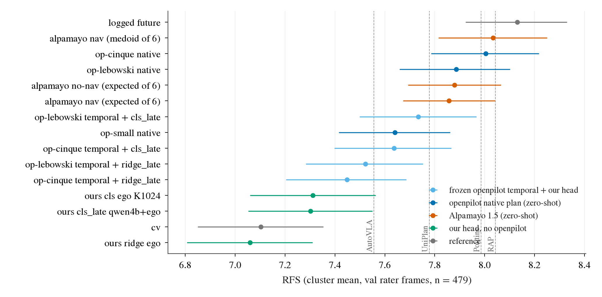
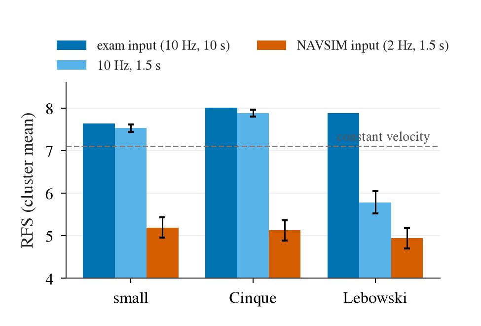
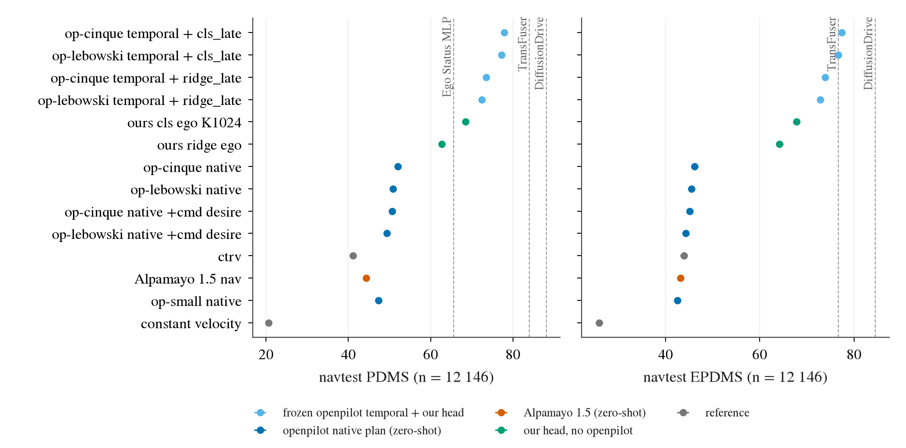

# openpilot 的开环地位：WOD-E2E 与 NAVSIM 上的并排对比

2026-09-25。openpilot（comma.ai 的量产 L2 驾驶模型，这里用它的三个 open-weight 版本：small 30M、Cinque v3 382M、Lebowski 877M）
已定为主线 backbone（[decisions.md](decisions.md) 第 40 条）。这篇把它在两个开环 benchmark 上的读数收拢到一张尺子上：
同一批帧、同一个指标定义、能配对的地方都给配对 CI，并把公开榜单放在旁边作量级参照。
预登记、代码和全部中间表在 [todos/2026-09-25-openpilot-openloop-comparison.md](../todos/2026-09-25-openpilot-openloop-comparison.md)；
零样本考试本身在 [wod-e2e.md](../todos/2026-09-24-zeroshot-exam/wod-e2e.md)、[navsim.md](../todos/2026-09-24-zeroshot-exam/navsim.md)。
小表在 [results/openpilot-openloop/](results/openpilot-openloop/)。

几个词先说清楚：
「原生 plan」指 openpilot 自己输出的轨迹，不训练、不拟合（zero-shot）；
「`temporal` + head」指把 openpilot 当冻结 backbone，取它 512 维的 `temporal` 中间特征（policy 之前的时序 token），
在目标数据集的训练 split 上拟合我们的薄 head：`ridge_late`（在 ego-only ridge 预测之上用特征回归残差）或 `cls_late`（K = 1024 轨迹词表上的线性分类，
ego 分类器的 logits 作为冻结偏置，late fusion）。「ego head」是只看自车状态的同一族 head（`ridge ego`、`cls ego K1024`），
是「视觉到底加了什么」的对照。cv 是匀速直行外推。

## 1. WOD-E2E

WOD-E2E（Waymo Open Dataset 的纯视觉端到端驾驶集）的 val split，479 个带 3 条人工打分轨迹的 rater 帧。主指标 RFS（Rater Feedback Score，
预测落在高分 rater 轨迹的 trust region 里就拿该轨迹的分，0–10，下限 4）按榜单口径取 cluster mean；ADE 取 5 s 对最高分 rater 轨迹。
Δ 是逐帧配对差（frame mean，10 000 次 bootstrap），这一批帧每个 sequence 恰好一帧，所以按帧重抽就是按 sequence 重抽。

| 行 | RFS [95% CI] | Δ vs cv | Δ vs `cls ego` | Δ vs Cinque 原生 | ADE@5s |
|:--|:--|:--|:--|:--|--:|
| logged future（司机实际开的） | 8.13 [7.92, 8.33] | +1.13 [+0.87, +1.39] | +0.83 | +0.23 [+0.02, +0.45] | 2.70 |
| **openpilot Cinque 原生** | **8.00** [7.79, 8.22] | **+0.90 [+0.67, +1.12]** | **+0.60 [+0.38, +0.81]** | 0 | **2.46** |
| Alpamayo 1.5 nav，medoid-of-6 | 8.03 [7.81, 8.25] | +0.96 [+0.73, +1.19] | +0.66 | +0.06 [−0.10, +0.23] | 2.57 |
| openpilot Lebowski 原生 | 7.89 [7.66, 8.10] | +0.76 [+0.52, +1.00] | +0.46 | −0.14 [−0.26, −0.01] | 2.67 |
| Alpamayo 1.5 nav，一条采样的期望 | 7.86 [7.67, 8.04] | +0.76 [+0.55, +0.97] | +0.46 | −0.14 [−0.29, +0.02] | 2.75 |
| Lebowski `temporal` + `cls_late` | 7.73 [7.50, 7.97] | +0.66 [+0.43, +0.87] | +0.36 [+0.19, +0.53] | −0.24 [−0.42, −0.05] | 3.01 |
| openpilot small 原生 | 7.64 [7.42, 7.86] | +0.65 [+0.43, +0.88] | +0.36 | −0.24 [−0.43, −0.05] | 2.88 |
| Cinque `temporal` + `cls_late` | 7.64 [7.40, 7.87] | +0.61 [+0.38, +0.84] | +0.31 [+0.13, +0.48] | −0.29 [−0.47, −0.11] | 3.05 |
| Lebowski `temporal` + `ridge_late` | 7.52 [7.28, 7.75] | +0.43 [+0.18, +0.67] | +0.13 [−0.10, +0.35] | −0.47 | 2.68 |
| Cinque `temporal` + `ridge_late` | 7.45 [7.20, 7.69] | +0.41 [+0.16, +0.67] | +0.12 [−0.11, +0.34] | −0.48 | 2.63 |
| 我们 `cls ego K1024`（无视觉） | 7.31 [7.06, 7.56] | +0.30 [+0.09, +0.52] | 0 | −0.60 | 3.27 |
| 我们 `cls_late` Qwen3-VL-4B + ego | 7.30 [7.05, 7.55] | +0.25 | −0.05 [−0.16, +0.05] | −0.65 | 3.23 |
| cv | 7.10 [6.85, 7.35] | 0 | −0.30 | −0.90 | 3.35 |
| 我们 `ridge ego` | 7.06 [6.81, 7.31] | +0.01 | −0.29 | −0.89 | 3.16 |
| *公开榜（**test** split，不可配对）*：RAP / Poutine / UniPlan / DiffusionLTF / AutoVLA | 8.04 / 7.99 / 7.78 / 7.72 / 7.56 | | | | 2.65 / 2.74 / 2.99 / 2.98 / 2.96 |

图 1：WOD-E2E val 479 个 rater 帧上每一行的 RFS 与 95% CI（cluster 内分层重抽）；竖虚线是公开榜 test split 的分数，只作量级参照。
看颜色的分层：openpilot 原生 plan（深蓝）和 Alpamayo（橙）在最上面，冻结 `temporal` + 我们的 head（浅蓝）居中，不用 openpilot 的我们的 head（绿）贴着 cv。

读法：

1. **Cinque 的原生 plan 是 WOD 上最强的单轨迹行**，比 Lebowski 高 0.14 [0.01, 0.26]、比 small 高 0.24，与 Alpamayo 1.5 的 medoid（要 6 次采样）打平，
   离 logged future 还差 0.23 [0.02, 0.45]。它和公开榜第一梯队（RAP 8.04、Poutine 7.99）同量级，但 test 与 val 不能配对，这只是量级。
2. **冻结 `temporal` + 薄 head 没有追上原生 plan**：最好的 `cls_late`（Lebowski 7.73）仍比 Cinque 原生低 0.24，比它自己的原生低 0.15。
   但它比同族不看 openpilot 的 `cls ego` 高 0.31–0.36（CI 不跨零），比我们以前最好的 VLM 特征（Qwen3-VL-4B `cls_late`，7.30）高 0.34–0.43。
   也就是第 40 条的结论：作为 backbone，openpilot 的 `temporal` 带来的东西是真实的，但单 mode 读出只拿回原生 plan 优势的一部分。
3. **ADE 与 RFS 排序不一致**：`ridge_late` 的 ADE（2.63–2.68）与 Lebowski 原生相当，RFS 却低 0.4；`cls_late` 反过来 RFS 高、ADE 大（3.0）。
   这是第 2 / 10 条说的回归赢 ADE、给出具体 mode 赢 RFS。
4. **起步帧**（起始速度 < 0.5 m/s，n = 120）上所有行都不比 cv（继续停着）好：Cinque 原生 +0.16 [−0.20, +0.51]，`cls_late` ≈ 0，
   回归 head（`ridge_late`）反而 −0.64 到 −0.74。**路口 / 多车道**（n = 158）上原生、`cls_late`、Alpamayo 都比 cv 高 0.4–0.8。

## 2. NAVSIM 的输入协议在 WOD 上值多少

NAVSIM 只给 agent 1.5 s、2 Hz 的四帧历史。openpilot 是 20 Hz 时钟上的时序模型（Cinque / small 看 t 与 t−0.2 s 两帧加内部状态，
Lebowski 看 4.8 s 的 hidden state 队列），这种输入只能 sample-and-hold 地喂。为了把这项适配损失和模型能力分开，
我们在同一批 WOD rater 帧上把输入换成 NAVSIM 的时间轴，别的不动（渲染、零状态起步、在 t0 取 plan，与 NAVSIM 考试的调度逐步一致）。

| 模型 | 考试输入（10 Hz、10 s） | 10 Hz、只给 1.5 s | Δ [CI] | NAVSIM 式（2 Hz、1.5 s） | Δ [CI] | 5 s 终点纵向偏差 (m)：考试 → NAVSIM 式 |
|:--|--:|--:|:--|--:|:--|:--|
| small | 7.64 | 7.53 | −0.07 [−0.15, +0.02] | 5.19 | **−2.57 [−2.80, −2.33]** | +0.7 → **+22.8** |
| Cinque | 8.00 | 7.88 | −0.11 [−0.20, −0.03] | 5.13 | **−2.88 [−3.11, −2.64]** | +0.9 → **+20.9** |
| Lebowski | 7.89 | 5.78 | **−2.00 [−2.26, −1.74]** | 4.94 | **−2.89 [−3.13, −2.65]** | +0.3 → **+19.4** |
| 参照：cv / 原地不动 | 7.10 / 5.38 | | | | | |

图 2：同一批 479 个 WOD rater 帧上，openpilot 原生 plan 在考试输入、只给 1.5 s 的 10 Hz 帧、NAVSIM 式 2 Hz sample-and-hold 三种输入下的 RFS；
误差线是对考试输入的配对 Δ 的 95% CI。看橙色柱：三个模型都从 cv（虚线）之上掉到「原地不动」（5.38）的水平。

按预登记的判据（S = 丢掉的分数占模型相对 cv 优势的比例），S = 3.2–3.9，远超「≥ 0.5 即主要是协议读数」的门槛。
机制是帧率，不是历史长度：small / Cinque 只给 1.5 s 的 10 Hz 帧几乎不掉（−0.07 / −0.11），换成 2 Hz 就掉 2.5–2.8；
sample-and-hold 让 t0 那一步看到的「0.2 s 前」其实是 0.5 s 前，自车运动被放大 2.5 倍，5 s 终点平均冲出 log 20 m。
Lebowski 另有一项：它的 4.8 s 记忆在只给 1.5 s 时就掉 2.0 分。**所以 NAVSIM 考试里 openpilot 原生 plan 的 PDMS / EPDMS（第 37 条的 47–52 / 42–46）
量到的主要是输入协议，不是模型**；在 WOD 上同样的输入会让最好的开环模型变得和不动一样差。

有没有一种不改模型的喂法能救回来？把四帧当作 0.2 s 间隔「压缩」地喂（HUGSIM 考试在 4 Hz 上用过的 dilate 办法）只回来 0.23–0.30（Cinque、Lebowski，CI > 0），
三个模型仍停在 5.1–5.4，远在 cv 之下（预登记要求回到 cv 之上才在 NAVSIM 上用它），因为 0.5 s 压成 0.2 s 同样把速度放大 2.5 倍。
所以 NAVSIM 上测 openpilot 只剩一条路：冻结特征 + 在 navtrain 上拟合的 head（第 3 节）。

## 3. NAVSIM

NAVSIM 是 nuPlan 真实日志上的 non-reactive 开环仿真：agent 交一条 4 s 轨迹，官方 devkit 跟踪后按规则打分。PDMS（v1）= 不撞 × 不出界 × 加权
（TTC、进度、舒适）；EPDMS（v2）再乘逆行、闯灯，并加车道保持和帧间一致性。navtest 12 146 个 token，navhard two-stage 是 3DGS 合成的偏离后场景。
head 在 navtrain（103 288 个 token）上拟合，输入只用 NAVSIM agent 合法可见的量（4 帧 2 Hz CAM_F0、自车状态、driving command）。
`temporal` 是在考试同一种 2 Hz 输入下抽的，也就是第 2 节里让原生 plan 失效的那种输入。

| 行 | PDMS [95% CI] | EPDMS [95% CI] | navhard EPDMS | Δ EPDMS vs 同族 ego head | Δ EPDMS vs 原生 plan |
|:--|:--|:--|--:|:--|:--|
| human（log，我们的 devkit） | 94.6 | 94.5 | — | | |
| *文献* DiffusionDrive（navtrain 训） | 88.1 | 84.5 | 27.5 | | |
| *文献* TransFuser | 84.0 | 76.7 | 23.1 | | |
| **Cinque `temporal` + `cls_late`** | **77.9 [77.2, 78.5]** | **77.4 [76.8, 78.0]** | **19.8** | **+9.6 [+8.9, +10.2]** | **+31.2 [+30.4, +32.1]** |
| Lebowski `temporal` + `cls_late` | 77.3 [76.7, 77.9] | 76.7 [76.0, 77.3] | 17.5 | +8.8 [+8.2, +9.4] | +31.2 |
| Cinque `temporal` + `ridge_late` | 73.5 [72.9, 74.2] | 73.9 [73.2, 74.5] | 16.8 | +9.7 [+8.9, +10.4] | +27.7 |
| Lebowski `temporal` + `ridge_late` | 72.4 [71.8, 73.1] | 72.9 [72.2, 73.6] | 17.0 | +8.7 [+7.9, +9.4] | +27.4 |
| 我们 `cls ego K1024`（无视觉） | 68.4 [67.7, 69.1] | 67.8 [67.1, 68.5] | 13.6 | 0 | |
| *文献* Ego Status MLP（无视觉） | 65.6 | — | — | | |
| 我们 `ridge ego` | 62.7 [62.0, 63.5] | 64.2 [63.4, 65.0] | 13.3 | 0 | |
| openpilot Cinque 原生 | 52.1 [51.3, 52.8] | 46.2 [45.4, 46.9] | 9.3 | | 0 |
| openpilot Lebowski 原生 | 50.9 | 45.5 | 10.2 | | 0 |
| openpilot small 原生 | 47.3 | 42.5 | 10.2 | | |
| Alpamayo 1.5 nav | 44.3 | 43.2 | 10.8 | | |
| ctrv（匀速匀角速度圆弧） | 41.1 | 43.9 | 11.4 | | |
| constant velocity | 20.7 | 25.9 | 11.5 | | |

图 3：navtest 上每一行的 PDMS（左）与 EPDMS（右），95% token bootstrap CI（比点还小）；竖虚线是文献值（在 navtrain 上训的方法；EPDMS 的 devkit 版本与我们不同，只作量级）。
看三层：原生 plan 与 Alpamayo 挤在 42–52，不看图像的 ego head 在 62–68，冻结 openpilot 特征 + head 在 72–78，离 TransFuser 的 PDMS 还差 6 分。

读法：

1. **零样本原生 plan 在 NAVSIM 上不代表 openpilot**：它比一个不看图像的线性分类头还低 16 PDMS / 22 EPDMS。第 2 节给了原因：2 Hz 的输入本身就让原生 plan 失效。
2. **同一个被 2 Hz 输入扭曲的 `temporal`，加一个在 navtrain 上拟合的线性读出，就到 77–78**：对原生 plan +31 EPDMS，对同族 ego head +9–10（CI 远离零）。
   也就是信息还在特征里，差的是读出。这与 nuScenes（第 40 条第 4 点）一致，是第三个数据集上的复现。
3. **离 specialist 还有距离**：PDMS 差 TransFuser 6 分、DiffusionDrive 10 分；navhard 19.8 对 23.1 / 27.5。这些方法用 3 路相机 + LiDAR 端到端训练，
   我们是单前视、冻结、线性读出、2 Hz 输入。EPDMS 上 77.4 与 TransFuser 的 76.7 同量级，但 devkit 版本不同（我们的 human 94.5，文献 90.3），不能说「超过」。

## 4. 不看路能拿多少分（continuation share）

同一组不看图像的基线在各 benchmark 上占已发表顶分的比例（share = 基线 ÷ 顶分；L2 取倒数）。全表 [continuation_share.csv](results/openpilot-openloop/continuation_share.csv)。

| benchmark | 指标 | cv | ctrv | 最好的 ego-only 学习 head | 顶分 | share：cv / ego head |
|:--|:--|--:|--:|--:|:--|:--|
| WOD-E2E val | RFS | 7.10 | 7.02 | 7.31 | 8.04（RAP，test） | 0.88 / 0.91（扣掉下限 4 后 0.77 / 0.82） |
| NAVSIM navtest | PDMS | 20.7 | 41.1 | 68.4 | 91.5（SimWAM） | 0.23 / 0.75 |
| NAVSIM navtest | EPDMS | 25.9 | 43.9 | 67.8 | 90.2（SimWAM） | 0.29 / 0.75 |
| nuScenes val | L2 (m) | 0.83 | — | 0.35（Ego-MLP，文献） | 0.37（VAD-Base） | 0.45 / **1.06** |
| Bench2Drive 开环 | L2 2 s (m) | — | — | 3.64（AD-MLP，文献） | 0.73（UniAD-Base） | — / 0.20 |
| Bench2Drive 闭环 | DS | — | — | 18.1（AD-MLP，文献） | 90.6（BLUE） | — / 0.20 |
| HUGSIM | HD-Score | 0.04 / 0.29（官方 / 修正控制器） | — | — | 0.299（UniAD，论文） | 0.13 / —（修正控制器下 cv 0.98） |

读法：开环榜上「不看路」的份额很高（nuScenes 上 ego-only 超过顶分，WOD 上 cv 拿 77–88%，NAVSIM 上 ego head 拿 75%），闭环 Bench2Drive 只有 20%。
所以开环分数的差距要和这条「continuation 地板」一起读：WOD 上 openpilot 原生 plan 比 cv 高 0.9 RFS，NAVSIM 上冻结特征 + head 比 ego head 高 9–10 EPDMS，
这两个增量才是视觉带来的部分。

## 5. 对 openpilot 主线意味着什么

- **作为冻结 backbone，openpilot 在三个开环数据集上都成立**：WOD（`cls_late` 对 `cls ego` +0.31–0.36 RFS）、nuScenes（第 40 条）、NAVSIM（+9–10 EPDMS）。
  NAVSIM 上 2 Hz 输入让原生 plan 失效，特征却基本没坏。
- **原生 plan 只在输入协议匹配时有意义**：WOD 上 Cinque 原生是全表最强的单轨迹行（8.00，公开榜第一梯队的量级）；NAVSIM 上它不代表模型。
  以后报 openpilot 的榜单数字，按数据集的帧率决定报原生还是「特征 + head」，不混用。
- **读出是下一步的主要空间**：WOD 上最好的 head 仍比 Cinque 原生低 0.24 RFS；NAVSIM 上离 TransFuser 还差 6 PDMS。两边的缺口都在「单 mode 线性读出」这一层（第 40 条第 3 点）。
- **route 不从 desire 进**（p5route 2b）：WOD 上 intent → desire 让 Cinque 原生 −0.13、静止帧 −0.66；NAVSIM 的 cmd desire 同样拖分（−1.0 到 −1.2 EPDMS）。

## 6. 缺口

| 缺口 | 状态 |
|:--|:--|
| WOD test split 的提交 | 数据在下（共享网络 2–5 MB/s，剩约 65 个 shard，ETA 约 15 h），链式脚本自动生成 Cinque / Lebowski 原生 plan 的提交包，**不上传**。要不要用一次配额（每 30 天 6 次）、交哪一行（原生 Cinque，或 `temporal` + `cls_late`，后者还要在 test 帧上抽特征）由用户决定 |
| NAVSIM 的 10 Hz 原始相机（nuPlan sensor blobs） | 不做：TB 级下载。第 2 节给出同一问题在 WOD 上的量级；第 3 节说明特征 + head 已绕开它 |
| NAVSIM 上的多模态读出、多相机 | 没做；是离 specialist 那 6 分的候选来源 |
| 单 seed | 所有 head 都是一次拟合；WOD 的 CI 半宽约 0.2 RFS，NAVSIM 约 0.7 PDMS |
