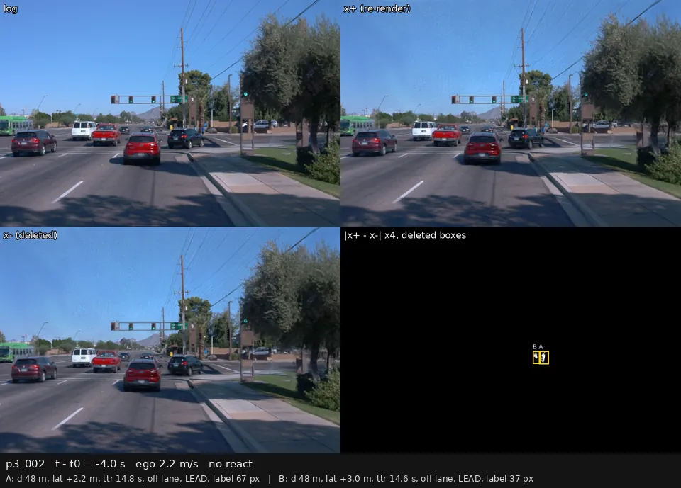
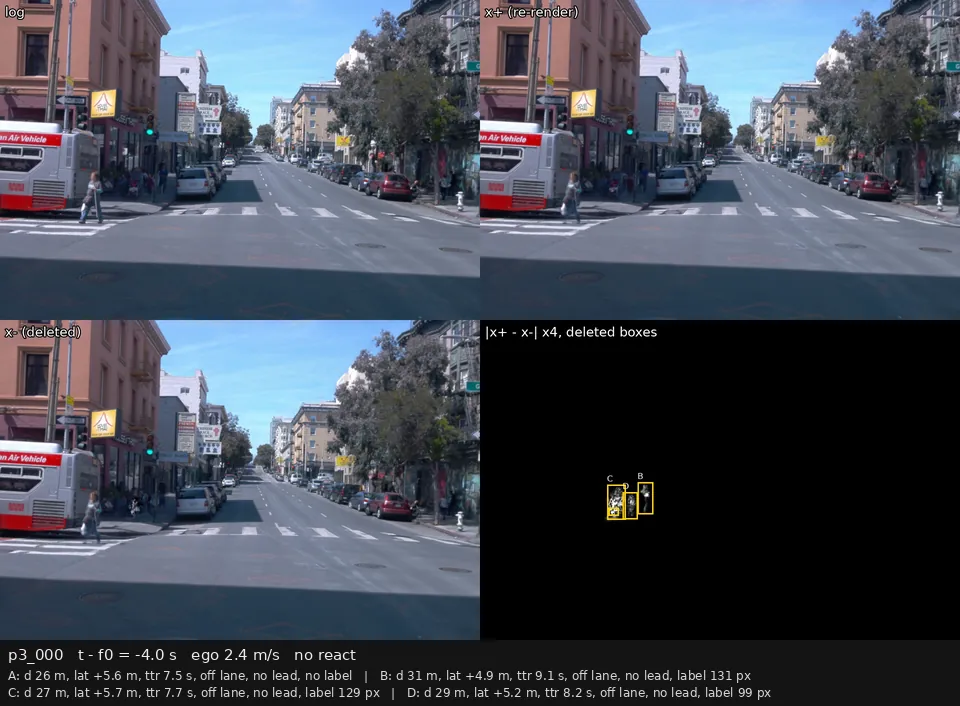
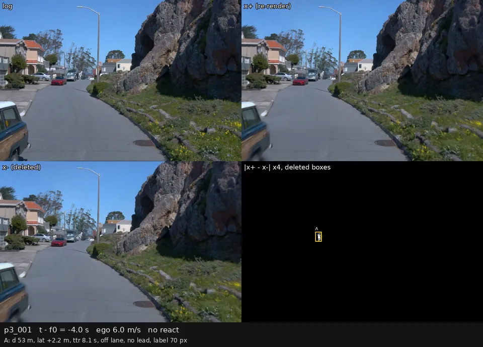
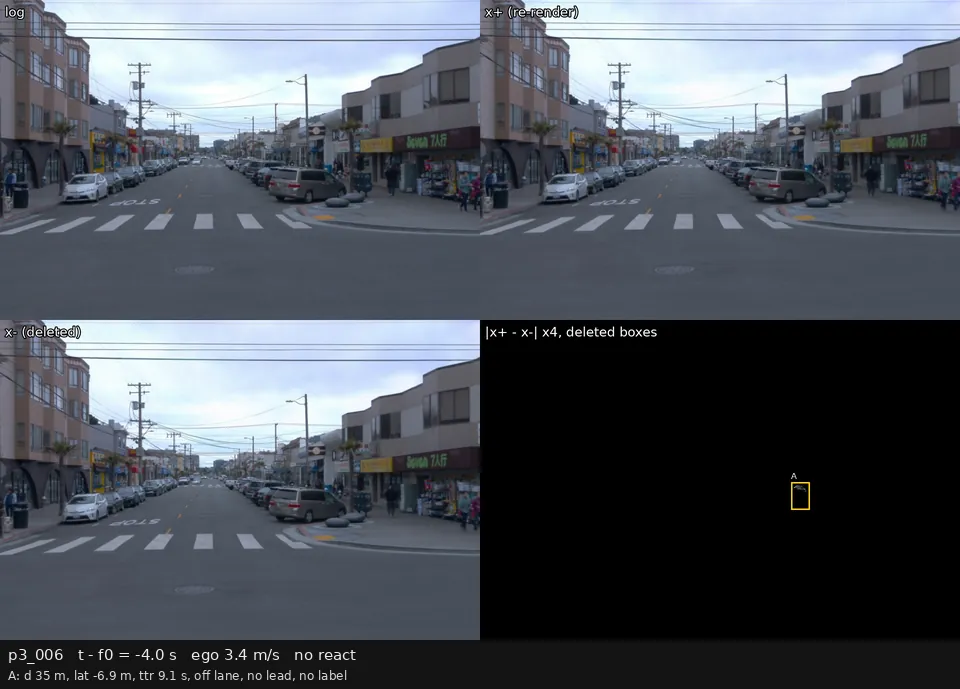
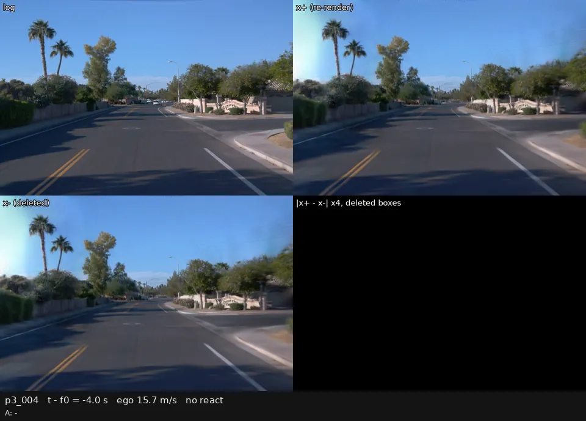
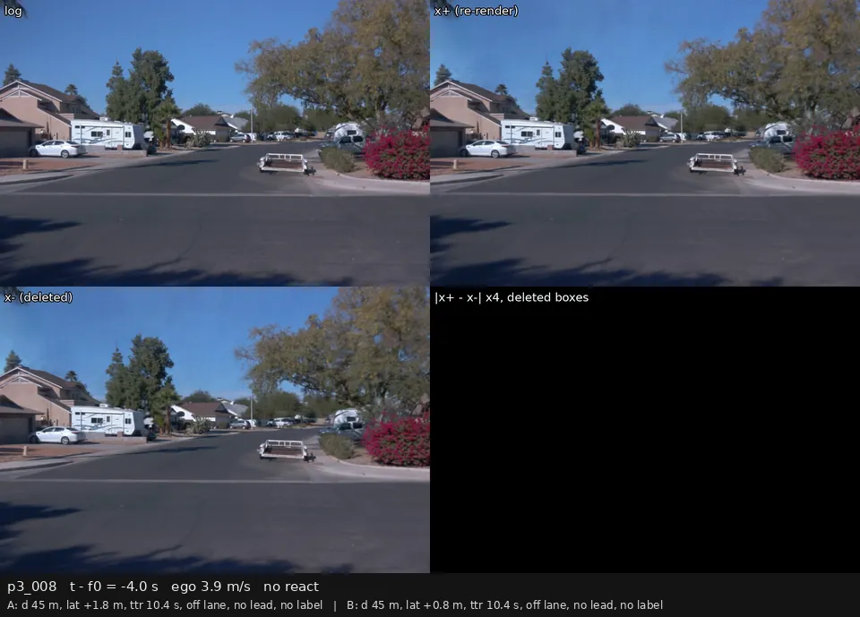
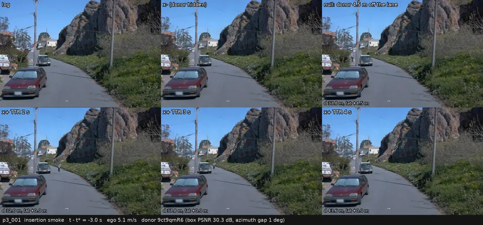
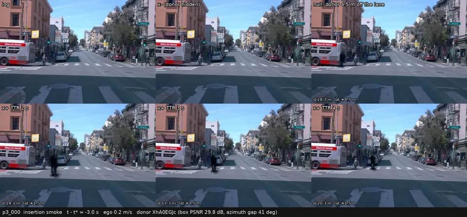
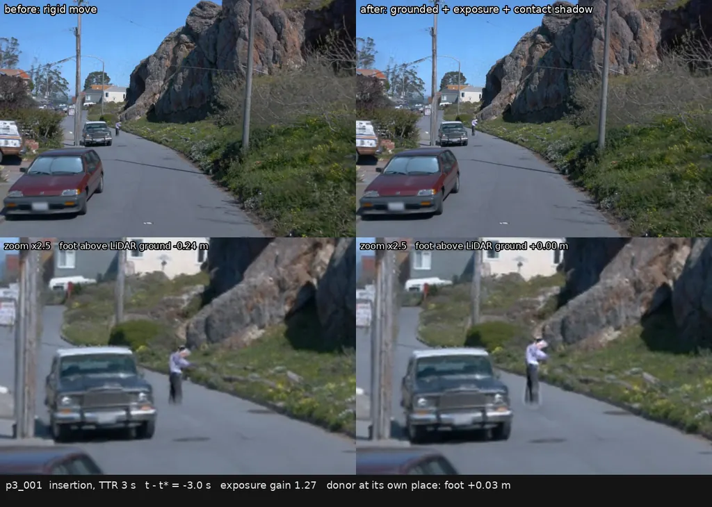
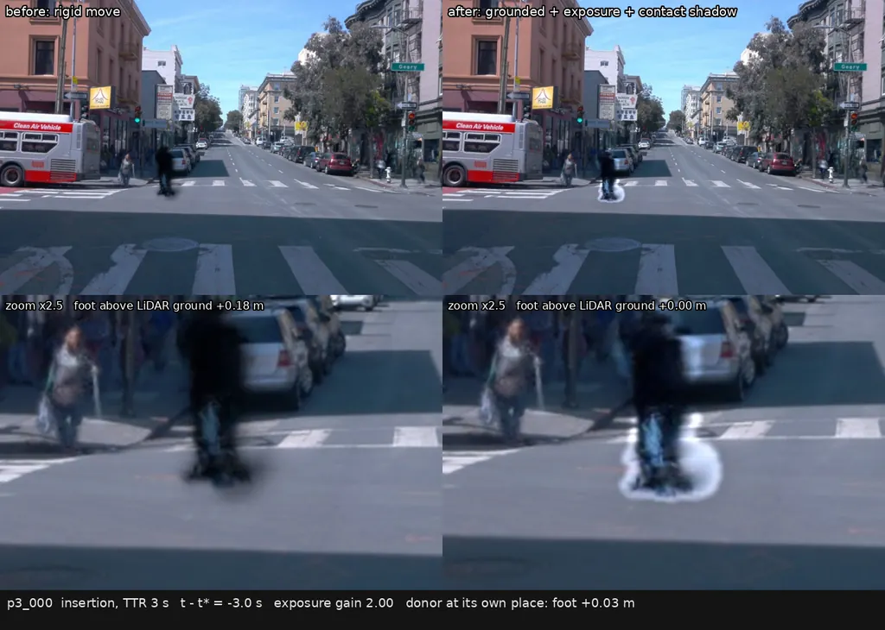

# 真实外观行人考卷：哪些删人配对才算「该反应」的考题

2026-09-28。这篇讲的是夜间队列 4 里 P3 这一条（用真实道路录像重建出来的场景做行人反应考卷）的现状：可行性门过了，但按用户指出的三个问题重新检查后，已经做好的 10 个场景里没有一道有效的「该反应」考题，而且在 Waymo 数据上靠删人凑不出 60 个有效场景。
执行记录和登记原文在 [night-queue-4 todo 的 P 节](../todos/2026-09-26-night-queue-4.md)，工作笔记在 [tmp/2026-09-28-p3-filter.md](../tmp/2026-09-28-p3-filter.md)，所有表在 [results/nq4/p3/filter/](results/nq4/p3/filter/)。

## 这套考卷是怎么造的

从 WOD（Waymo Open Dataset 的感知数据集，每段 20 s、5 路相机、10 Hz 激光雷达和带 track id 的 3D 框）里挑出「有行人走进本车前方走廊」的片段，用 OmniRe（一种动态 3DGS 场景重建：把场景拆成静态背景加每个行人、每辆车各自的可动节点，再用高斯点渲染任意视角）重建。
每个场景渲出三个世界，沿录像里的真实本车轨迹、5 Hz：

| 名字 | 是什么 | 用来做什么 |
|:--|:--|:--|
| 录像（log） | 原始相机图像 | 参照 |
| 原样重渲染（文中也写 x⁺） | 重建后按原轨迹重新渲染，内容不变 | 与录像比，测「外观换成重建」会不会让模型乱动 |
| 删人重渲染（x⁻） | 同一重建，把走廊里的行人节点去掉 | 与原样重渲染比，测模型会不会因为行人而减速 |

考生是 openpilot（comma.ai 的开源驾驶模型）两个版本 Cinque 和 Lebowski。读数有两种：登记的读数是 `ridge_late`（在 openpilot 冻结的时序特征上训的一个线性速度读出头），描述用的是 openpilot 自己输出的规划轨迹。
「翻转」= 两张图上 2 s 后的纵向速度差 ≥ τ（阈值，取自已有车辆考卷的对照组，Cinque 0.53 m/s、Lebowski 0.73 m/s）。录像对原样重渲染的翻转叫**误翻**（场景内容没变，不该动），原样对删人的翻转叫**配对翻转**。

## 结论

1. **可行性门按登记过了。** 10 个场景合并，Cinque 的误翻率 10/230 = 4.35%（按场景重抽样的 95% 区间 [1.30%, 7.39%]），低于登记的 7%；删人区域的残影由用户看过全部 10 个场景的对比图，判删除基本没问题（场景 0 在 2026-09-27，场景 1–9 在 2026-09-28）。
2. **但 10 个场景里没有一道有效的「该反应」考题。** 按下面的规则，230 个打分帧里没有一帧满足「被删的行人在本车车道内、4 s 内会被本车碰到、中间没有前车、前相机已经连续看得见 1 s」。原因是选场景的锚点：登记用的是行人刚进入 ±4 m / 30 m 走廊的那一刻，打分窗口里行人大多还在 20–45 m 外的人行道上。
3. **打分帧本身印证了这条线。** 被删行人全都在车道外的 200 帧上，四个读数的配对翻转全是 0；已登记报出的全部配对翻转都落在另外 30 帧——行人已经进了车道、但还远于 4 s 的那些帧。
4. **在 Waymo 上靠删人凑不出 60 个有效场景。** 全部 1 000 段里满足全部规则的只有 10 段，阈值放到最松也只有 17 段。
5. **四条出路**：① 接受一个约 12 段的小考卷作真实外观抽查；② 加别的数据集（Argoverse 2 等）；③ 把重建出来的真实行人节点平移进本车车道、控制到达时间，人为造出有效考题；④ 放宽定义，把「提前减速」等灰色情形也分类读出。用户 2026-09-28 选了 ③ 和 ④，并要求同样的思路扩展到车辆事件（见最后一节：车辆的有效场景约 90 段，≥ 60 可达，但九成是车道内停着的车）。

## 用户的三个意见和对应的规则

用户看完对比图后指出：很多被删的行人人眼不容易注意到，要连续几帧、要离得近才看得出；有时行人在前车前面，老司机跟着前车走，行人是前车的事，只有行人到了自己车前才减速；单张模糊的静帧里，连专家也会把行人当成背景。
三点说的是同一件事：一对原样 / 删人图只有在「正确的本车动作在两张图上真的不同」时，才是一道「该反应」的考题。登记的走廊（沿本车实际未来轨迹 30 m、左右各 4 m）比这宽得多。

下面的量都用 WOD 的标注逐帧（10 Hz）、逐个行人算。路径 = 整段录像里本车实际走过的轨迹；一个物体在路径上的位置记作弧长 S 和横向偏移 L；d = 物体弧长减本车弧长（从后轴量）。

| 规则 | 定义 | 为什么（对应哪条意见） |
|:--|:--|:--|
| 在车道内 | \|L\| ≤ 1.75 m，且 4 m ≤ d ≤ 34 m（车头前方、30 m 以内） | 「到了自己车前才减速」：人行道上的人不算 |
| 冲突 | 接下来 2 s 内该行人会进入车道（用它录像里的真实未来位置），且到达时间 TTR ≤ 4 s（TTR = 本车按当前车速、最低按 3 m/s 算，开到行人所在位置要的时间） | 「要离得近」 |
| 没有前车 | 同一帧没有车辆或骑车人在车道内、夹在本车和行人之间；有就不算 | 「行人是前车的事，跟着前车走」 |
| 看得见 | 该行人在前相机上有人工标的 2D 框（WOD 的相机标注只框可见部分），框高 ≥ 40 像素（原图 1920×1280），而且在此之前连续 1 s 每帧都有 | 「连续几帧才注意得到」「静帧会当背景」 |
| 该反应帧 | 冲突、没有前车、看得见三条同时成立 | 考题 |
| 司机真的减速了 | 第一个该反应帧前 1 s 的最高车速，减去之后 3 s 的最低车速，≥ max(1 m/s, 20%) | 录像里的真人司机作为「该反应」的确认 |
| 重建够清楚 | 该反应帧上，原样重渲染对录像在该行人框内的 PSNR（峰值信噪比）≥ 20 dB | 删的东西要先被重建出来 |
| 锚点 | 场景的时间锚点改为第一个该反应帧，打分窗口前 3 s 后 2 s；其余登记规则不变 | 原锚点落在行人还在 30 m 外的时候 |

每个打分帧因此分成三类：**该反应**（考题，原样和删人的正确动作不同）；**干净**（被删的行人全在车道外，正确动作相同，可以当第二个对照组）；**灰色**（有被删行人在车道内，但太远、在前车后面或还看不见，既不当题也不当对照）。

## 为什么用几何规则为主、司机反应为辅

同一个减速量，在全部 1 000 段上按行人类别统计（本车当时 ≥ 2 m/s，之后有 3 s 录像）：

| 行人类别（按第一次满足的那一帧） | 事件数 | 司机减速的比例 | 速度下降中位（m/s） |
|:--|--:|--:|--:|
| 冲突、没有前车、看得见 | 50 | **98%** | 3.60 |
| 冲突、没有前车、还看不见 | 20 | 95% | 1.62 |
| 冲突、有前车 | 2 | 100% | 5.98 |
| 只进过 ±4 m 走廊、从没冲突 | 308 | 54% | 1.46 |
| 附近没有行人的随机时刻（基线） | 4 173 | 24% | 0.35 |

几何上的冲突几乎总伴随真人减速（98%），所以「司机减速」在冲突之上几乎不再筛掉东西，它是确认而不是主筛子。反过来只看减速也不行：只进过走廊的行人旁边有一半时间在减速、没有行人时也有四分之一，这些多是路口、红灯、转弯造成的，删掉行人后照样会减速。

前车规则在 1 000 段的冲突事件里只遇到 2 次（行人真在车道里、4 s 以内时，中间很少夹着车），几乎不损失考题，按用户的论证保留。
「看得见」用相机标注而不是从渲染图里估：行人 3D 框落在前相机视野（40 m 内、左右 22°）里时，有 2D 标注的比例按段统计中位 96%，缺的就是被挡住的。10 个场景里，没有标注的帧上删人只改变框内 1–8% 的像素（被挡住，删了也看不出来），有标注后改 18–33%，两边对得上。

## 10 个场景逐个看

每个被删行人在 23 个打分帧（锚点前 2.4 s 到后 2.0 s）上的情况：

| 场景 | 被删行人 | 离路径中线最近（m） | 距离范围（m） | 在车道内的帧 | 有前车的帧 | 前相机有标注 | 框内 PSNR（dB） | 删人改动的像素 | 为什么不成题 |
|:--|:--|--:|:--|--:|--:|--:|--:|--:|:--|
| 0 | 4 人 | 3.2–4.0 | −2.6–24.5 | 0 | 0 | 0–61% | 20.6–31.3 | 29–92% | 都在人行道上 |
| 1 | 1 人 | 2.5 | 20.0–43.5 | 0 | 0 | 0% | 24.7 | 2% | 车道外，且前相机看不见 |
| 2 | 2 人 | 0.0 | 19.6–42.1 | 14 | 6 | 100% | 23.8–24.6 | 23–30% | 正在横穿，但窗口内还远于 4 s；锚点后 2.9 s 才成题 |
| 3 | 2 人 | 3.4–3.6 | 15.2–38.6 | 0 | 19 | 100% | 23.7–25.0 | 54–58% | 车道外，还在前车前面 |
| 4 | 1 人 | 2.9 | 0.3–68.1 | 0 | 0 | 83% | **19.7** | 38% | 车道外（本车 12 m/s），重建也不够清楚 |
| 5 | 1 人 | 3.1 | 18.2–39.5 | 0 | 0 | 100% | 26.8 | 19% | 车道外，往远处走 |
| 6 | 1 人 | 3.3 | 3.7–27.5 | 0 | 0 | 52% | 31.4 | 8% | 车道外，快到跟前才露出来 |
| 7 | 2 人 | 2.9–3.5 | −10.3–38.8 | 0 | 0 | 0–100% | 24.3 | 17% | 车道外；另一人一开始就在车后 |
| 8 | 2 人 | 0.7–1.7 | 20.9–39.2 | 16 | 0 | 52–57% | 26.1–27.2 | 20–26% | 30 m 外从车道里走出去，本车到时已不在 |
| 9 | 1 人 | 2.2 | 18.0–44.9 | 0 | 6 | 100% | 24.4 | 30% | 车道外，部分帧在前车前面 |

逐人的明细在 [scenes_ped_frames.csv](results/nq4/p3/filter/scenes_ped_frames.csv)。17 个被删行人里 13 个离路径中线始终 ≥ 2.1 m。只有场景 2 在锚点后移后成题：两个孩子在本车右转时横穿人行横道，第一个该反应帧在录像 12.4 s（原锚点后 2.9 s），真人司机从 3.4 m/s 减到 0.1 m/s 让行。

**按帧类别拆开的翻转数**（阈值与翻转定义同登记；openpilot 自带规划没有自己的阈值，借用同一模型线性读出头的）：

| 读数 | 全部 230 帧：误翻 / 配对翻转 | 干净 200 帧：误翻 / 配对翻转 | 灰色 30 帧：误翻 / 配对翻转 | 该反应帧 |
|:--|:--|:--|:--|:--|
| 线性读出头 Cinque（登记考生） | 10 / 1 | 10 / **0** | 0 / 1 | 0 帧 |
| 线性读出头 Lebowski | 4 / 6 | 3 / **0** | 1 / 6 | 0 帧 |
| openpilot 自带规划 Cinque | 27 / 14 | 25 / **0** | 2 / 14 | 0 帧 |
| openpilot 自带规划 Lebowski | 12 / 6 | 12 / **0** | 0 / 6 | 0 帧 |

所有配对翻转都是「有行人时更慢」，全部落在场景 2 和场景 8 的 30 个灰色帧上：模型只对已经进了车道、但还有 4 s 以上的行人提前减速，对车道外的删人完全不动。于是干净帧可以直接当删人型对照组（200 帧、0 翻转）；灰色帧上的提前减速算谨慎还是过度反应，没有标准答案，不能当题。

## 视频片段

单张对比图正是用户说的问题所在：行人要看连续几帧才分得出来。下面每段是前相机、以锚点为中心前后各 4 s，这里压成 960 像素宽、5 帧每秒循环播放（完整的 1920 像素、10 帧每秒版本在 Mac 的 `tmp/p3-clips/` 和 box 的 `runs/nq4/p3/filter/clips/`）。

**四格怎么看**：左上是录像原图，右上是原样重渲染，左下是删人重渲染，右下是两者之差放大 4 倍；被删行人的框只画在右下格里（红 = 规则判为该反应的帧，黄 = 其他），前三格不画框，方便判断「不看框能不能注意到这个人」。底栏逐帧写：相对锚点的时间、本车速度、是否该反应帧；每个被删行人（A、B…）的距离、横向偏移、到达时间、在不在车道、有没有前车、前相机标注框高。

场景 2，唯一成题的场景。两个孩子沿人行横道横穿，本车在右转；看底栏在 +3 s 附近变红，此时 B 已经在车道内、到达时间 4 s 以内，右上和左下的差别就是这道题。

场景 0，典型的人行道情形。四个被删行人离路径中线始终 3 m 以上，本车从旁边开过，正确动作在两张图上一样；这类场景做「该反应」题是无效的，但可以当删人型对照。

场景 1，被遮挡的行人。前相机从头到尾没有这个人的标注，右下格的差几乎是空的（删人只改了 2% 左右的像素）：删没删在画面上看不出来。

场景 6，前段被挡、快到跟前才露出来的行人。锚点前后大部分时间右下格几乎没有差，+0.4 s 以后行人露出、差才出现；这时他在车道外 3 m 多、离本车 13 m 以内。

场景 4，重建质量最差的场景：本车 12 m/s，原样重渲染的天空有青色色块，行人框内 PSNR 19.7 dB。它贡献了登记门里 10 个误翻中的 3 个。

场景 8，灰色帧的例子。两个行人一开始在车道里但在 30 m 以外，正往车道外走，本车开到时他们已经离开；模型在这些帧上的提前减速是登记配对翻转的另一个来源。

## 还剩多少、卡在哪

「存活」= 一段里至少一个事件过全部规则。A = 保留登记的锚点，要求打分窗口里有该反应帧且司机减速；B = 把锚点改到第一个该反应帧，再套用登记的其余规则。

| 规则组合 | 基准阈值：1 000 段中 | 其中属于 66 个登记合格段 | 最松阈值（到达时间 6 s、车道半宽 2.5 m、连续可见 0.5 s） |
|:--|--:|--:|--:|
| A：登记锚点 | — | **11** | 16 |
| B：改锚点，登记规则全保留，司机减速 | **10** | 10 | 17 |
| B，去掉「本车 ≥ 2 m/s」（停着的本车要求行人离开车道后 2 s 内起步） | 12 | 10 | 21 |
| B，去掉「要删的行人 ≤ 5 个」 | 14 | 12 | 21 |
| B，去掉上面两条，也不要求司机减速 | 42 | 13 | 60 |
| 上限：有任何一个该反应事件的白天段 | 66 | 16 | 89 |

单独放宽一项（其余不变，B 全规则）：到达时间 5 s → 14 段，6 s → 15 段，车道半宽 2.5 m → 14 段，可见 0.5 s → 10 段，不要求框高 → 11 段。
A、B 合起来 12 段（登记合格池里的第 2、13、19、21、24、28、44、46、47、51、58、61 段），13 个事件、119 个该反应帧；12 段都已完成重建前的预处理，目前只有第 2 段有训练好的重建。

最大的一刀是本车速度：锚点后移后，205 个白天、时间窗合格的该反应事件里有 132 个发生在本车停着的时候——行人从停着的车前走过人行横道。这时删掉行人，本车该不该走取决于红灯、停止线、排队，行人往往不是拦住它的原因。用「行人离开车道后 2 s 内本车起步」检验，慢于 2 m/s 的 155 个事件里只有 9 个满足，所以放开速度规则几乎不加有效题（10 → 12 段）。第二刀是人数：真有行人走进车道的地方多是人行横道，要删的人数中位是 6。

要数到 60，得用最松的阈值同时去掉速度、人数、司机减速三条，这样放进来的大多是停在路口、成群过街的情形，不是有效的反应题。**所以在 WOD 上靠删人做不出 ≥ 60 个有效场景。**

## 用户的决定和接下来的做法

用户 2026-09-28 看过这篇和视频片段，认可上面的分析，决定走出路 ③（插入）和 ④（分类读出），并把「真人司机的反应当标签」扩展到车辆事件。登记修正写在 [todo 的 P 节](../todos/2026-09-26-night-queue-4.md)（「登记修正 2」，写于下面所有新数字之前），状态为**用户批准方向 2026-09-28**；下面这张类别表里的具体阈值用户已看过（2026-09-28），不改。

### 分类考卷：每个打分帧归哪一类、各自期望什么

一对「原样 / 删掉某个对象」的图，每个打分帧按被删对象的状态归到下面某一类（同一帧有多个被删对象时取优先级最高的一类）。v 是该帧本车速度。

| 优先级 | 类别 | 条件（阈值用户已审） | 正确动作是否不同 | 怎么读 |
|:--|:--|:--|:--|:--|
| 1 | 该反应 | 本车 ≥ 2 m/s；对象 2 s 内会进入车道（\|L\| ≤ 1.75 m，车头前 4–34 m）；到达时间 ≤ 4 s（行人按本车速度、最低 3 m/s 算；车辆按两车接近速度算）；中间没有别的车；前相机连续看见 ≥ 1 s（标注框高 ≥ 40 像素）；这次事件里真人司机减速了（1 s 内最高速度减 3 s 内最低速度 ≥ max(1 m/s, 20%)） | 不同，有对象时应更慢 | 命中率 = 原样图比删后图慢 ≥ τ 的比例；选择性 = 命中率 − 干净帧的翻转率；至少 30 帧、5 个场景才下结论 |
| 2 | 该反应但司机没减速 | 同上，只是真人没减速 | 不确定 | 只报比例 |
| 3 | 停车等人 | 本车 < 2 m/s；对象在车道内；前面没有车；看得见；对象离开车道后 2 s 内本车起步 | 不同，有对象时应停着 | 同「该反应」，单独成表 |
| 4 | 前车后面 | 对象在车道内或冲突，但中间夹着别的车 | 不要求（跟着前车） | 只报比例 |
| 5 | 还看不见 | 冲突、没有前车，但前相机还没连续看见 1 s | 不要求 | 只报比例；比干净帧高 10 个百分点以上就标出来（可能是渲染泄漏） |
| 6 | 停车、另有原因 | 本车 < 2 m/s、对象在车道内，但对象走后本车没有马上起步 | 不确定（红灯、排队） | 只报比例 |
| 7 | 远处在车道内 | 本车 ≥ 2 m/s、对象在车道内，但到达时间 > 4 s | 不确定（提前谨慎） | 只报比例 |
| 8 | 干净 | 所有被删对象此刻和 2 s 内都在车道外 | 相同 | **删除型对照门：合并翻转率 ≤ 7%**，与外观对照同一条线 |

考卷要能读，外观对照（录像对原样重渲染）和删除型对照（干净帧）两道门都要过；「该反应」和「停车等人」是考题本身，报命中率和选择性，不给模型设及格线。

**用在已有的 10 个场景上**（只用已存的读数，CPU）：230 帧里干净 184 帧（8 个场景）、远处在车道内 40 帧（场景 2 和 8）、前车后面 6 帧（场景 2），其余类别 0 帧。

| 读数 | 干净 184 帧：配对翻转 | 远处在车道内 40 帧：配对翻转（均为有行人时更慢） | 前车后面 6 帧 | 外观对照误翻（全部 230 帧） |
|:--|--:|--:|--:|--:|
| 线性读出头 Cinque | **0** | 1 | 0 | 10 |
| 线性读出头 Lebowski | **0** | 6 | 0 | 4 |
| openpilot 自带规划 Cinque | **0** | 14 | 0 | 27 |
| openpilot 自带规划 Lebowski | **0** | 6 | 0 | 12 |

删除型对照门在 10 个场景上 0/184 = 0%，过。该反应类 0 帧，所以这 10 个场景只能当对照，不能当考题；反应读数要等扩量后的场景。

### 车辆事件有多少

同一套几何用在全部 1 000 段的车辆上，删的是事件车辆这一辆。事件按第一次冲突的那一帧分类：加塞（之前 1–3 s 在相邻车道、方向与本车一致，然后切进来）、前车急刹（在车道内 ≥ 3 s 的前车自身减速 ≤ −3 m/s²）、车道内停着的车（本车正前方直线车道里速度 < 1 m/s、方向与车道一致的车，本车之后不转弯）、路口横穿（方向夹角 45°–135°）、对向侵入（夹角 > 135°）。「有效」= 本车 ≥ 2 m/s、中间没有别的车、前相机连续看见、真人司机有反应（减速；停着的车也算横向避让 ≥ 1 m）、时间窗合格、白天。

| 类别 | 事件（本车在动、时间窗内、白天） | 中间没有别的车 | 看得见 | 司机有反应 | 反应率 | 有有效事件的段数 |
|:--|--:|--:|--:|--:|--:|--:|
| 车道内停着的车 | 114 | 92 | 92 | 89 | 97% | **82** |
| 路口横穿 | 21 | 21 | 9 | 6 | 67% | 6 |
| 加塞 | 15 | 14 | 9 | 1 | 11% | 1 |
| 对向侵入 | 1 | 1 | 1 | 1 | — | 1 |
| 前车急刹 | 0 | 0 | 0 | 0 | — | 0 |
| （描述）普通跟车 | 32 | 31 | 31 | 15 | 48% | — |
| 任意类别 | | | | | | **90**（其中 9 段在行人合格池里） |
| 对比：行人 | | | | | | 10 |
| 对比：随机行驶时刻 | | | | | 24% | — |

车辆的有效段数是行人的 9 倍，**≥ 60 个有效场景对车辆可达**，但 90 段里 82 段是「车道内停着的车」（本车减速或绕开；推测多为路边违停、双排停车，还没逐段看过），另外几类很少：加塞大多不需要刹车（反应率 11%，删掉它正确动作几乎不变），WOD 标注的加速度很少到 −3 m/s²，所以前车急刹一个也没数到。事件明细在 [vehicle_events.csv](results/nq4/p3/filter/vehicle_events.csv)。

它和已有的车辆考卷互补：HUGSIM 3DGS 车辆配对是把车插进场景、正确动作来自规则专家；这里是删掉真实存在的车，「该反应」由录像里的真人司机确认。

**车辆扩量（用户 2026-09-28 批准，不设数量目标，规则下合格的全做）**：90 段里 9 段已经在行人合格池里处理好，其余 81 段要下载 scene-flow 数据，约 81 GB（每段下载 1–5 min），预处理每段约 8 核·min，重建每段约 0.75 卡·h，合计约 61 卡·h。建议按 crc32 顺序取全部 90 段，先做 1 段冒烟（用已在池里的一段，不用下载）。

### 插入的可行性冒烟

把同一段里重建出来的一个真实行人节点，保留它自己的步态，旋转平移到本车车道中央、横穿车道，在锚点时刻让本车到它的到达时间分别为 2、3、4 s；对照是同一个人放到车道外 4.5 m 沿路走。供体按前相机标注帧数挑，要求它在原位置的重建框内 PSNR ≥ 22 dB、搬过去后相机看它的角度与录像里看到过的角度相差 ≤ 45°。在 GPU 6 上用已有重建做了 2 个场景（场景 2 没有合格供体：候选的框内 PSNR 21.7 dB、视角差 65°）。

**六格怎么看**：上排是录像、删掉供体、对照（车道外 4.5 m）；下排是到达时间 2 s、3 s、4 s 的插入版本，左下角写着供体此刻的距离和横向偏移。请重点看光照是否匹配、有没有影子、脚是否贴地、人是否发虚。

场景 1：供体是一个浅色衣服的行人，视角差 1°、框内 PSNR 30.3 dB，搬到车道里后外观基本完整；没有影子，脚下略虚。

场景 0：供体原本在人行道上（重建框内 PSNR 29.8 dB），搬到车道中央后成了一个发黑、发虚的人形，视角差 41°，接近 45° 的上限；这类情况说明视角规则可能要收紧，或者要加一条亮度匹配检查。

完整的 1920 像素版本在 Mac 的 `tmp/p3-clips/insert_p3_000.mp4`、`insert_p3_001.mp4`。

**用户的评价（2026-09-28）**：the clips look "a bit like a ghost floating", but acceptable——有点像飘着的鬼影，但可以接受。所以插入按登记的设计推进：跑插入型对照和读数，并对所有有合格供体的段批量做；每道题都记下视角差和供体框内 PSNR，以后能把「飘」的题单独分出来。贴地和接触阴影的改法只在场景 1 上试，不挡批量。

### 插入的「飘」：诊断与第一轮修正

用户说插入的人「有点像飘着的鬼影」。对 2 个冒烟场景逐项量了可能的原因（在 GPU 6 上用已有重建，只用 CUDA 渲染）：

| 可能原因 | 怎么量 | 场景 1（视角差 1°） | 场景 0（视角差 41°） |
|:--|:--|--:|--:|
| 脚与地面的高度差 | 供体最低 1% 高斯的高度，减去落点 0.8 m 内激光雷达地面点的中位高度 | **−0.25 m**（脚陷进路面） | **+0.21 m**（悬空） |
| 同一供体在原位置的高度差 | 同上，原位置 | +0.03 m | +0.03 m |
| 位置抖动 | 供体位置二阶差分的标准差 | 0.8 mm（竖直） | 0.7 mm（竖直） |
| 亮度不匹配 | 供体与周围背景的亮度比，原位置对新位置 | 0.89 对 0.70（新位置偏暗 27%） | 0.55 对 0.27（偏暗一倍以上） |
| 接触阴影 | 3DGS 的节点不带阴影 | 没有 | 没有 |

读法：重建本身是贴地的（在原位置脚只高出 3 cm，也不抖），「飘」主要来自搬家这一步。原来的放置只按本车轨迹两处的高度差抬高或压低供体，没考虑人行道的路缘高度和路面横坡，结果场景 1 的人陷进路面 25 cm——小腿被路面的高斯挡住，看上去像一截没有脚、悬着的上身；场景 0 的人高出路面 21 cm。其次是没有阴影，以及从亮处或暗处搬过来后的亮度差。场景 0 另有一个更根本的问题：从录像里没见过的角度（41°）去看这个行人节点，看到的是一团半透明的暗色高斯，这不是亮度能调回来的。

**第一轮修正**（都写成了插入构造的一部分，待用户看视频后决定是否登记）：

1. **贴地**：每一帧把供体的脚放到落点处的激光雷达地面高度上（地面点用 drivestudio 预处理里的地面标签，0.8 m 半径取中位，不够 5 个点放宽到 2 m；再做 1.1 s 的滑动中位，避免引入抖动）。修正后脚与地面的高度差按构造为 0。
2. **亮度匹配**：让供体与周围背景的亮度比等于它在原位置、录像里的那个比（最多取 8 个前相机视角的中位数），每个版本用同一个增益，不逐帧跳。增益限制在 [0.75, 1.33]。
3. **接触阴影**：脚下地面上画一个半径 0.35 m 的圆盘，投影到每个相机后做高斯羽化，把非供体像素最多压暗 50%（环境光遮蔽式的软阴影，不假设太阳方向）。
4. **视角差上限从 45° 收紧到 20°**。

场景 1，到达时间 3 s 的版本，左边是修正前，右边是修正后；下排是脚部附近放大 2.5 倍，左上角写着当帧脚离激光雷达地面的高度（修正前约 −0.25 m）。看右下：小腿和脚完整露出来、站在路面上，脚下有一圈淡阴影，人也亮了一些（增益 1.27）。

场景 0 是个反例（这一版用的是增益上限 2.0 和视角差 45°）：贴地把悬空的 21 cm 消掉了，但亮度匹配顶到了上限 2.0，把供体周围那圈半透明的暗色高斯也提亮了，形成一圈白边。原因是视角差：从没见过的角度看，节点本身就不对。把视角差上限收到 20° 以后，场景 0 前 10 个候选供体一个也不合格（视角差 34°–150°），这个场景就不出插入题；同时增益上限收到 1.33，不再出现白边。

**一句话**：飘的主因是放置高度错了（陷进路面 25 cm 或悬空 21 cm），按激光雷达地面贴脚之后基本解决；接触阴影和亮度匹配是次要的改进；视角差太大的供体修不好，只能靠收紧到 20° 把它排除。修正版的插入题每道都记下视角差、供体框内 PSNR、修正前的脚高差和亮度增益，以后能单独分析。另一个 agent 正在试开源的插入与重光照工具，会以这一版为基线来比较（见下面的「开源工具对比」）。

### 扩量的进度

行人合格池第 10–65 段按登记的流程重建（每段约 0.75 卡·h），分三级：先 1 段，过检查清单后 9 段，再其余 46 段；只用 GPU 6，其他卡等 G 链让出来且卡上没有 CARLA 时才用。2026-09-28 上午盒子上 CARLA 启动卡住，恢复检查通过前新场景暂停启动（第 10 段已在跑）。
