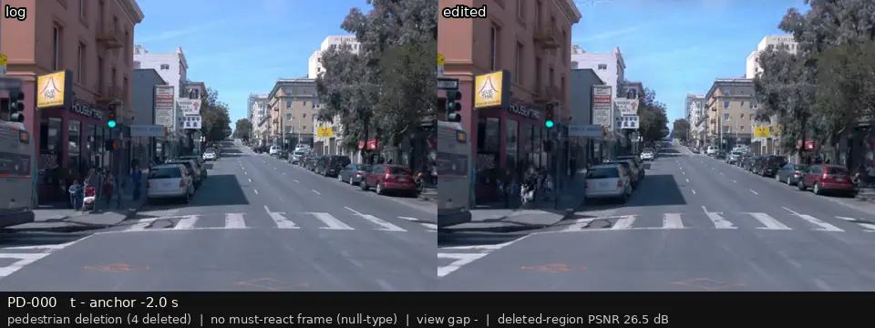
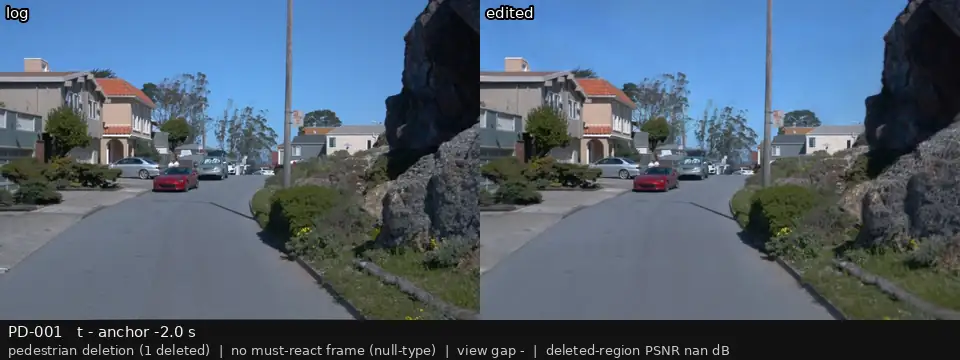
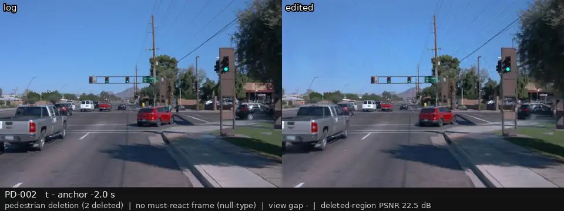
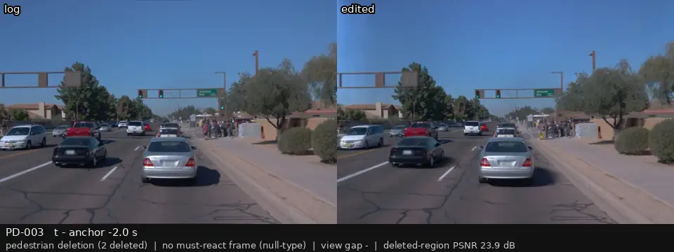
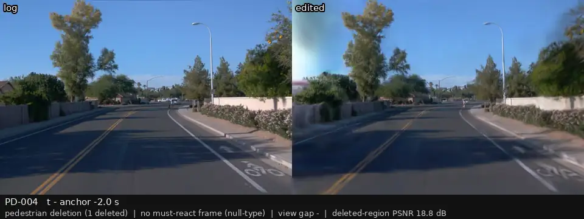
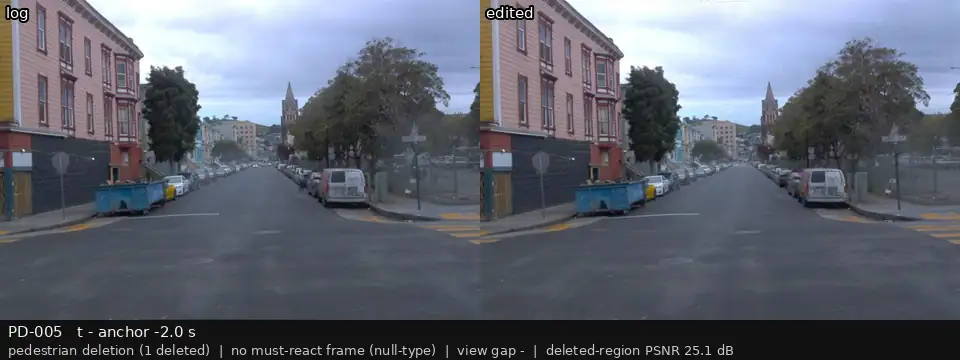
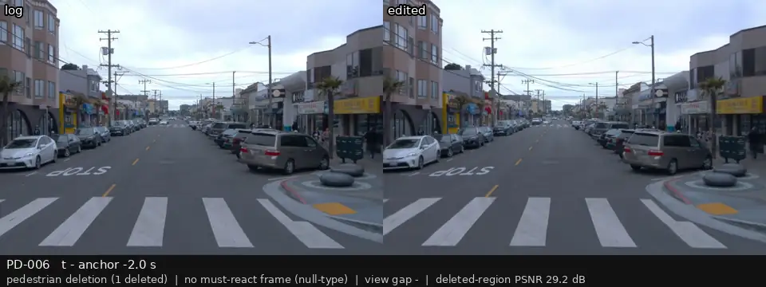
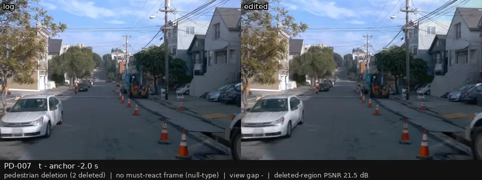
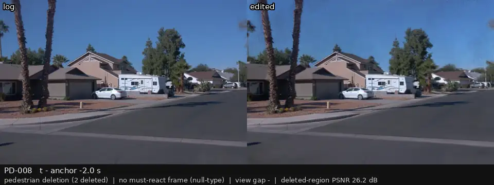
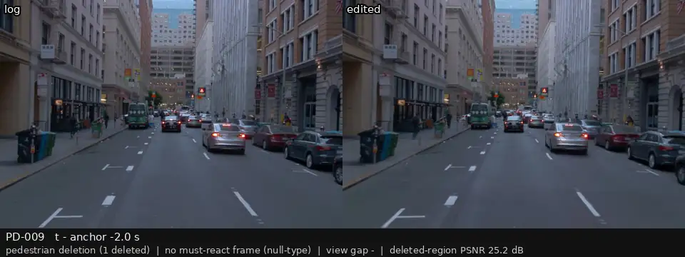

# P3 人工复核：行人删除（登记的目标事件）

[返回总表](../p3-review-sheet.md)

每段视频：前相机，左边是录像，右边是编辑后的画面；锚点前 2 s 到后 1 s，5 帧每秒循环。最后一列留给你填：keep / drop / 备注。

| 视频 | 编号 | 类别 | 视角差 | 框内 PSNR (dB) | 结论（keep / drop / 备注） |
|:--|:--|:--|--:|--:|:--|
|  | PD-000 p3_000 | no must-react frame (null-type) | — | 26.5 |  |
|  | PD-001 p3_001 | no must-react frame (null-type) | — | nan |  |
|  | PD-002 p3_002 | no must-react frame (null-type) | — | 22.5 |  |
|  | PD-003 p3_003 | no must-react frame (null-type) | — | 23.9 |  |
|  | PD-004 p3_004 | no must-react frame (null-type) | — | 18.8 |  |
|  | PD-005 p3_005 | no must-react frame (null-type) | — | 25.1 |  |
|  | PD-006 p3_006 | no must-react frame (null-type) | — | 29.2 |  |
|  | PD-007 p3_007 | no must-react frame (null-type) | — | 21.5 |  |
|  | PD-008 p3_008 | no must-react frame (null-type) | — | 26.2 |  |
|  | PD-009 p3_009 | no must-react frame (null-type) | — | 25.2 |  |
