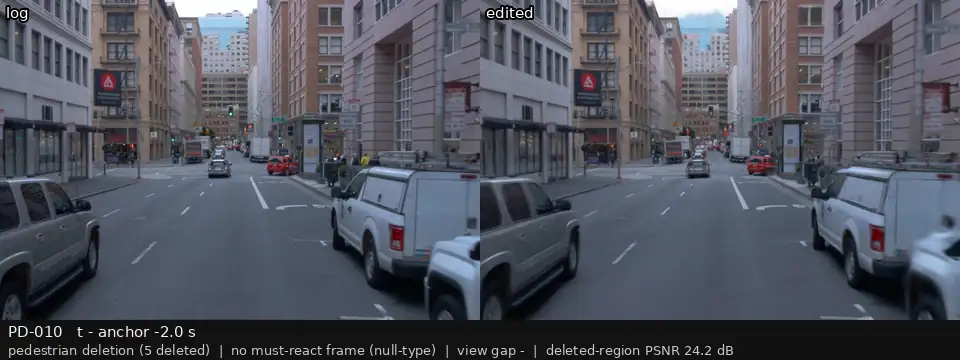
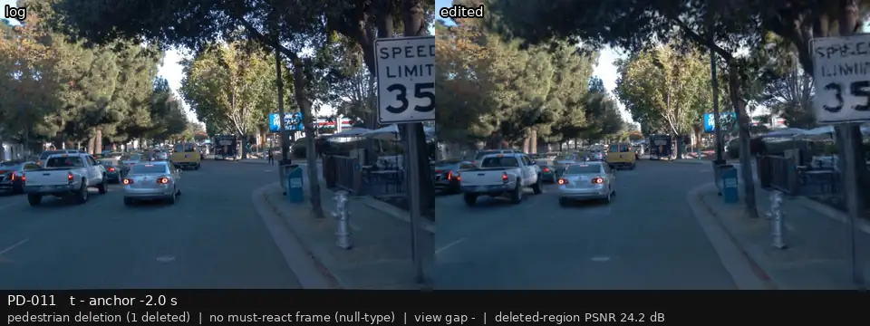
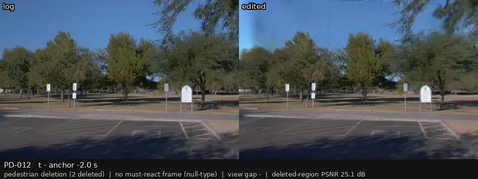
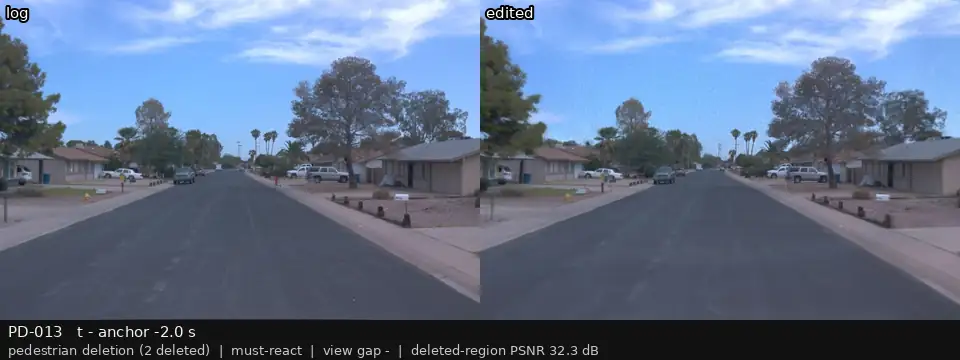
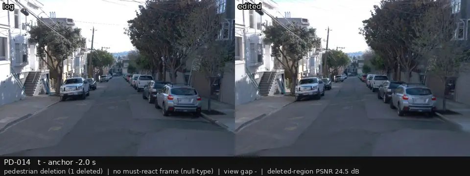
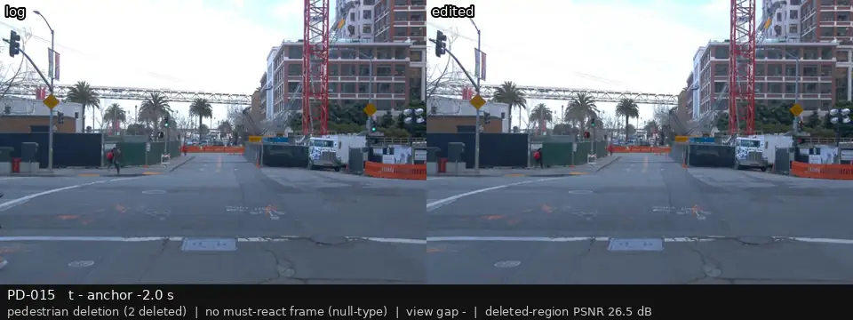
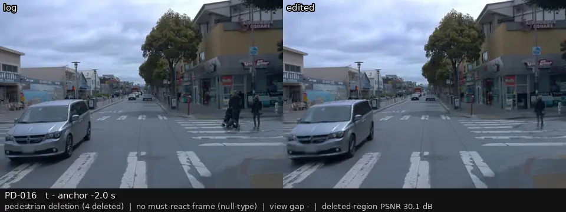
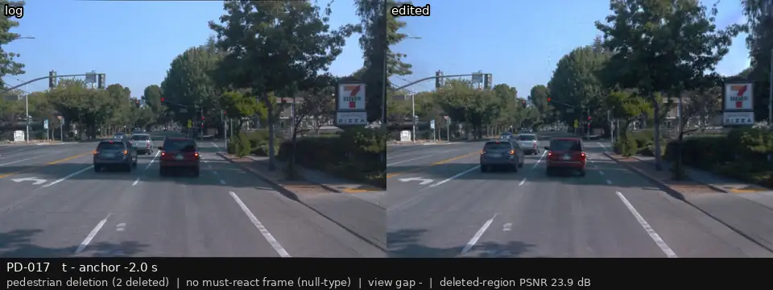
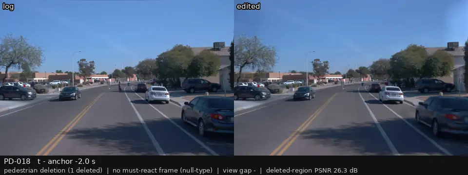

# P3 人工复核：行人删除（登记的目标事件）

[返回总表](../p3-review-sheet.md)

每段视频：前相机，左边是录像，右边是编辑后的画面；锚点前 2 s 到后 1 s，5 帧每秒循环。在「结论（用户填）」那一行后面直接写 keep / drop / 备注，可以在 GitHub 上直接编辑这一行。

### PD-000

| | |
|:--|:--|
| 类别 | no must-react frame (null-type) |
| 场景 | p3_000 |
| 视角差 | — |
| 框内 PSNR | 26.5 dB |

**结论（用户填）：** 

---

### PD-001

| | |
|:--|:--|
| 类别 | no must-react frame (null-type) |
| 场景 | p3_001 |
| 视角差 | — |
| 框内 PSNR | nan dB |

**结论（用户填）：** 

---

### PD-002

| | |
|:--|:--|
| 类别 | no must-react frame (null-type) |
| 场景 | p3_002 |
| 视角差 | — |
| 框内 PSNR | 22.5 dB |

**结论（用户填）：** 

---

### PD-003

| | |
|:--|:--|
| 类别 | no must-react frame (null-type) |
| 场景 | p3_003 |
| 视角差 | — |
| 框内 PSNR | 23.9 dB |

**结论（用户填）：** 

---

### PD-004

| | |
|:--|:--|
| 类别 | no must-react frame (null-type) |
| 场景 | p3_004 |
| 视角差 | — |
| 框内 PSNR | 18.8 dB |

**结论（用户填）：** 

---

### PD-005

| | |
|:--|:--|
| 类别 | no must-react frame (null-type) |
| 场景 | p3_005 |
| 视角差 | — |
| 框内 PSNR | 25.1 dB |

**结论（用户填）：** 

---

### PD-006

| | |
|:--|:--|
| 类别 | no must-react frame (null-type) |
| 场景 | p3_006 |
| 视角差 | — |
| 框内 PSNR | 29.2 dB |

**结论（用户填）：** 

---

### PD-007

| | |
|:--|:--|
| 类别 | no must-react frame (null-type) |
| 场景 | p3_007 |
| 视角差 | — |
| 框内 PSNR | 21.5 dB |

**结论（用户填）：** 

---

### PD-008

| | |
|:--|:--|
| 类别 | no must-react frame (null-type) |
| 场景 | p3_008 |
| 视角差 | — |
| 框内 PSNR | 26.2 dB |

**结论（用户填）：** 

---

### PD-009

| | |
|:--|:--|
| 类别 | no must-react frame (null-type) |
| 场景 | p3_009 |
| 视角差 | — |
| 框内 PSNR | 25.2 dB |

**结论（用户填）：** 

---

### PD-010

| | |
|:--|:--|
| 类别 | no must-react frame (null-type) |
| 场景 | p3_010 |
| 视角差 | — |
| 框内 PSNR | 24.2 dB |

**结论（用户填）：** 

---

### PD-011

| | |
|:--|:--|
| 类别 | no must-react frame (null-type) |
| 场景 | p3_011 |
| 视角差 | — |
| 框内 PSNR | 24.2 dB |

**结论（用户填）：** 

---

### PD-012

| | |
|:--|:--|
| 类别 | no must-react frame (null-type) |
| 场景 | p3_012 |
| 视角差 | — |
| 框内 PSNR | 25.1 dB |

**结论（用户填）：** 

---

### PD-013

| | |
|:--|:--|
| 类别 | must-react |
| 场景 | p3_013 |
| 视角差 | — |
| 框内 PSNR | 32.3 dB |

**结论（用户填）：** 

---

### PD-014

| | |
|:--|:--|
| 类别 | no must-react frame (null-type) |
| 场景 | p3_014 |
| 视角差 | — |
| 框内 PSNR | 24.5 dB |

**结论（用户填）：** 

---

### PD-015

| | |
|:--|:--|
| 类别 | no must-react frame (null-type) |
| 场景 | p3_015 |
| 视角差 | — |
| 框内 PSNR | 26.5 dB |

**结论（用户填）：** 

---

### PD-016

| | |
|:--|:--|
| 类别 | no must-react frame (null-type) |
| 场景 | p3_016 |
| 视角差 | — |
| 框内 PSNR | 30.1 dB |

**结论（用户填）：** 

---

### PD-017

| | |
|:--|:--|
| 类别 | no must-react frame (null-type) |
| 场景 | p3_017 |
| 视角差 | — |
| 框内 PSNR | 23.9 dB |

**结论（用户填）：** 

---

### PD-018

| | |
|:--|:--|
| 类别 | no must-react frame (null-type) |
| 场景 | p3_018 |
| 视角差 | — |
| 框内 PSNR | 26.3 dB |

**结论（用户填）：** 

---
