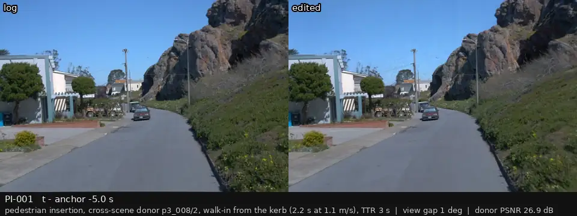
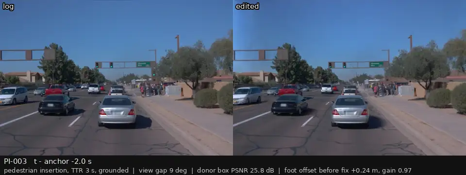
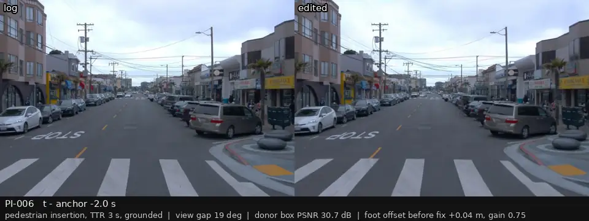
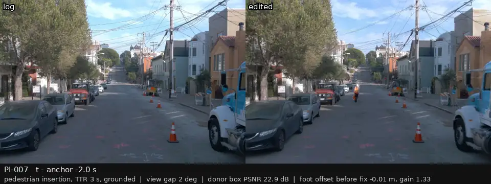

# P3 人工复核：行人插入（贴地标准构造，展示到达时间 3 s 的版本）

[返回总表](../p3-review-sheet.md)

每段视频：前相机，左边是录像，右边是编辑后的画面；锚点前 2 s 到后 1 s，5 帧每秒循环。最后一列留给你填：keep / drop / 备注。

| 视频 | 编号 | 类别 | 视角差 | 框内 PSNR (dB) | 结论（keep / drop / 备注） |
|:--|:--|:--|--:|--:|:--|
|  | PI-001 p3_001 | must-react (TTR 2 / 3 / 4 s) + null | 1° | 30.3 |  |
|  | PI-003 p3_003 | must-react (TTR 2 / 3 / 4 s) + null | 9° | 25.8 |  |
|  | PI-006 p3_006 | must-react (TTR 2 / 3 / 4 s) + null | 19° | 30.7 |  |
|  | PI-007 p3_007 | must-react (TTR 2 / 3 / 4 s) + null | 2° | 22.9 |  |
