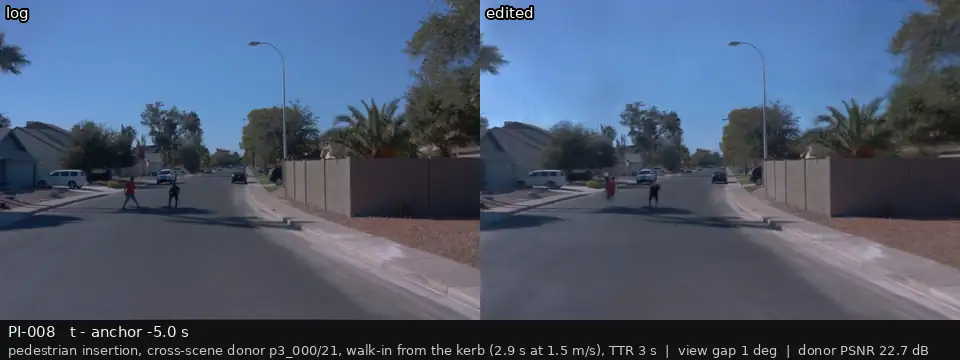
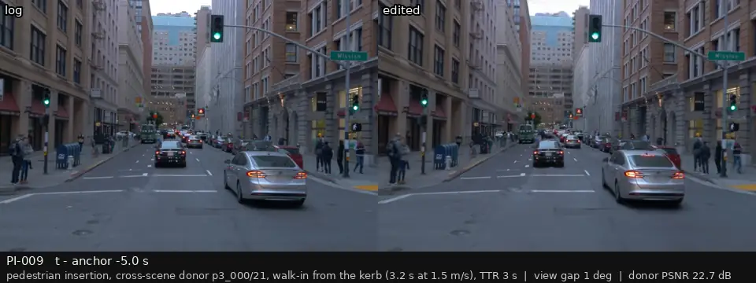

# P3 人工复核：行人插入（跨场景供体、从路边走进车道、贴地标准构造，展示到达时间 3 s 的版本）

[返回总表](../p3-review-sheet.md)

每段视频：前相机，左边是录像，右边是编辑后的画面；锚点前 2 s 到后 1 s，5 帧每秒循环。最后一列留给你填：keep / drop / 备注。

| 视频 | 编号 | 类别 | 视角差 | 框内 PSNR (dB) | 结论（keep / drop / 备注） |
|:--|:--|:--|--:|--:|:--|
|  | PI-001 p3_001 | must-react (TTR 2 / 3 / 4 s) + null; changed 2026-09-28: walk-in rules, cross-scene donor | 1° | 26.9 |  |
|  | PI-002 p3_002 | must-react (TTR 2 / 3 / 4 s) + null | 14° | 24.6 |  |
|  | PI-007 p3_007 | must-react (TTR 2 / 3 / 4 s) + null; changed 2026-09-28: walk-in rules, cross-scene donor | 1° | 22.7 |  |
|  | PI-008 p3_008 | must-react (TTR 2 / 3 / 4 s) + null | 1° | 22.7 |  |
|  | PI-009 p3_009 | must-react (TTR 2 / 3 / 4 s) + null | 1° | 22.7 |  |
|  | PI-012 p3_012 | must-react (TTR 2 / 3 / 4 s) + null | 1° | 22.7 |  |
|  | PI-013 p3_013 | must-react (TTR 2 / 3 / 4 s) + null | 2° | 22.7 |  |
|  | PI-015 p3_015 | must-react (TTR 2 / 3 / 4 s) + null | 2° | 28.6 |  |
|  | PI-016 p3_016 | must-react (TTR 2 / 3 / 4 s) + null | 2° | 26.9 |  |
