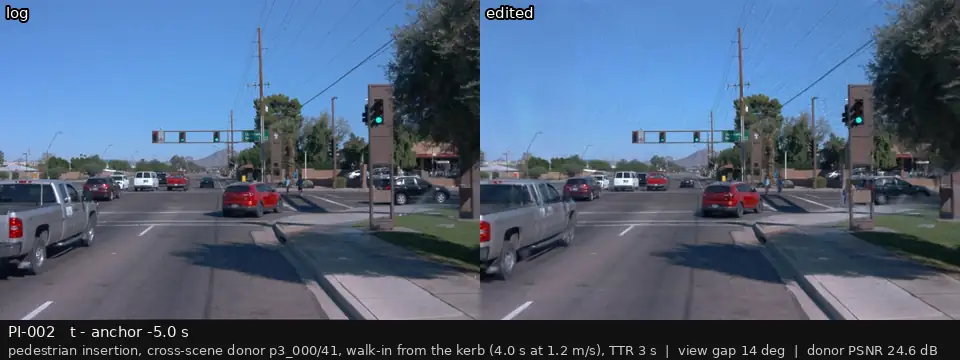
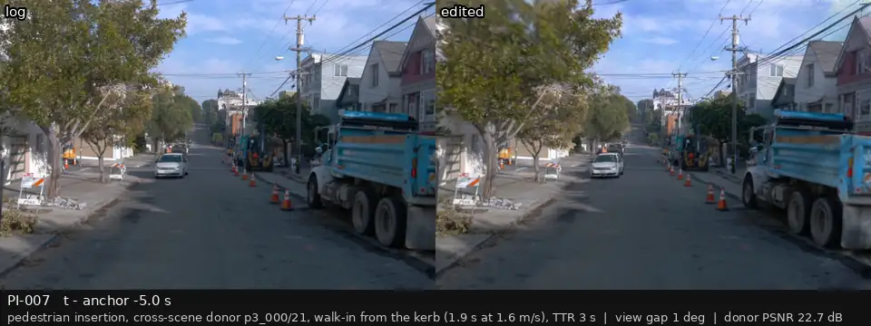
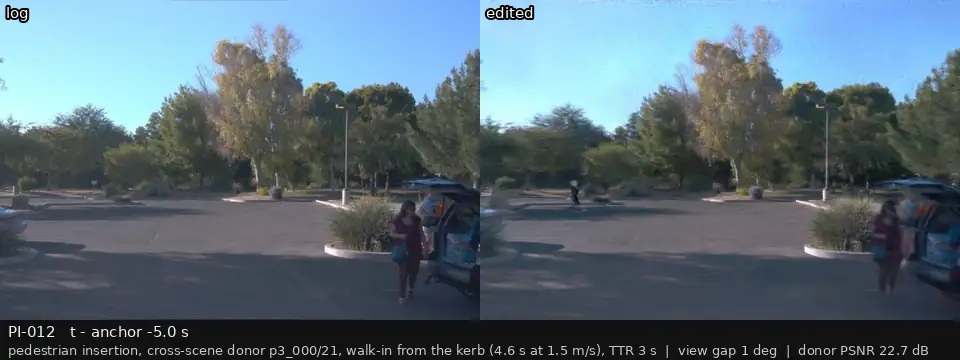
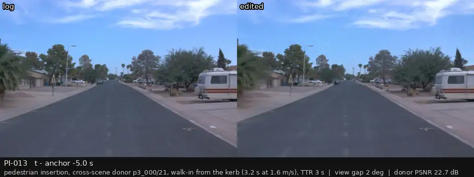
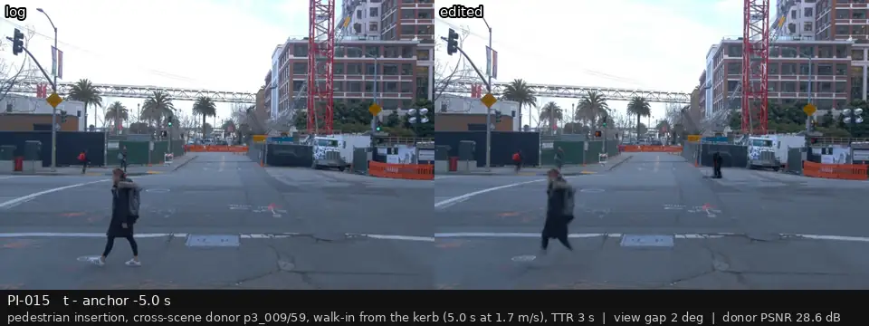
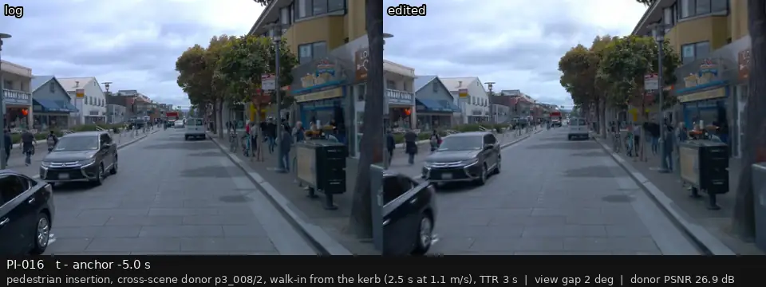

# P3 人工复核：行人插入（跨场景供体、从路边走进车道、贴地标准构造，展示到达时间 3 s 的版本）

[返回总表](../p3-review-sheet.md)

每段视频：前相机，左边是录像，右边是编辑后的画面；锚点前 2 s 到后 1 s，5 帧每秒循环。在「结论（用户填）」那一行后面直接写 keep / drop / 备注，可以在 GitHub 上直接编辑这一行。

### PI-001

| | |
|:--|:--|
| 类别 | must-react (TTR 2 / 3 / 4 s) + null; changed 2026-09-28: walk-in rules, cross-scene donor |
| 场景 | p3_001 |
| 供体 | p3_008/2 |
| 放大倍数 / 视角差 | 2.61x / 1° |
| 门槛 | 待清晰度门槛复查（可能剔除） |
| 框内 PSNR | 26.9 dB |

**结论（用户填）：** 

---

### PI-002

| | |
|:--|:--|
| 类别 | must-react (TTR 2 / 3 / 4 s) + null |
| 场景 | p3_002 |
| 供体 | p3_000/41 |
| 放大倍数 / 视角差 | 1.93x / 14° |
| 门槛 | 待清晰度门槛复查（可能剔除） |
| 框内 PSNR | 24.6 dB |

**结论（用户填）：** 

---

### PI-007

| | |
|:--|:--|
| 类别 | must-react (TTR 2 / 3 / 4 s) + null; changed 2026-09-28: walk-in rules, cross-scene donor |
| 场景 | p3_007 |
| 供体 | p3_000/21 |
| 放大倍数 / 视角差 | 4.60x / 1° |
| 门槛 | 待清晰度门槛复查（可能剔除） |
| 框内 PSNR | 22.7 dB |

**结论（用户填）：** 

---

### PI-008

| | |
|:--|:--|
| 类别 | must-react (TTR 2 / 3 / 4 s) + null |
| 场景 | p3_008 |
| 供体 | p3_000/21 |
| 放大倍数 / 视角差 | 3.14x / 1° |
| 门槛 | 待清晰度门槛复查（可能剔除） |
| 框内 PSNR | 22.7 dB |

**结论（用户填）：** 

---

### PI-009

| | |
|:--|:--|
| 类别 | must-react (TTR 2 / 3 / 4 s) + null |
| 场景 | p3_009 |
| 供体 | p3_000/21 |
| 放大倍数 / 视角差 | 3.93x / 1° |
| 门槛 | 待清晰度门槛复查（可能剔除） |
| 框内 PSNR | 22.7 dB |

**结论（用户填）：** 

---

### PI-012

| | |
|:--|:--|
| 类别 | must-react (TTR 2 / 3 / 4 s) + null |
| 场景 | p3_012 |
| 供体 | p3_000/21 |
| 放大倍数 / 视角差 | 3.77x / 1° |
| 门槛 | 待清晰度门槛复查（可能剔除） |
| 框内 PSNR | 22.7 dB |

**结论（用户填）：** 

---

### PI-013

| | |
|:--|:--|
| 类别 | must-react (TTR 2 / 3 / 4 s) + null |
| 场景 | p3_013 |
| 供体 | p3_000/21 |
| 放大倍数 / 视角差 | 4.58x / 2° |
| 门槛 | 待清晰度门槛复查（可能剔除） |
| 框内 PSNR | 22.7 dB |

**结论（用户填）：** 

---

### PI-015

| | |
|:--|:--|
| 类别 | must-react (TTR 2 / 3 / 4 s) + null |
| 场景 | p3_015 |
| 供体 | p3_009/59 |
| 放大倍数 / 视角差 | 2.61x / 2° |
| 门槛 | 待清晰度门槛复查（可能剔除） |
| 框内 PSNR | 28.6 dB |

**结论（用户填）：** 

---

### PI-016

| | |
|:--|:--|
| 类别 | must-react (TTR 2 / 3 / 4 s) + null |
| 场景 | p3_016 |
| 供体 | p3_008/2 |
| 放大倍数 / 视角差 | 2.44x / 2° |
| 门槛 | 待清晰度门槛复查（可能剔除） |
| 框内 PSNR | 26.9 dB |

**结论（用户填）：** 

---
