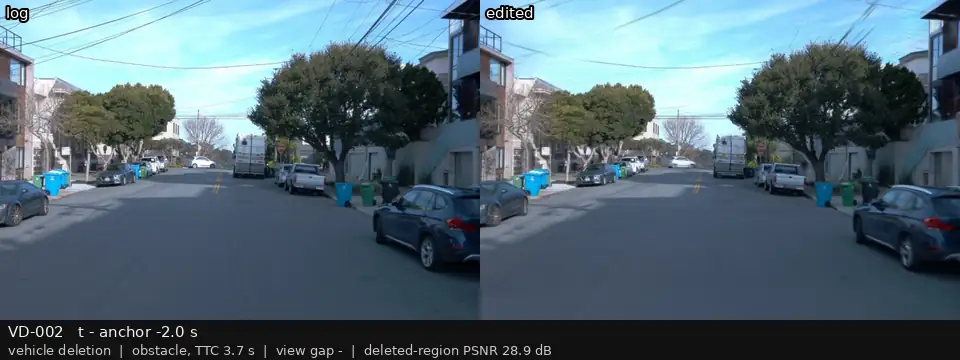
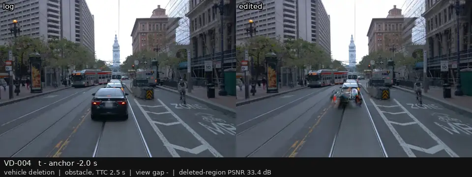
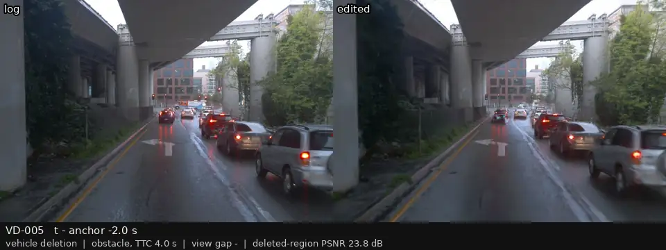
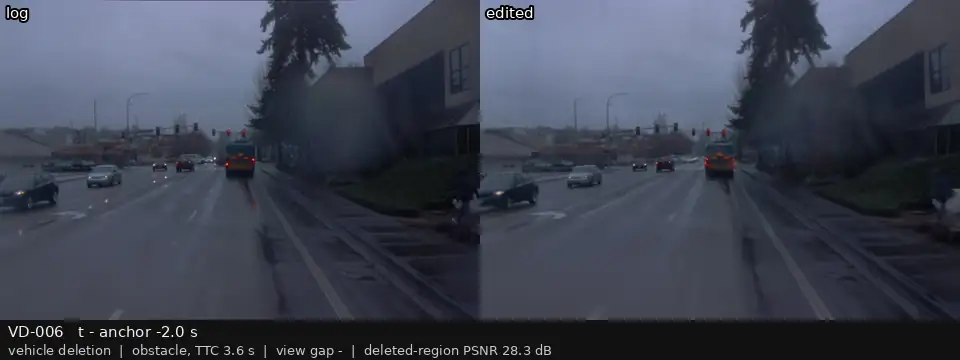

# P3 人工复核：车辆删除（事件车辆）

[返回总表](../p3-review-sheet.md)

每段视频：前相机，左边是录像，右边是编辑后的画面；锚点前 2 s 到后 1 s，5 帧每秒循环。在「结论（用户填）」那一行后面直接写 keep / drop / 备注，可以在 GitHub 上直接编辑这一行。

### VD-000

| | |
|:--|:--|
| 类别 | obstacle |
| 场景 | p3_v000 |
| 视角差 | — |
| 框内 PSNR | 23.2 dB |

**结论（用户填）：** 

---

### VD-001

| | |
|:--|:--|
| 类别 | obstacle |
| 场景 | p3_v001 |
| 视角差 | — |
| 框内 PSNR | 33.7 dB |

**结论（用户填）：** 

---

### VD-002

| | |
|:--|:--|
| 类别 | obstacle |
| 场景 | p3_v002 |
| 视角差 | — |
| 框内 PSNR | 28.9 dB |

**结论（用户填）：** 

---

### VD-003

| | |
|:--|:--|
| 类别 | obstacle |
| 场景 | p3_v003 |
| 视角差 | — |
| 框内 PSNR | 29.5 dB |

**结论（用户填）：** 

---

### VD-004

| | |
|:--|:--|
| 类别 | obstacle |
| 场景 | p3_v004 |
| 视角差 | — |
| 框内 PSNR | 33.4 dB |

**结论（用户填）：** 

---

### VD-005

| | |
|:--|:--|
| 类别 | obstacle |
| 场景 | p3_v005 |
| 视角差 | — |
| 框内 PSNR | 23.8 dB |

**结论（用户填）：** 

---

### VD-006

| | |
|:--|:--|
| 类别 | obstacle |
| 场景 | p3_v006 |
| 视角差 | — |
| 框内 PSNR | 28.3 dB |

**结论（用户填）：** 

---

### VD-007

| | |
|:--|:--|
| 类别 | obstacle |
| 场景 | p3_v007 |
| 视角差 | — |
| 框内 PSNR | 25.8 dB |

**结论（用户填）：** 

---

### VD-008

| | |
|:--|:--|
| 类别 | crossing |
| 场景 | p3_v008 |
| 视角差 | — |
| 框内 PSNR | 26.3 dB |

**结论（用户填）：** 

---

### VD-009

| | |
|:--|:--|
| 类别 | obstacle |
| 场景 | p3_v009 |
| 视角差 | — |
| 框内 PSNR | 29.8 dB |

**结论（用户填）：** 

---
