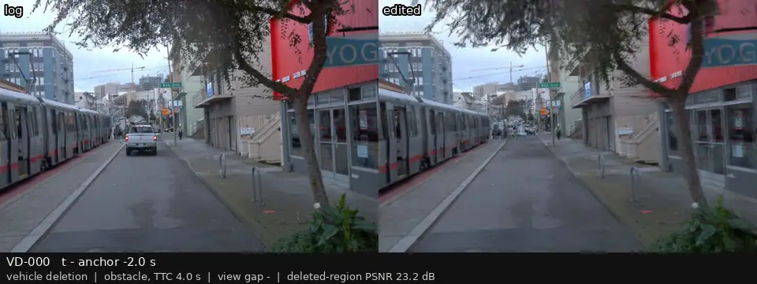
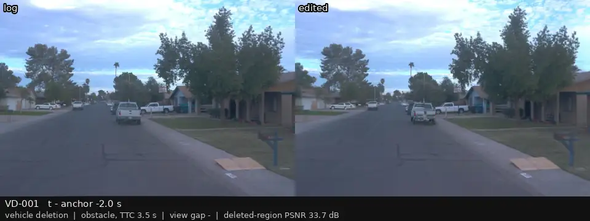
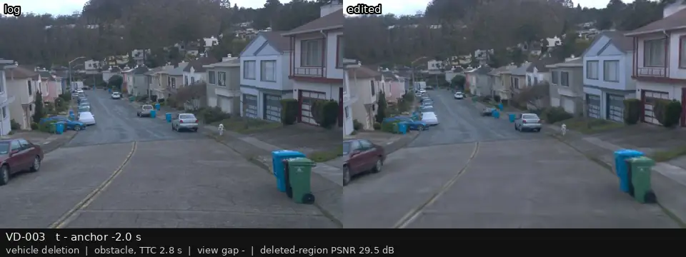
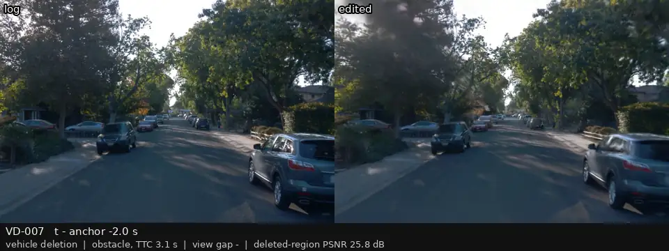
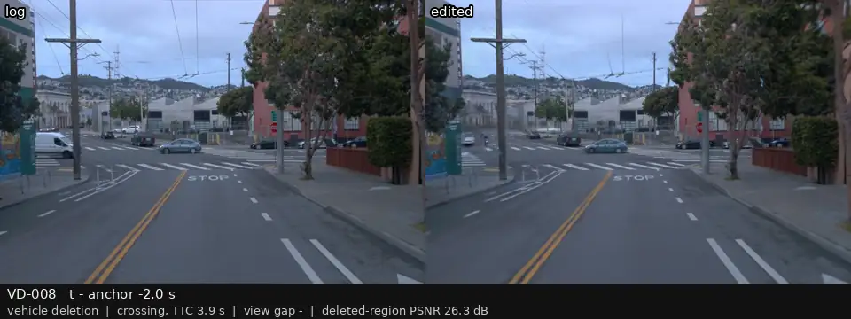
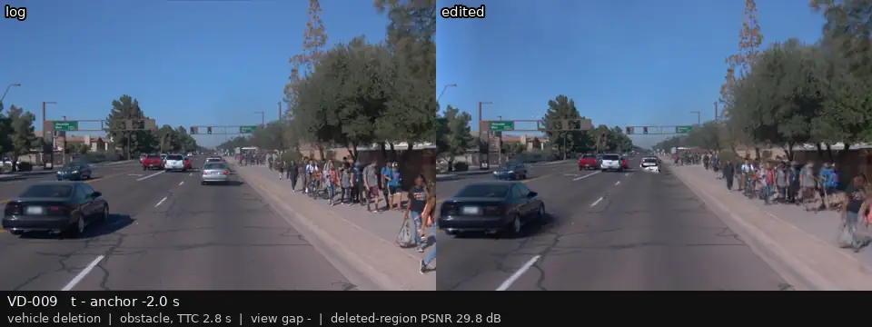

# P3 人工复核：车辆删除（事件车辆）

[返回总表](../p3-review-sheet.md)

每段视频：前相机，左边是录像，右边是编辑后的画面；锚点前 2 s 到后 1 s，5 帧每秒循环。最后一列留给你填：keep / drop / 备注。

| 视频 | 编号 | 类别 | 视角差 | 框内 PSNR (dB) | 结论（keep / drop / 备注） |
|:--|:--|:--|--:|--:|:--|
|  | VD-000 p3_v000 | obstacle | — | 23.2 |  |
|  | VD-001 p3_v001 | obstacle | — | 33.7 |  |
|  | VD-002 p3_v002 | obstacle | — | 28.9 |  |
|  | VD-003 p3_v003 | obstacle | — | 29.5 |  |
|  | VD-004 p3_v004 | obstacle | — | 33.4 |  |
|  | VD-005 p3_v005 | obstacle | — | 23.8 |  |
|  | VD-006 p3_v006 | obstacle | — | 28.3 |  |
|  | VD-007 p3_v007 | obstacle | — | 25.8 |  |
|  | VD-008 p3_v008 | crossing | — | 26.3 |  |
|  | VD-009 p3_v009 | obstacle | — | 29.8 |  |
