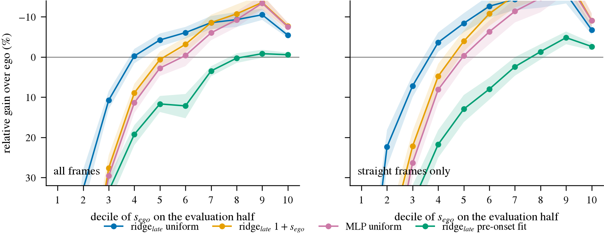
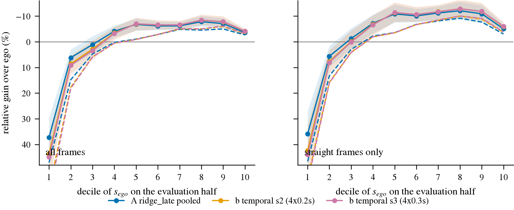
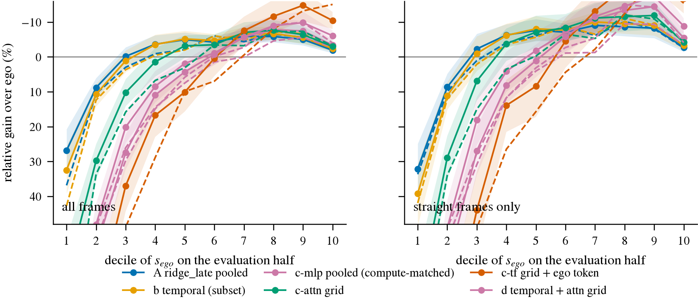
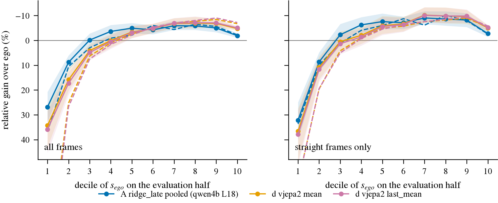
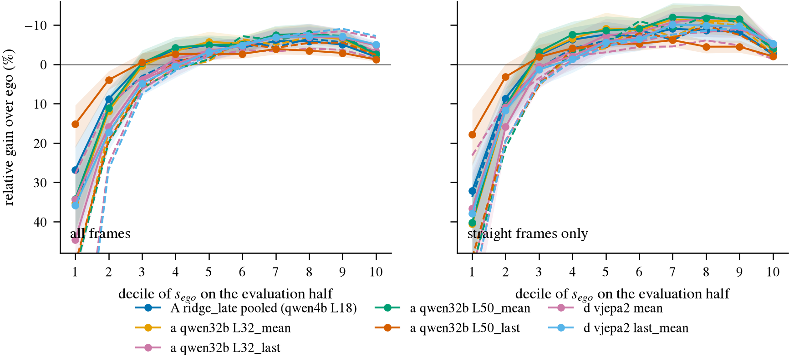
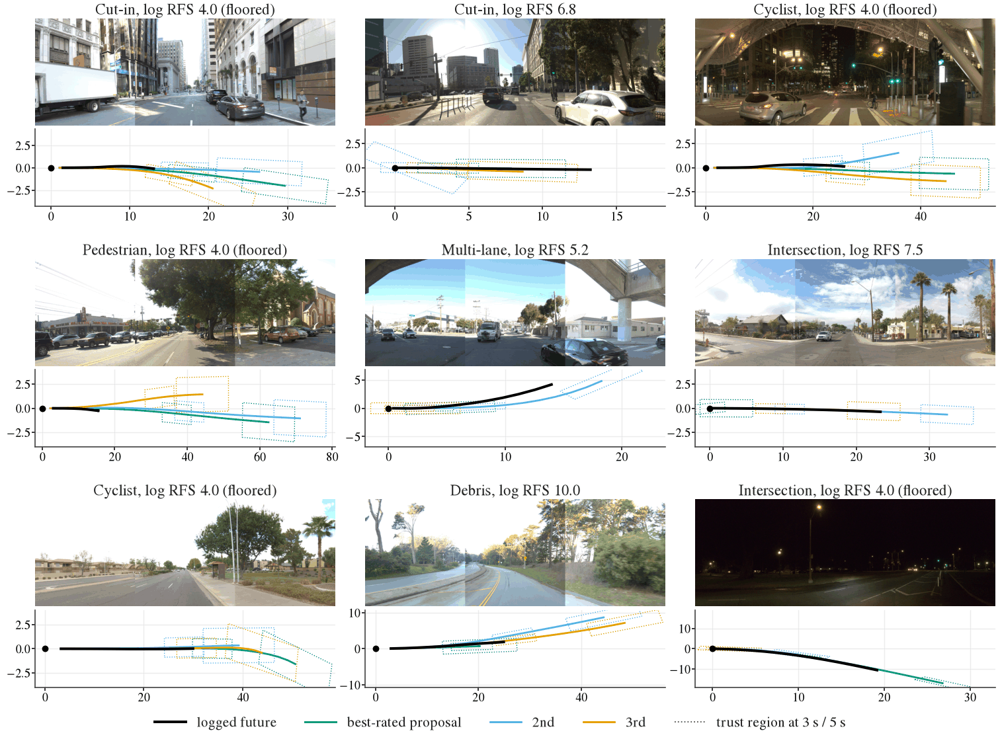
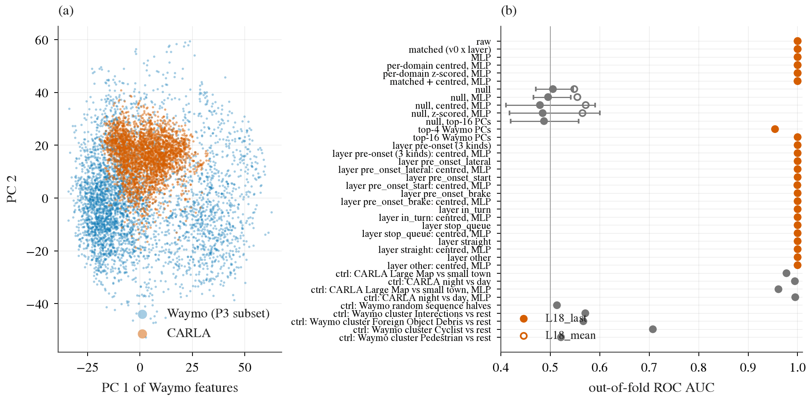
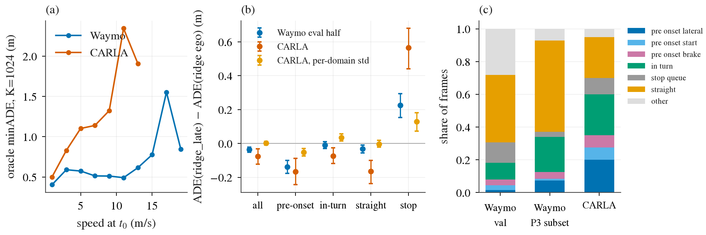
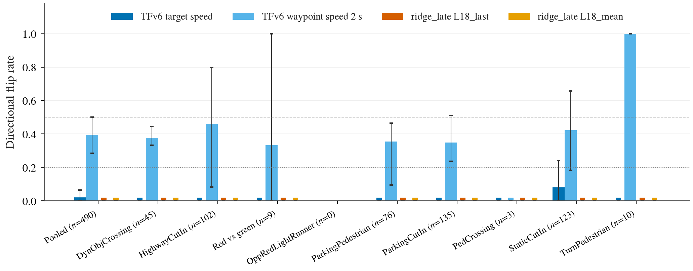
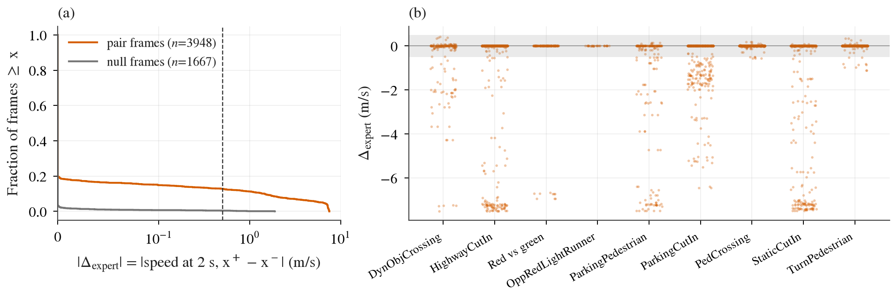

# 2026-09 预诊断轮：方法选型之前的开环测量

状态: 进行中，2026-09-22 起。结果随到随记，每一节末尾标「已测 / 在跑 / 待做」。
背景: [decisions.md](../decisions.md) 第 21 条（方向：AD 方法论文）、第 25 条（方法假设：reaction decoder）；
文献现状见 [survey-counterfactual-video-gen.md](../survey-counterfactual-video-gen.md)。
每个预诊断的计划和判据在 `todos/2026-09-22-p*-*.md`，数字的权威版本在 decisions 第 3d、20、22、23、24 条，
本文是把它们按「回答了哪个选型问题」重新排一遍，图也集中在这里。

## 这一轮回答什么

方法选型要定四件事：关键时刻用什么口径当 judge、失败在 readout 还是表征、表征换谁、
仿真配对对这个 head 有没有意义。六个预诊断各答一件，全部开环，GPU box 上跑，闭环组件在 Tokyo box 上另做：

| # | 预诊断 | 回答 | 状态 |
|---|---|---|---|
| P0 | train split 复核 3d / L0 | 半 val 的结论在 10 倍数据下站不站得住 | **已测**（分类头的 RFS 行在跑） |
| P1 | judge 口径 | 高 surprise 段用什么当 judge | **已测，口径已定（第 22 条）** |
| P2 | 读出阶梯 | 失败在 readout / 输入还是表征 | **已测** |
| P3 | backbone 阶梯 | 表征换谁 | **全部完成**：(a) 32B null；(d)(d′)(d‴) V-JEPA 家族 train 训后缩到 −0.03、测不动；(c) Wan 零；(d″) Qwen 原生视频唯一两方向 CI 不跨零，因素是时间；(b) H3 **关闭**（2026-09-23：重开条件是 Wan 有信号，Wan 为零，不再做） |
| P4 | CARLA 特征差距与词表覆盖 | Waymo 训的 head 在 CARLA 上能不能用 | **已测，按预登记判据「不可用」**：去均值后 domain AUC 仍 1.000（null 0.48），pre-onset 词表 uncoverable +35 pp，head 匹配 ADE 比值 > 2；只有「在不在动」的 probe 迁移（0.87–0.89） |
| P5 | 开环配对考试 v0（CARLA 内训、CARLA 内考） | 教材作用在 head、表征还是数据；VLM 那一列已在 Waymo 上关闭（第 25 条） | **已测（第 32 条，待定）**：考卷成立（96% 的对 ego 逐 tick 相同到因素可见之后，503 个 expert 反应帧）；TFv6 目标速度翻转 2.0%（天气噪声地板）、waypoint 39.4%；我们的 `ridge_late` 0%，hazard probe 0.635（representation，边界上；行人 / cut-in 是 readout） |

术语，本文各用一次：**pre-onset** 是车还没开始转、ego 运动看不出意图的帧；**s_ego** 是 ego-only 读出模型自己的
5 s 残差，衡量「先验失灵的程度」；**DiD** 是 pre-onset 上的 vision − ego 增量减去直行帧上的同一增量，
负号才表示增量集中在先验最弱处；**−0.05 m 门槛** 是第 20 条写死的实用效应门槛，要在半 val 的两个方向上同时过。

## P0：train 训、完整 val 评，半 val 的结论全部站住

train 415 663 帧 / 2037 个 sequence 训，val 106 360 帧 / 479 个 sequence 评，协议与 3d / L0 一字不改。

| 量 | 半 val（方向 0 / 1） | train 训、完整 val 评 |
|:--|:--|:--|
| DiD | +0.098 / +0.029 | **+0.111 [+0.059, +0.162]** |
| pre-onset Δ | −0.027 / −0.043 | −0.016 [−0.062, +0.030] |
| straight Δ | −0.125 / −0.072 | −0.127 [−0.158, −0.099] |
| 全集 Δ | −0.078 / −0.034 | −0.068 [−0.085, −0.052] |
| C（只在 pre-onset 上 fit）的 pre-onset Δ | −0.036 / −0.080（n_fit 约 750） | −0.016 [−0.089, +0.050]（n_fit 6786） |
| D MLP 的 pre-onset Δ | +0.248 / +0.030 | −0.000 [−0.063, +0.057] |
| RFS ego → A | 7.258 → 7.265 / 7.112 → 7.096 | 7.056 → 6.968（paired Δ −0.087 [−0.183, +0.004]，n=479） |

看什么：train 训出来的 arm A 相对 ego 的相对增益按 s_ego 十分位仍是倒 U，第 4–9 档变好、第 8 档附近见顶、
第 10 档回落，和第 20 条半 val 上的形状一致；数据多十倍没有把它变成单调上升。

结论：第 3d 条保持已确认，限定条件从「半 val 预演」升级为「train 训」；第 20 条的分支 2（线性读出在 pre-onset 上榨干）
在 C 的 n_fit 涨九倍后仍成立；「MLP 过拟合」那句被就地改成「归因于样本量是错的」，10 倍数据下它仍不比 A 好，
且 early stopping 停在第 1 个 epoch。RFS 上视觉仍无增益，n 从 237/242 涨到 479，CI 半宽约 ±0.09。

## P1：judge 口径，已定

同一批 train 训出来的逐帧预测，换四种 judge 各评一遍（Δ = arm − ridge ego，ADE 负为好，RFS 正为好）：

| judge | n | A 的 Δ [CI] | 排序 |
|:--|--:|:--|:--|
| ADE vs log，全部帧（现行） | 106 360 | −0.068 [−0.085, −0.052] | A > D > ego > C |
| ADE vs log，s_ego 第 1–9 档 | 95 724 | −0.041 [−0.059, −0.025] | A > ego > D > C |
| ADE vs log，只看第 10 档 | 10 636 | −0.309 [−0.345, −0.271] | D > A > C > ego |
| ADE vs log，rater 认可的帧 | 434 | −0.045 [−0.089, −0.001] | A > ego > D > C |
| RFS，rater 帧 | 479 | −0.087 [−0.183, +0.004] | **ego > A** > D > C |
| ADE vs rater_best，rater 帧 | 479 | −0.052 [−0.093, −0.010] | A > ego > D > C |

三条事实：现行口径上视觉增量的 45% 来自第 10 档，而那一档是多模态的（log 有 68.8% 落在全部三条被打分 proposal 之外，见下面的复核节）；MLP「和 ego 打平」完全是第 10 档的
−0.427 撑起来的，第 1–9 档它比 ego 差；第 10 档里 ADE 降 0.309 m 换不来 RFS 的认可（−0.048，方向还是负的）。
只有 RFS 把 ego 排第一，分歧只在 ego 与 A 这一对上。

定下来的口径（第 22 条，用户 2026-09-22 采纳）：主判用 ADE vs log 限制在 s_ego 第 1–9 档，第 10 档单独一行用 RFS 和 ADE vs rater_best 报，
RFS 并排必报。理由是只有它在 pre-onset 上有 power（n=1510，半宽 0.05–0.09；rater 口径在 pre-onset 上只有 6 帧）。
已知弱点：s_ego 分档是循环的（它是 base 自己的残差），缓解是 rater 认可帧那一行给出同一排序。
现行的全集 ADE 只作为对照并排；已落地的 arm 按新口径重报，见 P2 / P3 末尾。

## P2：读出阶梯，没有任何一档买回 pre-onset

共用一个冻结的分层子集：20 237 帧 / 479 sequence，pre-onset 1510 和 rater 479 全取，直行 11 975，转弯 4 461，
半/半切分与 3d 逐字相同。arm A 在全 val 上逐位复现第 20 条后才往下读。

| arm | pre-onset Δ（方向 0 / 1） | DiD | RFS | 过门槛 |
|:--|:--|:--|:--|:--|
| A pooled ridge | −0.015 / −0.044 | +0.065 / +0.029 | 7.147 / 7.024 | 否 |
| b 时序 pooled，4 × 0.2 s（全半 val） | −0.032 / −0.068 | +0.104 / +0.013 | 7.248 / 7.036 | 否 |
| c-attn 144 token 网格 | +0.034 / −0.026 | +0.098 / −0.005 | 7.008 / 6.944 | 否 |
| c-tf 网格 + ego token | +0.039 / +0.285 | +0.053 / +0.213 | 6.755 / 6.713 | 否 |
| c-mlp pooled（算力匹配对照） | +0.092 / +0.030 | +0.106 / −0.030 | 6.715 / 6.755 | 否 |
| d 时序 + attn 网格 | +0.037 / +0.025 | +0.042 / −0.007 | 6.769 / 6.626 | 否 |
| e gated attn grid | +0.011 / −0.027 | +0.068 / −0.029 | 7.110 / 6.932 | 否 |
| e gated pooled-mlp | +0.098 / +0.037 | +0.103 / −0.078 | 6.912 / 6.539 | 否 |

看什么：把 0.2–0.9 s 的 pooled 历史拼进 ridge，三条曲线几乎重合，第 8 档见顶、第 10 档回落一点没动；
时序只多买 0.010–0.017 m，两种 stride 只差 0.001 m，所以不是窗长问题。

看什么：token head 在第 7–9 档比 pooled 好 1–2 个百分点，在第 1–3 档差 2–4 倍（那里 ego ADE 只有 0.3–0.9 m，
车基本不动，有容量的 head 纯加噪声），净效果是 pre-onset、整体 ADE、RFS 全差。算力匹配的 MLP 和 attention head
坏在同一处、同样多，所以坏的不是 attention，是在约 1 万帧上训非线性 head。限定：子集把 fit 半砍到约 1 万帧，
四个神经 head 的 early stopping 多停在第 1–3 个 epoch；要把「spatial token 里没有这个信息」说死得在全 val 上抽 78 GB 网格，
按现在的方向和量级不建议付。

P2(e) 对第 25 条的意义：gated residual head 的 gate 在真实数据上**学会了往哪开**（mean g 随 s_ego 档单调上升
0.514 → 0.687，pre-onset 0.647 高于直行 0.601，已在转的帧最低），但开了之后 Δ 什么都买不到（+0.098 / +0.037）。
所以配对监督要补的是 Δ「怎么反应」，不是 g「什么时候反应」。

结论：第 20 条分支 2 被加固，归因维持在表征层面。

## P3：backbone 阶梯，V-JEPA 2 是第一个改变形状的表征

同一子集、同一 head、同一 judge。(d) V-JEPA 2 的配置：`vjepa2-vitl-fpc64-256`，4 帧 clip、stride 2 帧（跨 0.6 s）、
只吃前视一路；64 帧 checkpoint 喂 4 帧是已知的分布偏移，主线是三相机，两条限定都跟着数字走。

| 方向 | arm | pre-onset Δ [CI] | straight Δ | DiD | RFS | 过门槛 |
|--:|:--|:--|--:|:--|--:|:--|
| 0 | A pooled（Qwen-4B L18） | −0.015 [−0.053, +0.024] | −0.081 | +0.065 | 7.147 | 否 |
| 0 | d V-JEPA 2 | −0.018 [−0.059, +0.023] | −0.085 | +0.067 | **7.242** | 否 |
| 1 | A pooled | −0.044 [−0.098, +0.013] | −0.074 | +0.029 | 7.024 | 否 |
| 1 | d V-JEPA 2 | **−0.115 [−0.190, −0.027]** | −0.058 | **−0.057** [−0.142, +0.035] | 6.992 | 是 |

看什么：第 10 档的回落被压平（arm A 从第 8 档的 −6.5% 掉回 −2.2%，V-JEPA 从第 9 档的 −8.4% 只掉到 −6.7%），
见顶从第 8 档右移到第 9 档；第 7–9 档这一段 logged future 可信，V-JEPA 每档比 A 好 1–3 个百分点。
代价照旧在最低两档（+91% 对 +37%）。

读法：门槛没触发，方向 0 的 CI 排除了方向 1 的 −0.115，两个方向真的不一致；但它是量到过的最大 pre-onset 效应、
第一个负号 DiD、第一个在 RFS 上赢 ego 的 arm（方向 0：7.145 → 7.242，floored 0.253 → 0.232）。
与 P2(b) 并排，第 12 条的问题有了数：

| 同样 0.6 s 的历史喂在哪 | pre-onset Δ（方向 0 / 1） | decile 形状 |
|:--|:--|:--|
| 读出端（拼 4 个时刻的 pooled 向量） | −0.032 / −0.068，比 A 多 0.01–0.017 | 不变 |
| 表征里（V-JEPA 2 的 4 帧 clip） | −0.018 / −0.115 | 第 10 档压平，见顶右移 |

按第 22 条口径重报（ADE vs log 限 s_ego 第 1–9 档；第 10 档单独用 ADE vs rater_best；逐帧预测直接换 judge，不重训）：

| arm | pre-onset Δ 第 1–9 档（方向 0 / 1） | 第 10 档 ADE vs rater_best（方向 0 / 1） | 子集 RFS Δ |
|:--|:--|:--|:--|
| A pooled | −0.022 / −0.048 | — | — |
| b 时序 s2 | −0.025 / −0.063 [−0.119, −0.004] | — | — |
| c-tf 网格 + ego | — / **+0.303** | — / −0.882 | 负 |
| d V-JEPA 2 | **+0.005** / **−0.101 [−0.178, −0.014]** | **−0.347 / −0.423** | +0.097 / −0.072 |

看什么：去掉多模态的第 10 档之后，神经 head 更差（c-mlp、c-tf、e 的 RFS 全负，c-tf 一边第 10 档对 rater_best 赚 0.88、
一边第 1–9 档亏 0.30，正是第 10 档要单独报的理由）；V-JEPA 2 方向 0 在可信的九档上翻成 +0.005，不再比 A 好，方向 1 仍 −0.101，
两个方向的分歧从 0.097 拉大到 0.106。两个方向都同号、同量级的只剩第 10 档对 rater_best 的 −0.347 / −0.423，
是所有 arm 里最大的：它的增益落在多模态的那一档，而且是朝 rater 偏好的方向。第 10 档 RFS 按方向分歧（+0.301 / −0.213，n 约 90），
所以这是信号不是结论。方向分歧的来源要等 d′ ladder（三相机、更长 clip、ViT-g）来分。

### (d′) V-JEPA 2 家族：三相机、长 clip、ViT-g 都没有让两个方向一致

同一子集，严格完整窗口取各变体的交集，pre-onset 的实际 n 降到 555 / 541（(d) 单独时是 752 / 706）。
第 22 条口径，pre-onset Δ（方向 0 / 1）、DiD、子集 RFS Δ、第 10 档对 rater_best：

| arm | pre-onset Δ | DiD | RFS Δ | 第 10 档 vs rater_best |
|:--|:--|:--|:--|:--|
| A pooled（Qwen-4B） | −0.016 / −0.012 | +0.091 / +0.060 | −0.042 / −0.027 | −0.050 / −0.101 |
| d 前视 4 帧 ViT-L | −0.017 / −0.102 [−0.204, +0.003] | +0.061 / −0.064 | +0.077 / −0.043 | −0.337 / −0.435 |
| d1 三相机拼接 | −0.029 / −0.088 | +0.054 / −0.044 | +0.046 / −0.096 | −0.231 / −0.428 |
| d2 clip 8 | −0.021 / −0.076 | +0.056 / −0.035 | +0.093 / −0.035 | −0.308 / −0.469 |
| d3 clip 16 | −0.001 / −0.061 | +0.074 / −0.005 | +0.065 / −0.053 | −0.263 / −0.379 |
| d4 ViT-g | −0.031 / −0.114 [−0.229, +0.006] | +0.042 / −0.078 | +0.080 / −0.092 | −0.324 / −0.482 |
| d5 late fusion + Qwen L18 | −0.028 / −0.094 | +0.067 / −0.036 | +0.003 / −0.037 | −0.233 / −0.375 |

看什么：方向 0 上所有变体都在 [−0.031, −0.001]，CI 全跨零；方向 1 上所有变体都在 −0.06 到 −0.11，n 掉了两成之后 CI 也跨零。
换相机、换 clip 长度、换模型大小都没有让两个方向靠拢，DiD 的符号也随方向翻（方向 0 全正、方向 1 全负）。
形状判据（第 10 档离最好档 2 个点以内）只在方向 1 成立（d、d2、d3、d4），方向 0 全不成立。
按预写的收敛规则，这个分歧是 239 个 sequence 的半分本身的性质，不是变体能解决的，**要用 train 训、完整 val 评来裁决**：
V-JEPA 8 ms / 帧，41.5 万帧约 1 h，已排在 Wan 和 Qwen-video 之后。
两个方向都稳的仍只有第 10 档对 rater_best 的移动（−0.23 到 −0.48），而第 10 档现在的解释是「log 是比被打分候选更早更重的减速」，
V-JEPA 在那里朝候选偏好的方向动。没有 arm 过 −0.05 m 两方向规则。

### (d″) Qwen3-VL-4B 原生视频输入：两个方向 CI 都不跨零，因素是「时间」

同一段 4 帧 clip（stride 2，三相机）以视频形式进 Qwen 的时间 patch 路径，每次 forward 6120 token，逐项核验等于 3 相机 × 2 个时间位 × 30×34，
和 arm A 唯一的差别是帧的进入方式。552.6 ms / 帧，2 h 11 min。第 22 条口径：

| 方向 | tap | pre-onset Δ [CI] | straight Δ | DiD | RFS Δ | 第 10 档 vs rater_best |
|--:|:--|:--|--:|--:|--:|--:|
| 0 | L18_last | **−0.053 [−0.092, −0.018]** | −0.033 | −0.020 | +0.016 | −0.186 |
| 0 | L18_mean | −0.041 [−0.083, −0.000] | −0.068 | +0.027 | −0.015 | −0.181 |
| 1 | L18_last | −0.045 [−0.075, −0.016] | −0.022 | −0.023 | −0.005 | −0.220 |
| 1 | L18_mean | **−0.082 [−0.144, −0.016]** | −0.045 | −0.037 | −0.054 | −0.256 |

看什么：−0.05 m 两方向规则严格说没过，每个 tap 都是一边过、另一边差 5–9 mm；但它是整个 ladder 里**唯一两个方向 CI 都不跨零**的 arm
（A、32B 的四个 tap、V-JEPA 的六个变体都做不到；*2026-09-23 修正*：原来写「唯一」，后来 P3e 插入的 2B 同一视频通路 `L14_last` 两个方向 CI 也不跨零，点估计更小，所以唯一的是这条视频通路而不是 d″ 这一个 arm），DiD 在四格里三格接近零或为负，而其它 arm 全是明显的正。
和第 23 条的 (b) 并排是最干净的隔离：同模型、同像素、同层、同 head，帧拼在读出端是 −0.025 / −0.059（同子集、同口径，两个方向都跨零；*2026-09-23 修正*：原来写的 −0.032 / −0.068 是完整半 val、旧口径的数，不能和 d″ 对读），
走 backbone 的时间 patch 是 −0.053 / −0.045（都不跨零）。**按预写的归因表，因素是时间，不是 JEPA 目标。**

### (d‴) V-JEPA 2 的 train 训裁决：不确认，但是「测不动」不是「零」

41.5 万 train 帧训、完整 val 评，单方向，pre-onset n = 1249：A −0.000 [−0.051, +0.057]；ViT-L **−0.030 [−0.104, +0.041]**；
ViT-g −0.027 [−0.096, +0.045]；late fusion −0.036 [−0.101, +0.032]。半 val 上方向 1 的 −0.101 缩到 −0.030，那个效应主要是半分的 artefact。
但半宽 0.054–0.072 比门槛还宽，按预登记表落在第四行「测不动」，不是第三行「真 null」：训练数据多十倍没有买到 power，
因为 bootstrap 按 sequence 重采样，val 无论怎么切只有 479 个 sequence。**约束是 sequence 数不是帧数**（第 3b 条第二次说这件事），
下一步该动的是评测设计，不是再换 backbone。

### (c) Wan2.2-TI2V-5B 前视 DiT 特征：处处为零

111.6 ms / 帧，37 min。四个 tap（第 15、20 块 × σ 0.2、0.8）的 pre-onset |Δ| ≤ 0.005，CI ±0.005；直行上 A 有 −0.074 / −0.066，Wan 只有 −0.005 到 −0.016，
差一个量级。抽取不是坏的（有限、无死维、每维 std 0.06–0.09），但行与行的相关 0.989，mean-pool 一个 DiT block 留下的主要是帧不变的成分。
限定：这分不开「表征里没有」和「global mean-pool 读出太弱」，Wan 没跑非 mean-pool 的对照，所以能说的是 DriveLaW 那份配方在这里为零，
不是生成式表征整体为零。加上 (a) 已把 H3 的理解侧量成零，H3 两个可能的来源都指向无，(b) deferred 的赌注兑现。

### (a) Qwen3-VL-32B：放大同族 VLM 是一个干净的 null

20 237 帧、633 ms / 帧、3 h 33 min、峰值 63.8 GB，只跑到第 50 层（H3 当 conditioner 用的那一层），实测 268 TFLOPS bf16，贴着屋顶。
第 22 条口径下 pre-onset Δ（方向 0 / 1）：

| tap | pre-onset Δ |
|:--|:--|
| A（4B，L18_mean） | −0.021 / −0.039 |
| 32B L32_mean | +0.006 / −0.029 |
| 32B L32_last | −0.036 / −0.033 |
| 32B L50_mean | −0.010 / −0.032 |
| 32B L50_last | −0.029 / −0.028 |

看什么：四条 32B 曲线压在 arm A 上，只有 V-JEPA 在第 7–10 档分开。八个格子全在 −0.036 到 +0.006 之间，和 4B 同一个噪声带，
RFS 八个里七个更差（最低 −0.151）。实际执行的非 embedding 参数 8 倍（2.8B → 22.6B）、每帧算力 7 倍，pre-onset 一动不动，
而一个 0.3B 的 ViT-L 看 4 帧在一个方向上拿到 −0.101。**缺的不是容量。** 顺带把第 21 条收紧：H3 的理解侧就是这一层，
现在它在 pre-onset 上被量成零，H3 落地后若有增量只能来自生成式 DiT。

抽取成本：V-JEPA 2 8.1 ms / 帧（0.75 GB 显存），Qwen-4B 网格 90.9 ms / 帧，Qwen-32B 621 ms / 帧（63.8 GB 显存）。

在跑和已排：(a) Qwen3-VL-32B 第 32、50 层，约 3.5 h；(d') V-JEPA 2 ladder：三相机（拼接）、8 / 16 帧、ViT-g、
与 Qwen L18 的 late fusion（2.1 版跳过：hub 上只有第三方转传，按第 12 条的出处规矩不用），回答方向不一致是不是单相机和样本量造成的；(b) H3 DiT 和 (c) Wan2.2-5B 卡在下载
（3–5 MB/s，71 GB 和 23 GB），抽取代码已写好，噪声水平扫 σ ∈ {0.2, 0.8} 两端。

## 第 10 档到底是什么（2026-09-22 独立复核）

第 20 / 22 条的那句「顶档的 logged future 自己就不被 rater 认可」被用户质疑，做了一次不复用原函数的独立复核：
RFS 从官方规范重写一遍，s_ego 用自己的 ridge 重新拟合，再和仓库里的移植、以及 Waymo 上游的
`rater_feedback_utils.py` 三方对齐。代码 `scripts/verify_top_decile.py`，小表在
`research/results/top-decile-audit/`，run 在 box 上 `$DATA_DIR/runs/waymo_l0/top_decile_audit/`。

**scorer 本身先过关。** 本项目的 RFS 移植和 Waymo 官方文件在全部 479 帧 × 4 类候选（logged future、
rater 轨迹本身、加 σ=3 m 噪声的扰动、挪开 1 km 的远点）上**逐位相同**（max |Δ| = 0），
第三份从规范重写的实现也逐位相同。这是这个仓库第一次真的把官方代码跑起来对过，之前只是读代码断言。
外部对照：DIAL（2605.12625）报 logged trajectory 的 RFS 8.13，我们是 8.131（cluster mean），吻合。

### 表重算出来了，数字站得住

479 个 rater 帧，按样本外 s_ego 十分位（每帧取它落在 eval 半的那个方向的值）：

| decile | n | s_ego 区间 | log 的 RFS | floored | log 对 rater_best 的 ADE | log 落在所有 trust region 之外 | rater_best 的分 | v₀ (m/s) | log 5 s 行程 (m) |
|--:|--:|:--|--:|--:|--:|--:|--:|--:|--:|
| 1 | 48 | 0.08–0.45 | 8.72 | 0.042 | 1.82 | 0.083 | 9.58 | 3.24 | 17.0 |
| 2 | 48 | 0.45–0.69 | 8.98 | 0.021 | 1.66 | 0.146 | 9.65 | 4.38 | 21.3 |
| 3 | 48 | 0.70–0.98 | 8.60 | 0.042 | 1.36 | 0.104 | 9.40 | 5.28 | 25.6 |
| 4 | 48 | 0.99–1.25 | 8.77 | 0.021 | 1.54 | 0.125 | 9.52 | 4.45 | 21.8 |
| 5 | 47 | 1.25–1.53 | 9.01 | 0.000 | 2.13 | 0.043 | 9.49 | 4.99 | 25.2 |
| 6 | 48 | 1.54–1.98 | 7.98 | 0.062 | 2.51 | 0.250 | 9.42 | 4.08 | 20.2 |
| 7 | 48 | 1.99–2.69 | 8.58 | 0.062 | 1.91 | 0.208 | 9.63 | 3.52 | 19.8 |
| 8 | 48 | 2.70–3.72 | 7.56 | 0.167 | 3.02 | 0.333 | 9.73 | 4.95 | 27.0 |
| 9 | 48 | 3.73–5.45 | 7.78 | 0.104 | 3.05 | 0.292 | 9.73 | 4.90 | 24.4 |
| **10** | 48 | **5.50–14.22** | **5.79** | **0.417** | **7.98** | **0.688** | **9.88** | **6.99** | **20.8** |

读法：原来记的 5.92 / 41.7% / 7.82 复现为 **5.79 / 41.7% / 7.98**（floored 完全一致，另两个差 0.13 和
0.16 m，来自 s_ego 那一头 ridge 的 float32/float64 与网格差异）。**顶档的数字是真的，倒 U 的下降段
不是记错。** 但它的**含义**和原来写的不一样，见下面两节。

### (a) / (b)：顶档的低分 100% 是「log 落在所有 proposal 之外」，不是「场景里没有好选项」

WOD-E2E 的三条被打分轨迹**不是 rater 自己画的，也不包含 logged future**：论文 §3.4.2 说它们是
Wayformer 采样出来的至多 64 条候选里分桶挑出的（"selecting the leftmost, middle, and rightmost
trajectories"），rater 的任务是从中**选三条**并打分，且必须"include at least one trajectory that is
considered optimal"。所以 log 的 RFS 是一个**集合外（out-of-set）评分**：它继承的是离它最近那条
proposal 的分，或者下限 4.0。实测坐实了这一点：**全部 479 帧里只有 6.1% 的 log 和某条被打分轨迹
逐点一致到 0.1 m 以内，顶档是 0.0%**；顶档里 log 到最近 proposal 的 max-waypoint 偏差中位数是 6.29 m
（其余九档 1.08 m）。

| | n | log 在所有 trust region 之外 | 在某条之内 | **floored 且在外（a）** | **floored 且在内（b）** | 在外时的 RFS | 在内时的 RFS | rater 最高分 |
|:--|--:|--:|--:|--:|--:|--:|--:|--:|
| **第 10 档** | 48 | **0.688** | 0.312 | **0.417** | **0.000** | 4.58 | **8.46** | **9.88** |
| 第 1–9 档 | 431 | 0.176 | 0.824 | 0.051 | 0.007 | 5.82 | 9.00 | 9.57 |
| 全部 | 479 | 0.228 | 0.772 | 0.088 | 0.006 | 5.44 | 8.98 | 9.60 |

**顶档里被压到下限的 41.7% 帧，一帧不差全部属于 (a)**：log 落在三条 proposal 的 trust region 之外。
(b)（log 落在某条里面、但那条本身被打了低分）是 **0.000**。反过来，顶档里 log 确实命中某条 proposal 的
那 31.2%，RFS 是 **8.46**；而顶档的 rater 最高分是 **9.88，十档里最高**——那里**有**一个 rater 认为很好的
选项，只是司机开的那条不在这三条里。所以「场景里没有好选项」这个解释被数据否掉了。

顶档在做什么，用行程长度一句话说清：**log 的 5 s 行程 20.8 m，rater_best 是 35.9 m，log 比它短 15.2 m，
73% 的帧短出 5 m 以上**（其余九档：22.5 对 23.4 m，差 1.0 m，20.6%）。5 s 处的纵向 trust region 半宽
只有 5.55 m（顶档实际值，已按 v₀ 放大），**短 15 m 必然出界**。顶档就是「司机大幅减速/停住，而三条
proposal 继续走」。

### 混杂检验：换成不循环的 prior 还在，换成速度就没了

s_ego 是 `ridge ego` 自己的残差，分档是循环的；换两个不依赖任何拟合的量重做：

| 分档变量 | 顶档 log RFS | floored | ADE | 在所有 trust region 之外 | 顶档 v₀ |
|:--|--:|--:|--:|--:|--:|
| s_ego（样本外，主表） | 5.79 | 0.417 | 7.98 | 0.688 | 6.99 |
| s_ctrv（恒速恒 yaw rate 圆弧的残差） | 6.19 | 0.417 | 8.21 | 0.604 | 8.08 |
| s_cv（直线外推的残差） | 6.05 | 0.417 | 8.19 | 0.667 | 8.26 |
| **v₀（速度十分位）** | **8.63** | **0.104** | 4.07 | **0.188** | 15.76 |

**效应不是循环性造出来的**：两个零参数 prior 的顶档给出同一幅图（RFS 6.0–6.2、floored 41.7%、ADE 8.2 m）。
**也不是「顶档只是开得快」**：按速度分档，最快那一档（平均 15.8 m/s、5 s 走 69.6 m）的 log RFS 是
**8.63，十档里最高**，floored 只有 10.4%——高速公路上 trust region 被放到满值而驾驶本身可预测，
log 反而最被认可。s_ego 顶档的 v₀ 是 6.99 m/s、|a₀| 1.12 m/s²、行程却只有 20.8 m，
是**中速下的强减速**，不是高速巡航。

顺带把 trust region 的几何记下来：半宽随 v₀ 线性放大（v₀ ≤ 1.4 m/s 取一半，≥ 11 m/s 取满值），
5 s 处横向 1.0–1.8 m、纵向是横向的 4 倍。顶档的实测均值是横向 1.39 m、纵向 5.55 m，**比其余九档更宽**
（1.11–1.23 / 4.45–4.92），log 依然 68.8% 出界。

### 反驳检查：WOD issue #985 的 padding 伪影解释不了这一档

issue #985 指出部分被打分轨迹不足 20 个 waypoint，官方实现用最后一点补齐，等于把它们钉在原地，
会系统性地偏袒低速预测。实测：不足 20 点的轨迹占全部的 4.3%，**顶档 1.4%、其余九档 4.6%——顶档是
被稀释的，不是被富集的**。把含任何补齐轨迹的帧整帧剔掉（顶档剩 46 帧），顶档 RFS **5.67**、floored
**0.435**、ADE **8.19**，比原值**更极端**；把补齐区间从 trust region 判定里挖掉，顶档**一位不变**
（5.79 / 0.417，因为顶档没有任何补齐点落到 3 s / 5 s 这两个检查时刻上）。**这条伪影在这里不成立。**

### 二十帧看过去：没有一帧是「明显开错」

顶档里跨 sequence 均匀取的 20 帧都人工看过，图中是其中 9 帧（每种场景类别一帧，外加一帧 log 在 trust region 内的对照）。每格上方是三路前向相机的全景，
下方是 BEV（向前为 x、向左为 y，两轴比例不同；黑=logged future，绿/蓝/橙=按分数排序的三条被打分 proposal，点线框是 3 s / 5 s 的 trust region）。
图由 `scripts/make_top_decile_sheet.py` 生成。对照组是第 1–9 档随机 10 帧，
见 [mid-decile-rater-frames.png](../figs/mid-decile-rater-frames.png)。

看什么：几乎每个 floored 的格子里，黑线都在彩色线**中途就停了**，横向方向一致。场景清一色是
Waymo 自己标的长尾类别——Cyclist 6、Cut_ins 4、Interections 3、Foreign Object Debris 2、Multi-Lane Maneuvers 2、其余 3——
司机在给骑车人、行人、并入的车、黄灯、前方排队让速，而三条 proposal 继续走。
逐帧判断（人工，判据写在 `research/results/top-decile-audit/sheet_top.csv` 的数值旁）：
**0 帧是「明显开错」**；**14 帧是「合理但不唯一」**（为可见的弱势道路使用者或前车减速/停住，
proposal 不含这一模态）；**4 帧是「log 本来就被认可」**（[2] 路面障碍物、[4] 坡道排队、[5] 停止线起步、
[16] 金门公园里一只小动物窜上路面——这一帧 log 直接命中 10 分的那条）；**2 帧是标注/尺度伪影**
（[12] 104 km/h 的高速公路，5 s 走 122 m，10.3 m 的 ADE 只是路程的 8%，纵向阈值 7.2 m 在这种尺度下
必然被穿过；[20] 夜间从静止起步左转，ADE 只有 3.6 m 却因为横向出界被压到下限）。
对照组 10 帧**全部**落在某条 trust region 之内、**零帧 floored**、RFS 8–10、ADE 0.12–1.71 m，
场景是安静的居民区和空街——对比非常干净。

### 结论：这句话该怎么说

顶档的三个数字（RFS 5.79、floored 41.7%、ADE 8.0 m）**成立**，混杂检验也过了，
但**从它们推不出「人类评分者不认同司机的选择」**：rater 从来没有看过、也没有给 logged future 打过分。
站得住的说法是：

> 在 s_ego 最高的那一档，**logged future 有 68.8% 落在全部三条被打分 proposal 的 trust region 之外**，
> 因而按 RFS 的定义只能继承一个衰减分或者下限 4.0；那里的 log 5 s 只走 20.8 m 而 rater_best 走 35.9 m。
> **这是「log 是几条被分别打分的选择之外的又一条」，不是「rater 否决了 log」。**

对评测口径的影响和第 22 条原来写的**一致，理由换了**：那一档 ADE-against-log 仍然是错的目标——
不是因为 log 差，而是因为**那一档是多模态的，而单模态位移误差不测多模态**。
顶档继续单独报 RFS + ADE vs rater_best，主判仍限第 1–9 档。第 22 条的第 2 条「顶档 ADE 增益换不来 RFS」
也要跟着改读法：arm A 在顶档把 ADE 压小是**朝着 proposal 走**，而 RFS 不动是因为 **proposal 之间本来就散开
（顶档三条 proposal 到 rater_best 的平均 ADE 3.21 m，其余九档 1.5–2.7 m）**，命中哪一条的收益差别不大。

## 到目前为止对选型的含义

- judge：第 22 条已定，主判限 s_ego 第 1–9 档，第 10 档单独报，RFS 并排。
- readout：不换。pooled ridge 是这批特征上最好的读出，非线性 head 在这个数据量上只有损失。按第 22 条口径重报后差距更大。
- 表征：时间要长进 backbone 里，不能拼在读出端；做到这一点的是 **Qwen 自己的视频路径**（d″，两方向 CI 不跨零，DiD 归零），不是 JEPA（train 训后缩到 −0.03）也不是生成式 DiT（Wan 为零）。
  放大同族 backbone 没有用（32B 八个 tap 全在噪声带）。Stage B 的表征选择：Qwen3-VL-4B + 原生视频输入，再往上是给它更长的 clip。
- 评测：pre-onset 的 power 被 479 个 val sequence 锁死，train 训多十倍数据不改半宽（d‴）。要判 0.05 m 以下的效应得改评测设计，不是加数据。
- 反应通道（第 25 条）：「什么时候反应」真实数据学得会，「怎么反应」学不会，配对监督的靶子是后者。
- 仿真配对（P4）：Waymo 训的 head 不能拿 CARLA 帧来考，P5 已改成 CARLA 内训考（下面的 P5 节）：考卷成立，公开 planner 在 waypoint 上过四成，我们的 CARLA 内薄 head 翻转率为 0。

## P4：CARLA 帧上 Waymo 的 head 读不出东西（按预登记判据「不可用」）

计划、判据和全部表在 [todos/2026-09-23-p4-carla-feature-gap.md](../../todos/2026-09-23-p4-carla-feature-gap.md)。
CARLA 0.9.15 里用特权的 `BehaviorAgent` 开 151 条 Bench2Drive 路线（按 scenario family 取，12 个 town，带背景车流），
三台相机按 WOD-E2E 的标定复刻（972 × 1079、f = 1113.5 px、Waymo 的主点和径向畸变、同样的安装位置和 JPEG q95），
按动作分层抽 3000 帧（pre-onset 35%、转弯中 25%、直行 25%、停车 10%），用 P3(d″) 完全相同的抽取器（16 行 Waymo 逐位一致）抽 `L18_last / L18_mean`。

| 问题 | 结果 | 判据档 |
|:--|:--|:--|
| 特征差距 | Waymo 对 CARLA 的 AUC 在 raw、匹配、按域去均值 / z-score 的 MLP、逐层下全部 ≥ 0.999；同样组数的 Waymo 伪域 null 0.48；CARLA 内部 town 0.98、昼夜 0.995 | 不可用 |
| 词表覆盖（K=1024） | 匹配后 minADE 比值 1.54（pre-onset 1.87），uncoverable 28.9% 对 13.6%（pre-onset 53.5% 对 18.9%）；终点 minFDE 比值只有 1.04 | 不可用 |
| head 迁移 | Waymo 训的 `ridge ego` 在 CARLA 上外推（即便裁剪输入也比 CTRV 差），所有 head 的匹配 ADE 比值 2.5–10；视觉增量按域标准化后 ≈ 0 | 不可用 |
| probe 迁移 | 「在不在动」0.87–0.89，「3 s 后往哪转」0.58–0.66 | 加自适应可用 |

看什么：左图 CARLA 帧在 Waymo 自己的前两个主成分上挤在一个角里；右图所有 Waymo 对 CARLA 的估计量都顶在 1.0，而同样组数的 null 在 0.5 附近。

看什么：(a) 同速度下词表对 CARLA 轨迹的下限更高；(b) 视觉增量在 CARLA 上与 Waymo 同量级、按域标准化后归零——视觉特征在 CARLA 上「读不出东西」而不是「读错」；
(c) 三个帧集合的层组成。

结论：CARLA 帧在 Qwen 的视频表征里是一个自成一体的域，差距不是一个平移。**P5 不能把 Waymo 训的 head 放到 CARLA 配对上考**；
要么在 CARLA 上训、在 CARLA 上考（放弃跨域那半句），要么换真实数据渲染的配对（第 19 条的 HUGSIM 一类）。
限定：expert 不会绕障碍、47% 的路线有碰撞，更好的 expert 可能缩小词表和 head 的差距，但不影响特征差距那一行。

## P5：CARLA 配对考卷（v0）

计划、判据、全部表和中途修订在 [todos/2026-09-24-p5-carla-pairs-v0.md](../../todos/2026-09-24-p5-carla-pairs-v0.md)，结论在 [decisions.md](../decisions.md) 第 32 条。
P4 说跨域不行，所以 P5 在 CARLA 里训、在 CARLA 里考。pair（配对：两个世界只差一处可见因素，x⁺ 有、x⁻ 没有）由 Bench2Drive 的 10 个 scenario family 造出，
5 条路线 × 3 个 TM seed，x⁻ 让 scenario 照常运行、只把 hazard actor 藏到地下（Light 是红灯换绿灯）；null pair 只换天气。
特权 expert（BehaviorAgent）在两个世界各开一遍，Δ_expert 是 2 s 处速度之差；定向翻转率（directional flip rate）是 expert 真反应的帧里，考生的 Δ 与 expert 同号
且超过考生自己在 null 上的 95 分位数的比例。

| 量 | 值 |
|:--|:--|
| 生成 | 385 / 385 次 run，8.5 h，451 次尝试 |
| ego 逐 tick 相同到因素可见之后 | 144 / 150 对（96%，不含没有产生因素的 HardBreakRoute） |
| expert 真反应的帧 | 503 / 3948 观测帧；合并的 6 个 family 490 帧、25 条路线 |
| null 上的 \|Δ_expert\| p95 | 0.04 m/s（τ_exp 取下限 0.5 m/s） |

| 考生 | 定向翻转率 [95% CI] | 样本外 null false-flip |
|:--|:--|--:|
| TFv6 目标速度（主读数） | 2.0% [0.0, 6.5] | 8.4% |
| TFv6 waypoint 2 s 速度 | **39.4% [28.5, 50.1]** | 7.1% |
| `ridge_late` L18_last / L18_mean | 0.0% / 0.0% | 5.3% / 5.6% |
| hazard probe（x⁺ 对 x⁻ 的 AUC） | 0.635 [0.58, 0.69] | — |

看什么：只有 TFv6 的 waypoint 读数在每个合并 family 上都明显离开 0（35–46%）且从不反向；它的目标速度读数和我们的两个 ridge head 处处是 0。
TFv6 目标速度的 0 来自它自己的噪声地板：只换天气就让这个近二值的输出在 10% 以上的帧上整档跳变。

看什么：(a) pair 帧上 13% 的 |Δ_expert| 超过 0.5 m/s，null 帧几乎全是 0；(b) 反应集中在 cut-in 和停车场行人，两个开放道路的行人 family 和闯红灯 family 几乎没有题，
因为 BehaviorAgent 在那些时刻已经因为别的原因停着。

结论：考卷能把「会反应」和「不会反应」分开（TFv6 waypoint 的 CI 下界 28.5% 远离 null）；我们的 CARLA 内薄 head 一题都没翻，
hazard probe 贴着 0.65 的边界，按判据是 representation，行人横穿和高速 cut-in 上 probe 0.77–0.88 而翻转为 0，是 readout。

**逐帧计分会不会冤枉反应慢的考生（用户提问后补）**：我们的 head 每帧吃 3 相机 × 4 帧 × 0.2 s 的 clip，TFv6 按官方只吃当前一帧。
观察窗口（因素可见 → 两侧 ego 分叉）中位 6.9 s、每对中位 30 帧，expert 的 490 个 reactive 帧里 311 个在因素可见 6 s 以后，clip 早已全是可见帧。
下表把窗口内任意一个 reactive 帧翻对就算这对过：

| 考生 | 逐帧 | 按对（75 对） | 可见后 0–1 s / 5–6 s / ≥6 s（逐帧） | 每对最后一个 reactive 帧 |
|:--|--:|--:|:--|--:|
| TFv6 目标速度 | 2.0% | 4.0% | 0 / 0 / 3.2% | 1.3% |
| TFv6 waypoint 2 s 速度 | 39.4% | **73.3%** | 22% / 66% / 41% | 37.3% |
| `ridge_late` L18_last | 0% | **0%** | 0 / 0 / 0 | 0% |
| `ridge_late` L18_mean | 0% | **0%** | 0 / 0 / 0 | 0% |

TFv6 waypoint 确实有「看久了才反应」的成分，按对计分翻倍；我们的 head 在整个窗口里 |Δ|/τ 的 p90 只有 0.23 / 0.44，零不是帧数不够造成的。

## 结果文件

`research/results/p0-train-split/`、`p1-judge/`、`p2-readout-ladder/`、`p2p3-subset/`、`p3-backbone-ladder/`、
`top-decile-audit/`、`p4-carla-gap/`、`p5-carla-pairs/`；run dir 在 box 上 `$DATA_DIR/runs/waymo_p0/`、`waymo_p1/`、`waymo_ladder/`、
`waymo_l0/top_decile_audit/`、`p5_pairs/`。
