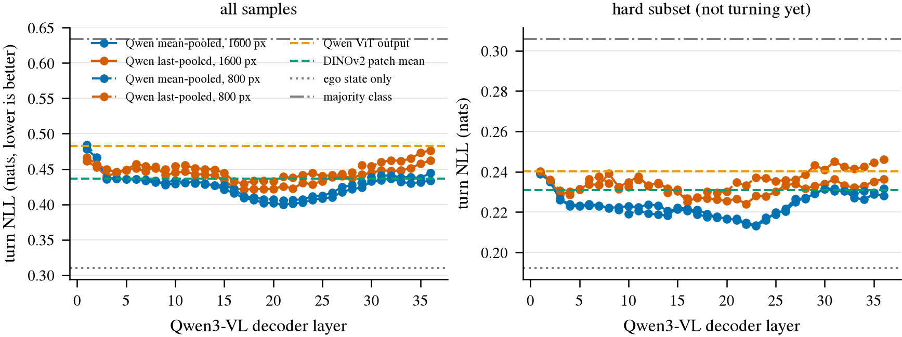

# Qwen latent 里有没有驾驶智能

状态: **已降级**。2026-09-20 主线换成 [frozen-vlm-planner.md](frozen-vlm-planner.md)，
这份文档保留作为那个主题的 analysis 部分：它回答"为什么取中间层"，不再是论文主张。
降级的原因是 arXiv:2603.06054 已经做过很接近的逐层 probe，而且纯 probe 的结果撑不起一篇
自动驾驶的系统论文。probe v1 的结论已经摘进新主题文档。

## probe v1 结论（nuScenes trainval，2026-09-20）

这一节是这份文档现在的主要用途：为主线论文回答"为什么取中间层"。
完整表格和工程数字在 [../todos/2026-09-19-probe-v0.md](../todos/2026-09-19-probe-v0.md)，
run 在 box 上 `$DATA_DIR/runs/probe_v0/v1.0-trainval/20260920-000618/`。

**设置**：nuScenes trainval 的 CAM_FRONT keyframe，单帧，冻结 backbone。
按 scene 分组做 5-fold（同一个 scene 的帧不会同时出现在 train 和 test，避免几乎相同的相邻帧造成泄漏）。
全部样本 n = 26491（转弯 5234）；hard subset，即当前 |yaw rate| < 1°/s、光看运动状态还猜不出要不要转的时刻，
n = 17000（转弯只有 695，占 4%）。主指标是 NLL（negative log-likelihood，越低越好，衡量预测概率是否校准）。

| feature | NLL（全部） | macro-F1 | NLL（hard） | hard turn recall |
|:--|--:|--:|--:|--:|
| majority | 0.634 | 0.297 | 0.306 | 0 |
| ego_rule（外推当前 yaw rate，不训练） | 0.430 | 0.783 | 0.224 | 0 |
| ego（11 维运动状态） | **0.310** | 0.774 | 0.192 | 0.010 |
| DINOv2 patch mean | 0.437 | 0.596 | 0.231 | 0.191 |
| Qwen ViT 输出（vis_mean） | 0.483 | 0.532 | 0.240 | 0.147 |
| Qwen L21_mean（纯图像最好） | 0.400 | 0.648 | 0.216 | 0.246 |
| Qwen L23_mean | 0.402 | 0.644 | **0.213** | 0.236 |
| Qwen L22_mean + ego | **0.308** | 0.762 | **0.185** | 0.227 |

四条结论（下面 1、3、4 条对应 [decisions.md](decisions.md) 的第 1、5、4 条，状态都是**待定**）：

1. **在全部样本上，画面几乎没有增量。** 纯图像最好是 0.400，只用 ego 是 0.310，两者拼接还是 0.308。
   未来 2 s 转不转弯，主要由当前运动状态决定，这件事本身不需要视觉。
2. **hard subset 上画面才起作用。** ego 在这里的 turn recall 只有 0.010，基本从不预测转弯；
   Qwen 中间层能到 0.246，DINOv2 是 0.191。拼接后 NLL 从 0.192 降到 0.185。方向对，但幅度很小，
   而且这一轮**没有做 bootstrap CI**，所以这个差距是否显著还不能下结论。
3. **Qwen 的优势来自 LLM 层，不是它自己的视觉编码器。** Qwen 的 ViT 输出（0.483）比 DINOv2（0.437）还差，
   但进入 LLM 之后第 3 层就追上，中间层明显超过。也就是说，是 LLM 对 visual token 的加工让驾驶相关的信息
   变得线性可读，而不是这个 ViT 本身更强。
4. **分辨率几乎不影响结果。** 1600 px 和 800 px 两套 feature 的最好 NLL 差不超过 0.006（0.400 vs 0.406），
   hard subset 上完全相同（0.213）。但 800 px 抽 feature 快 4.6 倍（30.8 vs 142.4 ms/frame）。
   **后续实验默认用 800 px。**

图：转向 probe 的 NLL 随 Qwen 解码层变化，左为全部样本，右为 hard subset；实线是 1600 px，虚线是 800 px。
两种分辨率的曲线几乎重合，说明这个任务不吃分辨率。曲线呈倒 U 形：从第 1 层到第 20 层左右一路下降，
在 L20–L24 附近最低，之后重新上升，到最后一层退回到接近早期层的水平；mean pooling 始终优于 last token。
所以"取中间层"不是超参搜出来的巧合：**信息先被 LLM 组织出来，再在靠近输出的几层里被压掉一部分**，
这正是本主题原来的猜测，也是主线论文取中间层的依据。

一个限制要写明：这里只测了单帧、只测了转向三分类。曲线的形状在轨迹回归上是否一样，要看 planner 那边的
layer curve（[frozen-vlm-planner.md](frozen-vlm-planner.md)）。

## 核心问题

> Qwen 的视觉/语言预训练 latent，本身是否已经包含足够的 driving intelligence，
> 使得一个极小、非生成式的 decision head 就能读出未来驾驶行为？

不把 Jev-like 模型当成要训练的本体。候选 logits + softmax 的 decision 输出层社区已经做过
（LitJev、Jev Visual 等），不值得再证明一次。我们研究它前面的 z。

## 任务形式

过去的视频 → 几个 Jev-style fixed decision：

- 转向: left / straight / right
- 纵向: 减速 / 保持 / 加速
- 未来横向位移或曲率的类别（比如 2s 后 large-left … large-right 五档）

先只做 ego future maneuver，因为 ground truth 最干净。cut-in、pedestrian intention 这类 interaction
任务等这个问题回答清楚以后再做。

## 四个系统

| 实验 | 模型 | 在测什么 |
|---|---|---|
| A | Qwen-VL autoregressive prompt | 原始 VLM intelligence |
| B | Qwen-VL direct candidate logits | 不生成文字之后还剩多少能力 |
| C | Frozen Qwen latent + Linear/MLP | latent 本身有没有驾驶信息 |
| D | Frozen Qwen latent + tiny temporal Transformer | 缺的是不是 temporal dynamics |

C vs D 最关键：

- D ≫ C：Qwen 有视觉语义，但连续 dynamics 需要重新对齐。
- C ≈ D 且都好：multimodal pretraining 已经把大量 driving-dynamics 信息塞进 latent。
- A 好但 C/D 差：智能在完整的 transformer computation 里，抽 latent 的层选错了。

## Layer probe

从不同层取 z：vision encoder 输出、LLM early / middle / late。
猜测：越靠后越懂"这是什么"，越不记得"具体怎么动"。
如果成立，就支撑"VLM 不是没有 physical information，而是语言化过程中把它压掉了"。
这可能是论文的一部分。

## 评价指标

Accuracy / F1、NLL、Brier、ECE（在 val 上学一个 temperature T），以及 latency。
研究动机是：在 20–50 Hz 下还能保留多少 foundation-model intelligence。

## 必须有的 baseline（Claude 补充）

- **Majority / prior**：数据里绝大多数是 straight，不和它比，accuracy 没有意义。
- **Ego-state only**：只用过去轨迹、速度、加速度去预测未来 maneuver。
  未来 2s 的行为很大程度由当前运动状态决定，Qwen latent 必须**超过**这个 baseline
  才能说明它从画面里读出了东西。这是整个故事成立的前提。
- **小视觉 backbone**（比如 ImageNet ResNet/DINOv2 feature + 同样的 probe）：
  区分"Qwen 特有的智能"和"任何视觉 feature 都能做到"。

## 数据

- nuScenes mini（已在 box 上 `$DATA_DIR/datasets/nuscenes`）：10 个 scene，CAM_FRONT 404 个
  keyframe（2Hz），1938 个 sweep（~12Hz）。**只够 debug pipeline**，val 只有 2 个 scene，
  得不出任何结论。
- nuScenes trainval：850 个 scene，`/autodl-pub` 上已有，解压即可，不用下载。
  可以作为 mini 之后、Waymo 之前的第一个有统计意义的实验。
- Waymo E2E（正式实验候选）：8 cameras、10Hz、4s past + 5s future trajectory、
  velocity/acceleration、left/straight/right route command，专挑 long-tail 场景。
  4021 个 segment（train 2037 / val 479）。需要申请 license 并下载。

## Open questions

- z 怎么取：vision token mean-pool、最后一个 token、还是带 prompt 的某个 token？
  带不带 prompt 本身就是一个变量。
- 多帧怎么喂：多图输入 Qwen 一次过，还是每帧单独抽 z 再给 temporal model？
  两者测的东西不一样。
- 标签阈值（±5° yaw 等）怎么定，类别不平衡怎么处理。
- A/B/C/D 的 latency 口径怎么统一，才能公平比较。

## 参考

- Qwen3-VL-4B-Instruct: https://huggingface.co/Qwen/Qwen3-VL-4B-Instruct
- Jev Visual（shared prefill → fork → candidate scoring）: https://github.com/hr98w/jev-visual
- LitJev: https://huggingface.co/spaces/multimodalart/jev-reproductions-tracker/discussions/2
- OpenJev（DiffusionGemma，需要 Blackwell，不适合 4090 起步）: https://github.com/razorback16/openjev
- nuScenes CAN bus expansion: https://www.nuscenes.org/tutorials/can_bus_tutorial.html
- Waymo E2E: https://waymo.com/open/data/e2e/
