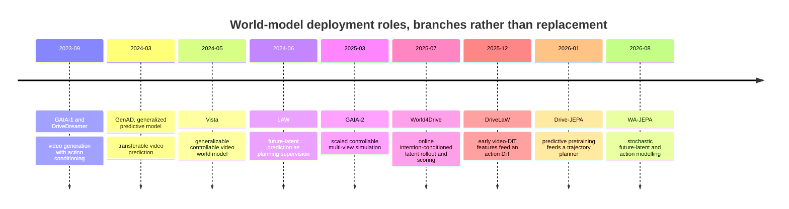
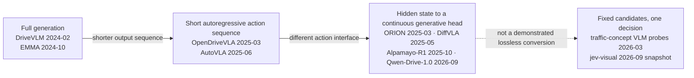
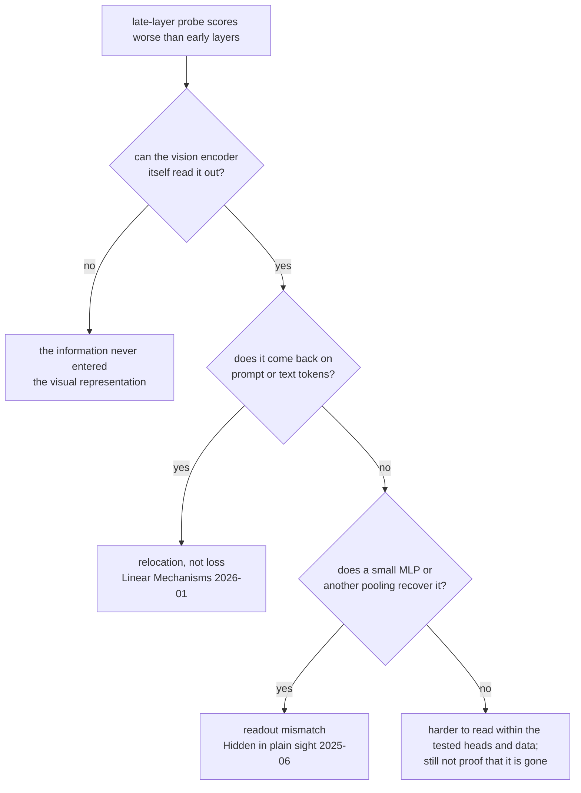
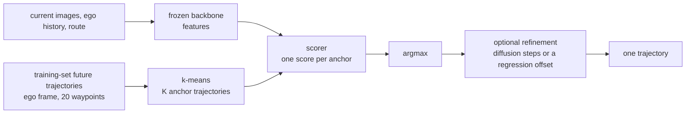
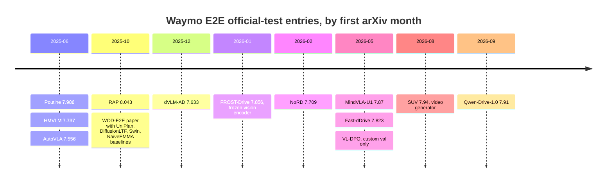
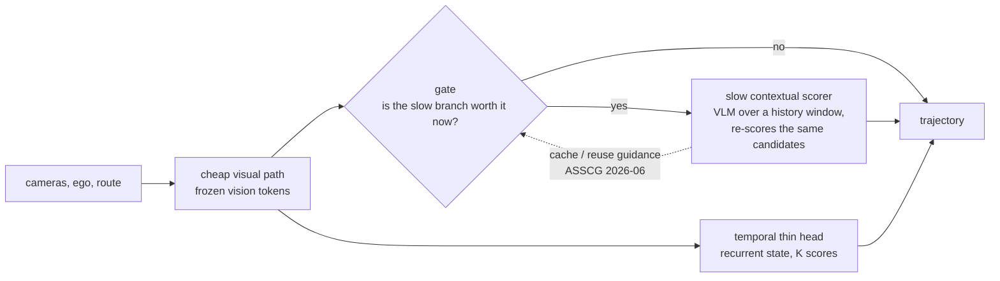

# 驾驶智能在哪里，decoder 能薄到哪里：文献综述

组会分享用。整理自两轮 deep research 报告（`research/lit/`，不进 git），核对截止 2026-09-20；「近三个月」指 2026-06-20 之后
首发或修订的工作。所有数字出自被引论文或官方页面，**不含我们自己的实验结果**。PNG 图由
[figs/survey/make_figures.py](figs/survey/make_figures.py) 生成，数据在脚本里；mermaid 图直接写在正文中，二者部分重叠，先都保留。

---

## 问题与结论

这份综述围绕一个问题：预训练模型（视频 world model、VLM）的表示中已经包含多少可用于驾驶决策的信息，把表示映射到动作的
decoder 可以薄到什么程度。术语沿用原报告：**thin decoder** 指在大的、冻结或轻微适配的 backbone 之上，一个小的、非自回归的
输出 head；线性层、小 MLP、固定候选打分都算，「输出 token 少」或「用 diffusion」本身不满足定义。证据按强度分级：
A 是同一系统的直接消融，B 是同一任务或 head 下的受控比较但 pretraining 或 backbone 不同，C 是跨论文结果，D 是作者仓库或工程 demo。

结论有三条。第一，大量可用信息确实存在于预训练表示中：冻结的视觉 encoder 接一个训练过的小 head，在 Waymo E2E official test
上已经进入微调 VLM 的中游。第二，可读性、可执行性和对追加计算的需求是三个独立的量：探针能读出的信息，生成时未必被使用；
选对了大方向的系统，轨迹精度可以是全场最差；在某个 benchmark 上「不看当前画面」也能得高分，反映的是 benchmark 的性质。
第三，领域收敛的方向不是删除生成，而是重新分配计算的位置：生成式训练留下的表示，部署时只保留任务需要的那部分计算。
保留多少、何时需要更多，是当前最开放、也最拥挤的问题。

我们组的位置：完全冻结、未做 driving 适配的 VLM，取中间层 hidden state，接一个在固定轨迹词表上打分的薄 head，
在 Waymo E2E 上评估精度和延迟。下文是这个位置周围的文献地形。

---

## 两条路线的演化都不是单向的

把预训练知识引入端到端驾驶的两条主线是 world model 和 VLA。两者在推理时的生成量都在缩减，但把演化画成一条从厚到薄的直线，
会误读其中多数论文。

### World model：预测未来的位置在变，预测本身没有消失

GAIA-1、DriveDreamer（2023-09）、Vista（2024-05）、GAIA-2（2025-03）这一支生成未来几秒的驾驶视频，主要用途是可控仿真和数据生成，
不是在线规划器 [1–4]。它们与后来的 latent planner 不是同一个 planner 的前后两代，FVD 的进步和 planning 的进步不能拼成一个
decoder-removal 实验。分叉出现在 2024 年中：LAW 把未来 latent 预测作为辅助训练任务，planner 顺带学习预测下一时刻的视觉特征，
部署时预测头可以去掉 [5]。此后「预测未来」被放到三个不同位置。

时间顺序不表示替代关系；要区分的是推理时保留的是 renderer、latent dynamics，还是只有一个经 predictive pretraining 的 encoder。
同名陷阱：GenAD 有两篇，Generalized Predictive Model 是视频预测路线 [51]，Generative End-to-End Autonomous Driving 是
instance-centric scene token 加轨迹 latent 分布的路线 [52]，后者不是前者删掉 pixel decoder 的后继。

图 1：三种部署角色。World4Drive 在推理时对每个意图做 latent rollout 再打分 [6]；DriveLaW 取视频生成器第一个去噪步的特征
喂 action DiT，RGB decoder 不运行 [7]；LAW 和 Drive-JEPA 把未来预测写进训练目标，部署只剩 encoder [5, 8]。三者都不输出像素，
保留的在线计算完全不同。

| 实验 | 实际改变了什么 | 结果 | 证据等级与边界 |
|---|---|---|---|
| LAW，Tables 4–5 [5] | 有 / 无 future-latent prediction 辅助任务 | NAVSIM PDMS **77.5 → 84.6**；CARLA Town05 Long DS 67.9±2.1 → 70.1±2.6 | A。未来 latent 监督有用；不是 RGB vs latent 的等架构比较，CARLA 增益要连方差读 |
| DriveLaW，Table 6 [7] | planner 用第 1 / 5 / 10 个去噪步的特征 | PDMS **89.1 / 86.9 / 23.2** | A。该系统里更晚的生成状态不改善规划；不是「删掉所有生成计算」的证明 |
| DriveLaW，Appendix A.2 [7] | 部署缓存首次 Video DiT 特征，不解码视频 | planner 用上述早期特征 | RGB 解码不是此部署路径的必需品；Video DiT 和迭代式 Action DiT 仍在 |
| Drive-JEPA，Tables 5–6 [8] | 同一 planning framework，换 encoder 预训练 | ImageNet ResNet-34 76.0、DINOv2 ViT-L 76.1、V-JEPA 2 ViT-L 86.1、driving JEPA 89.0 | B。表示的训练目标重要；不是 decoder 消融 |
| WA-JEPA v2，Table 4c [9] | 同一 joint architecture：无未来监督 / 直接回归 / flow matching | EPDMS **91.1 / 90.7 / 91.7** | A。保留 stochastic 未来 latent 生成可能胜过进一步简化；差距需结合训练方差 |

第二列是读这张表的关键。auxiliary-task 增益、feature timestep 选择、跨 backbone 增益是三种不同实验，都不能写成
「去掉 pixel decoder 后性能提高」。PDMS 是 NAVSIM v1 的综合分，EPDMS 是 v2 的扩展版，不可混排。

DriveLaW 第 10 步的 23.2，作者解释为后期细节不利于决策，但表格排除不了 conditioning 分布、planner 优化或特征尺度不匹配。
它支持「早期生成状态足够且可能更好」，不足以识别「物理信息被视觉细节挤掉」的机制。删掉 RGB 也不等于实时：
DriveLaW v3 在 H20、1024×512 输入下的轨迹规划为 **0.71 s** [7]。原问题最严格的版本，即同一 backbone、相同训练预算、
相同 action head、仅去掉 RGB decoder、在同一闭环 benchmark 上证明长尾能力保持，两轮检索均**未找到**已发表证据。

不监督像素之后监督什么，这一支内部没有统一答案。LAW 与 Drive-JEPA 采用 future encoder target，预测一个冻结或 EMA encoder
在未来时刻的表示；它摆脱了像素重建成本，但继承目标 encoder 的盲区，目标对微小横向速度不敏感时，latent prediction loss
也不会要求保留它。World4Drive 采用 action conditioning，对多个意图分别预测未来再学习选择，并借助预训练深度和语义模型
给 latent 加物理结构，「无需 perception annotation」不等于「无 perception supervision」[6]。Occupancy 路线显式预测空间占用，
以部分开放语义换取可检查的几何 [24]。WA-JEPA 则指出标准 video JEPA 的 mask 与确定性目标有 temporal collapse 风险，
改为面向未来、带随机性的 latent 建模，报告 NAVSIM v1 91.8 PDMS 并做 HUGSIM 迁移 [9]；latent 路线内部仍在争论
确定性压缩是否会压掉 motion。NTR 用 scene token 重建被 mask 的 foundation feature，部署删除重建头 [53]，
这是 representation reconstruction 而非 dynamics world model，回答不了 rollout 是否必要；但它与 Drive-JEPA 共同给出了
更准确的表述：**world objective 只在训练期使用，部署只保留任务需要的计算。**

### VLA：数值 action 在脱离长文本，reasoning 没有一致退出

DriveVLM（2024-02）把场景描述、分析和分层规划串成链，并以 DriveVLM-Dual 与传统 pipeline 结合 [10]；EMMA（2024-10）把多任务
输入输出放进统一语言接口 [11]。二者建立的是「通用预训练知识可以参与驾驶」，未证明长文本是 action 的最佳通信格式。
2025 年后出现的是三种并行的压缩：不写 CoT；用离散 action token 代替小数文本；从 hidden state 接连续 planner。

图 2：同一张图的 PNG 版。箭头不是引用、继承或性能支配关系。OpenDriveVLA 推理不要求 CoT 但仍自回归 [12]；AutoVLA 把 5 s 轨迹
编成 10 个 physical action token，也仍自回归 [13]；二者都不满足 thin decoder 的定义。ORION 把 reasoning space 的一个 ego token
接入生成式 planner，默认用 VAE latent 和 GRU 轨迹解码器 [14]；DiffVLA 与 DiffVLA++ 把 VLM 引导和 diffusion planner 结合 [54, 55]。
这些工作说明语言与控制可以用不同输出机制，不说明 planner 已薄到线性层。

最新结果也没有沿这条谱单向右移。Alpamayo 2 Super（2026-08）由 32B reasoner 和 2B diffusion action expert 组成，
输出轨迹、CoC、meta-action 等 [18]。Qwen-Drive-1.0 基于 Qwen3.5-4B 接 Planning Expert，官方说明 RL checkpoint 应搭配 reasoning，
因为 RL rollout 的训练路径是 reasoning-conditioned [16]。

---

## 「变薄」有四种，消融不能互换

| 改变的环节 | 少做了什么 | 不能推出什么 |
|---|---|---|
| RGB decoding | 不把预测的未来还原成像素 | 未来预测无用 |
| Textual trajectory | 不逐 token 写出坐标 | reasoning 无用 |
| CoT | 不生成显式推理文本 | 困难场景能力不变 |
| Latent rollout | 不显式推演中间未来状态 | 行动后果的信息仍在 |

读这条线的论文，先确定它删掉的是哪一行；某一行的成功消融不是另三行也能删的证据。中间两行最容易混淆，Alpamayo-R1 在同一平台上
把它们分开了 [15]。

图 3：Alpamayo-R1 Table 14，同一模型、同一张 RTX 6000 Pro Blackwell。保留 40 个 reasoning token、把 127 个自回归轨迹 token
换成 5 步 flow，延迟从 312 ms 降到 99 ms；再去掉 reasoning 才到 29 ms。**轨迹序列化是主要成本，不必先删 reasoning 才能提速。**
同一论文报告 reasoning 版本在困难场景的规划精度最多提升 12%、闭环 close-encounter 率下降 35%，这些收益不属于最快那条路径；
close encounter 也不能改写成 collision rate。

AutoVLA 提供了反对「CoT 无用」的证据：低数据量时 reasoning 未必有益，数据增加后带 CoT 训练的策略更好，RFT（reinforcement
fine-tuning）学习何时省略慢思考 [13]。CoT 在训练中提供监督、在推理时提供额外计算、只生成可读解释，三者的消融不能互换。
它的速度：fast 平均 1.072 s，slow 10.518 s，只输出 10 个 action token 仍不快；CARLA 的 2 Hz 设置不代表墙钟 2 Hz。

文献里可核实的延迟并排如下，最薄的一档是空的。

| 输出路线 | 可核实延迟 | 硬件与口径 | 读法 |
|---|---|---|---|
| AR physical action tokens，AutoVLA [13] | fast 1.072 s；slow 10.518 s | Table 2 未绑定推理设备 | 10 个 token 仍慢 |
| AR textual trajectory，Alpamayo-R1 [15] | 312 ms | RTX 6000 Pro Blackwell，含 40 reasoning token | 127 个轨迹 token 是主要成本 |
| reasoning + flow，Alpamayo-R1 [15] | 99 ms | 同上，5 flow steps | 不消灭 CoT 也能大幅降低解码成本 |
| trajectory-only flow，Alpamayo-R1 [15] | 29 ms | 同上，无 reasoning | 速度 baseline；不能继承 reasoning 版本的长尾结果 |
| linear / MLP on frozen latent | **未找到**同输入同硬件的完整驾驶延迟 | 只测 head 会漏掉 encoder 和 prefill | 空格 |
| Jev-like shared scoring，jev-visual [17] | 64 个问题：独立 37.30 s → 共享 2.40 s | M4 / 16 GB，Qwen3.5-0.8B 4-bit | 批均摊，不是连续控制 |
| typed parallel read，openjev [20] | 并发 1：p50 94 ms；并发 64：p95 1109 ms | RTX PRO 6000 Blackwell，每请求 3 个问题 | 非驾驶 benchmark，吞吐不是控制频率 |

Hz 是单次时间的倒数，不是部署保证；不同相机数、帧数、精度、batch 的数字不能直接排名。

### Jev：候选打分接口已被复现，驾驶能力没有

TypeSafe 于 2026-09-15 发布 Jev，描述为专有架构，核心是 parallel sampler 与 RLCD 训练 [19]；它不是驾驶工作，也不能据此把过去的
next-token classifier 都归到 Jev。hr98w/jev-visual 实现了 shared multimodal prefill、fork cache 和 candidate scoring，
并声明未复现专有训练与 calibration [17]。其 Breakout demo 中直接反复选 left / right 不可靠，改为画面五区域分类再交给规则控制
才能运行；无驾驶数据，无安全评估。razorback16/openjev 用 DiffusionGemma 的 masked canvas 做并行去噪读出，不是同一种 next-token
实现，「Jev-compatible API」不等于相同计算机制 [20]。Hugging Face 上的 reproductions tracker 讨论页报告未能可靠读取，不引用其数目。

Jev 风格接口用于驾驶时有几个需要预先登记的失效模式。候选内的 softmax 是给定选项内的相对概率，不是行动安全概率，正确选项不在
候选集时模型仍可高置信地选错；候选措辞、顺序、单 token 与多 token 的长度偏置都影响分数；left / straight / right 混合了
route intention、lane choice 和 immediate control；三选一无效时需要 abstention 或 fallback，而非强制输出格式正确的错误动作。
公开的、受控的 Jev 风格驾驶复现（accuracy、calibration、闭环）**未找到**，这与「shared-prefix scoring 已有实现」并不矛盾。

---

## 前端表示：head 的输入是什么

head 薄之后，差别集中在前端。两个系统用同样的分类器，可以看到不同的分辨率、历史窗口和 token。最有说服力的证据是同一 planner
下换前端的实验。

图 4：三组同 planner、换前端的消融，均为 NAVSIM v1 PDMS。左，Drive-JEPA 同一 framework 下换 encoder 预训练：ImageNet 与 DINOv2
几乎相同，V-JEPA 2 高 10 分，driving JEPA 最高 [8]。中，DriveLaW 同一 Action DiT 下 BEV / VLM / 视频生成器 [7]。右，DriveLaW
用第几个去噪步的特征 [7]。三组都不是等规模、等数据的受控比较，方向一致：**前端的训练目标比架构名字重要，越晚的生成状态越不适合决策。**

| 前端 | 证据支持什么，没证明什么 | layer、pooling、prompt 与 runtime | 最接近的 same-head 比较 |
|---|---|---|---|
| Frozen VLM latents | presence、count 等概念可读；orientation 更依赖空间布局；生成答错不等于信息不存在 [21] | encoder token、region pooling、LLM visual token、最后一个 prompt token 不能互换；进 LLM 要付 prefill 成本 | FROST-Drive 冻结 VLM 的 **vision encoder** 接 planner，与 ImageNet ViT 比 [22]；不是 frozen LLM hidden-state 实验 |
| 自监督视频 / 单帧特征 | V-JEPA 2 面向视频预测，DINOv2 / v3 面向静态稠密特征 [25, 26]；静态特征强不等于同一 head 下对未来速度有优势 | 帧级 encoder 可缓存；视频 encoder 需明确窗口；平均所有帧会抹掉时间顺序，是 readout 问题不是 encoder 问题 | Drive-JEPA 同一 framework 下的 DINOv2 与 V-JEPA 2 对照最接近，仍混合 objective、data、architecture |
| BEV / occupancy | 显式位置和占用便于几何推理；不自带开放语义和交规知识 [24] | 成本要算相机编码、视角变换、融合、时序更新 | DriveLaW 同一 Action DiT 下 BEV / VLM / VGM 为 84.1 / 86.5 / 89.1 [7]；容量与预训练不匹配 |
| 离散 scene token | DrivingGPT 联合建模量化图像 token 与动作 token；重建质量不等于对动力学的充分性 [27] | tokenizer 压缩率、空间分辨率、序列长度决定代价；其下游自回归模型不是薄 readout | 四类前端接同一 frozen linear head 的完整对照**未找到** |

三种都叫 token 的东西不是同一种表示瓶颈：AutoVLA 的 action codebook 编码动作 [13]，DrivingGPT 的 image tokenizer 编码场景 [27]，
NTR 的连续 register token 学习重建特征 [53]。「scene token 已有效」不能作为「离散 action head 足够」的证据。

最容易漏掉的 baseline 是 **VLM 自己的 vision encoder**。只比 VLM 与 DINOv2，胜负可能来自视觉预训练、分辨率或参数量而非 LLM；
DINOv2 优于 LLM 末层，也可能只是一个保留 patch grid、另一个被全局平均，比较的是信息接口而非模型能力。FROST-Drive 的数据
直接相关：同样的 adapter 加 GRU，冻结 ImageNet ViT 在其自定义 val 口径为 RFS 7.39，冻结 VLM vision encoder 为 8.17，LLM 未参与 [22]。
另一项工作比较 frozen 的 Qwen / InternVL 与 Wan 类视频生成模型，在 ScanNet、DL3DV 上测语义、几何、相机运动：
VLM 偏强于语义，视频生成模型偏强于几何与相机运动，其 depth sweep 是 probe depth 而非 backbone 逐层曲线 [28]。
没有一个前端被证明是薄 head 的统一最优底座；严格控制接口的比较比增加模型名更有价值。

---

## 探针：已有先例与剩余空间

两轮报告都把这一节称为 adversarial novelty check。任务是列出离「frozen VLM 中的驾驶动力学」最近的先例，
再界定它们尚未回答什么。

### 七个最近邻

| 先例 | 已经做了什么 | 与目标问题的距离 |
|---|---|---|
| **A**. Probing Visual Concepts in Lightweight VLMs for Automated Driving [21]，2026-03，v2 2026-08 | CARLA 反事实图像上测 presence、count、spatial relation、orientation；对 vision encoder、projector、LLM 逐层线性探针，模型含 Qwen3-VL-2B；比较生成、constrained output、探针；activation steering；小规模 nuScenes 迁移。生成与 constrained scoring 的 prompt 不同，不是 matched-prompt 对照 | 已覆盖架构、逐层测量和输出模式比较。实质差别是**时间证据、未来动力学、行动后果**，不是 2B 换 4B |
| **B**. Hidden in plain sight [29]，2025-06 | 共享 vision backbone 的受控 VLM，在 CV-Bench、SPair-71k、BLINK 上比较视觉与 LLM 表示；多数视觉信息在后续组件仍可读；某些 DINOv2-backed 模型的 affordance / style 在末层明显下降。并非全部任务用线性分类器 | 建立了「生成失败可以是 readout failure 而非表示被毁」；未测 ego 未来动作或交通历史中的 metric dynamics |
| **C**. Linear Mechanisms for Spatiotemporal Reasoning in VLMs [30]，2026-01 | COCO、Objaverse 合成视频、MVBench 上测空间与时序身份；activation patching 显示信息可从早期 visual token 转移到后续 text token | 把「只看 visual token 会误判信息流失」具体化；未证明数值 motion 沿同一路径迁移 |
| **D**. Which Pretraining Paradigm Better Serves Spatial Intelligence [28]，2026-05 | frozen VLM 与视频生成模型接相近轻量 readout，测语义、几何、相机运动 | 已覆盖「厚表示中的物理信息加相近 head 对照」；不是线性驾驶探针，target 不是 logged future decision |
| **E**. Anchor-Align [31]，2026-07 | 机器人 VLA 适配中逐层读出动作，用 representation similarity 追踪冻结原模型与适配模型；action readout 峰值第 22 层 R² 0.60，CKA 0.91 | 研究的是适配后的策略；「未经驾驶适配的 VLM 能否从历史视觉读出超越 ego-state 的未来信息」是不同问题 |
| **F**. Probing a VLA for Symbolic States [32]，2025-02 | 对 OpenVLA 多个 LLM 层做线性探针，在 LIBERO 读 object / relation / action 符号状态；不呈现简单的「早层物体、晚层动作」分界 | backbone 是经 action 适配的 OpenVLA，任务是符号状态 |
| **G**. FROST-Drive [22]，2026-01 | 冻结 VLM vision encoder，接 temporal / query adapter 与 GRU 轨迹头，在 Waymo E2E 上比 ImageNet ViT 与 VLM encoder | 已覆盖 frozen pretrained vision 接驾驶 head 的部署论点；未调用完整 LLM hidden state |

由此，以下表述不能再作为贡献：「首次探索驾驶 VLM 的逐层物理信息」「首次发现晚层空间能力下降」「首次证明可读信息不等于输出能力」
「首次以 activation steering 验证 VLM 中的交通概念」。反向也不应夸大先例：同一 frozen VLM 在真实驾驶历史上、同时做
ego-conditioned 未来动力学、完整 token 位置的逐层曲线、匹配监督的三种用法比较、action 层面因果验证的公开工作**未找到**；
这是限定的「未找到」，不是保证不存在。

### 逐层曲线下降的四种解释

同一条下降曲线至少对应四种机制：信息未进入 vision representation；信息进入后在后续计算中不再能被简单 head 提取，
驾驶探针中部分 orientation 的下降是例子 [21]；信息从 image token 转移到 text 或 prompt token，pooling 未跟上 [30]；
信息仍在但线性不可读，换 pooling 或小 MLP 即可恢复 [29]。四种机制指向不同的改进（换读取位置、换 readout、重训 backbone），
只画曲线区分不了。此外，「晚层导致变化」是模型内部的定位，「language alignment 导致变化」是关于训练目标的因果主张；
后者需要 alignment 前后 checkpoint 或匹配初始化与数据的消融，同一家族两个尺寸的比较不能替代。Qwen3-VL 的 DeepStack
会在若干 LLM 层再次注入 vision feature，逐层曲线需记录注入前后 [21]。

### 适配与遗忘

先拆开「LoRA、full fine-tuning、SFT、RL、distillation 四选一」：LoRA / full fine-tuning 决定哪些参数可变，SFT / RL 决定
优化目标，distillation 决定把能力交给谁；AutoVLA 的 RFT 本身用 LoRA [13]。

Anchor-Align 给出最直接的遗忘测量：行为克隆适配下 GQA 准确率在 10k steps 内相对下降约 94%，加表示锚定后保留约原水平的 70%
（相对保留，不是 70% 绝对准确率）；同时测 hidden-state similarity、action readability 和 LIBERO-PRO OOD，显示参数是否更新、
表示是否稳定、动作是否可读不是同一个量 [31]。Qwen-Drive-1.0 在驾驶域的数字：混合通用数据 SFT 后 MMMU 73.4 → 72.7，
MMBench 87.1 → 85.5 [16]，支持「混合训练保留了大部分被测通用能力」，不支持「world knowledge 不变」，也不覆盖其 RL checkpoint。
LoRA 的低秩限制的是更新的参数化形式，不是输出行为变化的上界。

RL 相对 SFT 已有实质增益。AutoVLA 在 NAVSIM 的单候选 PDMS 从 SFT 80.54 到 RFT 89.11，best-of-six 92.12 是候选覆盖上界，
不可与可部署的单候选混写 [13]。Qwen-Drive SFT → RL：NAVSIM 88.2 → 90.7，Waymo RFS 7.78 → 7.91，5 s ADE 2.65 → 2.67，
并非所有指标都改善 [16]。这些结果表明 RL 能把策略推向 reward 偏好的轨迹集合，不等于新增物理知识；训练 reward 接近评估指标时，
应先问它改进的是候选排序、动作分布、reasoning，还是减少了某类显眼违规。Distillation 是另一种部署分工：VLM-AD 用 VLM 监督
训练小策略，部署不需要 VLM，VAD-Base 在 CARLA Town05 Long 的 DS 30.31 → 35.25 [33]；它回答「teacher 监督能否留下任务收益」，
不回答「student 是否继承未被标签触及的开放世界知识」。同一驾驶 VLM 上匹配数据与预算的四路比较，并同时报告通用能力保留、
逐层动力学、闭环 OOD 的完整实验**未找到**。

### Ego-status shortcut

Is Ego Status All You Need for Open-Loop End-to-End Autonomous Driving? [34] 在 nuScenes 上展示：只用速度、加速度、yaw rate
等自身状态、不看画面的 baseline，在 open-loop 指标上有竞争力。它动摇的不是 nuScenes 分数本身，而是从 open-loop accuracy
推到场景理解的逻辑。对本文主题它是最重要的方法论约束：**任何「视觉表示中有驾驶信息」的主张，增量必须相对一个 ego-state-only
baseline 来报。** Waymo official test 上至今没有这一行，见下文。

---

## 轨迹词表与 frozen backbone 的近邻

把「读出类别」升级为「输出轨迹」同时保持 head 薄，成熟做法是 trajectory vocabulary：训练集未来轨迹 k-means 得到 K 条 anchor，
模型对 K 个候选打分而非回归坐标。误差可拆为 coverage error（词表中离真值最近的 oracle 还差多少）与 ranking error
（scorer 未选到最优候选再差多少）；多数方法在选中候选上再做一步 refinement，WoTE 的匹配消融显示 K=256 时 refinement
把 PDMS 从 84.0 提到 85.6 [39]。

| 方法 | K，建库 | scorer 监督 | refinement | 结果 |
|---|---|---|---|---|
| Hydra-MDP [35]，2024-06 | **4096 / 8192**，训练轨迹 k-means，ego-local | 到 imitation 目标的距离 + 仿真子分数蒸馏 | 无 | NAVSIM v1 PDMS 82.6 → 83.0 |
| Hydra-MDP++ [36]，2025-03 | 8192 | 更多 rule-based 子分数 | 无 | 91.0 PDMS |
| DiffusionDrive [37]，2024-11 | **20 anchor** + 噪声 | anchor BCE + 最佳模式回归 / 去噪 | 2 步截断扩散 | 88.1 PDMS；4090 上 45 FPS |
| GoalFlow [38]，2025-03 | 4096 / 8192 个**终点**，非完整轨迹 | 终点距离与可驾驶区域 | goal-conditioned flow | 90.3（5 步）/ 88.9（1 步） |
| WoTE [39]，2025-04 | **256**，expert 轨迹 k-means | winner-take-all 回归 + world model 奖励 | 先 refine 后评分 | 88.3 PDMS；L20 上 18.7 ms |
| GTRS [40]，2025-06 | 训练 16384，推理 8192 + 动态候选 | 子分数监督 + vocabulary dropout | 含动态轨迹 | navhard 49.4 EPDMS（挑战赛 ensemble） |
| ZTRS [41]，2025-10 | 8192 / 16384 固定轨迹 | 子分数 BCE + Exhaustive Policy Optimization | 无连续生成 | navhard 45.5 EPDMS |
| Auto-JEPA [42]，2026-07 | 训练轨迹记忆，检索 **top-300** | latent 检索 + rule score | 不生成新轨迹 | v1 91.3 PDMS；v2 navtest 89.1 EPDMS |

完整轨迹词表、终点词表、扩散初始化 anchor 不是同一种 K；同列可比，跨列绝对值不可比。navhard 是 v2 困难子集，量级与 navtest 不同。

图 7：公开的 K 扫描，三条线是三个系统，只能在线内比。共同形状是 K 翻倍的增益在几百之后很小，DiffusionDrive 从 20 到 40 个
推理候选只涨 0.1 [35, 37, 39]。词表大小不是主要瓶颈，scorer 的排序精度才是。Waymo 的 5 s、20 点、长尾设定下的最优 K 与
normalization 无公开报告。

| 近邻 | 冻结什么，head 是什么 | 公开结果 | 与「冻结 VLM + 一次词表打分」的距离 |
|---|---|---|---|
| FROST-Drive [22]，2026-01 | 冻结 InternVL3 vision encoder；adapter + GRU 回归 | Waymo test RFS **7.856** | 不用 LLM hidden state；系统定位最近 |
| Qwen-Drive-1.0 消融 [16]，2026-09 | **未做 driving 适配**的 Qwen3.5-4B；训练 KV-conditioned flow Planning Expert | Waymo **val** RFS 7.88 | frozen LLM feature 接 planner 已有直接结果；不是一次性固定词表分类 |
| DiffAdapterVLA [43]，2026-09 | 冻结已适配的 Cosmos-Reason2-8B；LLM 内部插入可训练 DiffAdapter | NAVSIM v1 88.3 → 90.3；**3.05%** 可训练参数 | 中间 LLM 层 + 冻结权重 + 参数效率已有；非完全静态可缓存特征 |
| Auto-JEPA [42]，2026-07 | 冻结 V-JEPA 2；predictor + 检索式 scorer | v1 91.3 PDMS；训练 1–2×A100 80 GB | 冻结表示 + 轨迹记忆已有；非 VLM，head 不薄 |
| VL-DPO [44]，2026-05 | 冻结 Gemini 2.5 Pro 对 12 条渲染候选打分，再 DPO 训练 planner | 自定义 Waymo val 7.2279 → 7.2970 | VLM 评分候选已有；离线 teacher，含额外信息 |
| OpenEMMA / LightEMMA 复现 [45] | zero-shot VLM 直接输出轨迹 | Waymo test RFS **5.158 / 6.517** | training-free 近邻；远低于任何训练过的方法 |

我们的判定是 partially done：「first frozen-VLM planner」不能声称；「一次固定词表分类、完全静态可缓存的中间层特征、
同 backbone 的分类 vs 回归对照、严格的视觉增益、真实单卡端到端 Pareto」这一组合层面仍有空间，仅换模型版本或换一层不够。

---

## Waymo E2E：协议、榜单、拥挤程度

### 协议

WOD-E2E 于 2025-10 发布，专挑长尾场景，官方描述出现频率低于 0.03%；数据集论文进入 CVPR 2026 [46]。

| 项目 | 官方口径 |
|---|---|
| 规模 | **4021** 个 20 s 片段：train 2037 / val 479 / test 1505。官网总览页的「约 5000 segments」是另一统计口径 |
| 格式 | TFRecord，`E2EDFrame` protobuf，JPEG 内嵌；不是 Perception 数据集的 parquet |
| 相机 | 8 个环视相机 |
| ego 历史 | (−4 s, 0]，4 Hz，16 个状态：XYZ 位置、XY 速度与加速度 |
| 图像历史 | 当前帧加片段内过去帧，窗口自选 |
| route | intent 四选一：straight、left、right、unknown |
| 输出 | (0, 5]，4 Hz，20 个 XY waypoint，首点 t+0.25 s，后轴坐标系，x 前 y 左 |
| test | 前 12 s 可见，后 8 s 隐藏；只交一条轨迹，不交 K 条与置信度 |
| 主指标 | **RFS**（Rater Feedback Score）：与多条人工评分参考轨迹比，离所有参考都远时向下限衰减；在 3 s、5 s 及 11 类场景聚合 |
| 次指标 | ADE@5 s，对评分最高的参考轨迹计算 |
| 提交 | 每 30 天 6 次，错误提交不计；需填 `uses_public_model_pretraining`、`public_model_names`、`num_model_parameters` |
| 2026 | **不举办**正式 challenge，榜单开放 |

来源为官方 challenge 页面、tutorial 与 proto 定义，2026-09 核对 [47]。RFS 的动机是长尾场景存在多种合理行为，对单条 logged
trajectory 算距离会惩罚正确的替代解；代价是它仍是 open-loop 代理，不是在线人工评价，也不是执行后的碰撞率，向下限衰减的机制
也意味着分数不能解释为风险概率。

### 榜单

以下为可核实日期和出处的 official-test 记录，来自论文及后续论文的对比表，不是实时抓取的榜单。

| 方法 | Backbone 与更新方式 | Head；主要输入 | **RFS** | **ADE@5s (m)** | 出处 |
|---|---|---|---:|---:|---|
| RAP | DINOv3-H+，全模型约 0.88B，Waymo 阶段解冻 | 多候选回归 + 打分；多相机、4 s ego、route | **8.043** | **2.646** | 2510.04333，2025-10 |
| Poutine | Qwen2.5-VL-3B；SFT + GRPO | 自回归坐标；前 3 相机、4 s ego，推理去掉 route | 7.986 | 2.742 | 2506.11234，2025-06 |
| SUV ★ | Wan2.2-5B 视频生成器 + action expert，联合训练 | 视频 + flow action；仅前视 | 7.94 | 2.90 | 2608.03084，2026-08 |
| Qwen-Drive-1.0 ★ | Qwen3.5-4B；先 driving 适配，再冻结训 Planning Expert | flow Planning Expert；前 3 相机 × 4 时刻 | 7.78 → 7.91 | 2.65 → 2.67 | 2609.00111，2026-09 |
| Poutine-Base | 同 Poutine，无 RL | 同上 | 7.909 | 2.940 | 2506.11234 |
| MindVLA-U1 | Qwen3-VL-2B；vision 冻结，LLM 与 merger 更新 | flow action + 语言 | 7.77 → 7.87 | 2.67 → 2.66 | 2605.12624，2026-05 |
| **FROST-Drive** | InternVL3 **vision encoder 冻结**，test 规格未公开 | adapter + GRU；5 相机 | 7.856 | 3.565 | 2601.03460，2026-01 |
| ViT-Adapter-GRU | ViT；冻结边界未公开 | adapter + GRU | 7.849 | 2.889 | FROST Table 6 |
| Fast-dDrive | Qwen2.5-VL-3B；更新 backbone | block discrete diffusion | 7.823；多样本 7.827 | 2.907；2.821 | 2605.23163，2026-05 |
| UniPlan | DiffusionDrive 约 60M；SFT | anchor-conditioned diffusion | 7.780 | 2.842 | FROST Table 6 |
| HMVLM | Qwen2.5-VL-3B；全量训练 | 自回归 + 平滑；5 相机 | 7.737 | 3.072 | 2506.05883，2025-06 |
| DiffusionLTF | DiffusionDrive 约 60M | anchor-conditioned diffusion | 7.717 | 2.977 | 2510.26125，2025-10 |
| NoRD | Qwen2.5-VL-3B；全量训练 | 自回归 action，无 reasoning | 7.709 | 未报 | 2602.21172，2026-02 |
| dVLM-AD | LLaDA-8B + SigLIP2；SFT | discrete diffusion | 7.633 | 3.022 | 2512.04459，2025-12 |
| AutoVLA | Qwen2.5-VL-3B；SFT，RFT 用 LoRA | 自回归 action token；前 3 相机 × 4 时刻 | 7.556 | 2.958 | 2506.13757 |
| Swin-Trajectory | Swin 约 36M | MLP 回归；前 3 相机 | 7.543 | 2.814 | 2510.26125 |
| NaiveEMMA | 官方 baseline，参数口径有冲突 | 自回归；8 相机 | 7.528 | 3.018 | 2510.26125 |

★ 为近三个月；箭头为同一论文的两个版本（Qwen-Drive 为 SFT → RL）。FROST-Drive 的提交因双盲隐藏于公开榜单。UniPlan 两份记录数字
不同，此处取较晚的 FROST 榜单快照，不拼行。

图 5：表中条目按 backbone 使用方式着色，左上为优。整个榜单的 RFS 在 7.5 到 8.05 之间，除 FROST-Drive 外 ADE 在 2.65 到 3.1 之间。
**唯一完全冻结视觉的系统 FROST-Drive，RFS 进入微调 VLM 的中游，ADE 为全场最差**；全解冻的小模型 RAP 居首；视频生成器路线 SUV
仅用前视相机达到 7.94。FROST 与最高可核实 test 记录的差为 8.043 − 7.856 = 0.187，其论文中的 8.17 是自定义 val 口径，不能用于相减。

榜单外的参照：zero-shot VLM 直接输出轨迹的 RFS 为 5.158 / 6.517 [45]；社区一份只用 ego 状态与 route 的 MLP ensemble 在自定义 val
上为 7.41，但用同一 val 集的其他时刻训练，不是独立的 train → val 对照 [48]。**official test 上没有 constant-velocity、
constant-turn-rate、ego-history-only 或 route-only 的任何一行**，nuScenes 的 ego-status 结论在 Waymo 上也未被严格复制。
相机数量同样没有因果答案：SUV 前视 7.94，Poutine 前 3 相机 7.986，FROST 5 相机 7.856，NaiveEMMA 8 相机 7.528，四个不同系统，
推不出相机数量的收益。

### 训练资源

| 方法 | 公开训练配置 |
|---|---|
| RAP | 前期预训练 **4×H100 × 80 h**，不含 Waymo 阶段 |
| Poutine | **4×A100**；预训练 24 h + Waymo 10 h + RL 12 h；另有大模型标注 |
| MindVLA-U1 | **8×H200 × 7 h**，50 epochs |
| Fast-dDrive | **8×H100**，3 epochs |
| HMVLM | **8×A100**，3000 iterations |
| NoRD | SFT **16×A100**；Waymo RL **32×A100** |
| AutoVLA | SFT **8×L40S**，5 epochs；另有 RFT |
| FROST-Drive、Qwen-Drive-1.0 | 完整 GPU-hours 未公开 |

榜单前列的配方包含多数据集预训练、全量 VLM 训练、RL、大模型标注和 ensemble；RAP 与 Poutine 不是「比薄 head 大一点」。

### 拥挤程度

图 6：本文引用的论文按主题排在时间轴上，横轴为 arXiv 首次提交月份，黄色带为最近三个月。五条线中四条在带内有新点：
frozen backbone 接 planner 一行的四个点中三个在带内，fast / slow 与 memory 一行近三个月三篇。

### 第二赛场：NAVSIM

NAVSIM [23, 59] 建在 OpenScene 多相机数据上，2 Hz，把候选轨迹放进 non-reactive 仿真评 PDMS / EPDMS。它对薄 head 路线的意义是
补上 Waymo RFS 不具备的「选出的轨迹能否安全推进」这一层。体量：

| split | 大小 | 说明 |
|---|---|---|
| navtrain | sensors **445 GB** 含历史 / 300 GB 不含；logs 14 GB | 全包超出普通数据盘 |
| navtest | sensors **223 GB**；logs 983 MB | 无法与完整 navtrain 同时保留 |
| navhard_two_stage | sensors **31 GB**；logs 892 MB | v2 困难子集，可保留 |

版本必须固定：v1 PDMS 与 v2 EPDMS 不可互换；同名 EPDMS 有实现版本之别，WA-JEPA v2 分列旧口径 EPDMS\* 与修正 human-reference
penalty 聚合后的 EPDMS，主结果分别为 88.0 与 91.7 [9]。Driving on Memory 对 NAVSIM 的检验强度提出的质疑见下节。

---

## 自适应计算：fast / slow、gate 与 memory

这条路线的假设是额外计算的收益集中在少数时刻，系统多数时间走便宜路径，必要时调用大模型。2025 至 2026 年它迅速形成小赛道，
名称各异。先拆开四个常被同一叙事覆盖的概念，它们节省的成本不同。

| 概念 | 系统做什么 | 代表 |
|---|---|---|
| 同地点 episodic memory | 检索过去在相同位置看到的环境 | Driving on Memory [49] |
| 当前驾驶的 temporal working memory | 保留刚才的视觉、意图和交互变化 | FIVE-VLA [50] |
| 不输出文本 CoT | 一次 forward 或一次 action decoding 输出轨迹 | AutoVLA no-think、AdaThinkDrive [13, 56] |
| 不重新调用大 VLM | 便宜视觉路径持续运行，必要时更新深层语义 | ASSCG [57] |

不输出 CoT 省的是解码，不调用 VLM 省的才是 prefill。这一类系统的共同骨架如下；gate 只有位于昂贵计算之前才真正节省 backbone 成本。

图 8：两组配对实验。左，AdaThinkDrive 同一 VLA 的 never / always / adaptive：NAVSIM v1 88.3 / 88.9 / 90.3 PDMS，
平均推理时间 0.68 / 0.86 / 0.74 s [56]。右，ASSCG 在 nuPlan Hard20 闭环：每帧调慢模型 65.00 @ 0.80 s、固定间隔 64.27 @ 0.32 s、
学习的 gate 67.28 @ 0.32 s [57]。两组的共同点是 **always-think 不是上限**。

AdaThinkDrive 还报告简单场景 84% 选择不思考、困难场景 96% 选择思考，是条件比例；三种设置都处理视觉输入，省的是 CoT 而非 prefill；
训练用 64×H20 [56]。CF-VLA 先输出 meta-action，必要时做反事实批评与修正，其无 route 消融：

| CF-VLA [58] | minADE ↓ | avgADE ↓ | 平均输出 token ↓ | think rate |
|---|---:|---:|---:|---:|
| Adaptive | **0.7650** | 1.5606 | 113.36 | 14.78% |
| Force no think | 0.7897 | **1.4890** | **87.43** | 0% |
| Force think | 0.9319 | 2.1144 | 257.42 | 100% |

adaptive 的 minADE 最好，avgADE 不如 never-think；always-think 两项都最差。专有数据，minADE 为六个 mode 取最小，不是单输出的
Waymo ADE。不同指标给出不同答案，该分析的是哪些样本被慢分支修正。

ASSCG 是 novelty 边界最直接的一篇：序列 gate 决定对慢模型指导的 Query / Cache / Drop。NAVSIM navtest 上把 ReCogDrive 从 90.8
提到 91.4，A30 平均延迟约 350 → 270 ms，慢分支约 40%；nuPlan 上慢模型调用率约 19% [57]。**「学会何时调用慢 VLM 并复用旧指导」已有先例。**
NAVSIM 那组是 one-shot 二元 fast / slow，去掉了时间与 buffer，不能当作跨帧缓存的效果。

FIVE-VLA 给出必须先排除的竞争解释：不生成 CoT，用 recurrent 的 action latent memory 保持意图即可改善闭环。

| FIVE-VLA 消融 [50] | Bench2Drive SR ↑ | NVIDIA 数据 open-loop speed ADE ↓ |
|---|---:|---:|
| 无 memory、无显式历史 | 73.03% | 0.549 |
| 过去 3 个 ego waypoint | 64.39% | 0.373 |
| 过去 10 个 ego waypoint | 70.00% | 0.358 |
| Recurrent Action Memory | **77.27%** | 0.402 |

显式历史改善 open-loop ADE 却降低闭环成功率，latent action memory 改善闭环。系统 641M 参数，A100 约 30 FPS，无文本 CoT。
右列是另一数据集上 3 s speed-trajectory ADE，只能列内比。

Driving on Memory（2026-08）[49]：以同一地点过去驾驶的记忆替代当前相机，用冻结 DrivoR 抽取的 scene token 加位姿建 memory bank，
再训练 MemoryDrivoR 查询。NAVSIM 上接近或超过领先系统，Bench2Drive 与 RealEngine 上明显退化。memory bank 在 NAVSIM v1 / v2 各 6.3 GB，
Bench2Drive 22.2 GB；默认复现 4 GPU、5 epochs；代码公开，权重与 bank 标为 coming soon；消融含地理划分与 HD-map-only 对照。
它首先是 benchmark audit：**NAVSIM 的高分可能主要奖励静态道路规律与常见驾驶模式**。不能由此推出当前车辆、行人、信号灯不重要，
也不能推出当前片段的 temporal memory 不需要；但对任何声称「视觉表示有用」的工作，地理记忆是必须排除的混杂因素。

综合看，fast / slow、动态 gate、缓存旧指导、以记忆减少重复计算都已有直接先例。尚未回答的是：哪些时刻、哪些历史、哪些额外计算
带来收益，能否在付出大模型成本之前识别。用词上，「selective temporal computation」比「human-like fast and slow thinking」更可验证；
不生成 CoT 时，hidden state 的变化应称 temporal fusion 或 contextual computation，而非一律称 reasoning。

---

## 证据层级与延迟口径

### 从 open-loop 到闭环

图 9：常用 benchmark 按「证明了什么」排列。每向右一步需新增验证；Waymo RFS 高说明所选轨迹接近人类偏好，不说明执行后能纠错；
NAVSIM v1 为 non-reactive，其他 agent 不响应 ego 的决策。

| Benchmark | 测什么 | 限制或可利用之处 | 可复现算力锚点 |
|---|---|---|---|
| nuScenes open-loop | 与记录轨迹的 L2、碰撞代理 | ego-status shortcut [34] | 特征可缓存，适合机制开发 |
| Waymo E2E | 与人工评分轨迹的接近程度 | open-loop 代理；rater 标签每段一帧 | FROST 为 frozen encoder baseline，训练成本未公开 |
| NAVSIM v1 | non-reactive 场景中执行候选轨迹，PDMS | 非真实多智能体交互；可被静态记忆利用 [49] | World4Drive 8×RTX 3090，12 epochs [6] |
| NAVSIM v2 | pseudo-simulation，含偏离专家状态后的评估，EPDMS | 仍非完整闭环；v1 / v2 不可互换 [59] | Drive-JEPA planner 2×A30，pretraining 另计 8×H800 约 3 天 [8] |
| Bench2Drive | CARLA 中执行策略，DS、SR、分能力 | 2026-08-06 协议更新（uniform training distribution、新 validation set），新旧分数不可比 [60] | 仿真并行评估工程；GPU-hours 无统一数字 |
| Bench2Drive-Robust | 相机失效、ego 状态误差、控制延迟下的闭环 | 对「薄所以快」的直接压力测试 [61] | 多扰动重复评估 |
| AlpaSim 类重建评估 | 重建真实场景中的策略 rollout | 重建、场景子集、agent 行为、reset 协议需核对 [18] | 重型 teacher 与 simulator |

选 benchmark 就是选要支持的结论。GPU 配置只是已发表实现的锚点，不能换算成「发一篇论文需要几张卡」。统计设计上文献已有共识：
相邻帧不随机拆分，同 trip 或 scene 的重叠窗口不泄漏；按 scene bootstrap；阈值、层选择、prompt 在 validation 上决定，
在 test 上挑最佳层再报该层置信区间会低估选择带来的不确定性。

### 延迟：head 快不等于系统快

完整链路含图像预处理、vision encoder、LLM prefill、输出和控制接口，只测 head 会漏掉前面全部。文献报告口径：

| 方法 | 硬件 / batch | 速度 | 计时边界 |
|---|---|---|---|
| Alpamayo-R1 [15] | RTX 6000 Pro Blackwell | 29 / 99 / 312 ms | 含 vision、prefill、action；非分位数 |
| MindVLA-U1 [62] | H200，B1 | slow 2594 ms；fast / template 108 ms；action-only 103 ms | 含 vision |
| Fast-dDrive [63] | H100，B1 | 1919 ms；SGLang 665 ms | 均值，prefix 复用；无 p95 |
| DiffAdapterVLA [43] | 多 GPU，**batch 8** | 80.4 ms / sample；batch wall-time 0.643 s | **批均摊**，非单请求延迟；缓存早期 condition |
| Hydra-MDP++ [36] | V100 | ResNet-34 206.2 ms；V2-99 271.0 ms | CPU 预处理、分位数未说明 |
| DiffusionDrive [37] | RTX 4090 | 45 FPS；去噪 7.6 ms | 7.6 ms 非全流程 |
| WoTE [39] | L20 | K=256 时 18.7 ms | 文中 total |
| GoalFlow [38] | 未说明 | 1 步 10.4 ms；5 步 49.0 ms | 仅生成 |
| ZTRS / GTRS-Dense [41, 40] | A100 | 18.4 / 18.5 FPS | K=8192，边界未说明 |
| FROST-Drive [22] | 未公开 | 未公开 | 完整协议缺失 |

可比的最低要求是 batch 1、串行请求、含 vision 与 prefill、报 p50 与 p95，cold-start 与 steady-state 分开。两个针对薄 head 路线的
约束：**中间层取特征不等于提前退出**，后续层照常运行就没有推理节省，需真正截断并验证输出一致；**仿真器等待模型不等于模型跟上
真实时间**，对薄 head 主张最有价值的闭环测试是把实测延迟注入控制回路，Bench2Drive-Robust 提供了这一方向 [61]。

---

## 小结与阅读顺序

预训练表示中的驾驶相关信息是充足的：冻结 backbone 接薄 head 在 Waymo 上进入微调 VLM 的中游，在 NAVSIM 上有 Auto-JEPA 一类的
例子。但可读性、可执行性、对追加计算的需求是三个独立的量：探针可读的信息在生成时未必被用；方向正确的系统轨迹精度可以最差；
「不看当前画面」在某个 benchmark 上得高分反映的是 benchmark。所谓「变薄」不是从生成到读取的直线，而是计算的重新分配：
视频渲染留给仿真和数据生成，轨迹序列化换成 flow head，reasoning 与未来 latent 生成在多数系统中仍被保留。

这条线上有价值的问题因此不是再证明一次「latent 中有信息」，也不是宣布生成多余，而是界定：能删什么、不能删什么、删后失去什么；
何时一个廉价 readout 足够，何时必须更换 token 接口或追加计算。这个问题允许薄 head 赢，也允许 reasoning 或 latent rollout
在某些场景赢。

| 顺序 | 论文 | 解决的判断 |
|---|---|---|
| 1 | Probing Visual Concepts in Lightweight VLMs for Automated Driving [21] | 逐层探针 + 驾驶 VLM 的模板已被占据多少 |
| 2 | Hidden in plain sight [29] | 生成失败为何不等于表示中无信息 |
| 3 | Linear Mechanisms for Spatiotemporal Reasoning [30] | 信息是否只是转移到其他 token |
| 4 | Is Ego Status All You Need [34] | open-loop 结果必须先过 ego-state 对照 |
| 5 | FROST-Drive [22] | 冻结视觉 + 小 head 在 Waymo 的直接先例；val 与 test 的区分 |
| 6 | Qwen-Drive-1.0 [16] | 未适配 VLM 接 planner 的最新数字；SFT → RL 在不同指标上的分歧 |
| 7 | Alpamayo-R1 [15] | 轨迹序列化成本与 reasoning 成本分开 |
| 8 | AutoVLA [13] | 短 action token、选择性 reasoning、RFT；best-of-N 上界的混淆 |
| 9 | Hydra-MDP [35] | 轨迹词表的构建与 scorer 监督 |
| 10 | Drive-JEPA [8] | 预训练目标对下游 planner 的影响 |
| 11 | ASSCG [57] | 「何时调用慢模型」已做到哪一步 |
| 12 | Driving on Memory [49] | benchmark 是否检验了动态感知 |

---

## 参考文献

1. GAIA-1: A Generative World Model for Autonomous Driving. arXiv:2309.17080, 2023-09.
2. GAIA-2: A Controllable Multi-View Generative World Model for Autonomous Driving. arXiv:2503.20523, 2025-03.
3. DriveDreamer: Towards Real-world-driven World Models for Autonomous Driving. arXiv:2309.09777, 2023-09.
4. Vista: A Generalizable Driving World Model with High Fidelity and Versatile Controllability. arXiv:2405.17398, 2024-05.
5. LAW: Enhancing End-to-End Autonomous Driving with Latent World Model. arXiv:2406.08481, 2024-06; v2 2025-02.
6. World4Drive: End-to-End Autonomous Driving via Intention-aware Physical Latent World Model. arXiv:2507.00603, 2025-07.
7. DriveLaW: Unifying Planning and Video Generation in a Latent Driving World. arXiv:2512.23421, 2025-12; v3 2026-04.
8. Drive-JEPA: Video JEPA Meets Multimodal Trajectory Distillation for End-to-End Driving. arXiv:2601.22032, 2026-01; v2 2026-07.
9. WA-JEPA: Rethinking the Video JEPA Paradigm for World-Action Modeling in Autonomous Driving. arXiv:2608.20974, 2026-08; v2 2026-09.
10. DriveVLM: The Convergence of Autonomous Driving and Large Vision-Language Models. arXiv:2402.12289, 2024-02.
11. EMMA: End-to-End Multimodal Model for Autonomous Driving. arXiv:2410.23262, 2024-10.
12. OpenDriveVLA: Towards End-to-end Autonomous Driving with Large Vision Language Action Model. arXiv:2503.23463, 2025-03.
13. AutoVLA: A Vision-Language-Action Model for End-to-End Autonomous Driving with Adaptive Reasoning and Reinforcement Fine-Tuning. arXiv:2506.13757, 2025-06; v3 2025-11.
14. ORION: A Holistic End-to-End Autonomous Driving Framework by Vision-Language Instructed Action Generation. arXiv:2503.19755, 2025-03.
15. Alpamayo-R1: Bridging Reasoning and Action Prediction for Generalizable Autonomous Driving in the Long Tail. arXiv:2511.00088, 2025-10; v2 2026-01.
16. Qwen-Drive-1.0: An Initial Step towards a Vision-Language Foundation Model for Autonomous Driving. arXiv:2609.00111, 2026-09. Model card: huggingface.co/Qwen/Qwen-Drive-1.0-4B.
17. Jev Visual. github.com/hr98w/jev-visual, 2026-09 snapshot, commit 9f1cf52.
18. NVIDIA. Generate Trajectories, Reasoning Traces, and Auto-Labels with NVIDIA Alpamayo 2 Super. Technical blog, 2026-08.
19. TypeSafe. Introducing System One Models and Jev. typesafe.ai, 2026-09-15.
20. OpenJev. github.com/razorback16/openjev, 2026-09 snapshot, commit 5e56da0.
21. Probing Visual Concepts in Lightweight Vision-Language Models for Automated Driving. arXiv:2603.06054, 2026-03; v2 2026-08.
22. FROST-Drive: Scalable and Efficient End-to-End Driving with a Frozen Vision Encoder. arXiv:2601.03460, 2026-01.
23. NAVSIM: Data-Driven Non-Reactive Autonomous Vehicle Simulation and Benchmarking. arXiv:2406.15349, 2024-06.
24. OccWorld: Learning a 3D Occupancy World Model for Autonomous Driving. arXiv:2311.16038, 2023-11.
25. V-JEPA 2: Self-Supervised Video Models Enable Understanding, Prediction and Planning. arXiv:2506.09985, 2025-06.
26. DINOv3. arXiv:2508.10104, 2025-08.
27. DrivingGPT: Unifying Driving World Modeling and Planning with Multi-modal Autoregressive Transformers. arXiv:2412.18607, 2024-12.
28. Which Pretraining Paradigm Better Serves Spatial Intelligence? An Empirical Comparison of Vision-Language and Video Generation Models. arXiv:2605.28132, 2026-05.
29. Hidden in plain sight: VLMs overlook their visual representations. arXiv:2506.08008, 2025-06.
30. Linear Mechanisms for Spatiotemporal Reasoning in Vision Language Models. arXiv:2601.12626, 2026-01.
31. Generalizable VLA Finetuning via Representation Anchoring and Language-Action Alignment (Anchor-Align). arXiv:2607.13429, 2026-07.
32. Probing a Vision-Language-Action Model for Symbolic States and Integration into a Cognitive Architecture. arXiv:2502.04558, 2025-02.
33. VLM-AD: End-to-End Autonomous Driving through Vision-Language Model Supervision. arXiv:2412.14446, 2024-12.
34. Is Ego Status All You Need for Open-Loop End-to-End Autonomous Driving? arXiv:2312.03031, 2023-12.
35. Hydra-MDP: End-to-end Multimodal Planning with Multi-target Hydra-Distillation. arXiv:2406.06978, 2024-06.
36. Hydra-MDP++. arXiv:2503.12820, 2025-03.
37. DiffusionDrive: Truncated Diffusion Model for End-to-End Autonomous Driving. arXiv:2411.15139, 2024-11.
38. GoalFlow: Goal-Driven Flow Matching for Multimodal Trajectories Generation in End-to-End Autonomous Driving. arXiv:2503.05689, 2025-03.
39. WoTE: End-to-End Driving with Online Trajectory Evaluation via BEV World Model. arXiv:2504.01941, 2025-04.
40. GTRS: Generalized Trajectory Scoring for End-to-end Multimodal Planning. arXiv:2506.06664, 2025-06.
41. ZTRS: Zero-Human Demonstration End-to-end Autonomous Driving with Trajectory Scorer. arXiv:2510.24108, 2025-10.
42. Auto-JEPA: A Latent World Model of Continuous Intent for End-to-End Autonomous Driving. arXiv:2607.29031, 2026-07.
43. Planning in the Backbone: DiffAdapterVLA for Native Continuous Trajectory Generation with Driving VLMs. arXiv:2609.15322, 2026-09.
44. VL-DPO: Vision-Language-Guided Finetuning for Preference-Aligned Autonomous Driving. arXiv:2605.20082, 2026-05.
45. dVLM-AD. arXiv:2512.04459, 2025-12（其中报告了 OpenEMMA / LightEMMA 在 Waymo test 上的复现分数）.
46. WOD-E2E: Waymo Open Dataset for End-to-End Driving in Challenging Long-tail Scenarios. arXiv:2510.26125, 2025-10; CVPR 2026.
47. Waymo Open Dataset, Vision-based End-to-End Driving Challenge (2025 edition): rules, tutorial, `end_to_end_driving_data.proto`, `end_to_end_driving_submission.proto`. waymo.com/open/challenges/2025/e2e-driving/, 2026-09 核对.
48. Community ego + intent MLP ensemble report. github.com/manfromnowhere143/perceptionproof, 2026-06-29（非标准 val 协议）.
49. Driving on Memory. arXiv:2608.31029, 2026-08. Code: github.com/boschresearch/MemoryDrivoR.
50. FIVE-VLA. arXiv:2609.18623, 2026-09.
51. GenAD: Generalized Predictive Model for Autonomous Driving. arXiv:2403.09630, 2024-03.
52. GenAD: Generative End-to-End Autonomous Driving. arXiv:2402.11502, 2024-02.
53. NTR: Neural Token Reconstruction for Scene Token Bottleneck in End-to-End Driving. arXiv:2605.31116, 2026-05.
54. DiffVLA: Vision-Language Guided Diffusion Planning for Autonomous Driving. arXiv:2505.19381, 2025-05.
55. DiffVLA++. arXiv:2510.17148, 2025-10.
56. AdaThinkDrive. arXiv:2509.13769, 2025-09.
57. ASSCG. arXiv:2606.25509, 2026-06.
58. CF-VLA (Counterfactual VLA). arXiv:2512.24426, 2025-12.
59. Pseudo-Simulation for Autonomous Driving (NAVSIM v2). arXiv:2506.04218, 2025-06.
60. Bench2Drive: Towards Multi-Ability Benchmarking of Closed-Loop End-To-End Autonomous Driving. arXiv:2406.03877, 2024-06; 协议更新 2026-08，github.com/Thinklab-SJTU/Bench2Drive.
61. Bench2Drive-Robust: Benchmarking Closed-Loop Autonomous Driving under Deployment Perturbations. arXiv:2605.18059, 2026-05.
62. MindVLA-U1. arXiv:2605.12624, 2026-05.
63. Fast-dDrive. arXiv:2605.23163, 2026-05.

表中出现、正文未展开的其他 Waymo 条目：RAP arXiv:2510.04333；Poutine arXiv:2506.11234；SUV arXiv:2608.03084；
HMVLM arXiv:2506.05883；NoRD arXiv:2602.21172。
