# 驾驶智能藏在哪里？从 world model 到薄 head 的一条研究线

这篇文章是给组会用的。过去两周我们跑了两轮 deep research，拿回来两份加起来十三万字的报告
（在 `research/lit/`，不进 git），信息很全，但读起来像查表。这里把它们重新讲一遍，讲成一个有来龙去脉的故事：
这条研究线从哪里来、现在走到哪里、周围有多少人在同一块地里挖。文中的数字都出自被引论文或官方页面，
核对截止 2026-09-20，文里说的「近三个月」指 2026-06-20 之后首发或修订的工作。**没有我们自己的实验结果。**
图分两种：一种是用文献数字画的 PNG（脚本在 [figs/survey/make_figures.py](figs/survey/make_figures.py)，数据就写在里面），
一种是 mermaid 的时间线和架构图。两种有重叠，先都留着，看哪种更顺眼再删。

---

## 从一个路口开始

想象一辆车开到一个没有信号灯的路口，左边有辆车在犹豫要不要让，右边人行道上有个人正低头看手机。
车必须在几百毫秒内决定：停、慢慢过、还是照常走。这几百毫秒里，我们希望它用上尽可能多的「常识」，
比如低头看手机的人可能会突然走下来，比如犹豫的车往往最后会让。

大模型恰好知道很多这种事。一个现代的 VLM（vision-language model，能同时看图和读文字的大模型）看到这张图，
可以头头是道地写出一段分析。问题是，它写这段分析要几秒，而一次 forward 也要几百毫秒。车等不了。

于是一个很自然的想法冒出来：模型「知道」这些事，是不是意味着它内部的表示（representation，
也就是网络中间层输出的那串向量，人看不懂，但下游模块能用）里已经有了答案？如果有，我们是不是可以不让它写作文，
直接从表示里读出「减速」？读的这一步能有多轻？这就是这篇文章要讨论的问题：**驾驶智能藏在哪里，
以及把它变成动作的那个 decoder 能薄到什么程度。**

读完这批文献，我的感受是答案分成了几层，而且每一层都比前一层更让人清醒。信息确实在里面：把一个冻结的
视觉模型或 VLM 拿来，接一个很小的输出层，已经能在 Waymo 的榜单上挤进中游。但「读得出」和「用得好」是两回事，
「用得好」和「开得安全」又是两回事，中间每一步都有具体的反例。而整个领域真正在收敛的方向，不是「把生成删掉」，
而是「把计算放到哪儿」：生成式训练留下的表示，部署时可以只保留任务需要的那一小段计算。保留多少、什么时候需要更多，
这是当前最开放、也最拥挤的问题。

顺便交代一下我们组在这张地图上的位置：一个完全冻结、没做过任何 driving 适配的 VLM，取它中间层的 hidden state，
接一个在固定轨迹词表上打分的薄 head，看在 Waymo 端到端榜单上能走多远、花多少毫秒。下面的内容是这个位置周围的地形，
不是我们的成绩。

---

## 两条路，都在变薄

先把词说清楚。**End-to-end driving**（端到端驾驶）指一个网络直接从传感器输入映射到未来轨迹或控制量，
不再手工拆成感知、预测、规划三段。网络里负责把图像编码成内部表示的大块叫 **backbone**，把表示变成分类、分数或轨迹的
小块叫 **head**。要把「大模型知道的东西」搬进车里，过去三年主要走的是两条路：一条从 **world model** 出发，
先学会预测未来会发生什么，再在预测的基础上规划；另一条从 **VLA**（vision-language-action）出发，拿一个已经会看图说话的
VLM，教它输出动作。两条路都从「什么都生成」起步，也都在往「少生成一点」走。但如果把这两段历史画成一条从厚到薄的直线，
就会读错很多论文。

### World model：不必画出未来，可能仍要预测未来

2023 年秋天，Wayve 的 GAIA-1 和 DriveDreamer 几乎同时出现，它们能根据过去几秒的画面和动作，生成未来几秒的驾驶视频 [1, 3]。
第二年的 Vista 把可控性和泛化推得更远 [4]，2025 年的 GAIA-2 又做成了多视角 [2]。这一支的主要用途从一开始就是可控仿真和造数据，
不是在线规划器。所以「先生成视频再规划，后来发现视频没用，于是一路删到直接输出动作」这个叙事，第一步就站不住：
它们从来不是同一个 planner 的前后两代。

真正的分叉发生在 2024 年中。LAW 提出不预测像素、预测未来的 latent，而且只把它当作一个辅助训练任务：
planner 顺便学会预测下一时刻的视觉特征，部署时这个预测头可以扔掉 [5]。从那之后，「预测未来」这件事被放到了三个不同的位置，
服务于三种不同的目的。

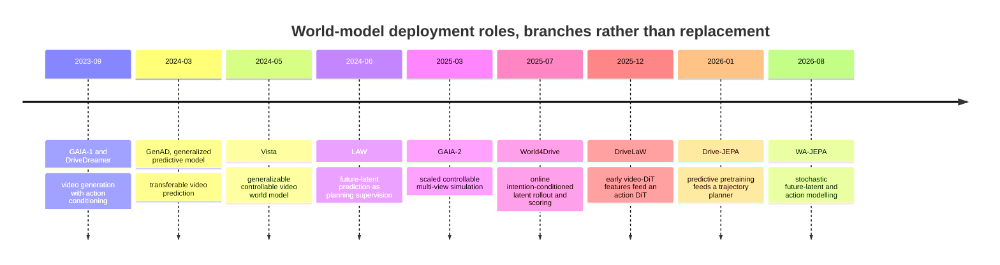

时间顺序不表示替代关系。读这条线的时候要盯的是：部署时留下的是 renderer、latent dynamics，还是只有一个经过 predictive
pretraining 的 encoder。顺带提醒一个同名陷阱：叫 GenAD 的论文有两篇，一篇是视频预测路线的 Generalized Predictive Model [51]，
另一篇是 instance-centric scene token 加轨迹 latent 分布的 Generative End-to-End Autonomous Driving [52]，后者不是前者删掉
pixel decoder 的后继。

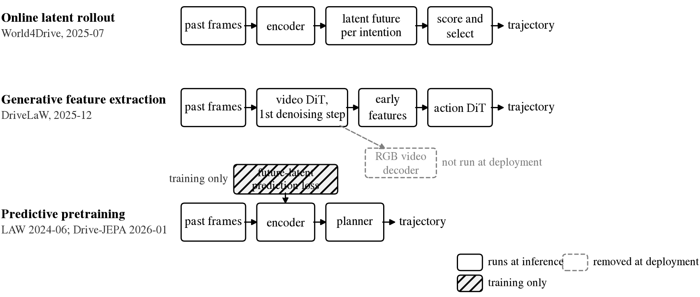

图 1 把三个位置画在一起。第一行是 World4Drive，部署时仍然对每个可能的意图做 latent rollout（在内部把未来推演几步），
再打分选择 [6]。第二行是 DriveLaW，它借用视频生成器第一个去噪步的中间特征喂给一个 action DiT，RGB 解码器根本不跑 [7]。
第三行是 LAW 和 Drive-JEPA，把「预测未来」写进训练目标，部署时只剩一个普通 encoder [5, 8]。三者都不输出像素，
但保留的在线计算完全不同，不能因为都「不画图」就归为同一种薄 decoder。

那这三条路各自有什么证据？最干净的几组消融列在下面。

| 实验 | 实际改变了什么 | 结果 | 能支持什么，不能支持什么 |
|---|---|---|---|
| LAW，Tables 4–5 [5] | 有 / 无 future-latent prediction 辅助任务 | NAVSIM PDMS **77.5 → 84.6**；CARLA Town05 Long DS 67.9±2.1 → 70.1±2.6 | 学习预测未来对规划有用；但这不是 RGB 与 latent 的等架构比较，CARLA 那组要连方差一起读 |
| DriveLaW，Table 6 [7] | planner 用视频生成器第 1 / 5 / 10 个去噪步的特征 | PDMS **89.1 / 86.9 / 23.2** | 该系统里更晚的生成状态没有帮助规划；不是「删掉所有生成计算」的证明 |
| DriveLaW，Appendix A.2 [7] | 部署时缓存第一次 Video DiT 的特征，不解码视频 | planner 用上述早期特征 | RGB 解码不是这条部署路径的必需品；但 Video DiT 和迭代式 Action DiT 都还在 |
| Drive-JEPA，Tables 5–6 [8] | 同一 planning framework，换 encoder 的预训练 | ImageNet ResNet-34 76.0、DINOv2 ViT-L 76.1、V-JEPA 2 ViT-L 86.1、driving JEPA 89.0 | 表示的训练目标很重要；同样不是把同一个 pixel planner 的 decoder 删掉后无损 |
| WA-JEPA v2，Table 4c [9] | 同一 joint architecture，无未来监督 / 直接回归 / flow matching | EPDMS **91.1 / 90.7 / 91.7** | 保留 stochastic 的未来 latent 生成可能胜过进一步简化；差距要结合训练方差判断 |

这张表里真正有信息量的是第二列。auxiliary-task 的增益、feature timestep 的选择、跨 backbone 的增益，
是三种不同的实验，都不能写成「去掉 pixel decoder 后性能提高」。PDMS（Predictive Driver Model Score）是 NAVSIM v1
的综合分，EPDMS 是 v2 的扩展版，两者不能混排。

DriveLaW 第 10 步那个 23.2 很吸引眼球，作者的解释是后期的细节不利于决策。但表格本身排除不了 conditioning 分布、
planner 的优化或者特征尺度不匹配这些更平淡的原因。它支持「早期生成状态足够、甚至更好」，还不足以识别「物理信息被视觉细节挤掉」
这个机制。另外，删掉 RGB 也不保证实时：DriveLaW v3 在 H20 上、1024×512 输入下的轨迹规划要 **0.71 s**，
大约 1.4 Hz [7]。而针对原问题最严格的版本，也就是「同一 backbone、同样训练预算、同一 action head、只去掉 RGB decoder、
在同一闭环 benchmark 上证明长尾能力不掉」，两轮检索都**没有找到**已发表的证据。

不监督像素之后到底监督什么，这一支内部也没有统一答案。LAW 和 Drive-JEPA 走的是 **future encoder target**：
预测一个冻结或 EMA encoder 在未来时刻的表示。这摆脱了像素重建的成本，但也继承了目标 encoder 的盲区：如果目标 encoder
对微小的横向速度不敏感，latent prediction loss 也不会自动要求保留它。World4Drive 走的是 **action conditioning**，
对多个意图分别预测未来再学习选择，并借助预训练的深度和语义模型给 latent 加物理结构，所谓「无需 perception annotation」
不等于「没有 perception supervision」[6]。OccWorld 一类的 occupancy 路线则显式预测空间占用，用一些开放语义的自由度换取
可检查的几何 [24]。最新的 WA-JEPA 甚至反过来指出，标准 video JEPA 的 mask 和确定性目标有 temporal collapse 的风险，
应该改成面向未来、带随机性的 latent 建模；它报告 NAVSIM v1 91.8 PDMS，并做了 HUGSIM 上的迁移 [9]。
也就是说 latent 路线内部还在争论「确定性压缩是否会压掉 motion」，并不是齐步走向一次 regression。

还有一个容易叫错名字的工作。NTR 用 scene token 去重建被 mask 掉的 foundation feature，部署时删掉重建头 [53]。
这是 representation reconstruction，不是 future dynamics world model，它回答不了「rollout 是否必要」。
但它和 Drive-JEPA 一起给出了同一种精确的范式：**world objective 只在训练期使用，部署只保留任务需要的计算。**
这比「删掉 world model」这个说法准确得多。

### VLA：少写轨迹，不等于少做推理

VLA 这边的历史更像四种输出接口的并存。2024 年初的 DriveVLM 把场景描述、分析和分层规划串成一条链，
还通过 DriveVLM-Dual 和传统 pipeline 结合 [10]；同年底 Waymo 的 EMMA 把多任务的输入输出全部放进一个统一的语言接口 [11]。
它们建立的是「通用预训练知识可以参与驾驶」这件事，没有证明长文本是动作的最佳通信格式。

2025 年之后发生的不是一次排序，而是三种压缩同时出现：不写 CoT（chain-of-thought，显式的推理文本）；
用离散的 action token 代替小数文本；从 hidden state 直接接一个连续的 planner。

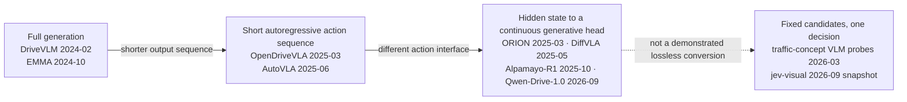

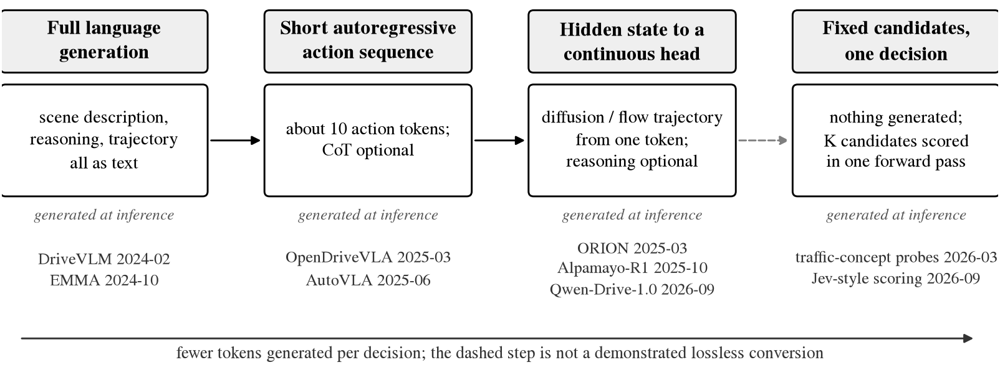

图 2 是同一张图的 PNG 版。箭头不表示引用、继承或性能支配关系。OpenDriveVLA 推理时不要求 CoT，但仍是自回归 [12]；
AutoVLA 把 5 s 的轨迹编成 10 个 physical action token，也仍是自回归 [13]。两者都不是这篇文章定义的非生成式薄 head。
ORION 把 reasoning space 里的一个 ego token 接进生成式 planner，默认用 VAE latent 和 GRU 轨迹解码器，
不是「输出一个 decision token 就完成驾驶」[14]。DiffVLA 和 DiffVLA++ 把 VLM 的引导和 diffusion planner 结合 [54, 55]。
这些工作说明语言和控制可以用不同的输出机制，而不是证明 planner 已经薄到一个线性层。

最新的结果也没有沿这条谱单向右移。NVIDIA 2026 年 8 月发布的 Alpamayo 2 Super 把一个 32B 的 reasoner 和一个 2B 的
diffusion action expert 组合在一起，支持轨迹、CoC、meta-action 等多种输出，显然不是 tiny head [18]。
Qwen-Drive-1.0 基于 Qwen3.5-4B 接一个 Planning Expert，官方说明明确写道 RL checkpoint 应该搭配 reasoning 一起用，
因为 RL rollout 的训练路径本身就是 reasoning-conditioned [16]。

---

## 「变薄」有四种，别混在一起

回到那个路口。系统可以先预测未来画面再选轨迹；可以在内部预测几个未来状态；也可以直接从当前表示读出「减速」。
输出越来越短，不代表内部做的事情相同。读这条线上的任何一篇论文，我建议第一步先问：**它删掉的是哪一行？**

| 改变的环节 | 具体少做了什么 | 不能顺便推出什么 |
|---|---|---|
| RGB decoding | 不把预测的未来还原成像素 | 不能说未来预测已经没用 |
| Textual trajectory | 不逐 token 写出一串坐标 | 不能说 reasoning 已经没用 |
| CoT | 不再生成显式推理文本 | 不能假定困难场景的能力不变 |
| Latent rollout | 不再显式推演中间的未来状态 | 不能假定行动后果的信息还在 |

某一行的成功消融，不是另三行也能删的证据。而中间两行最容易被混成一件事，恰好 Alpamayo-R1 在同一平台上把它们分开了 [15]。

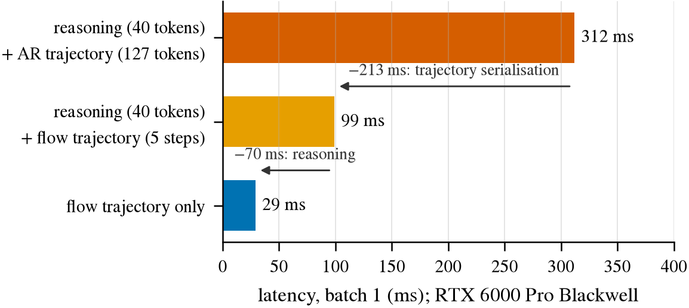

图 3 来自 Alpamayo-R1 的 Table 14：同一个模型、同一张 RTX 6000 Pro Blackwell，三种输出方式的延迟。保留 40 个 reasoning token、
只把轨迹从 127 个自回归 token 改成 5 步 flow，延迟从 312 ms 降到 99 ms；再去掉 reasoning 才到 29 ms。
换句话说，**轨迹的序列化方式才是大头，不必先删 reasoning 才能提速。** 但这张图只有速度。同一篇论文报告 reasoning 版本在
困难场景上的规划精度最多提升 12%、闭环的 close-encounter 率下降 35%，这些收益不能直接记到最快那条路径的账上；
close encounter 也不能改写成 collision rate。

AutoVLA 从另一个角度反对「CoT 无用论」：数据少的时候 reasoning 未必有益，数据多了以后带 CoT 训练的策略更好，
它的 RFT（reinforcement fine-tuning）学的正是何时可以省掉慢思考 [13]。这提醒我们把三件事分开：CoT 在训练中提供监督、
在推理时提供额外计算、只是生成一段可读的解释，三者的消融不能互换。顺便看它的速度：fast 模式平均 1.07 s，slow 模式 10.5 s，
只输出 10 个 action token 也不算快，而 CARLA 里的 2 Hz 设置不代表真实墙钟的 2 Hz。

把文献里能核实到的延迟并排放在一起，会发现最薄的那一档其实是空的。

| 输出路线 | 可核实的延迟 | 硬件与口径 | 怎么读 |
|---|---|---|---|
| AR physical action tokens，AutoVLA [13] | fast 1.072 s；slow 10.518 s | Table 2 未绑定推理设备 | 输出只有 10 个 token 仍然慢 |
| AR textual trajectory，Alpamayo-R1 [15] | 312 ms | RTX 6000 Pro Blackwell，含 40 reasoning token | 127 个轨迹 token 是主要成本 |
| reasoning + flow，Alpamayo-R1 [15] | 99 ms | 同上，5 flow steps | 不消灭 CoT 也能大幅降低解码成本 |
| trajectory-only flow，Alpamayo-R1 [15] | 29 ms | 同上，无 reasoning | 有力的速度 baseline，但不能继承 reasoning 版本的长尾结果 |
| linear / MLP on frozen latent | **没有找到**同输入同硬件的完整驾驶延迟 | 只测 head 的微秒数会漏掉 encoder 和 prefill | 这一格是空的 |
| Jev-like shared scoring，jev-visual [17] | 64 个问题：独立 37.30 s → 共享 2.40 s | M4 / 16 GB，Qwen3.5-0.8B 4-bit | 批均摊的 workload，不是 2.40/64 秒一次的连续控制 |
| typed parallel read，openjev [20] | 并发 1：p50 94 ms；并发 64：p95 1109 ms | RTX PRO 6000 Blackwell，每请求 3 个问题 | 非驾驶 benchmark，吞吐不是控制频率 |

Hz 只是单次时间的倒数，不是部署保证。不同相机数、帧数、精度、batch 的结果不能直接排名。

### 这篇文章说的「薄」是什么

我沿用报告里的定义：**thin decoder** 指在一个大的、冻结或轻微适配的 backbone 之上，用一个小的、非自回归的输出 head。
小 MLP、线性层、在固定候选上打分都算；「输出 token 少」或者「用了 diffusion」本身不保证 head 很薄。按这个定义，
上面那张流程图里只有最右一列是 thin decoder，第三列的 flow head 要看迭代几步、有多大。

### Jev：把问题改成选择题，解决了哪一半

这个词最近很热，值得单独说清楚。2026 年 9 月 15 日 TypeSafe 发布了 Jev，公告里描述为一种专有架构，核心是 parallel sampler
和一种叫 RLCD 的训练方法 [19]。它不是驾驶论文，也不能据此追认过去所有的 next-token classifier 都来自 Jev。

社区很快出现复现。hr98w/jev-visual 实现了 shared multimodal prefill（多个问题共享一次图像编码和前缀计算），
然后 fork cache，对每个候选答案打分；作者明确声明没有复现专有的训练和 calibration [17]。它的 Breakout demo 很有教育意义：
直接反复让模型选 left / right 并不可靠，简化成「画面分五个区域，模型判断球在哪个区」再交给规则控制才能玩。没有驾驶数据，
也没有安全评估。另一个叫 openjev 的仓库反而用 DiffusionGemma 的 masked canvas 做并行去噪读出，根本不是同一种 next-token 实现；
「Jev-compatible API」不等于相同的计算机制 [20]。至于 Hugging Face 上那个 reproductions tracker 的讨论页，报告没能可靠读到，
所以不引它的复现数目。

对驾驶来说，Jev 风格的接口意味着：不让模型自由写答案，而是提前给几个候选，直接读它更支持哪一个。比如在同一段画面历史上，
对 brake / keep / accelerate 打分。这个例子只说明接口，不表示三个动作足以覆盖真实驾驶。这里有几个必须预先写下的陷阱。
候选内部的 softmax 是**给定选项内的相对概率**，不是行动安全概率：如果正确选项根本不在候选里，模型仍然可以非常确信其中一个。
候选的措辞、顺序、单 token 还是多 token 都会影响分数。left / straight / right 还把 route intention、lane choice
和 immediate control 混在了一起。三选一无效的时候需要一个 abstention 或 fallback，而不是强迫输出一个格式正确的错误动作。
一个从不出格式错误、却持续选错动作的分类器，只解决了接口问题。公开的、受控的 Jev 风格驾驶复现（accuracy、calibration、闭环），
截止本文**没有找到**，这和「已经有人实现了 shared-prefix scoring」完全兼容。

---

## head 到底看到了什么：前端表示

head 薄了以后，差别就全在前端。两个系统用同样的分类器，也可能看到不同的分辨率、历史窗口和 token。
文献里最有说服力的证据，是**同一个 planner 下换前端**的实验。

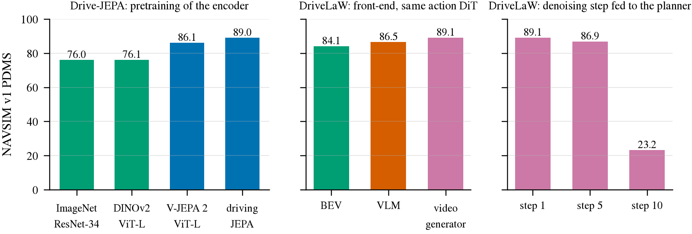

图 4 收了三组这样的消融，全部是 NAVSIM v1 PDMS。左边是 Drive-JEPA 在同一个 planning framework 下换 encoder 的预训练：
ImageNet 和 DINOv2 几乎一样，V-JEPA 2 高出 10 分，针对驾驶再预训练的 JEPA 最好 [8]。中间是 DriveLaW 同一个 Action DiT 下的
BEV、VLM、视频生成器三种前端 [7]。右边是 DriveLaW 用视频生成器第几步的特征喂 planner [7]。三组都不是等规模、等数据的受控比较，
但方向一致：**前端的训练目标比架构名字更重要，而越晚的生成状态越不适合做决策。**

| 前端 | 已有证据支持什么，没证明什么 | layer、pooling、prompt 与 runtime | 最接近的 same-head 比较 |
|---|---|---|---|
| Frozen VLM latents | presence、count 等概念可读；orientation 更依赖空间布局；生成答错不等于信息不存在 [21] | encoder token、region pooling、LLM visual token、最后一个 prompt token 不能互换；进 LLM 就要付 prefill 成本 | FROST-Drive 冻结 VLM 的 **vision encoder** 接 planner，和 ImageNet ViT 比 [22]；不是 frozen LLM hidden-state 实验 |
| 自监督视频 / 单帧特征 | V-JEPA 2 面向视频预测，DINOv2 / v3 面向静态稠密特征 [25, 26]；静态特征强不等于同一 head 下对未来速度有优势 | 帧级 encoder 可缓存；视频 encoder 要说清窗口长度；把所有帧平均会抹掉时间顺序，这是 readout 的问题不是 encoder 的问题 | Drive-JEPA 里同一 framework 下的 DINOv2 与 V-JEPA 2 对照最接近，仍混合了 objective、data 和 architecture 的差异 |
| BEV / occupancy | 显式位置和占用便于几何推理；不自带开放语义和交规知识 [24] | 成本要算上相机编码、视角变换、融合和时序更新，不能只报最终 BEV head | DriveLaW 同一 Action DiT 下 BEV / VLM / VGM 为 84.1 / 86.5 / 89.1 [7]；容量和预训练不匹配 |
| 离散 scene token | DrivingGPT 把量化的图像 token 和动作 token 联合建模；重建质量不等于对动力学的充分性 [27] | tokenizer 的压缩率、空间分辨率和序列长度决定代价；它下游的自回归模型不是天然的薄 readout | 四类前端接同一个 frozen linear head 的完整对照，**没有找到** |

还有一个细节值得提醒：三种东西都叫 token，却不是同一种表示瓶颈。AutoVLA 的 action codebook 编码的是动作 [13]，
DrivingGPT 的 image tokenizer 编码的是场景 [27]，NTR 的连续 register token 学的是重建特征 [53]。
「scene token 已经有效」不能作为「离散 action head 足够」的证据。

在所有对照里，最容易漏掉的 baseline 是 **VLM 自己的 vision encoder**。如果只比 VLM 和 DINOv2，胜负可能来自视觉预训练、
分辨率或参数量，而不是 LLM 贡献了什么；反过来 DINOv2 比 LLM 末层强，也可能只是一个保留了 patch grid、另一个被全局平均，
比的是信息接口而不是模型能力。FROST-Drive 在这一点上给了一个有意思的数据：同样的 adapter 加 GRU head，冻结的 ImageNet ViT
在它自定义的 val 口径上 RFS 7.39，换成冻结的 VLM vision encoder 是 8.17，它的 LLM 部分根本没参与 [22]。
另一篇 2026 年 5 月的工作直接比较了 frozen 的 Qwen / InternVL 和 Wan 这样的视频生成模型，在 ScanNet 和 DL3DV 上测语义、
几何和相机运动：VLM 偏强于语义，视频生成模型偏强于几何和相机运动 [28]。文献里没有一个前端被宣布为薄 head 的统一最优底座；
一个严格控制接口的比较，比多加几个模型名字更有研究价值。

---

## 探针能说什么，不能说什么

**Linear probe**（线性探针）是一种测量：冻结主模型，只在它某一层的表示上训练一个线性分类器，看某个量是否容易被读出来。
它便宜、可解释，是「表示里有没有 X」这类问题的标准工具。这一节讲探针文献告诉了我们什么，以及它们留下了什么。
两轮报告里都把这一节叫「adversarial novelty check」，因为它的任务就是找出哪些看起来是空白的地方其实已经有人站着。

### 离驾驶最近的七个先例

| 先例 | 已经做了什么 | 和「frozen VLM 里的驾驶动力学」还差什么 |
|---|---|---|
| **A**. Probing Visual Concepts in Lightweight VLMs for Automated Driving [21]，2026-03，v2 2026-08 | CARLA 反事实图像上测 presence、count、spatial relation、orientation；对 vision encoder、projector、LLM 逐层训练线性探针，模型含 Qwen3-VL-2B；比较生成、constrained output 和探针；做 activation steering；小规模 nuScenes 迁移 | 已覆盖架构、逐层测量和输出模式比较。剩下的实质差别是**时间证据、未来动力学和行动后果**，不是从 2B 换到 4B |
| **B**. Hidden in plain sight [29]，2025-06 | 用共享 vision backbone 的受控 VLM，在 CV-Bench、SPair-71k、BLINK 上比较视觉与 LLM 表示；多数视觉信息在后续组件里仍可读；某些 DINOv2-backed 模型的 affordance / style 在末层明显下降 | 建立了「生成失败可以是 readout failure 而不是表示被毁」；没测 ego 未来动作或交通历史里的 metric dynamics |
| **C**. Linear Mechanisms for Spatiotemporal Reasoning in VLMs [30]，2026-01 | COCO、Objaverse 合成视频、MVBench 上测空间与时序身份；用 activation patching 定位因果路径，信息可从早期 visual token 转移到后续 text token | 把「只看 visual token 会误判信息流失」这个威胁具体化；未证明数值 motion 沿同一路径迁移 |
| **D**. Which Pretraining Paradigm Better Serves Spatial Intelligence [28]，2026-05 | frozen VLM 与视频生成模型接相近的轻量 readout，测语义、几何、相机运动 | 已覆盖「厚表示里的物理信息加相近 head 对照」；不是线性驾驶探针，也没把 logged future decision 当 target |
| **E**. Anchor-Align [31]，2026-07 | 机器人 VLA 适配中逐层读出动作，用 representation similarity 追踪冻结原模型与适配模型的差异；action readout 峰值在第 22 层，R² 0.60，对应 CKA 0.91 | 研究的是经过 action 适配的策略；「未经驾驶适配的 VLM 能否从纯历史视觉读出超越 ego-state 的未来信息」是不同问题，但要实际测出来 |
| **F**. Probing a VLA for Symbolic States [32]，2025-02 | 对 OpenVLA 多个 LLM 层做线性探针，在 LIBERO 里读 object / relation / action 符号状态；结果并不呈现简单的「早层物体、晚层动作」分界 | backbone 是经过 action 适配的 OpenVLA，任务是符号状态 |
| **G**. FROST-Drive [22]，2026-01 | 冻结 VLM 的 vision encoder，接 temporal / query adapter 和 GRU 轨迹头，在 Waymo E2E 上比 ImageNet ViT 与 VLM encoder | 已覆盖 frozen pretrained vision 接驾驶 head 的主要部署论点；未调用完整的 LLM hidden state |

看完这七行，几种表述应该直接从任何 novelty 声明里删掉：「首次探索驾驶 VLM 的逐层物理信息」「首次发现晚层空间能力下降」
「首次证明可读信息不等于输出能力」「首次用 activation steering 验证 VLM 中的交通概念」。第一篇 driving prior 已经有了
constrained output 和因果干预，加上 Jev 这个新名字、换一个模型尺寸，重新创造不了这些贡献。但反过来也不该夸大先例：
两轮检索都**没有找到**同一个 frozen VLM 在真实驾驶历史上、同时做 ego-conditioned 未来动力学、完整的 token 位置逐层曲线、
匹配监督的三种用法比较以及 action 层面因果验证的公开工作。这是明确限定的「未找到」，不是保证不存在。

### 曲线下降，还不能叫「信息丢失」

假设我们发现探针在早层比晚层准。直觉上这像是模型越接近语言输出，越不懂物理。但同一个观察至少有四种解释，
而文献给每一种都提供了例子。

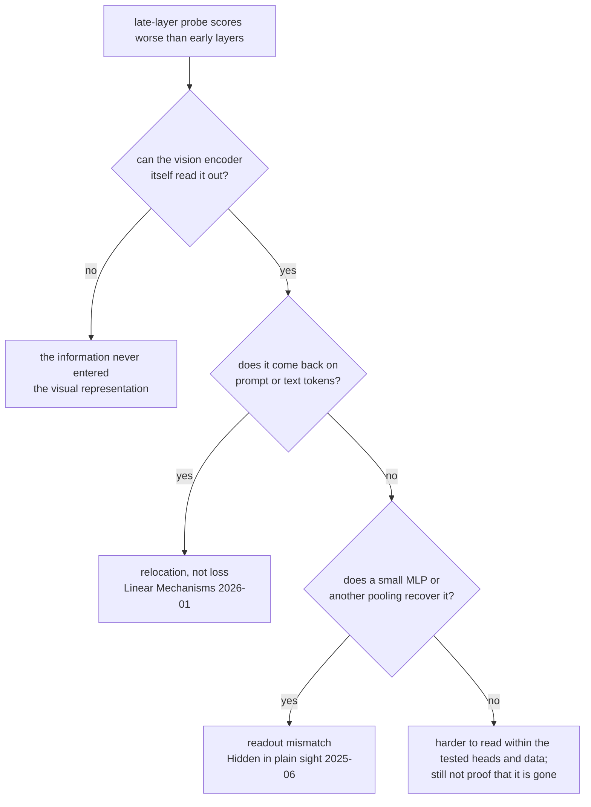

第一种，信息从来没有进入 vision representation，末层当然读不出，所以要先查 encoder 层。第二种，信息进入之后在后续计算中
变得不再能被简单 head 提取，驾驶探针里部分 orientation 的下降是例子 [21]。第三种，信息从 image token 转移到了 text 或
prompt token，原来的 pooling 没有跟上，这是 Linear Mechanisms 展示的路径 [30]。第四种，信息一直在，只是线性读不出，
换个 pooling 或小 MLP 就能恢复，这是 Hidden in plain sight 的核心发现 [29]。这四种机制可能产生几乎相同的一条下降曲线，
却指向完全不同的改进：换读取位置、换 readout、还是重训 backbone。只画曲线区分不了它们。

还要把「晚层导致变化」和「language alignment 导致变化」分开。前者是当前模型内部的定位，后者是关于训练目标的因果主张。
即便每个后层的探针都更差，也可能来自 token merge、attention routing、有限维度投影或任务条件化，而不是 alignment 训练本身。
要证明训练原因，需要 alignment 前后的 checkpoint 或匹配初始化与数据的消融；拿同一家族两个尺寸比，不能替代这项控制。
Qwen3-VL 还有一个实现细节会让「encoder 到 LLM 是一次单向压缩」这个想象失效：它的 DeepStack 会在若干 LLM 层再次注入
vision feature，所以逐层曲线要记录注入前后 [21]。

### 适配会不会把知识擦掉

这条线还有一个相邻问题：如果不冻结、而是用 driving 数据去微调 VLM，原来的知识还在吗？先拆开常见的「LoRA、full
fine-tuning、SFT、RL、distillation 四选一」：LoRA 和 full fine-tuning 决定哪些参数能变，SFT 和 RL 决定优化目标，
distillation 决定把能力交给谁。它们不是互斥的，AutoVLA 的 RFT 本身就用 LoRA [13]。

机器人领域的 Anchor-Align 给了最直接的遗忘测量：单纯用行为克隆去适配一个 VLA，它在 GQA 上的通用问答准确率在一万步内
相对下降约 94%；加上表示锚定后保留约原水平的 70%，注意是相对保留，不是 70% 的绝对准确率 [31]。同一篇还测了 hidden-state
similarity、action readability 和 LIBERO-PRO 上的 OOD 表现，显示「参数是否更新、表示是否稳定、动作是否可读」并不是同一个量。
驾驶域里 Qwen-Drive-1.0 给了不完全但直接的数字：混合通用数据做 SFT 后，MMMU 从 73.4 到 72.7，MMBench 从 87.1 到 85.5 [16]，
支持「混合训练保留了大部分被测的通用能力」，不支持「所有 world knowledge 不变」，也不自动覆盖它的 RL checkpoint。
顺便说一句，LoRA 的低秩只是限制了更新的参数化形式，不是输出行为变化的上界；小幅改动关键的 attention 或 projection
仍可能大幅改变某类任务。

RL 比 SFT 多买到了什么？已经有实质的增益，不只是「解释更像人」。AutoVLA 在 NAVSIM 上的单候选 PDMS 从 SFT 的 80.54 到
RFT 的 89.11，它的 best-of-six 92.12 是候选覆盖的上界，不能和可部署的单候选混写 [13]。Qwen-Drive 的 SFT → RL 在 NAVSIM
是 88.2 → 90.7，Waymo RFS 7.78 → 7.91，但 5 s ADE 从 2.65 到 2.67，并非所有指标都改善 [16]。这类结果表明 RL 能把策略
推向 reward 偏好的轨迹集合，不等于证明它新增了物理知识；当训练 reward 和评估指标很接近时，先该问的是它改进了候选排序、
动作分布、reasoning，还是减少了某种显眼的违规。distillation 支持的是另一种部署分工：VLM-AD 用 VLM 监督训练一个小的驾驶策略，
部署时不需要原来的 VLM，VAD-Base 在 CARLA Town05 Long 的 DS 从 30.31 到 35.25 [33]。它回答「昂贵 teacher 的监督能否留下
任务收益」，没有回答「student 是否继承了 teacher 未被标签触及的开放世界知识」。同一个驾驶 VLM 上匹配数据和预算的四路比较，
并同时报告通用能力保留、逐层动力学和闭环 OOD 的完整实验，**没有找到**。

### 一个所有 open-loop 研究都绕不开的捷径

nuScenes 上有一篇 2023 年底的论文，标题就是问题：**Is Ego Status All You Need for Open-Loop End-to-End Autonomous Driving?** [34]
它展示只用车辆自身状态（速度、加速度、yaw rate），不看任何画面，在 open-loop（离线、不执行、只比对记录轨迹）指标上就有竞争力。
原因很朴素：未来两三秒的行为大部分由当前运动状态决定，车正在左转，两秒后大概率还在左转。

这篇论文动摇的不是「nuScenes 分数太高」，而是从 open-loop accuracy 推到场景理解的逻辑。对这篇文章的主题它是最重要的
方法论提醒：**任何「视觉表示里有驾驶智能」的主张，都必须先和一个只用自身状态的 baseline 比，增量才算视觉的功劳。**
这也是为什么 Waymo 榜单上至今没有一行官方口径的 ego-only 结果，会成为一个值得注意的空白，后面会讲到。

---

## 从「有没有」到「开得怎样」：轨迹词表

探针回答「有没有」，但自动驾驶社区认的是榜单。把「读出一个类别」升级成「输出一条轨迹」，同时保持 head 很薄，
最成熟的做法是 **trajectory vocabulary**（轨迹词表）。

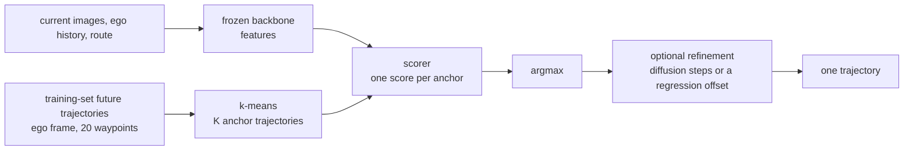

做法是：在训练集的所有未来轨迹上做 k-means 聚类，得到 K 条代表性轨迹作为候选，模型不再回归坐标，而是给 K 个候选打分，
选最高的一条输出。这样输出层就是一个 K 类分类器，可以做得很薄，而且分类器天然给出一个分布，方便做 calibration 和多模态。
代价是词表覆盖不到的轨迹永远输出不了，所以 planner 的误差可以拆成两块：**coverage error**，也就是词表里离真值最近的那条
（oracle）还差多少；**ranking error**，也就是 scorer 没选到最好的那条又差多少。很多方法会在选中的候选上再做一步小幅修正，
WoTE 的匹配消融显示 K=256 时修正把 PDMS 从 84.0 提到 85.6 [39]。

| 方法 | K，怎么建 | scorer 的监督 | 修正 | 结果 |
|---|---|---|---|---|
| Hydra-MDP [35]，2024-06 | **4096 / 8192**，训练轨迹 k-means，ego-local | 到 imitation 目标的距离 + 仿真子分数蒸馏 | 无 | NAVSIM v1 PDMS 82.6 → 83.0 |
| Hydra-MDP++ [36]，2025-03 | 8192 | 更多 rule-based 子分数 | 无 | 91.0 PDMS |
| DiffusionDrive [37]，2024-11 | **20 个 anchor** + 噪声 | anchor 分类 BCE + 最佳模式回归 / 去噪 | 2 步截断扩散 | 88.1 PDMS；4090 上 45 FPS |
| GoalFlow [38]，2025-03 | 4096 / 8192 个**终点**，不是完整轨迹 | 终点距离和可驾驶区域 | goal-conditioned flow | 90.3（5 步）/ 88.9（1 步） |
| WoTE [39]，2025-04 | **256**，训练 expert 轨迹 k-means | winner-take-all 回归 + world model 奖励 | 先修正后打分 | 88.3 PDMS；L20 上 18.7 ms |
| GTRS [40]，2025-06 | 训练 16384，推理 8192 + 动态候选 | 子分数监督 + vocabulary dropout | 含动态轨迹 | navhard 49.4 EPDMS（挑战赛 ensemble） |
| ZTRS [41]，2025-10 | 8192 / 16384 固定轨迹 | 子分数 BCE + Exhaustive Policy Optimization | 无连续生成 | navhard 45.5 EPDMS |
| Auto-JEPA [42]，2026-07 | 从训练轨迹记忆里检索 **top-300** | latent 检索 + rule score | 不生成新轨迹 | v1 91.3 PDMS；v2 navtest 89.1 EPDMS |

「完整轨迹词表」「终点词表」「扩散初始化用的 anchor」不是同一种 K，同一列里的分数可以比，跨列的绝对值不能。
navhard 是 NAVSIM v2 的困难子集，分数量级和 navtest 完全不同。

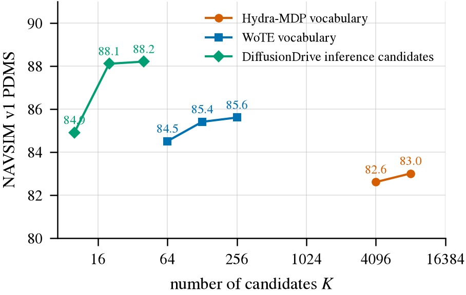

图 7 是文献里公开的 K 扫描。三条线是三个不同的系统，只能在一条线内部比。共同的形状是：K 翻倍带来的增益在几百之后就很小了，
DiffusionDrive 从 20 到 40 个推理候选只涨 0.1 分 [35, 37, 39]。词表大小不是主要瓶颈，**scorer 能不能选对**才是。
另外 Waymo 那种 5 s、20 个点、长尾场景的设定下，最优的 K 和 normalization 没有任何论文公开过；NAVSIM 上的经验能不能搬过去，
要自己扫。

回到这篇文章的主题：如果前端是一个冻结的 foundation model，后面接词表 scorer，有没有人做过？有，而且近三个月很密。

| 近邻 | 冻结的是什么，head 是什么 | 公开结果 | 和「冻结 VLM + 一次词表打分」的距离 |
|---|---|---|---|
| FROST-Drive [22]，2026-01 | 冻结 InternVL3 的 vision encoder；adapter + GRU 回归 | Waymo test RFS **7.856** | 不用 LLM hidden state，但系统定位最近 |
| Qwen-Drive-1.0 的一组消融 [16]，2026-09 | **未做 driving 适配**的 Qwen3.5-4B；训练一个 KV-conditioned 的 flow Planning Expert | Waymo **val** RFS 7.88 | frozen LLM feature 接 planner 已有直接结果；不是一次性的固定词表分类 |
| DiffAdapterVLA [43]，2026-09 | 冻结已适配的 Cosmos-Reason2-8B；在 LLM 内部插入可训练的 DiffAdapter | NAVSIM v1 88.3 → 90.3；**3.05%** 可训练参数 | 中间 LLM 层 + 冻结权重 + 参数效率已有；不是完全静态可缓存的特征 |
| Auto-JEPA [42]，2026-07 | 冻结 V-JEPA 2；predictor + 检索式 scorer | v1 91.3 PDMS；训练用 1–2×A100 80 GB | 冻结表示 + 轨迹记忆已有；不是 VLM，head 也不薄 |
| VL-DPO [44]，2026-05 | 冻结 Gemini 2.5 Pro 给 12 条渲染出来的候选打分，再用 DPO 训练 planner | 自定义 Waymo val 7.2279 → 7.2970 | VLM 评分候选已有；是离线 teacher，还用了额外信息 |
| OpenEMMA / LightEMMA 的 Waymo 复现 [45] | zero-shot VLM 直接输出轨迹 | Waymo test RFS **5.158 / 6.517** | training-free 的近邻，分数远低于任何训练过的方法 |

结论是 partially done。「first frozen-VLM planner」这句话已经不能说了；「一次固定词表分类、完全静态可缓存的中间层特征、
同 backbone 的分类 vs 回归对照、严格的视觉增益、真实单卡的端到端 Pareto」这个**组合**层面还有空间，但只换模型版本或换一层不够。

---

## 赛场：Waymo E2E 榜单长什么样，有多挤

### 数据和协议

Waymo Open Dataset for End-to-End Driving（WOD-E2E）是 2025 年 10 月放出来的，专门挑长尾场景：官方描述这些场景在日常驾驶中
出现的频率低于 0.03%，比如施工区、异常车辆、行人突然出现。数据集论文进了 CVPR 2026 [46]。

| 项目 | 官方口径 |
|---|---|
| 规模 | **4021** 个 20 s 片段，约 12 小时：train 2037 / val 479 / test 1505。官网总览页写的「约 5000 个 segment」是另一个统计口径 |
| 格式 | TFRecord，`E2EDFrame` protobuf，JPEG 直接嵌在里面，不是 Perception 数据集的 parquet |
| 相机 | 8 个环视相机 |
| ego 历史 | 过去 (−4 s, 0]，4 Hz，16 个状态：XYZ 位置、XY 速度和加速度 |
| 图像历史 | 当前帧加片段内的过去帧，窗口自己选 |
| route | intent 四选一：straight、left、right、unknown |
| 输出 | 未来 (0, 5] 的 20 个 XY waypoint，4 Hz，第一个点在 t+0.25 s，车辆后轴坐标系，x 向前 y 向左 |
| test | 前 12 s 可见，后 8 s 隐藏；只交一条最终轨迹，不交 K 条和置信度 |
| 主指标 | **RFS**（Rater Feedback Score）：预测轨迹和几条人工评过分的参考轨迹比，离所有参考都远时分数向下限衰减；在 3 s、5 s 和 11 类场景上聚合 |
| 次指标 | ADE@5 s：对着评分最高的那条参考轨迹算的平均位移误差 |
| 提交 | 每 30 天 6 次，出错的提交不计；提交里要填 `uses_public_model_pretraining`、`public_model_names`、`num_model_parameters` |
| 2026 年 | **不举办**正式 challenge，榜单保持开放 |

以上来自官方 challenge 页面、tutorial 和 proto 定义，2026-09 核对 [47]。

RFS 的设计动机值得一说。传统的 ADE 只问「像不像记录里那唯一一条轨迹」，可是长尾场景往往有好几种合理的做法，
比如前方有施工，靠左绕和停车等待都可能对。让人来给几条轨迹打分，再看模型选的那条离高分轨迹多近，比单纯对着日志算距离
更接近「开得好不好」。代价是它仍然是 open-loop 的代理指标：不是在线人工评价每次提交，也不是执行后的碰撞率；
向下限衰减的机制也意味着离参考轨迹的分数不能解释为真实风险的概率。

### 榜单

下面是所有能核实到日期和出处的 official-test 记录。这不是实时抓取的动态榜单，而是从论文和后续论文的对比表里拼出来的。

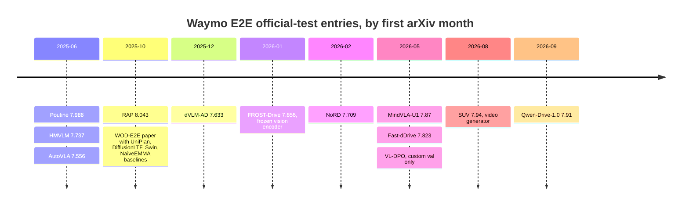

| 方法 | Backbone 与更新方式 | Head；主要输入 | **RFS** | **ADE@5s (m)** | 出处 |
|---|---|---|---:|---:|---|
| RAP | DINOv3-H+，全模型约 0.88B，Waymo 阶段解冻 | 多候选回归 + 打分；多相机、4 s ego、route | **8.043** | **2.646** | 2510.04333，2025-10 |
| Poutine | Qwen2.5-VL-3B；SFT + GRPO | 自回归坐标；前 3 相机、4 s ego，推理时去掉 route | 7.986 | 2.742 | 2506.11234，2025-06 |
| SUV ★ | Wan2.2-5B 视频生成器 + action expert，联合训练 | 视频 + flow action；仅前视 | 7.94 | 2.90 | 2608.03084，2026-08 |
| Qwen-Drive-1.0 ★ | Qwen3.5-4B；先 driving 适配，再冻结训 Planning Expert | flow Planning Expert；前 3 相机 × 4 时刻 | 7.78 → 7.91 | 2.65 → 2.67 | 2609.00111，2026-09 |
| Poutine-Base | 同 Poutine，无 RL | 同上 | 7.909 | 2.940 | 2506.11234 |
| MindVLA-U1 | Qwen3-VL-2B；vision 冻结，LLM 和 merger 更新 | flow action + 语言 | 7.77 → 7.87 | 2.67 → 2.66 | 2605.12624，2026-05 |
| **FROST-Drive** | InternVL3 **vision encoder 冻结**，test 规格未公开 | adapter + GRU；5 相机 | 7.856 | 3.565 | 2601.03460，2026-01 |
| ViT-Adapter-GRU | ViT；冻结边界未公开 | adapter + GRU | 7.849 | 2.889 | FROST Table 6 |
| Fast-dDrive | Qwen2.5-VL-3B；更新 backbone | block discrete diffusion | 7.823；多样本 7.827 | 2.907；2.821 | 2605.23163，2026-05 |
| UniPlan | DiffusionDrive 约 60M；SFT | anchor-conditioned diffusion | 7.780 | 2.842 | FROST Table 6 |
| HMVLM | Qwen2.5-VL-3B；全量训练 | 自回归 + 平滑；5 相机 | 7.737 | 3.072 | 2506.05883，2025-06 |
| DiffusionLTF | DiffusionDrive 约 60M | anchor-conditioned diffusion | 7.717 | 2.977 | 2510.26125，2025-10 |
| NoRD | Qwen2.5-VL-3B；全量训练 | 自回归 action，无 reasoning | 7.709 | 未报 | 2602.21172，2026-02 |
| dVLM-AD | LLaDA-8B + SigLIP2；SFT | discrete diffusion | 7.633 | 3.022 | 2512.04459，2025-12 |
| AutoVLA | Qwen2.5-VL-3B；SFT，RFT 用 LoRA | 自回归 action token；前 3 相机 × 4 时刻 | 7.556 | 2.958 | 2506.13757 |
| Swin-Trajectory | Swin 约 36M | MLP 回归；前 3 相机 | 7.543 | 2.814 | 2510.26125 |
| NaiveEMMA | 官方 baseline，参数口径有冲突 | 自回归；8 相机 | 7.528 | 3.018 | 2510.26125 |

★ 为近三个月。箭头表示同一论文报告的两个版本，Qwen-Drive 是 SFT → RL。FROST-Drive 的作者说明其提交因双盲隐藏于公开榜单。
UniPlan 在两份记录里数字不同，这里用较晚的 FROST 榜单快照，不把两份记录拼成一行。

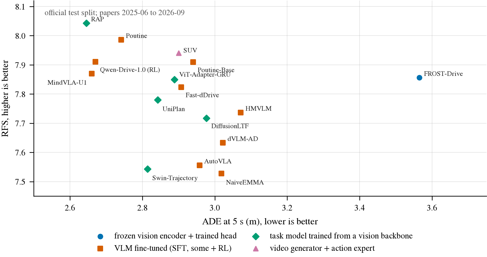

图 5 把这张表画成散点，按 backbone 的使用方式着色，左上角好。看这张图，我最先注意到的是它有多「扁」：整个榜单的 RFS 压在
7.5 到 8.05 之间，除 FROST-Drive 外 ADE 压在 2.65 到 3.1 之间。**唯一一个完全冻结视觉的系统 FROST-Drive，RFS 挤进了微调 VLM 的中游，
ADE 却是全场最差**，说明它选对了大方向但轨迹细节粗。把 backbone 全解冻的小模型 RAP 排第一。视频生成器路线的 SUV 只用一个前视相机
也拿到 7.94。而 FROST 和榜首的差距，用可核实的公开 test 数字算是 8.043 减 7.856，等于 0.187；它论文里那个 8.17 是自定义 val 口径，
不能拿来相减。

几个榜单外的参照点。zero-shot 直接让 VLM 写轨迹，RFS 只有 5.2 到 6.5，比任何训练过的方法都低两个档次 [45]。一份社区报告用只看
ego 状态和 route 的 MLP ensemble 在自定义 val 上拿到 7.41，但它用了同一 val 集的其他时刻来训练，不是独立的 train → val 对照 [48]。
所以**官方 test 上没有任何一行 constant-velocity、constant-turn-rate、ego-history-only 或 route-only 的 baseline**，nuScenes 上那篇
ego-status 论文的结论在 Waymo 上也没人严格复制过。从探针那一节的角度看，这是榜单上最值得先填的一格。

相机用几个也没有因果答案。SUV 只用前视拿 7.94，Poutine 前 3 相机 7.986，FROST 5 相机 7.856，NaiveEMMA 8 相机 7.528，
但这四行是四个不同的系统，推不出「相机越多越好」或反过来。

### 榜首的代价

| 方法 | 公开的训练配置 |
|---|---|
| RAP | 前期预训练 **4×H100 × 80 h**，不含 Waymo 阶段 |
| Poutine | **4×A100**；预训练 24 h + Waymo 10 h + RL 12 h；另有大模型标注成本 |
| MindVLA-U1 | **8×H200 × 7 h**，50 epochs |
| Fast-dDrive | **8×H100**，3 epochs |
| HMVLM | **8×A100**，3000 iterations |
| NoRD | SFT **16×A100**；Waymo RL **32×A100** |
| AutoVLA | SFT **8×L40S**，5 epochs；另有 RFT |
| FROST-Drive、Qwen-Drive-1.0 | 完整 GPU-hours 未公开 |

榜单前列的配方大多包含多数据集预训练、全量 VLM 训练、RL、大模型标注和 ensemble。RAP 和 Poutine 不是「比一个薄 head 大一点」，
是另一个量级的工程。

### 有多挤

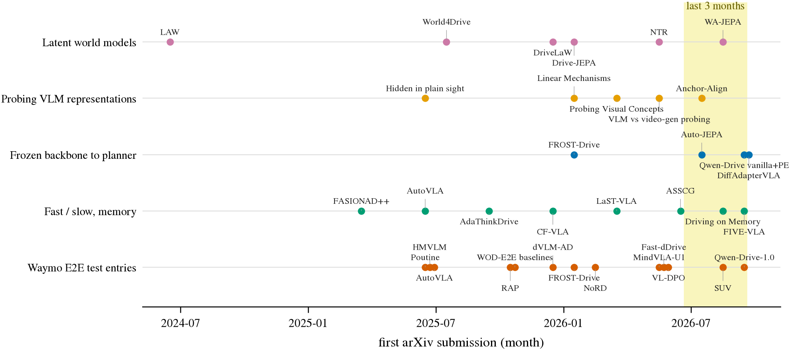

图 6 把这篇文章引用的论文按主题排在时间轴上，横轴是 arXiv 首次提交的月份，黄色带是最近三个月。五条线里有四条在带子里有新点：
frozen backbone 接 planner 这一行的四个点里三个在带子里，fast / slow 与 memory 这一行最近三个月来了三篇。这条线不是没人做，
而是**同时有很多人在做**，而且都在往同一个方向收。后面两节分别讲图里的最后两行。

### 第二个赛场：NAVSIM

自动驾驶社区更认的规划评测是 NAVSIM [23, 59]。它建在 OpenScene 的多相机数据上，2 Hz，评估时把候选轨迹放进一个 non-reactive 的仿真里
打 PDMS 或 EPDMS。第二个赛场对薄 head 路线的意义是：Waymo 的 RFS 只有 open-loop 的代理性质，NAVSIM 至少能检验「选出来的轨迹
能不能安全推进」。但它的体量不小。

| split | 大小 | 说明 |
|---|---|---|
| navtrain | sensors **445 GB** 含历史，300 GB 不含；logs 14 GB | 全包放不进一块普通数据盘 |
| navtest | sensors **223 GB**；logs 983 MB | 和完整 navtrain 无法同时保留 |
| navhard_two_stage | sensors **31 GB**；logs 892 MB | v2 的困难子集，可以保留 |

版本要固定：v1 的 PDMS 和 v2 的 EPDMS 不可互换，同名的 EPDMS 还有实现版本之别，WA-JEPA v2 就把旧口径的 EPDMS\* 和修正
human-reference penalty 聚合方式之后的 EPDMS 分开列，主结果分别是 88.0 和 91.7 [9]。Driving on Memory 那篇还给 NAVSIM
敲了一记警钟，下一节讲。

---

## 快与慢：什么时候需要多想一点

有一个很自然的直觉：人开车大部分时间不需要认真思考，只在少数时刻需要。翻译成系统设计就是「大多数时候走一条便宜的快路径，
必要时才调用大模型」。这个方向在 2025 到 2026 年迅速变成一个小赛道，而且名字很多：fast / slow、think / no-think、
adaptive reasoning、memory。读这批论文之前，先把四个容易混在一起的概念拆开。

| 概念 | 系统究竟做什么 | 代表 |
|---|---|---|
| 同地点的 episodic memory | 检索过去在相同位置看到的环境 | Driving on Memory [49] |
| 当前驾驶的 temporal working memory | 保留刚才的视觉、意图和交互变化 | FIVE-VLA [50] |
| 不输出文本 CoT | 一次 forward 或一次 action decoding 输出轨迹 | AutoVLA no-think、AdaThinkDrive [13, 56] |
| 不重新调用大 VLM | 便宜的视觉路径持续运行，必要时才更新深层语义 | ASSCG [57] |

这四件事经常被同一个「快慢」故事一笔带过，但它们省的成本完全不同：不输出 CoT 省的是解码，不调用 VLM 省的才是 prefill。
下面这张图是这一类系统的共同骨架。

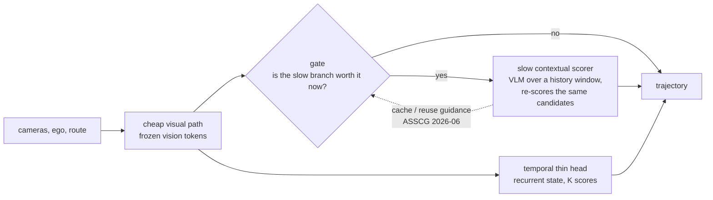

关键在 gate 放在哪里：只有 gate 位于昂贵计算**之前**，才真正节约 backbone 的成本；先跑完整个 LLM 再决定要不要它，什么都没省。

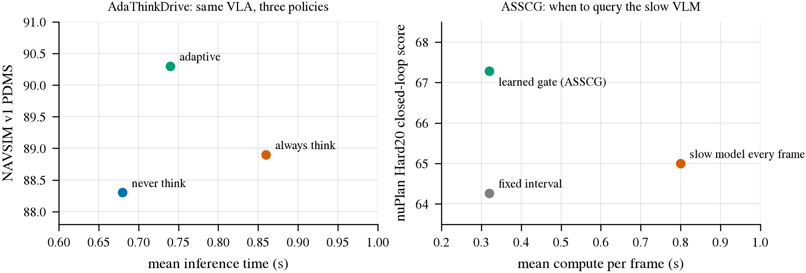

图 8 是两组配对实验。左边 AdaThinkDrive 用同一个 VLA，比较从不思考、总是思考、自适应选择三种策略：NAVSIM v1 上分别是
88.3、88.9、90.3 PDMS，平均推理时间 0.68、0.86、0.74 s，自适应分最高、时间居中 [56]。右边 ASSCG 在 nuPlan Hard20 闭环上，
比较每帧都调慢模型、固定间隔调用、学出来的 gate：分数 65.00、64.27、67.28，每帧成本 0.80、0.32、0.32 s，学出来的 gate 和固定间隔
一样便宜，分数却最高 [57]。两张图的共同点是：**总是思考并不是上限。**

再看几篇代表工作各自证明了什么。AdaThinkDrive 还报告：简单场景中 84% 选择不思考，困难场景中 96% 选择思考，这是条件比例，
不是全数据的「不思考比例」。三种设置都在处理视觉输入，它省的是 CoT，不是 prefill；训练用了 64×H20 [56]。
CF-VLA 先给 meta-action，必要时做反事实批评和修正，它的消融很值得看：

| CF-VLA，无 route 消融 [58] | minADE ↓ | avgADE ↓ | 平均输出 token ↓ | think rate |
|---|---:|---:|---:|---:|
| Adaptive | **0.7650** | 1.5606 | 113.36 | 14.78% |
| Force no think | 0.7897 | **1.4890** | **87.43** | 0% |
| Force think | 0.9319 | 2.1144 | 257.42 | 100% |

adaptive 的 minADE 最好，avgADE 却不如 never-think；always-think 两项都最差。这是专有数据，minADE 是六个 mode 里取最小，
不是单输出的 Waymo ADE。它说明「更多思考更好」在不同指标上有不同答案，该看的是哪些样本确实被慢分支修正了。

ASSCG 是 novelty 边界最直接的一篇：一个序列 gate 决定对慢模型的指导是 Query、Cache 还是 Drop，也就是更新、复用或抑制。
在 NAVSIM navtest 上它把 ReCogDrive 从 90.8 提到 91.4，A30 上平均延迟从约 350 降到 270 ms，慢分支调用约 40%；nuPlan 那组的慢模型
调用率约 19% [57]。**「学会何时调用慢 VLM 并复用旧指导」已经被做了。**

FIVE-VLA 则给出一个必须先排除的竞争解释：不生成 CoT，用一个 recurrent 的 action latent memory 持续保持驾驶意图，就能改善闭环。

| FIVE-VLA 消融 [50] | Bench2Drive SR ↑ | NVIDIA 数据 open-loop speed ADE ↓ |
|---|---:|---:|
| 无 memory、无显式历史 | 73.03% | 0.549 |
| 输入过去 3 个 ego waypoint | 64.39% | 0.373 |
| 输入过去 10 个 ego waypoint | 70.00% | 0.358 |
| Recurrent Action Memory | **77.27%** | 0.402 |

显式历史改善 open-loop ADE，却降低闭环成功率；latent 的 action memory 则改善闭环。这个系统 641M 参数，A100 上约 30 FPS，
没有文本 CoT。右列是另一个数据集上 3 s 的 speed-trajectory ADE，不是 Bench2Drive 的 ADE，只能在列内比。

最后是 Driving on Memory，2026 年 8 月底出来的 [49]。它的实验是：把当前相机输入拿掉，换成这辆车或别的车过去在同一地点看到的东西，
用一个冻结的 DrivoR 抽出来的 scene token 加位姿建一个 memory bank，再训一个 MemoryDrivoR 去查。结果在 NAVSIM 上接近甚至超过领先系统，
而在 Bench2Drive 和 RealEngine 上明显退化。作者的 memory bank 在 NAVSIM v1 和 v2 上各 6.3 GB，Bench2Drive 22.2 GB，默认复现配置
4 张 GPU、5 个 epoch；代码已公开，权重和 memory bank 标为 coming soon；消融里包含地理划分和 HD-map-only 对照。这首先是一篇
benchmark audit：**NAVSIM 的高分可能主要奖励静态道路规律和常见驾驶模式**，对「有没有看当前画面」的检验强度不够。它不能推出
当前的车辆、行人、信号灯不重要，也不能推出当前片段的 temporal memory 已经不需要。对任何声称「视觉表示有用」的工作，
地理记忆都是一个必须排除的混杂因素。

把这一节合起来看：fast / slow、动态 gate、缓存旧指导、用记忆减少重复计算，都已有直接先例。这个方向上还没被回答的问题，
是「哪些时刻、哪些历史、哪些额外计算真正带来收益，能不能在付出大模型成本之前识别出来」。用词上，报告建议用
「selective temporal computation」这种可以精确验证的说法，少用「human-like fast and slow thinking」；没有生成 CoT 的时候，
hidden state 的变化叫 temporal fusion 或 contextual computation 就好，不必都叫 reasoning。

---

## 证据的台阶，以及延迟怎么比才公平

### 从「像人」到「会开」中间有几级

一项表示层面的研究可以有价值，而不必证明整辆车会开。关键是让结论和证据的层级对上。

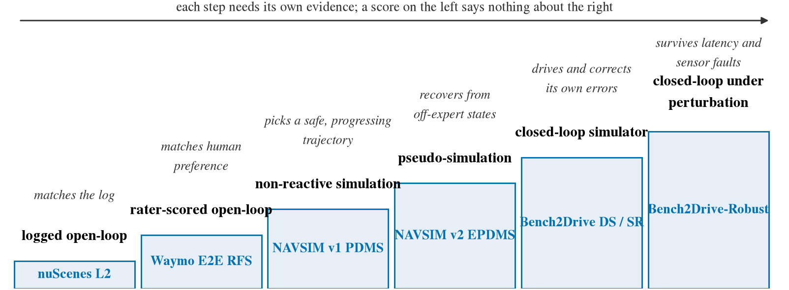

图 9 把常用 benchmark 按「证明了什么」排成台阶。每往右一步都需要新的验证，左边的分数不能直接换成右边的结论：
Waymo RFS 高说明选的轨迹接近人类偏好，但不说明执行之后能纠错；NAVSIM v1 是 non-reactive 的，其他车不会对你的决定做反应。

| Benchmark | 真正测什么 | 已知的限制或可利用之处 | 可复现的算力锚点 |
|---|---|---|---|
| nuScenes open-loop | 和记录轨迹的 L2、碰撞代理 | ego-status shortcut [34]；不能把低 L2 当驾驶智能 | 特征可缓存，适合机制开发 |
| Waymo E2E | 和人工评分轨迹的接近程度 | open-loop 代理；rater 标签每段只有一帧，不是在线评价 | FROST 可作 frozen encoder 的 baseline，训练成本未公开 |
| NAVSIM v1 | non-reactive 场景里执行候选轨迹，PDMS 综合安全、进展等 | 不是真实多智能体交互；Driving on Memory 显示可被静态记忆利用 [49] | World4Drive 报告 8×RTX 3090、12 epochs [6] |
| NAVSIM v2 | pseudo-simulation，加入偏离专家状态后的评估，EPDMS | 比 v1 难，仍不是完整闭环；v1 / v2 分数不可互换 [59] | Drive-JEPA 的 planner 用 2×A30，predictive pretraining 另算 8×H800 约 3 天 [8] |
| Bench2Drive | CARLA 里实际执行策略，DS、成功率、分能力评估 | 2026-08-06 协议更新为 uniform training distribution 和新 validation set，新旧分数不可直接比 [60] | 需要仿真并行评估的工程；GPU-hours 无统一数字 |
| Bench2Drive-Robust | 相机失效、ego 状态误差、控制延迟下的闭环 | 是对「薄所以快」这个论点最直接的压力测试 [61] | 多种扰动重复评估，成本随场景数变化 |
| AlpaSim 类的重建评估 | 重建真实场景里的策略 rollout | 重建、场景子集、agent 行为、reset 协议都要核对 [18] | 重型 teacher 和 simulator，不适合短项目的第一道门槛 |

选 benchmark 就是在选要支持的结论，不是追逐一个通用分数。表里的 GPU 配置只是已发表实现的锚点，模型大小、预处理、轮数和评估并发
都不同，不能据此换算「发一篇论文需要几张卡」。

文献里还沉淀了一些统计设计上的共识，值得在这里记一笔。相邻帧不能随机拆到 train 和 test，同一 trip 或 scene 的重叠窗口也不能泄漏；
按 scene 做 bootstrap，比把高度相关的帧当独立样本更可信。所有阈值、层选择、prompt 措辞都在 validation 上决定，从 test 挑「最佳层」
再报告该层的置信区间会低估选择带来的不确定性。这些不是哪个 venue 的规定，是被 ego-status shortcut 那类反例逼出来的习惯。

### 延迟：head 快不等于系统快

「薄 head 所以实时」是这条线最常见的宣传，也是最容易做假的地方。完整链路包括图像预处理、vision encoder、LLM prefill
（把图像 token 和 prompt 过一遍整个网络）、输出和控制接口；只测 head 的微秒数会漏掉前面全部。文献里的报告口径五花八门。

| 方法 | 硬件 / batch | 报告的速度 | 计时边界 |
|---|---|---|---|
| Alpamayo-R1 [15] | RTX 6000 Pro Blackwell | 29 / 99 / 312 ms | 含 vision、prefill、action；不是分位数 |
| MindVLA-U1 [62] | H200，B1 | slow 2594 ms；fast / template 108 ms；action-only 103 ms | 含 vision |
| Fast-dDrive [63] | H100，B1 | 1919 ms；用 SGLang 665 ms | 均值，prefix 复用；无 p95 |
| DiffAdapterVLA [43] | 多 GPU，**batch 8** | 80.4 ms / sample，batch wall-time 0.643 s | **批均摊**，不是单请求延迟；缓存了早期 condition |
| Hydra-MDP++ [36] | V100 | ResNet-34 206.2 ms；V2-99 271.0 ms | CPU 预处理和分位数未说明 |
| DiffusionDrive [37] | RTX 4090 | 45 FPS；去噪部分 7.6 ms | 7.6 ms 不是全流程 |
| WoTE [39] | L20 | K=256 时 18.7 ms | 文中 total |
| GoalFlow [38] | 未说明 | 1 步 10.4 ms；5 步 49.0 ms | 只算生成 |
| ZTRS / GTRS-Dense [41, 40] | A100 | 18.4 / 18.5 FPS | K=8192，边界细节未说明 |
| FROST-Drive [22] | 未公开 | 未公开 | 完整协议缺失 |

不同相机数、帧数、精度、batch 下的数字不能直接排名。可比的最低要求是 batch 1、串行请求、含 vision 和 prefill、报 p50 和 p95，
并且把 cold-start 和 steady-state 分开。还有两个专门针对薄 head 路线的提醒。**在中间层取特征，不等于提前退出**：如果后面的层照常跑完，
就没有任何推理节省；要真正截断计算、验证输出一致，才能声称省了时间。**仿真器愿意等模型算完，不代表模型能跟上真实时间**：
同步仿真里每个 tick 都能调用算法，和现实里能否在对应频率内算完是两回事。对薄 head 主张最有价值的闭环测试，是把实测的延迟注入
控制回路，看性能是否还保得住，Bench2Drive-Robust 提供的正是这个方向 [61]。

---

## 合上文献之后

回到路口那辆车。驾驶智能藏在哪里？文献的答案是：大量可用的信息确实在预训练表示里，冻结它、接一个薄 head，已经能在
Waymo 上挤进微调 VLM 的中游，在 NAVSIM 上也有 Auto-JEPA 这样的例子。但它的可读性、可执行性和对追加计算的需求不是同一件事。
探针读得出的东西，生成时可能用不上；选对了大方向的系统，轨迹细节可能全场最差；在某个 benchmark 上「不看当前画面也行」，
可能只是 benchmark 的问题。而所谓「变薄」的历史，与其说是一条从生成走向读取的直线，不如说是一次重新分工：
视频渲染留给仿真和造数据，轨迹序列化换成 flow head，reasoning 和未来 latent 的生成在很多系统里都还在。

所以我觉得这条线上最有价值的工作，不是再宣布一次「生成已被证明多余」，也不是再证明一次「latent 里有东西」，
而是精确找出：能删什么、不能删什么、删了之后失去什么，以及什么时候一个廉价的 readout 就够了、什么时候必须换 token 接口或追加计算。
这个问题允许薄 head 赢，也允许 reasoning 或 latent rollout 在某些场景赢，两种结果都能检验最初那个直觉。

如果只读十二篇，我建议按这个顺序，每篇解决一个具体判断：

| 顺序 | 论文 | 先解决的判断 |
|---|---|---|
| 1 | Probing Visual Concepts in Lightweight VLMs for Automated Driving [21] | 逐层探针 + 驾驶 VLM 这个模板已经被占了多少 |
| 2 | Hidden in plain sight [29] | 生成失败为什么不等于表示里没有信息 |
| 3 | Linear Mechanisms for Spatiotemporal Reasoning [30] | 信息会不会只是搬到了别的 token 上 |
| 4 | Is Ego Status All You Need [34] | 任何 open-loop 结果都要先过 ego-state 这一关 |
| 5 | FROST-Drive [22] | 冻结视觉 + 小 head 在 Waymo 上的直接先例，注意 val 和 test 的区分 |
| 6 | Qwen-Drive-1.0 [16] | 未适配 VLM 接 planner 的最新数字，以及 SFT → RL 在不同指标上的分歧 |
| 7 | Alpamayo-R1 [15] | 轨迹序列化的成本和 reasoning 的成本分开算 |
| 8 | AutoVLA [13] | 短 action token、选择性 reasoning、RFT，以及 best-of-N 上界的混淆 |
| 9 | Hydra-MDP [35] | 轨迹词表怎么建、scorer 怎么监督 |
| 10 | Drive-JEPA [8] | 预训练目标对下游 planner 的影响 |
| 11 | ASSCG [57] | 「何时调用慢模型」已经做到哪一步 |
| 12 | Driving on Memory [49] | benchmark 是否真的检验了动态感知 |

---

## 参考文献

1. GAIA-1: A Generative World Model for Autonomous Driving. arXiv:2309.17080, 2023-09.
2. GAIA-2: A Controllable Multi-View Generative World Model for Autonomous Driving. arXiv:2503.20523, 2025-03.
3. DriveDreamer: Towards Real-world-driven World Models for Autonomous Driving. arXiv:2309.09777, 2023-09.
4. Vista: A Generalizable Driving World Model with High Fidelity and Versatile Controllability. arXiv:2405.17398, 2024-05.
5. LAW: Enhancing End-to-End Autonomous Driving with Latent World Model. arXiv:2406.08481, 2024-06; v2 2025-02.
6. World4Drive: End-to-End Autonomous Driving via Intention-aware Physical Latent World Model. arXiv:2507.00603, 2025-07.
7. DriveLaW: Unifying Planning and Video Generation in a Latent Driving World. arXiv:2512.23421, 2025-12; v3 2026-04.
8. Drive-JEPA: Video JEPA Meets Multimodal Trajectory Distillation for End-to-End Driving. arXiv:2601.22032, 2026-01; v2 2026-07.
9. WA-JEPA: Rethinking the Video JEPA Paradigm for World-Action Modeling in Autonomous Driving. arXiv:2608.20974, 2026-08; v2 2026-09.
10. DriveVLM: The Convergence of Autonomous Driving and Large Vision-Language Models. arXiv:2402.12289, 2024-02.
11. EMMA: End-to-End Multimodal Model for Autonomous Driving. arXiv:2410.23262, 2024-10.
12. OpenDriveVLA: Towards End-to-end Autonomous Driving with Large Vision Language Action Model. arXiv:2503.23463, 2025-03.
13. AutoVLA: A Vision-Language-Action Model for End-to-End Autonomous Driving with Adaptive Reasoning and Reinforcement Fine-Tuning. arXiv:2506.13757, 2025-06; v3 2025-11.
14. ORION: A Holistic End-to-End Autonomous Driving Framework by Vision-Language Instructed Action Generation. arXiv:2503.19755, 2025-03.
15. Alpamayo-R1: Bridging Reasoning and Action Prediction for Generalizable Autonomous Driving in the Long Tail. arXiv:2511.00088, 2025-10; v2 2026-01.
16. Qwen-Drive-1.0: An Initial Step towards a Vision-Language Foundation Model for Autonomous Driving. arXiv:2609.00111, 2026-09. Model card: huggingface.co/Qwen/Qwen-Drive-1.0-4B.
17. Jev Visual. github.com/hr98w/jev-visual, 2026-09 snapshot, commit 9f1cf52.
18. NVIDIA. Generate Trajectories, Reasoning Traces, and Auto-Labels with NVIDIA Alpamayo 2 Super. Technical blog, 2026-08.
19. TypeSafe. Introducing System One Models and Jev. typesafe.ai, 2026-09-15.
20. OpenJev. github.com/razorback16/openjev, 2026-09 snapshot, commit 5e56da0.
21. Probing Visual Concepts in Lightweight Vision-Language Models for Automated Driving. arXiv:2603.06054, 2026-03; v2 2026-08.
22. FROST-Drive: Scalable and Efficient End-to-End Driving with a Frozen Vision Encoder. arXiv:2601.03460, 2026-01.
23. NAVSIM: Data-Driven Non-Reactive Autonomous Vehicle Simulation and Benchmarking. arXiv:2406.15349, 2024-06.
24. OccWorld: Learning a 3D Occupancy World Model for Autonomous Driving. arXiv:2311.16038, 2023-11.
25. V-JEPA 2: Self-Supervised Video Models Enable Understanding, Prediction and Planning. arXiv:2506.09985, 2025-06.
26. DINOv3. arXiv:2508.10104, 2025-08.
27. DrivingGPT: Unifying Driving World Modeling and Planning with Multi-modal Autoregressive Transformers. arXiv:2412.18607, 2024-12.
28. Which Pretraining Paradigm Better Serves Spatial Intelligence? An Empirical Comparison of Vision-Language and Video Generation Models. arXiv:2605.28132, 2026-05.
29. Hidden in plain sight: VLMs overlook their visual representations. arXiv:2506.08008, 2025-06.
30. Linear Mechanisms for Spatiotemporal Reasoning in Vision Language Models. arXiv:2601.12626, 2026-01.
31. Generalizable VLA Finetuning via Representation Anchoring and Language-Action Alignment (Anchor-Align). arXiv:2607.13429, 2026-07.
32. Probing a Vision-Language-Action Model for Symbolic States and Integration into a Cognitive Architecture. arXiv:2502.04558, 2025-02.
33. VLM-AD: End-to-End Autonomous Driving through Vision-Language Model Supervision. arXiv:2412.14446, 2024-12.
34. Is Ego Status All You Need for Open-Loop End-to-End Autonomous Driving? arXiv:2312.03031, 2023-12.
35. Hydra-MDP: End-to-end Multimodal Planning with Multi-target Hydra-Distillation. arXiv:2406.06978, 2024-06.
36. Hydra-MDP++. arXiv:2503.12820, 2025-03.
37. DiffusionDrive: Truncated Diffusion Model for End-to-End Autonomous Driving. arXiv:2411.15139, 2024-11.
38. GoalFlow: Goal-Driven Flow Matching for Multimodal Trajectories Generation in End-to-End Autonomous Driving. arXiv:2503.05689, 2025-03.
39. WoTE: End-to-End Driving with Online Trajectory Evaluation via BEV World Model. arXiv:2504.01941, 2025-04.
40. GTRS: Generalized Trajectory Scoring for End-to-end Multimodal Planning. arXiv:2506.06664, 2025-06.
41. ZTRS: Zero-Human Demonstration End-to-end Autonomous Driving with Trajectory Scorer. arXiv:2510.24108, 2025-10.
42. Auto-JEPA: A Latent World Model of Continuous Intent for End-to-End Autonomous Driving. arXiv:2607.29031, 2026-07.
43. Planning in the Backbone: DiffAdapterVLA for Native Continuous Trajectory Generation with Driving VLMs. arXiv:2609.15322, 2026-09.
44. VL-DPO: Vision-Language-Guided Finetuning for Preference-Aligned Autonomous Driving. arXiv:2605.20082, 2026-05.
45. dVLM-AD. arXiv:2512.04459, 2025-12（其中报告了 OpenEMMA / LightEMMA 在 Waymo test 上的复现分数）.
46. WOD-E2E: Waymo Open Dataset for End-to-End Driving in Challenging Long-tail Scenarios. arXiv:2510.26125, 2025-10; CVPR 2026.
47. Waymo Open Dataset, Vision-based End-to-End Driving Challenge (2025 edition): rules, tutorial, `end_to_end_driving_data.proto`, `end_to_end_driving_submission.proto`. waymo.com/open/challenges/2025/e2e-driving/, 2026-09 核对.
48. Community ego + intent MLP ensemble report. github.com/manfromnowhere143/perceptionproof, 2026-06-29（非标准 val 协议）.
49. Driving on Memory. arXiv:2608.31029, 2026-08. Code: github.com/boschresearch/MemoryDrivoR.
50. FIVE-VLA. arXiv:2609.18623, 2026-09.
51. GenAD: Generalized Predictive Model for Autonomous Driving. arXiv:2403.09630, 2024-03.
52. GenAD: Generative End-to-End Autonomous Driving. arXiv:2402.11502, 2024-02.
53. NTR: Neural Token Reconstruction for Scene Token Bottleneck in End-to-End Driving. arXiv:2605.31116, 2026-05.
54. DiffVLA: Vision-Language Guided Diffusion Planning for Autonomous Driving. arXiv:2505.19381, 2025-05.
55. DiffVLA++. arXiv:2510.17148, 2025-10.
56. AdaThinkDrive. arXiv:2509.13769, 2025-09.
57. ASSCG. arXiv:2606.25509, 2026-06.
58. CF-VLA (Counterfactual VLA). arXiv:2512.24426, 2025-12.
59. Pseudo-Simulation for Autonomous Driving (NAVSIM v2). arXiv:2506.04218, 2025-06.
60. Bench2Drive: Towards Multi-Ability Benchmarking of Closed-Loop End-To-End Autonomous Driving. arXiv:2406.03877, 2024-06; 协议更新 2026-08，github.com/Thinklab-SJTU/Bench2Drive.
61. Bench2Drive-Robust: Benchmarking Closed-Loop Autonomous Driving under Deployment Perturbations. arXiv:2605.18059, 2026-05.
62. MindVLA-U1. arXiv:2605.12624, 2026-05.
63. Fast-dDrive. arXiv:2605.23163, 2026-05.

表里出现、正文未展开的其他 Waymo 条目：RAP arXiv:2510.04333；Poutine arXiv:2506.11234；SUV arXiv:2608.03084；
HMVLM arXiv:2506.05883；NoRD arXiv:2602.21172。
