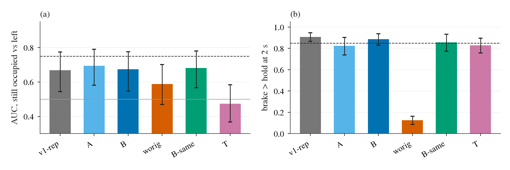
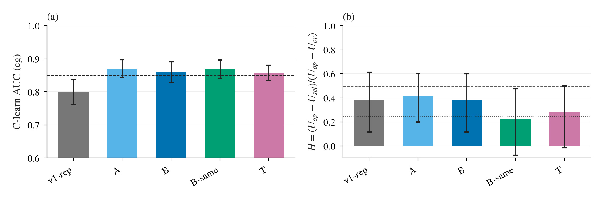
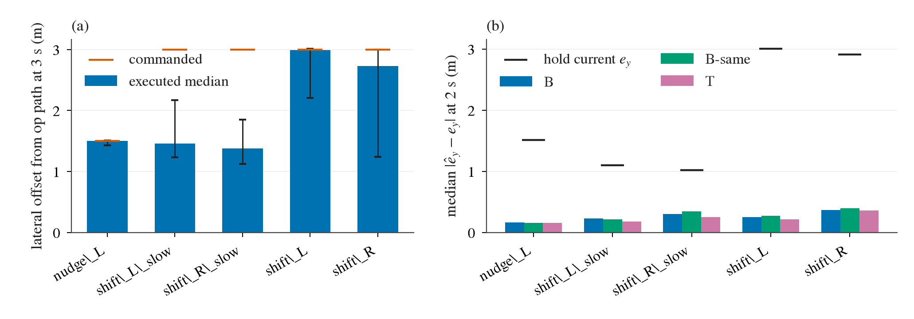
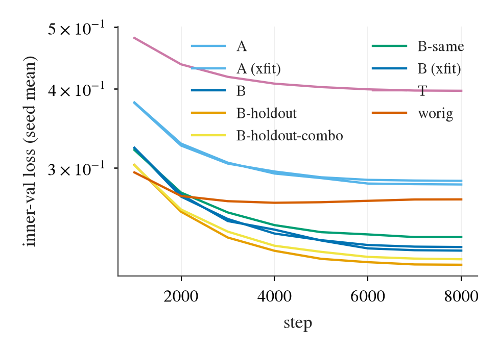
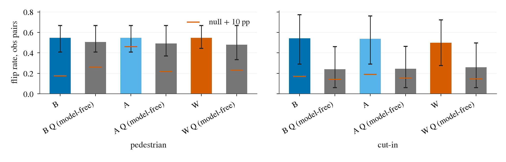

# WL-2 结果：新留出分叉上的 C1-C4 判格（世界模型第二轮前置检查）

2026-09-30。预登记 [fc65452:todos/2026-09-29-wl2-prereg.md](https://github.com/VennIntelligence/jev-drive/blob/fc65452/todos/2026-09-29-wl2-prereg.md)，判据与读法写在任何数字之前，读数代码在 WL-1 干跑数据上复现过（最大差 5e-5）。
结果表在 [results/wl2/results/](../experiments/world_model/results/wl2/results/)（`results.json` 是全部数字，`c1_main.csv`、`c2_c3.csv`、`c4_flips.csv` 等是分表）；出图 `experiments/world_model/archive/make_wl2_figs.py`。
决定记在 [decisions.md](decisions.md) 第 76 条。**结论：按登记读法是 no-go**（C2 过、C3a 不过；C1c 与 C1b 也不过），世界模型想象训练的设计讨论没有依据。

## 读数设定

- 主评测集 = WL-1 的 40 条评测 base 路线的 seed 1 / 2 新世界，评测 x⁺ 分叉点 247 个，训练中任何 seed 都不含这些路线。**偏离**：247 个里只有 210 个能取到 8 步历史（fork tick 在 run 开始后不足 1.4 s，或被 render / pose gate 剔除），全部读数只在这些点上；C3 表里 x⁺ 为 208 个（n_plus），另 2 个的去向没有在读数代码里单独记录。这不是看结果后的选择，写在看数字之前的状态记录里。
- 判格臂 = `B`（5 seed 均值），CI = 按 base 路线整组 bootstrap（2 000 次）。主 unsafe 标签 = cg（碰撞或本车道间距 < 2 m）。`vrep` = WL-1 冻结预测器在 cg 标签上重拟 critic；`A` = 无 ego 通道；`W` = W 原版（阳性对照）；`Bs` = 同数据的 B（B-same）；`T` = 空间 token 副臂。
- 规则：点估计与 CI 都按登记的线判；点估计过、CI 跨线的在表里标注，但**判格只看登记写的量**（C1、C2 的线是点估计，C3a 要求 H 的 CI 下界）。

## 判格总表

| 条 | 量 | 线 | `B` 读数 | 判 |
|:--|:--|:--|:--|:--|
| C1a | `brake_hard` 对 `hold`，推演 2 s 后 `d_front` 读「刹车更远」的比例 | ≥ 85% | 88.7% [83.2, 93.8]（`W` 12.5%） | 过（CI 下界略低于线） |
| C1b | 推演 Δd 与真实 Δd 之差的中位数 | ≤ 3 m | 3.44 m [2.62, 4.16] | **不过**（CI 跨线） |
| C1c | 被占子集横移可分性 AUC；`B` − `worig` 的差 | ≥ 0.75 且差的 CI 下界 > 0 | 0.674 [0.547, 0.776]；差 +0.086 [−0.054, +0.218] | **不过** |
| C2 | C-learn 在推演 latent 上对 cg 的 AUC；同分叉点成对排序 | ≥ 0.85；≥ 80% | 0.860 [0.829, 0.891]；89.6% | 过（AUC CI 下界略低于线） |
| C2(a) | C-learn − Q 的 AUC 差 | CI 下界 ≥ −0.02 | +0.031 [+0.011, +0.049]（Q 0.829） | 过 |
| C2(b) | `B-holdout` 在 `shift_R` / `op_slow` 上 C-learn − Q | CI 下界 > 0 | +0.256 [+0.161, +0.367]（n = 833） | 过 |
| C3a | H = (U_op − U_sel) / (U_op − U_or) | H ≥ 0.50 且 CI 下界 ≥ 0.25；U_op − U_sel 的 CI 下界 > 0 | H = 0.380 [0.115, 0.600]；U_op − U_sel = +0.144 [+0.040, +0.251] | **不过** |
| C3b | x⁻ 3 s 进度 / `op`；x⁻ unsafe | ≥ 0.90；≤ `op` + 2 pp | 1.12；8.6% 对 11.0% | 过 |
| C3c | H(C-learn) − H(Q)（不进 go / no-go） | CI 下界 > 0 | +0.215 [−0.035, +0.566]（H_Q = 0.165） | 不过（只改叙述） |
| C4 行人 | 连续风险读数翻转率，CI 下界 > 样本外 null 误翻 + 10 pp | 0.176 | 54.7% [40.7, 66.7]，null 7.6% | 过 |
| C4 cut-in | 同一个 null 判格 | 0.170 | 54.3% [29.1, 77.2]，null 7.0% | 过 |

最小样本均满足：可解分叉点（cg，`op` unsafe 且 oracle 有安全候选）79 个、来自 28 条 base 路线（线 40 / 15）；C1c 的「仍被占」76 对、「已离开」289 对、35 条路线（线 20 / 8）。

图 wl2-c1c：左，各臂在被占子集上对「仍被占 / 已离开」的 AUC，虚线 0.75；右，刹车 vs 保持方向，虚线 85%。看点：所有带 ego 通道或不带的预测器都在 0.67–0.69，`worig` 与 `T` 更低；差别落在误差棒里，ego 通道没有把横移读对。

图 wl2-c2-c3：左，各臂 C-learn 的 cg AUC，虚线 0.85；右，各臂 H，虚线 0.5、点线 0.25（CI 下界线）。看点：AUC 在线附近且四个臂彼此不可分；H 的点估计 0.23–0.42 全部在 0.5 之下，CI 下界都在 0.25 以下。

## C1 动作因果

| 臂 | brake > hold | 推演 Δd 中位误差 (m) | C1c AUC | 差分口径一致率（S） | 全分叉点一致率 |
|:--|--:|--:|--:|--:|--:|
| v1-rep（3 seed） | 90.8% | 3.36 | 0.668 | 76.6% | 60.4% |
| A（5） | 82.5% | 3.45 | 0.694 | 77.8% | 59.3% |
| **B（5）** | 88.7% | 3.44 | 0.674 | 76.8% | 58.6% |
| worig（5，阳性对照） | 12.5% | 9.10 | 0.588 | 57.5% | 63.2% |
| B-same（3） | 85.7% | 3.32 | 0.681 | 78.5% | 57.7% |
| T（3，空间 token） | 82.8% | 3.83 | 0.473 | 72.0% | 62.5% |

- 纵向：C1a 在新分叉上复现（`worig` 12.5% 仍是反向），说明 WL-1 的纵向因果不是路线或 seed 特有的。`A` 比 `B` 低 6 pp（`B` − `A` 的 C1a 差 +6.2 pp [+2.1, +10.6]），是 ego 通道唯一可见的收益。
- 横向：ego 通道本身读得对——`B` 预测的 2 s 横向偏移 ê_y 对真实 e_y 的中位误差，`shift_L` / `shift_R` 0.25 / 0.36 m（持续不变基线 3.0 / 2.9 m，符号 100% 对），`nudge_L` 0.16 m。**但 `occ` probe 读推演 latent 时仍分不开「仍被占」与「已离开」**：AUC 0.674，`B` − `A` = −0.021 [−0.044, +0.001]，`B` − `worig` 的差 CI 跨 0。也就是说 s 通道告诉了模型「ego 去了哪」，模型没有把「障碍在画面哪一侧」读出来，这与登记时的分支（「加了它 shift 还读不对，问题就在障碍在画面哪一侧那一层」）一致。
- 空间 token（`T`）没有救回横向：C1c AUC 0.473，比 `B` 低 0.20 [−0.32, −0.07]，比 `B-same` 低 0.21。登记读法「`T` 也不过 → 横向问题不在 latent 的空间分辨率（查标签与执行）」成立。

图 wl2-slowshift：横移类候选的实际执行偏移，以及 `B` 预测的 2 s e_y 对执行值。看点：`shift_*_slow` 的执行偏移远小于指令的 3 m，而预测 e_y 紧跟执行值，通道读对了 ego 去了哪。

图 wl2-curves：各臂 inner-val loss 曲线。看点：所有臂收敛平稳，臂间差异不是欠训练造成的。

- **执行欠跟踪的影响**：`shift_*_slow` 实际偏移中位只有 1.46 / 1.38 m（主评测集，指令 3 m），≥ 2 m 的占 27% / 20%（已批准的偏差）。按实际偏移分层的 `occ` 分数读数见 `slow_shift.csv`，在 < 1 m 与 1–2 m 的层里 `B` 对「仍被占」的分数与真实标签的 Spearman 只有 −0.15 至 −0.26，没有更高的分辨力。
- 交叉复现：WL-1 旧评测集（130 个分叉点，只描述）上 `B` 的 C1c AUC 0.654，与新集 0.674 同量级，没有新旧数据的差异。

## C2 与 C3

| 臂 | C2 AUC (cg) | Q AUC | 成对 | U_op | U_sel | U_or | H | 可解 | 挽回 / 伤害 |
|:--|--:|--:|--:|--:|--:|--:|:--|--:|:--|
| v1-rep | 0.801 | 0.758 | 77.4% | 0.418 | 0.274 | 0.039 | 0.380 [0.117, 0.613] | 79 | 45 / 15 |
| A | 0.869 | 0.825 | 89.6% | 0.418 | 0.260 | 0.039 | 0.418 [0.200, 0.603] | 79 | 46 / 13 |
| **B** | 0.860 | 0.829 | 89.6% | 0.418 | 0.274 | 0.039 | 0.380 [0.115, 0.600] | 79 | 44 / 14 |
| B-same | 0.868 | 0.822 | 89.5% | 0.418 | 0.332 | 0.039 | 0.228 [−0.078, 0.474] | 79 | 39 / 21 |
| T | 0.857 | 0.808 | 88.6% | 0.418 | 0.313 | 0.039 | 0.279 [−0.014, 0.500] | 79 | 44 / 22 |

- **C2 复现且 C-learn 确实比 Q 好**：三条线都过，(b) 的组合泛化（拿掉 `shift_R` / `op_slow` 训练窗口）差 +0.256，是本轮最强的一条。`A`、`B`、`T` 之间没有可分的差。次要标签（含 TTC 项）下 AUC 0.89 左右，同结论。
- **C3a 不过，原因不是选择规则挑坏**：U_sel 比 U_op 低 14 pp（CI 下界 +4 pp，显著），但可挽回的差距是 U_op − U_or = 38 pp，规则只挽回了 38%。分开看，挽回率 44 / 79 = 56%，同时对 121 个 `op` 本来安全的分叉点伤害 14 个（11.6%）；伤害率与 WL-1（2 / 24 = 8%）同量级。C3a 的 CI 下界（0.115）远低于 0.25，样本量（79 个可解）已经比 WL-1（27 个）大，CI 收窄了但点估计没上去，不是样本量问题。
- 只用原 7 个候选时 H = 0.42（`B`）或 0.46（`A`），比 11 个候选 0.38 还高：新候选（`brake_mild`、两个 slow 横移、`nudge_L`）没有让选择更好，选择规则大量选 `hold`（145 / 417）与 `nudge_L`（53）。
- **没有满足 C3b 的单一固定候选能过 H**：`op_slow` H = 0.84、`brake_hard` H = 0.89，但 3 s 进度只有 `op` 的 35% / 25%（C3b 线 0.90）；`hold` H < 0。也就是说存在能过 H 的「一律刹车」，正是 C3b 要防的那种。
- 分层（`B` 的 U_op → U_sel → U_or，只有 `vrep`、`A` 在 results.json 里完整并列）：k3 最差（U_op 0.74，oracle 0.13），障碍与行人的 U_sel 仍在 0.23–0.39，cut-in 已 0.09。行人 k3 的 headroom 本来就不大，所以 H 的分母里可挽回部分主要来自 k1–k2 与障碍。
- WL-1 旧评测集（64 个 x⁺、27 个可解，只描述）上 `B` 的 H = 0.593 [0.357, 0.800]，点估计和下界都过线；新集为 0.380。同一个模型在旧集上更好，这与旧集被设计过程看过的判断一致，也是登记要求在新留出集上判的理由。
- 交叉拟合（5 折、每折在其余 4 折上训练，只描述）：`Bx` 与 `Ax` 的 H 约 0.34–0.40（新评测集 329 个 x⁺、147 个可解，H CI 下界 0.19），与 `B` 一致，说明 0.38 不是某一次训练折的偶然。

## C4 配对考卷（连续风险读数）

| 考生 | 行人翻转率 [CI] | 行人 null 误翻 | 行人判 | cut-in 翻转率 [CI] | cut-in null 误翻 | cut-in 判 |
|:--|:--|--:|:--|:--|--:|:--|
| **B risk（5 seed 均值）** | 54.7% [40.7, 66.7] | 7.6% | 过 | 54.3% [29.1, 77.2] | 7.0% | 过 |
| A risk | 54.7% [40.7, 66.7] | 36.1%（seed 2 的 null 异常） | 不过（margin） | 53.8% [29.2, 76.1] | 9.0% | 过 |
| worig risk | 54.7% [44.4, 66.7] | 5.5% | 过 | 50.0% [27.7, 72.1] | 5.2% | 过 |
| B 的 Q risk（model-free） | 50.7% [40.7, 66.7] | 16.1% | 过 | 24.1% [6.0, 46.2] | 4.3% | 不过 |

图 wl2-c4：各考生的翻转率与样本外 null 误翻的对比。看点：行人上 `B` risk 高于 null 线，但 `worig` 的风险读数一样高，考卷分不开新预测器与旧预测器。

- 按登记判格，`B` 在行人与 cut-in 上都过（两类 CI 下界 40.7% / 29.1% 都高于 null + 10 pp）。登记读法说 C4 不影响 go / no-go，只支持「世界模型看得见 hazard」的叙述。
- **但必须并列 `worig`**：W 原版的 risk 考生行人 54.7%、cut-in 50.0%，同样过线。也就是说这份考卷在风险读数口径下**不区分**「干预数据重训的预测器」与「只用日志的预测器」——风险读数里的 hazard 信号来自 V-JEPA / openpilot 的 latent 本身。Q（model-free）在行人上也过，只在 cut-in 上掉到 24%，这是 C4 里唯一体现「推演」有用的地方（`B` 54% 对 Q 24%）。
- 这份考卷在 WL-1 事后读数里看过（`hold` 风险 43–47%），登记里已限定「不是新考卷」；`B` 的 54.7% 比事后读数高，但 `worig` 也高，所以不把它写成 ego 通道或新数据的收益。

## 读法表的落点与后果

登记读法表按顺序对：C1a 过且 `worig` < 85%，所以「C1a < 85% 或 `worig` ≥ 85%」不触发；C2 过、C3a 不过 → **no-go（想象训练没有依据）**，看挽回率与伤害率拆开。C1c 不过（`T` 也不过）另给横向结论；C1b 点估计不过。C4 过，不改判。

| 问题 | 结果 |
|:--|:--|
| 显式 ego 横向通道能否让世界模型读对横移后果 | 通道本身读得对（ê_y 误差 0.25–0.36 m），后果（`occ` 离开走廊）读不对，C1c 0.674；`B` ≈ `A` |
| WL-1 的纵向因果与 critic 结论在新世界能否复现 | 能：C1a 88.7%、C2 AUC 0.860、C2(a) +0.031、C2(b) +0.256（`worig` 反向，Q 更差） |
| 选择规则能否挽回一半以上可挽回的安全 | 不能：H = 0.38 [0.12, 0.60]，挽回 56%、伤害 12% |
| critic 风险读数对 hazard 有无配对反应 | 有（过 null + 10 pp），但 `worig` 同样有，不是新预测器的功劳 |

限定：主评测集训练里没有这些路线的任何 seed，但设计与 WL-1 读数看过这些路线 seed 0 的数据（登记的「只有训练意义上的几何留出」）；`shift_*_slow` 的欠跟踪已批准，结论里没有依赖它们；只有 Cinque + 5 seed，1 次读数。

## 下一步（未决，不在本轮）

- H 上限来自挽回率与伤害率两边，规则本身（阈值 0.2、进度最大）另行登记才能动，本轮不动。观察：在同一批 critic 概率上，`op_slow` 一个固定候选就有 H = 0.84 但违反 C3b，说明 C3b 与 H 的冲突才是这个问题的实质，而不是 critic 排序精度（C2 已过）。
- 横向：ego 通道与空间 token 都没有让 `occ` probe 读出「障碍离开走廊」，问题更可能在 probe 的标签定义与执行偏移（`shift_*_slow` 欠跟踪之外，`shift_R` 只有 64% 分叉点偏移 ≥ 2 m），下一步查标签与执行，而不是再换表示。
