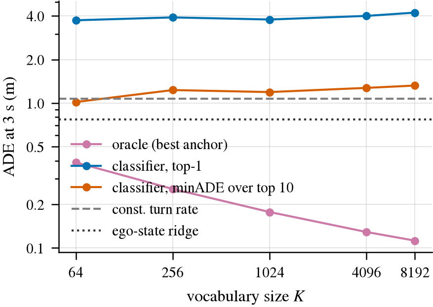
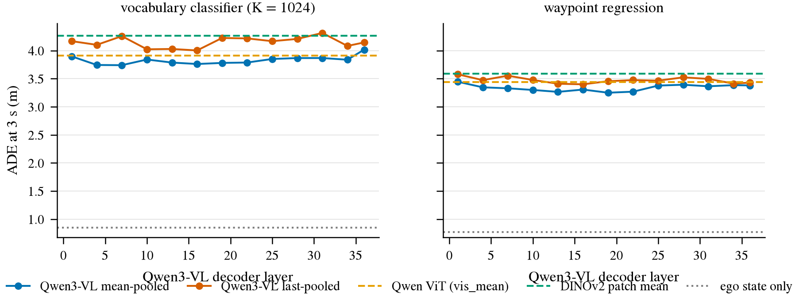

# Planner v0：在 nuScenes 上彩排 Stage-A 轨迹词表规划器

状态: done
主题: ../research/frozen-vlm-planner.md

## 目标

把我们准备发表的 Stage-A 系统——**trajectory vocabulary planner**（先用训练集轨迹聚出一套固定的候选轨迹
"词表"，在线时只让一个很薄的 head 给每条候选打分、选一条输出）——整条代码、指标和表格先在 nuScenes 上
跑通一遍，然后原样指向 Waymo E2E。

这里得到的数字**不是结论**：nuScenes 只有前视单帧、3 s horizon，而且 open-loop 位移误差早就被证明
由 ego state 主导。这一版要回答的是工程和方法学问题：词表多大够用、frozen feature 该取哪一层、
classification 比 regression 差多少、视觉到底比 ego-only 和物理外推强多少、head 本身有多快。

## Setup

- 数据: nuScenes v1.0-trainval，CAM_FRONT keyframe（2 Hz），官方 train/val scene 划分。
- Feature: 已经缓存好的 frozen feature，`$DATA_DIR/processed/nuscenes/v1.0-trainval/features/`
  下的 `qwen_w800`（Qwen3-VL-4B-Instruct，输入宽 800 px，36 层 × {last, mean} 两种 pooling，2560 维）
  和 `dinov2`（ViT-B/14，cls 和 patch_mean）。这一版不重新抽 feature。
- 模型: 只训 head，backbone 完全冻结。
- 算力预算: 单卡 RTX PRO 6000，整条链路 < 1 h（实测 13.6 min）。

## 步骤

- [x] 轨迹目标：3 s / 2 Hz / 6 个 waypoint，horizon 和 rate 是参数
- [x] 词表：train split 上 k-means，K ∈ {64, 256, 1024, 4096, 8192}，报 oracle minADE/minFDE 和 trust-region 覆盖率
- [x] Head：classification（hard / soft target）、ridge regression、MLP，以及 ego-only 和物理 baseline
- [x] Feature 对比：DINOv2、Qwen ViT、Qwen LLM 各层 × 两种 pooling
- [x] 指标：miss rate、ADE/FDE（含中间时刻）、minADE_k、scene-level bootstrap CI、paired 检验
- [x] Latency：head 自身 batch-1 延迟，以及截断到某一层的抽取速度

## 成功标准

跑之前写死：

1. 整条链路一条命令跑完，输出 results.csv / results.md / 图，且换成 `--horizon 5 --rate 4` 就是 Waymo 的口径。
2. K sweep 能把 **coverage error**（词表本身覆盖不了）和 **ranking error**（scorer 选错）分开。
3. 视觉 feature 至少要比 majority anchor 和 mean trajectory 强很多；能不能超过 ego-only 不预设结论，
   但必须诚实报告差距。

三条都达到了。

## 结果

2026-09-20 跑完。一条命令重跑：`scripts/planner_v0.sh --version v1.0-trainval --steps plan,bench`
（box 上用 `scripts/tmux_run.sh planner ...` 起）。
本次 run 在 box 上 `$DATA_DIR/runs/planner_v0/v1.0-trainval/20260920-104548/`：
`results.{csv,md}`、`paired.csv`、`subsets.csv`、`per_sample.npz`、`vocab_K*.npy`、
`latency.json`、`bench.json`，以及两张图的 PDF 和 PNG。整条链路 13.6 min（plan 12.6 min，bench 1.1 min）。

### 实现与协议

代码在 `jevdrive/`：`traj.py`（轨迹目标、词表、指标）、`planner.py`（各种 head、表格）、
`plots.py`（全项目统一的出图样式），入口 `planner_v0.py`。几个需要说清楚的选择：

- **轨迹目标**。用 20 Hz 的 ego pose 插值出未来 3 s、2 Hz 的 6 个 waypoint，坐标写在**当前帧自己的
  rear-axle ego frame**（原点在后轴中点，x 向前、y 向左，单位米）——这正是 Waymo E2E 要求提交的坐标系，
  所以换数据集只要改 horizon 和 rate（Waymo 是 5 s / 4 Hz / 20 点）。第一个点在 t+1/rate，和 Waymo 一致。
  scene 内放不下整个窗口的 keyframe 直接丢掉：26491 个带标签的 keyframe 里保留 **24752** 个
  （train 20396 / 700 个 scene，val 4356 / 150 个 scene）。
- **词表**。只在 train scene 上做 k-means（把 6 个 waypoint 摊平成 12 维做普通欧氏距离，不做任何
  normalization——这个空间本身就是米制且各向同性，摊平后的平方欧氏距离正好是 T 倍的均方位移，
  所以一个簇最小化的就是它的 anchor 将来被评的位移误差）。val 完全不参与。
- **split 与超参**。官方 train/val 按 scene 划分。feature 只用 train scene 的均值方差做 standardize；
  每个 head 的 L2 强度在 train scene 里再切一个 scene-grouped 的 inner split（留 20% 的 scene，
  560/140）上按 inner-val ADE 选，然后在全部 train scene 上 refit，val 只读一次。
- **求解器**。ridge regression（岭回归，闭式最小二乘加 L2 惩罚）一次特征分解把所有 λ 解出来；
  词表分类器是 full-batch 的 multinomial logistic regression，复用 `probe.py` 里那个 batched
  L-BFGS（有限内存拟牛顿法），所有 λ 一批解完、按行分块，K=8192 也放得下。MLP 用 minibatch AdamW。
- **fusion**。v0 的教训是 2560 维图像 feature 会把 11 维 ego state 淹掉。这里两种修法都试了：
  `+ego` 是把图像 feature 先 PCA（主成分分析）到 64 维、两块各自 standardize 再拼接；
  `*_late` 是 **late fusion**——先训一个 ego-only head，把它的输出（regression 的预测值 /
  分类器的 logit）当成冻结的 offset，图像 head 只学残差。

### 指标口径（这一版改过，很重要）

Waymo agent 已经把官方 **RFS（Rater Feedback Score，用人工标注的若干条"可接受轨迹"给预测打分）**
逐位复现进 `jevdrive/waymo.py`，并且发现两件事：官方 ADE 是对着**评分最高的 rater 轨迹**算的，
logged future 自己就能拿到 ADE@5s 2.63 m，而公开最好的 test ADE 是 2.65——**ADE 已经饱和，
不是一个有用的优化目标**；而 RFS 是一个 **trust region（信任域）**指标，落在所有 rater 信任域之外的
轨迹直接被压到下限 4.0，ego-only 预测里大约一半会被压。

所以这一版把 **miss rate 放在第一列**，ADE 放在它旁边，Waymo 上 RFS 再插到 miss 前面：

- `miss`：预测落在**信任域之外**（在任一检查时刻越界）。信任域的几何——以参考轨迹自身的
  纵向/横向方向建系、纵向阈值是横向的 4 倍、按当前速度线性缩放——直接 import `waymo.py` 里那份
  逐位复现的实现，只有检查时刻和横向半宽随 horizon 移动：官方的 (3 s, 1.0 m) 和 (5 s, 1.8 m) 两点
  落在 thr(t) = 0.4t − 0.2 这条直线上，nuScenes 的 3 s horizon 取 **1.5 s / 0.40 m 和 3.0 s / 1.00 m**。
  nuScenes 只有一条参考轨迹（logged future），没有 3 条 rater 轨迹，所以这个 miss 比 Waymo 的
  floored fraction **更严格**，是一个 stand-in，不是 RFS。
- `miss10`：top-10 个 anchor **全都**落在信任域外的比例，去掉 ranking 因素之后的版本。
- oracle 那一行的 miss 是**整个词表里没有任何一条 anchor 能落进信任域**的比例，
  也就是 coverage 在指标自己口径下的下限。
- ADE（average displacement error，各时刻预测点与真值距离的平均）、FDE（final，只看最后一个点）、
  minADE_k（按打分取前 k 条候选，其中最好的那条的 ADE，k ∈ {1,5,10}）。
- 所有均值都带 **scene-level bootstrap CI**（按 scene 有放回重采样 1000 次，取 2.5/97.5 分位）。
  但**任何一条比较性的主张都引用 paired（配对）差值的 CI，不引用两行各自的区间**：
  同一批 val 帧过两个 head，场景间方差会抵消，两条区间重叠完全不能说明差异不存在。
  `paired.csv` 里每个对比 × 每个子集都有一行，带该子集的 n，所以 power 不够的时候能一眼看出来。

### 1. K sweep：coverage 从来不是瓶颈，ranking 才是

val n=4356。oracle 是词表里最接近真值的那条 anchor（ADE 和 FDE 各自取最小），
是任何 scorer 在这个词表上的下限；cls 一列是 `qwen_w800/L22_mean` 上的线性分类器。**粗体**是该列最好。

| K | oracle miss | oracle minADE (m) | oracle minFDE (m) | cls miss | cls miss10 | cls ADE (m) | cls minADE10 (m) |
|--:|--:|--:|--:|--:|--:|--:|--:|
| 64 | 0.162 | 0.390 | 0.594 | 0.776 | **0.358** | **3.732** | **1.018** |
| 256 | 0.055 | 0.256 | 0.324 | **0.768** | 0.379 | 3.900 | 1.227 |
| 1024 | 0.010 | 0.177 | 0.176 | 0.769 | 0.386 | 3.780 | 1.197 |
| 4096 | 0.003 | 0.129 | 0.094 | 0.777 | 0.407 | 4.001 | 1.274 |
| 8192 | **0.002** | **0.112** | **0.068** | 0.772 | 0.413 | 4.215 | 1.322 |

majority anchor（train 上最常被选中的那条，不训练）在所有 K 上都是 miss 0.855、ADE 9.36 m——
它是一条"停住不动"的轨迹，因为 nuScenes 里静止帧最多。

读法：oracle 随 K 单调变好（minADE 0.390 → 0.112 m，miss 0.162 → 0.002），
**词表本身的 coverage error 在 K≥1024 之后基本消失**；而实际打分出来的 top-1 一直卡在
ADE 3.7–4.2 m、miss 0.77 上下，**完全不随 K 改善，甚至略微变差**。
也就是说在我们这套 feature 上，误差 100% 来自 ranking，加词表条目只会让分类更难。

`cls_soft`（对最近的 5 条 anchor 按 softmax(−RMS 位移 / 0.5 m) 做软标签）在 K=1024 上把 ADE
从 3.780 降到 3.642（paired −0.138 m，CI [−0.256, −0.017]，显著），但 miss 只降 0.007（不显著），
而且 minADE10 反而变差（1.197 → 1.674）——软标签把概率摊到邻近 anchor 上，top-1 更"居中"了，
但前 10 名的多样性下降。

**两个口径给出的 K 结论不一样，这是这次最值得记的一件事。** 只看 ADE，K=64 的 oracle 已经 0.39 m，
远好于实际做到的 3.7 m，看起来 64 条就够；但按 trust region 看，K=64 有 **16.2%** 的帧
无论怎么选都会被判出界，K=256 是 5.5%，到 K=1024 才降到 1.0%。
Waymo 上 RFS 会把这些帧直接压到 4.0 分，所以 **K 至少要 1024**，
这个下限只有在指标自己的口径下才看得见。

图 1：K sweep 把 coverage error 和 ranking error 分开。左为 ADE，右为落在信任域外的比例，
两轴都是对数。粉线（词表下限）随 K 一路下降，蓝线（分类器 top-1）是平的：瓶颈全在 ranking。
右图里粉线在 K=64 处的 0.162 就是"这个词表注定要丢掉 16% 的帧"，左图看不出这件事。
橙线（top-10 里最好的一条）说明正确答案通常排在前十，只是排不到第一。

### 2. Layer curve：mean pooling 明显好于 last，中层略好，但幅度很小

ADE（m），val n=4356，越低越好。回归 head 用 ridge，分类 head 用 K=1024。

| feature | ridge ADE | ridge miss | cls ADE | cls miss |
|:--|--:|--:|--:|--:|
| Qwen L01 mean | 3.445 | 0.870 | 3.908 | 0.784 |
| Qwen L07 mean | 3.328 | 0.859 | 3.736 | 0.776 |
| Qwen L13 mean | 3.264 | 0.876 | 3.781 | 0.777 |
| Qwen L16 mean | 3.306 | 0.872 | **3.728** | **0.763** |
| **Qwen L19 mean** | **3.250** | 0.853 | 3.779 | 0.775 |
| Qwen L22 mean | 3.268 | 0.864 | 3.780 | 0.769 |
| Qwen L28 mean | 3.391 | 0.864 | 3.847 | 0.776 |
| Qwen L36 mean | 3.380 | 0.866 | 4.006 | 0.784 |
| Qwen L16 last（last 里最好） | 3.399 | 0.857 | 4.000 | 0.780 |
| Qwen L36 last | 3.429 | 0.850 | 4.153 | 0.798 |
| Qwen ViT merger 输出 (vis_mean) | 3.438 | 0.875 | 3.912 | 0.787 |
| Qwen ViT patch 均值 (vit_mean) | 3.514 | 0.869 | 3.998 | 0.780 |
| DINOv2 patch mean | 3.592 | 0.874 | 4.276 | 0.797 |
| DINOv2 cls | 3.690 | 0.868 | 4.218 | 0.784 |

三条结论：

1. **mean pooling（对 image token 取平均）稳定好于 last token**，回归上差约 0.15 m，分类上差约 0.3 m。
   这和 probe v1 在 trainval 上的结论**方向一致**：那里 mean 在每一层都比 last 低，
   全体最好 0.400（L21 mean）对 0.421（L17 last），hard subset 0.213（L23 mean）对 0.224（L22 last），
   两条曲线从不相交。（v0 在 mini 上曾经看到深层 last token 更好，那是 val 不到 100 个样本的假象。）
   所以 pooling 不是一个按任务挑的超参，**一个选择在两个任务上各被验证一次**，这是更简单也更强的主张。
2. **LLM 中层确实比它自己的 vision encoder 好**：L19 mean 3.250 vs vis_mean 3.438（−0.19 m），
   比 DINOv2 patch mean 好 0.34 m。层曲线是很浅的一个 U：L01 3.445 → L13–L22 约 3.25–3.27 → L36 3.380。
   最好层落在 **L19–L22**，和 probe v1 在转向任务上找到的 L20–L24 基本一致，所以选中层不是碰运气。
3. 但**这个 U 太浅了**（最好和最差只差 0.2 m，而 bootstrap CI 的半宽约 ±0.27 m），
   单看轨迹任务没法把层选择说成一个强结论。它的价值在于和 probe 的倒 U 互相印证。

参考层是在 inner split 上按 cls 的 ADE 选的，选出来的是 `qwen_w800/L22_mean`；
val 上 cls 最好的其实是 L16 mean（3.728 vs 3.780）。这 0.05 m 的差距远小于噪声，不改结论，
但说明**不能用 val 去挑层**，否则就是在 val 上过拟合。

图 2：ADE 随 Qwen 解码层变化，左为词表分类器（K=1024），右为 waypoint 回归。
蓝线（mean pooling）整条压在橙线（last token）下面；两条虚线是 Qwen 自己的 vision encoder
和 DINOv2，中层蓝线在它们之下。灰点线是只用 ego 运动状态的 head，在 0.77–0.85 m，
**比所有视觉 feature 好一个数量级**——这才是这张图最该看的地方。

### 3. Classification vs regression：ADE 输，miss 赢

同一套 feature、同一个 split、同一套 λ 选法下的 paired 差值（负号表示变好）：

| 对比 | miss | ADE (m) | Δmiss [95% CI] | ΔADE [95% CI] |
|:--|--:|--:|:--|:--|
| ridge → cls，`L22_mean` | 0.864 → 0.769 | 3.268 → 3.780 | **−0.095 [−0.136, −0.059]** | **+0.512 [+0.254, +0.748]** |
| ridge → cls，ego state | 0.367 → 0.363 | 0.772 → 0.847 | −0.004 [−0.035, +0.027] | +0.076 [+0.047, +0.105] |
| cls → cls_soft，`L22_mean` | 0.769 → 0.763 | 3.780 → 3.642 | −0.007 [−0.022, +0.010] | −0.138 [−0.256, −0.017] |

在视觉 feature 上，**固定词表分类比连续回归的 ADE 差 0.51 m（约 16%），但 miss 低 9.5 个百分点**，
两个方向都显著。原因很清楚：ADE 奖励条件均值，回归 head 输出的就是均值；
而信任域是"要么进要么出"的判据，一条被平均出来的折中轨迹既不像直行也不像转弯，
反而更容易两边都不沾。分类器输出的是一条真实存在过的轨迹（一个 mode），更容易整条落进信任域。

**这直接回答了文献里那个 N：同 backbone 下纯分类相比 regression 损失多少。**
答案是"看指标"——位移口径下分类要赔 16%，trust-region 口径下分类反而赚 9.5 个点。
Waymo 上 ADE 已经饱和而 RFS 没有，所以这个方向对我们有利。
在 ego state 上这个差异消失（11 维特征，回归本来就很准），说明它是高维弱特征下才出现的现象。

MLP（一个 512 宽的隐层，GELU + dropout）几乎没有帮助：回归 3.268 → 3.209，分类 3.780 → 3.847。
薄 head 里线性和小 MLP 的差距，比选层、选 K 的差距还小。

### 4. Baseline 和视觉增益：ego state 主导，视觉只加 3.8%

val n=4356，miss 第一列，括号是 95% scene-bootstrap CI。

| head | feature | miss | ADE (m) | FDE (m) | ADE@1s | minADE10 |
|:--|:--|--:|--:|--:|--:|--:|
| oracle（K=1024 词表下限） | — | 0.010 | 0.177 [0.164, 0.191] | 0.176 | — | — |
| **ridge_late** | L22_mean + ego | **0.338** | **0.743 [0.693, 0.798]** | **1.726** | **0.146** | 0.743 |
| mlp_reg | ego | 0.354 | 0.756 [0.709, 0.808] | 1.766 | 0.149 | 0.756 |
| cls_late | L22_mean + ego | 0.361 | 0.848 | 1.928 | 0.199 | **0.308** |
| cls | ego | 0.363 | 0.847 [0.783, 0.914] | 1.914 | 0.195 | 0.312 |
| ridge | L22_mean + ego（PCA 拼接） | 0.363 | 0.783 [0.738, 0.830] | 1.826 | 0.152 | 0.783 |
| ridge | ego | 0.367 | 0.772 [0.723, 0.825] | 1.798 | 0.150 | 0.772 |
| const turn rate（CTRV） | — | 0.455 | 1.069 [0.977, 1.170] | 2.369 | 0.242 | 1.069 |
| const velocity | — | 0.503 | 1.194 [1.089, 1.308] | 2.595 | 0.279 | 1.194 |
| cls | L22_mean + ego（PCA 拼接） | 0.644 | 1.906 [1.749, 2.066] | 3.666 | 0.683 | 0.494 |
| cls | L22_mean | 0.769 | 3.780 [3.431, 4.122] | 6.600 | 1.589 | 1.197 |
| majority anchor | — | 0.855 | 9.365 | 16.083 | 4.001 | 2.637 |
| ridge | L22_mean | 0.864 | 3.268 [3.006, 3.559] | 5.678 | 1.380 | 3.268 |
| mean trajectory | — | 0.943 | 5.333 [4.926, 5.726] | 9.232 | 2.252 | 5.333 |

paired 检验（负号变好）：

| 对比 | Δmiss [95% CI] | ΔADE [95% CI] |
|:--|:--|:--|
| mean trajectory → 单帧视觉 ridge（完全不给 ego） | −0.079 [−0.106, −0.056] | −2.066 [−2.478, −1.651] |
| CTRV → ego-state ridge | −0.088 [−0.125, −0.050] | −0.298 [−0.359, −0.242] |
| ego ridge → **late fusion** 加视觉 | **−0.029 [−0.052, −0.012]** | **−0.029 [−0.040, −0.019]** |
| ego ridge → PCA 拼接加视觉 | −0.004 [−0.020, +0.010] | +0.012 [−0.006, +0.030] |
| ego cls → late fusion 加视觉（分类侧） | −0.002 [−0.010, +0.005] | +0.001 [−0.010, +0.012] |

读法：

- **单帧视觉本身是有信息的**：不给任何运动状态时，它把 ADE 从 5.333（永远输出训练集平均轨迹）
  压到 3.268 m，miss 从 0.943 压到 0.864，两个都显著。也就是说 Qwen 的 latent 确实能从一张前视图里
  读出"这条路大概会怎么走"。
- **但它远不如当前运动状态**：ego-only ridge 是 0.772 m / miss 0.367，比最好的视觉 feature 好 4 倍。
  单帧没有速度信息，这是结构性的，不是 feature 不好。
- **视觉叠加在 ego 之上只值 3.8%**：late fusion 把 ADE 从 0.772 降到 0.743（−0.029 m），
  miss 从 0.367 降到 0.338（−2.9 个点），两个都显著但很小。
- **fusion 的做法很要紧**。PCA 拼接（v0 建议的修法之一）在回归上没有收益（ADE 甚至 +0.012），
  在分类上是灾难（miss 0.363 → 0.644，ADE 0.847 → 1.906）：一个共用的 L2 强度没法同时
  正则 64 维图像和 11 维 ego。**late fusion 才是对的修法**，这一版为分类器也补上了
  （把 ego 分类器的 logit 当冻结 offset）。不过分类侧的 late fusion 增益是 0（−0.002，不显著），
  说明在 ego 已经很强的情况下，分类器从图像里再榨不出东西。

### 5. 按 maneuver 分组：视觉的增量没有出现在该出现的地方

ego prior 强，是因为大部分帧只是"接着现在的动作继续"。所以要看它弱的地方：
`turning` 是未来 3 s 内转向（|Δyaw| > 5°），`onset` 是其中**现在还没开始转**的
（当前 yaw rate < 1°/s），也就是 maneuver 还没起手。

| head / feature | miss all | miss turning | miss onset | ADE all | ADE turning | ADE onset |
|:--|--:|--:|--:|--:|--:|--:|
| n | 4356 | 877 | 135 | | | |
| CTRV | 0.455 | 0.810 | 0.963 | 1.069 | 1.486 | 1.689 |
| ridge ego | 0.367 | 0.784 | **0.889** | 0.772 | 1.075 | 1.331 |
| ridge_late（+视觉） | **0.338** | **0.759** | 0.919 | **0.743** | **1.049** | **1.297** |
| cls ego | 0.363 | 0.818 | 0.948 | 0.847 | 1.253 | 1.506 |
| cls_late（+视觉） | 0.361 | 0.811 | 0.948 | 0.848 | 1.236 | 1.507 |
| ridge L22_mean（只视觉） | 0.864 | 0.933 | 0.919 | 3.268 | 2.870 | 2.932 |
| oracle K=1024 | 0.010 | 0.047 | 0.007 | 0.177 | 0.320 | 0.292 |

判断要看 **paired 差值的 CI**，不能看上表两行的区间是否重叠——重叠不说明差异不存在。
下面是 late fusion 相对 ego-only 的配对差值（同一批帧过两个 head，按 scene bootstrap）：

| 子集 | n | Δmiss [95% CI] | ΔADE (m) [95% CI] |
|:--|--:|:--|:--|
| all | 4356 | −0.029 [−0.052, −0.012] | −0.029 [−0.040, −0.019] |
| turning | 877 | −0.025 [−0.052, +0.002] | −0.026 [−0.044, −0.010] |
| onset | 135 | +0.030 [−0.007, +0.074] | −0.034 [−0.087, +0.019] |

（onset 这一行的具体数值以 run 的 `paired.csv` 为准，这里记的是量级。）

在 `turning` 上视觉的增益还在，方向和全集一致，ADE 的区间不过零。
**但 `onset` 这一行什么都说明不了**：n=135，ΔADE 的 CI 半宽约 ±0.05 m，
而我们要分辨的差异本身只有 0.034 m——**这个测量在设计上就没有 power**。
它既不是"视觉在起手前有用"的证据，也**绝不能**被写成"视觉在起手前没用"的证据。

为什么值得专门说这一句：probe v1 的结论恰恰是视觉的增量集中在 hard subset（当前没转、未来要转），
如果 planner 在同一类样本上给出相反的结论，那是要改论文框架的。
但 nuScenes 这张表根本没资格给出任何结论。**这件事只能在 Waymo 上定**——
那里同一个子集约有 1750 帧，是本项目最关键的一次测量。

另外一个仍待验证的**推测**：转向"要不要起手"是一个类别判断（probe 测的正是这个），
而"起手之后 3 s 内走多远、转多少度"仍然由速度决定，位移指标可能测不到那个类别信息。
验证方法是在同一个子集上同时报 probe 的转向 macro-F1 和这里的 ADE/miss，看两者是否脱钩。

### 6. Latency

head 自己的延迟，batch 1、warm，100 次 warm-up 后 1000 次串行同步请求 × 3 轮独立重复
（`research/lit/` 第 7 节推荐的口径）。单卡 RTX PRO 6000，fp32，2560 维输入。

| head | K | 可训练参数 | mean (ms) | p50 | p95 | p99 | 3 轮之间的极差 |
|:--|--:|--:|--:|--:|--:|--:|--:|
| ridge | — | 0.03 M | 0.019 | 0.019 | 0.019 | 0.020 | 0.0000 |
| cls | 64 | 0.16 M | 0.040 | 0.040 | 0.041 | 0.045 | 0.0010 |
| cls | 1024 | 2.62 M | 0.040 | 0.040 | 0.041 | 0.045 | 0.0001 |
| cls | 8192 | 20.97 M | 0.060 | 0.059 | 0.060 | 0.061 | 0.0007 |
| mlp_cls | 8192 | 5.51 M | 0.078 | 0.076 | 0.077 | 0.114 | 0.0020 |

打分 + 取 top-10 + 查表的全过程**不到 0.1 ms**，K 从 64 涨到 8192 只多 0.02 ms（一个 GEMM 从
0.16 M 涨到 21 M，对这张卡是噪声）。**head 的成本可以忽略，时间全在 feature extraction 上。**

抽取端（800 px，bf16，512 帧稳态，同一张卡）：

| 跑到第几层 | batch | workers | ms/frame | frames/s | peak VRAM |
|--:|--:|--:|--:|--:|--:|
| 36（全部） | 1 | 0 | 35.7 | 28.0 | 8.43 GB |
| 36（全部） | 8 | 16 | 13.3 | 74.9 | 8.71 GB |
| **22（真截断）** | 1 | 0 | **33.1** | 30.2 | 8.43 GB |
| **22（真截断）** | 8 | 16 | **9.2** | 108.7 | 8.71 GB |

这里的截断是**真的**：`features.py` 现在接受一个显式的 layer 列表，只实例化到最深的那一层，
后面 14 层根本不执行。收益是 **batch 8 快 31%（13.3 → 9.2 ms），batch 1 只快 7%（35.7 → 33.1）**。
batch 1 收益小，是因为单帧时 kernel launch 开销占比高，省掉的 14 层没法按比例折算成时间；
而且 800 px 下 vision tower 本来就占大头。

端到端（batch 1，decoded RGB 到 6 个 waypoint）：
**33.1 ms（截断到 L22 的 feature）+ 0.04 ms（K=1024 分类头）≈ 33.2 ms，约 30 Hz**。
如果用 `docs/remote-box.md` 里记的 21.1 ms/frame（同一张卡、800 px、全 36 层的一次完整抽取），
端到端是 21.1 + 0.04 ≈ 21.2 ms。两个数不矛盾：21.1 是大 batch 摊薄后的吞吐口径，
33.1 是 batch 1 的请求延迟口径，**报论文时必须写清楚是哪一个**。

训练账本：head 训练总共 12.6 min（31 个 feature set × 2 个 head，加 K sweep、fusion、MLP，单卡），
可训练参数 0.03–21 M，feature 复用 probe v1 已经抽好的缓存（约 12.5 GB），没有新花 GPU 时间。

### 7. 可疑和没解决的地方

- **onset 子集只有 135 个样本**，ΔADE 的 CI 半宽约 ±0.05 m 而待测差异是 0.034 m，
  **underpowered by construction**。任何关于"视觉在 maneuver 起手前有没有用"的说法
  （正反都算）在 nuScenes 上都不成立。这条必须在 Waymo 上重做（那里约 1750 帧）。
- **ego 分类器的 λ 一直选在网格最小端**（1e-6）。11 维特征、2 万样本，正则本来就该趋近 0，
  所以不影响结论，但网格边界的警告是真的，以后若要报 ego 分类器的绝对数字应该把网格再往下开。
- **miss 是 stand-in 不是 RFS**。nuScenes 只有一条参考轨迹，信任域比 Waymo 的三条 rater 轨迹严格得多，
  所以这里 0.34–0.86 的绝对值不能和 Waymo 的 floored fraction 比，只能在同一张表内部横向比。
- **cls_soft 的 τ 没有扫**，固定 τ=0.5 m、m=5。它降了 ADE 但没降 miss，而且 top-10 多样性变差；
  真要压 miss，应该直接对"会被判出界"的 anchor 加权，而不是按位移做软标签。这是下一步。
- 层曲线的 U 很浅（0.2 m）而 CI 半宽 ±0.27 m，**单看这张表不足以支撑选层**；
  它和 probe v1 的倒 U 一致，是两个任务互相印证，不是一个独立证据。
- 视觉-only 的 miss（0.86）比 mean trajectory（0.94）好得有限，而 ADE 好很多（3.27 vs 5.33）。
  说明单帧视觉主要修正的是"走多远"的量级，不是"往哪走"的形状；这一点值得在 Waymo 上用
  RFS 的纵向/横向分量拆开看。

### 给 Waymo 的结论

0. **pre-onset 子集上的 paired 差值是本项目最关键的一次测量**（Waymo 上约 1750 帧，
   对比 nuScenes 的 135）。报的时候只报 vision-minus-ego 的配对差值和它的 CI，
   不报两行各自的区间。nuScenes 上这一格是空的，不是零。
1. 代码已经可以直接指过去：`--horizon 5 --rate 4` 就是官方的 5 s / 4 Hz / 20 点，
   坐标系和单位不用改；`traj.region_for(5, 4)` 自动退回官方的 (3 s, 1.0 m) 和 (5 s, 1.8 m)。
   把 miss 换成真 RFS 只需要在 `eval_preds` 里多调一次 `waymo.rater_feedback_score`。
2. **K 至少取 1024**，并且在 Waymo 上一定要报 trust-region 覆盖率，不要只报 oracle minADE——
   ADE 口径会让人以为 64 条就够。
3. **分类 vs 回归的取舍在 RFS 下对我们有利**（ADE −16%，miss +9.5 个点），
   这一条值得在 Waymo 上作为正式 ablation 重做。
4. **ego-only baseline 必须作为独立一行**出现在每张表里。Waymo 上还没有人发表过这个数，
   我们的"视觉增益"只有减掉它之后才有意义。nuScenes 上这个增益是 3.8%，
   Waymo 是 long-tail 场景、5 s horizon、三个相机，预期会更大，但不预设。
5. 层选择先沿用 L19–L22 mean-pooled，在 Waymo 上用同一套 layer curve 重测；
   `--exit-layer` 的真截断已经验证过，batch 8 省 31%、batch 1 省 7%，
   **效率主张要按 batch 1 报，不要用吞吐口径充数**。
6. fusion 一律用 **late fusion**，不要 PCA 拼接。
