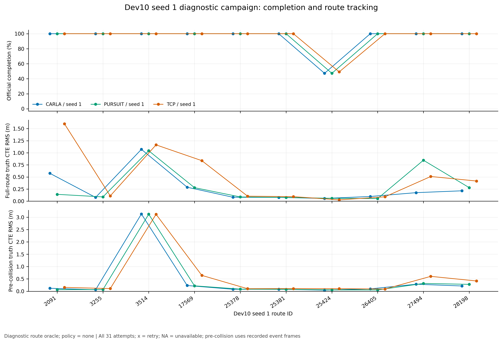
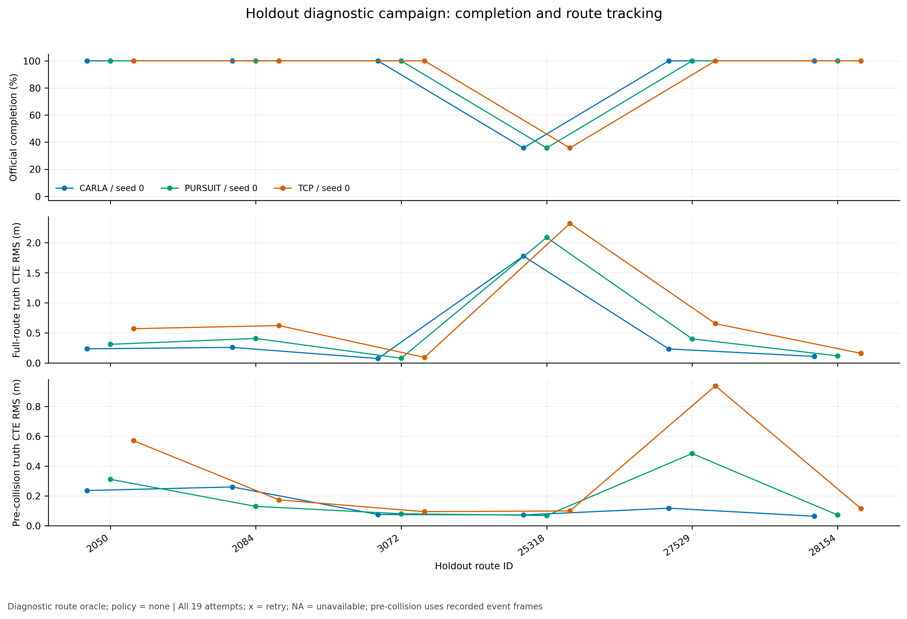

# 从定时轨迹到闭环控制：实验记录与文章素材

状态：v1已冻结为完整证据基线；两轮Dev10、6条保留集、坡道和补充真实S弯均已结束。没有合格的新默认配置；独立v2开发继续。这里集中记录可写进文章的证据、反例和数据来源。

## 已验证的部分

控制器采用固定参数，输入为后轴坐标系中的20个二维点，时间从+0.25s到+5s；轨迹5Hz更新，控制20Hz执行。
CARLA与TCP的PID（比例、积分、微分反馈）保留各自离散语义；pursuit为独立几何控制，不叠加目标点角度PID。
所有横向主指标采用后轴到参考路径的法向距离，RMS表示均方根，p95表示绝对误差第95百分位。

标定车辆为stock CARLA0.9.15的MKZ2020：轴距2.86047149m，后轴相对actor原点偏移−1.38863322m，
前轮最大转角约70°。转向曲线横轴已通过活体探针验证为km/h。完整physics与失效响应均保留，
没有用一次单位验证声称轮胎动力学已被准确建模。

| 离线解析参考实验 | CARLA | TCP | pursuit |
|---|---:|---:|---:|
| R20m、6m/s圆弧稳态横向RMS(m) | 0.46707 | 0.15458 | 0.00906 |
| 原定0.2m门槛 | 失败 | 通过 | 通过 |

这是带纵向加速度/阻力的理想自行车模拟，不能替代真实CARLA测试。近时段速度窗口下pursuit停点误差−0.0284m；
原0.25–1s窗口提前约5.09m停车。原pure-pursuit-plus-bearing-PID在同一离线条件下约0.1284m，
独立pursuit约0.00852m：相加明显更差，但两者均低于0.2m，不能把结果写成“相加必然失稳”。
[完整离线汇总](results/offline-selftest.json)。

## 初始四条无交互CARLA开发集

所有12个实验均驶到终点；CARLA与pursuit在4条开发路线通过当前G2门槛，TCP在26966未通过横向与巡航速度门槛。
真值投影由独立验证器计算，未回灌控制。速度列使用真值剩余路程定义巡航段并预先排除起步5s；全程速度误差也保留在JSON。
停车保持均覆盖完整5s；此表的停车位置接近平地，真正坡道测试单独报告。

| route | preset | 横向RMS(m) | 横向p95(m) | 巡航速度RMS(m/s) | 融合定位p90(m) | 5s停车位移(m) | G2 |
|---|---|---:|---:|---:|---:|---:|---|
| 1773 | carla | 0.0399 | 0.0701 | 0.2212 | 0.1888 | 0.000975 | 通过 |
| 1773 | tcp | 0.1101 | 0.2377 | 0.1838 | 0.1953 | 0.000587 | 通过 |
| 1773 | pursuit | 0.0459 | 0.0779 | 0.2216 | 0.1912 | 0.000517 | 通过 |
| 24240 | carla | 0.1285 | 0.2418 | 0.2264 | 0.1698 | 0.000501 | 通过 |
| 24240 | tcp | 0.1646 | 0.3639 | 0.1903 | 0.1707 | 0.000364 | 通过 |
| 24240 | pursuit | 0.0993 | 0.1769 | 0.2265 | 0.1674 | 0.000885 | 通过 |
| 26966 | carla | 0.2015 | 0.4415 | 0.2206 | 0.3657 | 0.000381 | 通过 |
| 26966 | tcp | 0.7028 | 1.5254 | 0.6962 | 0.4242 | 0.000353 | 失败 |
| 26966 | pursuit | 0.3422 | 0.9827 | 0.2666 | 0.3923 | 0.000478 | 通过 |
| 25854 | carla | 0.1144 | 0.2701 | 0.2343 | 0.1882 | 0.000916 | 通过 |
| 25854 | tcp | 0.1240 | 0.2782 | 0.1961 | 0.1917 | 0.000399 | 通过 |
| 25854 | pursuit | 0.1113 | 0.2534 | 0.2203 | 0.1886 | 0.000448 | 通过 |

pursuit在26966的p95为0.9827m，接近1m门槛，不能称作有很大余量。
[完整G2指标](results/development3-summary.json)、[之前一轮开发结果](results/development2-summary.json)。

## 保留失败和中间版本

| 阶段 | 原始目录 | 应如何使用 |
|---|---|---|
| 旧smoke/runtime基线 | `/data/runs/b2d/controller/baseline` | 开发前tracked diff；旧行为与本轮代码不能混合归因 |
| 车辆几何/响应 | `calibration`、`calibration-units` | 完整physics、转向探针、IMU符号；失效10m/s右转样本保留但不拟合 |
| 首次实车开发 | `development` | 1773到终点后汇总器因nullable速度出错；不是完整比较 |
| 第二次开发 | `development2` | 验证器在4.95s误判9例blocked；12例原轨迹全部保留 |
| 最终开发验证 | `development3` | 修复验证器后重跑的12例；不得拿最好的路线拼成一轮 |
| 完整smoke | `smoke` | pursuit2390官方completion100、score100，216tick；仅route诊断 |
| Dev10首轮 | `dev10` | 3preset×10route、seed0已结束；所有失败/重试计入 |
| 第一、第二版图片 | `figures`、`figures-v2` | 当时已完成部分的快照；不会覆盖为最终图 |

除第一行外目录均相对于`/data/runs/b2d/controller/`。早期开发不是每次都保存了逐文件源码快照；
只能按已有commit、diff和阶段日志说明版本，不能事后声称所有失败尝试都具备精确源码存档。
Dev10运行中的9个核心源码已核验与启动commit18571c0一致；当时补拍的快照在`dev10/provenance-retrospective`，
明确标记为事后/运行中捕获。后续campaign在启动前复制源码、配置与路线，并拒绝复用非空输出目录。

## 文章需要保留的边界

1. 这是使用dense route的控制诊断，没有避障、让行或信号灯规划，policy=none。官方记录的分数不是模型或排行榜成绩。
2. 初始或碰撞后的路线偏移会使当前位置到首个轨迹点的连接段变长，轨迹推导速度可高于配置8m/s。
   Dev10的reference speed是输入轨迹的导数；不能称为独立的真实巡航速度，也不能把全部误差归因于PID。
3. 官方内置4000tick的TickRuntime与人为测试cap分别记录；前者仍作为失败计入全部路线分母。
4. MinimumSpeed按锁定版本属于unused扣分项。保留事件数与percentage，但不能从事件数推断实际扣分。
5. 同一server跨preset复用；正常world reset仍由官方evaluator执行。崩溃重试的部分日志和额外成本不能删除。
6. Tokyo单3090、窗口模式、front3、800×450、5Hz相机、无模型推理的耗时，不能直接替代GPUbox真实模型成本。
7. seed0/1指TrafficManager随机种子。vendor的CarlaDataProvider固定种子2000未变；全局Python/NumPy与传感器噪声种子未显式覆盖。
   两轮不是对所有随机源的完整重采样，详见[随机性记录](results/randomness-protocol.json)。

## 复现与出图

使用[scripts/b2d_controller_plot.py](../../scripts/b2d_controller_plot.py)读取原始trace与report，生成英文PNG(300dpi)、
矢量PDF、CSV及source manifest（输入和代码的SHA256目录）。每次出图使用新的输出目录；最初版本也保留。
汇总工具为[scripts/b2d_controller_compare.py](../../scripts/b2d_controller_compare.py)，原始证据索引工具为
[scripts/b2d_controller_archive.py](../../scripts/b2d_controller_archive.py)。完整两seed与保留集表见本页末尾的v1归档，早期快照继续保留。

## 第一轮完整对照与图

Dev10 seed0三组全部完成评测，使用9个与18571c0逐字节一致的核心源文件。均9/10驾驶完成；
25424施工障碍路线均触发官方TickRuntime。碰撞后约180s内，车辆真实移动不到0.2m、横向偏差很小，
支持中心线被障碍阻断，不能把它简单归因为跟丢路线；详细frame与真值证据见[失败分析](results/failure-analysis.json)。

用户在观看第二seed的2091路口场景时指出，每次停滞前都在十字路口发生撞车。这是现场观察记录；
首轮三个preset的事件帧与碰撞后约178–179s低进展提供了独立日志证据。该例最终都完成，不等于碰撞无影响；
TCP碰撞后的横向恢复更差，控制与接触动力学的贡献仍标为无法完全分离。
第二seed的CARLA记录确认frame7590为自车与`vehicle.audi.tt`碰撞，不能描述为仅背景车互撞。
事件本身不提供责任判定，也不能排除背景车此前碰撞。当前`policy=none`，TCP指控制器适配版本而非TCP神经网络；
没有路口让行和避碰规划，碰撞不能单凭事件归咎横向PID精度。

| preset | 驾驶完成 | 平均completion(%) | 全程路线均值横向RMS(m) | 碰撞前路线均值横向RMS(m) | attempt总wall(s) |
|---|---:|---:|---:|---:|---:|
| CARLA | 9/10 | 94.726 | .2711 | .4350 | 339.1 |
| TCP | 9/10 | 94.914 | .4947 | .5449 | 367.9 |
| pursuit | 9/10 | 94.726 | .2951 | .4344 | 342.0 |

pursuit全程横向误差未优于CARLA，平均completion又略低于TCP，因此本轮不满足默认替代条件。
第二seed与保留集继续按冻结配置验证，而不是用这些结果回头调参数。
完整[逐路线表](results/dev10-seed0/routes.csv)、[全部attempt](results/dev10-seed0/attempts.csv)、
[机器可读比较](results/dev10-seed0/comparison.json)、[原始文件哈希目录](results/dev10-seed0-file-index.json)。

四条开发路线同时展示，TCP的26966失败不排除。pursuit在该路线接近横向p95门槛；定位则全部达到预定目标。

26966在出图脚本中固定作为解释用例。完整轨迹显示TCP在转弯后继续摆动，pursuit有一次较大转弯偏移，CARLA在此例误差更小。

停车图保留起步、接近终点和保持全过程。通过保持门槛不能代替停车位置或完整路线跟踪门槛。

十条路线全部进入图；右侧同时呈现全程与首次碰撞前的误差，重试另标。大量交互失败及长时间停滞使“全程RMS较小”本身不能代表更好的驾驶。
每张图的矢量PDF、精确CSV与输入/源码快照位于[图片目录说明](figures/g2-and-dev10-seed0/README.md)。

这张离线图将速度窗口与原角度PID相加式分别消融，避免一次改变两个变量。
原始49个用例的13,726条逐tick轨迹保存在`offline-traced`，重新汇总除CPU计时外与旧结果逐项精确相同；
[核验记录](results/offline-trace-verification.json)、[PDF](figures/offline/offline-ablations.pdf)、
[来源与代码哈希](figures/offline/provenance.json)。复现脚本为[scripts/b2d_controller_offline_plot.py](../../scripts/b2d_controller_offline_plot.py)。

## 两轮Dev10配对结果

以下60个官方结果全部保留，另有两次基础设施失败尝试。三个preset在两轮均9/10完成；
同一个施工路线超时，且路口碰撞停滞在两轮都出现。两个TrafficManager seed的结果非常接近，
这不能被解释为充分覆盖了场景和传感器随机性。

| preset | seed | 完成 | 平均completion(%) | 全程路线均值横向RMS(m) | 碰撞前路线均值横向RMS(m) |
|---|---:|---:|---:|---:|---:|
| carla | 0 | 9/10 | 94.726 | 0.27114 | 0.43505 |
| tcp | 0 | 9/10 | 94.914 | 0.49474 | 0.54489 |
| pursuit | 0 | 9/10 | 94.726 | 0.29507 | 0.43444 |
| carla | 1 | 9/10 | 94.726 | 0.27117 | 0.43505 |
| tcp | 1 | 9/10 | 94.914 | 0.49458 | 0.54489 |
| pursuit | 1 | 9/10 | 94.726 | 0.29507 | 0.43444 |

**不推荐默认替代。** 对CARLA，pursuit的横向误差约高8.8%，没有达到降低20%的预定条件；
对completion稍高的TCP，pursuit两轮平均completion都低0.188个百分点，虽横向更准也不满足“completion不降低”。
CARLA自身未过G1的.2m理想圆弧门槛，TCP未过G2，因此保留CLI兼容默认`carla`并不等于宣布它通过了全部验收。
后续继续显式选择preset：先在独立v2开发修正轨迹适配与控制反馈，再固定同一真实planner做对照；当前没有一个新的全门槛默认推荐。

[完整60行表](results/dev10-both-seeds/routes.csv)包含分数、事件、速度、定位、计时与数据质量字段；
[全部62次attempt](results/dev10-both-seeds/attempts.csv)保留两次server崩溃；
[配对与按tick/route汇总](results/dev10-both-seeds/comparison.json)。
第二轮17569的首次尝试在产出telemetry前遇到server rc139，图的source manifest明确记录缺失，不把它算作零误差。

第二seed与首轮呈现相同主要排序。所有路线和额外重试都进入CSV，首碰撞前指标与全程指标不互相替代。
[矢量图、精确数据与来源](figures/dev10-seed1/README.md)。

## v1完整归档：保留集、坡道与真实S弯

v1按冻结控制代码完成了两轮Dev10的60条、预先固定保留集的18条，共**78个官方路线结果、81次attempt**。
其中69个route×preset×seed结果达到completion100；3次基础设施失败尝试原样保留。三个dataset/seed组分别比较，
不把Dev10与保留集合并成一个供调参使用的平均分。所有attempt wall合计2765.9s；这是route subprocess总耗时，
不包括全部server启动、场景准备、排队以及独立开发/标定成本，不能当完整项目wall或220路线成本。

完整[78行正式结果](results/v1-full/routes.csv)、[81行全部attempt](results/v1-full/attempts.csv)、
[分组/配对/缺失字段及来源](results/v1-full/comparison.json)、[阅读版](results/v1-full/comparison.md)。
前面的seed0和两seed版本均继续保留，没有改写为最终版本。

### 六条预先固定的保留路线

| preset | 完成 | 平均completion(%) | 全程路线均值CTE RMS(m) | 首碰撞前路线均值CTE RMS(m) | 碰撞事件 | attempt wall(s) |
|---|---:|---:|---:|---:|---:|---:|
| carla | 5/6 | 89.2817 | 0.44881 | 0.13730 | 6 | 201.7 |
| tcp | 5/6 | 89.2817 | 0.73725 | 0.33191 | 6 | 247.1 |
| pursuit | 5/6 | 89.2817 | 0.56793 | 0.19087 | 6 | 212.7 |

三组均在25318官方TickRuntime终止，其余5条完成；未补造这些失败的控制/场景责任归因。pursuit全程CTE均值比CARLA高约26.5%，
没有在保留集体现替代优势。completion相同也不表示碰撞与跟踪行为相同。此集合只验收，不回头用它调整v2参数。

pursuit/2084第一次attempt在产生control telemetry之前遇到server rc139，19s成本保留；重启后的第二次完成。
这使保留集共有19次attempt。图的source manifest明确列出第一attempt的缺失telemetry，不能将其算作0误差。
加上两轮Dev10的两次基础设施失败，v1官方campaign总计3次额外attempt。

[矢量PDF](figures/v1-holdout/campaign-completion-tracking.pdf)、[精确CSV与完整输入/源码provenance](figures/v1-holdout/README.md)。
图只包含该保留集，未将相同seed编号的Dev10混入；全程和首次碰撞前CTE分列，失败路线不剔除。

### 实际坡道静止保持

Town04 road34/lane2/s70处，车辆实际pitch中位6.35699°，约11.14%坡度；101个样本覆盖5.00000007s，
后轴最大两两3D位移与最大速度均为记录的0，没有反向样本，坡道保持gate通过。
[原始摘要](results/v1-full/slope-summary.json)保留client/server0.9.15、地点、实际车辆姿态、参数和全部检查。

这是pursuit接受全零静止轨迹后的**制动保持诊断**，使用特权真值且车辆先settle；没有测试坡道接近/制动停车，也不构成sensor-score合规证据。
原始101帧与尝试位于`/data/runs/b2d/controller/confirmation/slope/`，在confirmation原始索引中保留。

### 补充真实S弯17563，6m/s

为检查此前开发几何覆盖不足，用冻结v1代码补跑Town12/17563真实S弯，去除交通交互；三组均到终点且无碰撞。
这条是新增开发诊断，不是原6条保留集。以下失败如实保留，**到终点不等于G2通过**。

| preset | 全程CTE RMS(m) | abs CTE p95(m) | 独立巡航速度RMS(m/s) | fused pose p90(m) | 停点误差(m) | 未通过gate |
|---|---:|---:|---:|---:|---:|---|
| carla | 0.18895 | 0.52028 | 0.66327 | 0.20564 | 0.22029 | cruise_speed |
| tcp | 0.90514 | 1.89419 | 0.92157 | 0.29189 | 0.88602 | lateral RMS、lateral p95、cruise_speed |
| pursuit | 0.18905 | 0.44233 | 0.63632 | 0.20818 | 0.26593 | cruise_speed |

巡航速度门槛仍为0.5m/s，不能因为差距较小而改成通过。严格按旧validator口径重算：独立真值参考≥5.9m/s且elapsed≥5s，
误差取实际速度减配置6m/s，三组318/303/319个样本的RMS与原summary**精确相同**。
因此这不是report把controller trajectory derivative误当6m/s而产生的假失败。

CARLA/pursuit在该已排除起步的巡航段均速分别5.5924/5.5948m/s，约50.6%/47.0%样本低于5.5m/s；
对应target command均值6.0624/6.0089m/s。两者表现主要为速度不足与波动，不能简单用“首段桥接抬高目标”解释全部失败。
两者约24%的巡航tick有制动，其中满制动约9.1%/10.7%；这些动作是后续检查离散纵向响应的线索，尚不构成单独因果证据。
TCP均速6.2394m/s、target均值6.7783m/s，兼有超速和明显横向误差；控制、轨迹桥接和plant响应在现有闭环中未完全分离。
[完整S弯摘要](results/v1-full/s-curve-summary.json)、[严格速度口径复算及原始SHA256](results/v1-full/s-curve-speed-analysis.json)。

### 原始封存与后续边界

confirmation与development-s-v1均有completed结束事件，所记录server PID已不存活，索引期间文件未变化：
[confirmation索引](results/raw-file-index/confirmation-v1.json)覆盖679个文件/90,391,035字节，
[真实S弯索引](results/raw-file-index/development-s-v1.json)覆盖62个文件/4,057,665字节。
索引包含原始轨迹、控制、验证trace、官方事件、失败attempt、源码与输入快照；没有因为最后补跑失败而删除材料。

**v1冻结为基线，没有合格的新默认。** 两轮Dev10和保留集都没有支持pursuit达到预定替代条件，新增S弯还揭示三组共同的速度门槛失败。
既有CLI兼容默认carla不等于全门槛推荐。v2在独立worktree继续开发，先处理route-origin桥接与定时轨迹边界，
再进行预先列出的additive/max lookahead单变量比较；不修改v1结果，也不拿保留集回头调参。
