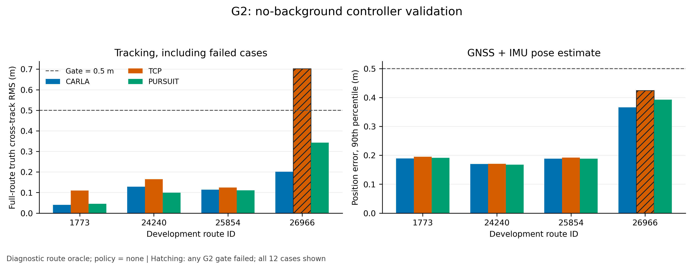
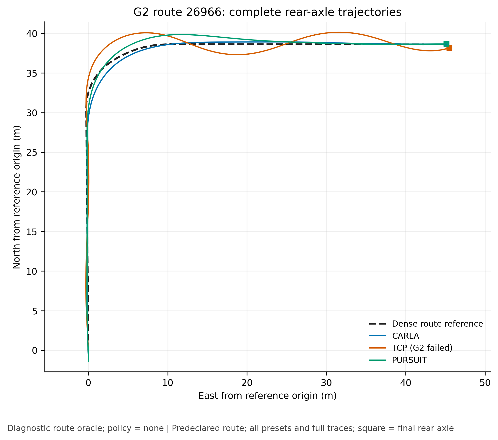
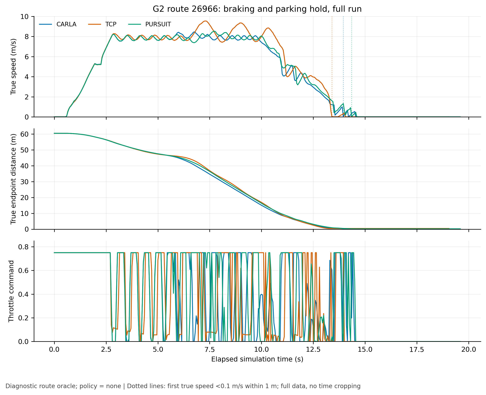
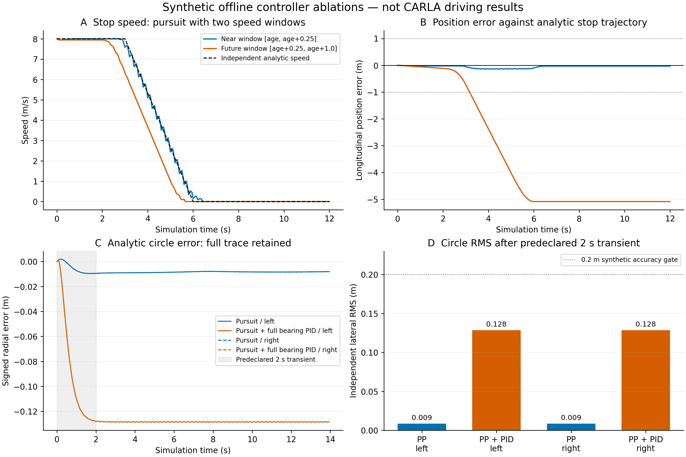

# 从定时轨迹到闭环控制：实验记录与文章素材

状态（2026-09-23 JST）：保留各阶段实验与反例；v4开发矩阵已完成，正式路线验收仍未完成，尚未推荐新默认。本文早期表格是对应版本的历史结果，不能与后续配置混为一轮。

## 已验证的部分

控制器采用固定参数，输入为后轴坐标系中的20个二维点，时间从+0.25s到+5s；轨迹5Hz更新，控制20Hz执行。
CARLA与TCP的PID（比例、积分、微分反馈）保留各自离散语义；pursuit为独立几何控制，不叠加目标点角度PID。
所有横向主指标采用后轴到参考路径的法向距离，RMS表示均方根，p95表示绝对误差第95百分位。

标定车辆为stock CARLA0.9.15的MKZ2020：轴距2.86047149m，后轴相对actor原点偏移−1.38863322m，
前轮最大转角约70°。转向曲线横轴已通过活体探针验证为km/h。完整physics与失效响应均保留，
没有用一次单位验证声称轮胎动力学已被准确建模。

| 离线解析参考实验 | CARLA | TCP | pursuit |
|---|---:|---:|---:|
| R20m、6m/s圆弧稳态横向RMS(m) | 0.46707 | 0.15458 | 0.00906 |
| 原定0.2m门槛 | 失败 | 通过 | 通过 |

这是带纵向加速度/阻力的理想自行车模拟，不能替代真实CARLA测试。近时段速度窗口下pursuit停点误差−0.0284m；
原0.25–1s窗口提前约5.09m停车。原pure-pursuit-plus-bearing-PID在同一离线条件下约0.1284m，
独立pursuit约0.00852m：相加明显更差，但两者均低于0.2m，不能把结果写成“相加必然失稳”。
[完整离线汇总](results/offline-selftest.json)。

## 无交互CARLA开发集

所有12个实验均驶到终点；CARLA与pursuit在4条开发路线通过当前G2门槛，TCP在26966未通过横向与巡航速度门槛。
真值投影由独立验证器计算，未回灌控制。速度列使用真值剩余路程定义巡航段并预先排除起步5s；全程速度误差也保留在JSON。
停车保持均覆盖完整5s；此表的停车位置接近平地，真正坡道测试单独报告。

| route | preset | 横向RMS(m) | 横向p95(m) | 巡航速度RMS(m/s) | 融合定位p90(m) | 5s停车位移(m) | G2 |
|---|---|---:|---:|---:|---:|---:|---|
| 1773 | carla | 0.0399 | 0.0701 | 0.2212 | 0.1888 | 0.000975 | 通过 |
| 1773 | tcp | 0.1101 | 0.2377 | 0.1838 | 0.1953 | 0.000587 | 通过 |
| 1773 | pursuit | 0.0459 | 0.0779 | 0.2216 | 0.1912 | 0.000517 | 通过 |
| 24240 | carla | 0.1285 | 0.2418 | 0.2264 | 0.1698 | 0.000501 | 通过 |
| 24240 | tcp | 0.1646 | 0.3639 | 0.1903 | 0.1707 | 0.000364 | 通过 |
| 24240 | pursuit | 0.0993 | 0.1769 | 0.2265 | 0.1674 | 0.000885 | 通过 |
| 26966 | carla | 0.2015 | 0.4415 | 0.2206 | 0.3657 | 0.000381 | 通过 |
| 26966 | tcp | 0.7028 | 1.5254 | 0.6962 | 0.4242 | 0.000353 | 失败 |
| 26966 | pursuit | 0.3422 | 0.9827 | 0.2666 | 0.3923 | 0.000478 | 通过 |
| 25854 | carla | 0.1144 | 0.2701 | 0.2343 | 0.1882 | 0.000916 | 通过 |
| 25854 | tcp | 0.1240 | 0.2782 | 0.1961 | 0.1917 | 0.000399 | 通过 |
| 25854 | pursuit | 0.1113 | 0.2534 | 0.2203 | 0.1886 | 0.000448 | 通过 |

pursuit在26966的p95为0.9827m，接近1m门槛，不能称作有很大余量。
[完整G2指标](results/development3-summary.json)、[之前一轮开发结果](results/development2-summary.json)。

## 保留失败和中间版本

| 阶段 | 原始目录 | 应如何使用 |
|---|---|---|
| 旧smoke/runtime基线 | `/data/runs/b2d/controller/baseline` | 开发前tracked diff；旧行为与本轮代码不能混合归因 |
| 车辆几何/响应 | `calibration`、`calibration-units` | 完整physics、转向探针、IMU符号；失效10m/s右转样本保留但不拟合 |
| 首次实车开发 | `development` | 1773到终点后汇总器因nullable速度出错；不是完整比较 |
| 第二次开发 | `development2` | 验证器在4.95s误判9例blocked；12例原轨迹全部保留 |
| 最终开发验证 | `development3` | 修复验证器后重跑的12例；不得拿最好的路线拼成一轮 |
| 完整smoke | `smoke` | pursuit2390官方completion100、score100，216tick；仅route诊断 |
| Dev10首轮 | `dev10` | 3preset×10route、seed0已完成；各9/10驾驶完成，所有失败/重试计入 |
| 第一、第二版图片 | `figures`、`figures-v2` | 当时已完成部分的快照；不会覆盖为最终图 |

除第一行外目录均相对于`/data/runs/b2d/controller/`。早期开发不是每次都保存了逐文件源码快照；
只能按已有commit、diff和阶段日志说明版本，不能事后声称所有失败尝试都具备精确源码存档。
Dev10运行中的9个核心源码已核验与启动commit18571c0一致；当时补拍的快照在`dev10/provenance-retrospective`，
明确标记为事后/运行中捕获。后续campaign在启动前复制源码、配置与路线，并拒绝复用非空输出目录。

## 文章需要保留的边界

1. 这是使用dense route的控制诊断，没有避障、让行或信号灯规划，policy=none。官方记录的分数不是模型或排行榜成绩。
2. 初始或碰撞后的路线偏移会使当前位置到首个轨迹点的连接段变长，轨迹推导速度可高于配置8m/s。
   Dev10的reference speed是输入轨迹的导数；不能称为独立的真实巡航速度，也不能把全部误差归因于PID。
3. 官方内置4000tick的TickRuntime与人为测试cap分别记录；前者仍作为失败计入全部路线分母。
4. MinimumSpeed按锁定版本属于unused扣分项。保留事件数与percentage，但不能从事件数推断实际扣分。
5. 同一server跨preset复用；正常world reset仍由官方evaluator执行。崩溃重试的部分日志和额外成本不能删除。
6. Tokyo单3090、窗口模式、front3、800×450、5Hz相机、无模型推理的耗时，不能直接替代GPUbox真实模型成本。
7. seed0/1指TrafficManager随机种子。vendor的CarlaDataProvider固定种子2000未变；全局Python/NumPy与传感器噪声种子未显式覆盖。
   两轮不是对所有随机源的完整重采样，详见[随机性记录](results/randomness-protocol.json)。

## 复现与出图

使用[scripts/b2d_controller_plot.py](../../scripts/b2d_controller_plot.py)读取原始trace与report，生成英文PNG(300dpi)、
矢量PDF、CSV及source manifest（输入和代码的SHA256目录）。每次出图使用新的输出目录；最初版本也保留。
汇总工具为[scripts/b2d_controller_compare.py](../../scripts/b2d_controller_compare.py)，原始证据索引工具为
[scripts/b2d_controller_archive.py](../../scripts/b2d_controller_archive.py)。最终图与完整Dev10/保留集表在完成后加入本页。

## 第一轮完整对照与图

Dev10 seed0三组全部完成评测，使用9个与18571c0逐字节一致的核心源文件。均9/10驾驶完成；
25424施工障碍路线均触发官方TickRuntime。碰撞后约180s内，车辆真实移动不到0.2m、横向偏差很小，
支持中心线被障碍阻断，不能把它简单归因为跟丢路线；详细frame与真值证据见[失败分析](results/failure-analysis.json)。

用户在观看第二seed的2091路口场景时指出，每次停滞前都在十字路口发生撞车。这是现场观察记录；
首轮三个preset的事件帧与碰撞后约178–179s低进展提供了独立日志证据。该例最终都完成，不等于碰撞无影响；
TCP碰撞后的横向恢复更差，控制与接触动力学的贡献仍标为无法完全分离。
第二seed的CARLA记录确认frame7590为自车与`vehicle.audi.tt`碰撞，不能描述为仅背景车互撞。
事件本身不提供责任判定，也不能排除背景车此前碰撞。当前`policy=none`，TCP指控制器适配版本而非TCP神经网络；
没有路口让行和避碰规划，碰撞不能单凭事件归咎横向PID精度。

| preset | 驾驶完成 | 平均completion(%) | 全程路线均值横向RMS(m) | 碰撞前路线均值横向RMS(m) | attempt总wall(s) |
|---|---:|---:|---:|---:|---:|
| CARLA | 9/10 | 94.726 | .2711 | .4350 | 339.1 |
| TCP | 9/10 | 94.914 | .4947 | .5449 | 367.9 |
| pursuit | 9/10 | 94.726 | .2951 | .4344 | 342.0 |

pursuit全程横向误差未优于CARLA，平均completion又略低于TCP，因此本轮不满足默认替代条件。
第二seed与保留集继续按冻结配置验证，而不是用这些结果回头调参数。
完整[逐路线表](results/dev10-seed0/routes.csv)、[全部attempt](results/dev10-seed0/attempts.csv)、
[机器可读比较](results/dev10-seed0/comparison.json)、[原始文件哈希目录](results/dev10-seed0-file-index.json)。

四条开发路线同时展示，TCP的26966失败不排除。pursuit在该路线接近横向p95门槛；定位则全部达到预定目标。

26966在出图脚本中固定作为解释用例。完整轨迹显示TCP在转弯后继续摆动，pursuit有一次较大转弯偏移，CARLA在此例误差更小。

停车图保留起步、接近终点和保持全过程。通过保持门槛不能代替停车位置或完整路线跟踪门槛。

十条路线全部进入图；右侧同时呈现全程与首次碰撞前的误差，重试另标。大量交互失败及长时间停滞使“全程RMS较小”本身不能代表更好的驾驶。
每张图的矢量PDF、精确CSV与输入/源码快照位于[图片目录说明](figures/g2-and-dev10-seed0/README.md)。

这张离线图将速度窗口与原角度PID相加式分别消融，避免一次改变两个变量。
原始49个用例的13,726条逐tick轨迹保存在`offline-traced`，重新汇总除CPU计时外与旧结果逐项精确相同；
[核验记录](results/offline-trace-verification.json)、[PDF](figures/offline/offline-ablations.pdf)、
[来源与代码哈希](figures/offline/provenance.json)。复现脚本为[scripts/b2d_controller_offline_plot.py](../../scripts/b2d_controller_offline_plot.py)。

## 后续反馈迭代与当前验收边界（2026-09-23）

[第二轮完整实验记录](iteration-v2.md)保留轨迹起点/定时修复、additive与max前视比较、6m/s直路与S弯速度隔离，以及两次固定PI开发试验。
v2的20例有15例通过全部G2门槛；首个PI(Kp=1、Ki=.25)的18例有13例通过；降低到固定Kp=.5、Ki=.25后，v4的18例有17例通过。
三个数字均是开发gate通过数，不是官方成功率。v4的CARLA+共享PI与pursuit max分别通过全部六组条件，pursuit additive仍有一例横向门槛失败；完整矩阵不丢弃这一列。

[最终v4开发结果](results/development-v4-closed/summary.json)、[完整PI配对图表](results/pi-v4-figures-01/README.md)、
[开发raw索引](results/development-v4-file-index.json)与[绘图源码/哈希核验](results/pi-v4-figures-source-audit/README.md)提供对应证据。
max分支是开发集上选定的正式对照候选，CARLA参考同样使用PI(.5,.25)，TCP参考保留vendor纵向；不能把共享PI参考写成旧vendor CARLA。

随后定位集成修复的11项专项测试与126项完整测试通过，运动日志首次失败及修正记录也全部保留在[新验证目录](results/verification-v4-pose/README.md)。
软件测试和G2通过不替代正式场景验收。恢复smoke位于`/data/runs/b2d/controller/smoke-v4-recovery`；本笔记不预先声明其成功，也不把尚未齐备的G4组当最终对照。
原smoke失败尝试保留，正式参数不依据Dev10逐路线调整。

## 分数、驾驶完成与舒适性分别报告

锁定Bench2Drive版本的Driving Score由route completion乘infraction penalty组成；碰撞之外，还包括红灯、停车标志、出界和其他规则事件。
因此B2D并非只看碰撞。[固定版本统计源码](https://github.com/Thinklab-SJTU/Bench2Drive/blob/7ec25d1c9f7522d923ce5f3420986cef1cb2d956/leaderboard/leaderboard/utils/statistics_manager.py)。

本项目的driving_completed只表示官方completion达到100%。严格Success Rate的官方记录规则还要求状态为Completed或Perfect，且除min_speed_infractions外没有其他非空违规列表。
完整220聚合脚本的分母写死220；Dev10按10条计算时称“子集诊断SR”，不称官方full220成绩。驶到终点、无违规成功、harness结束和通过G2是四个不同概念。
[固定版本SR源码](https://github.com/Thinklab-SJTU/Bench2Drive/blob/7ec25d1c9f7522d923ce5f3420986cef1cb2d956/tools/merge_route_json.py)。

Driving Smoothness另由独立脚本根据加速度、jerk和yaw类指标计算，不直接进入上述DS公式。当前速度RMS≤.5m/s是本地跟踪验收门槛，不能用它代替官方舒适性；制动脉冲变小或换挡减少也不自动证明Smoothness分数提高。
[固定版本舒适性脚本](https://github.com/Thinklab-SJTU/Bench2Drive/blob/7ec25d1c9f7522d923ce5f3420986cef1cb2d956/tools/efficiency_smoothness_benchmark.py)。

后续日志补充完整真值运动学字段，并明确角速度单位和时间步，供分开的物理诊断及指定版本脚本复算。旧run缺少必要原始向量，不能事后用速度差分无损补出官方metric_info。
版本实现中的导数/单位疑点仅在[纵向分析附录](agents/v2-longitudinal.md)及[源码观察存档](results/scoring-source-observations/README.md)说明；不据此修改vendor，也不作为本文主要性能收益结论。
