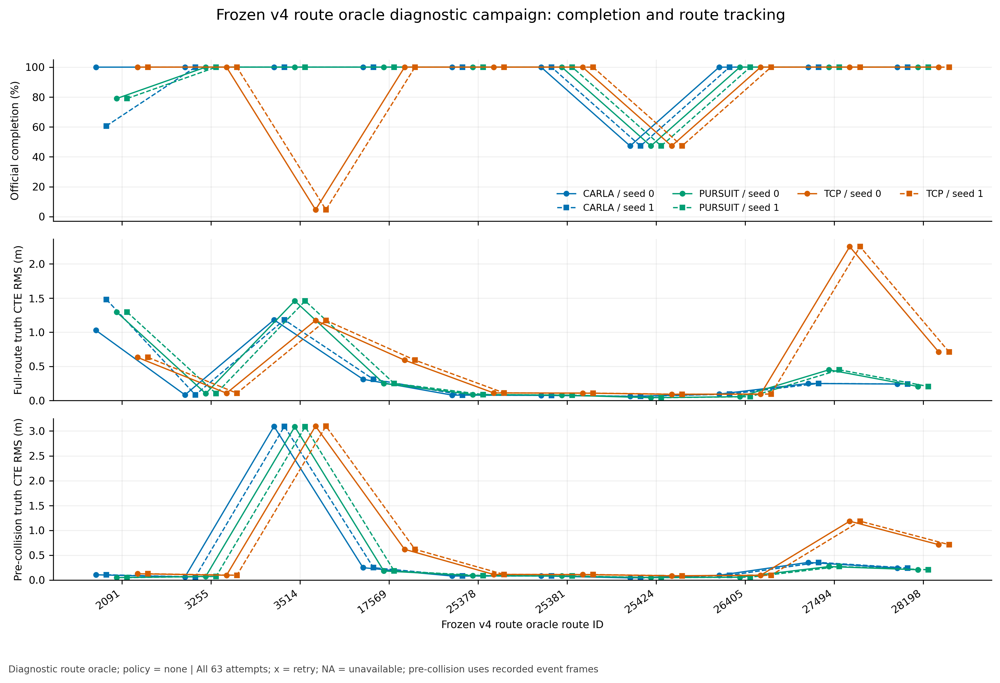

# 本轮结论：局部控制改善，未通过默认替代验收

2026-09-23，本轮实施、开发迭代、完整正式对照与证据整理完成。CLI默认仍为carla/vendor；
PI与pursuit max作为显式可选配置保留。公共轨迹定时和罗盘异常处理修复已经接入，不能把“保留preset默认”理解为整个agent字节不变。
当前没有真实模型上的新旧控制器对照证据。

## 驾驶表现的结论

v2修复了ego原点与首个未来点之间的错误速度语义；v3/v4基于真实CARLA反馈，
把纵向PI（比例与积分反馈）Kp从1降至.5、Ki固定.25。最终候选在包含真实S弯与6m/s直线的六项G2开发条件全部通过。
18对v3/v4全程案例中，按案例等权的纵向加速度RMS下降21.5%、纵向jerk（加速度变化率）RMS下降25.9%，
但横向加速度RMS上升2.0%。这支持分项改善，不支持“全面更舒适”。

正式Dev10中候选DS高于CARLA＋PI，但候选16/20驶完全程、参考17/20；
全程CTE（真实后轴至原路线的横向距离）路线等权RMS为.402600m对.363227m，反而高10.84%。
Driving Score不直接包含加速度/jerk，不能代替跟踪、舒适性和任务完成度。所有结果均为policy=none路线诊断，
不是TCP神经网络、完整220路线或可提交的leaderboard成绩。

## 完整正式结果

| 配置 | TM seed | 驶完全程 | 平均completion，% | 记录DS均值 | 子集诊断SR |
|---|---:|---:|---:|---:|---:|
| CARLA横向＋PI | 0 | 9/10 | 94.726 | 54.293 | 10% |
| CARLA横向＋PI | 1 | 8/10 | 90.790 | 53.330 | 10% |
| TCP vendor preset | 0 | 8/10 | 85.186 | 55.512 | 20% |
| TCP vendor preset | 1 | 8/10 | 85.186 | 55.512 | 20% |
| pursuit max＋PI | 0 | 8/10 | 92.627 | 59.147 | 20% |
| pursuit max＋PI | 1 | 8/10 | 92.627 | 59.147 | 20% |

正式60行采用每条首个harness-finished的结果，另保留3次CARLA rc139加载失败，共63次attempt。
平均completion是路线进度均值，驶完全程是到100%的数量；子集SR采用官方记录状态/事件语义但分母为10。
它们与DS各有含义，不能混用。CARLA参考在正式结果前固定为横向PID＋同一PI .5/.25；TCP保留vendor纵向，
pursuit采用max前视＋PI .5/.25。三组都使用同一公共适配器。

G4不通过：候选seed0平均completion低于最强参考2.099个百分点，未完成2条对1条；
两seed的全程横向均值未达到降低20%的门槛。trajectory-reference速度RMS仅增加.011195m/s，满足+.1门槛，
但该指标包含碰撞停滞对轨迹导数的偏离，不是独立巡航速度或官方舒适性。
[完整G4审计](results/formal-v4-g4/FINAL-AUDIT.md)、[60行/63次完整对照](results/formal-v4-comparison/comparison.md)。

图中的CARLA指CARLA横向＋PI，PURSUIT指max＋PI，TCP指控制器vendor preset。全程和首次碰撞前均保留，
不替换主门槛来挑选有利片段；3514的初始大偏移也没有删除。底图是数值轨迹证据，不是录制视频。
[PNG/PDF、全部attempt CSV和来源](figures/formal-v4/README.md)。

## 失败及数据质量

11条未完成都达到官方4000tick的TickRuntime：6条施工25424、2条TCP/3514和3条路口2091，均有碰撞与长时间低速。
官方blocked/deviation事件为0并不等于没有实际卡住。碰撞前错误、碰撞后负速度导致的保护动作与最终超时分开记录。
候选2091在超时前已恢复行驶；CARLA第二seed也受后续交通接触影响而超时。
同路线/TM seed没有固定全部随机源，实际背景车配置可不同，不能从这些结果单独推断事故物理责任或控制器因果优劣。
[逐路线归因与事件帧](results/v4-formal-failure-audit/README.md)。

正式68142帧无pose-degraded、invalid_pose、stale或无效控制输出；碰撞后invalid_motion另列。
三次基础设施失败无控制telemetry，报告为缺失，不填零。原始904文件/191186801字节在
[正式全文件索引](results/raw-file-index/formal-v4.json)，原始目录为/data/runs/b2d/controller/formal-v4。

## 验证与偏离

| 层次 | 结果与限制 |
|---|---|
| 回归测试 | 126项通过，日志见results/verification-v4-pose；不因仅文档改动重复跑测试 |
| 精确候选G1 | 补充16/16合成检查通过；发生在正式启动后，非事前验证；原14项PI G1使用additive |
| 无交互G2 | 候选max＋PI及CARLA横向＋PI各6/6；additive pursuit为5/6 |
| 集成G3 | 恢复版2390完成100/DS100，213帧，一帧compass NaN预测后恢复；两次旧失败均保留 |
| 正式G4 | 两seed/三配置/10路线完整，未通过默认替代条件 |
| 坡道 | Town15实际坡度绝对值6.642°，101样本/5s静态hold，3D后轴位移与速度均0；不验证坡道接近停车 |
| 材料G5 | 数据、图、源码/配置哈希与本地提交完成；GitHub推送待用户完成登录 |

v2分析曾提出的两种前视各五条seed1开发复跑没有执行；Dev10两个TM seed不是同一种G2覆盖。
该遗漏不标为通过。候选已不满足正式采纳条件，本轮不追加这10例或条件性的v4保留集复验。
v1保留集已有完整数据，后续复跑也只能叫确认，不能冒称未见测试。完整协议偏离见[迭代记录](iteration-v2.md)。

## 耗时、版本与下一步

正式campaign从manifest开始到结束事件为2247.413s（37.46min），63次attempt合计2194.8s。
控制计算各组p99为.253–.256ms。统计不包含最后server.stop，无模型推理；不能外推真实TCP或full220成本。
[成本表、全部attempt和复现代码](results/formal-v4-cost/README.md)。

主要运行版本：v2轨迹9462b6e，v3 PI 06669a9，v4增益d140e30，原始motion日志a1b50ed，
罗盘修复1ee2eb2，正式配置/运行归档2cca3a9。后续文档提交不代表更换了实验中的控制源字节。
最终交付核验见[904个原始文件、审计输出与成本输入哈希复核](results/final-delivery-verification/verification.json)。
完整工程入口见[使用文档](../../docs/b2d-controller.md)；所有中间材料见[目录](README.md)。

下一阶段目标是直接验证真实TCP的驾驶表现：固定checkpoint、原生轨迹预测和转向、输入与20Hz推理节拍，
先做纵向vendor/PI两组、三路线，共6例。两组必须采用一致执行限制；官方原版锚点另计。
原生4×.5s预测不能虚构补成5s，完整pursuit接入另需坐标/原点和有限时域接口确认。
[已完成的真实TCP接入方案](agents/tcp-controller-integration-plan.md)尚未执行新模型对照；
单计仿真预计24–36min，接入和验证另算。
