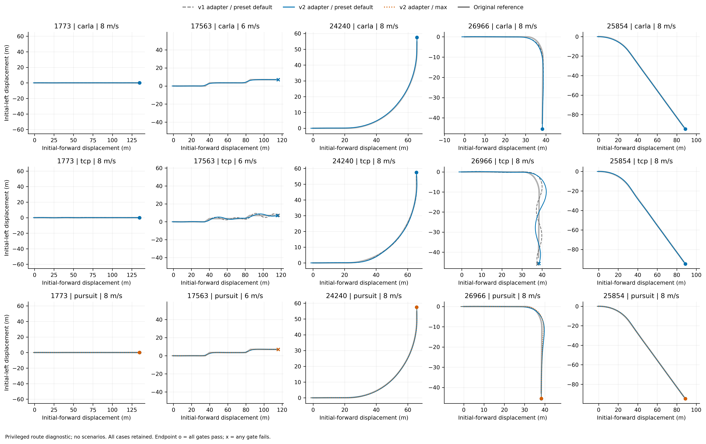
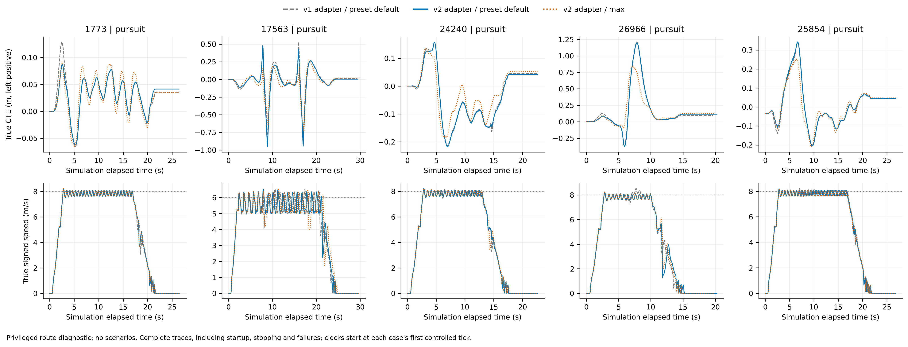
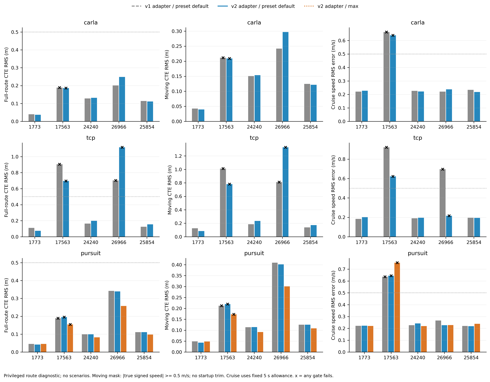
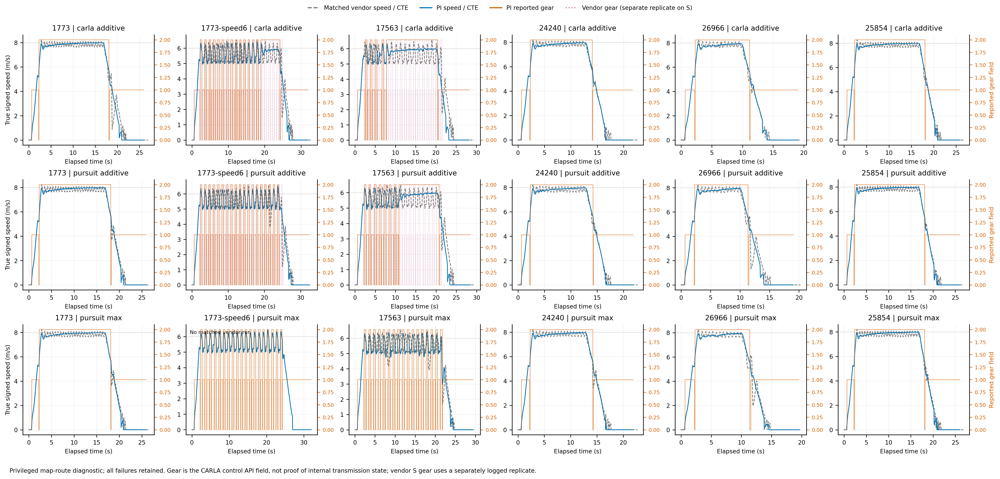

# 第二轮：轨迹定时修复与闭环反馈

状态：v4正式60条对照与坡道检查完成，未通过默认替代验收。所有版本原始结果保留；[最终结论](final-report.md)。

用户指出第一轮跑完不能等于优化完成。这一轮把闭环（动作影响下一时刻车辆状态的反馈实验）发现的问题拆开验证，
先修输入轨迹定时，再比较lookahead（取前方多远的目标点），最后隔离纵向速度波动。开环姿态重放只验证几何/接口，不能替代实车仿真验收。

## 轨迹起点与时间语义

原adapter（将空间路线转为未来定时轨迹的模块）从路线投影点开始，但controller在t=0补入实际ego原点，
导致起点偏移被解释成0.25s内应完成的位移。v2从估计后轴位置与heading生成6–18m的重接路径，
然后按弧长定时。原dense route保持不变，用于独立真值CTE（后轴到原参考路径的横向距离）测量。

实现冻结为`9462b6e`。它修复了速度膨胀，但也改变了输入路径几何，因此不能把全部差异称为控制器本身的提升。
曲率上限只是几何诊断；不满足会留日志，不能据此宣称已验证轮胎动力学可行。

[几何与时序重放](results/v2-rejoin-replay/README.md)保留所有输出、源文件与输入哈希。
该离线重放统一用6m/s，是敏感性/耗时测试，与原四条8m/s开发基线不是配对驾驶成绩。
实际闭环矩阵仍保持四条8m/s及S弯17563为6m/s，没有降低速度换取横向成绩。

## 20例真实闭环结果

一台CARLA进程完成五条路线、四组配置；同地图复用世界，每例重建车辆、定位与controller状态。
10043个tick没有错帧、stale或无效运动输入；20例都到终点且通过停车保持。最大终点误差.2813m，最大停车位移.001484m。
最终15/20通过全部门槛；全部失败都保留，不能把驾驶完成数当验收通过数。

| 对比 | v1 | v2原前视 | v2短前视max |
|---|---:|---:|---:|
| pursuit急弯26966 CTE RMS，m | .34225 | .33906 | .25819 |
| pursuit S弯17563 CTE RMS，m | .18905 | .19543 | .15432 |
| pursuit S弯独立巡航速度RMS，m/s | .63632 | .64440 | .75473 |
| TCP急弯26966 CTE RMS，m | .70278 | 1.11613 | 不适用 |

v1与v2原配置均为11/15通过；短前视pursuit为4/5。S弯全部速度门槛仍失败；TCP的S弯和急弯横向误差也失败。
短前视改善部分弯道，但没有得到合格新默认。TCP的退化与长重接路径削弱近处目标角反馈相容，不能只展示pursuit改善。

实线是真值后轴轨迹，保留全部停车与失败片段。左右转与交替曲率的S弯均实际覆盖，不能仅凭静态窗口印象判断路线是否转弯。

S弯速度波动在起点拼接修复后仍存在；8m/s的其他路线也有小幅周期波动。各曲线从本次驾驶首个受控tick计时，不能把同一秒当成相同路线进度。

门槛与此前一致。横向变好不能抵消速度门槛失败。每条完整case、指标定义、原始路径、SHA256与PDF在[图表索引](results/v2-figures-02/README.md)，
全文件封存在[原始索引](results/development-v2-file-index.json)。初版绘图`v2-figures-01`保留，修正legend后的`-02`用于正文。

## 速度与路线几何的隔离

随后以原参数在同一Town12复跑直线1773与S弯17563，全部改为6m/s；没有改controller gain。
额外读取上一tick已应用的控制量及API返回gear（挡位字段），仅写入真值诊断，不参与控制。

| 路线 | CARLA速度RMS | TCP速度RMS | pursuit速度RMS |
|---|---:|---:|---:|
| 1773直线，6m/s | .62849 | .61162 | .69169 |
| 17563 S弯，6m/s | .63028 | .62236 | .67315 |

六例均未通过.5m/s门槛。直线也出现速度波动，说明这不是S弯独有问题。
巡航中可观察到API返回gear按2→0→1→0→2循环，并伴随油门/制动交替；已应用踏板与上一tick命令一致。
证据支持强反馈与该速度区间的动力传动响应形成循环，不足以单独识别内部离合器机制或精确执行器延迟。
这里速度主表沿用validator的3D速度；分析若使用signed speed（沿车头方向的速度分量），需明确说明微小数值差异。

## 下一步，先固定候选再测

只增加一个明确命名的PI纵向候选，原vendor默认及其离散语义保留。误差使用m/s，固定Kp=1.0、Ki=.25，
连续积累积分但在同方向饱和时停止累加；制动保持与安全状态清除积分。不加入挡位特判、前馈或路线专用速度。
这两个增益是验证前固定的设计值，不是已经识别出的最优参数。

先检查加减速、延迟、饱和恢复与停车，再在相同五条开发路线和额外1773@6上跑18例：PI CARLA、PI pursuit原前视及短前视。
只用开发集选择；原Dev10与保留集不用于回调参数。通过后再冻结并做集成与正式路线回归，失败则保留证据并定位。

## 首个PI候选的实车反馈与唯一追加增益对照

固定Kp=1、Ki=.25的14例合成G1全部通过，减速段速度RMS=.04098m/s，停点误差−.03187m；
原vendor三组各600tick与冻结旧源码生成的黄金数据完全一致。实现冻结`06669a9`，102项回归测试通过。
该PI模式另明确拒绝大于.2s的运动输入间隔；正常.05s控制周期不受影响。

真实CARLA 18/18到终点，只有13/18通过全部门槛：

| 项 | PI CARLA | PI pursuit additive | PI pursuit max |
|---|---:|---:|---:|
| 1773@8速度RMS，m/s | .10161 | .10145 | .10133 |
| 1773@6速度RMS，m/s | .55228，失败 | .63940，失败 | .62710，失败 |
| 17563@6速度RMS，m/s | .27449 | .39958 | .65653，失败 |
| 26966横向p95，m | 通过 | 1.00227，失败 | 通过 |

PI改善了S弯原前视的速度，但没有普遍消除6m/s直线的波动；1.00227m也不能因接近1m而改成通过。
首个PI版无停车门槛退化。全部逐帧、配对数据、来源与图在[PI图表索引](results/pi-figures-01/README.md)。

直线6m/s仍出现API挡位变化与速度起伏。图中vendor gear来自单独的6m/s诊断复跑，原20例矩阵未记录gear，不能混称同一次观测。

剩余直线6m/s误差主要发生在比例项已将油门推至上限、积分因antiwindup停止增长的阶段。
唯一追加试验固定Kp=.5、Ki=.25，全部18例、路线速度、横向规则与停车门槛不变。
这是看到完整首轮PI结果后的开发迭代，不是未见数据的预注册，也不是已拟合出的最优参数；
新参数在下一轮结果前写入[协议](results/v4-inputs/protocol.json)。它可能减弱加速/减速响应，必须重新跑G1和真实完整矩阵。
不继续扩展增益网格；如果仍失败，应保留失败与下一步所需的plant辨识依据，不能用开环反事实或修改warmup代替通过。

## v4：低比例增益的闭环结果与冻结

Kp=.5、Ki=.25的14项合成G1全部通过；真实CARLA矩阵18/18驾驶完成、17/18通过全部G2门槛。
PI CARLA与pursuit max均为6/6，pursuit additive为5/6，唯一失败为26966横向p95=1.0165m。

| 条件 | PI CARLA速度RMS | pursuit additive速度RMS | pursuit max速度RMS |
|---|---:|---:|---:|
| 1773直线，6m/s | .0377 | .0370 | .0371 |
| 17563 S弯，6m/s | .04675 | .04691 | .09726 |
| 26966急弯，8m/s | .1172 | .1160 | .1230 |

原五路线pursuit横向RMS均值从additive的.164413m降到max的.126605m，改善23.0%。
选择依据是此前声明的“只有max通过全部G2”分支；不把additive失败略去后使用双方通过的分支。
原始六条件/三配置、v3配对差异、图表与选择记录见[最终PI图表](results/pi-v4-figures-01/README.md)。

候选在正式Dev10前冻结为pursuit max + PI .5/.25。
参考也在查看正式结果前固定：CARLA横向PID配相同PI .5/.25，及原TCP适配vendor纵向。
因此CARLA参考明确不是vendor纵向，不能把结果误称为原版CARLA PID完整栈对照。
配置与原始Dev10、两个TM seed、60条运行规则见[冻结协议](results/v4-freeze/protocol.json)。
不再根据Dev10调参数；如果G4不达标，应得出不替换默认的结论。

## 舒适性单独报告

Driving Score（路线完成度乘违规惩罚）不直接计入急加减速或jerk；Driving Smoothness是独立指标。
逐帧物理诊断同样不等于官方Smoothness得分，更不能用低速度误差代替乘坐舒适性。
完整18对v3/v4闭环案例，不删起步、停车和失败片段，按案例等权的结果为：

| RMS指标 | v3 | v4 | 变化 |
|---|---:|---:|---:|
| 纵向加速度，m/s² | 2.2968 | 1.8024 | −21.5% |
| 纵向jerk，m/s³ | 24.7352 | 18.3398 | −25.9% |
| 横向加速度，m/s² | 1.0624 | 1.0833 | +2.0% |
| 横向jerk，m/s³ | 8.4276 | 7.9592 | −5.6% |

纵向改善较明显，横向加速度略增；不能说全面更舒适。原始20Hz导数会放大短时波动，
另有固定五点平滑敏感性分析，不混用两种口径。全部18345样本、代码、CSV、PNG/PDF与哈希在[舒适性证据](results/comfort-v3-v4-v1/README.md)。

## 集成smoke发现的罗盘输入异常

smoke-v4与增加原始输入日志的smoke-v4-capture都在原2390路线86.11%处Agent crashed，官方碰撞惩罚为空。
后者保留182帧原始motion输入：第182帧sim=9.1000001356s，仅IMU[6]罗盘为NaN，GPS、陀螺仪及速度均有限。
此前181帧没有该问题；记录在第一帧异常处结束，因此当时无法知道整个丢失持续多久。
这是输入异常未处理导致的agent退出，不应归为增益失败，也不能把重复运行当作挑选成功尝试。

修复规则固定为：已有有效定位时，缺失罗盘可用陀螺仪预测最多.2s，跳过绝对航向校正；
GNSS杠杆臂使用预测航向，真值不进入控制。超过期限、未初始化或其他必要运动输入无效时明确制动，
清空定位及控制历史，恢复有效姿态后即时重新生成轨迹。原始非有限值用字符串保存，降级和制动原因逐帧记录。
正常有限输入路径保持原算术，需通过等价性、注入异常、失败原始输入重放与新目录的完整smoke后才能开始正式矩阵。

恢复版smoke已通过：原2390官方完成100、DS100、213帧，其中一帧compass缺失被预测处理，下一帧恢复；
无fault-brake、无无效控制，控制耗时p99=.265ms。此路线在官方终点时仍在移动，不把它当成停车保持验证。
[20项独立审计](results/smoke-v4-recovery-audit/README.md)与[两次失败和精确重放](results/smoke-v4-motion-replay/README.md)均封存。
正式矩阵已以runtime 2cca3a9启动（核心修复1ee2eb2），增益与参数保持冻结。

## 真实TCP与当前route oracle的区别

用户进一步明确关注驾驶表现而非只求DS上升。当前这60条仍是policy=none控制隔离实验，
并未把真实TCP神经网络接到新控制器。旧tcp-smoke与tcp-fast则实际使用
/data/models/bench2drive/tcp/tcp_b2d.ckpt和b2d_tcp_visual_agent.py：1711、24211都完成过100%，
1773为用户取消，不能把取消记录解释成自然驾驶失败。它们没有做本轮控制器替换。

锁定TCP原生waypoints为4×2，覆盖2s；本轮API默认20×2、覆盖5s，两者不能靠凭空补齐远期轨迹宣称等价。
完整TCP另有学习的控制分支；此前运行PLANNER_TYPE=only_traj，最终仍有依转向状态在1–1.5m/s以上压低油门、
把正制动二值化的规则。是否保留该规则会影响实验解释，须在模型闭环协议中明确。
真实模型对照应固定checkpoint、输入、推理频率，记录模型预测、实际轨迹、速度/转向/停车与舒适性，
不把当前route oracle开发收益直接写成模型驾驶改善。

真实TCP接入的源码、权重哈希、原生坐标/时域、末端规则与最小对照设计已集中为[下一步模型验证方案](agents/tcp-controller-integration-plan.md)。
这份方案没有执行模型实验，不把准备工作写成结果。

## 验证覆盖澄清与未执行的开发复跑

收尾审计发现：此前PI .5/.25的14项合成测试沿用additive前视，
不能把它完整表述为“最终max配置的14项G1已在正式实验前全部通过”。
max + PI .5/.25已有六项真实G2通过；另补显式配置的合成检查，时间属于formal启动后的补充审计，
不修改控制器、不根据正式结果调参，也不追溯改变原始证据的时间。

v2-analysis曾建议初选候选后追加两种前视各五条seed1开发复跑；实际未执行这10例G2重复。
本轮执行的是18例PI低Kp矩阵后冻结，再做两个TM seed的完整Dev10；两者不是同一种覆盖，不能互相冒充。
该遗漏作为协议覆盖限制保留。首轮正式结果已不满足默认替代所需completion条件，
因此本轮不再为已不能采纳的候选追加G2复跑，也不触发只有正式验收合格才执行的保留集复验。
这不证明seed稳定性通过；未来若重新提出默认采纳，必须补足相应复跑与模型验证。

精确候选的补充G1于2026-09-23 00:53:51完成，16/16通过，所有实例断言pursuit/max/PI .5/.25及归档物理参数。
完整合成圆弧/S弯/初始偏差/延迟/停车/速度切换见[精确配置G1](results/v4-exact-candidate-g1/README.md)。
原始9.9MB逐tick轨迹保存在数据盘，摘要、代码、配置与哈希在共享目录；不改变正式G4失败或默认判定。
