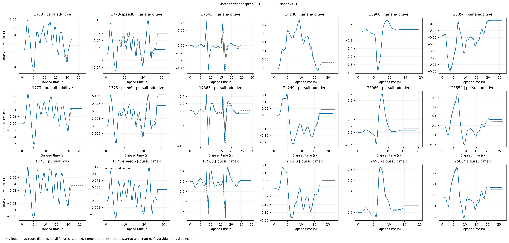
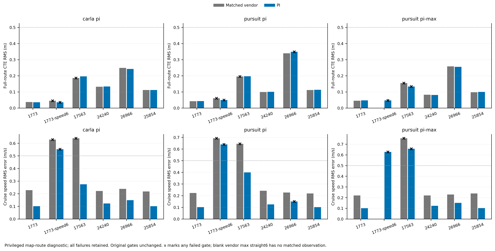

# Fixed PI development comparison (Kp 1.0, Ki 0.25)

All 18 predeclared PI cases are included: 13 pass every original gate. There are 17 matched vendor observations; pursuit/max on the extra 6 m/s straight has no measured vendor counterpart. These are privileged map-route diagnostics, not leaderboard scores.

## Speed and reported gear


[Vector PDF](six-route-speed-gear.pdf)

PI improves the S-route additive speed RMS from 0.639 to 0.274 m/s for CARLA and from 0.644 to 0.400 m/s for pursuit. All three 6 m/s straight configurations still fail the 0.5 m/s speed gate, so PI has not generally eliminated the recurring speed deficits. The gear series is the observed CARLA control API field and does not prove internal transmission causation.

## Independent lateral error



[Vector PDF](six-route-cte.pdf)

The complete traces retain startup and stopping. Route 26966 additive pursuit acquires a lateral P95 failure, increasing from 0.973 to 1.002 m against the unchanged 1 m threshold; the small margin remains a failure. No stopping gate regresses in these matched cases.

## Original acceptance gates



[Vector PDF](six-route-gates.pdf)

Black crosses mark a failure of any original gate, including a gate other than the plotted metric. S-route pursuit/max still fails the speed gate, and the unmeasured vendor/max straight6 bar remains absent. These single-run development results do not provide uncertainty estimates or establish generalization.

## Data, pairing and provenance

- [cases.csv](cases.csv): 18 PI and 17 matched vendor cases, every original gate, full/moving CTE, speed, stopping, controller timing, rejoin concerns and descriptive speed/gear metrics.
- [matched-comparisons.csv](matched-comparisons.csv): paired values and PI-minus-vendor differences, with the unpaired max straight6 case explicit.
- [frames.csv](frames.csv): original frame IDs, timestamps, true speed/CTE, reported gear and commanded controls, with source directory and observation role.
- [underspeed-episodes.csv](underspeed-episodes.csv): exact first/last frames of contiguous cruise deficits exceeding 0.5 m/s; episodes lasting at least 0.25 s are counted separately.
- [gear-replicates.csv](gear-replicates.csv): separately logged vendor S-route observations used only to supply the otherwise missing gear series.
- [report.json](report.json): complete raw-file path/SHA-256 source index, output hashes, selection, metric definitions, limits and matched results.

The five original routes pair against `/data/runs/b2d/controller/development-v2` at identical speed, preset/lookahead and original reference geometry. The extra `1773-speed6` CARLA and pursuit cases pair against `/data/runs/b2d/controller/development-v2-speed-diagnostic/1773`; no vendor/max run exists at that speed. Vendor S-route gear comes from a **separate replicate** at `development-v2-speed-diagnostic/17563`; numerical PI/vendor acceptance comparisons continue to use the original v2 matrix, not that replicate.

Cruise statistics use elapsed time at least 5 s and independent reference speed within 0.1 m/s of configured cruise. Full-route gates are unchanged; moving CTE uses absolute true signed speed at least 0.5 m/s and is supplementary. Reported gear changes and recurring speed deficits are descriptive observations, not evidence identifying their physical cause.

## Reproduce

Run from the v2 worktree. Choose a fresh output directory; the helper refuses to overwrite an existing result or plot an incomplete 18-case campaign.

```bash
PYTHONDONTWRITEBYTECODE=1 /data/envs/carla/bin/python scripts/b2d_controller_pi_plot.py \
  --pi /data/runs/b2d/controller/development-v3 \
  --vendor /data/runs/b2d/controller/development-v2 \
  --speed-diagnostic /data/runs/b2d/controller/development-v2-speed-diagnostic \
  --out todos/2026-09-22-b2d-controller/results/pi-figures-reproduced
```
