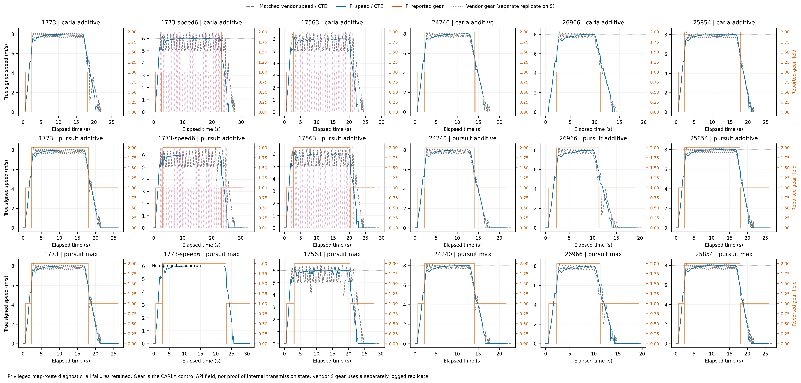
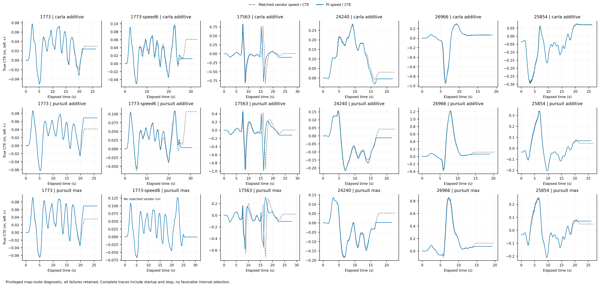
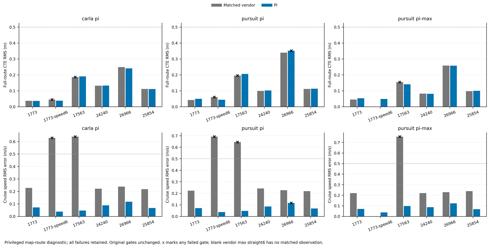

# Fixed PI development comparison

17 of 18 declared PI cases pass every original gate. All cases and failures are retained; 17 vendor cases are matched, with vendor/max straight6 unmeasured.

Archived PI parameters: {"pi": {"kp": 0.5, "ki": 0.25}, "pi-max": {"kp": 0.5, "ki": 0.25}}.

## Speed and reported gear



[Vector PDF](six-route-speed-gear.pdf)

Full traces show remaining speed variation. The gear field is an API observation; vendor S gear uses a separate replicate and does not establish transmission causation.

## Independent lateral error



[Vector PDF](six-route-cte.pdf)

Full-route true CTE includes startup and stopping. Consult every original gate and paired change in matched-comparisons.csv before accepting a candidate.

## Original acceptance gates



[Vector PDF](six-route-gates.pdf)

Black crosses mark any failed gate, including metrics not plotted. The vendor/max straight6 bar is absent because no matched observation exists.


## V4 verdict and comparison with V3

PI CARLA and PI pursuit/max pass all six required cases; PI pursuit/additive passes five and still fails the original lateral P95 gate on route 26966. All three extra straight6 cases now pass, and total acceptance improves from 13/18 in V3 to 17/18 in V4. Passing G2 makes a candidate eligible for further integration and formal-route regression; it does not itself establish a new default.

Across the original five routes, max reduces the route-equal mean CTE RMS from 0.164413 to 0.126605 m (22.9957%). No route gains a new gate failure, the largest P95 increase is 0.010681 m, and the largest speed-RMS increase is 0.050350 m/s. The ordinary both-pass branch is not satisfied because additive fails. The same predeclared protocol explicitly permits max as a candidate when only max passes the five routes and additive has a true control failure; that branch applies here, and max also passes the required extra straight6. The candidate is therefore eligible for formal testing, while no new default is established.

- [v4-vs-v3.csv](v4-vs-v3.csv): all 18 exact paired case values, V4-minus-V3 deltas and every gate from both runs.
- [selection-and-v3-deltas.json](selection-and-v3-deltas.json): candidate eligibility, unchanged original max/additive checks, per-route differences and SHA-256 source index for the comparison.

The root froze pursuit/max with PI Kp=0.5, Ki=0.25 for subsequent G3/Dev10 testing, using qualified CARLA lateral with the same PI and TCP/vendor as references on the common v2 adapter. This decision uses G2 only and precedes formal two-seed results; no further retuning is planned.

## Data and provenance

- [cases.csv](cases.csv): every case/gate, lateral/speed/stop/timing/rejoin metrics.
- [matched-comparisons.csv](matched-comparisons.csv): exact matched values and differences; unpaired max straight6 explicit.
- `frames.csv` (moved out of git; GPU box: `$DATA_DIR/runs/b2d/controller/git-offload-v1/todos/2026-09-22-b2d-controller/results/pi-v4-figures-01/frames.csv`): raw frame IDs, timestamps, signals, source paths and observation roles.
- [underspeed-episodes.csv](underspeed-episodes.csv): deficit interval start/end frames and durations.
- [gear-replicates.csv](gear-replicates.csv): separate vendor S gear observations.
- [report.json](report.json): raw source paths/SHA-256, parameters, selection, definitions and limitations.

The original five routes pair against development-v2. Straight6 CARLA/pursuit pair against development-v2-speed-diagnostic/1773. Vendor S gear comes from development-v2-speed-diagnostic/17563 as a separate replicate; acceptance metrics still pair against the original v2 matrix. Cruise statistics use elapsed>=5s and independent reference>=cruise-0.1m/s. Moving CTE uses |true signed speed|>=0.5m/s and does not replace full-route gates.

## Reproduce

Run from the v2 worktree; choose a fresh output folder.

```bash
PYTHONDONTWRITEBYTECODE=1 /data/envs/carla/bin/python scripts/b2d_controller_pi_plot.py --pi /data/runs/b2d/controller/development-v4 --vendor /data/runs/b2d/controller/development-v2 --speed-diagnostic /data/runs/b2d/controller/development-v2-speed-diagnostic --out todos/2026-09-22-b2d-controller/results/pi-v4-figures-01-reproduced
```
