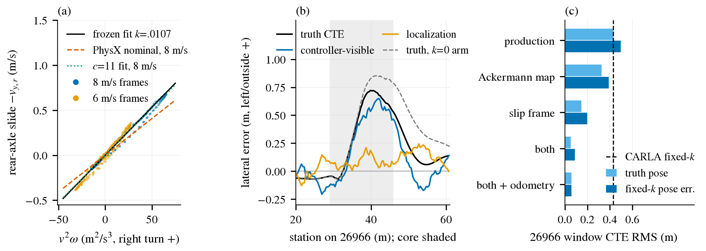

# 急右弯横向误差：k 的物理来源、误差分解与控制器侧上限

2026-09-23。对象是 B2D route-oracle 横向控制器（rear-axle pure pursuit，lookahead `max(3 m, .5 s·v)`，steer_rate 2/s，max_steer .8，5 Hz rejoin，20 Hz 控制）在 `pose-g2-v1` 六例上的表现。所有数字由本目录脚本在 Tokyo 原始日志上重算，truth CTE 逐位复现冻结分析（26966 window .5587/.4290 m）。

**结论先行。** (1) k 的函数形式可由 PhysX 轮胎语义推出且与 CoM 无关：`k(v) = (1 + 1 m/s / v) / (c·g)`；但 CARLA 暴露的参数给出的名义 c=14.07/rad 比实测 c≈11.0/rad 高 22%，所以 k 是"每车一个常数 c 需标定一次"，不能纯从 physics control 算出。(2) 加 k 后急右弯的误差大头是控制器自身：controller-visible CTE RMS .361 m，定位法向分量只有 .101 m。(3) 控制器侧没有任何执行器饱和（|steer| ≤ .41，饱和 0%，rate-limit 0%）；真正的缺口是两个模型错配：pure pursuit 按车身朝向而不是后轴速度方向算弧（后轴侧偏 β_r 峰值约 5°），以及 steer 映射忽略了 PhysX 的 Ackermann（实际曲率只有控制器以为的 88.6%）。(4) 离线闭环筛选里两者合并后，26966 window CTE RMS 从 .497 降到 .089 m（固定 k 位姿误差条件）；body-heading 门槛在结构上惩罚更好的后轴跟踪，因为理想跟踪下 body heading error 就等于 β_r，其 P95 已有 4.8–4.9°。



(a) 八个 window 全部帧的后轴侧滑速度对 v²ω：6 与 8 m/s 的点都落在冻结拟合线上，PhysX 名义参数（橙虚线）系统性偏低约 22%，线性一直保持到 0.85 g。(b) 固定 k 臂在 26966 上的误差沿站距分解：黑线（truth）几乎全由蓝线（控制器自己看到的误差）构成，橙线（定位）在 core 内只有 0–0.2 m。(c) 离线闭环筛选中各候选的 window CTE RMS：单改 steer 映射收益有限，按后轴速度方向做 pursuit 收益最大，两者叠加后降到约 0.05–0.09 m。

## 1. k 的物理来源

### 1.1 PhysX/CARLA 语义

CARLA 0.9.15 跑在 UE4.26 的 PhysX 车辆模型上。`CarlaWheeledVehicle.cpp` 把 `lat_stiff_max_load` 和 `lat_stiff_value` 直接写进 `PxVehicleTireData.mLatStiffX/Y`（读回的 physics control 也来自这两个字段）。`PxVehicleComputeTireForceDefault`（PhysX 3.4 与 4.1 这一段逐行相同）是：

- `latStiff = restTireLoad · mLatStiffY · f1(normalisedLoad · 3 / mLatStiffX)`，其中 `f1(K) = min(1, K − K²/3 + K³/27)`；
- `latSlip = atan(v_lat / (|v_long| + gMinLatSpeedForTireModel))`，其中 `gMinLatSpeedForTireModel = 1 × tolerance length`，在 UE 的厘米制里就是 1 m/s；
- 线性区侧向力 `F = latStiff · tan(latSlip)`。纵向滑移不影响线性区侧向力：`nu` 混合项在 K→0 时正好抵消。

`restTireLoad = (sprung mass + wheel mass)·g`，而 sprung mass 由 `PxVehicleComputeSprungMasses` 按 CoM 分配。稳态转弯时后轴侧向力 `F_yr = m·a_y·l_f/L`，后轴静载 `= m·g·l_f/L`，所以 **l_f 被约掉，k 与 CoM 和质量都无关**：

`v_y,rear = −(1 + v0/v)·v²·ω / (c·g)`，其中 `c = mLatStiffY · f1(3/mLatStiffX)`，`v0 = 1 m/s`

MKZ 的参数是 X=3、Y=20，所以 c = 20·f1(1) = 14.07/rad。PxVehicleTireData 注释里写的"load < X 时线性、为 Y·load/X"与代码不一致（照注释算会得到 6.7/rad），以代码为准。

### 1.2 预测与实测

| 量 | 值 | 说明 |
|---|---:|---|
| 名义 c | 14.07 /rad | 代码语义，n=1，不含 load filter |
| 名义 k(8 m/s) | .00815 s²/m | 含 (1+1/v)=1.125；去掉这一项是 .00724 |
| 名义 k(6 m/s) | .00845 s²/m | |
| 冻结拟合 k | .010659832 | 相当于 c=10.76（8 m/s）/ 11.16（6 m/s） |
| truth 中心差分 LS，8 m/s，a_y 1–2 m/s² | .01002 | 24240 左弯主体，准稳态 |
| 同上，a_y 8–11 m/s² | .01035 | 26966 core；从 0.15 g 到 0.85 g 只上升 3% |
| 同上，6 m/s（17563） | .0118–.0123 | 瞬态较多，样本少 |
| 开环 plant 回放拟合 c（全部 8 窗） | 11.0 /rad | yaw rate RMSE .0096 rad/s，后轴侧滑 RMSE .016 m/s；c=14.07 时侧滑 RMSE 为 .045 |
| 分窗拟合 c | 11.0 / 11.25 / 10.25 / 10.5 | 26966 / 24240 / S1 / S2 |
| α_f − α_r（Ackermann centre 角） | −0.02° 均值 | 前后轴侧偏角相等，即 neutral steer |

"开环 plant 回放"（plant.py）指：把记录的 applied steer 和速度喂给平面 bicycle 模型，轮胎用上面的 PhysX 线性形式加 Ackermann centre 角，然后与记录的 yaw rate 和后轴侧滑速度对比。拟合结果不需要任何额外的转向延迟或一阶滞后，最优延迟为 0 tick。

两条结构性预测都被数据证实。第一，C ∝ 轴载，这意味着 neutral steer，实测 α_f−α_r 的中位数在 ±0.1° 内。第二，k 在 0.85 g 以内是线性的；按猜测的 CoM 高度 .55 m 与 μ=2.45–3.5 算，load transfer 加 friction smoothing 本应让 k 升高 14–19%，实测只升 3%，说明这两项在这里比猜测的小。唯一对不上的是幅值：实测 c ≈ 11.0 比名义低 22%。UE4 默认 tire-load filter 的方向相反，会把 c 推到 15.0；wheel mass 计入 rest load 的方向也相反。要解释这 22%，需要 normalised load 约为 0.70，暴露的参数里找不到原因；候选只能是 UE/blueprint 侧没有暴露的量，未核实。速度依赖上，6 m/s 的 c 比 8 m/s 低约 7%，(1+1/v) 项已经解释了主要部分。

**判断：** k 可以按物理形式 `(1+1/v)/(c·g)` 逐车计算，唯一的车辆常数 c 需要一次标定；运行时不需要 truth。在仿真里可以用 truth 跑一圈恒定半径来标定。实车或无 truth 时，可以用 GNSS course 与 compass 的差值 β = k·a_y 在圆周上平均得到 c。相对固定 k，物理形式在速度外推上更安全：固定 k 在 3 m/s 时会低估 18%，在 15 m/s 时会高估 5%。

### 1.3 β_r 预测与 body-heading 门槛

β_r = atan(k(v)·v·ω)，即后轴侧偏角，也等于 body 朝向减去后轴 course。

| window / 臂 | 实测均值 ° | 名义 c=14.07 | c=11 | 冻结 k | 实测 \|β\| P95 ° | c=11 P95 |
|---|---:|---:|---:|---:|---:|---:|
| 26966 baseline | 2.16 | 1.71 | 2.19 | 2.23 | 4.80 | 4.85 |
| 26966 fixed-k | 2.16 | 1.70 | 2.17 | 2.22 | 4.94 | 4.98 |
| 24240 两臂 | −0.76 | −0.62 | −0.80 | −0.82 | 1.05 | 1.09 |
| S1 / S2 | ≈0 | ≈0 | ≈0 | ≈0 | 3.3–3.7 | 3.0–3.3 |

course-audit 里的 +2.16° 均值就是稳态 rear sideslip。按 c=11 的物理预测在两位小数上与它一致；名义参数会低估 0.45°。core 均值为 3.3°，峰值约 5°。

**门槛结构。** 后轴精确在路径上、course 与切线重合时，body heading error ≡ β_r。所以一个理想的后轴跟踪器在 26966 window 的 body-heading P95 下限约 4.8–4.9°，而门槛是 4.27+1 = 5.27°，只剩 0.3–0.5° 给任何纠偏瞬态。baseline 的 4.27° 来自"车在外侧、车头向内"的姿态：course error 与 β 部分抵消。因此这个门槛在结构上惩罚更好的后轴跟踪。建议把保护量改成 course error，或 body heading − β̂，其中 β̂ = atan(k(v)·v·ω_gyro) 只用传感器。门槛要在下一轮开跑前预先登记，不改写已冻结的判定。

## 2. 误差分解

定义：truth CTE（后轴真值对路线，左正）= est CTE（估计位姿对同一路线，即控制器能看到的误差）+ loc（定位误差在路径法向上的分量）。这是逐帧恒等式。另列 own-path CTE，即控制器相对自己那条 5 Hz rejoin 路径的误差。

| window | 臂 | truth RMS | est RMS | loc RMS | corr(est,loc) | own-path RMS | 均值 truth / est / loc |
|---|---|---:|---:|---:|---:|---:|---|
| 26966 | baseline k=0 | .559 | .267 | .330 | +.79 | .036 | .413 / .125 / .288 |
| 26966 | fixed k | .429 | .361 | .101 | +.19 | .037 | .308 / .223 / .085 |
| 26966 core | baseline | .609 | .288 | .363 | +.79 | .044 | .488 / .153 / .335 |
| 26966 core | fixed k | .501 | .426 | .092 | +.39 | .046 | .405 / .326 / .078 |
| 24240 | baseline | .108 | .120 | .073 | −.58 | .009 | −.063 / −.055 / −.008 |
| 24240 | fixed k | .078 | .129 | .120 | −.70 | .009 | .009 / −.071 / .080 |
| S1 | baseline | .225 | .179 | .090 | +.20 | .057 | |
| S1 | fixed k | .210 | .199 | .060 | −.15 | .058 | |
| S2 | baseline | .273 | .197 | .097 | +.66 | .041 | |
| S2 | fixed k | .262 | .242 | .061 | +.11 | .040 | |
| 26966 | turns-v1 short-max | .516 | .211 | .332 | +.83 | .034 | |

turns-v1 的 baseline-max 与 pose-g2-v1 baseline-zero 的这些数逐位相同，与已知的逐 tick 可重复性一致，所以只列 short-max。

- **加 k 之后急右弯由控制器主导**：est .361 对 loc .101，方差占比约 93:7。加 k 以前两者同号且强相关（+.79），定位把车"看"在内侧，于是控制器欠修正。加 k 后定位基本正确，控制器看到的误差反而升高（均值 .125→.223），truth 只降了 .105。也就是说，控制器看得见外偏，却按不回来。
- own-path CTE 在所有窗都只有 1–6 cm。控制器很好地跟上了自己的 rejoin 路径，误差是在"参考路径不断从当前位姿重新锚定"和"跟踪律的模型错配"里形成的，不是纯跟踪噪声。
- 24240 是反例。加 k 后 loc 从 .073 升到 .120，而 truth CTE 下降，原因是 loc（+.080 向内）与控制器的外偏（−.071）互相抵消。第 4 节的候选会去掉控制器外偏，这个抵消随之消失，左弯的定位误差就会直接暴露出来。

## 3. 控制器侧限制

| 量 | 26966 baseline / fixed-k | 24240 | S1 / S2（baseline, fixed-k） |
|---|---|---|---|
| \|steer\| ≥ .8 的帧占比 | 0 / 0 | 0 | 0 |
| rate-limit（slew）帧占比 window（core） | 0 / 0 | 0 | 7–10%（14–18%） |
| max \|steer\| | .400 / .411 | .086 | .50–.53 |
| lookahead ℓ | 3.93 m | 3.94 m | 3.02 m |
| κ_ref 峰值 / core 均值（R） | .144 / .093（6.9 / 10.8 m） | .025（40 m） | .236 / .11（4.2 / 9 m） |
| ℓ/R 峰值 | .57 | .10 | .71 |
| κ_act/κ_nom（控制器以为的曲率） | .886 / .882 | .982 | .82–.84 |
| κ_act/κ_ack（Ackermann centre） | .977 / .975 | 1.002 | .93–.94（瞬态） |
| κ_cmd/κ_ref | 1.09 / 1.12 | 1.02 | .90–.96 |
| aim 点保留的路线偏差比例 | .36 / .33 | .37 | .45–.63 |
| 轨迹更新帧占比 | .25（5 Hz） | .25 | .25 |

- **执行器不是瓶颈**：|steer| 只用到上限的一半，急右弯 rate-limit 为 0。
- **steer 映射错配**：控制器令 nominal 角 = atan(Lκ)，但 PhysX（Ackermann accuracy 1）把 nominal 当作内轮角。bicycle centre 满足 cot δ_c = cot δ_in + w/(2L)，所以实际曲率 = κ/(1 + wκ/2)，在 R=6.9 m 时约少 10%。实测 κ_act/κ_nom = .886，其中 Ackermann 解释 .977 这一段之外的全部，剩余 2–3% 是动态。车本身是 neutral steer，没有需要补偿的 understeer。
- **pure pursuit 的参考系错配**：PP 按"后轴沿车身朝向运动"计算过 aim 点的圆弧，而后轴实际速度方向比车身偏外 β_r。在曲率上这相当于少了约 2·sin β/ℓ；在 26966 峰值处 β≈5°、ℓ=3.93 m，这一项是 .044 1/m，约为 κ_ref 的 30%。
- **kinematic PP 在圆上的稳态误差**：理想运动学下为 0（aim 在参考圆上，弧就是参考圆）。下表是加入实测错配后的解析稳态外偏（直接对路线做 PP，不含 rejoin 稀释）：

| R | 仅 Ackermann 映射（γ=.886） | 仅后轴 slip（β） | 两者 | 残余 γ=.975 |
|---|---:|---:|---:|---:|
| 6.9 m（峰值，β=5.5°） | .142 m | .374 m | .526 m | .028 m |
| 10.8 m（core 均值，β=3.5°） | .091 m | .241 m | .335 m | .018 m |

实测 fixed-k 臂的 core 均值为 est .326 m、truth .405 m，与"两者"一栏同一量级。所以外偏主要是这两个错配的稳态结果，不是 lag。

- **5 Hz rejoin**：每 0.2 s 从当前估计位姿重建 quintic 过渡（这里 join length 为 8 m），aim 点只保留车辆路线偏差的 33–38%。这使 PP 对路线偏差的等效增益约为直接跟路线时的 0.65，而且之后所有稳态外偏都被这个系数放大。它本身不是时间 lag：路径固定在控制器的 odometry 系里，但这套 odometry（`advance_pose`，b2d_controller.py:367）只沿车身朝向积分，看不见侧滑。两次更新之间未建模的漂移最多为 v_y,r·0.15 s，26966 峰值处约 0.10 m，且总是偏外。
- **truth-pose ceiling 臂：不存在。** Tokyo `54e4406` 中没有任何把 truth 位姿喂给 PoseFilter、RouteAdapter 或 Controller 的模式。`TruthLogger`（scripts/b2d_controller_adapter.py:449）只读，结果只写进遥测（scripts/b2d_agent.py:309）。唯一读 truth 位姿来转向的是 `drive == "route"` 的 `_steer_to_route`（scripts/b2d_agent.py:446–450 起），那是 speed hold 加 6 m 航向的调试驾驶，不走 pursuit 控制器，不能充当 ceiling。

## 4. 候选改动与离线筛选

在做 CARLA 闭环之前，先用 closed_loop.py 做离线筛选。它调用生产 `Controller` 与 `RouteAdapter` 的原码，接上第 1 节拟合的 plant（c=11），位姿取 truth，或 truth 加上按站距回放的记录 loc 分量。校验如下：生产配置在四窗上的 CTE RMS 与 CARLA 对比为 26966 .648/.497（CARLA .559/.429，偏高约 16%），24240 .110/.079（CARLA .108/.078），S1 .292/.282（.225/.210），S2 .273/.253（.273/.262）。筛选整体偏悲观，但两臂的差（26966 −.151，CARLA −.130）和排序都复现了。下表为 window CTE RMS：

| 变体 | 26966 truth pose | 26966 fixed-k loc | 26966 k=0 loc | 24240 fixed-k loc | 24240 k=0 loc | S1/S2 fixed-k loc |
|---|---:|---:|---:|---:|---:|---|
| production | .432 | .497 | .648 | .079 | .110 | .282 / .253 |
| Ackermann 映射 | .326 | .389 | .550 | .078 | .105 | .224 / .205 |
| slip frame | .146 | .198 | .344 | .115 | .058 | .185 / .163 |
| Ackermann + slip | .054 | .089 | .258 | .119 | .058 | .116 / .107 |
| + odometry slip | .059 | .057 | .218 | .131 | .062 | .101 / .109 |
| + route-direct（去 rejoin） | .059 | .105 | .297 | .120 | .065 | .109 / .084 |
| 仅 route-direct（truth） | .356 | | | | | |
| 仅 ℓ=.375 s（truth） | .384 | | | | | |

max |steer| 最高 .70（S，Ackermann + slip），没有碰到 .8；26966 的 steer-rate P95 ≤ 1.06/s。body-heading P95 在 26966 fixed-k loc 条件下为 production 6.38°、Ackermann + slip 6.12°、+odometry 6.61°（筛选的 body heading 比 CARLA 系统性高约 1°），而 course P95 从 7.4° 降到 3.0°。

**排序：**

1. **按后轴速度方向做 pursuit（slip frame）。** 机制：用 β̂ = atan(k(v)·v·ω_gyro) 把 aim 点从车身系转到后轴速度系后再算 κ = 2y/d²，k(v) 取第 1 节的物理形式。只用传感器，生产上的改动是 `Controller.step` 中 pursuit 分支的一处旋转。效应上界：解析稳态外偏减 .24–.37 m；筛选中单独使用时 26966 为 .497→.198（−60%），truth 位姿下为 .432→.146。风险：固定 k 位姿下 24240 的 RMS 在筛选里从 .079 升到 .115，超过 +.03 的守护。原因是第 2 节那个抵消消失后，左弯定位误差（均值 +.08 m）直接暴露。
2. **Ackermann 一致的 steer 反解。** 机制：cot δ_in = 1/(Lκ) − w/(2L)，其中 w=1.593 m 取自 calibration-physics 的前轮间距；只改一行映射，不引入新参数。效应：κ_act/κ_nom 从 .886 回到约 .975，解析稳态外偏减 .09–.14 m；筛选中单独使用时 26966 为 .497→.389、S 为 −20%，与 1 叠加后 26966 降到 .089、S 降到 .11。风险最低，所有窗都不变差。
3. **控制器 odometry 加同一侧滑项。** 机制：`advance_pose` 在两次 5 Hz 更新之间补上 −k(v)·v²·ω 的后轴侧向位移，与 PoseFilter 已加的项同源。效应较小：叠加在 1+2 之上时 26966 为 .089→.057，但筛选中 body-heading P95 +0.5°，24240 也略变差。放在 1+2 通过之后再做。

不推荐作为下一步的：去掉 rejoin 直接跟路线（单独使用有 −18%，叠加后没有收益，带位姿误差时更差）；缩短 lookahead（CARLA −8%，筛选 −11%，还加大 S 的 rate 占用）；curvature feedforward 或 Stanley 前轴参考。PP 的弧几何本身已经包含 κ_ref 前馈，缺的是对 plant 的正确反解与正确参考系。前轴同样有 α_f ≈ α_r 的侧偏，换参考点不能消除它。按曲率放长 ℓ 可以降低 2β/ℓ 项，但会加大切弯，筛选未测。

**最便宜的判决性实验。** 沿用 pose-g2 的六例协议，墙钟约 1 分钟。做 2×2：controller {production, Ackermann + slip frame} × pose {k=0, fixed k}，共 12 例，每条路线相邻执行。再加一个 truth-pose ceiling 臂，需要新增一个仅诊断用的开关，让 agent 把 TruthLogger 的后轴位姿送进 RouteAdapter 与 Controller。预注册预期：26966 window CTE RMS 在 fixed-k 位姿下 ≤ .25 m（筛选 .089，已按 +16% 与未建模项留出余量）；24240 的守护按原 +.03 执行，作为主要风险点；保护量同时报告 body heading 与 course/β̂ 校正后的 heading，按第 1.3 节先登记。若 24240 失败而 26966 通过，下一步应处理左弯定位误差（fixed-k 下的 GNSS 融合偏差），不应回退 1、2。

## 复现

均为 English 代码，位于 `lateral_physics/`：

```sh
ssh ujs@100.108.238.8 /data/envs/carla/bin/python - < lateral_physics/analyze_logs.py > logs.json   # 原始日志 → 分解与逐帧量
python lateral_physics/physics_k.py --logs logs.json                                              # 1.2/1.3 的预测
python lateral_physics/plant.py fit --logs logs.json                                              # 开环 plant 拟合 c
python lateral_physics/closed_loop.py --src scripts --refs <ref_<route>.json 目录> --logs logs.json --out lateral_physics/results/closed_loop.json
python lateral_physics/make_figure.py --logs logs.json --screen lateral_physics/results/closed_loop.json --out lateral_physics/figs/lateral-physics
```

`results/log_summary.json` 保存了逐窗统计（不含逐帧），`results/closed_loop.json` 保存了筛选结果。`closed_loop.py` 需要 Tokyo `54e4406` 的 `scripts/b2d_controller.py` 和 `scripts/b2d_controller_adapter.py`，本机要等 merge 后才有。ref 文件取自各 case 的 `route_reference.json`。PhysX 源码依据是 NVIDIAGameWorks/PhysX 4.1 与 PhysX-3.4 的 `PxVehicleUpdate.cpp`（`PxVehicleComputeTireForceDefault`、`computeTireSlips`、`computeAckermannSteerAngles`、`setVehicleToleranceScale`）和 `PxVehicleSuspWheelTire4.cpp`（tire rest load）；CARLA 依据是 0.9.15 的 `CarlaWheeledVehicle.cpp`。CoM x=+0.3 m 只用于 plant 的瞬态，稳态结论与它无关。
