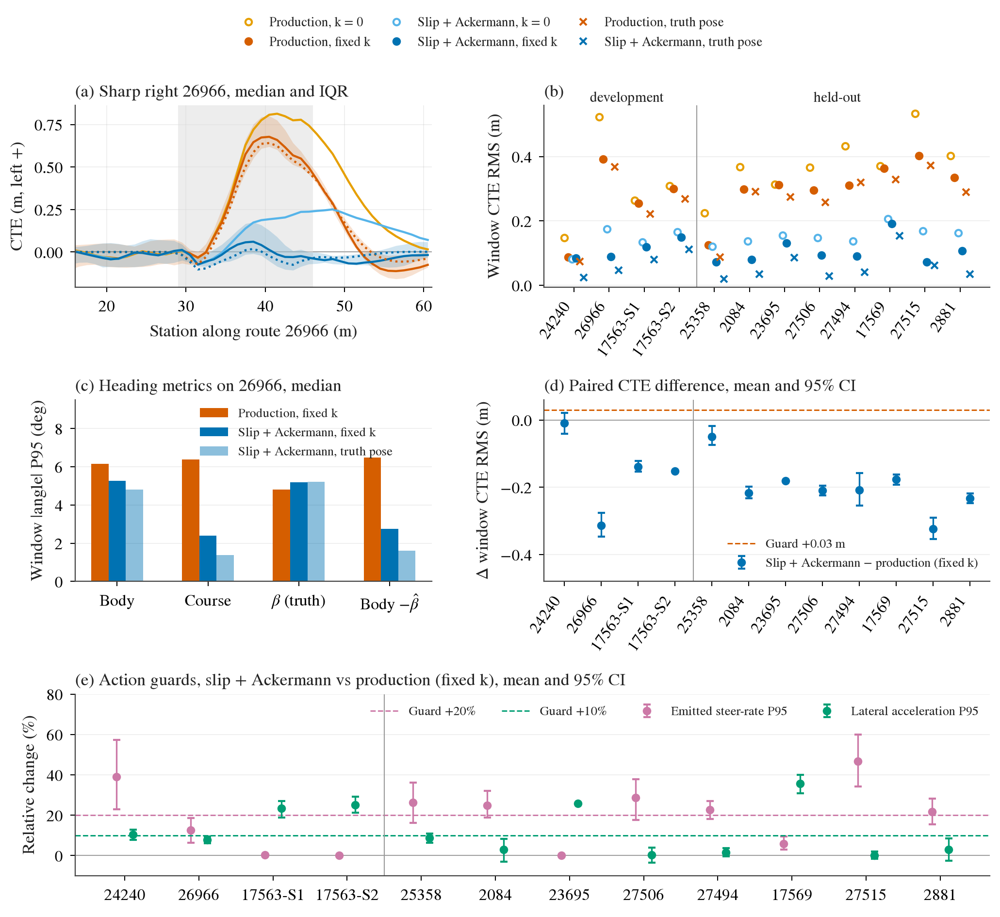
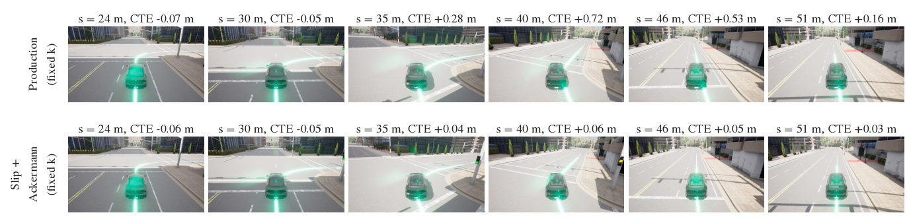

# 横向 v2 报告：后轴速度系 pursuit + Ackermann 反解

2026-09-23。预注册协议：[lateral-v2-protocol.md](lateral-v2-protocol.md)，冻结于 `2372db2`。实现：`e71e616`（控制器、agent、validate）。原始运行都在 GPU box 的 `$DATA_DIR/runs/b2d/controller/lateral-v2/`（worker 子目录），失败与中断的尝试在 `lateral-v2-aborted/`，渲染在 `lateral-v2-render/`。本目录只放小文件：[lateral_v2/results/analysis-v1/](lateral_v2/results/analysis-v1/)（逐 case-窗指标、1 m 站距剖面、summary.json、tables.md）和图。

## 结论

**按冻结门槛，候选不通过。** 主目标完全达成，失败出在动作保护量上：

- **主目标（26966 急右弯，fixed-k 位姿）通过**：window CTE RMS（cross-track error，后轴真值到参考线的横向距离）的 10-seed 中位数从生产的 .392 m 降到 .089 m（门槛 .25）；配对差 −.314 m，95% CI [−.347, −.276]，10/10 个 seed 都改善。course error（后轴运动方向相对路线切线）P95 从 6.37° 降到 2.41°。
- **CTE 在所有窗口都改善，包括 held-out**：所有 CTE 保护量（RMS +.03、P95 +.05、最大值 +.10 m）全部通过。10 个完整评估的 held-out 与开发窗中，配对 CTE RMS 下降 .05–.32 m，CI 全在 0 以下；唯一的例外是 24240，−.010 m，CI [−.040, +.021]，持平。lateral-physics.md 担心的 24240 抵消效应消失问题没有出现。
- **失败项全部是动作/舒适性保护**：emitted steer-rate P95 相对增幅超过 20% 的有 7 个窗（24240 +39%，以及 7 个完整 held-out 窗中的 6 个，+22–47%；*2026-09-23 修正*：原来写「8 个」，多算了 seed 不全、按协议记失败的 23695，它实测增幅 0%）；横向加速度 P95 相对增幅超过 10% 的有 4 个窗（24240 +10.5%，S1 +23%，S2 +25%，17569 +36%）。这些增幅在 truth-pose ceiling 臂之间同样出现（slipack-truth 对 prod-truth），所以是控制律本身带来的，不是定位噪声。
- **G2（既有全程门槛）**：672 个已完成 case 没有一个 G2 失败。
- held-out 的 23695（Town13）**基础设施未完成**，只有 p00 anchor 与 p06 两组（各 6 臂）可用，见"执行偏差"。按协议它的保护量记为"seed 不全"，即失败。这不改变判定，因为开发窗 24240、S1、S2 已经各自失败。

失败项是协议登记的保护，本报告不改门槛、不追加网格。下面的解读只说明失败的性质，供决策参考。

(a) 26966 沿站距的 CTE（左正，10 个扰动的中位数，fixed-k 两臂带 IQR）：生产臂在 core（灰底）内外偏 .6–.8 m，候选贴着 0；truth ceiling（点线）表明生产控制器在完美定位下仍外偏约 .6 m。(b) 各窗 CTE RMS 中位数：候选（深蓝实心）在 11 个窗都低于生产（橙红实心），也低于完美定位下的生产控制器（橙红 ×）。(c) 26966 上的航向量：候选的 body heading 只小幅下降，course 从 6.4° 降到 2.4°；β（后轴侧偏，真值）约 5°，两臂相同，这正是 body heading 门槛在结构上惩罚好的后轴跟踪的原因。(d) 配对 CTE 差与 +.03 m 保护线。(e) 决定判定的两项动作保护：紫色 steer-rate 相对增幅大多越过 +20%，绿色横向加速度相对增幅在 S 与 17569 越过 +10%。23695 只有一个 seed，没有 CI（b 中是该 seed 的值），只作参考。

26966 / p00 的离屏追车视角，绿线为参考线。上排生产臂（fixed k）：s = 35–46 m 车身明显压到参考线外侧，s = 40 m 处 CTE +.72 m；下排候选：全程 |CTE| ≤ .06 m。渲染例与 campaign 同臂 p00 的 CTE 逐帧差值为 0（387 帧与 382 帧），相机和画线没有改变这次驾驶。mp4 在 box 的 `lateral-v2-render/out/`。

## 实现

| 项 | 内容 |
|---|---|
| slip frame | `pursuit_frame="rear_slip"`, `rear_slip_c_per_rad=11.0`：β̂ = atan((v+1)·ω/(c·g))，aim 点乘 R(β̂) 后再算 κ = 2y/d²；只读 SPEED 与 gyro |
| Ackermann 反解 | `steer_inverse="ackermann"`, `track_width_m=1.5929`：δ = atan2(L\|κ\|, 1 − w\|κ\|/2)，即 cot δ_inner = 1/(Lκ) − w/(2L) |
| N 点轨迹 | `update(traj, t, trajectory_dt=dt)` 接受 (N,2)；horizon = N·dt，不外推；默认调用仍只收 20×.25 s |
| truth-pose ceiling | 控制器配置 `diagnostic_truth_pose_ceiling` 与 validate `--allow-truth-pose-diagnostic` 双重 opt-in，逐行标注 `pose_source`，缺真值即报错 |
| 扰动 | GNSS/IMU `noise_seed` 透传（此前被 leaderboard 属性白名单丢掉，所有历史运行都是 seed 0）；起点横移 / yaw |
| 测试 | controller 125 → 144（含：显式关闭时在 GPU box 记录的 pose-g2 六例 2758 帧闭环回放上逐位等于默认），TCP 17/17，pose 分析 15/15，均在 `OPENBLAS_CORETYPE=Barcelona` 下 |

nominal anchor p00 复现了 gpubox-port-v1 的四窗数字，逐位一致：26966 .558701 / .429015，24240 .107807 / .078434，S1 .223507 / .208811，S2 .271382 / .261474（k=0 / fixed k）。smoke 与 campaign 的 p00 也逐位相同。

## 结果

### 窗口 CTE RMS（m），10-seed 中位数

CI 为中位数的 95% bootstrap。

| 窗 | 类型 | prod k=0 | prod fixed k | slip+Ack k=0 | **slip+Ack fixed k** | prod truth | slip+Ack truth |
|---|---|---:|---:|---:|---:|---:|---:|
| 24240 | 开发 左 | .148 | .087 [.063, .144] | .081 | **.084** [.069, .109] | .074 | .025 |
| 26966 | 开发 急右 | .523 | .392 [.351, .457] | .175 | **.089** [.054, .111] | .367 | .046 |
| 17563-S1 | 开发 S | .264 | .255 [.242, .291] | .134 | **.120** [.106, .144] | .222 | .079 |
| 17563-S2 | 开发 S | .308 | .300 [.268, .321] | .165 | **.149** [.112, .167] | .268 | .111 |
| 25358 | held-out 缓右 | .224 | .124 [.094, .154] | .121 | **.073** [.055, .092] | .088 | .020 |
| 27506 | held-out 右 | .366 | .295 [.260, .348] | .148 | **.093** [.066, .110] | .257 | .028 |
| 27515 | held-out 右 | .533 | .403 [.372, .452] | .168 | **.073** [.058, .115] | .372 | .062 |
| 2084 | held-out 左 | .368 | .299 [.278, .330] | .137 | **.080** [.068, .100] | .291 | .035 |
| 27494 | held-out 左 | .433 | .310 [.253, .354] | .137 | **.091** [.082, .128] | .320 | .041 |
| 2881 | held-out 左 | .402 | .334 [.314, .375] | .162 | **.108** [.093, .114] | .290 | .035 |
| 17569 | held-out S | .371 | .364 [.335, .409] | .206 | **.191** [.172, .208] | .329 | .154 |
| 23695 | held-out S | 仅描述：p00 anchor .288 | .303 | .139 | .143 | .277 | .085 |

读法：

1. 候选在 held-out 上的改善幅度与开发窗相当甚至更大（右转 −.21 到 −.32 m，左转 −.21 到 −.23 m），不像过拟合了开发窗与 c=11 的标定。
2. 生产控制器在完美定位下仍有 .26–.37 m 的路口弯 CTE；候选的 ceiling 是 .03–.06 m。可见 fixed-k 之后剩下的误差主要在控制律，与 lateral-physics.md 第 2 节的分解一致。
3. 2×2 的另一行：k=0 位姿下候选同样大幅改善（26966 .523 → .175），但 fixed-k 与候选叠加才到 .09。两处改动与 pose 侧向传播是互补的。

### 配对差（slip+Ack fixed k − prod fixed k），均值 [95% CI]

| 窗 | CTE RMS m | course P95 ° | 横向加速度 P95 相对 | steer-rate P95 相对 | 判定 |
|---|---:|---:|---:|---:|---|
| 26966 | −.314 [−.347, −.276] | −4.24 | +7.9% | +12.6% | P1、P2、附加保护全过 |
| 24240 | −.010 [−.040, +.021] | −.15 | **+10.5%** [7.8, 12.8] | **+39.1%** [22.9, 57.2] | 失败 2 项 |
| 17563-S1 | −.139 [−.153, −.122] | −2.45 | **+23.3%** | +0.3% | 失败 1 项 |
| 17563-S2 | −.152 [−.155, −.149] | −2.77 | **+25.1%** | 0.0% | 失败 1 项 |
| 25358 | −.049 [−.075, −.018] | +.17 | +8.7%（uncertain） | **+26.2%** | 失败 1 项 |
| 27506 | −.210 [−.224, −.195] | −3.09 | +0.4% | **+28.8%** | 失败 1 项 |
| 27515 | −.324 [−.354, −.290] | −4.17 | 0.0% | **+46.6%** | 失败 1 项 |
| 2084 | −.216 [−.232, −.199] | −3.57 | +2.9% | **+24.8%** | 失败 1 项 |
| 27494 | −.208 [−.255, −.158] | −3.01 | +1.6% | **+22.7%** | 失败 1 项 |
| 2881 | −.233 [−.247, −.219] | −3.30 | +2.9% | **+21.7%** | 失败 1 项 |
| 17569 | −.177 [−.193, −.163] | −5.56 | **+35.6%** | +5.8% | 失败 1 项 |

23695 只有 p06 一组配对：CTE RMS −.181 m，横向加速度 +26%，steer-rate 0%，方向与其他 S 窗一致，不能当统计证据。速度保护全部通过：参考速度误差 RMS 增量 ≤ +.08 m/s，平均速度没有下降。完整的逐项表（含 CTE P95/最大值、body heading、k=0 与 truth 两组配对）见 [tables.md](lateral_v2/results/analysis-v1/tables.md)。

### 航向（中位数，°）

| 窗 | body P95 prod / cand | course P95 prod / cand | β P95 prod / cand | β̂ P95 cand | body−β̂ P95 prod / cand |
|---|---:|---:|---:|---:|---:|
| 26966 | 6.14 / 5.27 | 6.37 / 2.41 | 4.82 / 5.18 | 5.28 | 6.47 / 2.75 |
| 24240 | 1.72 / 1.87 | 1.42 / 1.23 | 1.09 / 1.13 | 1.22 | 1.44 / 1.32 |
| 27515 | 6.55 / 5.52 | 6.34 / 2.32 | 4.90 / 4.96 | 5.03 | 6.56 / 2.92 |
| 17569 | 9.44 / 3.07 | 12.19 / 6.32 | 4.19 / 5.60 | 5.50 | 11.98 / 6.55 |

登记的跟踪航向量 course error 在所有窗的 +1° 保护都通过，除 25358（+.17°）和 24240 外都大幅下降。冻结的 body heading 指标照常报告：若按冻结 body 门槛（增量 ≤ 1°）判，11 个窗全部会通过（信息列，不参与判定）。β̂（传感器预测的后轴侧偏）P95 与真值 β P95 相差 .1–.55°（完整表见 tables.md），c=11 的 β̂ 在 held-out 路口弯上仍基本准确。

## 失败项的性质（解读，不改判定）

- **steer-rate。** 在失败的窗上绝对值不大：候选 P95 在 .32–1.16 /s，离 2 /s 的 slew 上限还远，幅值饱和帧占比 0。S 窗两臂都顶在 2 /s 的 slew 上限，相对增幅因此为 0。相对增幅来自两处：Ackermann 反解在 R≈6–10 m 时把名义角放大 10–15%，rate 随之同比放大；slip frame 把 β̂ ∝ (v+1)·ω 直接叠进 aim 方向，gyro 的动态（入弯、出弯时 ω 的变化）因此进入 steer。本协议没有单独开关的臂，两者的份额分不开。truth 臂之间的增幅在路口弯上为 +12–45%，与传感器臂相近；缓弯（24240、25358）上因对照基数只有 .03–.09 /s 而更大。这排除了定位噪声放大这一解释。
- **横向加速度。** 超标集中在 6 m/s 的急 S（S1/S2 的 R_min 约 4.2 m，参考路径本身要求 v²/R ≈ 8.6 m/s²）和 17569（R_min 7.9 m、8 m/s，约 8.1 m/s²）。生产臂在这些窗外偏、把 S 走平，所以 a_y P95 只有 6.5 / 7.9；候选贴线跟踪，a_y P95 到 8.2 / 10.5，truth 臂同样如此（8.1 / 11.3）。17569 的 10.5 m/s² 高于参考路径需求，说明在 8 m/s 的急 S 上有过冲成分，不能全算作"跟上了路径的代价"。路口弯（2084、27506、27494、27515、2881）的 a_y 增幅都在 ±3% 内。
- 结论：这两项门槛来自 pose-g2 协议，本意是防止"用更激进的动作换 CTE"。本轮它们在两件事上同时触发：一是缓弯上动作量的相对增长（绝对量小），二是急 S 上跟踪路径本身需要的横向加速度。是否把这类门槛改为绝对量或以参考路径需求为基准，需要另开阶段、先登记再跑，不能用于追认本轮。

## 执行偏差（全部在 box 上保留原始记录）

1. **首次启动被拒**：扰动校验把 |spawn yaw| 限在 1°，而冻结表抽样 ±1.5°，四个 worker 在跑任何 case 之前就退出。修为 1 m / 5°，加了"所有登记扰动都能加载"的测试（`a2cd3da`）。原目录 `lateral-v2-failed-start-1`。
2. **分析实现修复**：held-out 参考线核对在离线参考上去掉了路段衔接处的重复点，运行时 `route_reference.json` 保留了它们，逐点比较因点数不同把 7 个 held-out 窗判为未覆盖。修复为同样去重后再比，8 条路线全部在 0.7 mm 内一致，站距不受影响（`21673cf`）。协议的判定规则与门槛没有改。
3. **worker 重组**：Town12/13 两组太慢，在路线边界拆分成单路线 worker；被中断路线的部分 case 移到 `lateral-v2-aborted/`，整条路线在新 worker 里重跑。拆分时我关闭了 helper 的父 tmux 窗口，2084/2881 两个 worker 被 SIGHUP 杀掉，未完成的扰动（2084 的 p05、2881 的 p03）整体移入 aborted 后续跑。它们的 CARLA server 成了孤儿进程，占着 GPU 直到 14:35 才被发现并清理。这些孤儿 server 很可能加重了第 4 条的 GPU 争用。
4. **Town13（23695）**：server 反复崩溃（"GameThread timed out waiting for RenderThread"，signal 11），先后试了 Epic、Low quality（`fd37d98`）和 world `no_rendering_mode`（`8fb040f`），都会崩。no-rendering 与 Epic 的同一 case 全程 CTE 逐位相同（.14718469963854164）。进程内重启 server 的做法无效：server 死后 libcarla 在客户端线程抛异常，整个 Python 进程随之退出。该功能已撤回（`9bda12a`），改为逐扰动、只跑未完成臂的外层循环。清掉 5 个孤儿 server、释放约 40 GB 显存后重试，仍在完成第一例之前崩溃。当时共享 GPU 被其他流占满（100%，另有约 47–67 GB 在用）。最终 23695 完成 12/66 例（p00 与 p06 各 6 臂），其余移入 aborted。按协议它的保护量记为"seed 不全"，属于失败；判定已由开发窗决定，不受影响。
5. **渲染**：两次独立渲染运行，CTE 与 campaign p00 逐帧相同。

## 下一步（建议，需要决定）

- 候选按冻结协议不通过，不升级默认，也不做反序确认。
- 如果要继续这条线，最省事的判决性实验是拆开两处修正（slip-only、Ackermann-only 各一臂），用同样的扰动集合与 held-out，先登记"动作保护按绝对量或按参考路径需求"的新门槛，再看 steer-rate 增量来自哪一项。
- 真实 TCP：`update(N,2, trajectory_dt=.5)` 已经可用，可以直接接 4 点 / 2 s 输出。
- 基础设施：Town13 在共享 GPU 满载时跑不动。若要补齐 23695，需要一段 GPU 空闲窗口；命令是 box 上的 `lateral-v2-inputs/t13loop.sh <prefix> p01 … p10`，它会跳过已完成的 case。
