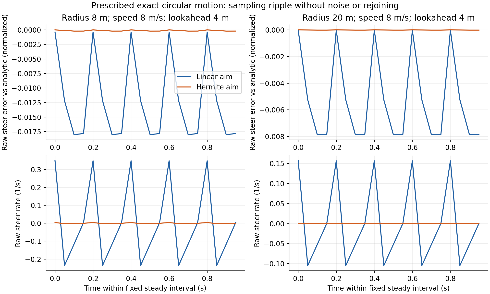

# 无噪声圆弧把几何采样纹波独立暴露出来

固定真实运动为解析圆弧，速度6/8m/s、半径8/20m、左右镜像；每.05s控制，每.2s送同一20点、.25s间隔的局部圆弧轨迹。没有定位噪声、路线重接或车辆动力学反馈。原Controller负责时间、运动重投影与路径投影；只在同一个aim station比较折线与局部Hermite插值。16种诊断组合、每种200tick完整保留；指标固定取第20tick起。

| R8m、v8m/s、4m前视 | 折线 | Hermite原型 |
| --- | ---: | ---: |
| raw steer变化率绝对p95，1/s | .348818 | .003989 |
| 与解析所需steer的RMS差 | .014060 | .000150 |

理想输入下已经存在周期性变化，因此“全部是定位噪声”不成立。该诊断不证明实际CARLA转弯更好：插值也改变折线之间的目标点，可能影响跟踪偏差，仍需相同四窗口与完整路线闭环验收。此处原型尚不含正式实现的退化回退，实际候选以冻结代码为准。

图使用固定第20–39tick，展示解析转向误差与raw变化率，没有平滑。两种半径均可观察到折线插值的采样相位变化；纵向和车辆响应未纳入此图。[PDF](../circle-sampling-figures-v1/circle-sampling.pdf)。

完整3200帧CSV、当时控制器字节、诊断脚本在`/data/runs/b2d/controller/lateral-followup/circle-sampling-v1`；本目录保留16行summary和来源manifest。原先hash指向的主源码随后增加可选插值功能，原始字节已复制为raw目录的`controller-source.py`，匹配旧hash。旧实验与其阈值不改写。
