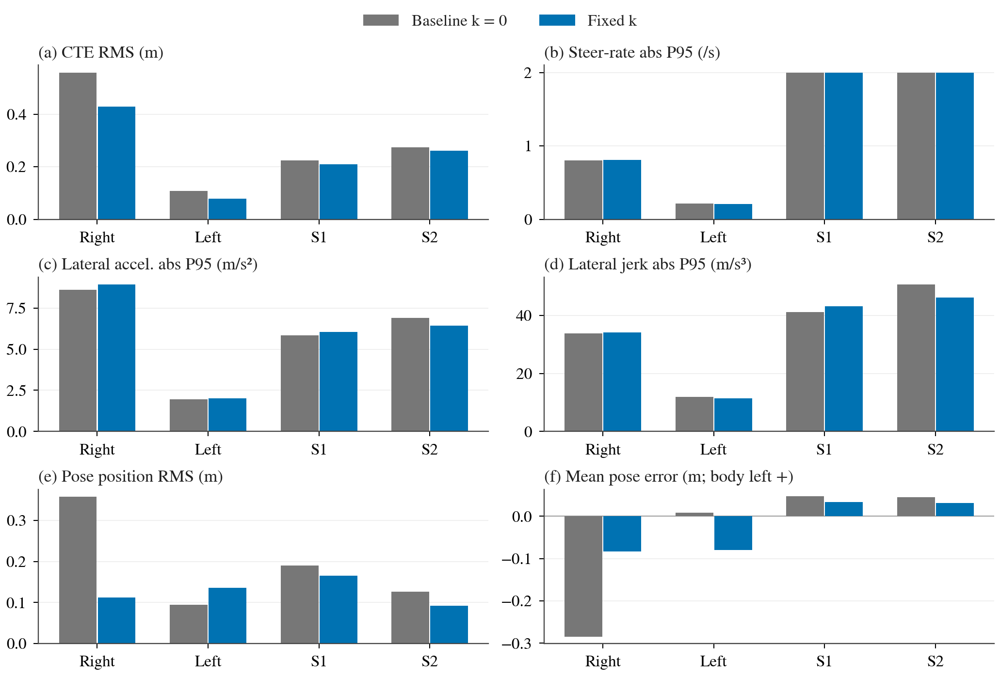
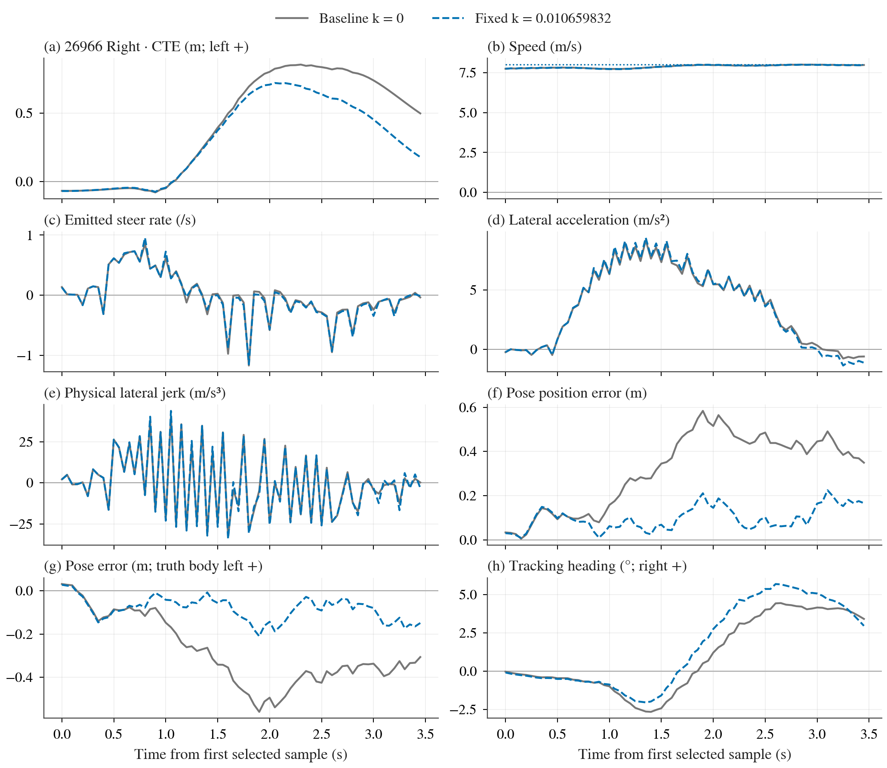
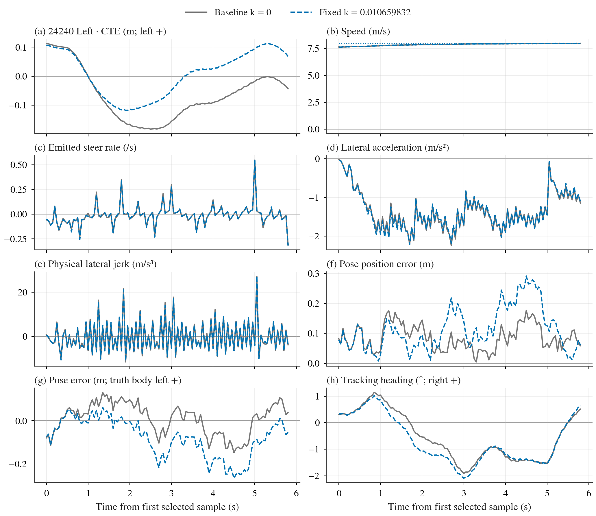
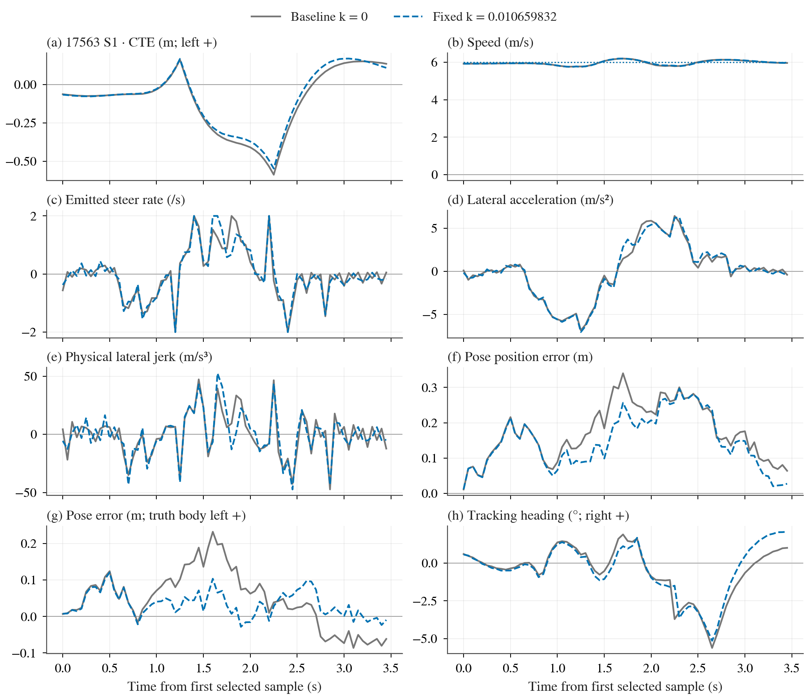
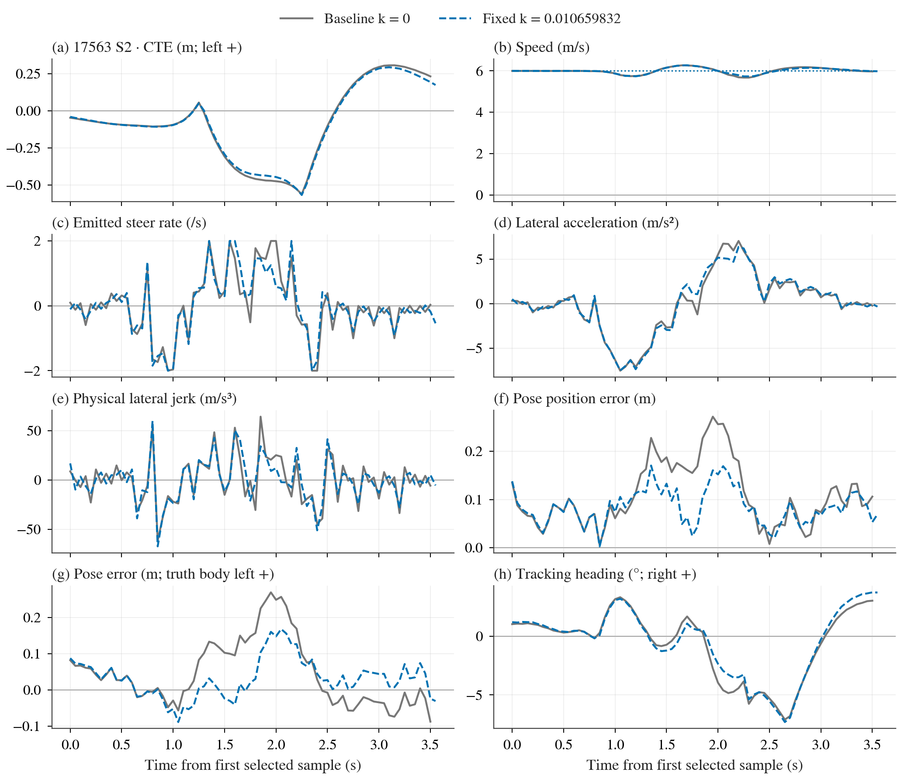

# 固定 k 后轴位姿补偿：局部收益明确，冻结验收未通过

2026-09-23。`pose-g2-v1` 的六例已闭合；六例全部通过基础 G2、无碰撞。冻结验收 **156 项：155 通过、1 失败、0 证据不足，总体 FAIL**。唯一失败是右急弯真实车身航向跟踪 P95 超过原 +1° 余量。**不触发反序六例确认，不追加新候选，不升级默认。**

本轮共同基线为 pursuit、linear aim、max .5、PI .5/.25；唯一变化是后轴侧向传播系数 0→0.010659832 s²/m，在原 GNSS 融合之前加入补偿。系数不重新拟合，运行时不读真值。Hermite 与旧 short .375 的失败及协议仍各自保留。本轮不借用其他阶段的基线：尤其当前 S1 基线 CTE RMS 为 .225250m，旧 Hermite 轮为 .235236m；只能使用当前相邻配对，不能拼接挑优。

跨阶段原始 truth 复核还显示：左/右弯基线按同一 case 内 tick 对齐的位置完全相同，但 S 基线最大位置差 .058497m、最大 CTE 差 .050195m，属于实际物理轨迹差异，不是分析器数值误差。k=0 在固定传感器输入上的逐值回归不能推出独立物理运行也逐位一致；只用本轮配对。见 [baseline-repeatability.json](../../baseline-repeatability.json)。

## 唯一失败与主目标

| 必要条件 | 基线 | 固定 k | 冻结上限 |
|---|---|---|---|
| turn/26966/1/heading_p95_delta | 4.271547 | 5.449551 | 5.271547 |

右急弯 heading abs P95 从 4.271547° 升到 5.449551°，增加 1.178004°，超允许上限约 0.178004°。该量是 **truth 车身 yaw 相对参考线 5m 居中弦方向**，不是 pose 的估计航向误差，也不是实际速度方向 course 的误差。后续只读 body/course 分解属于解释性附录，不能替换原门槛或改判通过。

该窗 CTE RMS .558694→.429021m，下降 **23.210%**，达到本轮预登记 15% 主目标；CTE P95 .849224→.712170m、post10m RMS .317045→.101648m 也改善。这些局部收益是真实本轮闭环观测，但不能抵消另一项必要条件失败。

## 四个固定窗口：收益与代价同时保留

所有值使用完整 pad 窗口全部帧，不按低速或 gyro 删除样本。表内 B→K 为本轮基线→固定 k；P95 除有符号均值外均为绝对值分位数。所有精确数值及增量见 [window-comparison.csv](window-comparison.csv)。

### 路径与车身航向

| 窗口 | CTE RMS m | CTE P95 m | CTE peak m | heading P95 ° |
|---|---|---|---|---|
| 26966 右急弯 | 0.558694→0.429021 | 0.849224→0.712170 | 0.856458→0.721559 | 4.271547→5.449551 |
| 24240 左弯 | 0.107807→0.078434 | 0.179908→0.113793 | 0.182633→0.117799 | 1.701105→1.925338 |
| 17563 S1 | 0.225250→0.209774 | 0.467031→0.429044 | 0.586266→0.546542 | 3.866792→3.704770 |
| 17563 S2 | 0.273410→0.262014 | 0.483586→0.479151 | 0.561730→0.567314 | 5.773899→5.839463 |

### 速度与动作

| 窗口 | speed RMS m/s | mean speed m/s | steer-rate P95 /s |
|---|---|---|---|
| 26966 右急弯 | 0.149878→0.151467 | 7.885128→7.884720 | 0.800106→0.811117 |
| 24240 左弯 | 0.153223→0.153239 | 7.882531→7.882568 | 0.218380→0.208798 |
| 17563 S1 | 0.124337→0.122981 | 5.966109→5.967539 | 2.000000→2.000000 |
| 17563 S2 | 0.148847→0.133943 | 6.001151→6.001787 | 2.000000→2.000000 |

### 物理横向运动

| 窗口 | accel P95 m/s² | jerk P95 m/s³ |
|---|---|---|
| 26966 右急弯 | 8.598159→8.922999 | 33.811203→34.233957 |
| 24240 左弯 | 1.953200→2.007525 | 11.891843→11.374426 |
| 17563 S1 | 5.827806→6.051393 | 41.173538→43.231247 |
| 17563 S2 | 6.907110→6.417400 | 50.660215→46.274676 |

### 定位位置范数

| 窗口 | RMS m | P90 m | P95 m | max m |
|---|---|---|---|---|
| 26966 右急弯 | 0.357962→0.112293 | 0.498720→0.171571 | 0.534194→0.184699 | 0.583742→0.224444 |
| 24240 左弯 | 0.094703→0.135926 | 0.144829→0.242264 | 0.154144→0.258880 | 0.176659→0.291452 |
| 17563 S1 | 0.190697→0.165472 | 0.282243→0.257771 | 0.298471→0.269053 | 0.340198→0.296503 |
| 17563 S2 | 0.126832→0.092477 | 0.199182→0.133275 | 0.239595→0.153925 | 0.271735→0.170449 |

### 定位有符号偏差与估计航向

| 窗口 | body-left mean m | body-forward mean m | pose heading P95 ° |
|---|---|---|---|
| 26966 右急弯 | -0.284230→-0.083649 | 0.121499→0.030520 | 0.449309→0.462695 |
| 24240 左弯 | 0.008836→-0.079302 | -0.005915→-0.019259 | 0.073986→0.077053 |
| 17563 S1 | 0.047119→0.034279 | 0.147050→0.137567 | 0.674050→0.637982 |
| 17563 S2 | 0.045487→0.031979 | 0.053380→0.042166 | 0.758320→0.670351 |

四窗 CTE RMS 均下降，但不能写成“所有量更好”。右急弯、左弯及 S1 横向加速度 P95 上升；右急弯和 S1 jerk P95 上升；S2 航向 P95 小幅上升。全部数值照常列出。emitted-rate/横向加速度仍满足原保护余量；jerk 本轮是完整报告项，没有另加事后门槛，也不是官方 DS 的加分项。

**左弯定位退化不能隐藏：** pose position RMS .094703→.135926m，P95 .154144→.258880m，而路径 CTE RMS .107807→.078434m。定位估计和车辆跟踪是不同量；当前全 G2 pose 门槛仍通过，本轮没有预设逐窗 pose 非恶化门槛，不能事后新增或把这项代价改叫改善。

所有 signed pose 数值为 **估计后轴−真值后轴** 在 **truth body left/forward** 上的投影：left=[sin(truth yaw),−cos(truth yaw)]。这与路径 CTE 的 reference normal 不同，也与部分旧离线 shadow 的 reference-left 不能直接拼接。物理 jerk 先对 world acceleration 按实际 dt 求导，再投当前 body；steer-rate 是归一化命令变化率，二者不能互相替代为舒适性结论。

## 恢复、覆盖与边界

右急弯基线恢复 censored；候选在原冻结观察窗内记录到恢复，时间 .45s。基线未恢复不能填0、不能构造有限“改善百分比”，也不能把本轮恢复诊断自动变成额外 pass。S1 .05→.05s、S2 .70→.60s、左弯 0→0s；原始恢复表全部保留。本轮恢复/jerk 沿用诊断地位，不移植 Hermite 阶段的新门槛。

四窗样本 B/K：右急弯70/70、左弯117/117、S1 70/70、S2 71/72，总657帧；不同帧数来自各自按 truth station 进入/退出固定窗口，不能重采样成相等。六例完整遥测与 truth 共2760帧，连续且逐帧对齐，未剔除起步、停止、低速或瞬态。窗口均达到至少20帧并完整进出，原独立覆盖检查通过。

[pose-phase-summary.csv](pose-phase-summary.csv) 保留全部 full_route、entry/core/exit/post10m、approach/gap straight guards、endpoint_last5m 与 terminal_hold 的定位/CTE/航向/jerk，不能因窗口外退化而省略。完整原始 [metrics.csv](metrics.csv) 还包含 moving 辅助统计、幅值和 slew 限制比例、raw 动作等，不用于替代全帧主判定。

## 六例基础 G2 与契约

| case | ticks | G2 | 全程CTE RMS m | 全程CTE P95 m | 巡航speed RMS m/s | pose P90 m | case wall s |
|---|---|---|---|---|---|---|---|
| 26966/baseline-zero | 387 | PASS | 0.257783 | 0.773178 | 0.123041 | 0.398056 | 1.204275 |
| 26966/candidate-fixed-k | 387 | PASS | 0.191515 | 0.585213 | 0.124350 | 0.210420 | 1.145881 |
| 17563/baseline-zero | 559 | PASS | 0.143124 | 0.360051 | 0.100862 | 0.218692 | 7.384371 |
| 17563/candidate-fixed-k | 559 | PASS | 0.136235 | 0.336366 | 0.095725 | 0.196804 | 6.431427 |
| 24240/baseline-zero | 434 | PASS | 0.081230 | 0.158033 | 0.086944 | 0.167041 | 1.525647 |
| 24240/candidate-fixed-k | 434 | PASS | 0.055716 | 0.115724 | 0.087019 | 0.197412 | 1.431269 |

六例均 0 collision、0 invalid_control、0 unknown reason、0 pose contract error、0 模式缺失/错误/无理由 fallback；同一 case 内 raw motion/control 时间与传感器帧一致，独立原始传感器 replay 通过。两臂显式 linear aim，公共配置审计确认仅固定系数不同。原 G2 停车保持、终点、pose heading、速度及全程CTE全部通过；这些不取代逐窗条件。

合法状态仍全保留：{'tracking': 2150, 'trajectory_behind': 12, 'stationary_trajectory': 592, 'stop_hold': 6}。补偿状态总计 {'no_interval': 6, 'disabled': 1377, 'applied': 1377}；首帧 no_interval 不虚构已应用补偿，k=0 的 disabled 与候选 applied 明确分开。逐例计数在 [case-summary.csv](case-summary.csv)，逐帧 sensor 重算原始表在 [/data/runs/b2d/controller/lateral-followup/pose-g2-v1-analysis-v1/pose-recomputed.csv](/data/runs/b2d/controller/lateral-followup/pose-g2-v1-analysis-v1/pose-recomputed.csv)。真实错误计数为0不等于删除合法安全制动。

## 图与数据

下列文章图来自首例前冻结 plot_pose.py 和共享样式，全部8组 PNG/PDF 保留；完整路线展示启动到停车全过程，四窗分别展示，不只挑右弯。两臂使用同一坐标轴，时间按各自首选中样本对齐，不做轨迹时间插值或平滑。速度点线为独立参考；pose 面板明确 truth body left。图形只解释原判定，不创造门槛。

四窗的路径、动作、物理运动与定位分别比较：CTE 均下降，但左弯定位范数增加，部分 accel/jerk 上升。 [PDF](/data/runs/b2d/controller/lateral-followup/pose-g2-v1-figures-v1/four-window-summary.pdf)

右急弯：路径外侧残差减少，真实车身航向误差 P95 增加并触发唯一失败；位姿误差下降不能替代航向守护。 [PDF](/data/runs/b2d/controller/lateral-followup/pose-g2-v1-figures-v1/route-26966-window-1.pdf)

左弯：路径 CTE 下降而定位范数上升，必须保留这一方向相反的代价。 [PDF](/data/runs/b2d/controller/lateral-followup/pose-g2-v1-figures-v1/route-24240-window-1.pdf)

S1：本轮相邻共同基线与候选，保留正负曲率切换和全部瞬态。 [PDF](/data/runs/b2d/controller/lateral-followup/pose-g2-v1-figures-v1/route-17563-window-1.pdf)

S2：保留限速率段、符号切换和不同进入/退出帧数，不合并两个 S 抵消代价。 [PDF](/data/runs/b2d/controller/lateral-followup/pose-g2-v1-figures-v1/route-17563-window-2.pdf)

完整路线 26966：[PNG](route-26966-full.png) · [PDF](/data/runs/b2d/controller/lateral-followup/pose-g2-v1-figures-v1/route-26966-full.pdf)。

完整路线 24240：[PNG](route-24240-full.png) · [PDF](/data/runs/b2d/controller/lateral-followup/pose-g2-v1-figures-v1/route-24240-full.pdf)。

完整路线 17563：[PNG](route-17563-full.png) · [PDF](/data/runs/b2d/controller/lateral-followup/pose-g2-v1-figures-v1/route-17563-full.pdf)。

全程绘图数据 [/data/runs/b2d/controller/lateral-followup/pose-g2-v1-figures-v1/plot-data.csv](/data/runs/b2d/controller/lateral-followup/pose-g2-v1-figures-v1/plot-data.csv)，四窗原样数据 [window-plot-data.csv](/data/runs/b2d/controller/lateral-followup/pose-g2-v1-figures-v1/window-plot-data.csv)，汇总 [summary-plot-data.csv](/data/runs/b2d/controller/lateral-followup/pose-g2-v1-figures-v1/summary-plot-data.csv)。原始全部列/行保留，无平滑、无缺帧填0；绘图中的 NaN 只断线。

## 时间成本、来源与结论范围

成功6例 campaign start→end **51.327015s**；6例 validation.wall_s 合计 **19.122870s**。前者包含server/map启动但 end早于最终server.stop；后者包括actor setup、cleanup、遥测解析和指标处理，不是纯tick时间；均未包含实现、测试、离线分析和之前驱动恢复时间。本轮没有额外失败attempt或反序确认；此前 Hermite 的0例基础设施失败成本在其旧报告单独保留，不混入本候选数值。

冻结协议：[protocol.md](../../protocol.md)。运行源/配置/环境完整快照：[/data/runs/b2d/controller/lateral-followup/pose-g2-v1/provenance](/data/runs/b2d/controller/lateral-followup/pose-g2-v1/provenance)；原始[/data/runs/b2d/controller/lateral-followup/pose-g2-v1](/data/runs/b2d/controller/lateral-followup/pose-g2-v1)，验收[/data/runs/b2d/controller/lateral-followup/pose-g2-v1-analysis-v1](/data/runs/b2d/controller/lateral-followup/pose-g2-v1-analysis-v1)，绘图[/data/runs/b2d/controller/lateral-followup/pose-g2-v1-figures-v1](/data/runs/b2d/controller/lateral-followup/pose-g2-v1-figures-v1)。图文 wrapper 源、输入/输出 SHA 与验证详见 manifest.json；冻结分析/绘图及共享样式字节未修改。

本轮支持“固定经验补偿在当前 MKZ、6/8m/s、三路线 oracle 适配链上能减少部分定位与路径残差”，同时显示左弯定位代价与右急弯车身航向代价。它仍是开发筛选失败，不是默认资格、跨车标定、真实 TCP 模型提升、NPC 安全证明或全220榜单提升。body/course 等后续只读解释另附证据，不改变此处冻结结论。
