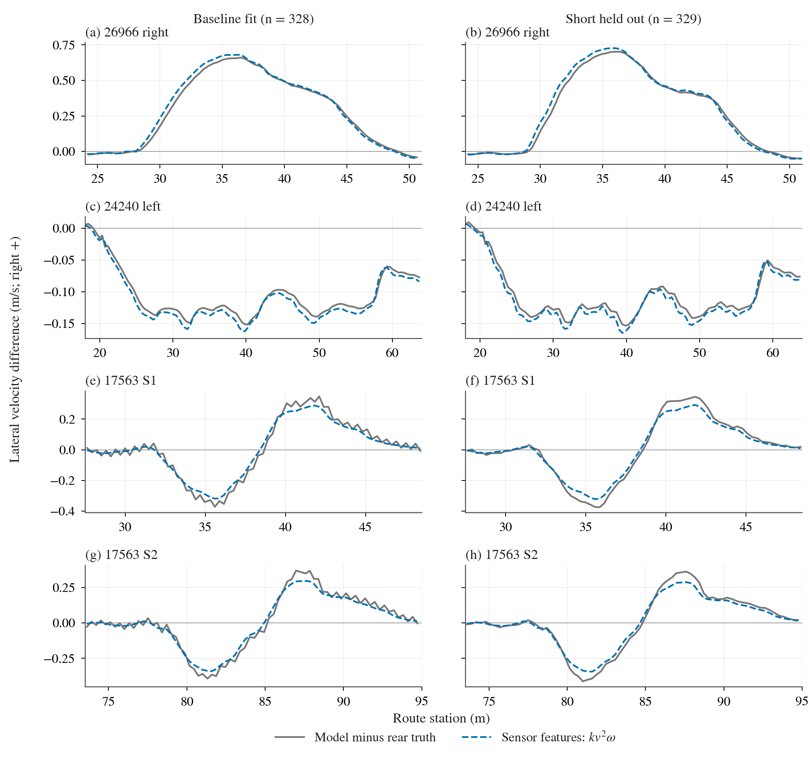
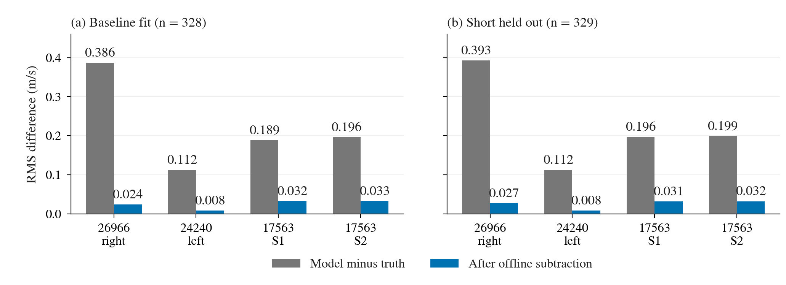

# 文章图版 v2：后轴横向传播残差

本版仅改变出版排版，657行曲线数据与8行逐窗RMS数据均和[v1历史版](../pose-regression-figures-v1/README.md)逐字节相同。统一使用[共享plot style](../../../../research/plot_style.py)：双栏6.875in、STIXGeneral serif 8–8.5pt、Okabe–Ito蓝色与灰色baseline、300dpi PNG和矢量PDF；图内只保留panel/列标，解释放在图注。

图1：灰线是使用真值中点航向分离出的模型减真值后轴区间横向速度残差，右正；蓝线为k·v²·ω，特征来自速度/gyro，但k=.010659832 s²/m使用左列328个baseline真值标签拟合。右列329个short样本未参与拟合，全部四窗瞬态保留且两列各行同纵轴。short仅是同车、同路线留出，不是跨车验证或已部署定位改善。

[图1 PDF](/data/runs/b2d/controller/lateral-followup/pose-regression-article-v2/rear-lateral-velocity-four-windows.pdf) · [逐点CSV](plot-data.csv)

图2：灰柱为原模型减真值残差的RMS（root mean square，均方根），蓝柱为离线减去同一k·v²·ω后的RMS，分别列出拟合与留出数据的四个窗口。总体按样本RMS为baseline .228499→.024449m/s、short .233470→.024671m/s，但S窗仍有约.031–.033m/s残差。该图只说明本批数据中的描述性拟合，不证明轮胎参数、因果、闭环定位/控制收益或跨车泛化。

[图2 PDF](/data/runs/b2d/controller/lateral-followup/pose-regression-article-v2/rear-lateral-residual-rms.pdf) · [柱形数据CSV](rms-plot-data.csv)

| 固定窗口 | baseline拟合 n | short留出 n |
|---|---:|---:|
| 26966右急弯 | 70 | 71 |
| 24240左弯 | 117 | 117 |
| 17563 S1 | 70 | 70 |
| 17563 S2 | 71 | 71 |

没有按窗重新拟合、时延搜索、滤波、重采样或删瞬态；系数定义与目标的更多边界见[v1详细图解](../pose-regression-figures-v1/README.md)。PNG分别384174B与87311B，均小于500KB；PDF保留在`/data/runs/b2d/controller/lateral-followup/pose-regression-article-v2`，本地PNG按共享规范放在research/figs。

复核材料：[绘图源码](plot_pose_regression_article.py)、[本次style字节](plot_style.py)、[来源索引](raw-manifest.json)、[尺寸/体积](export-sizes.json)、[完整验证](verification.json)、[本地图版manifest](manifest.json)。冻结Hermite的protocol/analyze_aim/plot_aim未修改。旧v1图和图解原样保留；旧主索引也保存为[v1-index-snapshot.md](v1-index-snapshot.md)，其SHA与旧caption-manifest记录一致，供追溯旧文档哈希时重定位使用。
