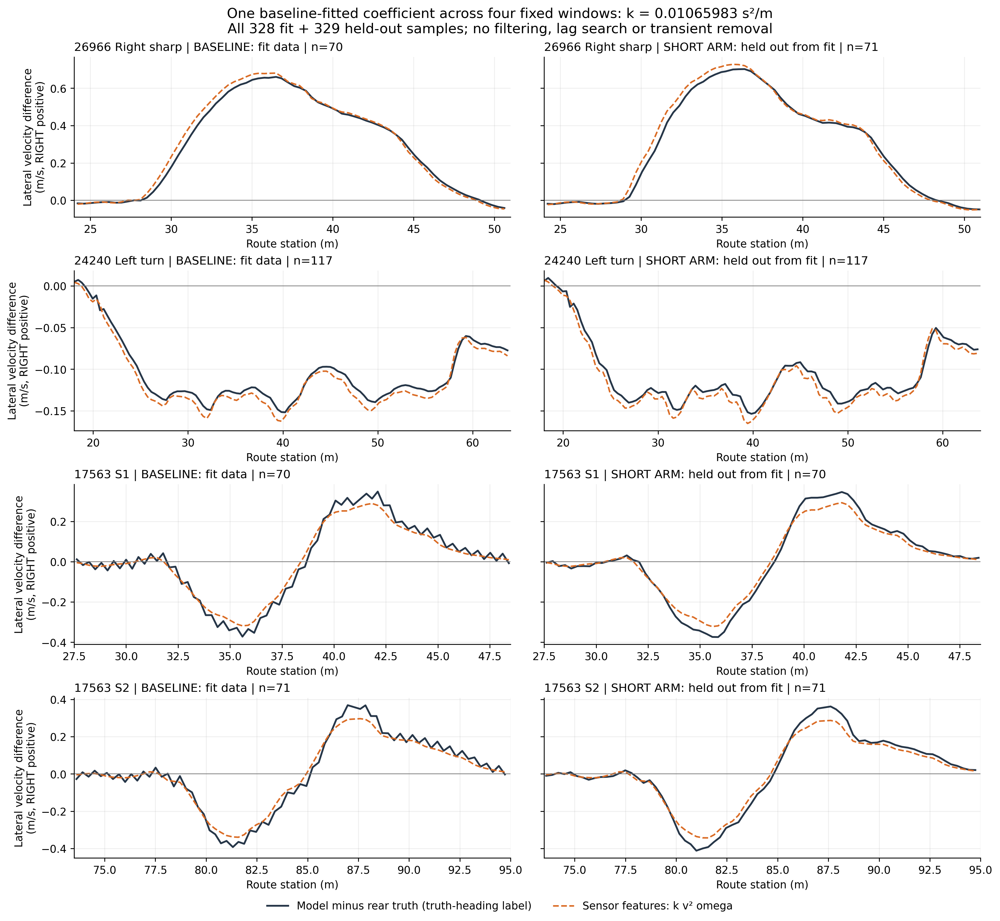
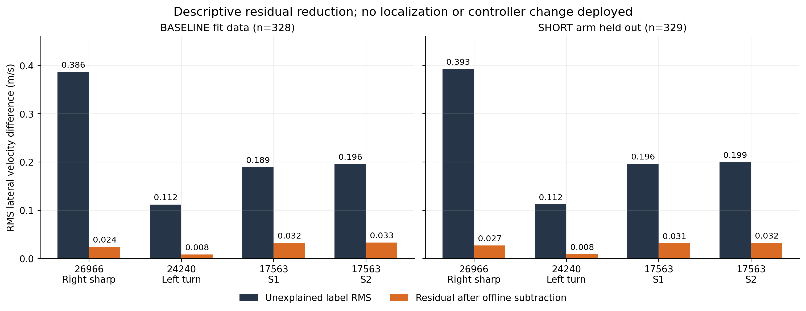

# 后轴横向速度残差：单系数描述性回归图解

本图来自旧turns-v1六例的离线pose-propagation-v2与pose-lateral-regression-v1。它与冻结Hermite闭环验收独立，不使用aim-g2-v1的启动失败作为行为数据，也没有部署定位或控制补偿。

## 图1：完整四窗波形

[PNG](rear-lateral-velocity-four-windows.png) · [PDF](rear-lateral-velocity-four-windows.pdf) · [657行plot-data.csv](plot-data.csv)

每行是一个预先固定窗口，左列baseline-max（前视系数.5）参与拟合，右列short-max（.375）完全未参与该系数拟合。四窗全部328个baseline样本做一次过原点普通最小二乘，没有窗口权重、截距、时延搜索、滤波或删除转弯瞬态。short共329样本只是**同车、同路线的留出臂**，不是未见路线或跨车型验证；它还是此前未通过转弯协议的短前视候选，不因此改判。

深色实线的目标y为：无横向运动的传播模型使用**真值区间中点航向**得到的位移，减去直接差分的真值后轴位移，再投影区间中点的右向量并除实际dt。因此它是区间平均横向速度残差，右正；不是直接记录的瞬时后轴速度，也不是包含实际估计航向误差的全部pose误差。实际估计航向下的原始残差另保存在plot-data.csv的actual_pose_heading_model_minus_rear_right_mps列，没有混入主图目标。

橙色虚线为同一个k·v²·ω，k=0.010659832012199118 s²/m。v是前后端点signed SPEED均值，ω是前后端点世界右正gyro均值，预测特征只读取这些传感器值。**系数拟合用过baseline真值标签**，所以不能称为无监督或完全不使用真值的方法。右转残差为正、左转为负，两个S的正负瞬态均保留；预测在S峰值附近仍有明显残差，不能只展示单向弯的高度吻合。

## 图2：逐窗RMS，未部署任何修正

[PNG](rear-lateral-residual-rms.png) · [PDF](rear-lateral-residual-rms.pdf) · [逐窗柱形数据CSV](rms-plot-data.csv)

深色柱为原y的RMS，橙色柱为离线相减y−k·v²·ω后的RMS。四窗分别比较，图内没有用平均值隐藏某窗。baseline整体样本RMS .228499→.024449m/s（下降89.30%），short留出臂 .233470→.024671m/s（下降89.43%）；这些整体数值沿用原回归按样本计算，**不是四窗等权，也不是独立样本的显著性检验**。S1/S2残差约.031–.033m/s，仍高于左弯约.008m/s。

这说明单一signed项在本批记录中拟合了大部分横向传播残差，不能把k解释为已辨识的轮胎物理参数或普适车辆常数。有限差分、参考点力臂、pitch、采样时刻、瞬态力、GNSS与闭环反馈都可能共同影响；不能据图断言因果、跨车泛化、定位CTE下降、驾驶更舒适或榜单提高。若将−k·v²·ω作为补偿写入传播，仍需单独冻结候选与闭环验收，本图没有完成那一步。

## 原始来源与复核

- 原始传播诊断：`/data/runs/b2d/controller/lateral-followup/pose-propagation-v2`。
- 原始回归：`/data/runs/b2d/controller/lateral-followup/pose-lateral-regression-v1`。本图保留原系数与窗口；独立重算只用于验证，没有调整拟合或再用short估计k。
- [manifest](manifest.json)记录39个来源hash及全部输出hash；当前绘图代码与两份原recompute脚本字节都在本目录。
- [verification](verification.json)：657样本无删减、每窗frame连续；目标与传播CSV、预测/残差公式、逐窗RMS均在1e-12内一致；baseline-only系数独立复算一致。
- [原拟合摘要](fit-summary.json)含完整leave-one-window-out结果和来源索引。图中没有把这些另一种拟合混作单k主结果。

图轴均写明单位/右正方向；两臂在同一窗口使用相同纵轴范围和相同station范围，所有曲线无平滑。本文是描述性中间证据，不改冻结Hermite协议、分析器或既有失败判定。
