# 全部图版：历史过程与最终结果

所有PNG保留，同名PDF用于文章排版。优先阅读[总报告](final-report.md)、[最终TCP](TCP-final-report.md)和[逐弯验收](results/turns-v1/README.md)。旧版图记录发现过程，不能覆盖新版协议结果；各版manifest保存输入/代码/输出哈希。

## results/figures-edition-001

这是修复前接入发现阶段的历史图版。微负静止速度保护存在混杂，不再用于宣称PI效果；旧坐标布局也保留以便追溯。

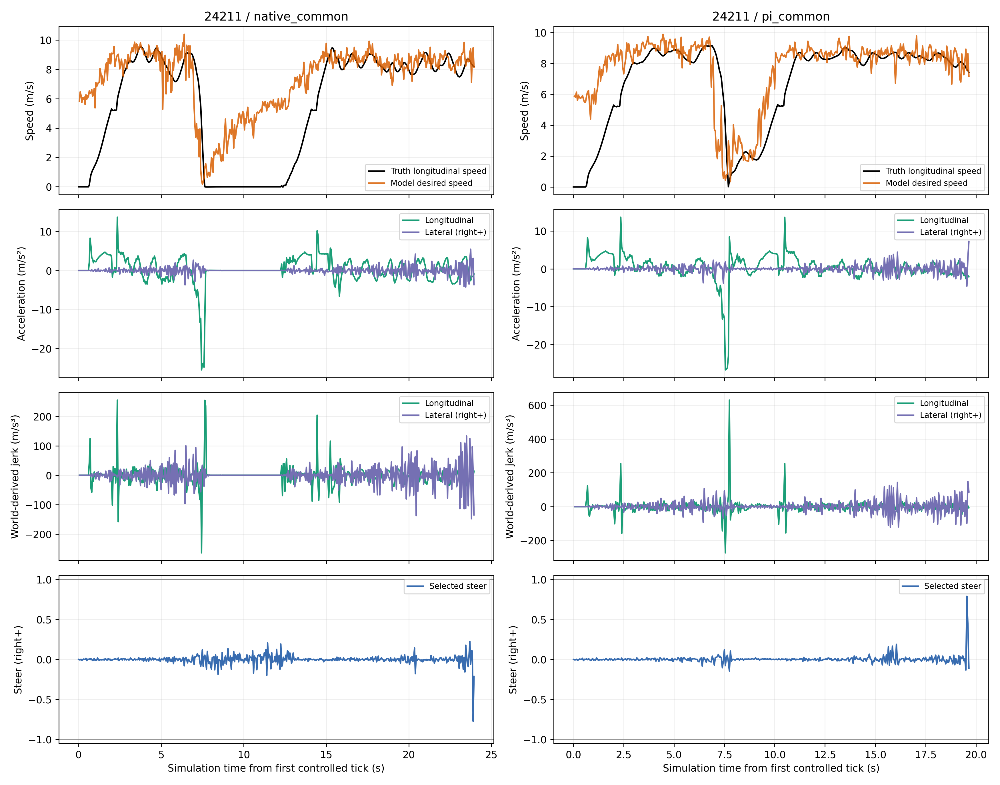

对照目标/实际速度、加速度、jerk和转向，注意碰撞与长停滞如何改变全程分布；图上没有删除失败段。 [PDF](results/figures-edition-001/24211-behavior.pdf)。

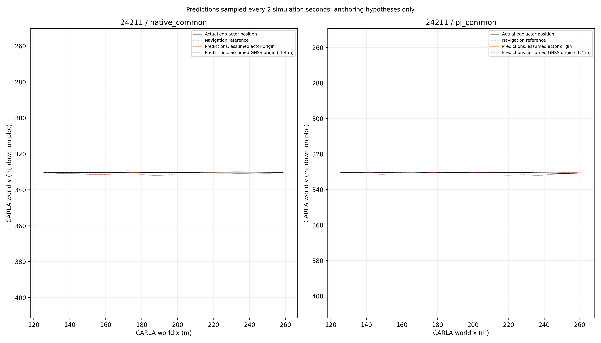

实际轨迹与预测用于观察路径方向及停滞位置；图中的物理原点假设尚未验证，不能当绝对模型跟踪精度。 [PDF](results/figures-edition-001/24211-world-predictions.pdf)。

## results/figures-edition-002

这是修复前接入发现阶段的历史图版。微负静止速度保护存在混杂，不再用于宣称PI效果；旧坐标布局也保留以便追溯。

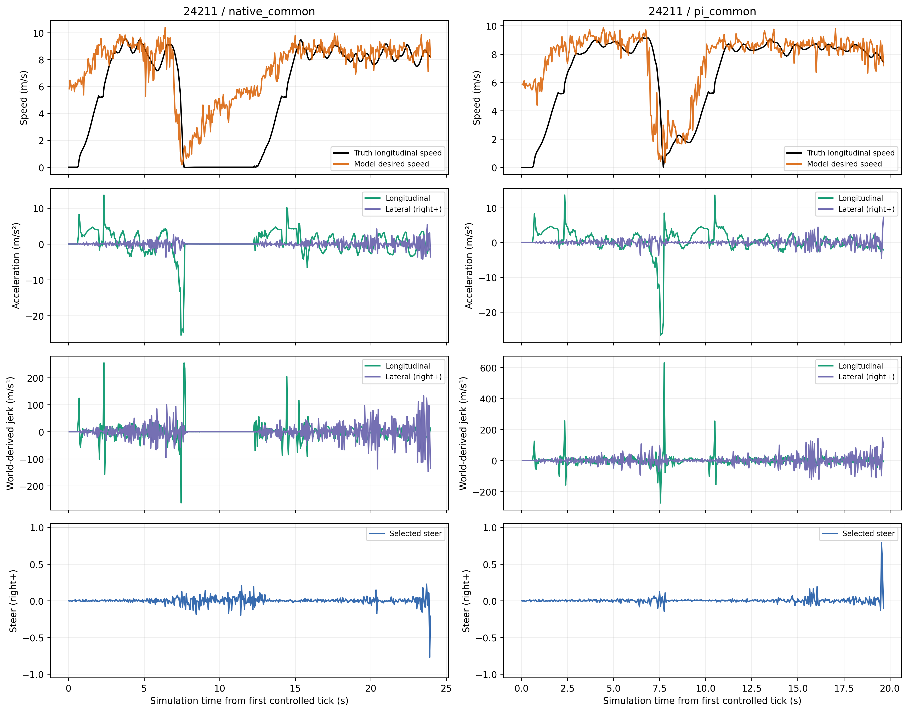

对照目标/实际速度、加速度、jerk和转向，注意碰撞与长停滞如何改变全程分布；图上没有删除失败段。 [PDF](results/figures-edition-002/24211-behavior.pdf)。

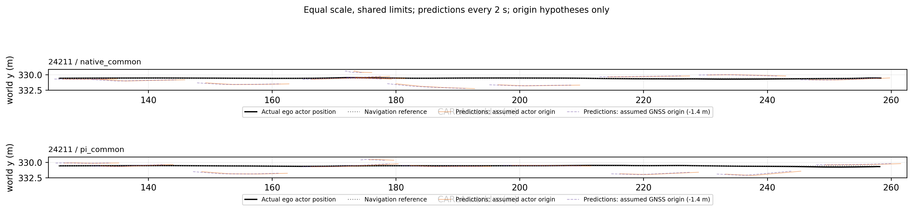

实际轨迹与预测用于观察路径方向及停滞位置；图中的物理原点假设尚未验证，不能当绝对模型跟踪精度。 [PDF](results/figures-edition-002/24211-world-predictions.pdf)。

## results/figures-edition-003-v1-discovery

这是修复前接入发现阶段的历史图版。微负静止速度保护存在混杂，不再用于宣称PI效果；旧坐标布局也保留以便追溯。

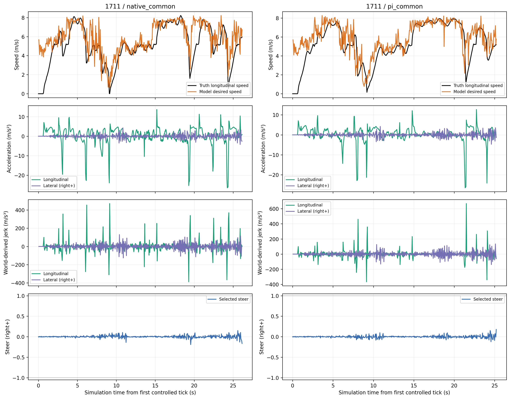

对照目标/实际速度、加速度、jerk和转向，注意碰撞与长停滞如何改变全程分布；图上没有删除失败段。 [PDF](results/figures-edition-003-v1-discovery/1711-behavior.pdf)。

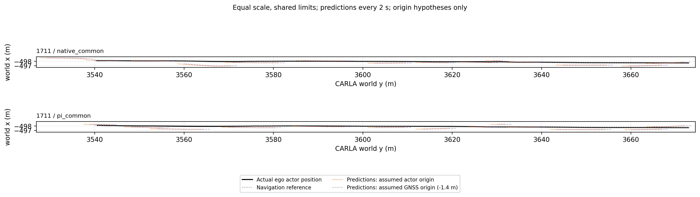

实际轨迹与预测用于观察路径方向及停滞位置；图中的物理原点假设尚未验证，不能当绝对模型跟踪精度。 [PDF](results/figures-edition-003-v1-discovery/1711-world-predictions.pdf)。

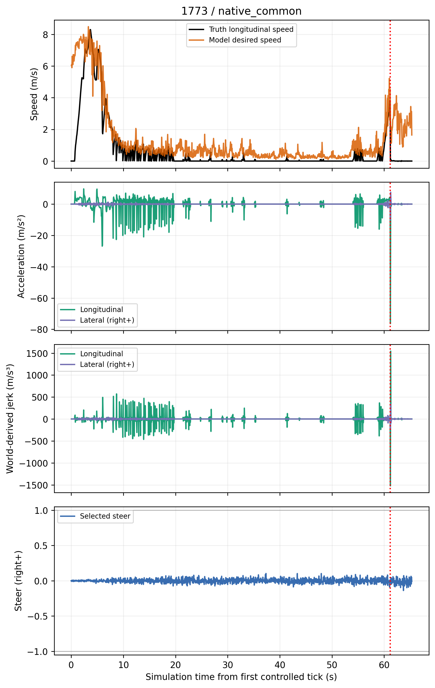

对照目标/实际速度、加速度、jerk和转向，注意碰撞与长停滞如何改变全程分布；图上没有删除失败段。 [PDF](results/figures-edition-003-v1-discovery/1773-behavior.pdf)。

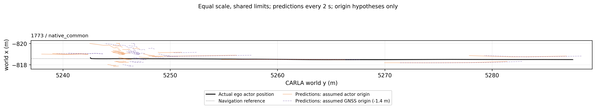

实际轨迹与预测用于观察路径方向及停滞位置；图中的物理原点假设尚未验证，不能当绝对模型跟踪精度。 [PDF](results/figures-edition-003-v1-discovery/1773-world-predictions.pdf)。

对照目标/实际速度、加速度、jerk和转向，注意碰撞与长停滞如何改变全程分布；图上没有删除失败段。 [PDF](results/figures-edition-003-v1-discovery/24211-behavior.pdf)。

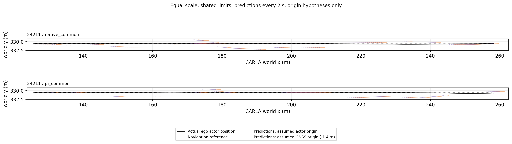

实际轨迹与预测用于观察路径方向及停滞位置；图中的物理原点假设尚未验证，不能当绝对模型跟踪精度。 [PDF](results/figures-edition-003-v1-discovery/24211-world-predictions.pdf)。

## results/paired-v2-figures-001

这是修复后运行尚未全部闭合时保存的中间图版；覆盖范围以当时图例及manifest为准。完整结论使用最终六例图版。

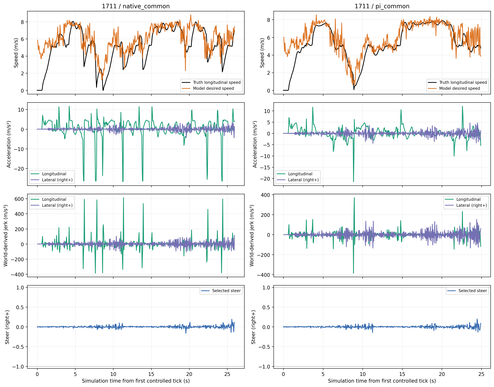

对照目标/实际速度、加速度、jerk和转向，注意碰撞与长停滞如何改变全程分布；图上没有删除失败段。 [PDF](results/paired-v2-figures-001/1711-behavior.pdf)。

实际轨迹与预测用于观察路径方向及停滞位置；图中的物理原点假设尚未验证，不能当绝对模型跟踪精度。 [PDF](results/paired-v2-figures-001/1711-world-predictions.pdf)。

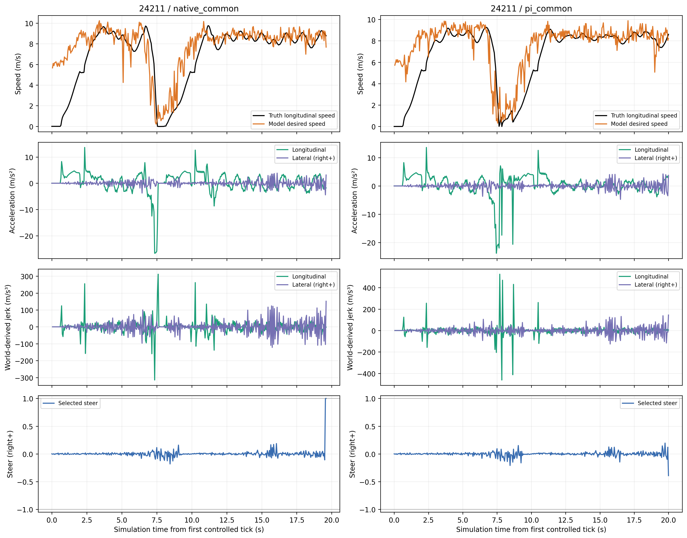

对照目标/实际速度、加速度、jerk和转向，注意碰撞与长停滞如何改变全程分布；图上没有删除失败段。 [PDF](results/paired-v2-figures-001/24211-behavior.pdf)。

实际轨迹与预测用于观察路径方向及停滞位置；图中的物理原点假设尚未验证，不能当绝对模型跟踪精度。 [PDF](results/paired-v2-figures-001/24211-world-predictions.pdf)。

## results/paired-v2-figures-002-native-closed

这是修复后运行尚未全部闭合时保存的中间图版；覆盖范围以当时图例及manifest为准。完整结论使用最终六例图版。

对照目标/实际速度、加速度、jerk和转向，注意碰撞与长停滞如何改变全程分布；图上没有删除失败段。 [PDF](results/paired-v2-figures-002-native-closed/1711-behavior.pdf)。

实际轨迹与预测用于观察路径方向及停滞位置；图中的物理原点假设尚未验证，不能当绝对模型跟踪精度。 [PDF](results/paired-v2-figures-002-native-closed/1711-world-predictions.pdf)。

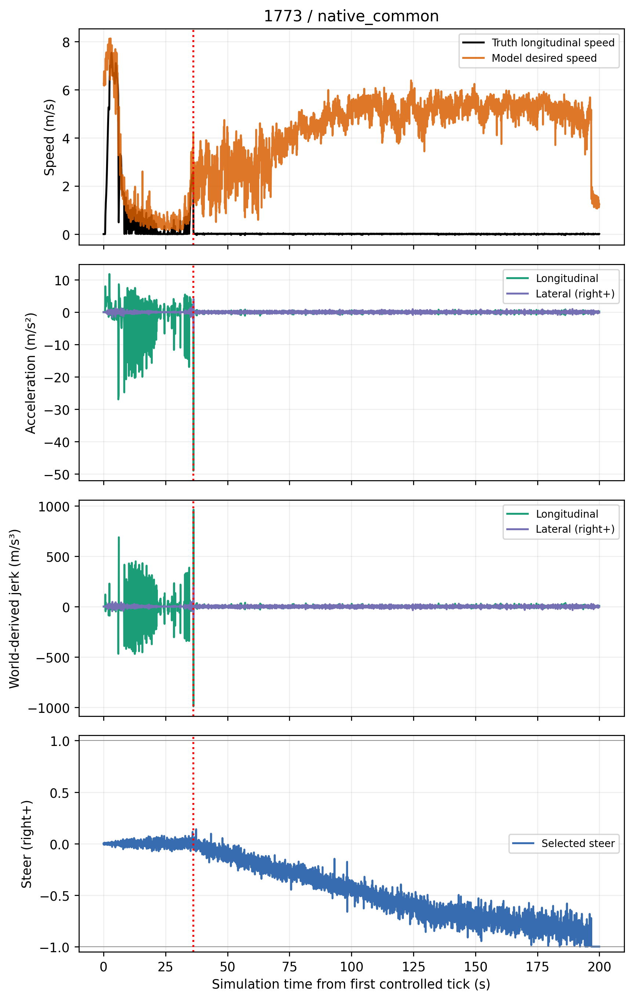

对照目标/实际速度、加速度、jerk和转向，注意碰撞与长停滞如何改变全程分布；图上没有删除失败段。 [PDF](results/paired-v2-figures-002-native-closed/1773-behavior.pdf)。

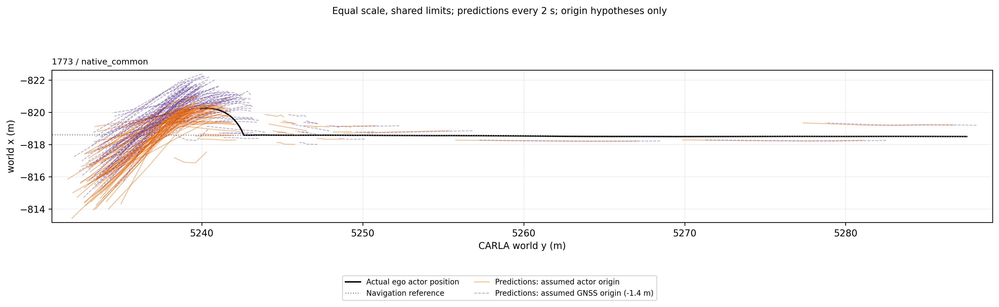

实际轨迹与预测用于观察路径方向及停滞位置；图中的物理原点假设尚未验证，不能当绝对模型跟踪精度。 [PDF](results/paired-v2-figures-002-native-closed/1773-world-predictions.pdf)。

对照目标/实际速度、加速度、jerk和转向，注意碰撞与长停滞如何改变全程分布；图上没有删除失败段。 [PDF](results/paired-v2-figures-002-native-closed/24211-behavior.pdf)。

实际轨迹与预测用于观察路径方向及停滞位置；图中的物理原点假设尚未验证，不能当绝对模型跟踪精度。 [PDF](results/paired-v2-figures-002-native-closed/24211-world-predictions.pdf)。

## results/paired-v2-figures-final

这是修复后真实TCP六例的最终图版。两臂障碍路线均碰撞停滞，不能把较低的全程物理指标当成功。

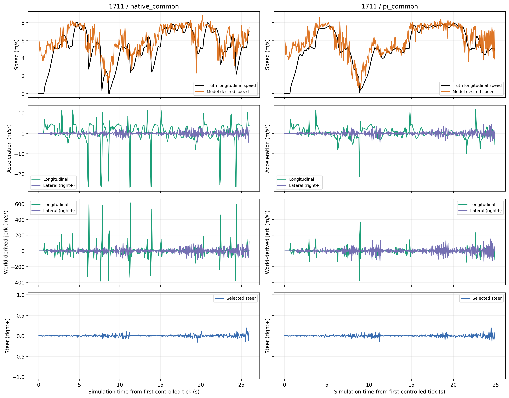

对照目标/实际速度、加速度、jerk和转向，注意碰撞与长停滞如何改变全程分布；图上没有删除失败段。 [PDF](results/paired-v2-figures-final/1711-behavior.pdf)。

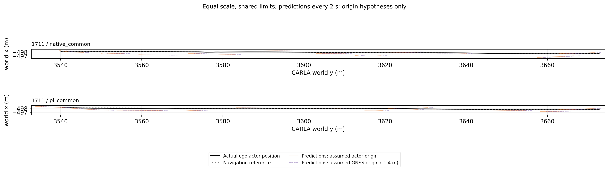

实际轨迹与预测用于观察路径方向及停滞位置；图中的物理原点假设尚未验证，不能当绝对模型跟踪精度。 [PDF](results/paired-v2-figures-final/1711-world-predictions.pdf)。

对照目标/实际速度、加速度、jerk和转向，注意碰撞与长停滞如何改变全程分布；图上没有删除失败段。 [PDF](results/paired-v2-figures-final/1773-behavior.pdf)。

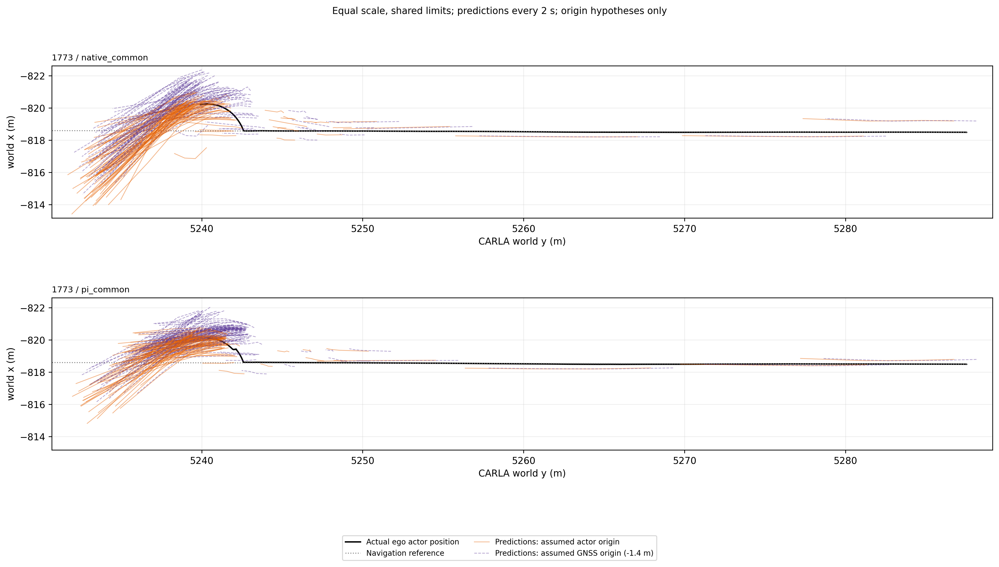

实际轨迹与预测用于观察路径方向及停滞位置；图中的物理原点假设尚未验证，不能当绝对模型跟踪精度。 [PDF](results/paired-v2-figures-final/1773-world-predictions.pdf)。

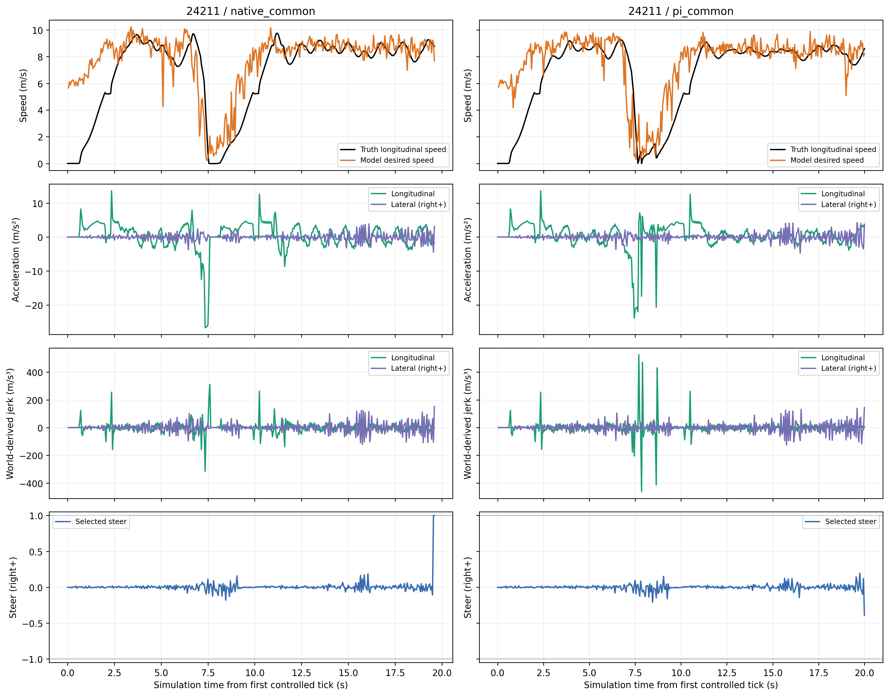

对照目标/实际速度、加速度、jerk和转向，注意碰撞与长停滞如何改变全程分布；图上没有删除失败段。 [PDF](results/paired-v2-figures-final/24211-behavior.pdf)。

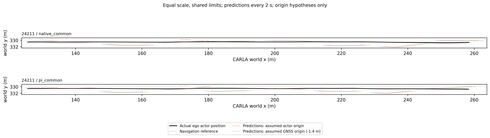

实际轨迹与预测用于观察路径方向及停滞位置；图中的物理原点假设尚未验证，不能当绝对模型跟踪精度。 [PDF](results/paired-v2-figures-final/24211-world-predictions.pdf)。

## results/turns-v1/figures

这是冻结四窗口及完整路线的最终横向对照。短前视候选有4项必要条件失败；查看误差与动作代价的同时变化。

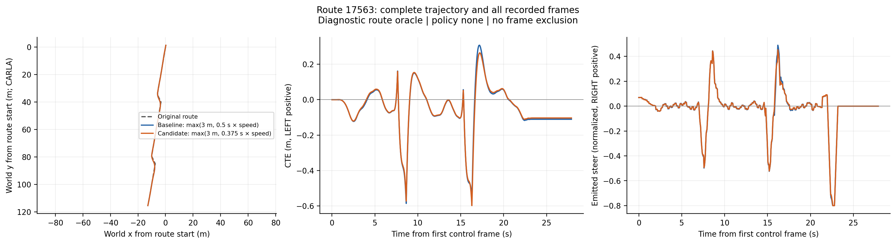

整条路线保留入弯、出弯及停车过程，用于检查局部窗口之外的回归。 [PDF](results/turns-v1/figures/route-17563-full.pdf)。

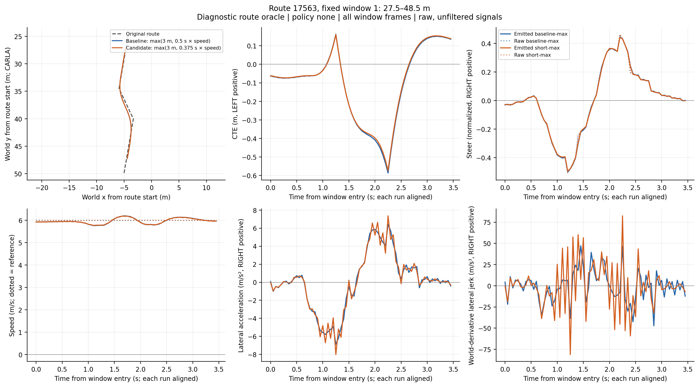

同时观察固定转弯窗口内的横向误差、转向变化和物理动作；不能只看CTE下降。 [PDF](results/turns-v1/figures/route-17563-window-1.pdf)。

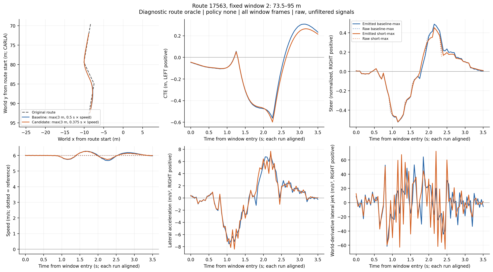

同时观察固定转弯窗口内的横向误差、转向变化和物理动作；不能只看CTE下降。 [PDF](results/turns-v1/figures/route-17563-window-2.pdf)。

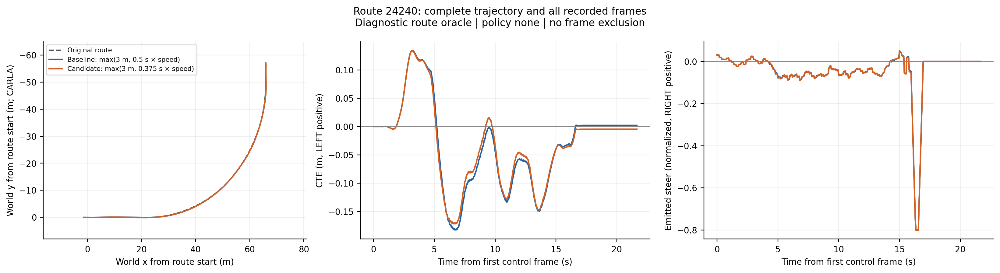

整条路线保留入弯、出弯及停车过程，用于检查局部窗口之外的回归。 [PDF](results/turns-v1/figures/route-24240-full.pdf)。

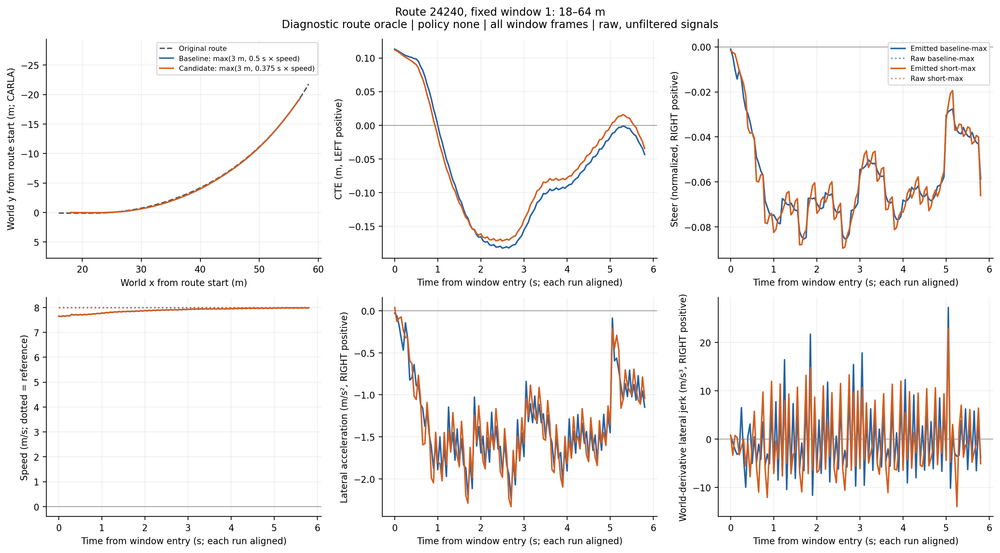

同时观察固定转弯窗口内的横向误差、转向变化和物理动作；不能只看CTE下降。 [PDF](results/turns-v1/figures/route-24240-window-1.pdf)。

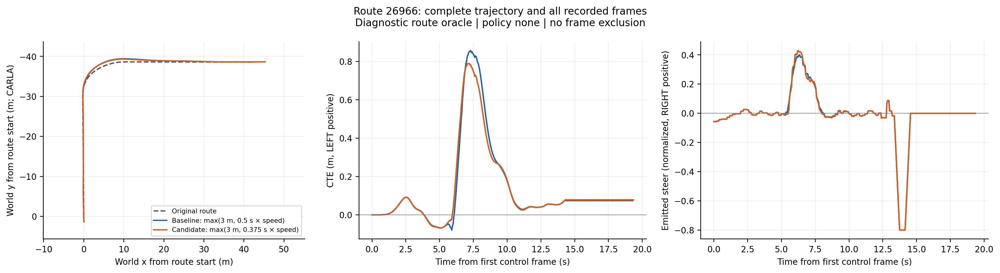

整条路线保留入弯、出弯及停车过程，用于检查局部窗口之外的回归。 [PDF](results/turns-v1/figures/route-26966-full.pdf)。

同时观察固定转弯窗口内的横向误差、转向变化和物理动作；不能只看CTE下降。 [PDF](results/turns-v1/figures/route-26966-window-1.pdf)。
