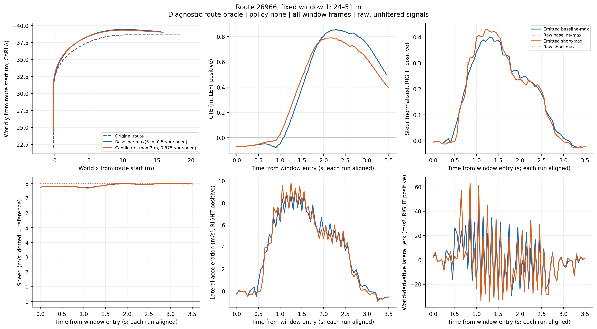
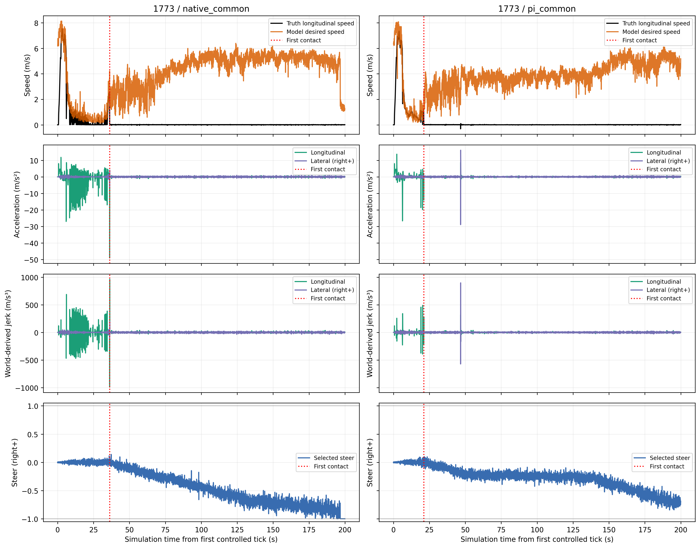

# 把转弯单独验收：局部误差改善不等于驾驶表现改善

2026-09-23。本阶段已完成真实TCP纵向六例、独立转弯六例、结果复算和本地代码集成。**短前视候选不通过；默认仍为carla/vendor。** 横向优化有价值，但本轮缩短前视仅带来小幅跟踪收益，同时增加部分转弯的动作强度，不能直接采纳。

## 单独看转弯，结论有什么不同

按原路线几何预先固定24240左弯、26966急右弯和17563的两个S窗口。先以整条路线运行两种配置，再分别提取入弯、弯中、出弯和后续10米；既不挑误差有利区间，也不靠长直路稀释问题。输入为已知路线诊断（route oracle），无神经网络、无背景交通。

唯一变化是前视距离 `max(3 m, coefficient × speed)` 的系数`.5→.375`。8m/s时4→3m，3m下限、巡航速度、纵向PI和转向限制不变。旧默认的432tick逐值回归保持一致。

| 固定窗口 | 横向CTE RMS，m：原始→候选 | 本轮代价或限制 |
| --- | --- | --- |
| 急右弯26966 | .5587→.5164，降低7.56% | 未达15%主目标；转向变化率p95增加34.95%，超20% |
| 左弯24240 | .1078→.1010 | 转向变化率p95增加73.07%，超20% |
| 第一个S | .2252→.2207 | 横向加速度p95增加13.49%，超10% |
| 第二个S | .2734→.2688 | p95和峰值反而略增，虽未超预设绝对增量限制 |

CTE指真值后轴到原始路线的横向距离，统一左正；急右弯的正残差在弯外侧，不是已经证明的内侧切角。p95表示绝对值的95分位。转向变化率是归一化steer命令每秒变化量，不是方向盘真实角速度。

六例都驶完全程、没有碰撞，并完成终点5秒保持；但逐弯验收是**126项中122通过、4失败**。不能用全程基础验证全部通过来撤销这些失败。所有窗口都没有低于2m/s的样本，完整控制/真值2761帧对齐；独立代理从原始日志复算四项失败，误差小于1e-9。

候选减小了弯后半段的外侧误差，但转向及物理加速度出现更强变化。速度曲线几乎重合，说明这项误差收益并非明显降速取得。出弯后10米RMS从.3170降到.2856m，两组仍均未在固定范围内达到持续恢复条件。

这一轮不追加反序六例，不放宽阈值或扩大参数网格。完整门槛、四窗口与三条全路线图见[转弯结果](results/turns-v1/README.md)，[冻结协议](turns/protocol.md)、[独立复核](agents/turns-final-review.md)。

## 真实TCP回答的是另一个问题

保持真实checkpoint、原生四个未来点（间隔.5s、总2s）、20Hz推理及横向目标仲裁，只比较共同执行限幅下的原生纵向与PI（比例积分控制，Kp=.5、Ki=.25）。每帧真实运行网络；总9807次forward，另有六个合法初始化帧。原生预测物理原点仍待确认，没有外推成5s或用真值路线修复网络预测。

| 路线 | 原生 / PI完成情况 | 能得到的结论 |
| --- | --- | --- |
| 24211动态横穿 | 两者100%、无碰撞 | 速度RMS和纵向jerk下降，但加速度p95略增 |
| 1711停车切入 | 两者100%、无碰撞 | 本次速度误差和纵向加速度/jerk均有改善 |
| 1773停车障碍 | 两者34.88%、一次车辆碰撞、4000tick失败 | PI没有解决绕障，且更早接触、停滞更久 |

三路线等权全程速度RMS降低8.69%，纵向加速度/jerk绝对p95均值降低39.71%/46.66%。这些满足预先登记的有限继续研究数值条件，**不证明整体驾驶更好**：障碍案例原生首次碰撞在36.20s，PI在21.05s；长时间停滞稀释了全程物理指标，PI碰撞前速度误差还更高。两次闭环随后看到的图像、模型预测和交通状态不同，不能当成同输入反事实。

碰撞后模型仍持续要求前进，油门命令正常交付，却几乎不移动。完整失败段与碰撞前段必须同时保留，不能以较低的全程jerk宣布绕障改善。碰撞责任仍未知；原生目标仲裁影响预测方向是机制线索，尚未证明是碰撞原因。

两臂都移除了官方尾部低速限油门，因而不是未经修改的官方最终策略；与旧官方TCP的耗时差不能算作PI收益。详情见[真实TCP报告](TCP-final-report.md)。该报告中的“转弯正在进行”是其冻结时状态，现在转弯也已结束；[当时README及报告原文](results/paired-v2-report-freeze-v1/relocation.md)已单独保存。

## 反馈迭代与保留的中间证据

首轮真实TCP接入暴露了接近零的微小负速度触发倒车保护。旧运行在第五例由根代理主动中断，不能把harness的`cancelled_by_user`字段理解为用户取消了任务。修复有限`abs(raw_speed)<.01m/s`的共同边界后，保留模型/原生PID的raw输入，完整重跑六例，没有拼接旧成功案例。

1299条记录重放中，倒车保护从456帧降至3帧，释放235条原生起步命令；这只证明保护边界修复，不证明碰撞恢复。旧版本的第一对平顺性数值受该故障混杂，已撤回效果解释，旧日志和图仍保留。

[原始索引](results/raw-indices/README.md)覆盖522个文件、88,832,090bytes，六目录逐文件SHA256复核零不匹配；大日志留在`/data/runs`。数字轨迹、模型预测、控制、事件、失败段和图表精确CSV保留，未录完整RGB视频。[全图版目录](figure-catalog.md)收集历史和最终PNG/PDF；旧图版只用于追溯，不替代修复后的主比较。

代码已将可选前视参数与实际TCP实验入口集成本地主分支，默认未升级；合并后112项控制器测试和17项TCP测试全部通过。候选G1理想模型18项通过，随后真实CARLA逐弯失败，说明离线结果不能代替闭环验收。[合并检查](results/merged-checks-v1/manifest.json)。

## 时间与下一步

真实TCP修复后六例用了21.34分钟，9813控制tick、零基础设施重试；两次4000tick障碍失败占记录执行成本83.12%。无模型转弯六例从矩阵start到end为52.12秒，2761tick，复用同一server；不能把这个速度当成真实智能模型的推理速度。当前runner的`attempt.wall_s`被evaluator值覆盖，计时应与完整受监督的attempt区间区分，详见[成本复算](results/paired-v2-cost/README.md)。

本阶段计划中的实施、六例对照、六例转弯、验收、绘图及本地集成都已完成，实验没有继续后台运行。下一轮有三项有边界的工作：

1. **先分解横向抖动来源。** 本次左弯候选最高10%转向变化率12/12帧、急右弯7/8帧与5Hz轨迹更新同帧。先用已存输入分开检查重规划几何、定位扰动与控制响应，再选一个改动；关联不当因果，不能直接靠更短前视或平滑掩盖问题。
2. **冻结下一候选再跑相同四窗口和完整路线。** 保留速度、动作代价、出弯恢复和停车条件；只有必要条件全部通过才运行反序确认，然后考虑新路线。当前短前视负结果不重置。
3. **真实TCP横向迁移另做契约验证。** 补齐训练标签物理原点，明确是否保留原生导航目标仲裁，支持原生2s时域；随后把“模型路径不可行”和“执行跟踪失败”分开。不能把oracle本轮的改善百分比移植为TCP收益。
