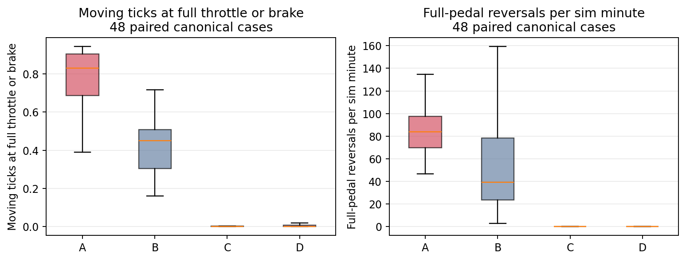
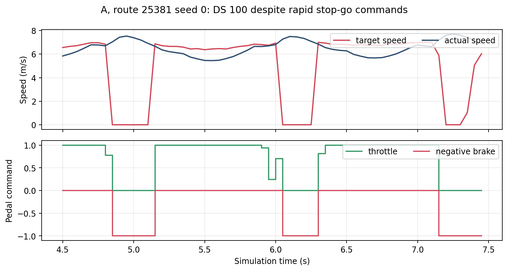
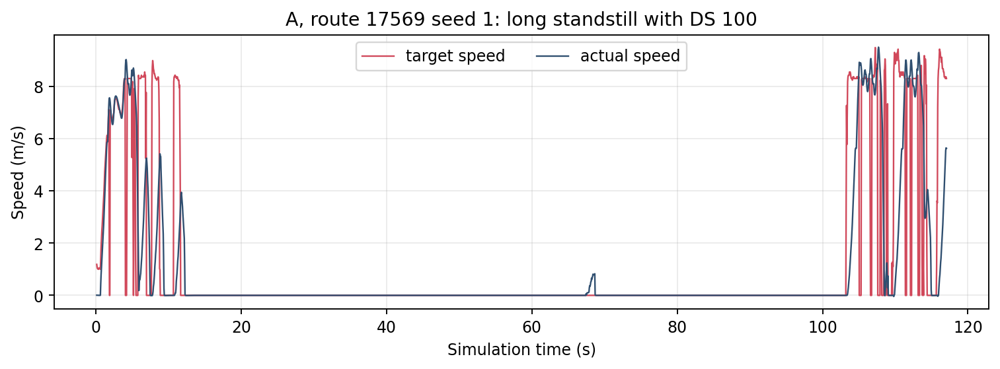

# A 的缺陷：高 Driving Score 下的控制与驾驶问题

## 范围和判断口径

审计 W2 正式运行中 A、B 的 Dev10（30 个 case）与 v1 holdout（18 个 case），以及 W2b 中同一 48 个 route×seed 的 C、D；只读取各 case 的 `done.json` 所选有效 attempt、逐帧真值/控制和官方结果。A 的 48 个 case 全部 `Completed`，42 个 DS=100（holdout 为 18/18），但「完成并获得高分」并不能代表乘坐舒适、没有无谓停车或具有可重复的安全余量。下面按实际影响排序；“确定度”区分观察事实和归因，“DS”指官方 Driving Score 是否给这一现象扣分。

| 排名 | 问题 | 证据概览 | 确定度 | DS 是否捕获 |
| --- | --- | --- | --- | --- |
| 1 | 行进中频繁全油门/全刹车，伴随目标速度突降至零和急加减速 | A 行进帧中全踏板占比的逐 case 中位数 **83.2%**，B 为 45.1%；A 的全踏板反向切换中位数 **84 次/仿真分钟**；42 个 DS=100 的 A case 仍有 29 个全踏板占比 >70% | **高**：命令与运动事实；**中**：某次归因到模型、heuristic 或具体交通情境 | **没有**舒适性罚分；这些 case 可得 100 |
| 2 | 可发生长时间原地全刹车而顺利满分；效率和可靠性盲点 | A 17569/seed1 连续近零速 **55.45 s + 34.80 s**，约 90 s 目标速度为 0、99% 帧全刹车，DS=100；同 seed 的一次补充重跑没有复现 | **高**：原始 case 事实与评分盲点；**低**：可重复率及停车原因 | **没有**；此 case DS=100 |
| 3 | 已评分的安全/规则失败仍然存在 | 2091/seed0、1 各一次车辆碰撞，DS=60；25378 三个 seed 未让行救护车，DS=70；25424/seed1 车道外行驶，DS=96.23 | **高**：官方事件；**低至中**：特定事件由 A 的哪一环节造成 | **有**，分别扣分 |

## 1. 激进且抖动的纵向控制是最普遍的缺陷

统计口径：碰撞前、真值前向速度 >2 m/s 的逐帧执行控制；“全踏板”定义为 `throttle≥0.95` 或 `brake≥0.95`。一个 case 先算占比，再对 48 个 case 取中位数，避免长路线主导。A 的全油门/全刹车中位数分别为 **51.3% / 31.4%**，合计 **83.2%**；B 分别为 **30.6% / 14.4%**，合计 **45.1%**。逐 route×seed 配对，A 的全刹车占比 **48/48** 高于 B，全踏板占比 **47/48** 高于 B。C、D 的全踏板占比为 0，原因是它们的输出上限设计本就低于 0.95，因此这项指标最公平的参照是 B；C、D 只说明更温和的命令在这些路线可执行。

“反向切换”是在五帧（0.25 s）内，从饱和油门切到饱和刹车，或反向切换的次数，除以碰撞前仿真时长。A 的逐 case 中位数 **84 次/分钟**，B 为 **39 次/分钟**。A 在行进中把目标速度设为 <0.1 m/s 的占比中位数 **22.3%**，B 为 **7.6%**；相邻 0.05 s 行进帧内目标速度跳变 ≥5 m/s，A 中位数 **19 次/case**，B 为 **6 次/case**。A 的 42 个 DS=100 case 中，**42/42** 仍有这种 ≥5 m/s 跳变，**40/42** 行进时零目标占比 >10%。零目标可能是避障/信号响应；仅凭帧日志不能说每次都是错误感知。相同帧的 B shadow 控制在 A 零目标帧也有约 81% 刹车，因此**不能把这些零目标帧的刹车单独归咎于 A 的 PID**。确定的是 A 整体的踏板饱和和反复切换远多于 B。

图中每个点的统计单位是一个有效 case，箱体展示 48 个 case 的分布。A 与 B 使用同一路线和 seed，A 的纵向命令更激进；C、D 的 0 全踏板受设计上限影响，不宜视为独立的舒适度证明。

例如 A 的 25381/seed0 在 4.8–5.15 s、6.05–6.30 s、7.15–7.35 s 目标速度骤降至零、执行全刹车，随后目标回到约 7 m/s 又执行全油门；当时车速约 7 m/s。这一 case 的官方 **DS=100**，全程有 27 次行进中 ≥5 m/s 的目标速度跳变。图是原始 20 Hz 逐帧轨迹，不是平滑后的重建。

三次短促的「零目标—全刹—恢复目标—全油门」直接显示命令抖动。图不证明零目标的上游原因；它证明当前闭环没有抑制这样的急停急起，而 DS 没有惩罚。

独立的运动学交叉检查来自已有 [`tracking.csv`](results/tracking.csv) 的 `pre`、0.5 s 栏：A 的逐 case 纵向加速度绝对值 P95 中位数 **11.85 m/s²**、纵向 jerk P95 中位数 **157.42 m/s³**；B 为 **7.68 / 113.85**，C 为 **4.72 / 63.58**。在 48 个配对 case 中 A 的纵向加速度 P95 高于 B **41/48**、高于 C **48/48**。这些数是以 0.05 s 真值速度差分求得的*诊断代理量*，没有滤波，不等同于认证的乘坐舒适度测量或物理加速度传感器读数；它们与踏板轨迹方向一致。即使限定在 A 的 42 个 DS=100 case，纵向加速度 P95 中位数仍为 **11.85 m/s²**，其中 **35/42** >10 m/s²。

## 2. 满分掩盖长时间无效停车

W2 正式 A `17569/seed1` 的 2341 帧、117.05 s 中，经过起步后出现两段前向速度绝对值 <0.1 m/s 的连续停滞：帧 244–1352 为 **55.45 s**，帧 1373–2068 为 **34.80 s**。两段合计 **90.25 s**；对应目标速度为零的帧占比分别 100% 和 99.3%，全刹车帧各约 99.2%。`creep_active`、`stop_sign_active` 均为 false。case 最终到达终点且 **DS=100**。这说明评分不直接处罚这种严重的行程时间损失；它不能说明 A 无视了红灯、阻挡车辆或安全约束，因为原正式运行未记录足以区分这些原因的 actor/信号状态。

目标速度和真值车速在两段长停滞期间都几乎为零，显示停车来自闭环命令，而非车辆无法执行正向加速命令。图只代表这次有效运行，不能推断常见发生率。

为探查原因，在相同 route/seed/arm 上额外进行**一次**有 actor telemetry 与 CARLA recorder 的受限重跑，保持同一 I1–I3 检查和未改动的驾驶代码。重跑于 432 帧、21.6 s 完成，最长起步后近零速仅 **0.95 s**，也得 DS=100；长停滞**未复现**。因此本报告把 17569/seed1 列为已观察到的个案和明确的评分盲点，而不是 A 的稳定、必现故障。补充运行原始日志在 `/data/runs/b2d/tfv6-a-defects/probe/`，不替换 W2 正式 case。

## 3. DS 确实抓到的安全与规则问题，归因仍需谨慎

| 正式 A case | 官方事件和分数 | 逐帧线索 | 解释边界 |
| --- | --- | --- | --- |
| 2091/seed0、1 | 各一次 `collisions_vehicle`，各 DS=60 | seed0 碰撞时约 5.6 m/s、执行全油门；seed1 碰撞事件时接近静止、执行全刹车 | 两次都是真实评分失败；seed1 可能是被撞，日志不能证明 A 对碰撞负全责。B/C/D 在此路线也多有碰撞或低分。 |
| 25378/seed0、1、2 | 各一次 `yield_emergency_vehicle_infractions`，各 DS=70 | 官方记录为未向救护车让行；无准确事件帧与对方轨迹 | 三个 seed 同向失败，规则适应性问题成立；B/C/D 同三个 seed 也 DS=70，故不能称 A 独有或确定属于纵向控制器。 |
| 25424/seed1 | `outside_route_lanes` 一次，DS=96.228568 | 事件约在 9.95 s，车速约 7.4 m/s、目标约 11.1 m/s、油门 1、转向约 +0.455 | 偶发的路线/横向安全边界问题；B/C/D 此 case 为 DS=100，仍不能从单次事件判断是哪个子模块导致。 |

这些事件说明 A 的高平均 DS 不是无事故或规则完美。相反，DS 对已定义的碰撞、让行、车道事件能够扣分；它**没有**评价第一、二节的控制品质与耗时。值得避免的误读是把官方 `min_speed_infractions` 列的 933 条直接当作 933 次违规：本地 Bench2Drive `MinimumSpeedRouteTest` 在检查点记录自车/背景平均速度比例，评分配置把该事件标为 `unused`。它可提供速度背景信息，却不是可靠的逐次违章计数。

## 复现与边界

审计脚本：[`scripts/b2d_tfv6_a_defects.py`](../../scripts/b2d_tfv6_a_defects.py)；每 case 指标：[`case-metrics.csv`](results/a-defects/case-metrics.csv)；绘图脚本：[`scripts/b2d_tfv6_a_defects_figures.py`](../../scripts/b2d_tfv6_a_defects_figures.py)。原始正式日志位于 `/data/runs/b2d/tfv6-w2/formal/`，C/D 位于 `/data/runs/b2d/tfv6-w2b/`。所有百分比按 case 聚合；不同控制臂会改变交通交互和自身轨迹，因此配对 route×seed 是比较框架，**不是逐帧同一情境的因果实验**。本任务未改驾驶代码、TFv6 或 LEAD。
