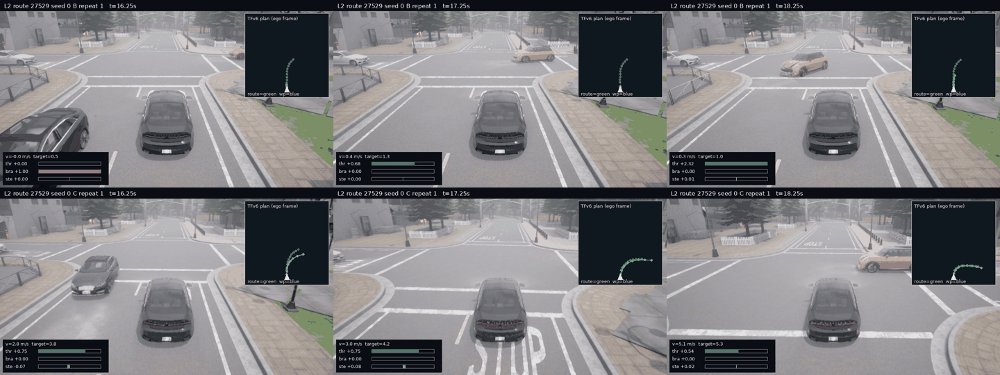
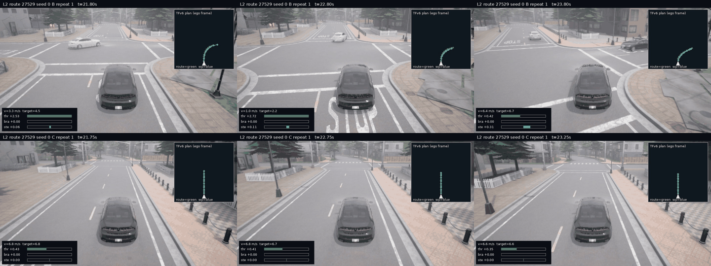
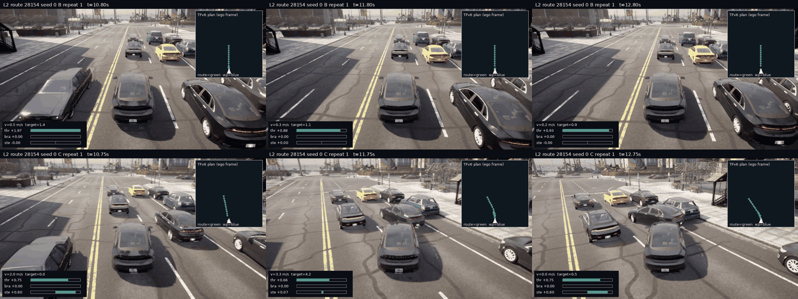
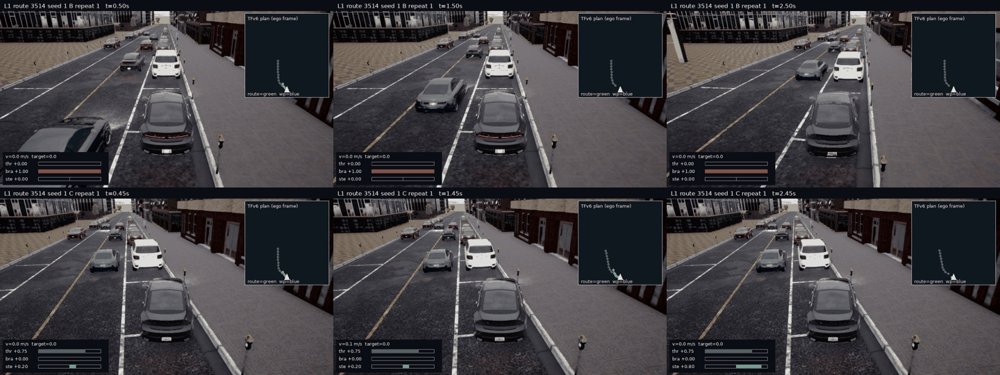
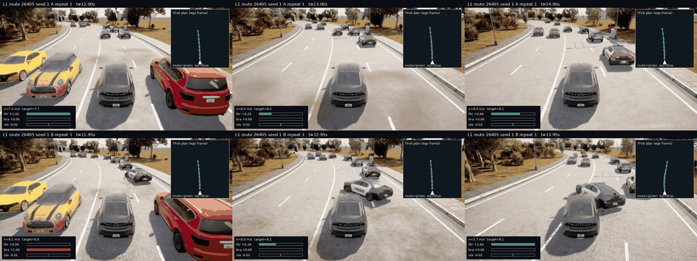

# TFv6 W2：D2 定点重跑与场景复核

2026-09-24。依据 bus `answer-8.md` 的 GO，重跑 D1 指定的三组并追加 1/3514/seed 1；每组同 seed 的两个臂各做两次**新重复**，总计 16 个有效 case。原正式结果原封不动，重跑文件在 `/data/runs/b2d/tfv6-w2/d2/repeat-{1,2}/`，CARLA recorder、逐 tick `frames.jsonl`、官方 `results.json`、`infractions.json` 和离屏渲染都留在 `/data`。所有重跑由同一个冻结 TFv6 checkpoint、四臂候选计算及原有控制律执行；新增代码只把邻近 actor 状态写入日志并开启 recorder，没有把新状态送进模型或控制器。此处只描述这 4 个事先选定的 (route, seed)，不做统计检验或新的控制器结论。

每个 tick 从 CARLA snapshot 取最近 8 个 60 m 内 actor：ID、type、ego 坐标（x 前、y 右）位置、相对速度和距离；actor type 列表每 10 tick 更新，位姿与速度每 tick 更新。16/16 个重跑的 actor 日志覆盖其全部有效 tick，`telemetry_error` 为 0；每个 case 均有 CARLA recorder。录像是**驾驶结束后**在单独的 offscreen CARLA server 上回放 recorder，挂只读追车相机（960×540，车后 7.5 m、高 4.2 m、俯角 20°），并按回放真值位置与逐 tick 日志对齐。每帧右上叠加 TFv6 的 8 个 waypoint（蓝）及 route points（绿）的 ego 平面图，左下叠加实际执行的 throttle/brake/steer 请求值与速度；数值请求可能超过物理限幅。接触图按 `research/plot_style.py` 的信息密度取 2 臂×3 时点，PNG 均小于 500 KiB；所有 mp4 的绝对路径列在后文。

## 重复性账本

比较规则事先写明：DS 的“精确重现”为原值与重复值相差 ≤0.01 DS；status 为官方字符串完全相同；首个**计分**违规为类型相同且时间差 ≤1 s，两侧都没有计分违规也算重现。终止型 route deviation/blocked 若日志事件列表没有，则按官方终态放在末 tick。原始 `infractions.json` 常先报未参与 DS 的 min-speed；[`repeatability.csv`](results/diagnosis/d2/repeatability.csv) 同时保留首个**任何**违规的类型和时间，按同样 ±1 s 规则 16/16 重现。下表主列采用更能解释 DS 的计分违规，✓/✗ 表示该列的重现规则是否满足。

| 级/路线/seed/臂 | 重复 | DS 原→新 | status 原→新 | 首个计分违规 原→新 |
|---|---:|---|---|---|
| 2/27529/0/B | 1 | 100.00→100.00 ✓ | 完成→完成 ✓ | 无→无 ✓ |
| 2/27529/0/B | 2 | 100.00→100.00 ✓ | 完成→完成 ✓ | 无→无 ✓ |
| 2/27529/0/C | 1 | 24.01→24.01 ✓ | 偏离→偏离 ✓ | 停车 17.35s→停车 17.25s ✓ |
| 2/27529/0/C | 2 | 24.01→24.01 ✓ | 偏离→偏离 ✓ | 停车 17.35s→停车 17.15s ✓ |
| 2/28154/0/B | 1 | 100.00→100.00 ✓ | 完成→完成 ✓ | 无→无 ✓ |
| 2/28154/0/B | 2 | 100.00→100.00 ✓ | 完成→完成 ✓ | 无→无 ✓ |
| 2/28154/0/C | 1 | 36.00→36.00 ✓ | 完成→完成 ✓ | 车辆碰撞 11.75s→车辆碰撞 11.25s ✓ |
| 2/28154/0/C | 2 | 36.00→36.00 ✓ | 完成→完成 ✓ | 车辆碰撞 11.75s→车辆碰撞 11.35s ✓ |
| 1/26405/1/A | 1 | 100.00→100.00 ✓ | 完成→完成 ✓ | 无→无 ✓ |
| 1/26405/1/A | 2 | 100.00→100.00 ✓ | 完成→完成 ✓ | 无→无 ✓ |
| 1/26405/1/B | 1 | 6.60→29.45 ✗ | 完成→完成 ✓ | 车辆碰撞 12.95s→车辆碰撞 13.10s ✓ |
| 1/26405/1/B | 2 | 6.60→23.45 ✗ | 完成→阻塞 ✗ | 车辆碰撞 12.95s→车辆碰撞 12.95s ✓ |
| 1/3514/1/B | 1 | 91.68→100.00 ✗ | 完成→完成 ✓ | 越线 6.75s→无 ✗ |
| 1/3514/1/B | 2 | 91.68→90.92 ✗ | 完成→完成 ✓ | 越线 6.75s→越线 6.80s ✓ |
| 1/3514/1/C | 1 | 65.00→65.00 ✓ | 完成→完成 ✓ | 静态碰撞 1.40s→静态碰撞 1.40s ✓ |
| 1/3514/1/C | 2 | 65.00→65.00 ✓ | 完成→完成 ✓ | 静态碰撞 1.40s→静态碰撞 1.40s ✓ |

合计 **DS 精确重现 12/16、status 重现 15/16、首个计分违规及 ±1 s 重现 15/16**。大差的方向在四组两次重复均未反转：27529 C−B 原/重复均 −75.99 DS，28154 均 −64.00；26405 A−B 原 +93.40、重复 +70.55/+76.55；3514 C−B 原 −26.68、重复 −35.00/−25.92。26405 B 的第二次是官方 `Failed - Agent got blocked` 驾驶结果，照原样计入，不能改作基础设施失败；这条路线的碰撞类型/时刻仍重现，但 DS 和终态不稳定。3514 B 的第一次没有原来的越线罚分、第二次仍有；C 的 1.40 s 静态碰撞两次均重现。这个复测范围很窄，不能给 16 条路线的总体重复性做保证；新加的 recorder 与 actor 查询也带来运行开销，所以原/重跑差异不能被单独归因为 CARLA 随机性。

## 回放窗口：看到了什么

下列 contact sheet 每行一个臂（上为 B 或 A、下为 C 或 B），三列约为中心时刻的 −1/0/+1 s；它们是 recorder 的 offscreen replay，不是原驾驶时另外加的输入相机。视频所见与推断刻意分开：违规类型、对象 ID 和时间取官方事件及 actor 日志，控制值/TFv6 计划取时间对齐后的逐 tick 日志。表中路径都指向 `/data`，mp4 不进入 git。

### 2/27529/0：停车线与横向车流，17.3 s

**视频所见：** B 在停车线前接近停住，C 以约 3 m/s 越过白色停车线；交叉方向有车辆经过。**日志所见：** C 在 17.25 s 仍请求 throttle 约 0.75，官方在 17.25 s 记 `STOP_INFRACTION`，该事件在两个重跑分别落在 17.25/17.15 s；约 18.9 s 又记与 `vehicle.mini.cooper_s_2021` 的碰撞。**推断：** C 没有在停车线前停稳，这是停车罚分的直接场景解释；仅凭该窗口不能判断是 TFv6 意图、纵向控制还是后处理哪一步造成未停稳。

### 2/27529/0：路线偏离，22.8 s

**视频所见：** C 已驶过路口，在可通行的直路上继续前进；B 此时还在路口附近准备右转。**叠加和官方记录所见：** B 的 route/waypoint 朝右弯且 steer 转右，C 的当时局部 route/waypoint 已变成直线、steer 近 0；C 于约 23.3 s 被判 `Agent deviated from the route`，RC 50.02，两个重跑重现。**推断：** 这里的“偏离”是离开指定路线分支，并非视频中看见驶上路肩；C 较早穿越路口并继续直行与错过右转相符，但当前回放不能独立拆开早期速度、交叉车流和模型重新规划各自的作用。

### 2/28154/0：车流中的车辆碰撞，11.8 s

**视频所见：** C 接近一列斜向占据车道的车辆，车头靠近前右侧的黑色轿车，碰后速度降到接近 0；B 在同一时刻的另一条轨迹上从车流旁通过。**官方事件与 actor 日志所见：** C 重跑 1 于 11.25 s 首撞 `vehicle.lincoln.mkz_2020`（ID 65），碰撞点前该车约在 ego 前方 4.5 m、右侧 0.4 m，之后又产生同类车辆碰撞罚分，故 DS 36；重跑 2 首撞在 11.35 s，B 两次均 100 DS。**推断：** C 与车流的相遇几何反复不利，直接导致车辆罚分；视频和单 tick 相对速度不足以判定是 C 先挤入空隙、对方变道，还是两者共同造成接触。

### 1/3514/1：出生点旁的静态接触，1.5 s

**视频所见：** 两臂都出生在道路右缘、白色厢车后方；C 刚起步就贴着右侧路缘缓慢向前并给出约 +0.20 steer，B 仍停着。**官方事件所见：** C 两次均在 1.40 s、只行驶约 0.65 m 时撞到 `static.static`（ID 0），两次 DS 都为 65；B 没有这一静态碰撞。**推断：** 接触位置很接近道路边缘，路缘/地图静态网格是可见的候选，但 CARLA 把碰撞体记为通用 `static.static`，视频不能精确点名是路缘、护栏还是另一个地图网格。B 的越线罚分另有波动（原 91.68，重跑 100.00/90.92），所以这组净 DS 差也波动，C 的早期静态碰撞本身稳定。

### 1/26405/1：警车横穿带来的车辆碰撞，13.0 s

**视频所见：** B 在约 13 s 以约 8 m/s 遇到一辆从右侧斜向进入车道的警车，警车横在其车头前；接触后 B 减速并继续请求较大 throttle。**官方事件与 actor 日志所见：** 重跑 1 的首撞是 `vehicle.dodge.charger_police`（ID 225，13.10 s），碰撞点前该车中心约在 B 前方 3.3 m、右侧 1.0 m；同一时刻 A 轨迹上的同 ID 车约在前方 26 m，A 没有计分违规。**推断：** A/B 较早分开的闭环位置改变了与横穿车的相遇时机，这与 A 的优势相容，但不能从两条不同轨迹的单帧画面认定某一 control tick 单独导致事故；B 第二次重跑虽然仍在 12.95 s 碰撞，后续却以 blocked 结束，说明结果总分不稳定。

## 视频、图片和核对文件

所有短 mp4 取**重复 1**，逐帧叠加同一次驾驶的 TFv6 输出与实际 control；重复 2 保留 recorder、actor 日志与官方计分，未为每条重复额外剪片。下面每行的两个路径对应 contact sheet 上/下两行。

| 窗口 | 上行 mp4 | 下行 mp4 |
|---|---|---|
| 27529 停车线 | `/data/runs/b2d/tfv6-w2/d2/render/2-27529-0-B-r1-stop/window.mp4` | `/data/runs/b2d/tfv6-w2/d2/render/2-27529-0-C-r1-stop/window.mp4` |
| 27529 路线偏离 | `/data/runs/b2d/tfv6-w2/d2/render/2-27529-0-B-r1-deviation/window.mp4` | `/data/runs/b2d/tfv6-w2/d2/render/2-27529-0-C-r1-deviation/window.mp4` |
| 28154 车辆碰撞 | `/data/runs/b2d/tfv6-w2/d2/render/2-28154-0-B-r1-collision/window.mp4` | `/data/runs/b2d/tfv6-w2/d2/render/2-28154-0-C-r1-collision/window.mp4` |
| 26405 车辆碰撞 | `/data/runs/b2d/tfv6-w2/d2/render/1-26405-1-A-r1-collision/window.mp4` | `/data/runs/b2d/tfv6-w2/d2/render/1-26405-1-B-r1-collision/window.mp4` |
| 3514 静态碰撞 | `/data/runs/b2d/tfv6-w2/d2/render/1-3514-1-B-r1-static/window.mp4` | `/data/runs/b2d/tfv6-w2/d2/render/1-3514-1-C-r1-static/window.mp4` |

脚本：[`b2d_tfv6_d2.py`](../../scripts/b2d_tfv6_d2.py) 指定并执行 16 次重跑；[`b2d_tfv6_d2_analyze.py`](../../scripts/b2d_tfv6_d2_analyze.py) 从每个选中 `done.json`、官方结果与事件生成重复性表；[`b2d_tfv6_d2_render.py`](../../scripts/b2d_tfv6_d2_render.py) 回放 recorder、按 ego 真值轨迹对齐并生成视频/contact sheet。每次回放保留 `render.json`（包括对齐残差、时窗和逐帧时间），原始相机 JPEG 与叠加 JPEG 在相邻 `/data/runs/.../d2/render/` 目录。D2 没有扩大路线/seed/臂清单、没有换模型或调整控制器参数；3514 是 `answer-8.md` 明确追加的第四组。

核对：16 个 recorder 都非空，16 个重跑的 actor 遥测均覆盖全部有效 tick 且无记录错误；10 个 mp4 经 `ffprobe` 检查可读，时长 2.7–4.4 s，5 张 contact sheet 各约 294–327 KiB。回放与真值轨迹匹配的第 60 百分位位置残差为 0–0.75 m（最大的是 3514/B，其事故对照臂 C 为 0.17 m），所以图中叠加适合看局部计划和 control，不应用作亚帧级的碰撞顺序证据。`test_b2d_tfv6_agent.py`、`test_b2d_tfv6_analysis.py`、`test_b2d_tfv6_diagnose.py` 共 13 项通过，运行后没有遗留 CARLA server。D2 的这些定点观测不替换 `report.md` 的正式 48 对结果与预登记决策。
