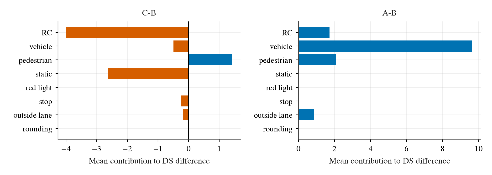
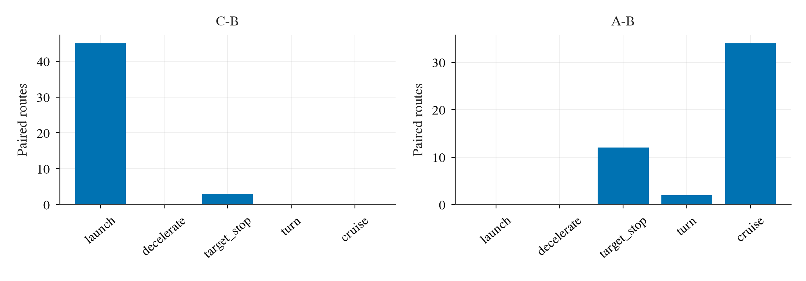
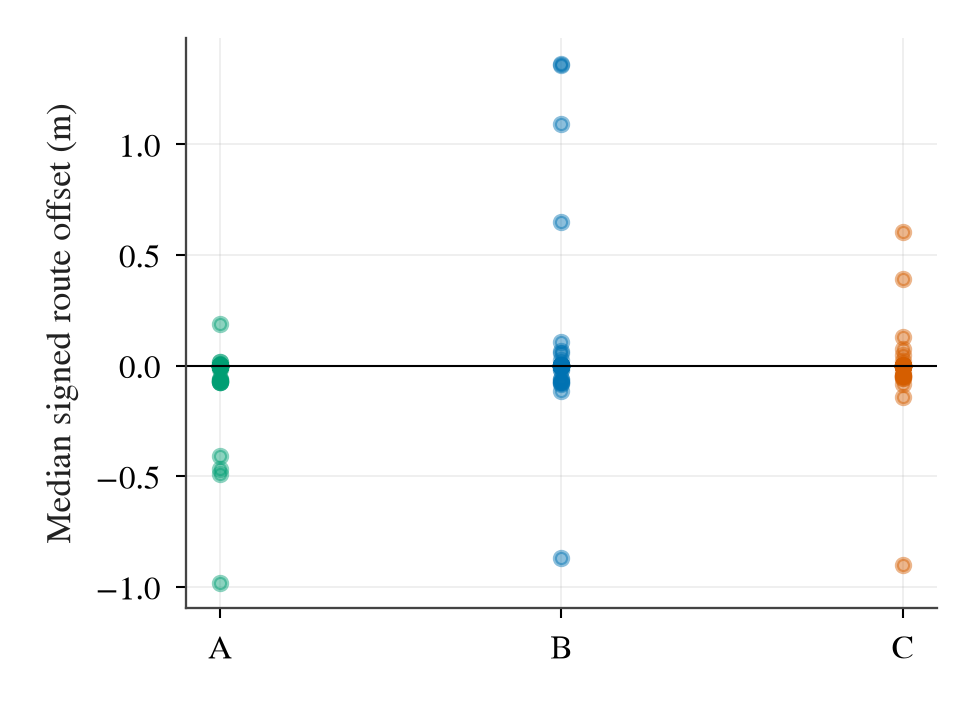

# TFv6 W2：D1 逐 tick 日志诊断

2026-09-24。只分析 W2 已完成的 202 个有效 case：第 1 级 120、第 1r 级 10、第 2 级 72。正式配对账本只用第 1、2 级的 16 条路线 × 3 seed，即 C−B、A−B 各 48 对；第 1r 级仅是 A 的重跑，不能混作新配对。输入严格从 `formal/level*/cases/<level>/route-*/seed-*/<arm>/done.json` 的选中 attempt 读取，未读 `aborted/`。本诊断不改控制器、不运行 CARLA、不做效应检验；所有量仅描述已发生的轨迹。

## 1. DS 拆账

锁定的 B2D scorer 在 `/data/runs/b2d/tfv6-repro/runtime/Bench2Drive/leaderboard/leaderboard/utils/statistics_manager.py:21-37,387-413` 定义因子和连乘：行人 0.5、车辆 0.6、静态物 0.65、红灯 0.7、停车标志 0.8、场景超时 0.7、未让应急车 0.7；越出车道用 `1−完成路段百分比/100`；min speed 明确 `unused`。路线偏离、车辆阻塞和 route timeout 通过未完成的 RC 体现，不再乘单独惩罚。官方 DS 是 `round(max(RC × penalty, 0), 6)`；对正 DS，逐 case 写成 `log DS = log RC + Σ log factor + residual`。官方越线消息的百分比已四舍五入，`residual` 吸收其微小误差和 DS 四舍五入。每对用 logarithmic mean `L=(DS_arm−DS_B)/(log DS_arm−log DS_B)` 把每项 log 差换成 DS 点，故各项**带符号相加恰好等于**配对 DS 差；抵消时单项占比可超过 100%。若任一 DS 为 0，该对标记 `zero_ds_excluded`，不取 log、不塞任意 epsilon，另作零分计数；本批正式 96 对中为 0 对。

| 级别/对比 | 对数 | ΔDS | RC | 车辆 | 行人 | 静态物 | 停车 | 越线 | 其他/残差 |
|---|---:|---:|---:|---:|---:|---:|---:|---:|---:|
| 第 1 级 C−B | 30 | +6.23 | +1.81 | +5.72 | +2.27 | −3.32 | 0 | −0.26 | ~0 |
| 第 2 级 C−B | 18 | −26.68 | −13.66 | −10.84 | 0 | −1.44 | −0.66 | −0.07 | +0.00 |
| 合并 C−B | 48 | −6.11 | −3.99 | −0.49 | +1.42 | −2.62 | −0.25 | −0.19 | ~0 |
| 第 1 级 A−B | 30 | +17.56 | +2.75 | +10.09 | +3.33 | 0 | 0 | +1.38 | +0.01 |
| 第 2 级 A−B | 18 | +8.89 | 0 | +8.89 | 0 | 0 | 0 | 0 | 0 |
| 合并 A−B | 48 | +14.31 | +1.72 | +9.64 | +2.08 | 0 | 0 | +0.86 | +0.01 |

表中“其他/残差”包含未单列的惩罚，详见机器可读 [`route_causes.csv`](results/diagnosis/route_causes.csv) 与 [`ds_pairs.csv`](results/diagnosis/ds_pairs.csv) 的完整原因列；显示值逐项取两位小数，会有约 0.01 的舍入差。**min speed 的 DS 份额严格为 0**，虽日志中出现频繁，也不能解释这次差分。C−B 的合并 −6.11 DS 主要是 RC −3.99 与静态物 −2.62，车辆项净值只有 −0.49、行人项却抵消 +1.42，因为不同路线强烈抵消；第 2 级的 RC 和车辆项都很大。A−B 的 +14.31 中，车辆 +9.64、行人 +2.08、RC +1.72、越线 +0.86；不能把全部收益归为横向路线表示。

图 1：横条是 48 对的平均带符号 DS 点，不是违规发生率；相反符号的条会抵消。C−B 的路线完成和静态碰撞在合并账本为负，而 A−B 的主要正项是车辆碰撞。

下面按路线、三个 seed 平均，列出主要项；“余”收纳行人、红灯、停车、越线、应急车、场景超时和残差，故它仍是可加的。A 栏另将行人与越线拆开；每个原因的完整数值在 CSV。

| 级/路线 | C−B ΔDS | C:RC | C:车 | C:静 | C:余 | A−B ΔDS | A:RC | A:车 | A:行人 | A:越线 |
|---|---:|---:|---:|---:|---:|---:|---:|---:|---:|---:|
| 1/17569 | +13.3 | 0 | +13.3 | 0 | 0 | +26.7 | 0 | +26.7 | 0 | 0 |
| 1/2091 | +16.0 | +6.9 | +9.1 | 0 | 0 | +25.4 | +16.3 | +9.1 | 0 | 0 |
| 1/25378 | 0 | 0 | 0 | 0 | 0 | 0 | 0 | 0 | 0 | 0 |
| 1/25381 | 0 | 0 | 0 | 0 | 0 | 0 | 0 | 0 | 0 | 0 |
| 1/25424 | −5.7 | 0 | 0 | 0 | −5.7 | −1.3 | 0 | 0 | 0 | −1.3 |
| 1/26405 | +82.2 | +11.2 | +65.2 | 0 | +5.8 | +82.2 | +11.2 | +65.2 | 0 | +5.8 |
| 1/27494 | −13.3 | 0 | −13.3 | 0 | 0 | 0 | 0 | 0 | 0 | 0 |
| 1/28198 | 0 | 0 | 0 | 0 | 0 | 0 | 0 | 0 | 0 | 0 |
| 1/3255 | −4.5 | 0 | −17.0 | 0 | +12.5 | +33.3 | 0 | 0 | +33.3 | 0 |
| 1/3514 | −25.7 | 0 | 0 | −33.2 | +7.6 | +9.3 | 0 | 0 | 0 | +9.3 |
| 2/2050 | −13.3 | 0 | −13.3 | 0 | 0 | 0 | 0 | 0 | 0 | 0 |
| 2/2084 | −26.6 | −26.6 | 0 | 0 | 0 | +26.7 | 0 | +26.7 | 0 | 0 |
| 2/25318 | +0.3 | −13.0 | +13.3 | 0 | 0 | +26.7 | 0 | +26.7 | 0 | 0 |
| 2/27529 | −64.5 | −42.4 | −9.1 | −8.6 | −4.4 | 0 | 0 | 0 | 0 | 0 |
| 2/28154 | −56.0 | 0 | −56.0 | 0 | 0 | 0 | 0 | 0 | 0 | 0 |
| 2/3072 | 0 | 0 | 0 | 0 | 0 | 0 | 0 | 0 | 0 | 0 |

## 2. 首次分歧与后续违规

同一路线、seed 对齐共同 `step`，真值平面距离 **>1 m** 或速度绝对差 **>1 m/s** 的第一 tick 是分歧点。记录当时速度、target speed、首 waypoint 段速度、8 段均速、0→3 与 3→7 点的夹角（绝对值 ≥15° 算转弯）、stop-sign/creep 标志。情境互斥优先级为模型 `target_speed≤0.05`、起步 (`v<0.5` 且 8 段均速 >1)、减速 (`v>1` 且首段隐含速度 <v−1)、转弯、巡航；这是诊断分箱，不等于 TFv6 的离散意图标签。

| 对比 | 分歧数 | 起步 | 模型停车 | 转弯 | 巡航 | 减速 | 分歧时间典型值 |
|---|---:|---:|---:|---:|---:|---:|---|
| C−B | 48/48 | 45 | 3 | 0 | 0 | 0 | 多数 0.75 s |
| A−B | 48/48 | 0 | 12 | 2 | 34 | 0 | 常在 1.5–8 s |

图 2：C−B 的第一个 1 m / 1 m/s 阈值几乎总在出生后的起步，不是事故所在情境。A−B 的分歧较晚，常在巡航；此图只能定位轨迹何时不再相同，不能把起步认作后续事故的原因。

[`divergences.csv`](results/diagnosis/divergences.csv) 逐对给出分歧 tick、速度与 plan、stop/creep 以及分歧后第一个已计分违规和间隔。C−B 有 17/48 对之后没有记录到新的计分违规；另有车辆碰撞 18、越线 6、静态碰撞 3、路线偏离 2、停车 1、应急车 1。A−B 相应为无记录 29、车辆 12、越线 4、行人 2、应急车 1。事件取两臂中时间较早者，并标记是哪一臂；它**未必**是 DS 差的主因。`infractions.json` 不含终止型 route deviation/blocked，脚本只按官方状态把它们放在末 tick；min speed 不计入“首次计分违规”。日志没有其他交通参与者状态，无法由这些时间戳判定碰撞是由控制导致还是场景噪声。

## 3. 同轨迹 control 对照与 shadow 状态

只用 B 驾驶轨迹上的实际 `executed_control(B)` 对 C/A shadow，以及 C/A 驾驶轨迹上的实际 `executed_control(C/A)` 对 B shadow，逐 tick 比较 `throttle−brake` 与 steer；请求值可能超过 CARLA 接口物理限幅，数值单位是 agent control 请求。按速度段 × 上述模型意图 × 夹角转弯分箱，完整 P10/中位数/P90 在 [`control_bins.csv`](results/diagnosis/control_bins.csv)。下表固定在 **B 驾驶轨迹**，使两种差都在同一批输入上看，避免把不同轨迹样本混到一行。

| 速度 / 意图 / 曲率 | tick | C−B 纵向 P10/中位/P90 | C−B steer P10/中位/P90 | A−B 纵向 P10/中位/P90 |
|---|---:|---|---|---|
| <0.5 / 起步 / 直 | 1,317 | −2.63 / −1.63 / −0.65 | −0.135 / 0 / +0.049 | −1.74 / −1.08 / −0.17 |
| <0.5 / 模型停车 / 直 | 20,840 | −0.24 / +1.04 / +1.75 | −0.800 / 0 / +0.800 | −1.65 / 0 / 0 |
| 3–8 / 巡航 / 直 | 10,630 | −1.63 / +0.10 / +0.73 | −0.019 / 0 / +0.018 | −1.40 / +0.37 / +1.00 |
| 3–8 / 转弯 / 转 | 898 | −2.08 / −1.50 / +0.91 | −0.133 / +0.027 / +0.223 | −1.72 / −1.25 / +0.89 |

起步时 C 和 A 相对 B 都给较低的纵向请求；模型 target 为 0 时 C 相对 B 的中位请求却为正。转弯时 C 的纵向对照也偏负，steer 的分布更宽；这些只是**一 tick 的局部 control 差**，不能积分成另一臂的闭环轨迹。控制代码的 PI 积分器在非执行臂上连续接收宿主轨迹的误差，故 shadow 的内部状态可漂离它自己驾驶时会有的状态；B 在 C/A 轨迹上同理。

内部积分值未记录，不能直接测“纯积分漂移”。为报告其量级，取 B 轨迹中一次 `v<0.2 且 target<0.2` 后第 1–5 tick（近停稳）与第 ≥20 tick（远离停稳），限制为 **0.5–3 m/s、巡航意图**，比较 C shadow−B 实际纵向请求：近停稳 64 tick，中位 −1.51、P10/P90 −2.06/+0.53；远离停稳 2,441 tick，中位约 0、P10/P90 −1.90/+1.75，观察差约 **1.51 control 单位**。在 0.5–3 m/s、转弯箱，近/远分别 28/240 tick，中位 −1.89/−1.45，差 0.44。见 [`shadow_reset_proxy.csv`](results/diagnosis/shadow_reset_proxy.csv)。这量化了 shadow 对“距停稳时间”敏感到什么程度；它同时含路况、plan 和执行轨迹差异，**不是**积分器漂移的单独因果估计，也不能用于校正 DS。

## 4. 纵向 plan 追踪

首段速度为原点→第 1 个 waypoint 的距离 /0.25 s；8 段均速为总弧长 /2 s。误差定义为 plan−真值速度；正数是车比 plan 慢。下列为每个 case 的 tick 误差中位数、再对正式 48 个 case 取中位数；起步与停车用第 2 节的互斥情境。

| 臂 | 全程首段误差 | 起步首段误差 | target=0 首段误差 | 全程 target−实速 | 最大相关的非负滞后中位数 |
|---|---:|---:|---:|---:|---:|
| B | +0.38 m/s | +0.69 | ~0.00 | +0.40 | 0.0 s |
| C | +0.12 m/s | +0.71 | −0.17 | +0.12 | 0.2 s |

[`speed_tracking.csv`](results/diagnosis/speed_tracking.csv) 包含 A/B/C/D 的每 case、每情境首段、8 点均速和 target 误差 P10/中位/P90，以及 0–2 s、0.1 s 步长下首段 plan 对后续实速的最大相关滞后。B、C 起步都落后首段约 0.7 m/s；C 在模型停车箱仍常有正速度。滞后 0/0.2 s 是相关峰的描述量，非控制响应时间的识别值；plan 与真值在闭环中共同随交通和位置变化。严格的“减速”箱在本次 `首段<v−1` 定义下极稀少（高速度上仅十余 tick），不足以给出稳健的 B/C 减速比较；不能从停车箱推断实际刹车距离。此前 `report.md` 指出部分 2091 长停滞段的首段 plan 很低而 8 段均速约 2 m/s；全路线中位数会掩盖这种局部模式，二者没有矛盾。

## 5. 相对模型 route 的横向位置

每 tick 取 `route_prediction` 前两个点作局部有向线，在自车原点求有符号垂距（左正右负；线长 <0.05 m 的 tick 不算）。这是**相对模型预测 route**，不是官方车道中心线或道路边界；在弯道只用一条切线，误差会受曲率影响。每 case 的 offset 中位数再跨 48 case 汇总：全程 A/B/C 都约 0 m；case 级绝对 offset 中位数再取中位数分别约 **0.004/0.012/0.027 m**。转弯箱仅对有 tick 的 case，绝对 offset 中位数的跨 case 中位数为 A **0.47 m**、B **0.22 m**、C **0.43 m**。这并不支持“A 总是比 B 更贴近模型 route”的简单解释。

图 3：点是每 case 全程有符号偏移的中位数，因此大多贴近零；正负偏移和局部大弯可能互相抵消。看横向幅度应同时查 [`route_offset.csv`](results/diagnosis/route_offset.csv) 的绝对值列及转弯子集。

A−B 的 +14.31 DS 中，scorer 可直接归到越线的只有 **+0.86 DS（约 6%）**。例如路线 3514 的三个 seed，A−B 越线平均 +9.3 DS；seed 0 的转弯 offset 中位数 A +0.10 m、B +0.69 m，这与 A 在该局部更贴近模型线相容。但路线 25424 的 A 越线反而更差，且大头 +9.64 DS 是车辆碰撞：没有其他车辆状态和录像，不能把碰撞收益计入“横向”因果份额。此发现细化 `report.md` 的 A−B 表征差异说法，并未推翻其数值结论。

## 6. 按损失排序的故事窗口与 D2 提案

为避免同路线相邻 seed 的近重复占满清单，下面每种机制挑一例，并按**受损臂相对参照臂的 DS 损失**降序；这是观看候选，不是因果排序。窗口是事件前后约 2 s，终止型事件按末 tick；“A−B”行的受损臂是 B，“C−B”行的受损臂是 C。

| 排名 | 级/路线/seed | 对比；损失 DS | 建议看哪臂、时间窗 | 日志里发生了什么 |
|---:|---|---:|---|---|
| 1 | 1/26405/1 | B 相对 A：93.4 | B/A，11–15 s | B 在约 13.0 s 车辆碰撞，两个臂 RC 都 100；B 的车辆与越线罚分合计解释大差。 |
| 2 | 1/2091/2 | B 相对 A：76.1 | B/A，17–21 s 及末段 | B 约 18.5 s 车辆碰撞，最终 4000 tick cap 时 RC 39.9；A 完赛 100 DS。 |
| 3 | 2/27529/0 | C 相对 B：76.0 | C/B，15–18 s、21–24 s | C 约 17.4 s 停车违规，末段偏离路线、RC 50.02，另有车辆惩罚；B 完赛 100 DS。 |
| 4 | 2/28154/0 | C 相对 B：64.0 | C/B，10–14 s | C 约 11.8 s 车辆碰撞；两臂都完赛、RC 100，损失全由车辆罚分构成。seed 1 重现同一 DS 差。 |
| 5 | 1/3255/2 | B 相对 A：50.0 | B/A，129–133 s | B 约 131.0 s 行人碰撞，A 无此罚分；首次轨迹分歧在 1.75 s，隔很久才出事。 |
| 6 | 2/2084/2 | C 相对 B：49.2 | C/B，24–27 s | C 在约 26.0 s 偏离路线终止、RC 50.76；B 完赛 100 DS，差全是 RC。 |
| 7 | 1/27494/0 | C 相对 B：40.0 | C/B，9–12 s | C 约 10.6 s 车辆碰撞；两臂 RC 100，车辆罚分给出 −40 DS。 |
| 8 | 1/17569/0 | B 相对 A：40.0 | B/A，18–22 s | B 约 19.9 s 车辆碰撞，A/B 都完赛，A 高 40 DS。 |
| 9 | 2/25318/0 | C 相对 B：39.0 | C/B，190–200 s | C 到 4000 tick cap 时 RC 34.92；B RC 100 但有车辆碰撞，C 的 RC 损失仍更大。 |
| 10 | 1/3514/1 | C 相对 B：26.7 | C/B，0–3 s | C 首次分歧约 1.10 s，0.35 s 后撞静态物；静态罚分 −33.3，越线少罚 +6.7 抵消一部分。 |

以上窗口只告诉我们**何时看**；逐 tick 日志看不到碰撞对象的行为。`report.md` 说 28154 的负差主要是碰撞、26405 的大正差与 B 碰撞/阻塞有关，本表一致。25318 的三 seed 平均 C−B 接近 0，是 RC 负项与车辆罚分正项抵消，不能把 seed 0 故事推广成该路线平均。第 1r 级路线 2091 同 seed A 重跑曾相差 40 DS，因此单次大差仍可能受仿真噪声影响。

**拟申请 D2 GO 的具体清单（尚未执行）：** 同 seed 对照重跑 `(level 2, route 27529, seed 0, B/C)`、`(level 2, route 28154, seed 0, B/C)`、`(level 1, route 26405, seed 1, A/B)`，每个臂各 **2 次新重复**，共 12 case；保留原始已完成 case 作参照，不覆盖。三组分别覆盖 RC/路线偏离、纯车辆碰撞、A−B 最大收益，也能直接观察差异是否稳定。每次保存 CARLA recorder、官方结果/infractions、逐 tick 带 truth 与四臂 shadow 的日志、case 完整元数据和视频时间对齐；离屏追车视角渲染各表列窗口及前后约 2 s，输出每组 contact sheet 和短 mp4，标注 arm、seed、run、sim-time、事件。以 W2 对应 case 实测 wall time 为基线，12 次串行驾驶约 **24 分钟**（27529 B/C 约 301 s、28154 B/C 255 s、26405 A/B 169 s，各乘 2）；预留启动/加载/recorder 30 分钟、离屏渲染与核对 45 分钟、余量 20 分钟，总 ETA **约 2 小时**。若任一重跑基础设施失败，按既有无效 attempt 规则单列，不把它混进有效重复。

代码：[`scripts/b2d_tfv6_diagnose.py`](../../scripts/b2d_tfv6_diagnose.py)，测试：[`scripts/test_b2d_tfv6_diagnose.py`](../../scripts/test_b2d_tfv6_diagnose.py)。图遵循 `research/plot_style.py` 的 STIX、Okabe–Ito、3.25/6.875 in 及 PDF/300 dpi PNG 输出。脚本按 case 使用 `jevdrive.common.n_cpus()` 决定进程数，缺失时退回 `os.cpu_count()`；tick 数值计算使用 NumPy。D1 只提供描述，不改变 `report.md` 的正式决策。
