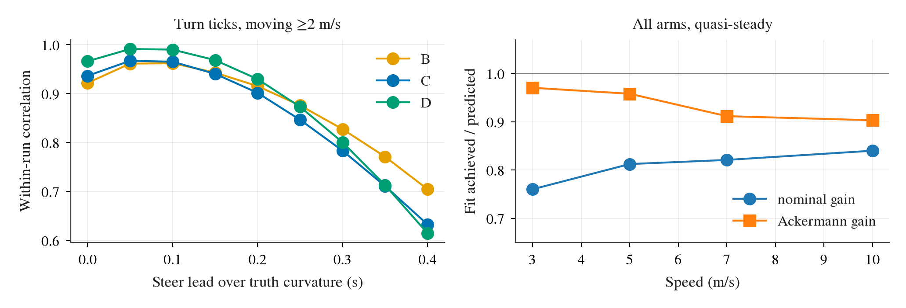
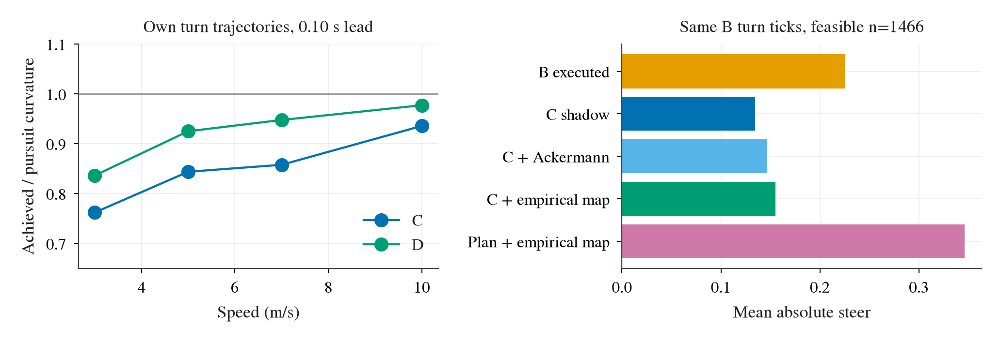
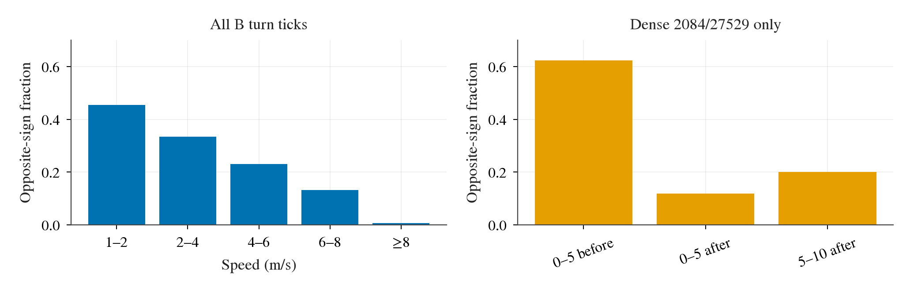

# TFv6 转弯：真实车辆转向—曲率映射与规范转向（Task 7）

## 判定

**模型错配确实存在，但不足以单独解释 B–C 转向差。** 在 C 自己的正式转弯轨迹上，C 请求的 pursuit 曲率到随后 truth yaw 曲率的过原点增益为 .76–.94；把实际执行 steer 按 PhysX Ackermann 内轮角映射成中心曲率后，剩余增益约 .95–1.00。可是将同一实测车辆映射反解到 Task 6 的 B 轨迹，C 转向幅度只增加 .021（校准范围内的可达 1,552 tick），关闭 B–C 幅度差的 **23.7%**；D3b 子集只关闭 **6.4%**。B 的较大转向通常不是“恰好补偿 C 的车辆映射误差”：仅 **9.2%** 的 tick 比 C 更接近“实现 C 自己 pursuit 曲率”所需转向。D 的改善同时包含 rear-slip 参考系改变，不能归为 Ackermann 一项。

## 数据、曲率与时间对齐

依 TASK-7 先 `git fetch ... main`、`git merge --ff-only FETCH_HEAD` 到 `876326f`。只读 W2 formal 非 aborted 的 A 58、B/C/D 各 48 条，以及 D3b 2084/27529 的 B/C/E/F 各 6 条：共 **226 run / 180,644 tick**。C 自己有 54 条，D 自己 48 条，B 自己 54 条。所有车使用同一 MKZ，故第 2 节才跨 arm 合并；同路线同 seed 的重复运行不视为独立实验。结果只使用现有日志，不运行 CARLA，也不改驾驶代码。

右转为正。每 tick 由 `truth.angular_velocity.z` **deg/s 转 rad/s**，除以 `truth.forward_speed_mps` 得到右正的 \(\kappa_{yaw}\)；只在前向速度≥2 m/s 拟合（Task 6 分类表仍保留其原先≥1 m/s 筛选）。这是**真值后轴 yaw 曲率代理**：刚体前后轴 yaw rate 相同，但 rear course 在侧滑变化时与 body yaw 不完全相同。日志 truth 采样与控制命令见 [`scripts/b2d_tfv6_controller_agent.py:400-418`](../../scripts/b2d_tfv6_controller_agent.py)、[`scripts/b2d_tfv6_controller_agent.py:473-483`](../../scripts/b2d_tfv6_controller_agent.py)。以真值 actor 位置、yaw 和 1.389 m 后轴偏移构造后轴路径，用前后各 2 tick 的三点圆曲率交叉检查：186 run、13,564 个有运动/转向的 tick，逐 run 加权相关 .854、MAE **.017 m⁻¹**；故瞬态时不能把 yaw 代理称为精确 rear path 曲率，明细见 [`rear_path_check.csv`](../../results/diagnosis/plant/rear_path_check.csv)。

C/D 在各自轨迹上按原配置逐 tick 重放，C shadow 最大误差 \(9.02\times10^{-14}\) steer。D 的 IMU yaw 采样没有存进帧日志，以 `−truth.angular_velocity.z` 代用，D shadow 最大误差 **.00175**、P99 **.000343**；D 的请求曲率因此是近似重放。重放输入及配置见 [`scripts/b2d_tfv6_controller_agent.py:174-181`](../../scripts/b2d_tfv6_controller_agent.py)、[`scripts/b2d_tfv6_controller_agent.py:243-257`](../../scripts/b2d_tfv6_controller_agent.py)。C/D 自有轨迹的转弯 tick 采用 Task 6 同一条件：8 个 actor waypoint 前四个三点曲率中位 \(|\kappa_{plan}|≥.03\) m⁻¹，速度≥1，\(|B\ shadow\ steer|≥.05\)。B 自有轨迹则以 B 执行值代替 B shadow；拟合另要求速度≥2 且请求曲率≥.01 m⁻¹。

将命令时刻 \(t\) 与 \(t+\tau\) 的 truth 配对，限真实时间差与 \(\tau\) 相差<.015 s，并在各 run 内去均值后算合并相关；0–8 tick 扫描见 [`lag.csv`](../../results/diagnosis/plant/lag.csv)。执行 steer 映射曲率到 yaw 曲率：B/C/D 的峰值在 **1–2 / 1 / 1 tick**，变化量相关的峰值均在 **1 tick（.05 s）**。请求 pursuit 曲率到 yaw 曲率：C、D 的去均值相关峰值均在 **2 tick（.10 s）**。后两者包含从请求到执行的限幅与响应，相关峰不等于识别了单独物理执行器的纯时延；估计与原 [`lateral-physics.md:42`](../2026-09-23-controller-next/lateral-physics.md) 的小窗口 plant 拟合“无需额外整数 tick 延迟”可以同时成立。

左图在移动转弯 tick 上显示命令领先真值曲率时的 run 内相关；B 的 1/2 tick 峰值几乎持平，故不宜宣称毫秒级精度。右图用全部 arm 的准稳态样本显示：显式速度 steering curve + Ackermann 的预测比名义中心轮模型更接近真值；速度间的剩余变化仍包含瞬态和选样差异。

## C/D 自有闭环轨迹：请求与实现

按每速度段 \(g=\sum\kappa_{cmd}\kappa_{yaw,t+.10}/\sum\kappa_{cmd}^2\) 拟合；B 没有 pursuit 请求，B 栏是其**执行 steer 映射成 nominal 中心曲率**到 \(t+.05\) 真值的增益。`ack/请求` 是逐 tick 执行 steer 的 Ackermann 预测曲率对请求的过原点增益，C 的 rate/max 截断已在其中。所有值含符号拟合，非绝对值比。

| 速度 m/s | C 自有：n / g | C ack/请求 | D 自有：n / g | D ack/请求 | B 自有：n / nominal→真值 |
|---|---:|---:|---:|---:|---:|
| 2–4 | 244 / **.763** | .788 | 298 / **.837** | .870 | 347 / .827 |
| 4–6 | 428 / **.840** | .878 | 335 / **.925** | .980 | 475 / .832 |
| 6–8 | 380 / **.856** | .897 | 343 / **.948** | .998 | 416 / .781 |
| 8–12 | 184 / **.934** | .934 | 139 / **.978** | 1.000 | 164 / .848 |

C 是 W2+D3b，D 只有 W2，B 是 W2+D3b；D3b C 单独在 2–4/4–6/6–8 m/s 仅 25/67/57 tick，8–12 只有 4 tick，不能据此讲 D3b 速度趋势。完整分组和 `achieved/Ackermann` 见 [`command_gain.csv`](../../results/diagnosis/plant/command_gain.csv)。C 请求到实际的缺失大体可由**执行 steer 的 Ackermann 曲率小于请求**解释；尤其低速段有 C 自身 rate 限幅。D 的 Ackermann 反解使执行 Ackermann 曲率在 4 m/s 以上几乎等于其自身请求；低速剩余差及闭环路径仍不能由静态比例解释。

## 跨 arm 车辆映射与 rear slip 检查

用轮距 1.5929 m、轴距 2.86047 m、最大内轮角 70°、随速度的 steering curve，计算 \(\kappa_{nom}=\tan(s\delta_{max}scale(v))/L\) 和 \(\kappa_{ack}=\kappa_{nom}/(1+w|\kappa_{nom}|/2)\)。这与旧物理模型 [`lateral_physics/plant.py:28-34`](../2026-09-23-controller-next/lateral_physics/plant.py) 同式；额外对照 task 指定的**不带速度 curve** \(\tan(s\delta_{max})/L\)。以执行 steer 领先 truth .05 s、\(|steer|≥.05\) 拟合。准稳态另要求过去 .20 s 的 nominal 曲率变化<.015 m⁻¹、速度变化<.75 m/s，仍只是短窗近似。

| 速度 m/s | 准稳态 tick / run | 真值/nominal | 真值/Ackermann | nominal RMSE | Ackermann RMSE | 无速度 curve RMSE |
|---|---:|---:|---:|---:|---:|---:|
| 2–4 | 363 / 84 | .760 | **.970** | .041 | **.013** | .053 |
| 4–6 | 559 / 114 | .812 | **.958** | .028 | **.018** | .040 |
| 6–8 | 1200 / 136 | .821 | **.912** | .022 | **.019** | .030 |
| 8–12 | 1010 / 79 | .840 | **.903** | .019 | **.017** | .026 |

单位 RMSE 为 m⁻¹；活跃但未限准稳态的 Ackermann 增益为 .956/.900/.828/.855，说明瞬态对静态映射拟合有影响。按 A/B/C/D/E/F 拆分、从标定池去掉 B 的敏感性及 RMSE 见 [`plant_map.csv`](../../results/diagnosis/plant/plant_map.csv)：去 B 后准稳态 Ackermann 增益 .972/.967/.925/.892，判断没有反转。旧 [`lateral-physics.md:95-105`](../2026-09-23-controller-next/lateral-physics.md) 在另一个固定半径窗口报告 .886 nominal 比，不能直接当本批混合弯度、速度与动态样本的通用常数。

旧物理模型的 \(k(v)=(1+1/v)/(c g)\)、\(c≈11\) 描述的是**后轴 course 相对车身的侧偏**，不意味着稳态 yaw 曲率必须再乘一个 \(1-k(v)v^2\)；neutral-steer 条件下 rear slip 主要改 pursuit 的参考方向，变化中的 \(\beta\) 才会使 path 曲率与 yaw 曲率分开。用真值后轴位置的前后各 .10 s 位移求 course 与 body yaw 差，与 \(\arctan((v+1)\omega/(c g))\) 比较：准稳态 6–8 m/s 中 c=11 的 beta RMSE **.475°**，c=14.07 为 .670°；8–12 m/s 则分别 **.811°/.334°**，旧 c=11 在此批高速样本并未确认。其他速度段、样本数及活跃条件见 [`rear_slip.csv`](../../results/diagnosis/plant/rear_slip.csv)。course 的 .20 s 差分、车辆角速度、非稳态和 TFv6 路线组合都会影响这个比较；不能把高速差额直接解释为新轮胎刚度。

## B 轨迹上的规范转向（开放环）

对 Task 6 原 1,785 个 B 轨迹转弯 tick，取 C 重放的 \(\kappa_{cmd}\)，以以上**全部 arm 准稳态**速度段的 \(\gamma=\kappa_{yaw}/\kappa_{ack}\) 为经验车辆映射，反解 \(\kappa_{ack}=\kappa_{cmd}/\gamma\)，再反解内轮角和 normalized steer。没有替换 C 的瞄准点、rate 历史、车辆状态或轨迹。经验映射只在 2–12 m/s 标定，且要求反解 \(|steer|≤.8\)：**1,552 / 1,785 tick** 可作可达、插值范围内比较；其余主要是 1–2 m/s 的 229 tick，另 4 tick 超 .8。5 个低速 tick 的请求超过 Ackermann 静态逆式的有限曲率域，逐 tick 均标明 NaN。另算只用 Ackermann（\(\gamma=1\)）的反解，和 8 点 rear waypoint 在 C aim station 附近三点局部曲率的经验反解。

| B 轨迹样本 | n | \|B\| / \|C\| / \|C+车辆反解\| 均值 | 缺口关闭 | B 比 C 更接近“实现 C 请求” | B 高于 / 低于该请求所需转向（>.05） |
|---|---:|---:|---:|---:|---:|
| D3b，可达范围 | 172 | .252 / .087 / .098 | **.0107（6.4%）** | 0% | 70.9% / 27.9% |
| W2，可达范围 | 1380 | .222 / .144 / .166 | **.0221（28.3%）** | 10.4% | 45.0% / 33.2% |
| 合计 | 1552 | .225 / .137 / .158 | **.0208（23.7%）** | **9.2%** | 47.9% / 32.6% |

上表的高/低是沿所需转向符号投影，余数落在 ±.05 内；B 与所需转向异号时仍会计为低。明细见 [`normative_summary.csv`](../../results/diagnosis/plant/normative_summary.csv)、[`normative_ticks.csv`](../../results/diagnosis/plant/normative_ticks.csv)。经验映射包含用于评估的 B 运行，但去 B 标定的四段增益很接近，且这只是描述性反解，非独立验证。这个规范值实现的只是 **C 自己的 pursuit 曲率**，不等同于实现路线或避免碰撞的“正确驾驶动作”。

左图是 C/D 自有轨迹的 \(\kappa_{yaw}/\kappa_{cmd}\)；D 与 C 的请求本来就因 rear-slip frame 不同，不能把两曲线之差全看作车辆逆映射。右图在**同一** 1,466 个 C 目标与局部计划目标均可达的 B tick 上展示转向幅度：C+车辆反解比 C 更强，却仍明显弱于 B；局部计划曲率的反解更强，但该目标非常敏感于预测点的局部折线形状。

“计划在 aim 区域的曲率”具体是 rear waypoint 前后相邻三点的有符号圆曲率，按中间 waypoint 的弧长插值到 C aim station；它不是路线真值曲率，也不包含从当前车位收敛到路径所需曲率。在目标可达的 1,466 tick，反解幅度均值 **.346**，B 均值 .225，C 均值 .135；B 在 **75.2%** 的 tick 比 C 更靠近它，但 **73.9%** 的 tick 沿该目标方向仍差>.05。局部三点曲率与 C 请求仅约 **56%** 同号，且部分预测点折线弯折使目标超出 .8；不能据此判 B 已经正确跟踪计划，也不能把局部曲率单独作为控制律前馈参数。

## 反向 steer 的 23.7%

423/1,785 个 Task 6 转弯 tick 中 B、C 异号。反向率随速度从 1–2 m/s 的 **45.4%** 降到 ≥8 m/s 的 **0.6%**；在有密集路点的 2084/27529，bend 前 0–5 m 为 **81/130=62.3%**，bend 后 0–5 m 为 **21/178=11.8%**。因此它高度集中在入弯低速时，而非全弯随机噪声。

反向 tick 中 C 幅度<.02 的只有 **65/423**，B 幅度<.10 为 **179/423**；有 **148/423** 同时满足 \(|C|≥.05, |B|≥.10\)，其中 **116** 有相邻同类 tick。全部反向 tick 分成 129 段，52 段持续至少 3 tick（合计 317 tick，最长 14 tick/.70 s）。8 点预测有明显正负曲率切换（\(|\kappa|≥.02\) 的三点曲率换号）为 **130/423=30.7%**，高于同号 tick 的 18.6%，但不是大多数。反向 tick 中 **362/423=85.6%** 的 B 符号与近端计划曲率一致；B 离散目标点和 C 插值 aim 的转向符号只在 **21/423** 相同。尤其密集路线 bend 前 0–5 m 的 81 个反向 tick 无一满足上述 S 形标志，说明这批主要是**目标方向/转弯相位的实际分歧**，不能都归为 S 形或零附近抖动。分箱、每 tick 和连续段见 [`opposite_summary.csv`](../../results/diagnosis/plant/opposite_summary.csv)、[`opposite_ticks.csv`](../../results/diagnosis/plant/opposite_ticks.csv)、[`opposite_spans.csv`](../../results/diagnosis/plant/opposite_spans.csv)。

## 边界

同一 B 轨迹上比较 shadow 可识别命令差，C/D 自有轨迹的 truth 对齐可描述车辆响应；两者不能合并为“改 C 后会闭环成功”的因果结论。经验 gamma 在有限速度、有限 steer、准稳态筛选中估计；执行 steer 的 CARLA 物理生效 tick、碰撞、刹车和预测路径更新均可影响短时增益。此报告没有参数推荐。完整逐 tick 车辆提取留在 `/data/runs/b2d/tfv6-w2/diagnosis/plant/ticks.csv`；仓库保留 5,430 个 B/C/D 自有转弯 tick、汇总 CSV 和 300 dpi PNG/PDF。复现：`python3 scripts/b2d_tfv6_plant_diagnosis.py`，随后 `uv run --no-project --with matplotlib --with numpy python scripts/b2d_tfv6_plant_summary.py`，所有图使用 `research/plot_style.py`。
