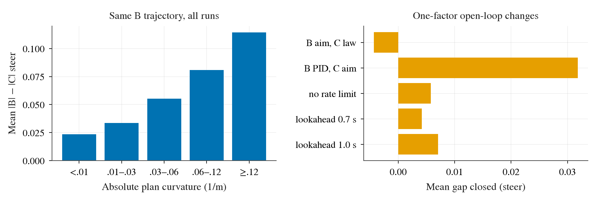
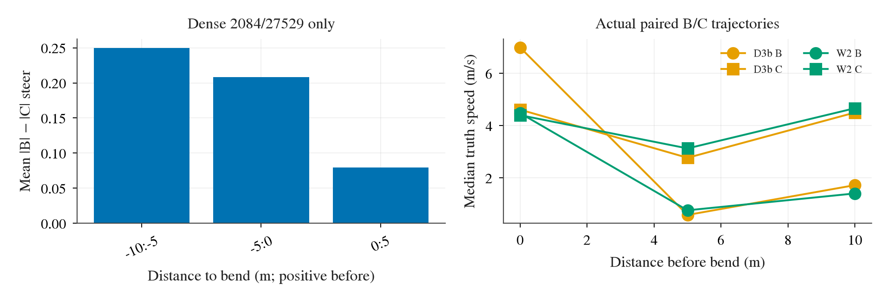

# TFv6 转弯转向不足：B 轨迹上的同输入回放（Task 6）

## 范围与可复现性

只读 D3b 的 2084/27529 各三 seed B 日志，以及 W2 formal 非 aborted 的 48 条 B 日志；共 **54 条、53,494 个有效 tick**。W2 中 40 条、D3b 中 6 条含下述筛选的转弯 tick。所有比较均在 **B 已行驶的轨迹**上：B 是执行值，C/D 是同 tick、同 TFv6 预测和运动输入算出的 shadow 值；绝非 C/D 在 B 路线上闭环行驶的结果。D3b 与 W2 的同路线 seed 也不是独立样本。

先按 wrapper 的 C 配置重新实例化控制器：`pursuit`、PI `kp=.5, ki=.25`、`lookahead=max`、`max_lookahead_time_s=.5`；逐 tick `update(rear_waypoint, t, .25)` 和 `step(t, controller_speed_mps, 0)`，最后复现 wrapper 的低速制动归零。原 wrapper 配置、传参和后处理见 [`scripts/b2d_tfv6_controller_agent.py:174-181`](../../scripts/b2d_tfv6_controller_agent.py)、[`scripts/b2d_tfv6_controller_agent.py:229-257`](../../scripts/b2d_tfv6_controller_agent.py)、[`scripts/b2d_tfv6_controller_agent.py:35-41`](../../scripts/b2d_tfv6_controller_agent.py)。**C shadow 最大绝对误差 (8.86\times10^{-13})**（54 条均通过）。日志未存 IMU yaw rate；C 用 body frame 且每 tick 收到同时间戳的新路径，刚体旋转在路径转回自车坐标时抵消，因此这里以零 yaw 重放仍精确复现。这个论证不适用于 D 的 rear-slip 补偿，也没有声称 D 重放。B 的 author PID 用日志 actor waypoint、原始 signed speed 与 20 项历史重放，经过同一停驶归零后，最大差 (1.15\times10^{-7})。完整逐 tick 诊断 CSV 留在 `/data/runs/b2d/tfv6-w2/diagnosis/steer/ticks.csv`；仓库保存转弯 tick 和汇总。

筛选：8 个 actor waypoint 前四个三点圆曲率的中位数绝对值至少 **0.03 m⁻¹**，`controller_speed_mps≥1`，`|B executed steer|≥.05`。这得到 **1,785 tick / 46 条 run**。差值定义为 `|B executed|−|C shadow|`，正值表示 C 的转向幅度较弱；此定义不把反向转向误判为正确转向。C/B 符号相反的比例另列。B 执行与 B raw 在选中 tick 的最大差仅 (2.97\times10^{-8})。曲率分箱还使用同样的速度及 B steer 门限，但不要求曲率≥.03。每 tick CSV 提供 C 的 8 点路径弧长、投影 station、请求 lookahead 距离/折算时间、实际 aim xy、pursuit 曲率、限幅前 nominal、rate 后及 max 后 steer、各 clamp 标志，以及 B 的目标点索引/实际距离、角度、P/I/D 项。

| 样本 | tick / run | 平均 \|B\| | 平均 \|C\| | 平均 \|D\| | 平均 C 缺口 | 中位 C 缺口 | C 缺口>.05 | C/B 反向 |
|---|---:|---:|---:|---:|---:|---:|---:|---:|
| D3b | 187 / 6 | .249 | .086 | .130 | **.164** | .161 | 80.2% | 31.0% |
| W2 formal | 1598 / 40 | .222 | .150 | .191 | **.072** | .079 | 60.1% | 22.8% |
| 合计（tick 加权） | 1785 / 46 | .225 | .143 | .184 | **.082** | .088 | 62.2% | 23.7% |

各 run 与逐 tick 见 [`runs.csv`](../../results/diagnosis/steer/runs.csv)、[`turn_ticks.csv`](../../results/diagnosis/steer/turn_ticks.csv)、[`turn_summary.csv`](../../results/diagnosis/steer/turn_summary.csv)。D 的平均缺口是 .041，较 C 的 .082 小，但 D 在这些轨迹上的 shadow 改善不是闭环成绩。数值为 tick 描述统计，长 run 权重大；没有把 1,785 tick 当成 1,785 次独立实验。

上图左侧显示平均缺口随计划曲率上升：\(|\kappa|<.01\) 为 .024，.01–.03 为 .034，.03–.06 为 .055，.06–.12 为 .081，≥.12 为 .114 steer。右侧是固定同 tick 输入与历史的单因素开放环计算；负条表示缺口扩大，不应将各条相加。

按速度分箱的平均 C 缺口为 1–2 m/s **.050**、2–4 **.090**、4–6 **.093**、6–8 **.072**、≥8 **.097**（见 [`bins.csv`](../../results/diagnosis/steer/bins.csv)）。密集路点只保存了 2084/27529；用其 `dense` 折线最近投影弧长减去既有 D3 bend index（2084=33、27529=16；[`scripts/b2d_tfv6_d3_analyze.py:12`](../../scripts/b2d_tfv6_d3_analyze.py)）定义至转弯起点的有符号沿路距离，正值为之前。选中转弯 tick 在距 bend 0–5 m 的缺口 .079（130 tick），经过 bend 0–5 m 为 .208（178 tick），经过 5–10 m 为 .250（45 tick）。其余 W2 路线没有已保存密集路点，故不伪造距离分箱。

## 两条横向律的实际差别

C 的请求 lookahead 是 `max(3 m, .5 s × speed)`，从近点投影 station 沿弧长线性插值得到 aim；body-frame pursuit 曲率 \(2y/(x^2+y^2)\)，nominal 为 \(-\arctan(L\kappa)/(\delta_{max}\,scale(v))\)，再以 2 steer/s 的 rate 和 .8 的最大 steer 截断；见 [`scripts/b2d_controller.py:452-485`](../../scripts/b2d_controller.py)、[`scripts/b2d_controller.py:189-206`](../../scripts/b2d_controller.py)。B 的目标速度为 waypoint 2 与 4（Python 索引 1、3）间距乘 2，低于 5.5 m/s 时目标半径 2.25 m，否则 3 m，取第一个**欧氏距离达到半径的离散 waypoint**；转角是 actor 坐标 `atan2(y,x)` 的角度除以 90；见 author [`closed_loop_inference.py:141-190`](/data/third_party/lead-cvpr2026/lead/inference/closed_loop_inference.py)。B PID 使用初值 20 个零的窗口、\(1.25e+.75\overline e+.3(e-e_{prev})\)；见 author [`pid_controller.py:38-67`](/data/third_party/lead-cvpr2026/lead/common/pid_controller.py)、[`config_closed_loop.py:83-95`](/data/third_party/lead-cvpr2026/lead/inference/config_closed_loop.py)。转弯 tick 中 B 目标实际距离中位 3.41 m，C 请求 3.00 m，C aim 实际欧氏距离中位 2.99 m。B 的 P/I/D **绝对项均值**分别 .153/.072/.0067（有符号求和与截断后才是 B steer），历史积分是明显的幅度来源。

| 单次变动（固定其他输入及历史） | D3b 平均缺口变化 | W2 平均缺口变化 | 合计缺口关闭 | 合计关闭比例 |
|---|---:|---:|---:|---:|
| C 几何律改取 B 的目标 waypoint（rear 坐标） | +.00004 | −.00483 | **−.00432** | −5.3% |
| C 当前瞄准 station 对应的 actor 点交给 B PID；保留 C 限幅与 B 过去 19 项误差 | +.04982 | +.02971 | **+.03182** | 38.8% |
| 去掉 C rate 限幅 | +.00027 | +.00643 | **+.00579** | 7.1% |
| 去掉 C .8 最大限幅 | 0 | +.00042 | **+.00037** | 0.5% |
| lookahead 时间 .5→.7 s，3 m 下限不变 | +.02507 | +.00174 | **+.00418** | 5.1% |
| lookahead 时间 .5→1.0 s，3 m 下限不变 | +.04232 | +.00291 | **+.00704** | 8.6% |

表中“变化”是基线 `|B|−|C|` 减去变动后缺口，正值即关闭。更多 .3/.4/.6 s 值见 [`sensitivity.csv`](../../results/diagnosis/steer/sensitivity.csv)。第二行是**单 tick 替换**，不能当作真正运行 B PID 的新历史；C aim 的 actor 对应点通过两种坐标折线的相同 rear 弧长 station 插值，坐标转换依据 [`scripts/b2d_tfv6_coordinates.py:6-28`](../../scripts/b2d_tfv6_coordinates.py)。单因素并不互相正交、也不是可加因果分解。尤其 B PID 与 C pursuit 的几何响应及积分历史混在第二行；这组日志支持“横向律为主要可见贡献”，并不能分离纯比例增益、车辆动力学与历史反馈的闭环效果。

选中转弯 tick 的 C rate clamp 活跃 **6.05%**（D3b .53%、W2 6.70%），max clamp **.39%**；nominal 绝对值均值 .150，rate 后与 B/C 幅度表一致。8 点名义时间范围是 2 s，路径弧长中位 **12.93 m**，请求 lookahead 中位 **3.00 m**（折算时间中位 .58 s）；选中 tick 的 `station+lookahead > horizon` **0/1785**。因此“2 s/8 点比 C 需求短”不是这些转弯 tick 的直接限幅原因；低速/停车 tick 可触发 cap，不能外推为转弯原因。增大 lookahead 时间的部分 D3b 效果来自转向几何改变，并非补偿一个已触发的 horizon cap。

## 速度侧与限制

图左只用 2084/27529 的密集路线及选中 turn tick；bend 前 0–5 m 以及之后 0–10 m 的样本量和缺口见上文。图右在 B/C **各自真实轨迹**的 bend 前 10、5、0 m 附近取最近 tick、按六个 route×seed 的中位速度；它说明转弯入口速度不相同，不能将同输入 steer 差直接等同于闭环轨迹差。

| 数据 / route | 10 m：B / C | 5 m：B / C | bend：B / C | 单位 |
|---|---:|---:|---:|---|
| D3b 2084 | .88 / 3.66 | 2.29 / 1.78 | 7.49 / 5.13 | m/s |
| D3b 27529 | 3.31 / 5.69 | .47 / 3.34 | 5.95 / 2.81 | m/s |
| W2 2084 | .79 / 3.56 | 2.15 / 1.98 | 4.22 / 5.15 | m/s |
| W2 27529 | 2.20 / 5.68 | .40 / 3.51 | 4.73 / 3.22 | m/s |

逐 seed 与实际匹配距离见 [`speed_entry.csv`](../../results/diagnosis/steer/speed_entry.csv)。C 在 bend 前 10 m 全部较快；到 bend 本身，2084 W2 的 C 仍较快，其余三组中位 C 较慢。两者都**没有显式按曲率减速**：C 从路径弧长的近 0–.25 s 估速度并 PI 跟踪，B 用上述 waypoint 2/4 的弦长速度、目标速度<.4 或 `speed/desired>1.1` 时刹车；见 [`scripts/b2d_controller.py:446-451`](../../scripts/b2d_controller.py)、[`scripts/b2d_controller.py:486-492`](../../scripts/b2d_controller.py)、author [`closed_loop_inference.py:146-159`](/data/third_party/lead-cvpr2026/lead/inference/closed_loop_inference.py)。路径本身可隐含减速，且交通灯、停车及交互会影响实际速度；这些速度数值不能归因为曲率律。

本结论限定于已记录的 B 轨迹及单 tick 开放环替换。没有运行 CARLA、改驾驶代码或验证新参数的闭环收益。复现命令：`python3 scripts/b2d_tfv6_steer_diagnosis.py`，随后 `uv run --no-project --with matplotlib --with numpy python scripts/b2d_tfv6_steer_summary.py`；制图使用 `research/plot_style.py`，PDF 与 300 dpi PNG 均在结果目录。
