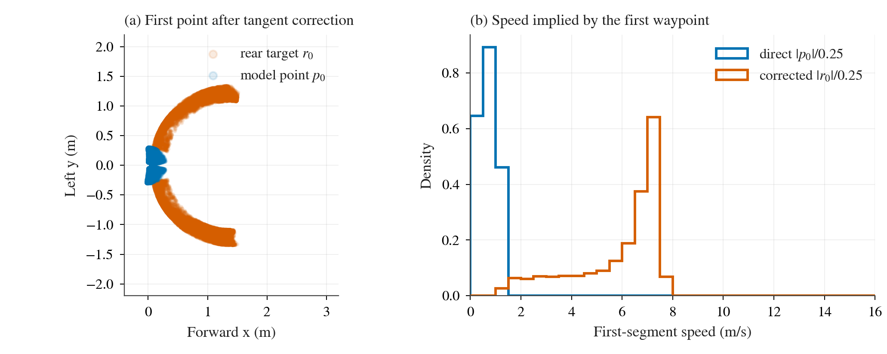

# TFv6 W2：静止点切线病灶的日志定量诊断

**范围与结论。** 本文只重放冻结日志，不启动 CARLA，也不修改 agent。逐一读取 `results/cases.csv` 指向的 **202 个有效 formal case**（level 1: 120；1r: 10；2: 72）及 D2 的 **16 个有效 repeat case**；只走各自 `done.json` 的 `run_dir`，不读取 `aborted/`。近原点 waypoint 的横向抖动会使冻结的首点切线近乎横向，因而把很近的模型点变成米级后轴目标。formal 中共 **20,913 / 151,943** 个有效 tick（13.8%）满足预先指定的 phantom 判据；**96.2%** 出现在车速低于 0.5 m/s。D2 另有 **1,821 / 11,398** 个（16.0%）。这是一项强烈的几何和控制输入诊断；后文的事件关联是描述性时序关联，不能当作单独的因果证明。

## 口径与复算

令模型输出翻转 y 后为 `p_i=(x_i,-y_i)`，日志中的后轴点为 `r_i`，`L=1.389 m`。冻结实现见 [`scripts/b2d_tfv6_coordinates.py`](../../scripts/b2d_tfv6_coordinates.py)：`i=0` 使用原点至 `p_0` 的方向，长度达 0.05 m 即采纳；中间点使用跨两点差分，退化时沿用上一切线；`r_i=p_i-L t_i+(L,0)`。定义 **phantom tick** 为 `||r_0-p_0||>0.3 m` 且 `||p_0||<0.3 m`。这是题设的操作定义，不声称每个被标记的轨迹都违反真实车辆动力学。每 tick 的 C/D 均收到同一 `r_i`，故表中的 A/B 是其轨迹上 C/D 的 *shadow* 输入，C/D 是各自实际执行轨迹。速度带按真实 `|forward_speed_mps|` 分为 `<0.5`、`0.5–3`、`3–8`、`≥8` m/s；仅 waypoint 和 rear waypoint 都存在的 tick 进入分母。

D2 repeat-1 的 `1/3514/1/C` 第 6 步：`p_0=(0.002,0.078) m`，`r_0=(1.353,-1.311) m`，切线角 `+88.4°`；首段速度由直接点的 `0.31` 跳到后轴点的 `7.53 m/s`。同一步 C 原始 throttle `0.75`，B 原始 brake `1.0`。这复核了 Mac 指出的具体病灶，坐标有模型实值的小幅舍入差异。

## 发生频率

| 数据 / 执行臂 | cases | 有效 tick | phantom tick | 占有效 tick | 有 phantom 的 cases |
|---|---:|---:|---:|---:|---:|
| formal A（C/D shadow） | 58 | 31,296 | 2,055 | 6.6% | 26 |
| formal B（C/D shadow） | 48 | 47,693 | 7,941 | 16.7% | 24 |
| formal C | 48 | 34,040 | 2,627 | 7.7% | 29 |
| formal D | 48 | 38,914 | 8,290 | 21.3% | 33 |
| D2 A（C/D shadow） | 2 | 773 | 0 | 0% | 0 |
| D2 B（C/D shadow） | 8 | 7,423 | 1,713 | 23.1% | 5 |
| D2 C | 6 | 3,202 | 108 | 3.4% | 4 |

formal 共 **2,400 段**连续 phantom episode，D2 共 **123 段**。level 1r 的 10 个 A case 已包含在 formal A；其中 203 个 phantom tick，未悄悄省去。每 case 的分子、分母、episode 和 DS 见 [`cases.csv`](results/diagnosis/tangent/cases.csv)。

| 数据 / 执行臂 | <0.5 m/s | 0.5–3 m/s | 3–8 m/s | ≥8 m/s |
|---|---:|---:|---:|---:|
| formal A | 2,004 / 11,035 | 51 / 2,473 | 0 / 13,442 | 0 / 4,346 |
| formal B | 7,790 / 28,916 | 151 / 3,868 | 0 / 12,425 | 0 / 2,484 |
| formal C | 2,329 / 16,897 | 298 / 2,923 | 0 / 10,986 | 0 / 3,234 |
| formal D | 7,989 / 22,033 | 301 / 2,873 | 0 / 10,766 | 0 / 3,242 |
| D2 A | 0 / 43 | 0 / 60 | 0 / 214 | 0 / 456 |
| D2 B | 1,699 / 3,914 | 14 / 560 | 0 / 2,698 | 0 / 251 |
| D2 C | 90 / 764 | 18 / 299 | 0 / 2,017 | 0 / 122 |

格内为 phantom / 有效 tick；逐 case 的速度带表见 [`speed_bands.csv`](results/diagnosis/tangent/speed_bands.csv)。高频并不等于高危：B 静止等待时也有大量 shadow phantom，B 自己主要在制动。top case 显示 C/D 被这一输入影响的暴露量差异很大：

| 来源 | level / route / seed / 执行臂 | phantom tick |
|---|---|---:|
| formal | 2 / 25318 / 1 / D | 2,437 |
| formal | 2 / 25318 / 0 / D | 2,383 |
| formal | 2 / 25318 / 0 / C | 1,712 |
| formal | 2 / 25318 / 2 / D | 1,402 |
| formal | 1 / 17569 / 1 / A (shadow) | 1,348 |
| formal | 1 / 26405 / 2 / B (shadow) | 1,211 |
| formal | 1 / 3514 / 0 / B (shadow) | 1,115 |
| D2 repeat-2 | 1 / 26405 / 1 / B (shadow) | 1,096 |
| formal | 1 / 2091 / 2 / B (shadow) | 1,057 |
| formal | 1 / 3514 / 1 / B (shadow) | 1,035 |

### 角度、目标位置与首段速度

下表是 **phantom tick** 的中位数 `[P10,P90]`。切线角由日志的 `(p_i+(L,0)-r_i)/L` 反解，绝对值为便于看偏转程度；有符号原值和 `r_0` 各坐标的完整分位数见 [`distributions.csv`](results/diagnosis/tangent/distributions.csv)。

| 量 | formal | D2 |
|---|---:|---:|
| `|θ_0|` / 度 | 79.9 [30.4, 89.2] | 87.6 [75.9, 88.7] |
| `|θ_1|` / 度 | 8.7 [0.5, 88.6] | 87.3 [0.7, 88.7] |
| `|θ_2|` / 度 | 8.7 [0.5, 88.3] | 2.4 [0.4, 88.5] |
| `r_0.x` / m | 1.18 [0.29, 1.37] | 1.34 [1.11, 1.36] |
| `r_0.y` / m（有符号） | −0.95 [−1.25, 1.19] | 1.10 [−1.16, 1.15] |
| `||r_0||` / m | 1.67 [0.71, 1.84] | 1.75 [1.56, 1.79] |
| 直接 `||p_0||/0.25` / m/s | 0.71 [0.24, 1.13] | 1.04 [0.45, 1.16] |
| C 所见 `||r_0||/0.25` / m/s | 6.68 [2.85, 7.36] | 6.99 [6.24, 7.16] |
| 逐 tick 首段速度增量 / m/s | 5.82 [2.47, 6.74] | 5.91 [5.18, 6.34] |

图 1：formal 的每个 phantom tick 都在左图；蓝色近原点的模型点被映成红色米级后轴点，y 两侧均可发生。右图按同一批 tick 比较直接与修正后的首段速度，展示控制器实际接收的速度假象；这是 waypoint 推导速度，不是车辆真实速度。矢量版见 [`tangent-pathology.pdf`](results/diagnosis/tangent/tangent-pathology.pdf)。

## 控制指令与首次分岔

在 phantom tick 上，formal 中 C 原始 throttle `>0.05` 为 **20,320 / 20,913（97.2%）**；同时 B 原始 brake `>0.05` 为 **9,113 / 20,913（43.6%）**。若 B 实际执行，则取 `executed_control`；否则取 B 的 `final_control` shadow，同一交集为 **8,777 / 20,913（42.0%）**。D2 相应为 C throttle **1,758 / 1,821（96.5%）**、与 B 原始制动交集 **1,005（55.2%）**、与 B 执行/最终制动交集 **985（54.1%）**。D 原始 throttle 与 B 原始制动的交集和 C 相同（formal 9,113；D2 1,005），因为 C/D 纵向计算共享这一速度输入；这些是*同轨迹*原始指令比较，shadow PI 状态会漂移，不能解释为切换 arm 后的反事实行驶结果。逐轨迹表见 [`consequences.csv`](results/diagnosis/tangent/consequences.csv)。

按 D1 的同一步真实位移 `>1 m` **或**车速差 `>1 m/s` 作为首次 C/D–B 分岔，level 1+2 的 C–B 与 D–B 各 **48/48** 对有分岔。其中分岔当步或之前 10 tick（0.5 s）在对应 C/D 轨迹上有 phantom 的各 **3/48** 对；全是 level 1 route **3514** 的 seed 0、1、2。B 同期也有 shadow phantom，故仅凭时间相邻不能作全面归因。其余配对的首次分岔通常早于其 phantom episode，不能说本病灶解释了全部 C/D 行驶差别。逐对步数见 [`divergences.csv`](results/diagnosis/tangent/divergences.csv)。

## 3 秒事件关联与 DS

episode 是相邻 step 的连续 phantom；若 scored infraction 或终态 route deviation 出现在 episode **开始至结束后 60 tick（3.0 s）**，标为关联。`ROUTE_COMPLETION`、`MIN_SPEED_INFRACTION` 不算；CARLA scorer 的终态 route deviation 以官方结果状态和最后 tick 补入。formal C/D 共 96 case：**31** case 有关联事件（level 1 C 10、D 11；level 2 C 4、D 6）。下面列全 31 个；完整的每个 C/D case 的阴性/阳性、事件时刻、DS、RC 见 [`outcomes.csv`](results/diagnosis/tangent/outcomes.csv)。

| level | route | seed | arm | DS | phantom tick | 最早关联事件 |
|---:|---:|---:|:---:|---:|---:|---|
| 1 | 2091 | 0 | D | 80.00 | 11 | stop |
| 1 | 2091 | 1 | C | 60.00 | 41 | vehicle collision |
| 1 | 2091 | 2 | D | 60.00 | 74 | vehicle collision |
| 1 | 25424 | 0 | D | 58.87 | 854 | outside route lanes |
| 1 | 25424 | 1 | C | 98.11 | 17 | outside route lanes |
| 1 | 25424 | 1 | D | 58.87 | 30 | outside route lanes |
| 1 | 25424 | 2 | C | 92.46 | 9 | outside route lanes |
| 1 | 25424 | 2 | D | 97.17 | 16 | outside route lanes |
| 1 | 27494 | 0 | C | 60.00 | 5 | vehicle collision |
| 1 | 27494 | 2 | D | 60.00 | 12 | vehicle collision |
| 1 | 3255 | 0 | C | 82.78 | 49 | outside route lanes |
| 1 | 3255 | 1 | C | 82.78 | 32 | outside route lanes |
| 1 | 3255 | 1 | D | 58.28 | 656 | static collision |
| 1 | 3255 | 2 | C | 20.86 | 84 | vehicle collision |
| 1 | 3255 | 2 | D | 82.78 | 12 | outside route lanes |
| 1 | 3514 | 0 | C | 65.00 | 18 | static collision |
| 1 | 3514 | 0 | D | 65.00 | 19 | static collision |
| 1 | 3514 | 1 | C | 65.00 | 18 | static collision |
| 1 | 3514 | 1 | D | 65.00 | 18 | static collision |
| 1 | 3514 | 2 | C | 65.00 | 18 | static collision |
| 1 | 3514 | 2 | D | 65.00 | 19 | static collision |
| 2 | 2050 | 2 | D | 60.00 | 6 | vehicle collision |
| 2 | 2084 | 0 | C | 60.00 | 27 | vehicle collision |
| 2 | 2084 | 1 | D | 40.61 | 17 | stop |
| 2 | 27529 | 2 | D | 40.02 | 4 | stop |
| 2 | 28154 | 0 | C | 36.00 | 31 | vehicle collision |
| 2 | 28154 | 0 | D | 36.00 | 67 | vehicle collision |
| 2 | 28154 | 1 | C | 36.00 | 72 | vehicle collision |
| 2 | 28154 | 1 | D | 36.00 | 60 | vehicle collision |
| 2 | 28154 | 2 | C | 60.00 | 65 | vehicle collision |
| 2 | 28154 | 2 | D | 36.00 | 50 | vehicle collision |

D2 的 route 3514/seed 1/C 两次 repeat 均为 DS 65、static collision，formal 同 seed/C 亦为 DS 65；三个独立轨迹均有前置 phantom。这与 Mac 的 3/3 复现一致。D2 route 27529/seed 0/C 两次 repeat 均 route deviation 且 **零** phantom，构成重要的反例：该失败不能归于这里的 phantom 判据。

**level 2 C–B 损失到底有多少落在这些 case？** D1 [`ds_pairs.csv`](results/diagnosis/ds_pairs.csv) 的 18 对 C–B 总和 `−480.27 DS`（均值 `−26.68`）。上表关联事件阳性的 **4 个 C case**（2084/0、28154/0–2）合计 C–B `−168.00 DS`，占总**净损失的 35.0%**；按 D1 的 log-score 精确分解，这 `−168.00` **全部是 vehicle collision penalty**，RC 等项之和为零。更宽的“C 有任意 phantom”口径有 **9 case**、C–B 合计 `−336.79 DS`，占净损失 **70.1%**，其中 RC `−168.79`、vehicle collision `−168.00`。若只以全部负差之和 `−520.27` 作分母，两个占比分别为 **32.3%**、**64.7%**；正差总和 `+40` 抵消了一部分净损失。后一口径包含没有 3 秒 scored event 的低 RC case（如 25318/0），不能把其 RC 差直接归因于切线。逐对贡献见 [`level2_loss.csv`](results/diagnosis/tangent/level2_loss.csv)。

## 同日志离线规则试算

对所有 `||p_0||<0.3 m` 的 tick，保留冻结点序列和 `L`，只替换切线，然后仍用 `r_i=p_i-Lt_i+(L,0)` 及**相同的 phantom 判据**复算：

- **A：** 从原点沿点列累加弧长 `s_i`；仅 `s_i≥L=1.389 m` 时用冻结差分切线，否则 `t_i=(1,0)`。
- **B：** 冻结差分切线的有符号角 `θ_i` 限制在 `±s_i/R_min`。车辆参数取 stock `vehicle.lincoln.mkz_2020` 的轴距 `2.860471491 m` 与最大前轮转角约 `70°`（[`docs/b2d-controller.md`](../../docs/b2d-controller.md)），按简化自行车几何 `R_min=wheelbase/tan(70°)=1.041 m`。这只是用车辆极限构造的离线角度上界，未包含低速轮胎/转向动态；不等于真实可行轨迹检验。

| 数据 | `||p_0||<0.3` tick | 冻结 phantom | A 剩余 | B 剩余 |
|---|---:|---:|---:|---:|
| formal | 59,076 | 20,913 | 0 | 6,679 |
| D2 | 3,114 | 1,821 | 0 | 1,458 |

A 在此操作定义下必为零，因为 eligible 首点的 `s_0=||p_0||<0.3<L`，因此 `r_0=p_0`；这是 sanity check，**不是**闭环效果估计。B 用这辆车的极限几何仍保留部分 phantom，表明单纯按最大转角约束不够强。逐 case 计数见 [`counterfactual.csv`](results/diagnosis/tangent/counterfactual.csv)。没有试跑、调参或修改 agent。分析可由 [`scripts/b2d_tfv6_tangent.py`](../../scripts/b2d_tfv6_tangent.py) 在同一日志上重现。
