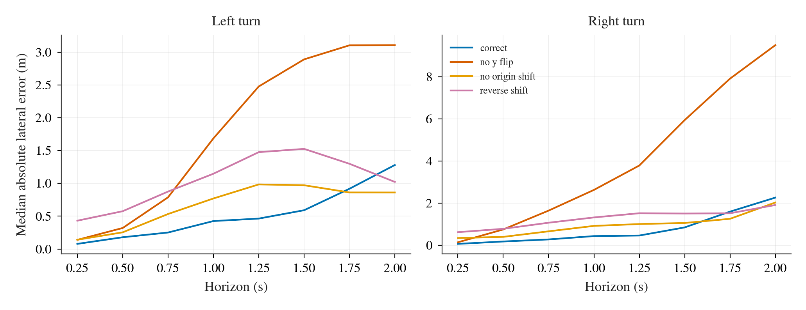

# W2 第 1 阶段：TFv6 controller 实现与核对

日期：2026-09-23。协议：[protocol.md](protocol.md)。本页只记录第 1 阶段；没有运行第 1、1r、2 级正式 case。LEAD `cvpr2026` 的模型、checkpoint、sensor preprocessing 和 PID 源码均未修改。所有逐帧数据与失败尝试留在 Tokyo 的 `/data/runs/b2d/tfv6-w2/`。

## 实现边界与四臂

`scripts/b2d_tfv6_controller_agent.py` 继承作者 `SensorAgent`，通过 evaluator 的 `model_dir+ARM+save_name` agent-config 参数选臂；`scripts/b2d_tfv6_campaign.py --level smoke --arm A|B|C|D` 是单臂入口。正式 campaign 固定四臂，并按 `(route, seed)` 把 A、B、C、D 连跑。四臂共用同一三 seed ensemble、传感器、model forward、作者 Kalman 开关与后处理。作者 `ClosedLoopInference.ensemble()` 原样计算 route/target-speed PID 和 waypoint PID；A 使用其 route/target-speed 选择，B 将三个 modality 设为 `waypoint`。C、D 在该函数返回后、作者后处理之前，用同一组融合 waypoint 替换输出 control。没有重新融合模型输出。

C/D 都用 W1 的 production pursuit 配置：`preset=pursuit`、`longitudinal_mode=pi`、`lookahead=max`、`pi_kp=0.5`、`pi_ki=0.25`、`max_lookahead_time_s=0.5`，几何与限幅沿用 `Controller` 当前默认值；D 仅增开 `pursuit_frame=rear_slip`、`rear_slip_c_per_rad=11.0`、`steer_inverse=ackermann`、`track_width_m=1.5929`。两臂逐 tick `update(r_i, t, trajectory_dt=0.25)`，N=8、2 s horizon，绝不外推。truth-pose ceiling 关闭。

**位姿契约需 Mac 在冻结时确认。** TFv6 waypoint 已经是当前车体局部轨迹，`Controller.update()` 无世界位姿参数；`Controller.step()` 只用 SPEED 与 IMU gyro 对前一 tick 的局部轨迹作短时传播。因此 lateral v2 的 GNSS/IMU + fixed-k `PoseFilter` 已按同一 gain 与 `k=0.010659832` 在 wrapper 中运行并逐帧记录，但其位置不会改变局部 waypoint control。TFv6 GNSS 装在 actor origin（x=0），所以 filter 用 `gnss_x_m=0`、后轴 x=−1.389 m；lateral v2 的 GNSS x≈−1.4 m 不能直接套用。此项是接口性质，不是新增 arm 或参数调节。

作者 `ClosedLoopPrediction.waypoints_steer` 字段在其返回表达式里取了未更新的 `waypoint_steer`，所以 A arm 的这个诊断字段为 `None`；B 实际执行路径用局部变量 `waypoints_steer`，不受影响。wrapper 只观察作者 `execute_waypoints()` 的原始返回值用于四臂日志，没有再执行一次 PID，也没有修改第三方源码。

### 作者规则四臂一致性审计

| 规则 | 源码位置与四臂处理 |
|---|---|
| GPS Kalman、target-point 跳远点、自适应 pop-distance、JPEG、LiDAR/radar 预处理 | 作者 `BaseAgent.tick` 与 `SensorAgent.tick`，在每臂同样执行；环境统一 `use_kalman_filter=True`。|
| route steering correction、target-speed brake ratio、route PID | 作者 `execute_route_and_target_speed()`，四臂都执行；只 A 选其输出，属于登记的 representation 差别。|
| waypoint desired-speed、aim-distance、brake ratio、PID | 作者 `execute_waypoints()`，四臂都执行；只 B 选其输出。|
| brake 时归零 throttle，低速且制动时归零 steer | 作者 `ensemble()` 在选择之后执行；C/D 在选择 custom control 时应用同一规则。|
| creeping / stuck detector / force move | 作者 `ForceMovePostProcessor.adjust()`，四臂同一状态、阈值、调用顺序；统一开启 `sensor_agent_creeping=True`。LiDAR safety box 检测到障碍时强制 throttle=0、brake=1（emergency stop）。|
| stop sign box、减速、停车及 cooldown | 作者 `StopSignPostProcessor.update_stop_box()`、`adjust()`，四臂同一网络 bbox 与状态、在 creeping 之后执行；统一开启 `slower_for_stop_sign=True`。|
| 初始帧全制动 | 作者 `SensorAgent.run_step()` 在后处理后覆盖为 `(0,0,1)`；四臂同样执行。|

wrapper 在每 tick 以拷贝的后处理状态计算四个臂的 shadow final control，并要求当前臂 shadow 与作者实际返回 control 在 `1e-5` 内一致，否则 fail fast。`frames.jsonl` 同时保留 route、waypoint、target speed、转换后 rear waypoint、四臂 raw/final control、实际 control、同步 actor snapshot 位姿/速度/角速度、启发式状态及推理/agent 时间。A/B 的实际控制仍由作者 PID 选择；shadow 计算只供记录。

## 坐标离线核对

TFv6 actor-origin、y-right 的 8 点先取反 y，中心差分求未来切向（首点用原点→首点、末点用后向差分、短于 5 cm 沿用前切向、全重合取 x 轴），再按 `r_i = p_i − 1.389·t_i + (1.389,0)`。直行恒等。离线取 B arm 的 25378 直行段与 17569 左/右 S 弯段；按真值未来 1 s yaw 变化分类（左 <−8°、右 >8°、直行 |yaw|<2°），只取每类首个有样本的 route，分别 237、62、51 个起始 tick。未来真值后轴从同一 CARLA snapshot 的 actor transform 减去 1.389 m 前向量，按 `t+0.25i` 匹配。17569 的采样是开发坐标检查，350-tick cap 后路线未完成，绝不计入正式结果。

下表为 +1 s 的绝对误差，列内是 median / P95（m）；三个错误实现分别是 y 不取反、不平移 actor→后轴、平移符号反向。完整的 **8 个 horizon × 3 类路段 × 4 个变换**、纵横向 median/P95 及有符号横向 median 在 [coordinate-check.csv](results/coordinate-check.csv)。

| 路段 | 变换 | n | 纵向 median/P95 | 横向 median/P95 | 横向 signed median |
|---|---|---:|---:|---:|---:|
| 左 | 正确 | 62 | 0.49 / 2.66 | **0.43 / 1.57** | +0.12 |
| 左 | 不取反 y | 62 | 0.49 / 2.66 | 1.69 / 5.42 | −1.69 |
| 左 | 不做原点平移 | 62 | 0.48 / 2.51 | 0.77 / 2.03 | +0.61 |
| 左 | 平移符号反 | 62 | 0.50 / 2.36 | 1.15 / 2.55 | +1.01 |
| 右 | 正确 | 51 | 0.57 / 1.44 | **0.44 / 1.48** | −0.25 |
| 右 | 不取反 y | 51 | 0.57 / 1.44 | 2.63 / 3.53 | +2.63 |
| 右 | 不做原点平移 | 51 | 0.65 / 1.34 | 0.92 / 1.60 | −0.67 |
| 右 | 平移符号反 | 51 | 0.67 / 1.23 | 1.32 / 1.97 | −1.10 |

正确变换在两种转弯、每个 0.25–2 s horizon 上都给出最低的 median 绝对横向误差；+1 s 上明显低于三个错误版本。正确版本的 signed median 在 +1 s 为左 +0.12 / 右 −0.25 m，但符号并不跨 horizon 稳定（左 8 个 horizon 为 3 正 5 负，右为 3 正 5 负），没有持续的随转向翻号偏置；远期误差仍包含模型预测及车辆实际跟踪误差，不能解释为坐标变换误差本身。

## 测试与 smoke

`OPENBLAS_CORETYPE=Barcelona`：原控制器 143 项通过、1 项 skip；TCP 17/17；W2 坐标与四臂/后处理测试 9/9；route-cluster bootstrap 测试 1/1。`scripts/b2d_tfv6_analyze.py` 已对四臂 smoke 生成 `cases.csv`、`paired.csv`、`tracking.csv`、`summary.json` 与两张图，位于 `/data/runs/b2d/tfv6-w2/smoke/analysis/`。该 smoke 只有一个 (route, seed)，bootstrap CI 退化为点值，绝不作为效应结论。

Dev10 route 25378、TM seed 0，四臂均跑到官方 100% completion；官方 DS 均为 70（YieldToEmergencyVehicleTest），属于 smoke，不计入正式结果。`route_result.json` 的 route wall、tick 与 profiler：

| arm | ticks | route wall s | mean profiled tick ms | mean agent ms | DS / RC |
|---|---:|---:|---:|---:|---:|
| A | 249 | 37.0 | 109.44 | 100.68 | 70 / 100 |
| B | 258 | 37.0 | 108.69 | 99.91 | 70 / 100 |
| C | 262 | 36.9 | 109.13 | 100.45 | 70 / 100 |
| D | 262 | 37.1 | 108.68 | 99.99 | 70 / 100 |

早期 A smoke 曾出现缺少 evaluator 的 `LEAD_PROJECT_ROOT`、HF cache 根、checkpoint 配置后缀解析、作者 waypoint 诊断字段为 `None`、`SAVE_PATH` 未设等开发阶段错误，均在第 1 阶段修复，失败尝试原样在 `/data/runs/b2d/tfv6-w2/smoke/A*`。正式 runner 对基础设施同一 case 最多 **三次重试**（四次 attempt），驾驶失败有官方结果即停止，不重跑。

## 资源、并发与正式 ETA

Epic/offscreen、RTX 3090 CUDA index 0、CARLA `-graphicsadapter=0`。用同一短路线不同 TM seed 的 1/2/3 并行开发探针；wall 包含每个 case 的新 server 启动与模型加载，GPU 峰值来自 2 s 采样的 `nvidia-smi`，CPU 是 CARLA + 本 worktree route Python 的 `%CPU` 合计（100% = 一个核心）。逐样本 `/data/runs/b2d/tfv6-w2/throughput/n{1,2,3}/resources.jsonl`。

| 并发 | 完成 / 请求 | 总 wall s | 完成 ticks | 总 ticks/s | GPU 峰值 MiB | CPU 峰值 % | 判定 |
|---:|---:|---:|---:|---:|---:|---:|---|
| 1 | 1/1 | 45.3 | 247 | 5.46 | 9,071 | 416 | 稳定 |
| **2** | **2/2** | **60.1** | **511** | **8.50** | **18,129** | **752** | **正式默认** |
| 3 | 0/3 | 81.2 | 0 | 0 | 24,119 | 697 | CUDA OOM，模型 setup 失败 |

选择 2 个 server。3 并发的 3 个 case 在每次 setup 都触及 23.56 GiB 显存上限，最多三次 infra retry 的记录留在 `/data`；结束后无 CARLA orphan。这里的 8.50 ticks/s 含短路线的重复 server/model 初始化，作为估时比纯 109 ms profiled tick 更保守。

Dev10 官方 TFv6 已完成的 25378、25381、27494 三条基线样本合计 1196 ticks，均值约 399 ticks/route；以此乘 case 数并除以 8.50 ticks/s，得到下表 **中心估计**。复杂路线若触发官方 4000-tick TickRuntime，实际时间会明显增加；一个在 3 seed × 4 arm 都持续超时的 Dev10 route，约再加 1.4 h。启动、重试与分析另留约 10% 余量。

| 正式级别 | cases | 中心 wall | 操作预算 |
|---|---:|---:|---:|
| 1 Dev10 | 120 | 1.56 h | 1.7 h + TickRuntime 尾部 |
| 1r A seed0 | 10 | 0.13 h | 0.15 h + 尾部 |
| 2 holdout | 72 | 0.94 h | 1.0 h + 尾部 |
| 合计 | 202 | 2.63 h | 约 3–6 h，按正式首批实测更新 |

v1 保留集 XML 是 `todos/2026-09-22-b2d-controller/results/holdout.xml`，ID 为 **3072、2084、2050、25318、28154、27529**。正式 runner 会跳过有 `done.json` 的 case，按 route/seed 排序、每组四臂连跑，独立 `log.txt`、`events.jsonl`、tqdm 进度条，并为每个 attempt 保存 runner、CARLA、逐帧与官方统计。`scripts/b2d_tfv6_analyze.py` 对 DS/RC/完成/SR/逐项每 km 违规做配对，DS 95% CI 按 route cluster bootstrap 10000 次；跟踪仅计划速度 >1 m/s，第一次碰撞前后分列。

**停止点。** 尚未开始任何 level 1、1r、2 正式 case；等待 Mac 审核、冻结协议 commit 与 `GO`。
