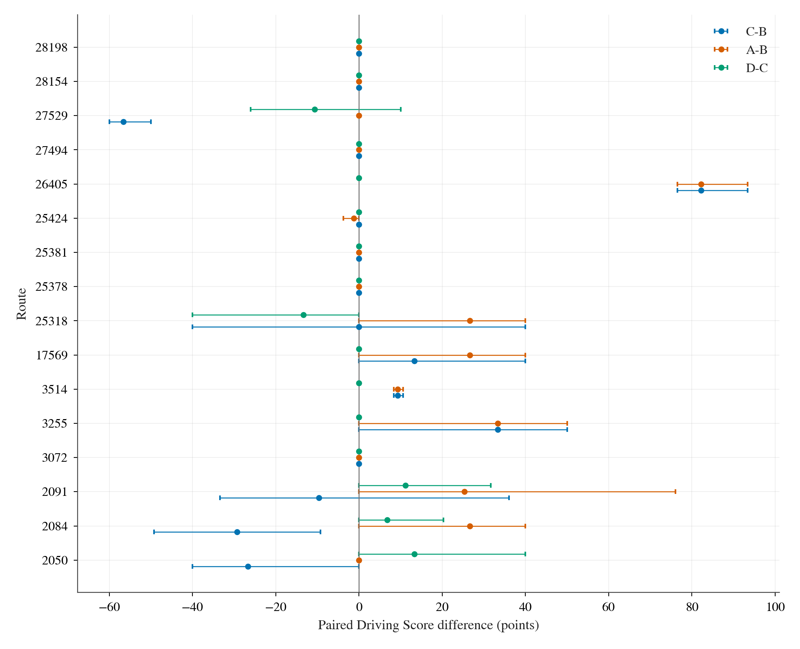
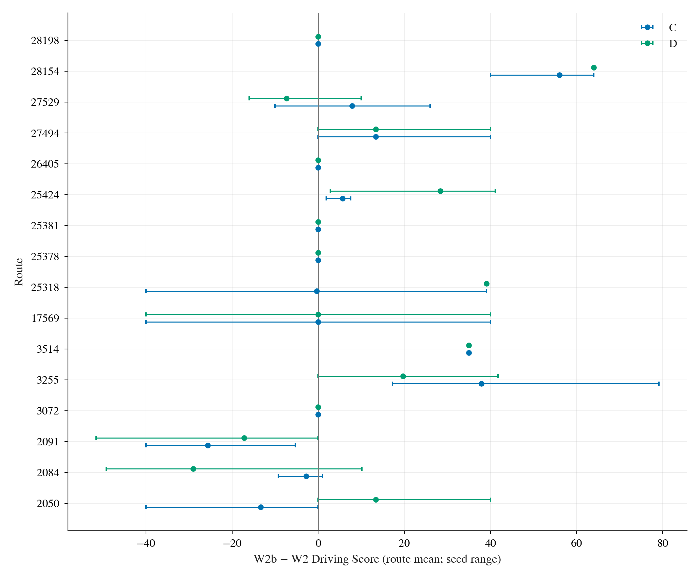
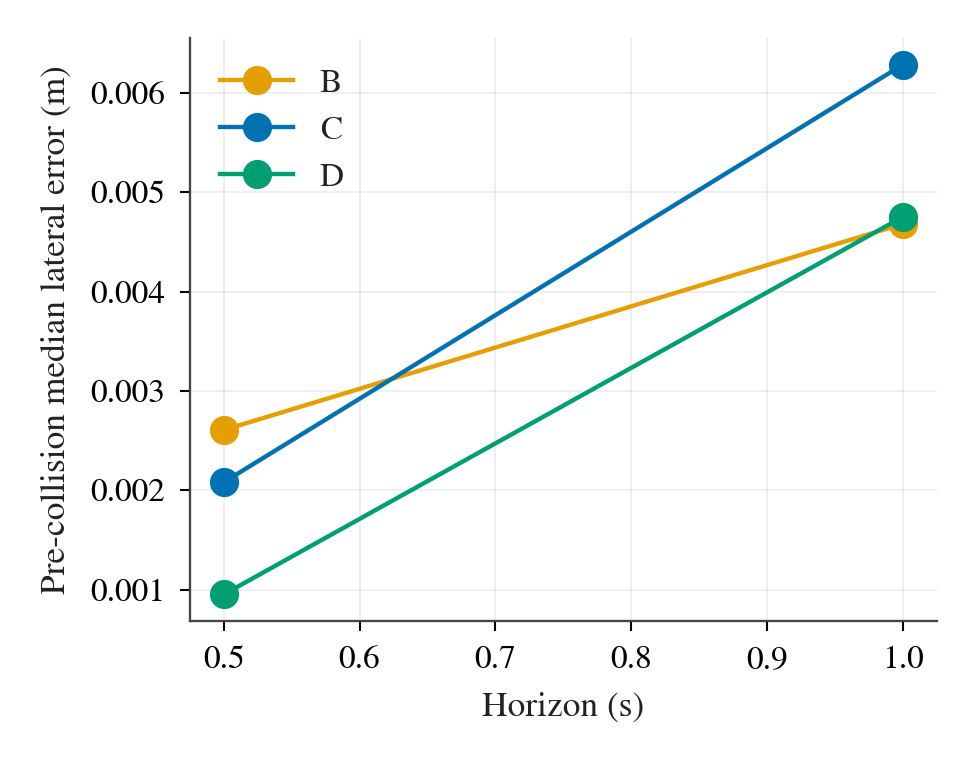

# W2b：修正静止切线后的 TFv6 waypoint 闭环重跑

**冻结协议：** [`protocol-w2b.md`](protocol-w2b.md)，commit `254dfc5`；**驾驶代码：** commit `cb0357c58bc6b7683d20e05549466363b687cb83`。W2b 只改 TFv6 actor-origin waypoint 到后轴点的近端切线：累计弧长 `s_i<1.389 m` 时取车头 x 轴，之后沿用 W2 差分切线；其余控制、作者启发式、shadow/guard 与路线/seed 均保持冻结。A/B 的正式基线来自 W2 的有效 level 1、2 case，C/D 在 `/data/runs/b2d/tfv6-w2b/` 新目录重跑。配对键为 `(level, route, TM seed)`；所有统计只用 canonical `done.json`，不读作废目录。

## 分级门槛与完整性

S0 对 W2 的 202 个有效 formal case 和 D2 的 16 个有效 repeat case 逐帧离线重算：旧规则有 **22,734** 个题设 phantom tick，新规则为 **0**；弧长 `s_i≥L` 的 **772,424 个点**与旧变换逐位相同。直行恒等、3514 第 6 步的静止横向抖动与过 L 精确一致性均由单测覆盖。`OPENBLAS_CORETYPE=Barcelona` 的 B2D 全套 200 项测试通过，1 项原有 skip；为运行独立 viewer 测试，TFv6 Python 环境补装 `pygame 2.6.1`，不参与驾驶代码。每 case 完成后运行 I1（无 phantom）、I2（无 shadow/agent 失败）、I3（完整且逐步连续的 frames、官方结果/infractions、唯一 key 和选中 attempt 一致）检查，失败即停机；运行结果与每级耗时另见 bus `status.jsonl`。

### B 臂静止与起步的坐标核对

沿用 W2 的方法，把每个 B 臂 tick 的预测点变回世界坐标，和 `t+0.25/0.5/1.0 s` 的真值后轴位置比较。静止定义为当前 `|v|<0.2 m/s` 且 1 s 后 `<0.5`；起步定义为当前 `<0.5` 且 1 s 后 `≥1`。下表为同一批 W2 B 轨迹、同一模型 waypoint 的旧/新离线变换；误差还包含模型预测和 B 的实际驾驶，不能单独归于坐标误差。全 12 行见 [`s0-coordinate.csv`](results/w2b/s0-coordinate.csv)，逐 case phantom 与逐位一致计数见 [`s0-replay.csv`](results/w2b/s0-replay.csv)。

| 片段 | horizon | tick 数 | W2 横向绝对误差 median / P95 m | W2b 横向绝对误差 median / P95 m | W2 纵向绝对误差 median / P95 m | W2b 纵向绝对误差 median / P95 m |
|---|---:|---:|---:|---:|---:|---:|
| 静止 | 0.25 s | 29,182 | .649 / 1.239 | .036 / .380 | .228 / 1.470 | .013 / .098 |
| 静止 | 0.50 s | 29,182 | .050 / 1.219 | .036 / .380 | .095 / 1.470 | .015 / .252 |
| 静止 | 1.00 s | 29,182 | .065 / 1.101 | .036 / .380 | .139 / 1.471 | .027 / .635 |
| 起步 | 0.25 s | 2,119 | .003 / 1.226 | .001 / .289 | .091 / 1.356 | .046 / .185 |
| 起步 | 0.50 s | 2,119 | .003 / 1.074 | .001 / .294 | .185 / 1.300 | .138 / .584 |
| 起步 | 1.00 s | 2,119 | .006 / .666 | .002 / .358 | .559 / 1.689 | .577 / 1.689 |

静止片段的 +0.25 s 横向误差中位数从 0.649 降至 0.036 m，符合移除假后轴点的预期；起步片段的 P95 也大幅收窄。+1 s 纵向误差在起步片段没有改善，说明这项离线检查只支持近端几何修正，不能替代闭环评估。

### S1 金丝雀

S1 用两个并行 CARLA server 在 **451 s** 完成 7/7 case；I1–I3 均通过，没有基础设施重试。三个 `1/3514/seed 0–2/C` 均为 DS **100**、官方 `Completed`，起点后 3 s 内没有 static collision（W2 原来三次均为 DS 65 并发生该碰撞）。`2/28154/0/C` 为 DS **100**（W2 为 36）；`2/25318/0/C` 为 DS **60**、`Completed`（W2 为 20.952、TickRuntime）。A/B 不变性 case `2/28154/0/B`、`1/26405/1/A` 与 W2 各自的 DS **100** 和官方 `Completed` 状态完全一致。全部门槛满足后，runner 自动进入 S2，没有等待新的 GO。

### S2 小批

S2 对 Dev10 的 seed 0 跑 C/D，复用 S1 的 `3514/0/C`，新增 **19/19** case 均通过 I1–I3，无基础设施重试；耗时 **1,690 s**。`2091/0/C,D` 各达到官方 4,000 tick 的 `Failed - TickRuntime`，按 answer-4 属于驾驶结果，未重跑；两者 RC 分别 44.34%、47.29%，DS 26.604、28.374。可见修复静止切线并未消除所有长时间停滞。其余 seed 0 case 计入正式全集，S2 门槛满足后自动进入 S3。

### S3 全集与数据完整性

S3 余下 **72/72** 个 C/D case 在 **4,773 s** 内完成，每 case I1–I3 全部通过，基础设施重试 **0**。S1/S2/S3 合计 96 个正式 C/D case；另有 2 个 A/B 不变性 case。正式结果与 W2 的 96 个 A/B case 组成 **192 行** [`cases.csv`](results/w2b/cases.csv)、每个对照各 48 行的 **144 行** [`paired.csv`](results/w2b/paired.csv)，无缺失配对或重复 key。新 C/D 的离线 phantom 也为 0。`2091` 的 TickRuntime 和 `2084`、`27529` 的 route deviation 均保留为官方驾驶结果；不能以没有撞击或任务超时来重定义完成。每级门槛、耗时和 I1–I3 计数见 bus `status.jsonl`。

## 主指标：配对 DS

下表的差值单位是 DS 点，95% CI 按路线为簇重抽 10,000 次，路线内三个 seed 一同带走。主比较是 C−B；A−B、D−C 仅描述。A/B 是 W2 原正式驾驶，C/D 是本次 W2b 驾驶；48 组按 `(level, route, seed)` 严格配对。原始 case、全部配对差与机器可读区间见 [`cases.csv`](results/w2b/cases.csv)、[`paired.csv`](results/w2b/paired.csv)、[`summary.json`](results/w2b/summary.json)。

| 数据集 | 路线 / 对数 | C−B 均值 [95% CI] | A−B 均值 [95% CI] | D−C 均值 [95% CI] |
|---|---:|---:|---:|---:|
| 第 1 级 Dev10 | 10 / 30 | +12.85 [−0.03, +30.72] | +17.56 [+4.41, +34.74] | +1.11 [0, +3.34] |
| 第 2 级保留集 | 6 / 18 | −18.78 [−37.66, −4.44] | +8.89 [0, +17.78] | −0.65 [−8.00, +6.70] |
| 合并 | 16 / 48 | **+0.99 [−12.23, +15.44]** | +14.31 [+5.10, +25.89] | +0.45 [−2.74, +3.48] |

图中每条路线展示 C−B、A−B、D−C 的 seed 均值与该路线内 seed 重抽区间，竖线为零；正式判定使用上表的**路线整组** bootstrap。Dev10 的 C−B 正向与保留集的负向相抵，合并区间跨过零；路线间异质性明显。

按冻结规则，**W2b C 相对 B 没有可测的合并 DS 效应**：CI 包含 0，区间宽 **27.67 DS 点**，因此本实验无法排除大约 −12.23 至 +15.44 点的平均效应。第 3 级 220 条路线的继续条件也不满足：合并 CI 含零，|点估计|=0.99<3，且两级方向相反；本次不申请 `NEED_GO`。A−B 的区间为正是描述性对照，不改变主判定。

**对冻结问题的回答：**把 TFv6 的 8 点 waypoint 交给修正近端切线后的 production 控制器（C），与交给 TFv6 自带 waypoint PID（B）相比，本次 16 条路线、48 个配对 case **未测得可靠的合并 DS 差别**。不同路线集的效应方向相反，因而既不能宣称 C 优于 B，也不能宣称两者等效。

## 次要指标

完成数 / 零违规完成数按 48 个 case 分别为 A **48/42**、B **45/28**、C **40/31**、D **41/31**。下表的完成率、SR 差用 0–1 比例；违规差用次/km。所有次要指标及各级区间均在 [`summary.json`](results/w2b/summary.json) 的 `secondary` 中，逐 case 在 [`cases.csv`](results/w2b/cases.csv)。

| 合并配对差 | C−B [95% CI] | A−B [95% CI] | D−C [95% CI] |
|---|---:|---:|---:|
| RC，百分点 | −6.07 [−15.47, +1.27] | +2.39 [0, +6.03] | +1.16 [0, +3.48] |
| 完成率 | −0.104 [−0.313, +0.063] | +0.063 [0, +0.167] | +0.021 [0, +0.063] |
| SR | +0.063 [−0.188, +0.313] | +0.292 [+0.104, +0.500] | 0 [−0.063, +0.063] |
| 车辆碰撞/km | −1.318 [−4.657, +1.060] | −2.858 [−5.979, −0.587] | +0.215 [−1.056, +1.778] |
| 行人碰撞/km | −0.356 [−1.067, 0] | −0.356 [−1.067, 0] | 0 [0, 0] |
| stop 违规/km | +0.596 [0, +1.787] | 0 [0, 0] | 0 [0, 0] |
| 车道外/km | −0.938 [−2.344, 0] | −0.741 [−2.149, +0.393] | 0 [0, 0] |
| min speed/km | −20.115 [−48.764, +2.177] | +5.425 [0, +14.401] | +3.127 [−0.456, +9.836] |
| route deviation/km | +1.682 [0, +4.257] | 0 [0, 0] | 0 [0, 0] |

其余违规分项（静物碰撞、闯灯、紧急车辆让行、scenario timeout、route timeout）合并配对差均为零；agent blocked/km 的 C−B、A−B 均为 −0.312 [−0.936, 0]，D−C 为零。RC 和完成率显示 C 在保留集的路线偏离损失；车辆碰撞减少同时存在，不能只看碰撞数判断闭环质量。

## W2 → W2b：逐 case 修复与剩余失败

[`cd-change.csv`](results/w2b/cd-change.csv) 逐一列出 **96 个** C/D case 的旧/新 DS、RC、官方状态、旧 phantom tick、旧 phantom 关联首个计分事件及新运行中同类事件。表内“旧事件附近消失”严格指新运行在旧事件 step ±60 tick（3 s）内没有同类事件；由于车辆轨迹会分叉，这不是事件因果归因。

| 臂 | W2 平均 DS | W2b 平均 DS | 平均变化 | case 改善 / 下降 / 持平 | W2 phantom tick | W2 关联事件 case | 新运行旧 step ±3 s 同类事件 |
|---|---:|---:|---:|---:|---:|---:|---:|
| C | 75.96 | 83.06 | +7.10 | 18 / 8 / 22 | 2,627 | 14 | 0/14 |
| D | 73.57 | 83.51 | +9.95 | 19 / 6 / 23 | 8,290 | 17 | 0/17 |

图中的点是每路线三个 seed 的平均变化，水平须是该路线的 seed 最小到最大值；它展示修复的异质性。3514 的 C/D 均从每 seed 65 升到 100，28154 的 C 从平均 44 升到 100、D 从 36 升到 100，但 2091、2084 的若干 case 恶化或继续超时/偏离。

| 路线 | C 的平均 DS 变化 | D 的平均 DS 变化 | 主要观察 |
|---:|---:|---:|---|
| 2050 | −13.33 | +13.33 | 臂间相反 |
| 2084 | −2.75 | −29.02 | W2b 多个 route deviation |
| 2091 | −25.65 | −17.21 | 长时间停滞 / TickRuntime 仍在 |
| 3072 | 0 | 0 | 全部满分 |
| 3255 | +37.86 | +19.65 | 旧车道外/碰撞事件附近消失 |
| 3514 | +35.00 | +35.00 | 旧起步 static collision 消失 |
| 17569 | 0 | 0 | 无变化 |
| 25318 | −0.32 | +39.05 | D 的旧 TickRuntime 改善 |
| 25378 | 0 | 0 | 无变化 |
| 25381 | 0 | 0 | 全部满分 |
| 25424 | +5.66 | +28.36 | 旧车道外事件附近消失 |
| 26405 | 0 | 0 | 全部满分 |
| 27494 | +13.33 | +13.33 | 旧车辆碰撞附近消失 |
| 27529 | +7.84 | −7.34 | W2b route deviation 仍在 |
| 28154 | +56.00 | +64.00 | 旧车辆碰撞附近消失 |
| 28198 | 0 | 0 | 全部满分 |

在旧日志中共 31 个 case 有 phantom 附近的首个计分事件；新运行在原事件附近 31/31 均无同类事件，但其中 C/D 各有 1 个 case 在**其他时间**出现同类事件。消失是同类局部事件的观察，不证明 DS 增益都由切线修复导致。上表还说明修复并非单调改善，尤其第 2 级 C−B 整体为负。

## 控制器层面与 D1 复核

在第一次碰撞前，仅取计划速度 >1 m/s 的 tick，先在每个 case 算绝对误差 median/P95，再对 48 个 case 的值取中位数；后碰撞另列于 [`tracking.csv`](results/w2b/tracking.csv)。B 的 **同一 W2 驾驶轨迹**在此用 W2b 几何离线重算其计划后轴点，避免旧 W2 的 phantom 污染 B 几何比较；这不改变 B control 或官方分数。表中纵向/横向单位 m。

| 臂 | +0.5 s 纵向 median/P95 | +0.5 s 横向 median/P95 | +1.0 s 纵向 median/P95 | +1.0 s 横向 median/P95 |
|---|---:|---:|---:|---:|
| B | .245 / 1.031 | .003 / .215 | .576 / 2.152 | .005 / .390 |
| C | .125 / .589 | .002 / .097 | .404 / 1.981 | .006 / .408 |
| D | .127 / .588 | .001 / .091 | .335 / 1.962 | .005 / .248 |

图中为各 case 横向误差中位数的跨 case 中位数，按计划 horizon 对比 B/C/D。它衡量各臂**各自实现的轨迹**对计划点的追踪，不是同轨迹闭环因果对照；+1.0 s 的 C 横向 P95 与 B 相近。

| 臂 | 纵向加速度 P95 | 横向加速度 P95 | 纵向 jerk P95 | 横向 jerk P95 | steer-rate P95 |
|---|---:|---:|---:|---:|---:|
| B | 7.684 | .967 | 113.846 | 11.041 | .439 |
| C | 4.434 | 1.921 | 52.538 | 14.184 | .670 |
| D | 4.453 | 1.697 | 53.573 | 16.361 | 1.074 |

上表是碰撞前每 case P95 的跨 case 中位数，单位依次为 m/s²、m/s²、m/s³、m/s³、控制量/s。C/D 纵向更平缓，但横向加速度、横向 jerk 与转向变化较高；仍受不同已实现轨迹影响。

按 D1 相同的日志法，重新对新 C 与旧 B 做同轨迹反事实、首次轨迹分叉和官方 DS 乘法项的精确拆账；逐项数据见 [`d1-control-bins.csv`](results/w2b/d1-control-bins.csv)、[`same-trajectory-control.csv`](results/w2b/same-trajectory-control.csv)、[`d1-divergences.csv`](results/w2b/d1-divergences.csv)、[`d1-ds-pairs.csv`](results/w2b/d1-ds-pairs.csv)。新 C/D 已实现轨迹上的 B shadow 与实际控制比较显示：C 在 `<0.5`、`0.5–3`、`3–8`、`≥8 m/s` 四档分别有 **17,221 / 3,038 / 11,149 / 3,254 tick**；纵向控制差绝对值 >0.05 的比例为 **53.6% / 94.2% / 98.1% / 94.8%**。D 的相同比例为 **67.5% / 96.4% / 97.9% / 94.9%**。这证明控制输出不同，但 B shadow 的 PI 内部状态跟随该条轨迹更新，不能代表切换 B 后重新演化的闭环。

48 对 C−B 都在日志中出现首次分叉，其中 **45 对**分叉时为 launch 上下文，中位分叉时刻 **0.75 s**；另 3 对在转弯。首次分叉后的首个计分事件在 C 一侧还是 B 一侧，以及事件类型/时距，逐对保存在 `d1-divergences.csv`；两侧都没有后续计分事件的有 23 对。D1 拆账的 48 对均未触发零 DS 排除：平均 C−B **+0.991 DS** 可以加总为 RC **−5.256**、车辆碰撞 **+3.830**、行人碰撞 **+2.083**、stop 违规 **−0.609**、车道外 **+0.943**，其余项及舍入为 0（分项四舍五入导致显示和略差）。同一方法产生的 A−B 拆账和各 pair 的精确值也在 `d1-ds-pairs.csv`。对路线均值 |C−B 或 D−B|≥10 的 7 条路线，另存 39 个停滞/控制机制片段于 [`mechanism-stretches.csv`](results/w2b/mechanism-stretches.csv)：4 个 launch hold、3 个 reverse/invalid-motion、1 个 stop-sign/creep interaction、31 个未归入上述机制；这些分类只描述片段，不覆盖全程。

## 偏离、限制与交付

- 冻结驾驶行为仅修改近端切线；I1 诊断行与 I1–I3 runner 检查不改变正常驾驶的 control。S0 离线重算、S1–S3 的 C/D 正式输出以及 A/B 不变性检查使用相同驾驶 commit `cb0357c58bc6b7683d20e05549466363b687cb83`。
- 报告分析另立脚本 [`b2d_tfv6_w2b_analyze.py`](../../scripts/b2d_tfv6_w2b_analyze.py)：B 跟踪几何按新规则离线重算；W2 原 B 分数与驾驶原样保留。没有变更冻结主指标、门槛、路线、seed 或坏结果分类。S3 进度曾有一行手工计数误将 S1/S2 已复用的 24 个正式 case 只扣去 5 个，下一行立即更正；最终 runner 的 72/72 计数与 96 个 canonical 正式结果一致。
- 旧 phantom 事件附近消失不等于逐事件复现实验；W2b 与 W2 从首次不同控制起可以行驶到不同位置，故本报告只把 ±3 s 同类事件作为局部对应。第 2 级仅六条路线、合并 CI 很宽，不能断言小效应不存在。A/B 不变性检查仅覆盖两条规定 case。

图同时提供 PDF，PNG 均小于 500 KiB。大体量逐帧、官方结果与 infractions 保留在 `/data/runs/b2d/tfv6-w2b/`；repo 中保留所需 CSV、JSON、图和本报告。W2 的正式 A/B、W2b 的正式 C/D 以及所有失败驾驶均可从各自 `done.json` 追溯。
