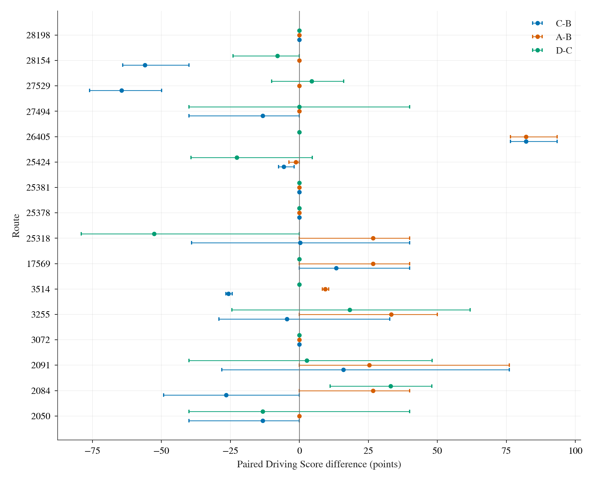
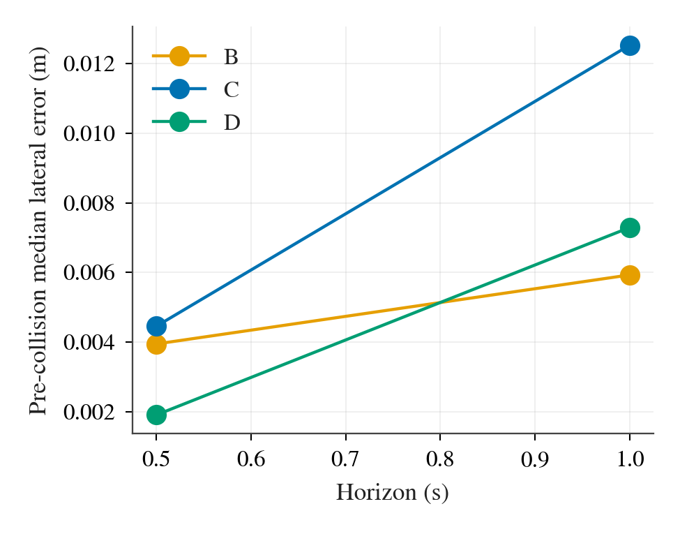

# W2：TFv6 waypoint 与 production 控制器的闭环实验

> **更正（2026-09-24）**：本报告中 C、D 两臂的结果（C − B、D − C 及其机制解读）作废。协议规定的坐标变换在车辆静止时会造出假目标点，见 [diagnosis-tangent.md](diagnosis-tangent.md) 和 `research/decisions.md` 第 31 条。A − B 不受影响。下文保留原样，只作历史记录。

**冻结协议** `06674d4`；**正式驾驶代码** `fdbe0c94c979e8a4d9e89b983ec244bba2d8a116`；**分析修复提交** `c7b2db2d8ec2811bb4e48dcfc1df025cd4bbd8d6`。正式驾驶于 2026-09-23/24（JST）在单张 RTX 3090、两个并行 CARLA server 上完成。下文只使用修复后的 202 个有效正式 case；逐帧与中断/作废目录保存在 `/data/runs/b2d/tfv6-w2/formal/`。

## 问题、设计与完整性

问题是：同一个 TFv6 的 8 点 waypoint 交给 production 控制器 C，和交给作者 waypoint PID B，闭环 DS 是否有可测差别。A 是作者 route + target-speed PID；D 是 C 加 rear-slip frame 与 Ackermann inverse 的探索臂。四臂共用 checkpoint、传感器与作者后处理启发式；主比较预登记为 C−B，A−B 与 D−C 只描述。C/D 不用 truth pose 控制，诊断 PoseFilter 不进入控制。

| 级别 | 路线 | seed / 臂 | 有效 case | 官方状态 |
|---|---:|---|---:|---|
| 1 Dev10 | 10 | 0/1/2 × A/B/C/D | 120/120 | 116 Completed；2 TickRuntime；2 Agent got blocked |
| 1r 同 seed A 重跑 | 10 | 0 × A | 10/10 | 10 Completed |
| 2 v1 holdout | 6 | 0/1/2 × A/B/C/D | 72/72 | 59 Completed；5 TickRuntime；7 route deviation；1 Agent got blocked |

没有缺失配对组、基础设施重试或耗尽 case。两个并发 worker 完成正式有效 case 的累计 case 墙钟为 8.79 小时（第 1 级 5.18、第 1r 级 0.27、第 2 级 3.34）；驾驶失败包括官方 4000 tick 上限，均按一次驾驶结果计分。

## 主要结果：Driving Score

单位为 DS 点；方括号为按路线整组重抽、10,000 次 bootstrap 的 95% CI。每条路线的三个 seed 一起进入同一次重抽。

| 数据 | 配对 | 平均差 [95% CI] | 配对 / 路线 |
|---|---|---:|---:|
| 第 1 级 | C-B | +6.23 [-7.62, +25.50] | 30 / 10 |
| 第 1 级 | A-B | +17.56 [+4.41, +34.74] | 30 / 10 |
| 第 1 级 | D-C | -0.18 [-6.54, +5.47] | 30 / 10 |
| 第 2 级 | C-B | -26.68 [-47.43, -6.60] | 18 / 6 |
| 第 2 级 | A-B | +8.89 [+0.00, +17.78] | 18 / 6 |
| 第 2 级 | D-C | -6.08 [-27.82, +12.97] | 18 / 6 |
| 合并 | C-B | -6.11 [-20.76, +9.57] | 48 / 16 |
| 合并 | A-B | +14.31 [+5.10, +25.89] | 48 / 16 |
| 合并 | D-C | -2.39 [-11.69, +5.67] | 48 / 16 |

合并主效应 C−B 为 −6.11 DS，CI [−20.76, +9.57] 包含 0，宽度 30.33 DS；按预登记规则，**没有可测效应**。此区间尚容许约 20.8 DS 的劣化或 9.6 DS 的改善，因而不能把“不显著”解释为等效。第 1 级 C−B 为正、第 2 级为负，单级数字只描述，不单独下结论。A−B 合并为 +14.31 [ +5.10, +25.89 ] DS，说明 representation/control 路径差异很大，但不是控制器主效应。D−C 为 −2.39 [−11.69, +5.67] DS，不支持这次探索改动。

图 1 每行是一条路线，三个点分别是 C−B、A−B、D−C；误差线仅是在该路线三个 seed 内重抽的描述性 95% 区间，正式推断以表中 route-cluster CI 为准。路线 26405 对 C 有很大的正差，而 holdout 的 27529、28154 为很大的负差，这种异质性使合并区间跨零。

### 同 seed 重跑的噪声参照

A 臂 seed 0 的 10 次重跑中 8/10 的 DS 差为 0；差值中位数 0，最大绝对差为 40 DS（路线 2091：+40），另有路线 25424：−3.77。配对同 seed 不能保证仿真完全确定；route-cluster bootstrap 反映路线间差异，并没有单独估计重跑噪声。

## 次要驾驶指标

| 数据 | 臂 | 平均 DS | 平均 RC % | 完成数 | SR 数 |
|---|---|---:|---:|---:|---:|
| 第 1 级 | A | 94.21 | 100.00 | 30/30 | 24/30 |
| 第 1 级 | B | 76.65 | 96.18 | 27/30 | 14/30 |
| 第 1 级 | C | 82.88 | 98.44 | 29/30 | 14/30 |
| 第 1 级 | D | 82.70 | 100.00 | 30/30 | 14/30 |
| 第 2 级 | A | 100.00 | 100.00 | 18/18 | 18/18 |
| 第 2 级 | B | 91.11 | 100.00 | 18/18 | 14/18 |
| 第 2 级 | C | 64.43 | 82.56 | 12/18 | 7/18 |
| 第 2 级 | D | 58.35 | 78.09 | 11/18 | 5/18 |
| 合并 | A | 96.38 | 100.00 | 48/48 | 42/48 |
| 合并 | B | 82.07 | 97.61 | 45/48 | 28/48 |
| 合并 | C | 75.96 | 92.48 | 41/48 | 21/48 |
| 合并 | D | 73.57 | 91.78 | 41/48 | 19/48 |

SR 要求官方完成且没有除 min-speed 以外的违规；“完成数”与官方 Completed 状态在这批 case 中逐行一致。下表为合并 48 对的配对差，完成与 SR 差以每个 case 的 0/1 取均值（例如 −0.08 即约少 8.3 个百分点）。

| 指标 | C−B 平均差 [95% CI] | A−B 平均差 [95% CI] | D−C 平均差 [95% CI] |
|---|---:|---:|---:|
| RC，百分点 | -5.13 [-13.54, +1.69] | +2.39 [+0.00, +6.03] | -0.70 [-7.78, +4.15] |
| 完成率 | -0.08 [-0.25, +0.08] | +0.06 [+0.00, +0.17] | +0.00 [-0.10, +0.08] |
| SR | -0.15 [-0.42, +0.10] | +0.29 [+0.10, +0.50] | -0.04 [-0.17, +0.06] |

违规率按官方事件数除以**该 case 的标称路线长度**（km），未把未完成 case 的分母改为已行驶里程；这与冻结分析脚本一致。下表逐项给出合并配对差，单位为次/km。短路线会放大单个事件的率，解释应结合 DS 和官方状态。

| B2D 违规类别 | C−B | A−B | D−C |
|---|---:|---:|---:|
| 静态物碰撞 | +0.77 [+0.00, +2.00] | +0.00 [+0.00, +0.00] | -0.12 [-0.89, +0.53] |
| 行人碰撞 | -0.36 [-1.07, +0.00] | -0.36 [-1.07, +0.00] | +0.00 [+0.00, +0.00] |
| 车辆碰撞 | +0.01 [-3.69, +3.12] | -2.86 [-5.98, -0.59] | -0.27 [-2.26, +1.61] |
| 闯红灯 | +0.00 [+0.00, +0.00] | +0.00 [+0.00, +0.00] | +0.00 [+0.00, +0.00] |
| 未停车 | +0.30 [+0.00, +0.89] | +0.00 [+0.00, +0.00] | +1.13 [+0.00, +2.59] |
| 偏离道路/车道 | +0.48 [-1.58, +2.61] | -0.74 [-2.15, +0.39] | -0.21 [-1.07, +0.61] |
| 最低速度 | -15.03 [-39.48, +3.12] | +5.42 [+0.00, +14.40] | +2.19 [-8.24, +12.47] |
| 未让应急车辆 | +0.00 [+0.00, +0.00] | +0.00 [+0.00, +0.00] | +0.00 [+0.00, +0.00] |
| 场景超时 | +0.00 [+0.00, +0.00] | +0.00 [+0.00, +0.00] | +0.00 [+0.00, +0.00] |
| 路线偏离 | +0.86 [+0.00, +2.31] | +0.00 [+0.00, +0.00] | +0.30 [+0.00, +0.89] |
| 车辆受阻 | -0.01 [-0.94, +0.89] | -0.31 [-0.94, +0.00] | -0.30 [-0.89, +0.00] |
| 路线超时 | +0.00 [+0.00, +0.00] | +0.00 [+0.00, +0.00] | +0.00 [+0.00, +0.00] |

## 控制层：跟踪与平顺性

分析仅选计划速度 >1 m/s 的 tick，按第一次碰撞分前、后。下表把每个 case 的误差中位数和 P95 再取跨 case 中位数，避免把长度较长的失败 case 当作更多独立样本；因此表中值是 **case 摘要的中位数**，不是所有 tick 混池分位数。`n` 是纳入的 case 数，tick 数为对应 case 的观测总数。

| 片段 | 臂 | horizon s | n / ticks | 纵向误差 median / P95 m | 横向误差 median / P95 m |
|---|---|---:|---:|---:|---:|
| 碰撞前 | B | 0.5 | 48 / 19593 | 0.249 / 1.095 | 0.004 / 0.219 |
| 碰撞前 | B | 1.0 | 48 / 19113 | 0.548 / 2.109 | 0.006 / 0.412 |
| 碰撞前 | C | 0.5 | 48 / 14425 | 0.142 / 0.596 | 0.004 / 0.202 |
| 碰撞前 | C | 1.0 | 48 / 14021 | 0.354 / 1.943 | 0.013 / 0.480 |
| 碰撞前 | D | 0.5 | 48 / 14433 | 0.153 / 0.596 | 0.002 / 0.103 |
| 碰撞前 | D | 1.0 | 48 / 14035 | 0.365 / 1.954 | 0.007 / 0.292 |
| 碰撞后 | B | 0.5 | 14 / 3745 | 0.283 / 1.182 | 0.130 / 0.891 |
| 碰撞后 | B | 1.0 | 14 / 3766 | 0.543 / 2.170 | 0.097 / 0.941 |
| 碰撞后 | C | 0.5 | 17 / 9681 | 0.186 / 0.676 | 0.056 / 0.538 |
| 碰撞后 | C | 1.0 | 17 / 9640 | 0.336 / 1.934 | 0.122 / 0.930 |
| 碰撞后 | D | 0.5 | 18 / 17291 | 0.176 / 0.680 | 0.039 / 0.537 |
| 碰撞后 | D | 1.0 | 18 / 17218 | 0.351 / 1.957 | 0.086 / 0.678 |

图 2 显示碰撞前每个 case 的横向误差中位数再取中位数；两种 horizon 下三臂差异均很小，+1.0 s 时 C 的中位数较 B/D 高。该图是描述性摘要，不能由此推断 C−B 的 DS 差来自横向跟踪。

平顺性同样报告每个 case 的 P95 再取中位数，纵/横加速度单位 m/s²，纵/横 jerk 单位 m/s³，steer-rate 单位 1/s：

| 片段 | 臂 | 纵加速度 | 横加速度 | 纵 jerk | 横 jerk | steer-rate |
|---|---|---:|---:|---:|---:|---:|
| 碰撞前 | B | 7.68 | 0.97 | 113.85 | 11.04 | 0.44 |
| 碰撞前 | C | 4.72 | 2.58 | 63.58 | 21.51 | 1.85 |
| 碰撞前 | D | 4.62 | 2.95 | 64.80 | 23.51 | 1.81 |
| 碰撞后 | B | 7.42 | 3.16 | 107.73 | 42.94 | 1.23 |
| 碰撞后 | C | 4.03 | 2.21 | 40.74 | 22.74 | 2.00 |
| 碰撞后 | D | 3.00 | 2.22 | 43.27 | 22.59 | 2.00 |

C/D 的碰撞前纵向加速度 P95 低于 B，横向加速度和 steer-rate P95 更高；这些是轨迹选择、事故截断与控制共同产生的闭环结果，不能单独当成控制器因果机制。

## 大 DS 差路线的逐段机制描述（answer-6）

预先指定的补充描述范围是：逐路线三个 seed 的平均 C−B 或 D−B 绝对值 ≥10 DS。共 12/16 条路线入选，其中 3 条没有持续停滞。这里把“停滞段”操作化为真值纵向速度绝对值 <0.1 m/s、连续至少 40 tick（2 s）；短于 2 s 的正常起步/短暂停车不计。每段的速度与 control 用段内中位数；首段隐含速度是原点→第 1 个 TFv6 waypoint 的距离除以 0.25 s，8 点平均隐含速度是 8 个连续段的总弧长除以 2 s。C desired 是变换后首段的同一计算；C 在 `stop_hold` tick 的生效 target 为 0。B desired 按作者 `2·||waypoint[1]−waypoint[3]||` 还原，B throttle 是该 C/D 轨迹**同 tick 的 B shadow 最终请求值**，不是另一条 B 驾驶轨迹；请求 throttle 可超过 1，CARLA 执行时限幅。

分类只标记观察到的主要模式：`launch hold` 需要 C/D 的 `stop_hold` 占至少 25% 且 B shadow 仍请求正 throttle；`real reverse / invalid_motion` 需要有实质负向速度和大量 `invalid_motion`；`stop-sign / creep interaction` 需要作者后处理实际改变至少 25% tick 的 control；其余归 `other`。`creep_active` 或 stop-sign buffer 标志本身**不证明**发生控制覆盖。这些类别不参与预登记效应判定，也不宣称单独的事故因果。

| 级 | 路线 | C−B DS | D−B DS | ≥2 s 停滞段（C/D） |
|---|---:|---:|---:|---:|
| 1 | 2091 | +15.99 | +18.69 | 8 |
| 1 | 3255 | -4.53 | +13.69 | 9 |
| 1 | 3514 | -25.67 | -25.67 | 5 |
| 1 | 17569 | +13.33 | +13.33 | 0 |
| 1 | 25424 | -5.66 | -28.36 | 10 |
| 1 | 26405 | +82.17 | +82.17 | 0 |
| 1 | 27494 | -13.33 | -13.33 | 6 |
| 2 | 2050 | -13.33 | -26.67 | 0 |
| 2 | 2084 | -26.59 | +6.45 | 15 |
| 2 | 25318 | +0.32 | -52.38 | 4 |
| 2 | 27529 | -64.49 | -59.98 | 7 |
| 2 | 28154 | -56.00 | -64.00 | 6 |

70 段中，7 段符合 launch hold，4 段有显著真实反向/`invalid_motion`，59 段归 other；没有一段满足“后处理实际改变 ≥25% tick”的 stop-sign/creep 分类。路线 2091 多段的 TFv6 首 0.25 s 隐含速度只有约 0.07–0.16 m/s，8 点平均约 2 m/s，而同 tick B desired 多在 1.1–1.5 m/s 且请求 throttle：这是预先怀疑的首段速度/起步 hold 模式。路线 25318 的四段约 190 s 长停滞则不同：C desired 约 5.7–6.6 m/s，C raw/final throttle 常为正，`creep_active` 标志约 71% tick 但实际 control 改写远低于 25%；按观察只能归 other，不能称作 launch hold 或 creep 致停。路线 2050、17569、26405 没有 ≥2 s 停滞段；尤其 26405 的大正差对应 B 的 blocked/碰撞与 C/D 完成，28154 的负差主要表现为 C/D 完成但碰撞罚分，均不能由停滞段解释。

### 每个持续停滞段

下表的 `v1/v8/target`、`C v`、`B v/τ` 单位分别为 m/s 与无量纲 throttle；`C reason` 列给段内占比（`hold`、`invalid`），完整的 raw/final brake、postprocessor 改写比例和所有数值见 [mechanism-stretches.csv](results/mechanism-stretches.csv)。`other` 同时包括模型计划停、持续请求油门但车辆不动以及无法单凭日志归因的情况。

| 路线/seed/臂 | ticks | 秒 | TFv6 v1/v8/target | C v；reason（hold/invalid %） | B v/τ | 类别 |
|---|---:|---:|---:|---|---:|---|
| 2091/0/C | 124–369 | 12.3 | 0.16/2.39/0.45 | 0.16; tracking (36/2) | 1.50/2.52 | 起步 hold |
| 2091/0/C | 545–1653 | 55.5 | 0.02/0.01/0.00 | 0.02; stop_hold (76/3) | 0.00/0.00 | other |
| 2091/0/C | 1694–3999 | 115.3 | 2.23/3.54/0.00 | 6.32; tracking (0/2) | 1.70/2.72 | other |
| 2091/1/C | 128–364 | 11.8 | 0.07/2.06/0.00 | 0.07; tracking (45/3) | 1.14/2.30 | 起步 hold |
| 2091/2/C | 173–798 | 31.3 | 0.13/2.23/0.00 | 0.13; tracking (37/4) | 1.12/2.34 | 起步 hold |
| 2091/2/D | 124–363 | 12.0 | 0.12/2.31/0.00 | 0.12; tracking (39/3) | 1.28/2.46 | 起步 hold |
| 2091/2/D | 384–652 | 13.4 | 0.14/1.92/0.00 | 0.14; tracking (34/3) | 1.25/2.48 | 起步 hold |
| 2091/2/D | 673–1782 | 55.5 | 0.12/1.98/0.00 | 0.12; tracking (40/3) | 1.10/2.21 | 起步 hold |
| 3255/0/C | 187–250 | 3.2 | 0.19/0.29/0.00 | 0.19; tracking (0/14) | 0.00/0.00 | other |
| 3255/0/D | 201–263 | 3.1 | 0.00/1.48/0.00 | 0.00; stop_hold (70/2) | 0.09/0.00 | other |
| 3255/0/D | 453–613 | 8.1 | 0.00/0.00/0.00 | 0.00; stop_hold (69/3) | 0.00/0.00 | other |
| 3255/1/C | 185–251 | 3.4 | 0.15/0.27/0.00 | 0.15; tracking (2/8) | 0.00/0.00 | other |
| 3255/1/D | 184–258 | 3.8 | 0.05/0.49/0.00 | 0.05; stop_hold (52/8) | 0.00/0.00 | other |
| 3255/1/D | 486–628 | 7.2 | 0.74/0.43/0.95 | 6.70; tracking (0/0) | 0.26/0.00 | other |
| 3255/1/D | 724–1109 | 19.3 | 0.79/1.90/0.00 | 5.61; tracking (0/1) | 1.03/2.67 | other |
| 3255/1/D | 1169–2282 | 55.7 | 0.04/0.11/0.00 | 0.04; stop_hold (64/4) | 0.01/0.00 | other |
| 3255/2/D | 181–263 | 4.2 | 0.06/0.48/0.00 | 0.06; tracking (32/17) | 0.00/0.00 | other |
| 3514/0/D | 44–94 | 2.5 | 2.15/0.97/0.00 | 6.72; tracking (0/2) | 0.08/0.00 | other |
| 3514/1/C | 43–93 | 2.5 | 2.07/1.12/0.00 | 6.80; tracking (0/0) | 0.14/0.00 | other |
| 3514/1/D | 40–93 | 2.7 | 2.12/0.89/0.00 | 6.75; tracking (0/4) | 0.10/0.00 | other |
| 3514/2/C | 43–92 | 2.5 | 2.20/0.92/0.00 | 6.73; tracking (0/0) | 0.11/0.00 | other |
| 3514/2/D | 39–93 | 2.8 | 2.28/1.19/0.00 | 6.66; tracking (0/2) | 0.29/0.00 | other |
| 25424/0/D | 344–694 | 17.6 | 0.56/4.67/8.75 | 3.53; tracking (0/2) | 3.01/2.72 | other |
| 25424/0/D | 805–885 | 4.0 | 0.32/4.32/9.56 | 1.34; tracking (0/18) | 2.49/2.72 | other |
| 25424/0/D | 1175–1214 | 2.0 | 2.72/3.83/7.94 | 6.02; tracking (0/8) | 1.85/2.72 | other |
| 25424/0/D | 1280–1335 | 2.8 | 2.64/3.40/5.53 | 6.18; tracking (0/2) | 1.39/2.63 | other |
| 25424/0/D | 1337–1396 | 3.0 | 2.55/3.31/5.81 | 6.22; tracking (0/0) | 1.54/2.70 | other |
| 25424/0/D | 1767–1828 | 3.1 | 1.07/2.66/0.00 | 7.06; tracking (0/48) | 0.97/2.51 | 真实反向 / invalid_motion |
| 25424/0/D | 1914–1971 | 2.9 | 0.92/1.76/0.00 | 7.23; tracking (0/48) | 0.39/0.00 | 真实反向 / invalid_motion |
| 25424/1/D | 403–482 | 4.0 | 2.62/1.20/0.00 | 6.11; tracking (0/49) | 0.03/0.00 | 真实反向 / invalid_motion |
| 25424/1/D | 517–1643 | 56.4 | 2.59/2.10/0.00 | 6.13; tracking (0/2) | 0.22/0.00 | other |
| 25424/1/D | 1721–1774 | 2.7 | 2.64/3.54/8.28 | 6.02; tracking (0/32) | 1.41/2.64 | 真实反向 / invalid_motion |
| 27494/0/C | 215–373 | 8.0 | 3.69/5.12/1.44 | 5.67; tracking (0/1) | 3.70/2.72 | other |
| 27494/0/D | 210–381 | 8.6 | 0.03/0.96/0.00 | 0.03; stop_hold (70/5) | 0.00/0.00 | other |
| 27494/1/C | 192–545 | 17.7 | 0.00/0.26/0.00 | 0.00; stop_hold (51/15) | 0.00/0.00 | other |
| 27494/1/D | 223–380 | 7.9 | 0.06/1.15/0.00 | 0.06; tracking (39/6) | 0.01/0.00 | other |
| 27494/2/C | 193–382 | 9.5 | 0.05/0.13/0.00 | 0.05; stop_hold (48/10) | 0.00/0.00 | other |
| 27494/2/D | 270–372 | 5.2 | 1.75/3.52/0.00 | 6.16; tracking (0/20) | 1.60/2.65 | other |
| 2084/0/D | 176–230 | 2.8 | 0.04/1.09/0.00 | 0.04; stop_hold (53/0) | 0.05/0.00 | other |
| 2084/0/D | 269–319 | 2.5 | 0.19/0.73/0.55 | 0.19; tracking (31/4) | 0.77/1.91 | 起步 hold |
| 2084/1/C | 177–228 | 2.6 | 0.03/1.18/0.00 | 0.03; stop_hold (60/2) | 0.05/0.00 | other |
| 2084/1/C | 251–308 | 2.9 | 0.19/0.58/0.41 | 0.19; tracking (7/0) | 0.96/1.91 | other |
| 2084/1/C | 437–487 | 2.5 | 0.02/0.02/0.00 | 0.02; stop_hold (61/8) | 0.00/0.00 | other |
| 2084/1/C | 492–558 | 3.4 | 0.02/0.01/0.00 | 0.02; stop_hold (69/6) | 0.00/0.00 | other |
| 2084/1/C | 651–725 | 3.8 | 0.02/0.01/0.00 | 0.02; stop_hold (59/9) | 0.00/0.00 | other |
| 2084/1/C | 747–841 | 4.8 | 0.01/0.00/0.00 | 0.01; stop_hold (77/4) | 0.00/0.00 | other |
| 2084/1/C | 846–1238 | 19.6 | 0.02/0.01/0.00 | 0.02; stop_hold (60/10) | 0.00/0.00 | other |
| 2084/1/C | 1240–1534 | 14.8 | 0.02/0.01/0.00 | 0.02; stop_hold (74/5) | 0.00/0.00 | other |
| 2084/1/C | 1560–2674 | 55.8 | 0.01/0.01/0.00 | 0.01; stop_hold (79/2) | 0.01/0.00 | other |
| 2084/1/C | 2677–3992 | 65.8 | 0.02/0.01/0.00 | 0.02; stop_hold (75/4) | 0.01/0.00 | other |
| 2084/2/C | 158–228 | 3.5 | 0.02/0.95/0.00 | 0.02; stop_hold (70/1) | 0.03/0.00 | other |
| 2084/2/C | 254–321 | 3.4 | 0.03/0.26/0.00 | 0.03; stop_hold (59/6) | 0.05/0.00 | other |
| 2084/2/D | 172–229 | 2.9 | 0.05/0.93/0.00 | 0.05; stop_hold (50/2) | 0.04/0.00 | other |
| 25318/0/C | 202–3999 | 189.9 | 1.23/2.85/0.00 | 6.65; tracking (1/2) | 1.17/2.63 | other |
| 25318/0/D | 202–3999 | 189.9 | 0.60/3.62/0.40 | 5.74; tracking (11/4) | 2.25/2.72 | other |
| 25318/1/D | 205–3999 | 189.8 | 1.01/3.55/0.00 | 6.07; tracking (0/3) | 2.29/2.72 | other |
| 25318/2/D | 199–3999 | 190.1 | 1.33/3.15/0.00 | 6.55; tracking (1/3) | 1.52/2.70 | other |
| 27529/0/C | 102–282 | 9.1 | 0.01/0.89/0.00 | 0.01; stop_hold (62/10) | 0.15/0.00 | other |
| 27529/0/D | 101–284 | 9.2 | 0.01/0.90/0.00 | 0.01; stop_hold (63/10) | 0.15/0.00 | other |
| 27529/1/C | 102–281 | 9.0 | 0.01/0.85/0.00 | 0.01; stop_hold (64/10) | 0.15/0.00 | other |
| 27529/1/C | 438–1638 | 60.0 | 3.43/4.35/1.19 | 5.83; tracking (0/2) | 3.26/2.72 | other |
| 27529/1/D | 103–278 | 8.8 | 0.01/0.87/0.00 | 0.01; stop_hold (61/11) | 0.19/0.00 | other |
| 27529/2/C | 103–285 | 9.2 | 0.01/1.01/0.00 | 0.01; stop_hold (62/10) | 0.21/0.00 | other |
| 27529/2/D | 102–282 | 9.1 | 0.01/0.90/0.00 | 0.01; stop_hold (62/10) | 0.20/0.00 | other |
| 28154/0/C | 244–298 | 2.8 | 0.48/2.25/0.88 | 1.15; tracking (0/0) | 1.84/2.47 | other |
| 28154/0/D | 244–303 | 3.0 | 0.67/2.95/0.48 | 4.09; tracking (0/0) | 1.64/2.48 | other |
| 28154/1/C | 247–305 | 3.0 | 0.68/1.86/0.00 | 5.75; tracking (0/2) | 0.72/1.96 | other |
| 28154/1/D | 246–303 | 2.9 | 1.01/1.88/0.00 | 6.34; tracking (0/0) | 0.56/1.52 | other |
| 28154/2/C | 248–306 | 3.0 | 0.46/2.05/0.00 | 4.97; tracking (0/2) | 0.95/2.45 | other |
| 28154/2/D | 248–307 | 3.0 | 0.46/2.63/1.39 | 2.33; tracking (0/3) | 1.62/2.72 | other |

## 偏离、修复与澄清

1. **shadow replay 状态别名。** 最初的浅拷贝复用被 monkey-patch 的 live processor 闭包，shadow 回放改变实际后处理状态；10 个已完成 case 与崩溃/中断 attempt 作废并留在 `level1/aborted/shadow-live-state-bug/`。修复后加入每 tick 的 live `__dict__` 深快照守卫，开发运行 800 tick 无失败，守卫均值约 1.064 ms（低于 2 ms）。第 1 阶段 smoke 与坐标核对的 B 轨迹同样录于旧 replay；坐标核对比较的是**同一条已实现轨迹**上的正确/错误变换，故比较结论仍有效，旧轨迹没有计入正式效应。

2. **signed-speed 输入契约。** Bench2Drive speedometer 给有符号前向速度；旧 wrapper 把很小的负值直接交给拒绝任何负速度的 `Controller.step`。C/D 后来改用 production `controller_speed()`：|v|<0.01 m/s 归零，实质倒车仍触发 `invalid_motion`；完整输入审计、单元测试与开发跑通过。该缺陷下的 6 个已完成 case 与 2 个中断 attempt 留在 `level1/aborted/signed-speed-bug/`，重跑整组。修复后的开发 C seed 1 仍在 4000 tick 中有 3588 tick 低速、185 tick `invalid_motion`，说明首段速度/停滞问题不能全归为接口 bug。

3. **TickRuntime 分类。** answer-1 曾写“e.g. a TickRuntime or crash on every arm”，answer-4 明确更正：“`Failed - TickRuntime` (the evaluator's 4000-tick route cap) is a driving outcome”。本报告保留 7 个官方 TickRuntime case 的 DS，不重跑；协议中的基础设施 timeout 仅指 CARLA/RPC/加载或停止 tick 的故障。

4. **分析目录扫描。** 第一版 `rglob("done.json")` 把 `aborted/` 的 16 个作废条目也读入，初版 `analysis-after-1` 有 136 而非 120 行，跟踪统计被重复。按 answer-7 停在第 1r 级：保留 5 个完成 case，2 个中断 attempt 移至 `level1r/aborted/analysis-discovery-stop/`，不计入正式结果。提交 `c7b2db2` 后只扫描 canonical `cases/<level>/`，校验唯一 case key 和选中 attempt 路径，并用回归测试验证；修复后第 1 级恰有 120 行、每臂 30、每种配对 30、路线 2091 跟踪无重复，再继续至 202/202。后续 answer-7 的规则是纯分析/报告 bug 保持驾驶继续，本次发现发生在该规则下达之前。

5. **作图补充。** 完赛后仅在路线配对图上加了每路线三 seed 的描述性 bootstrap 误差线，并从既有逐帧日志生成 answer-6 的机制表；未改动预登记路线、臂、主次指标、正式 route-cluster bootstrap 或驾驶结果。

## 问题回答与第 3 级判定

按预登记，C−B 合并 95% CI 含 0，因此在这 16 条路线/48 对上**没有检出可测主效应**；点估计为 −6.11 DS，不能支持用 C 取代作者 B，也不能据此断言两者等效。路线差异很大：第 1 级 C−B 为 +6.23，第 2 级为 −26.68。

第 3 级继续条件是“合并 CI 不含 0”，或“|C−B|≥3 DS 且第 1、2 级同方向”。本次 CI 含 0；虽然 |−6.11|≥3，但两级方向相反，**两个条件均不满足**，不申请第 3 级 GO，也没有运行第 3 级。

正式汇总文件：[cases.csv](results/cases.csv)、[paired.csv](results/paired.csv)、[tracking.csv](results/tracking.csv)、[summary.json](results/summary.json)；逐帧日志和作废 attempt 保存在 `/data/runs/b2d/tfv6-w2/formal/`。
