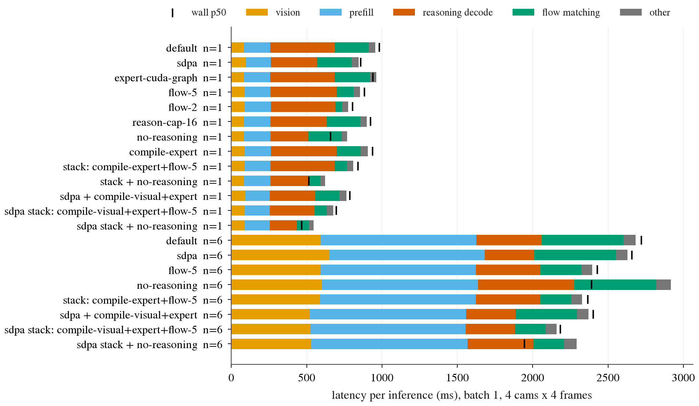
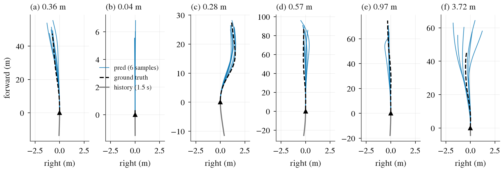

# Alpamayo 1.5 smoke run：在我们的 GPU 上跑通、测延迟、小样本质量

状态: done（smoke run / characterization，不是 benchmark）
主题: ../../research/openpilot-and-open-driving-models.md

## 目标

把 NVIDIA Alpamayo 1.5（`nvidia/Alpamayo-1.5-10B`，reasoning VLA，即视觉语言模型直接输出驾驶动作；backbone 是 Cosmos-Reason2-8B，外加 2.3B 的 flow-matching action expert，用 flow matching 这种连续生成方法把噪声逐步积分成轨迹）在 box 上跑起来：官方示例能出轨迹和 CoC（Chain of Causation，NVIDIA 定义的因果推理文本），在单卡 RTX PRO 6000 Blackwell 上测清楚各阶段延迟，把推理配置在“只改配置和 wrapper、不改模型代码”的前提下推到头，并在一小批真实 clip 上核对 open-loop 质量。

## Setup

| 项 | 内容 |
|---|---|
| 代码 | NVlabs/alpamayo1.5 @ `36aeb4c`，`~/data/third_party/alpamayo1.5`，venv 在其 `.venv`（uv，按 `uv.lock` 导出的版本从 aliyun 镜像装） |
| 版本 | torch 2.8.0+cu128，transformers 4.57.1，flash-attn 2.8.3（复用 uv cache 里已编好的 wheel，sm_120 上与 SDPA 对拍误差 0.008），cuDNN 9.10.2，driver 595.71.05，GPU RTX PRO 6000 Blackwell Server Edition 96 GB |
| 权重 | `nvidia/Alpamayo-1.5-10B` @ `7aba829`，bf16，5 个 shard 共 22.16 GB，全部与 HF LFS 的 sha256 核对通过，放在 HF cache |
| 数据 | `nvidia/PhysicalAI-Autonomous-Vehicles` @ `33f9bf4`（gate 已通过），只取 31 个 clip × 5 个 feature（egomotion + 4 路相机），共 2.0 GB，放在 `$DATA_DIR/datasets/physical_ai_av/hub`（稀疏 chunk，见下） |
| 输入 | 官方默认：4 路相机（cross-left、front-wide、cross-right、front-tele）× 4 帧 @10 Hz，原图 1080×1920 由 processor 缩到约 320×576；16 步 egomotion 历史；t0 = 5.1 s |
| 代码（我们的） | `jevdrive/hfdl.py`（共享下载器）、`jevdrive/alpamayo/{data,infer}.py`、`scripts/alpamayo_{fetch,eval,shipped,figs}.py` |
| run dir | `$DATA_DIR/runs/alpamayo/{fetch,shipped,bench,eval,profile}/`；小结果文件拉回到 `research/results/alpamayo-smoke/` |

测延迟时每一行都记录了 `nvidia-smi` 上除我们之外的 compute 进程：全部为空，另一个 agent 的 openpilot 任务在这段时间没有占 GPU，所以不需要重测。

## 下载：路线和吞吐

| 对象 | 路线 | 吞吐 | 说明 |
|---|---|---|---|
| 权重 22.16 GB | ModelScope `nv-community/Alpamayo-1.5-10B`，直连，16 路 range 并发 | 每个 shard 8.0–11.3 MB/s，整体 2223 s，平均 10.0 MB/s | 文件列表和 sha256 取自 hf-mirror 的 HF API，数据从 ModelScope 下，sha256 逐个对上 |
| 同上（放弃） | hf-mirror → 302 到 HF 美国 CDN（`us.aws.cdn.hf.co`），直连 | 单流 0.55 MB/s；16 流 90 s 稳态约 3 MB/s | hf-mirror 对 LFS 文件只是重定向，数据实际走 HF CDN，所以对我们没有加速 |
| 31 个 clip 2.0 GB | hf-mirror 解析 → CDN 走 Clash（`proxy_on`），range 读 zip 成员 | 543 s，3.7 MB/s（同时还有官方示例在 stream） | CDN 单流：直连 0.1 MB/s，Clash 1.3 MB/s，turbo 0.02 MB/s（各 15 s 抽测） |
| Cosmos-Reason2-8B 的 config/tokenizer | ModelScope `nv-community/Cosmos-Reason2-8B` | 小文件 | 见“阻塞”：HF gate 没通过，文件用 HF 的 git blob oid 逐个核对 |

权重的 90 s 测量在切换路线前后各做了一次（CDN 约 3 MB/s，ModelScope 9 MB/s，同时段 box 总出口 11 MB/s）。结论：HF 上的大模型，ModelScope 有同一份拷贝时优先走它，sha256 用 HF 的核对即可；数据集 ModelScope 那份只有元数据，只能走 HF CDN，而 CDN 在这台 box 上走 Clash 比直连快一个数量级。

数据集的 camera 按 chunk 打包成约 2 GB 的 zip（每个 chunk 约 100 个 clip）。`jevdrive/alpamayo/data.py` 用 HTTP range 读远端 zip 的 central directory，只拉目标 clip 的成员，写成一个“稀疏 chunk zip”放在私有的 HF cache 布局目录里；官方的 `load_physical_aiavdataset` 和 `PhysicalAIAVDatasetInterface(cache_dir=...)` 不改一行就能离线读。一个 clip（4 路相机 + egomotion）约 65 MB。

## 官方示例（as shipped）

`src/alpamayo1_5/test_inference.py` 原样运行时，clip 从 HF stream 成功（约 4 分钟），但加载模型时失败：模型的 config 用 `nvidia/Cosmos-Reason2-8B` 建 tokenizer，transformers 会探测一个仓库里本不存在的 `processor_config.json`，对 gate 没通过的 repo 这一步返回 403 并直接抛异常。`scripts/alpamayo_shipped.py` 只做一处 wrapper 级的改动：clip 照原样 stream 完之后，把 HF hub 切到 offline，让模型从本地 cache 读 Cosmos 的 tokenizer/config。示例其余部分不变，结果：

| clip | CoC | minADE（1 条轨迹，vs GT） | 总耗时 |
|---|---|---|---|
| `030c760c…`（示例自带） | "Nudge to the left to clear the construction equipment blocking the right side of our lane" | 0.375 m | 118 s（含 stream clip 和加载权重） |

轨迹和推理文本都正常输出。

## 延迟

测法：batch 1，默认输入（4 路 × 4 帧，prompt 3086 token），4 个 clip × 4 个 seed = 每行 16 次，前面另跑 2 次 warmup（torch.compile 和 CUDA graph 的开销落在 warmup 里）。阶段拆分用 forward hook 加 CUDA 同步：vision（vision encoder）、prefill（整段 prompt 的第一次 LM forward，建 KV cache，即后续解码复用的 key/value 缓存）、reasoning decode（逐 token 生成 CoC，每步一次 LM forward）、flow matching（expert 的全部去噪步），other 是余下的 generate 簿记、采样和轨迹积分。hook 自身的同步开销用每行额外 4 次不挂 hook 的运行核对过：与 p50 相差不到 5%。n=16 时 p99 基本就是最大值；阶段列是均值。n 是每次推理的轨迹条数（`num_traj_samples`，每条轨迹配一条独立的 reasoning rollout）。

### 默认配置

| 配置 | p50 (ms) | p99 (ms) | vision | prefill | decode（token 数） | flow（10 步） | other | 峰值显存 |
|---|---:|---:|---:|---:|---:|---:|---:|---:|
| FA2，n=1 | 983 | 1077 | 83 | 175 | 430（15.9 tok，27 ms/tok） | 224 | 45 | 22.1 GB |
| FA2，n=6 | 2722 | 2774 | 594 | 1031 | 434（16.8 tok） | 544 | 79 | 29.2 GB |

读法：n=1 时 reasoning decode 占 44%，是最大的一块；flow matching 10 步 224 ms，每步约 22 ms。n=6 时 vision 涨到 7.2 倍、prefill 涨到 5.9 倍，原因是 HF `generate` 按 `num_return_sequences` 把输入（包括 16 张图的 pixel values）复制 6 份再 prefill，同一组图像被编码了 6 遍；这 1.6 s 是纯重复计算，也是和 FlashDrive（arXiv 2608.12932）报的 717 ms 基线差 3.8 倍的主要来源（他们约 16 个 reasoning token、8 步 flow，但没说是否共享 prefill）。显存与 README 的 24 GB（n=1）一致，n=6 为 29 GB。

一次 expert 前向的 profile（`profile` 子命令）：每步约 2400 个 kernel，GPU 时间 18.8 ms，其中带 dense float mask 的 memory-efficient attention 占 6.6 ms（36 层 × 184 µs），其余是一堆小 GEMM 和 cat/copy。所以 flow 这一块是 GPU 时间本身慢，不是 launch 开销，这解释了下面 CUDA graph 为什么没用。

### 逐项推配置（每项单独一行）

drift 是同 clip、同 seed 下该配置与默认配置第 1 条轨迹之间的 ADE（average displacement error，64 个点的平均欧氏距离）；CoC 相同率是同 seed 下推理文本逐字相同的比例。作为参照，默认配置自身换 seed 的 noise floor（本来的采样随机性）是 drift 1.28 m、CoC 相同率 0.42。minADE vs GT 是这 4 个 clip × 4 seed 的平均，只用来看质量有没有塌，不是评测数字。

| 行 | n | p50 (ms) | p99 (ms) | 相对默认 | drift (m) | CoC 相同 | minADE vs GT (m) | 备注 |
|---|---:|---:|---:|---:|---:|---:|---:|---|
| 默认（FA2） | 1 | 983 | 1077 | — | 0 | 1.00 | 1.62 | |
| SDPA 代替 FA2 | 1 | 859 | 974 | −13% | 0.01 | 1.00 | 1.62 | decode 19.4 vs 27.1 ms/tok；FA2 varlen 在逐 token 解码上反而慢 |
| expert CUDA graph（仓库自带） | 1 | 940 | 1238 | −4% | 0 | 1.00 | 1.62 | 6 次 capture、220 次 replay、0 次 fallback，但 flow 不变（234 ms） |
| torch.compile expert | 1 | 937 | 1029 | −5% | 0 | 1.00 | 1.62 | flow 224→161 ms；warmup 162 s |
| torch.compile LM | 1 | 1157 | 1268 | +18% | 0.00 | 1.00 | 1.62 | 动态 KV 长度下图断裂，decode 更慢 |
| torch.compile vision（FA2 下） | 1 | 失败 | | | | | | dynamo 无法 trace `flash_attn` varlen op；改在 SDPA 下做 |
| static KV cache（SDPA 下） | 1 | 失败 | | | | | | `index_copy_` dtype 不符（bf16 cache vs autocast 下的 fp32）；同进程里先前一次失败还把 CUDA RNG 留在 capture 状态，拖垮后续所有采样，所以放到最后单独跑 |
| flow 5 步 | 1 | 883 | 971 | −10% | 0.17 | 1.00 | 1.53 | |
| flow 2 步 | 1 | 805 | 907 | −18% | 0.57 | 1.00 | 1.36 | |
| reasoning 上限 32 token | 1 | 994 | 1076 | +1% | 0 | 1.00 | 1.62 | CoC 平均 16 token，32 的上限不起作用 |
| reasoning 上限 16 token | 1 | 924 | 942 | −6% | **2.08** | 0.75 | **2.29** | 截断后没有 `<traj_future_start>`，expert 接在半句话后面，质量明显变差 |
| 不推理（prompt 里直接闭合 CoC） | 1 | 658 | 1293 | −33% | 1.08 | 0 | 1.47 | 平均仍生成 9.4 个 token 才到轨迹起始符，个别样本更长，p99 翻倍 |
| 叠加：compile expert + flow 5 | 1 | 840 | 921 | −15% | 0.17 | 1.00 | 1.53 | |
| **叠加：SDPA + compile vision/expert + flow 5** | 1 | **697** | **758** | **−29%** | 0.17 | 1.00 | 1.53 | 输出基本不变（drift 远低于 noise floor）档的最好结果 |
| 叠加：上一行 + 不推理 | 1 | 467 | 927 | −53% | 1.04 | 0 | 1.41 | 没有 CoC；p99 不稳 |
| 默认（FA2） | 6 | 2722 | 2774 | — | 0 | 1.00 | 0.62 | |
| SDPA | 6 | 2658 | 2700 | −2% | 0.02 | 1.00 | 0.61 | |
| SDPA + compile vision/expert | 6 | 2402 | 2442 | −12% | 0.01 | 1.00 | 0.62 | |
| flow 5 步 | 6 | 2429 | 2490 | −11% | 0.18 | 1.00 | 0.63 | |
| **叠加：SDPA + compile vision/expert + flow 5** | 6 | **2184** | **2227** | **−20%** | 0.18 | 1.00 | 0.63 | |
| 叠加 + 不推理 | 6 | 1945 | 5096 | −29% | 1.24 | 0 | 0.55 | p99 5 s |
| 1 条 reasoning × 6 个 flow 样本（`num_traj_sets=6`） | 6 | 失败 | | | | | | 非 CFG 路径里 KV cache 的 batch（1）和 expert 的 batch（6）对不上；公开 API 里这条路不通 |

n = 4 个 clip × 4 个 seed = 16 次/行；clip 是示例 clip 加上 eval 抽样里的前 3 个（`clip_ids.parquet`，split 未注明）。读法：

- 输出不变的加速只有三项：SDPA（decode 快 29%）、compile vision/expert、CUDA graph（本例无效）。它们的 drift ≤ 0.02 m、CoC 100% 相同；SDPA + compile vision/expert 把 n=1 从 983 降到 786 ms，再加 flow 5 步到 697 ms。
- flow 步数是最干净的“质量换延迟”旋钮：VLM 输出完全一样，只有轨迹变。5 步的 drift 0.17 m，远低于 1.28 m 的 seed noise floor，minADE 也没变差；2 步的 drift 到 0.57 m。
- 砍 reasoning 要小心：截断（上限 16）会让轨迹明显变差；直接在 prompt 里闭合 CoC 反而没伤到 minADE（n=6 为 0.55 vs 0.62 m，样本太少，不能说更好），但失去了推理文本，而且尾延迟不稳。
- n=6 的大头是重复 6 次的 vision+prefill（1.6 s），配置层面的旋钮都碰不到它；要真正把 6 条轨迹做到 1 s 以内，需要“prefill 一次、KV cache 复制 6 份再各自解码”，这得改 `sample_trajectories_from_data_with_vlm_rollout`（它的 CFG 版本里已经有 `batch_repeat_interleave` 的现成写法），不在本次“不改模型代码”的范围内。



图：每个配置的阶段拆分（色条为 16 次的均值）和 wall p50（黑竖线）。看两件事：n=1 时 reasoning decode（橙红）最大，SDPA 和不推理都是在削它；n=6 时 vision + prefill（黄 + 蓝）占六成，任何配置都没动到。

## 小样本质量：minADE_6@6.4s

minADE_6 是 6 条采样轨迹里与 GT 最近那条在 64 个点（6.4 s）上的平均位移误差。配置用默认（FA2，n=6，seed 42，temperature 0.6，top-p 0.98，10 步 flow），只用 xy。

| 集合 | n | minADE_6 均值 (m) | 中位数 | bootstrap 95% CI | 第 1 条轨迹 ADE 均值 | minADE_6 < 1 m 的比例 |
|---|---:|---:|---:|---:|---:|---:|
| 示例 clip + `notebooks/clip_ids.parquet` 中 seed 0 随机抽的 30 个，t0 = 5.1 s | 31 | 0.738 | 0.575 | [0.52, 0.99] | 2.04 | 81% |
| model card（NVIDIA 自报） | 1434 | 0.916 | | | | |

读法：31 个样本的均值 0.74 m，CI 覆盖 card 的 0.916 m，只能说“量级一致、没有跑坏”，不能说比 card 好。两点注意：一是 `clip_ids.parquet` 是仓库 notebook 自带的 1181 个 clip，没有说明属于哪个 split，是否与训练集重叠不知道；二是分布很偏，最差的一个 3.72 m，去掉它均值降到 0.64 m。单条轨迹的 ADE（2.04 m）比 minADE_6 大近 3 倍，说明 6 条采样之间差异很大，这与上面 seed noise floor 1.28 m 一致。



图：6 个 clip 的俯视轨迹（前向朝上，横轴向右为正，横向坐标被拉伸以便看清亚米级偏差）：蓝色为 6 条预测，黑虚线为 GT，灰线为 1.5 s 历史，标题是该 clip 的 minADE_6。(a) 是官方示例，(b)–(f) 按 minADE_6 从好到差取分位点。看 (c)：6 条样本都跟住了 GT 的横向 S 形；(f) 的 6 条样本在路口前向散开，推理文本里 "accelerate through the green light" 与 GT 的较短行驶距离不符。

各面板的 CoC（6 条样本里去重后的文本）：

| 面板 | clip | minADE_6 | CoC |
|---|---|---:|---|
| (a) | 030c760c | 0.36 | Nudge to the left to clear the construction equipment blocking the right side of our lane / Keep distance to the lead vehicle since it is directly ahead in our lane / Nudge to the left to clear the construction cones blocking the right side of our lane |
| (b) | 8998837f | 0.04 | Stop to yield to the pedestrian in the crosswalk / Stop due to a pedestrian walking across the crosswalk ahead |
| (c) | 35242435 | 0.28 | Nudge left due to the stopped truck blocking the right side of our lane / Nudge left due to the vehicle encroaching from the right |
| (d) | e15f2ef5 | 0.57 | Keep distance to the lead vehicle since it is directly ahead in our lane |
| (e) | 74589d71 | 0.97 | Keep distance to the lead vehicle since it is directly ahead in our lane |
| (f) | 20c9e8e3 | 3.72 | Accelerate to proceed through the intersection since the straight traffic light is green / Maintain lane and accelerate to clear the green-light intersection since our lane is open, cross traffic is stopped, … |

(c) 的文本说 "nudge left"，而轨迹整体是向右的 S 形：在这段向右弯的道路上，相对车道中心的左偏和相对 t0 车头方向的右移可以同时成立，只看俯视图不能判定推理与动作矛盾（推测，要看图像才能确认）。

## zero-shot 跑 WOD-E2E 和 NAVSIM 需要什么（本次不做）

| 项 | Alpamayo 1.5 要的 | WOD-E2E（docs/waymo-e2e.md） | NAVSIM（docs/navsim.md） |
|---|---|---|---|
| 相机 | cross-left 120°、front-wide 120°、cross-right 120°、front-tele 30°，按 camera index 0/1/2/6 标名字 | 8 路，我们 box 上只留了 FRONT、FRONT_LEFT、FRONT_RIGHT；约 1079×972，不是 16:9 | 8 路 1920×1080，CAM_F0/L0/R0 可用 |
| 映射 | — | FRONT→front-wide，FRONT_LEFT/RIGHT→cross-left/right，front-tele 用 FRONT 中心裁剪放大近似；FOV 要从 `camera_calibrations` 里算，Waymo 前视远窄于 120°，模型会看到“被放大”的场景 | F0→front-wide，L0/R0→cross-left/right，tele 同样由 F0 中心裁剪；nuPlan 相机 FOV 同样窄于 120°，需从内参实测 |
| 图像时序 | 每路 4 帧 @10 Hz（0.3 s） | 每条记录只有当前帧，同序列的邻帧散在别的 shard 里且不齐全；可能只能 4 帧重复同一张（分布外） | sensor blob 是 2 Hz，拿不到 10 Hz 的 4 帧，同样只能重复或用 0.5 s 间隔帧（时间戳语义错位） |
| egomotion 历史 | 16 步 @10 Hz（1.5 s），xyz + 3×3 旋转 | 16 步 @4 Hz（4 s），只有 x/y、速度、加速度，无 z 和朝向：取最后 1.5 s 插值到 10 Hz，朝向由速度方向推，z 置 0 | 4 帧 @2 Hz（1.5 s）位姿：插值到 10 Hz，朝向可直接用 |
| 导航 | 可选的自然语言 `nav_text`（`<\|route_start\|>…`） | `intent` ∈ {GO_STRAIGHT, GO_LEFT, GO_RIGHT}：要写成文本模板，且模型训练时的 nav 文本是带距离的（如 "Turn left … in 40m"），模板化的效果未知 | driving command（左/直/右）同理 |
| 输出对齐 | 64 点 @10 Hz，6.4 s，t0 车体系 | 20 点 @4 Hz 到 5 s：在 0.25 s 处插值取点；RFS 用 3 条 rated 轨迹，原点定义（后轴中点）要核对 | 8 个位姿 @2 Hz 到 4 s，含 heading：从旋转矩阵取 yaw |
| 算力 | n=1 约 0.7–1.0 s/样本，n=6 约 2.2–2.7 s | RFS 只在每个 val 序列的 1 帧上有 rated 轨迹，样本数 = val 序列数，按上面单价估 | navtest 按场景数 × 单价估；单卡 n=1 每小时约 3.6–5k 个样本 |

整体判断：接口能拼上，但每个 benchmark 至少有两处明显的分布外（FOV、图像时序），zero-shot 分数会同时反映模型能力和适配损失，第一步应当先在 PhysicalAI-AV 上做“同一 clip 只喂 1 帧重复 4 次、把 front-wide 换成裁剪的窄 FOV”这类消融，量出每一项适配本身掉多少，再解读 WOD-E2E/NAVSIM 的数字（推测，尚未验证）。

## 阻塞与待用户处理

- **`nvidia/Cosmos-Reason2-8B` 的 HF gate 没有通过**（账号 ujsAER，对 `resolve` 返回 403）。Alpamayo 的 config 用它建 tokenizer，所以联网加载模型会失败。目前的绕法是从 ModelScope `nv-community/Cosmos-Reason2-8B` 取 config/tokenizer 文件（逐个对上 HF 的 git blob oid），加载模型时把 hub 切 offline（`jevdrive.alpamayo.infer.hub_offline`）。去 https://huggingface.co/nvidia/Cosmos-Reason2-8B 点一下 accept 就不需要这个绕法了。
- `nvidia/Alpamayo-1.5-10B` 和 `nvidia/PhysicalAI-Autonomous-Vehicles` 的 gate 都已通过。
- 数据集的 HF CDN 在 box 上直连只有约 0.1 MB/s/流，扩大 eval 时走 Clash（`proxy_on`），31 个 clip 约 9 分钟；1434 个 clip 按同样速度约 7 小时、约 93 GB。

## 复现

```bash
# box, repo root
HF_ENDPOINT=https://hf-mirror.com ~/data/envs/jevdrive/bin/python scripts/alpamayo_fetch.py weights processor backbone-config
PY=~/data/third_party/alpamayo1.5/.venv/bin/python
bash -ic 'proxy_on; HF_ENDPOINT=https://hf-mirror.com '$PY' scripts/alpamayo_eval.py fetch --n 30'
scripts/tmux_run.sh alp-bench env HF_ENDPOINT=https://hf-mirror.com $PY scripts/alpamayo_eval.py bench --clips 4 --seeds 4
scripts/tmux_run.sh alp-eval  env HF_ENDPOINT=https://hf-mirror.com $PY scripts/alpamayo_eval.py eval
# Mac, after pulling results into research/results/alpamayo-smoke/
.venv/bin/python scripts/alpamayo_figs.py
```

结果文件：`research/results/alpamayo-smoke/`（`bench_results.csv` 两次 bench 合并，`run` 列区分；`bench_drift.json`；`eval_results.csv`、`preds.npz`、`cot.json`）。box 上的原始 run：`bench/20260924-154304`、`bench/20260924-161039`（SDPA 叠加行）、`eval/20260924-153915`、`profile/`、`shipped/test_inference_wrapped.log`。
