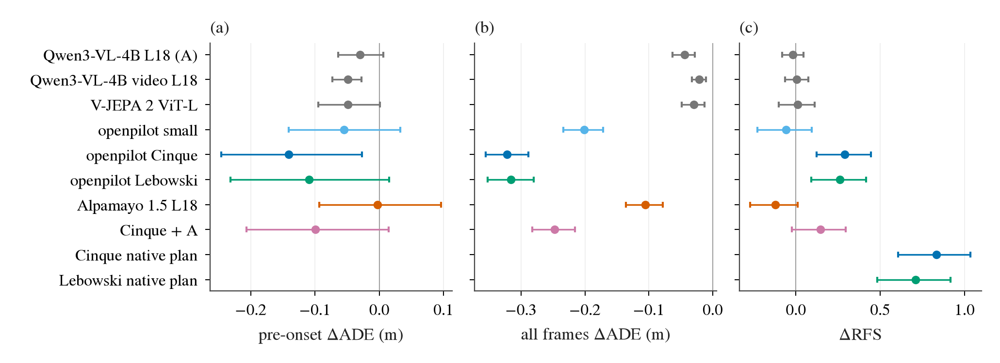

# 驾驶专用 backbone 进 P3 阶梯：openpilot 与 Alpamayo 1.5 的冻结特征 + 我们的 ridge head

状态: done（预登记 2026-09-24 22:40 提交在任何抽取之前；结果 2026-09-25 01:55）
主题: ../../research/prediag-2026-09/README.md（P3 backbone 阶梯）、../../research/frozen-vlm-planner.md
上游: [zero-shot WOD 考试](../2026-09-24-zeroshot-exam/wod-e2e.md)（第 34 条）、[P3 阶梯计划](../2026-09-22-p3-backbone-ladder.md)（第 24 条）

## 问题

第 34 条量到：两个驾驶专用模型用它们**自己的**输出头 zero-shot 就在 WOD-E2E val 的 rater 帧上拿到 RFS（Rater Feedback Score，
预测轨迹落在三条人工打分轨迹 trust region 里的得分，0–10）8.01（openpilot Cinque）和 7.86（Alpamayo 1.5），
高于我们在 WOD train 上训的最好 head（`cls ego` 7.31）。这可能来自两件完全不同的事：
(1) 它们的**表征**里有我们的通用 backbone（Qwen3-VL、V-JEPA 2 等）没有的驾驶信息；
(2) 表征差不多，赢在**输出头**（多模态 / 具体 mode 的解码、闭环数据训练的 plan head）。
本实验把它们当冻结特征抽取器，接进 P3 阶梯**原封不动**的 head 和 judge，直接回答：
在我们的主线（冻结特征 + 薄 head）里，驾驶专用模型的特征是否比阶梯里已有的通用 backbone 更好。

## 协议：和 P3 一字不改

| 项 | 取值（全部沿用第 23/24 条） |
|:--|:--|
| 帧 | 冻结子集 `p2p3_v1`：20 237 帧 / 479 sequence，sha256(frame names) = `6e6c17b8…7cc5`；pre-onset 1510、rater 479、straight 11 975、turn 4461 |
| 切分 | 第 3d 条的 sequence 不相交半/半 val（seed 0），两个方向各训一次、各评另一半 |
| head | `ridge_late`（先拟合 ego ridge，再用 ridge 在 ego + feature 上拟合它的残差）；ego = 运动学状态 + intent one-hot；λ 在 fit 半内 4 折按 sequence 分组 CV 选；特征用 fit 行的统计量标准化 |
| judge | 第 22 条口径（`waymo_ladder.rejudge`）：主判 pre-onset（车还没开始转、运动学看不出意图的帧）上 ADE vs log 的 Δ，限 s_ego（ego-only 读出自己的 5 s 残差）第 1–9 档；straight Δ、DiD（pre-onset Δ 减 straight Δ）并排；子集 rater 帧上的 RFS Δ；第 10 档单独用 RFS 和 ADE vs rater_best；全集 ADE 只作侧栏 |
| 统计 | 按 sequence 重抽的配对 bootstrap；Δ 一律是 arm − `ridge ego`（ADE 负为好，RFS 正为好） |
| 代码 | 新特征写成和已有 P3 set 相同的平铺格式（`features/<set>/index.parquet + <array>.npy`），然后 `waymo_ladder` 的 `p3` 步骤 + `rejudge` 原样跑 |

**同一张表里的所有 arm 取覆盖的交集**（第 13 条）。V-JEPA 2 和 Qwen 原生视频需要严格完整的 4 帧 stride-2 窗口（19 663 帧），
Alpamayo 要 f−3…f，openpilot 要 f−2，所以主表在 **19 663 帧**上跑，arm A、V-JEPA 2 (d)、Qwen 视频 (d″) 在同一批帧上重算，每一行直接可比。

**追加一个读数（预登记，不改原读数）**：两个方向的 eval 半互不相交、合起来正好是整个子集，所以把两个方向的样本外预测拼起来，
每个 rater 帧恰好被评一次（cross-fit）。在这 479 个 rater 帧上报 RFS（frame mean 与榜单口径 cluster mean）、
在全部 pre-onset 帧上报第 1–9 档的 Δ，都用配对 sequence bootstrap。这比单方向的 n 大一倍，是本实验判定用的读数；逐方向的表照旧并排。

## 模型与特征（抽之前写死）

### openpilot：small（30M）、Cinque v3（382M，`f78ed37d`）、Lebowski（877M，0.11.2）

输入与 WOD 考试完全相同：FRONT / FRONT_LEFT / FRONT_RIGHT 纯旋转重投影成 road / wide 两路 calib-frame model frame（最近邻，
JPEG 自带 YCbCr，色度 2×2 均值），每个 WOD 帧喂两次得到 20 Hz，desire 全 0，traffic convention [1, 0]，action_t (0.275, 0.525)；
后端同考试（small TRT 图精度，Cinque / Lebowski TRT fp16）；Lebowski 按考试的偏离 1 用 `context_rate` 在输出相位上逐 0.2 s 走一步，数值等价。

**唯一的差别是时间上下文的给法**。考试对每个目标帧从零状态暖机 10 s；子集是 2 万帧、每个 sequence 平均 42 帧，逐帧暖机要 400 万步。
这里改成**每个 sequence 从它在 index 里的第一帧开始、零状态、一路流到它最后一个子集帧**，途经的子集帧就地取特征，
和车上 openpilot 从接通起一直跑的方式一样。Lebowski 的两个相位（奇偶帧）各起一条流。3 个 val sequence 的 index 里有缺帧，缺口处重置为零状态。
这样每个子集帧的历史是「它在 sequence 里之前的全部帧」：中位 10.9 s，23% 的帧不到 4.8 s（feature 队列没填满，和车上刚接通时一样）。
**不按历史长度剔帧**；历史不足 4.8 s 的帧另报一行敏感性（同样限制下重算 arm A）。

特征 tap（在 ONNX 图里把已有的中间张量**追加为图输出**，不改任何计算；等价性见下）：

| tap | 是什么 | small | Cinque | Lebowski |
|:--|:--|--:|--:|--:|
| **`temporal`（主 tap）** | off-policy temporal summarizer 在当前步的输出 token，也就是 plan head 直接读的那个向量 | `model/p_select` 512 | `select_4` 512 | `select` 512 |
| `vision` | 当前步 vision encoder 的 pooled 输出（进时间模块之前） | `model/view` 1024 | `mean` 512（32 个 vision token 的均值） | `view_40` 3072 |
| `hidden` | 进 feature 队列的那个向量（输出里的 `hidden_state`） | 512 | 16 384（= 32 × 512 vision token 本身，`vision` 的未池化版） | 512 |
| `plan` | 原生 plan 的 MDN 均值（33 个时刻 × 15 维） | 495 | 495 | 495 |

`plan` 这一行问的是「我们的 ridge 在它自己的 plan 上还能校准出多少」，不是表征问题，单独标注。
另外把每个子集帧的原生 plan 按考试的换算转成 WOD 的 20 × 0.25 s 轨迹，**不拟合任何东西**，在同样的 eval 帧上和 `ridge ego` 配对比，作为参照行。

### Alpamayo 1.5（10B，`nvidia/Alpamayo-1.5-10B` @ `7aba829`）

**相机映射（预登记的近似）**：模型要 cross-left / front-wide / cross-right / front-tele 四路 f-theta 视图。box 上的 WOD 帧只有前三路，
所以四路视图用考试同一个纯旋转重投影（`jevdrive.camgeom`，双线性，看不到的像素填黑）**只从 FRONT / FRONT_LEFT / FRONT_RIGHT** 渲染。
前三路相机覆盖 yaw 约 −68° … +68°：front-tele 完全有像，front-wide 的左右边缘和底部带子缺，cross-left / cross-right 大约只有内侧一半有像
（考试里 7 路相机时 cross 视图覆盖 0.75，这里预计降到 0.4 左右，实测补进结果）。
**不为子集去 GCS 抓侧面相机**：f−3…f 覆盖子集要 54 036 条唯一记录，按考试实测每条约 2.3 MB、约 95 条/分钟，是约 124 GB、约 9.5 h 的网络，
超出这一轮的预算。缺口的影响用考试已经抓好的 479 个 rater 帧的 7 路相机包来量（下面「附带量」）。

其余输入同考试：每路 4 帧（f−3…f，10 Hz），egomotion 历史用 `wod_zeroshot.alpamayo_history`，**no-nav prompt**
（考试里 nav 没有作用；intent 已经在 ego 特征里，给文本会重复计入）。

**只做 prefill**：把融合了 ego 历史 token 的完整 prompt 过一遍 `vlm.model`（不接 lm_head、不生成 reasoning、不跑 flow matching expert），
在 forward hook 里按阶梯的约定池化，和 `QwenFeatures` 的定义一致：

| array | 定义 |
|:--|:--|
| `vit_mean` | vision merger 之前的 ViT token 均值（16 张图全部 patch） |
| `vis_mean` | merger 输出（进 LM 的 image token embedding）的均值 |
| `L{9,18,27,36}_mean` | 第 k 个 decoder layer 输出在全部 image token 位置上的均值 |
| `L{9,18,27,36}_last` | 第 k 层在 prompt 最后一个 token 上的 hidden state |

Alpamayo 的 VLM 是在 Cosmos-Reason2-8B（Qwen3-VL-8B 架构，36 层、hidden 4096）上继续训的，所以 **主 tap 定为 `L18_mean`**：
和 arm A（Qwen3-VL-4B 的 `L18_mean`，36 层里的第 18 层、同一种 image-token 均值）同族、同相对深度、同池化，差别是驾驶数据的训练（外加 8B 对 4B、相机和帧数不同）。
其余 tap 是次要读数，按多重比较对待。

### 对照行（同一次 `p3` 运行、同一批 19 663 帧）

`ridge ego`（base）；A Qwen3-VL-4B `L18_mean`；(d) V-JEPA 2 ViT-L `mean`；(d″) Qwen3-VL-4B 原生视频 `L18_last` / `L18_mean`；
上面三个 openpilot 各 4 个 tap；Alpamayo 的 10 个 array；late fusion 两行（预登记）：Cinque `temporal` ‖ A、Alpamayo `L18_mean` ‖ A。

## 判据（跑之前写死）

**第 20 条门槛照旧**：pre-onset Δ（第 1–9 档）≤ −0.05 m 且 CI 不跨零，两个方向都成立 → 「买回了 pre-onset」。

**本实验的主问题「驾驶专用特征是否比通用特征好」**：每个模型只用它的**主 tap**（openpilot 三个 `temporal`、Alpamayo `L18_mean`）做判定，
和两个通用参照逐帧配对：arm A（`L18_mean`）和 (d″) `L18_last`（阶梯里唯一两个方向 CI 都不跨零的通用行）。三个读数，全部是上面的 cross-fit 合并读数：

| 读数 | n | 越小/越大越好 |
|:--|--:|:--|
| (i) pre-onset，第 1–9 档，ADE vs log | 约 1250 | 小 |
| (ii) 全部帧，第 1–9 档，ADE vs log | 约 17 700 | 小 |
| (iii) rater 帧 RFS（frame mean；cluster mean 并列） | 479 | 大 |

| 结果 | 判定 |
|:--|:--|
| 对**两个**通用参照，至少一个读数的配对 Δ CI 整体偏向驾驶特征，且没有任何读数的 CI 整体偏向通用特征 | **更好** |
| 对称地，至少一个读数的 CI 整体偏向通用特征，且没有读数偏向驾驶特征 | **更差** |
| 两个方向都有（一个读数更好、另一个更差） | **不同，不是更好**：写清楚好在哪、差在哪 |
| 全部 CI 跨零 | **测不出差别**，报每个读数的半宽，说明能排除多大的效应 |

读法上的两条限定，跟着数字走：Alpamayo 的输入是**残缺的**（侧面视野缺一半、底部黑带），所以它的「不更好」不能读成「驾驶 VLM 的表征没有用」，
只能读成「在只有前三路相机时没有用」，附带量里的两个数字决定这句话能说多重；openpilot 的输入和考试完全一样，没有这条限定。

次要 tap、fusion 行、原生 plan 参照行只描述，不参与判定。如果某个主 tap 判为「更好」，下一步是 train 训、完整 val 评（P3‴ 的协议）：
openpilot 的流式抽取在 train 上约 1.5 h，可以做；Alpamayo 在 52 万帧上约 20 h，要用户决定。

## 附带量（同样预登记）

1. **侧面相机缺口对 Alpamayo 特征的影响**：在考试已经抓好的 479 个 rater 帧上（7 路相机包在盘上），同一帧分别用 7 路和只用前三路渲染，
   抽同样的特征，报每个 array 的余弦相似度、相对 L2 差，以及它和帧间差异（同一 array 在 479 帧上的标准差）的比。
2. **侧面相机缺口对 Alpamayo 自己开车的影响**：只用前三路的输入，按考试的配置（K = 6、no-nav、seed 42）在 479 个 rater 帧上跑原生轨迹，
   和考试的 7 路结果（RFS 7.879）配对比。约 25–40 min GPU，排在主抽取之后。

## 成本估计与优化（先测后跑）

| 抽取 | 估计 | 依据 | 计划 |
|:--|:--|:--|:--|
| openpilot 三模型，流式 | 102 762 个 WOD 帧 × 2 步；GPU 约 4 + 8 + 6 min（small / Cinque / Lebowski 单 session 实测吞吐），JPEG 解码 + 重投影 30.8 万张 | smoke 的 steps/s，考试的每张 JPEG 约 78 ms·核 | 一次渲染喂三个模型；序列级并行，CPU 进程池渲染与 GPU 重叠，两张卡各一组 session |
| Alpamayo prefill | 约 3086 token / 帧，8B 的 prefill 约 50 TFLOP，估 0.15–0.3 s / 帧 → 19 944 帧 0.8–1.7 h 单卡 | 考试的 n_prompt | 同长度 prompt 直接 batch（无 padding）；JPEG 在 GPU 上解码与重投影；processor 的缩放在线程池里做，和 GPU 重叠；两张卡各一个进程分半 |

任何一个估计超过 3 h 就先在 200 帧上做 profiling、找瓶颈再改。

**等价性检查（全量之前）**：
- openpilot：(a) 加了 tap 输出的 ONNX 与原 ONNX 在同一段 200 步输入上的主输出最大差；(b) 流式与考试方式（每目标 10 s 暖机）在 rater 帧上的原生轨迹差
  （直接和考试存下的逐帧预测比），以及在 100 帧上 `temporal` 特征的余弦相似度——这一项量的是「定义改了多少」，不是 bug 检查。
- Alpamayo：(a) 前三路渲染与考试渲染在有像素的区域上逐像素一致；(b) batched、hook 池化的特征与单样本 `output_hidden_states=True` 参考在 16 帧上的最大相对差。

## 步骤

- [x] 预登记（本文件），提交
- [x] openpilot：tap ONNX、流式抽取器、等价性检查、实测成本、全量
- [x] Alpamayo：前三路渲染器、prefill 特征抽取器、等价性检查、实测成本、全量（两张卡）
- [x] `p3` 一次跑完全部行 + `rejudge`；cross-fit 合并读数、配对比较；原生 plan 参照行；历史 ≥ 4.8 s 的敏感性
- [x] 附带量 1、2
- [x] 预登记的后续：openpilot 主 tap 判「更好」，所以跑了 train 训、完整 val 评（Cinque、Lebowski）
- [x] 结果写回本文件、decisions 第 40 条、图

## 结果

run（box）：阶梯 `$DATA_DIR/runs/drive_backbones/ladder-ladder_hist/20260925-004234/`（`p3drive` 主表 + `p3drive_hist` 敏感性），
train 训 `$DATA_DIR/runs/drive_backbones/ladder_train/20260925-014914/`；特征在 `$DATA_DIR/processed/waymo_e2e/features/{op_small,op_cinque,op_lebowski}_p3`、
`alpamayo15_p3`、`op_{cinque,lebowski}_p3_trainval`。小结果文件在 [research/results/driving-backbones/](../../research/results/driving-backbones/)。
主表 19 663 帧（V-JEPA 窗口的交集，和预登记一致），cross-fit 合并后 pre-onset 第 1–9 档 1265 帧、全部第 1–9 档 17 695 帧、rater 478 帧（1 帧没有完整 V-JEPA 窗口）。

### 主表：cross-fit 合并读数，Δ = arm − `ridge ego`

ADE 单位 m，负为好；RFS 为 frame mean，正为好；方括号是按 sequence 重抽的 95% CI。

| arm | (i) pre-onset 第 1–9 档 | (ii) 全部帧第 1–9 档 | (iii) RFS（478 rater 帧） | 侧栏：直行 |
|:--|:--|:--|:--|--:|
| A Qwen3-VL-4B `L18_mean` | −0.030 [−0.064, +0.006] | −0.044 [−0.063, −0.028] | −0.020 [−0.083, +0.045] | −0.070 |
| (d″) Qwen 原生视频 `L18_last` | −0.049 [−0.073, −0.028] | −0.021 [−0.032, −0.011] | +0.005 [−0.064, +0.075] | −0.028 |
| (d) V-JEPA 2 ViT-L | −0.049 [−0.095, +0.001] | −0.030 [−0.048, −0.013] | +0.012 [−0.102, +0.113] | −0.051 |
| openpilot small `temporal` | −0.055 [−0.141, +0.033] | −0.201 [−0.234, −0.172] | −0.060 [−0.229, +0.093] | −0.280 |
| **openpilot Cinque `temporal`** | **−0.141 [−0.247, −0.027]** | **−0.322 [−0.356, −0.289]** | **+0.288 [+0.122, +0.446]** | −0.380 |
| **openpilot Lebowski `temporal`** | −0.109 [−0.232, +0.015] | **−0.316 [−0.353, −0.281]** | **+0.260 [+0.092, +0.415]** | −0.381 |
| Alpamayo 1.5 `L18_mean` | −0.003 [−0.093, +0.096] | −0.106 [−0.136, −0.078] | −0.123 [−0.271, +0.009] | −0.155 |
| 次要：Alpamayo `L27_last` | −0.163 [−0.254, −0.078] | −0.275 [−0.314, −0.238] | −0.076 [−0.246, +0.088] | −0.357 |
| 次要：Alpamayo `L36_last` | −0.096 [−0.175, −0.018] | −0.222 [−0.256, −0.189] | −0.078 [−0.245, +0.076] | −0.296 |
| 次要：Cinque `plan`（原生 plan 当特征） | −0.080 [−0.206, +0.047] | −0.295 [−0.328, −0.259] | +0.278 [+0.097, +0.452] | −0.360 |
| fusion Cinque `temporal` ‖ A | −0.100 [−0.207, +0.015] | −0.248 [−0.282, −0.216] | +0.144 [−0.024, +0.296] | −0.296 |
| 参照：Cinque 原生 plan（不拟合） | +0.612 | +0.412 | **+0.833 [+0.607, +1.035]** | +0.618 |
| 参照：Lebowski 原生 plan（不拟合） | +0.892 | +0.814 | +0.708 [+0.482, +0.916] | +1.170 |

全部 28 个 arm 的表（含 vision / hidden tap、Alpamayo 全部 10 个 array）在 `crossfit_vs_ego_p3drive.csv`。

图：三个预登记读数上各 arm 相对 `ridge ego` 的 cross-fit Δ 和 95% sequence bootstrap CI；灰色是阶梯里已有的通用 backbone，彩色是驾驶模型的主 tap。
看两件事：(b) 里 openpilot 的三个点和 Alpamayo 离开灰色一整个量级（−0.1 到 −0.32 m 对 −0.02 到 −0.04 m）；(c) 里只有 openpilot 两个大模型的 ridge head 在 RFS 上离开 0，
但仍然明显低于它们自己的原生 plan（最下两行）。

### 判定（预登记规则，主 tap 对两个通用参照逐帧配对）

| 模型（主 tap） | vs A：(i) / (ii) / (iii) | vs (d″)：(i) / (ii) / (iii) | 判定 |
|:--|:--|:--|:--|
| openpilot Cinque `temporal` | −0.111 [−0.229, +0.005] / **−0.278** [−0.307, −0.247] / **+0.308** [+0.135, +0.465] | −0.092 [−0.200, +0.020] / **−0.301** / **+0.283** [+0.124, +0.440] | **更好** |
| openpilot Lebowski `temporal` | −0.079 / **−0.272** / **+0.280** [+0.111, +0.448] | −0.060 / **−0.295** / **+0.255** [+0.100, +0.408] | **更好** |
| openpilot small `temporal` | −0.025 / **−0.157** / −0.040 | −0.006 / **−0.180** / −0.065 | **更好**（只靠 (ii)） |
| Alpamayo 1.5 `L18_mean` | +0.027 / **−0.062** / −0.104 [−0.252, +0.028] | +0.047 / **−0.084** / **−0.128** [−0.253, −0.012] | **不同，不是更好**：全部帧上更好，RFS 上比 (d″) 差 |

第 20 条的两方向门槛（pre-onset Δ ≤ −0.05 且 CI 不跨零，逐方向）：openpilot 三个 `temporal` 在方向 1 都过（−0.150 / −0.228 / −0.164），
方向 0 都不过（−0.05 附近、CI 半宽 0.12–0.16）。**全阶梯第一个两个方向都过门槛的是 Alpamayo `L27_last`**：−0.153 [−0.287, −0.024] / −0.172 [−0.299, −0.048]。
它是 10 个次要 array 之一，按预登记只描述、不判定，多重比较下要复现才能当真。

**历史 ≥ 4.8 s 的敏感性**（14 063 帧，arm A 同样限制重算）：Cinque `temporal` 的 pre-onset Δ 从 −0.141 变成 **−0.196 [−0.331, −0.073]**，
Lebowski −0.215 [−0.358, −0.090]，small −0.143 [−0.241, −0.047]，A −0.005、(d″) −0.024；Cinque 对 A 和 (d″) 在 (i) 上的配对差也变成 CI 不跨零（−0.191 / −0.173）。
feature 队列填满之后，openpilot 在 pre-onset 上的优势变大、变得测得出来；Alpamayo 不变（−0.010）。

**DiD 是正的**（openpilot 三个 +0.16 到 +0.30，Alpamayo `L18_mean` +0.13 / +0.18）：驾驶特征的增量主要在直行帧（纵向：前车、停车、起步），
pre-onset 上的增量是真的但比直行上小。第 10 档对 rater_best 的 ADE：Cinque −1.20 / −1.16 m、Lebowski −1.15 / −0.99 m（A −0.05 / −0.10，(d″) −0.19 / −0.22），
也就是多模态的顶档里它们朝 rater 偏好的那一支挪得最多，和 RFS 的增益一致。

### 预登记的后续：train 训、完整 val 评（P3 train-split 协议）

415 663 帧训、106 360 帧评，单方向，pre-onset 第 1–9 档 n = 1291，RFS n = 479（全部 val rater 帧）。

| arm | pre-onset Δ（第 1–9 档） | 全部帧第 1–9 档 | RFS Δ | RFS（cluster mean） | 第 10 档 vs rater_best |
|:--|:--|:--|:--|--:|--:|
| A Qwen3-VL-4B `L18_mean` | −0.005 [−0.055, +0.047] | −0.041 | −0.104 [−0.194, −0.015] | 6.942 | −0.133 |
| **openpilot Cinque `temporal`** | **−0.294 [−0.424, −0.168]** | **−0.318** | **+0.403 [+0.232, +0.582]** | 7.449 | −1.554 |
| **openpilot Lebowski `temporal`** | **−0.318 [−0.449, −0.197]** | **−0.312** | **+0.417 [+0.243, +0.594]** | **7.522** | −1.326 |
| `ridge ego`（base） | 0 | 0 | 0 | 7.065 | 0 |

train 训之后 openpilot 的 pre-onset 增益**变大**（半 val −0.14 → −0.29），CI 离 −0.05 门槛很远，是这个项目第一次在 pre-onset 上测到远超门槛的表征效应；
V-JEPA 2 在同一协议下是 −0.030 [−0.104, +0.041]（第 24 条 d‴）。RFS 7.45–7.52 超过我们此前最好的 `cls ego` 7.31（第 34 条，同 479 帧），
但仍低于 Cinque 原生 plan 的 8.005：**冻结特征 + ridge 拿到了原生 plan 相对 `ridge ego` 增益（+0.94）的约一半**。

### 附带量

1. **侧面相机缺口对 Alpamayo 特征**（479 rater 帧，7 路 vs 只用前三路）：image-token 均值类 array 余弦中位数 ≥ 0.9999，但差值约等于帧间差异的 0.5–0.8 倍
   （均值池化的帧间差异本身就小）；last-token 类余弦 0.989–0.9999，差值是帧间差异的 0.15–0.27 倍。`alp_rater7.json`。
2. **侧面相机缺口对 Alpamayo 自己开车**（K = 6、no-nav、seed 42，同考试）：RFS cluster mean 7.879（7 路）→ **7.860（前三路）**，
   配对 frame-mean Δ −0.019 [−0.060, +0.024]。**缺侧面视野对它的驾驶几乎没有影响**，所以 Alpamayo 特征在 ridge 下不占优不能归到输入残缺上。

### 成本（优化前 / 后）与等价性

| 项 | 优化前 | 优化后 | 瓶颈与做法 |
|:--|:--|:--|:--|
| openpilot 三模型，子集 | 考试协议逐目标暖机 10 s：20 237 × 约 101 帧 ≈ 204 万帧步，按实测 11 ms/帧·进程约 3.1 h（两进程） | 按 sequence 流式：102 623 帧，两卡各一进程 **24 min** | 暖机重复计算；流式每帧只走一次。GPU 是 batch-1 的 launch 开销，受同卡其它进程时间片影响（9 → 25 ms/帧） |
| openpilot，train+val（后续） | — | 522 023 帧，Cinque + Lebowski，约 70 min | 首轮 6 个进程里 4 个被 OOM 杀掉：render worker 在 TensorRT session 之后 fork，每个继承约 27 GB；改成先 fork 再建 session |
| Alpamayo prefill，一个 batch 8 | 原生 per-image SDPA 视觉注意力：视觉 180–250 ms/帧 | 同尺寸图批量 SDPA：视觉 98 ms/帧，整次 forward 296 ms/帧（空闲时实测） | 原实现每个 block 对 128 张图逐张调 SDPA、每次 host 同步 |
| Alpamayo 端到端 | 两进程（每卡一个）约 0.6 s/帧·进程，全量估 1.7 h | 四进程（每卡两个）0.87–1.0 s/帧·进程，合计约 0.24 s/帧，**19 941 帧 87 min** | 真正的瓶颈是 CPU 上的 processor（16 张 1080p 缩放，约 0.3 s/目标，GIL），多进程比多线程好；渲染改成只采样有像素的位置 |

等价性（全量之前测）：
- openpilot：未改的 ONNX 在我们的管线里和考试逐位一致（plan 最大差 0）；加 tap 输出的 engine 与原 engine 的 plan 最大差 small 0.015、Cinque 0.125、Lebowski 0.25 m（10 s、100 m 量级的远端点，与 CUDA EP 对 TRT 的差同量级）。
  流式与考试协议：662 个共同帧上原生轨迹的 ADE 中位数 small 0.001、Cinque 0.011、Lebowski 0.009 m（最大 0.12 m）；40 帧上四个 tap 的余弦 ≥ 0.99999。**流式与 10 s 暖机在数值上等价**，更长的历史不改变输出。
- Alpamayo：缓存采样网格 + 稀疏采样的渲染与考试渲染器**逐像素相同**（8 帧，max |diff| = 0）；hook 池化与 `output_hidden_states` 逐位相同；
  批量视觉注意力对原生 per-image 路径的相对 L2 差 ≤ 1.4%（last-token），batch 8 对单样本 ≤ 1.4%，都是 bf16 kernel 差异的量级。

### 偏离记录

1. rater 帧读数 n = 478，不是 479：主表按预登记取 V-JEPA 窗口的交集，有一个 rater 帧没有完整 4 帧 stride-2 窗口。train 训那一行是 479。
2. train 训的后续只跑了 Cinque 和 Lebowski（预登记写的是「openpilot」），small 在子集上只在 (ii) 上更好，省掉以节省共享 box 的时间。
3. Alpamayo 从每卡一个进程改成每卡两个进程（瓶颈在 CPU 预处理），已完成的 2 个 chunk 删掉重跑；不影响特征定义。
4. 等价性检查的样本比预登记小：Alpamayo 用 8 帧（写的是 16），openpilot `temporal` 余弦用 40 帧（写的是 100）；前三路 cross 视图的实测覆盖率没有量，附带量 2 直接量了它对驾驶的影响。
5. 预登记表里「更好」的第一行要求对两个参照都有读数偏向驾驶特征；openpilot small 只满足 (ii)，按字面仍判「更好」，这里单独标出。

### 结论

**openpilot 的 temporal 特征比阶梯里所有通用 backbone 都好，Alpamayo 的 VLM 特征不是。**
在同一个子集、同一个 ridge head、同一个 judge 下，Cinque / Lebowski 的 512 维 `temporal` token 把全部帧 ADE 比 `ridge ego` 压低 0.32 m（通用 backbone 0.02–0.04 m），
RFS 提高 0.26–0.29（通用 backbone 都在 0 附近），train 训后 pre-onset 也降 0.29–0.32 m、RFS +0.40–0.42。
Alpamayo 1.5 的中层 image-token 特征（主 tap）只在全部帧 ADE 上比通用 backbone 好 0.06–0.08 m，RFS 上反而更差；它更深的 last-token（`L27_last`、`L36_last`）明显更好，
`L27_last` 是全阶梯第一个两方向都过门槛的 arm，但它是次要 tap。
限定：openpilot 的增益大头在直行帧（DiD 为正），它是一个在自己的视频上学了纵向动力学的时序模型，所以这一行说的是「驾驶视频上训出来的时序表征」而不单是「驾驶领域」；
它的原生 plan 仍比 ridge 读出高 0.5 RFS，读出层还有空间。

## 第 40 条的后续 (iii) 与 (i)：预登记（2026-09-25，在任何分数之前提交）

状态: 预登记（本节提交时两项都还没有任何分数；nuScenes 的 openpilot 特征还没抽）
资源: GPU 2 上 ≤ 25 GB（与 Alpamayo 闭环考试共卡，吞吐掉 > 10% 就自我限速），≤ 6 核（taskset + nice 10，DataLoader / 解码 worker ≤ 4），slot `decision40-*`。
不做：Alpamayo `L27_last` 的 train 训复现（约 20 h，要用户决定）。

### (iii) openpilot `temporal` 接进分类头：RFS 能不能接近原生 plan 的 8.0

问题：第 40 条里冻结 `temporal` + ridge 的 RFS 是 7.45（Cinque）/ 7.52（Lebowski），原生 plan 是 8.00。
差的 0.5 是**读出**的问题（ridge 只有一个 mode，不会在多模态处押 rater 偏好的一支），还是**特征**里就没有？
分类头（fixed vocabulary 上的 softmax，第 8/10 条）在 P0 里正好是「输 ADE、赢 RFS」的那一族：`cls ego` 7.31 对 `ridge ego` 7.06。

| 项 | 取值（全部沿用，不新调任何东西） |
|:--|:--|
| 行与切分 | 第 40 条 train 训后续的同一批行：train 415 663 帧训、val 106 360 帧评（`ladder_train`，单方向），s_ego 用 P0 的 |
| 特征 | `op_cinque_p3_trainval` / `op_lebowski_p3_trainval` 的 `temporal`（512 维，已抽好） |
| head | `waymo_heads` 原样：K = 1024，train 全部 logged future 上 k-means（seed 0）；线性 softmax，L-BFGS，λ 在 fit 行的 inner split 上选；vision arm 以 `cls ego` 的 logits 为冻结 offset（fit 行用 4 折 out-of-fold offset）；top-1 anchor 作为该 arm 的轨迹 |
| arm | `ridge ego`（base）、`ridge_late` 同 tap（重算，应复现 7.45 / 7.52）、`cls ego K1024`、`cls_late` Cinque / Lebowski `temporal`；参照行：两个模型的原生 plan（不拟合） |
| judge | 主读数：479 个 val rater 帧上的 RFS（frame mean 做配对，cluster mean 并列）；侧栏：第 22 条的 ADE 读数（pre-onset 第 1–9 档、全部帧第 1–9 档、第 10 档对 rater_best） |
| 统计 | 按 sequence 重抽的配对 bootstrap；缺口比例 G = (cls_late − ridge_late) / (native − ridge_late)，分子分母在同一次重抽里算（10 000 次） |

判据（每个模型分别判）：

| 结果 | 判定 |
|:--|:--|
| cls_late − native 的 CI 上端 ≥ 0 | **够到原生**：缺口在读出，分类头就能补上 |
| 否则，cls_late − ridge_late 的 CI 整体 > 0 | **补了一部分**：报 G 和它的 CI |
| 否则 | **没补上**：单 mode 读出不是缺口的原因（至少线性分类头不是解） |

并排报 cls_late − `cls ego`（特征在分类头家族里的增量；P0 里 Qwen 单帧特征在这一族几乎为 0）。
**预期（跑之前写下）**：若 head 的效应与特征大致可加，cls_late 约 7.7–7.8，落第二行；ADE 上 cls 族照例比 ridge 差（P3e：+0.2 到 +0.4 m）。

次要、只描述：truncated diffusion head（`waymo_heads.diff_arm` 原配方，M = 20）在同样的行上，`diff ego` 与两个 `diff` `temporal`。
P3e 里这一族的 RFS 最高（+0.36 到 +0.49），但在 41.5 万行上训 60 epoch 的代价未知：先在 cls 跑完后量一个 epoch 的时间，估计 ≤ 1.5 h 且不拖慢 Alpamayo 才跑。

### (i) 在 nuScenes 上独立复现「冻结 openpilot `temporal` + ridge」

选 nuScenes 而不是 NAVSIM：nuScenes 的 CAM_FRONT 有约 12 Hz 的 sweeps，第 39 条的 openpilot 适配器能按原生节奏逐场景连续地跑（和车上一样），而 NAVSIM 的输入只有 2 Hz（第 37 条），
openpilot 要 sample-and-hold，时序特征本身就被削了；另外 nuScenes 已经有 Qwen3-VL-4B 在全部 34 149 个 trainval keyframe 上的特征（`qwen_w800`，800 px，Stage A 的 arm A 配方），通用参照不用重抽。

| 项 | 取值 |
|:--|:--|
| 数据与切分 | nuScenes v1.0-trainval，官方切分：700 个 train scene 训，150 个 val scene 评（单方向，没有任何东西在 val 上拟合） |
| 行 | 每个 keyframe，要求它之前本 scene 有 ≥ 4.5 s（ego 输入的最老一步的加速度要回溯到 t0 − 4.25 s），之后 ego pose 覆盖 3.0 s |
| 目标 | t0 后 0.25 … 3.0 s 的后轴位置（12 × 2，t0 的 ego 系），由 20 Hz 的 ego pose 线性插值；ADE 为 12 个点的均值 |
| ego 输入 | 照 Waymo 的格式重建：t0 − 3.75 … t0 每 0.25 s 一步共 16 步 × (位置、速度、加速度)，速度和加速度都是**后向差分**（输入里没有任何未来）；加 VAD command one-hot（3 s 横向偏移 ≥ 2 m 左、≤ −2 m 右，否则直行——文献惯例，本身是泄露，替代 WOD 的 routing intent）。主表带 command；不带 command 的整套重拟合作为敏感性 |
| 特征 | openpilot Cinque / Lebowski 的 `temporal`（主 tap，与 WOD 同一 ONNX tap、同一 TRT engine），按第 39 条考试的协议逐 scene 从第一个 keyframe 起连续跑 20 Hz、只用 CAM_FRONT、desire none，在每个 keyframe 那一步取；次要：`vision` tap、原生 plan（换到后轴、不拟合）、fusion Cinque `temporal` ‖ A |
| 通用参照 | A = Qwen3-VL-4B `L18_mean`，800 px，CAM_FRONT 单帧（`qwen_w800`）。和 openpilot 一样只看前视一路；WOD 上的 A 是三路，这里不是 |
| head | `ridge ego`，再 `ridge_late`（在 ego 残差上的 ridge），λ 在 train 上 4 折按 scene 分组 CV 选，特征用 train 的统计量标准化——和 P3 一字不差 |
| judge | 第 22 条口径：s_ego（ego ridge 的样本外残差，`waymo_l0.ego_surprise`）在 val 上分十档；(i) pre-onset 第 1–9 档 ADE Δ、(ii) 全部帧第 1–9 档 ADE Δ；侧栏 straight 第 1–9 档、全部档、第 10 档、FDE@3 s。pre-onset / straight 用 `waymo.subsets` 的同一组阈值（当前 yaw rate < 1°/s，3 s chord bearing > 5°，位移守卫 1 m / 3 m），horizon 正好是 3 s。**没有 RFS**（nuScenes 无 rater 标注） |
| 统计 | 按 scene 重抽的配对 bootstrap（150 个 cluster），Δ = arm − `ridge ego` |

判据（第 40 条的规则，限在两个 ADE 读数、一个通用参照上）：

| 读数 | 结果 | 判定 |
|:--|:--|:--|
| 主 tap vs A，(i)(ii) | 至少一个读数的配对 CI 整体偏向 `temporal`，且没有读数偏向 A | **复现「更好」** |
| | 对称地偏向 A | **反向** |
| | 两边都有 / 全跨零 | **混合 / 测不出**，报半宽 |
| 主 tap vs `ridge ego`，(ii) | CI 整体 < 0 | 冻结 `temporal` 在 ego 先验之上有增量（第 40 条第 1 点的一半） |

**预期（跑之前写下）**：方向复现，量级比 WOD 小（3 s horizon 对 5 s、城区低速），(ii) 上 −0.03 到 −0.10 m；pre-onset 在 val 上预计只有 100–300 帧，(i) 大概率跨零。
nuScenes 的 command 泄露了 3 s 横向位移，所以 pre-onset 上 ego 已经「知道往哪转」，(i) 的空间比 WOD 小，这是读法的限定，不是改判据的理由。

### 算力估计

| 任务 | 估计 | 依据 |
|:--|:--|:--|
| trainval 流式索引（CAM_FRONT + pose） | < 10 min CPU | 考试的 val 索引 |
| openpilot 两个模型 × 850 scene | 约 55 min GPU（纯）；与 Alpamayo 共卡时 batch-1 步长可能翻倍，估 1–2 h；解码 4 进程 | 考试：150 scene × 2 desire，Cinque 7.9 min、Lebowski 10.8 min GPU |
| nuScenes ridge 阶梯 | < 5 min | 约 2 万行 |
| (iii) 分类头，41.5 万行 × 512 维 | 每次 L-BFGS 迭代约 8 TFLOP，600 次上限 → 纯 GPU 约 15–30 min（含 ego 头与 4 折 offset） | P0 在 CPU 上 3.7 h |

## 第 40 条后续的结果

### (iii) 分类头：Lebowski 够到了它自己的原生 plan，Cinque 没有（2026-09-25 11:16）

run（box）：`$DATA_DIR/runs/drive_backbones/heads_train/20260925-110819/`，小表 [research/results/driving-backbones/heads-train/](../../research/results/driving-backbones/heads-train/)。
415 663 帧训、106 360 帧评，479 个 val rater 帧。管线复现检查：`ridge ego` 7.065、两个 `ridge_late temporal` 7.449 / 7.522、Cinque 原生 8.005，都与第 40 条逐位一致；
`cls ego` 7.262（P0 是 7.311，同一配方、词表的 k-means 行集略不同，差在 CI 半宽的四分之一以内）。

| arm | RFS cluster mean | RFS frame mean | Δ vs `ridge ego`（frame）[CI] | 第 10 档 RFS Δ | pre-onset 第 1–9 档 ADE Δ [CI] |
|:--|--:|--:|:--|--:|:--|
| `ridge ego` | 7.065 | 7.055 | 0 | 0 | 0 |
| `cls ego K1024` | 7.262 | 7.277 | +0.222 [+0.039, +0.406] | +0.70 | +0.340 [+0.110, +0.683] |
| `ridge_late` Cinque `temporal` | 7.449 | 7.458 | +0.403 [+0.232, +0.582] | +0.59 | **−0.294** [−0.424, −0.168] |
| `ridge_late` Lebowski `temporal` | 7.522 | 7.472 | +0.417 [+0.243, +0.594] | +0.51 | **−0.318** [−0.449, −0.197] |
| **`cls_late` Cinque `temporal`** | 7.637 | 7.653 | **+0.598** [+0.403, +0.809] | **+1.26** | +0.207 [−0.057, +0.527] |
| **`cls_late` Lebowski `temporal`** | **7.734** | 7.703 | **+0.648** [+0.443, +0.853] | **+1.39** | +0.182 [−0.085, +0.549] |
| 参照：Cinque 原生 plan（不拟合） | 8.005 | 7.941 | +0.886 | | |
| 参照：Lebowski 原生 plan（不拟合） | 7.886 | 7.805 | +0.750 | | |

预登记的配对比较（frame mean，sequence bootstrap）和缺口比例 G：

| 模型 | cls_late − `cls ego` | cls_late − ridge_late | cls_late − 原生 | G = 补上的缺口份额 [CI] | 判定 |
|:--|:--|:--|:--|:--|:--|
| Cinque | **+0.375** [+0.214, +0.544] | +0.195 [−0.015, +0.398] | **−0.289** [−0.472, −0.100] | 0.40 [−0.02, 0.75] | **没补上**（按字面：对 ridge_late 的 CI 擦过 0） |
| Lebowski | **+0.426** [+0.262, +0.584] | **+0.232** [+0.039, +0.415] | −0.101 [−0.292, +0.094] | 0.70 [0.17, 1.42] | **够到原生** |

读法：
- **分类头在 openpilot 特征上确实多拿了 RFS**：两个 `cls_late` 比同 tap 的 `ridge_late` 高 0.19–0.23，比 `cls ego` 高 0.38–0.43。后一个数是这里最干净的对照：
  P0 里 Qwen 单帧特征进了分类头几乎不加分（`cls_late` 7.30 对 `cls ego` 7.31），openpilot `temporal` 加了 0.4，也就是**特征的增量在分类头家族里同样存在**，
  而且和 head 的增量大致可加（cls ego − ridge ego +0.22，ridge_late − ridge ego +0.40，cls_late − ridge ego +0.60–0.65）。
- **增益集中在第 10 档**：`cls_late` 的第 10 档 RFS 比 `ridge ego` 高 1.26–1.39，ridge_late 只有 0.51–0.59。多模态的顶档里，分类头押中 rater 偏好那一支的能力是 ridge 没有的。
- **够不够到 8.0 取决于拿谁当「原生」**：Lebowski 的原生 plan 自己只有 7.89（cluster），`cls_late` 7.73 与它的差 −0.10 [−0.29, +0.09] 跨零，按预登记判「够到」；
  Cinque 的原生是 8.00，`cls_late` 7.64 仍差 0.29（CI 不跨零），G 只有 0.40，对 ridge_late 的提升 CI 擦过 0，按字面判「没补上」。
  两者合起来的读法：**线性分类头把「冻结特征 → 原生 plan」的缺口补上了一半左右（G 0.4–0.7），剩下 0.1–0.3 RFS 不在单 mode 读出上**；
  我们这族 head 的最好成绩是 7.73（Lebowski `cls_late`），比全项目此前最好的 train 训 head（`ridge_late` Lebowski 7.52）高 0.21，比 Cinque 原生低 0.27。
- 代价照例在 ADE：两个 `cls_late` 的 pre-onset Δ 为正（+0.18 / +0.21，CI 跨零），比 ridge_late 差 0.5 m。第 10 条的「分类输 ADE、赢 trust region」在这里原样成立。
- `cls ego` 的 λ 选在网格下端（1e-7，warning），与 P0 同一现象；`cls_late` 的 λ 是 1e-3，在网格内部。

**次要的 diffusion head 没跑**（按预登记自己的条件）：P3e 在 13.7 万行上每个 diffusion arm 约 15 min，41.5 万行上三个 arm 估约 2.3 h 满载 GPU，超过 1.5 h 的线；
而且实测表明 GPU 2 上任何满载的 kernel 流都会直接拖慢 Alpamayo（见下「共卡的代价」）。它是「剩下的 0.1–0.3 RFS 是否在多模态解码上」这个问题的下一步，等 GPU 2 空出来再跑。

### 共卡的代价（Alpamayo 闭环考试，GPU 2）

Alpamayo policy server 每 200 次调用打一行累计计数（调用数、GPU-lock busy 比例、server 运行秒数），这是量它吞吐的唯一读数。

| 我们在 GPU 2 上跑的东西 | 对照 | 每 200 次调用的秒数 | 读法 |
|:--|:--|--:|:--|
| 分类头 L-BFGS，满载约 7 min（11:09–11:16，smoke2 末尾） | 前 3 个窗口 220–232 s | 418 | 单次调用的 busy 时间约 1.1 s → 约 2.0 s（按累计 busy 比例估，±0.25 s）；smoke2 末尾在收尾，调用数下降有一部分是它自己的，但单次调用变慢只能是争卡 |
| openpilot batch-1 抽取，满速（11:41–11:48） | 暂停抽取（SIGSTOP）的下 3 个窗口 | 232 对 184 | 当时读成慢 26%，但两段时间不同，见下一行 |
| openpilot 抽取，35% duty cycle（每步后 sleep） | 同一小时内先暂停 3 个窗口、再恢复 3 个窗口 | 236 对 239 | **测不出差别**；Alpamayo 自己的吞吐随路线组合在 184–250 s 之间漂，比我们的影响大 |

所以 (i) 的抽取以 35% duty cycle 跑完（`--duty 0.35`，约 24 s / scene，比满速慢 3 倍）；满载训练（diffusion head）不在 GPU 2 上和 Alpamayo 同时跑。
第二行的 26% 不能当真：暂停的那 12 分钟恰好是 Alpamayo 的快段，同一方法在 30 分钟后重做，暂停与运行几乎相同。
