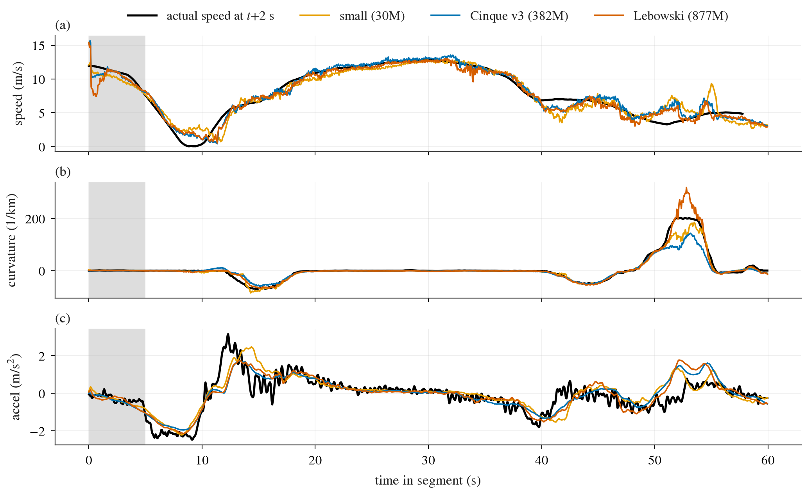
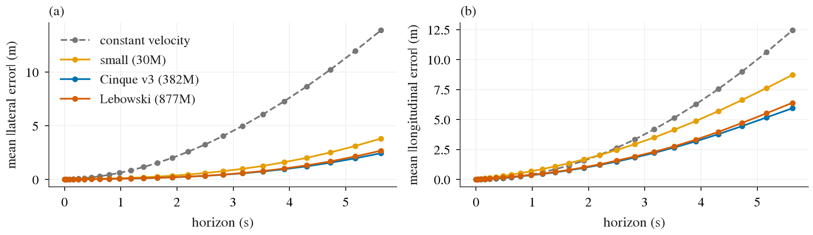
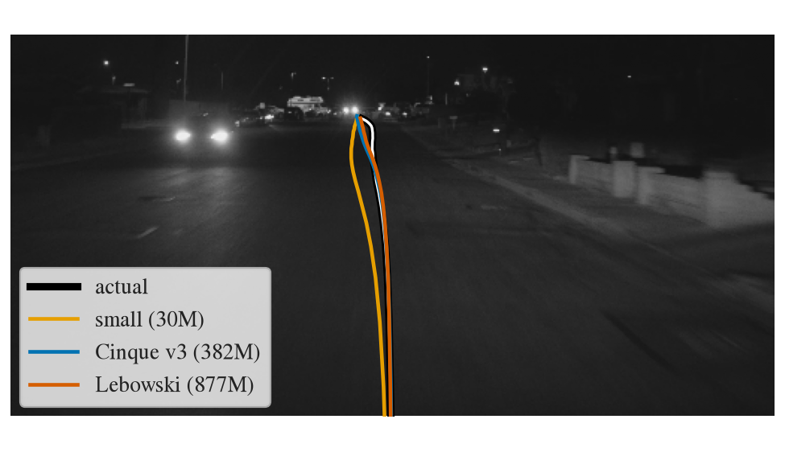

# 2026-09-24 openpilot 最新驾驶模型 smoke run

目标：把 comma.ai openpilot 能下载到的三个驾驶模型在 GPU box 上跑起来，把推理配置推到能到的最快，确认优化后的路径和朴素参考数值等价，再在真实 comma 视频上检查输出是否合理。这是一次 characterization，不是打榜。模型背景（接口、参数量、来源）见 [openpilot_latest_model.md](../../research/lit/research_notes/开源驾驶模型与OpenPilot打榜现状/openpilot_latest_model.md) 和 [openpilot-and-open-driving-models.md](../../research/openpilot-and-open-driving-models.md) 的"追问"一节。

## 结论先行

- 三个模型都能在 onnxruntime 上跑，输出合理：small（30M，车端模型）、Cinque Terre v3（382M，master 当前的 big model）、Lebowski（877M，0.11.2 出货的 big model）。
- 最快的可用配置是 onnxruntime 的 TensorRT EP（execution provider，onnxruntime 把子图交给 TensorRT 编译执行的后端）。batch 1 每步 p50：small 0.99 ms、Cinque 2.26 ms、Lebowski 3.33 ms，p99 都不超过 3.4 ms，离 20 Hz 的 50 ms 预算差一个数量级以上。
- 数值上，TensorRT 的结果和 onnxruntime CPU 参考在真实输入上的差别，与 CUDA EP 本身和 CPU 的差别同一量级（desired curvature 最大差 ≤ 8.4e-6 1/m）。**唯一的例外**是 small 开 TensorRT fp16 flag：随机输入下 plan 位置最大差到 203 m，所以 small 用不开 fp16 flag 的 TensorRT，速度不变。
- 真实视频（comma1M 4 段、每段 1 分钟、n = 4400 帧）上，三个模型的 plan 都明显好于 constant-velocity baseline；2 s 横向误差 small 0.38 m、Cinque 0.21 m、Lebowski 0.21 m（baseline 2.18 m），desired curvature 与车实际曲率的相关 r ≥ 0.99。两个 big model 之间看不出差别，都好于 small。
- 没做成的：onnxruntime 的 CUDA graph 在这张卡上对三个模型都直接触发 CUDA illegal memory access；ONNX 图的 batch 维写死为 1，改不动，离线吞吐只能靠多 session 并发，2 路之后不再增长。

## 环境与版本

env 在 box 的 `~/data/envs/openpilot`（uv，Python 3.12.14，走阿里云 pip 镜像），不含 torch。

| 组件 | 版本 |
|---|---|
| onnxruntime-gpu | 1.30.0（CUDA 13 build，带 TensorRT EP 与 CUDA EP） |
| TensorRT | 10.16.1.11（`tensorrt-cu13`；11.x 的 `libnvinfer.so.11` 与 ORT 的 TRT EP 不兼容，必须装 10.x） |
| CUDA runtime / cuDNN / cuBLAS（wheel） | 13.4.92 / 9.26.0.51 / 13.8.0.4 |
| driver | 595.71.05，RTX PRO 6000 Blackwell（sm_120） |
| onnx / numpy / PyAV / scipy | 1.23.0 / 2.5.3 / 18.1.0 / 1.18.1 |

两个坑：ORT 的 TRT EP 按名字 dlopen `libnvinfer.so.10`，不会去 `tensorrt_libs` wheel 目录找，所以 `jevdrive/openpilot/model.py` 启动时用 ctypes 预加载；Cinque 的 ONNX 里有一个 `org.tinygrad::Contiguous` 自定义 op（tinygrad 的内存布局 hint，语义上是 no-op），换成 `Identity` 后另存为 `cinque.ort.onnx` 即可加载。模型文件都在 `~/data/models/openpilot/`（sha256 校验过），TensorRT engine cache 在 `~/data/models/openpilot/trt_cache/`。Cinque 这一份取的是 HF `commaai/openpilot_driving_models` 里 2026-09-18 较晚提交的 checkpoint `f78ed37d`，它是 Cinque v3 属于推断（时间与 PR #38932 吻合）。

## 代码

都在 `jevdrive/openpilot/`，可以直接拿来做后面的 zero-shot 评测：

- `frames.py`：从 openpilot master 移植的输入管线。用 segment 的 calibration（device_from_calib 的 roll/pitch/yaw）和相机内参算 warp 矩阵（`get_warp_matrix`），narrow 相机 warp 到 focal 910 的 512×256 model frame，wide 相机 warp 到 focal 455 的 model frame；warp 是 tinygrad `compile_warp.py` 的最近邻 + 坐标截断，Y 平面拆成 4 个 2×2 相位平面再加 U、V，打包成 6×128×256。HEVC 直接解成 YUV420，不经过 RGB。
- `model.py`：两种接口的 runner。small / Cinque 的时间队列在 ONNX 里（`state_*` 进、`next_state_*` 出），我们把状态留在 GPU 上两套 buffer 来回切，不回 host；Lebowski 是队列挪进 ONNX 之前的接口，按 openpilot 516ec1e6 的 `compile_modeld.py` 在 host 上维护 img（取 t−4 与 t 两帧）、desire（100 步按 4 max-pool）和 feature（t−96…t−4 步长 4）队列。输出按 ONNX metadata 的 `output_slices` 切片，plan / action / lead / lane 的解码与 desired curvature、desired accel 的推导移植自 `parse_model_outputs.py`、`drive_helpers.py` 和 `modeld.get_action_from_model`。
- `scripts/fetch_openpilot_models.py`、`scripts/fetch_comma1m.py`：模型与数据下载（hf-mirror 或 `HF_DIRECT=1` + `proxy_on`，8 路 range 并发）。
- `scripts/openpilot_bench.py`（数值 + 时延 + 吞吐）、`scripts/openpilot_replay.py`（整段回放与打分）、`scripts/openpilot_figs.py`（本文的图）。

输入的固定假设：desire 全 0（没有变道指令），左舵 traffic_convention = [1, 0]，action_t = [0.275, 0.525] s（横向 0.2 s、纵向 0.15 s 的 actuator delay，加 modeld 固定加的 1.5 帧和纵向 0.3 s 平滑），v_ego 用 localizer 的真实车速。

## 数值等价

每个后端从零状态回放同一段 100 帧输入，与 onnxruntime CPU EP 的结果比较。比较的是解码后的量：plan 的 33 个点的纵向位置 x、横向位置 y、速度 v，以及 desired curvature 和 desired accel（未平滑）。real 是 comma1M 段 `0045b4fe` 的前 100 帧，random 是均匀随机的 uint8 帧（分布外输入，专门用来暴露溢出）。表中是 100 帧 × 33 点上的最大绝对差。

| 模型 | 后端 | 输入 | plan x (m) | plan y (m) | plan v (m/s) | curvature (1/m) | accel (m/s²) |
|---|---|---|---:|---:|---:|---:|---:|
| small | CUDA EP | real | 0.188 | 0.074 | 0.039 | 2.5e-5 | 0.051 |
| small | TRT fp16 | real | 0.438 | 0.078 | 0.055 | 3.0e-5 | 0.061 |
| small | TRT fp16 | random | **203** | **61** | **18.7** | **1.1e-2** | **1.25** |
| small | TRT 图精度 | real | 0.094 | 0.029 | 0.013 | 1.4e-5 | 0.025 |
| small | TRT 图精度 | random | 0.313 | 0.353 | 0.034 | 3.6e-5 | 0.031 |
| Cinque | CUDA EP | real | 0.125 | 0.014 | 0.023 | 1.6e-6 | 0.0015 |
| Cinque | TRT fp16 | real | 0.500 | 0.024 | 0.055 | 4.3e-6 | 0.0029 |
| Cinque | TRT fp16 | random | 0.219 | 0.020 | 0.027 | 1.9e-6 | 0.0020 |
| Lebowski | CUDA EP | real | 0.250 | 0.016 | 0.047 | 3.8e-6 | 0.0029 |
| Lebowski | TRT fp16 | real | 0.500 | 0.045 | 0.063 | 8.4e-6 | 0.0064 |
| Lebowski | TRT fp16 | random | 0.375 | 0.065 | 0.047 | 2.6e-5 | 0.0034 |

"TRT 图精度"是不开 `trt_fp16_enable` 的 TensorRT（脚本里叫 `trt-fp32`）。三个模型的权重本来就是 fp16，所以这并不是 fp32 推理，而是让 TensorRT 按 ONNX 图里写的精度走：fp16 的层跑 fp16，图里特意 cast 成 fp32 的层（small 里的 LayerNorm、reduce 一类）保持 fp32。开 fp16 flag 会把这些层也压成 fp16，small 在随机输入上因此溢出；真实输入上还看不出来，但这不是可以放心的余量，所以 small 一律用图精度。两个 big model 开 fp16 flag 在随机输入上也稳定。plan x 的最大差 0.25–0.5 m 出现在 100 m 以外的远端点上，是 fp16 在这个量级上的分辨率（CPU 与 CUDA EP 之间就已经是 0.125–0.25 m），不代表实现有错；IO binding 路径（`cuda-iob`）与 CUDA EP 逐位一致，说明 GPU 上双 buffer 切换状态是对的。均值差见 `bench_numerics_latency.json`。

## 时延与吞吐

batch 1、每步包含 host 上组输入、拷上 GPU、执行、输出拷回 host，也就是 modeld 真正的一步。warmup 100 步后测 1000 步；输入用真实帧。显存是这个 session 存活时整卡的占用（当时卡上没有别的任务）。

| 模型 | 后端 | p50 (ms) | p99 (ms) | 显存 (GB) | 相对 50 ms 预算 |
|---|---|---:|---:|---:|---:|
| small | CPU EP（25 核） | ≈106 | – | – | 超预算 2× |
| small | CUDA EP | 3.43 | 4.03 | 0.8 | |
| small | CUDA EP + IO binding | 2.95 | 3.33 | 0.8 | |
| small | TRT fp16 | 0.93 | 1.01 | 1.3 | |
| small | **TRT 图精度** | **0.99** | **1.10** | 1.4 | 50× 余量 |
| Cinque | CPU EP | ≈1400 | – | – | 超预算 28× |
| Cinque | CUDA EP | 7.28 | 8.02 | 2.1 | |
| Cinque | CUDA EP + IO binding | 4.99 | 5.45 | 2.1 | |
| Cinque | **TRT fp16** | **2.26** | **2.30** | 2.3 | 22× 余量 |
| Cinque | TRT 图精度 | 3.19 | 3.25 | 3.0 | |
| Lebowski | CPU EP | ≈1300 | – | – | 超预算 26× |
| Lebowski | CUDA EP | 5.32 | 5.41 | 3.4 | |
| Lebowski | CUDA EP + IO binding | 5.39 | 12.02 | 3.4 | |
| Lebowski | **TRT fp16** | **3.33** | **3.36** | 3.4 | 15× 余量 |
| Lebowski | TRT fp16 + CUDA graph | 3.07 | 3.20 | – | 只测了 100 步 |
| Lebowski | TRT 图精度 | 5.07 | 5.17 | 5.1 | |

CPU 一行是单步粗测（2 步），只用来说明 CPU 跑不了实时。Cinque 的 MAC 只有 Lebowski 的一半，但时延只少 1/3，说明 batch 1 下这张卡远没有被算满：Cinque 每步 46.7 GMAC、2.26 ms，折合约 41 TFLOP/s，不到这张卡 fp16 dense 峰值的两成。CUDA graph 只在 Lebowski + TRT 上成功（全部输入是 fp16，整张图都能交给 TensorRT），省 0.2 ms；small 和 Cinque 的输入是 uint8，TensorRT 不收 uint8 中间张量，图被切成 TRT + CUDA 两段，onnxruntime 因此拒绝 graph capture。

离线吞吐：ONNX 的 batch 维写死为 1（reshape 常量和 Gemm 前的 flatten 都带着 1，改 IO 维度后在 `gemm_input_reshape` 与 `node_linear_140` 处报维度不匹配），所以只能开 K 个独立 session、每个一个线程并发跑。

| 模型（后端） | K=1 | K=2 | K=4 | K=8 | 单位 |
|---|---:|---:|---:|---:|---|
| small（TRT 图精度） | 941 | **1291** | 971 | 664 | steps/s |
| Cinque（TRT fp16） | 438 | **548** | 239 | 192 | steps/s |
| Lebowski（TRT fp16） | 308 | **499** | 250 | 215 | steps/s |

K = 2 最好，再多反而掉。第一轮测时 ORT 默认每个 session 起一个全核、自旋的线程池，K = 8 时 200 个线程抢 25 个核；改成每个 GPU session 一个不自旋的 host 线程后 K = 4 有所回升，但仍低于 K = 2，剩下的瓶颈推测是多个 TensorRT execution context 在同一张卡上的时间片切换，没有进一步定位。按 K = 2 算，一分钟的 segment（1200 步）Lebowski 约 2.4 s、Cinque 约 2.2 s；真要大批量离线跑，应该重新导出带 batch 维的图，这是 batch 1 时 GPU 利用率不到两成留下的主要空间。

## 真实视频

数据：HF `commaai/comma1M`（每段一分钟，`fcamera.hevc` + `ecamera.hevc` + `frame_info.safetensors` + `localizer.safetensors`）。扫描前 80 个 segment，保留 comma 3/3X（1928×1208、有 wide 相机）且平均车速 > 6 m/s 的 56 段，按平均 |yaw rate| 取最会转弯的 4 段，存在 box 的 `~/data/datasets/comma1M/`。localizer 给出每帧的 ECEF 位置、朝向四元数和速度，以及这段的 calibration `rpy` 和 `wide_from_device_euler`，正好就是 modeld 要的 extrinsics。我们核对过约定：把速度转到 device frame 后，行驶方向的 pitch 0.146 rad、yaw −0.020 rad，与 calibration 的 0.149 / −0.034 一致，说明四元数是 ecef_from_device、rpy 是 device_from_calib。

真值：每帧往后按 plan 的 33 个时间点插值 localizer 位置，转到当前帧的 calib frame，与 plan 位置直接比较；实际曲率用 calib frame 下的 yaw rate 除以车速（openpilot 的 curvature 右转为正，与 controlsd 的 `actual_curvature_pose` 同号），比较 desired curvature 时取 t + 0.275 s 的实际曲率，desired accel（按 modeld 做 0.3 s 平滑）对 t + 0.525 s 的实际加速度。每段前 100 帧（5 s，feature 队列还没填满）不计分。baseline 是 constant velocity：以当前车速直线前进。所有模型从零状态开始，一次跑完整段。

| 模型 | 后端 | lat@2 s | lon@2 s | v@2 s | lat@4 s | lon@4 s | v@4 s | curvature r | accel r |
|---|---|---:|---:|---:|---:|---:|---:|---:|---:|
| constant velocity | – | 2.18 | 1.70 | 1.60 | 7.60 | 6.57 | 2.78 | – | – |
| small | TRT 图精度 | 0.38 | 1.77 | 1.34 | 1.70 | 5.08 | 2.14 | 0.992 | 0.71 |
| Cinque v3 | TRT fp16 | **0.21** | **1.03** | **0.90** | **1.01** | **3.32** | **1.53** | 0.991 | **0.77** |
| Lebowski | TRT fp16 | **0.21** | 1.08 | 0.92 | 1.08 | 3.48 | 1.57 | **0.994** | 0.72 |

n = 4400 帧（4 段 × 1100 帧，comma1M，按帧数加权合并），误差是平均绝对误差，位置单位 m、速度 m/s。三个模型的横向误差都比 baseline 小一个数量级，纵向在 2 s 上 small 与 baseline 持平、两个 big model 好 40%。两个 big model 之间的差（0.01–0.16 m）在 4 段、同一批路况下不足以说谁更好。curvature r ≈ 0.99 看着高，但这是 open-loop 回放人类驾驶：0.275 s 后的曲率主要由当前曲率决定，这个数说明解码和符号都对，不说明模型会开车。分段数值在 `replay_scores.json`。

图 1：segment `0045b4fe`（夜间，含一次停车起步和两次转弯），灰色区域是不计分的前 5 s。(a) plan 在 2 s 处的速度与 2 s 后的实际车速，三者都跟住了减速到 0 和起步；(b) desired curvature 与实际曲率，52 s 的急弯上 Lebowski 过冲到 300 1/km，Cinque 和 small 欠调，这是 open-loop 单点，不能据此排序；(c) 平滑后的 desired accel 超前实际加速度，12 s 起步那段模型比司机更早收油。

图 2：plan 位置的平均横向 (a) 与纵向 (b) 误差随 horizon 的变化，4 段合并，n = 4400 帧；灰色虚线是 constant velocity。横向上三个模型都远好于 baseline；纵向上 small 在 2 s 以内与 baseline 差不多，big model 在各个 horizon 上都更好。

图 3：同一段第 600 帧的 road 相机 model frame（我们 warp 出的 Y 通道），叠加实际未来轨迹（黑白）和三个模型的 plan（按 1.22 m 相机高度投到路面）。画面正、地平线位置对、plan 落在本车道上，说明 calibration、warp 与 plan 坐标系是一致的。

## 没做成 / 注意

- onnxruntime CUDA EP 的 `enable_cuda_graph`：三个模型都在第一次 graph replay 时报 CUDA error 700（illegal memory access），单个 IO binding、不切换 buffer 也一样，进程随即 abort；推测是 ORT 1.30 + CUDA 13 + sm_120 的问题，没深究。TensorRT 的 CUDA graph 只有 Lebowski 能用。
- batch 维：见上，需要重新导出。
- 没有 fp32 参考：权重本身是 fp16，CPU EP 也是在 fp16 权重上算，所以"参考"是 CPU 上的同一精度实现，不是更高精度的真值。
- comma1M 的 segment 是按顺序扫描、按转弯量选的 4 段，不是随机样本；表里的数只用来做 sanity check，不是性能评估。

## 要在 WOD-E2E / NAVSIM 上 zero-shot 跑，还缺什么

以下是推断，还没有验证。

- **相机**：模型要两路输入，narrow model frame（focal 910 on 512 px，水平约 31°）和 wide model frame（focal 455，水平约 59°、垂直约 31°）。warp 只是一个旋转 homography，默认相机在 device 原点、只有朝向不同，所以只要有一个针孔相机的视场覆盖 59°，两路都能从同一张图 warp 出来。nuPlan / NAVSIM 的 F0 相机（1920×1080，约 63°）够用；WOD 的前向相机水平约 50°，wide frame 两侧要从左前、右前相机补或者留黑边，黑边会不会让模型失常需要测。
- **安装位置**：warp 忽略平移。comma 装在挡风玻璃、离地约 1.2 m，nuPlan / Waymo 的相机更高、更靠前，地平线可以靠 calibration 的 pitch 对齐，但同一像素对应的地面距离会变，plan 的纵向尺度会有系统偏差；需要用一小段带真值的数据估一个尺度或高度修正。plan 的坐标原点是相机，要转回评测用的后轴坐标。
- **帧率**：模型 20 Hz 运行、5 Hz 上下文（取 0.2 s 前的帧和 5 s 的 feature 历史）。WOD 相机 10 Hz，每 2 帧对应 1 个 5 Hz 步长，可以每帧重复一次喂到 20 Hz；NAVSIM（OpenScene）是 2 Hz，达不到 5 Hz 上下文，要回到 nuPlan 原始 10 Hz 传感器数据。
- **图像域**：两个数据集给的是 ISP 处理后的 RGB JPEG，要转成 YUV420 再 warp；comma 相机的 HDR、曝光、色彩和 fisheye 的 wide 相机都不同，这是最大的未知数，得实测。
- **路线意图**：openpilot 没有导航输入，只有 desire（变道、转弯 pulse）。WOD-E2E 和 NAVSIM 的路口路线要靠把高层指令映射成 desire pulse，模型是否对这个 pulse 做出正确转弯没有验证过；不给的话它只会沿车道走。
- **输出**：plan 给 0–10 s 的 33 个非均匀时间点（x, y, z, v, a, yaw），可以直接插值到 WOD-E2E 的 5 s @ 4 Hz 或 NAVSIM 的 4 s @ 2 Hz 轨迹格式。

建议下一步先拿 WOD-E2E 的 dev split 前向相机做一个"只 warp、不做别的"的回放，看横向误差是否仍明显好于 constant velocity，再决定要不要补 wide 相机和尺度修正。

## 产物

| 位置 | 内容 |
|---|---|
| `research/figs/openpilot-smoke-{timeline,horizon,overlay}.png` | 本文三张图 |
| `todos/2026-09-24-openpilot-smoke/bench_numerics_latency.json` | 数值表与第一轮时延（ORT 默认线程池） |
| `todos/2026-09-24-openpilot-smoke/bench_latency_throughput.json` | 第二轮时延与吞吐（每 session 1 个 host 线程），时延表取这一轮，CUDA EP 行取第一轮 |
| `todos/2026-09-24-openpilot-smoke/replay_scores.json` | 分段与合并的回放分数 |
| box `~/data/runs/openpilot_bench/`、`~/data/runs/openpilot_replay/` | 完整 run 目录（log、events、每段 npz 与 PDF 图） |
