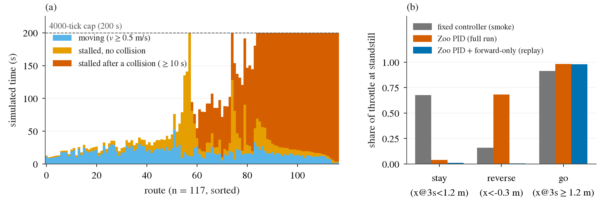
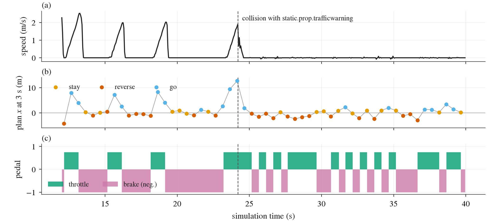

# Alpamayo 1.5 在 Bench2Drive 全量里“停住不动”的诊断

状态: 诊断完成（2026-09-25 10:30）；全量 `alp-b2d-full` **已暂停**在 119/220（没写 sentinel），修复与 re-smoke 待 main 决定
主题: ../../research/openpilot-and-open-driving-models.md、../../research/trajectory-to-control.md
相关: [B2D 考试](bench2drive.md)（预注册与“控制器换成 Zoo PID”的偏离）、[openpilot 迁移](openpilot-migration.md)（同类适配 bug 的先例）、
[控制器 API](../../docs/b2d-controller.md)

## 结论先行

- **停住的主因是适配 bug，不是模型要停。** Zoo PID（Bench2DriveZoo 的 UniAD/VAD 官方 trajectory→control PID）把
  waypoint 之间的**距离绝对值**当作目标速度（`desired_speed = Σ‖wp[i+1]−wp[i]‖·2/5`），不看方向。Alpamayo 在静止时有
  48% 的 plan 是“向后退”（x < −0.3 m）：它的 unicycle 积分器没有 v ≥ 0 的约束，v0 ≈ 0 时一个刹车 plan 积分出来就是倒车，
  语义上是“停着”。旧的固定控制器把这种 plan 执行成刹车（84% 的 tick 刹车），Zoo PID 把它读成 0.6 m/s 的前进速度，
  **68% 的 tick 踩 0.75 油门往前冲**。
- **连锁**：静止 → 倒车 plan 或 0.8 m/s 的蠕行 plan → Zoo PID 满油门保持 0.5 s（2 Hz 规划、控制量保持到下一次规划）
  → 1 s 后车速约 2.0 m/s，是 plan 的 2.4 倍 → 模型从历史里看到自己在加速，plan 拉长 → 追尾前车或撞上施工牌 →
  车贴着障碍物，模型说“停/后退”，Zoo PID 又把后退读成前进，油门、刹车交替，车一直顶在障碍物上。
  **80 段 ≥ 10 s 的停车里 71 段（停车时长的 91%）开始于一次碰撞前后 3 s 内**；v < 3 m/s 的 54 次碰撞里 48 次在碰撞前
  2 s 内有一个“静止时拿到油门”的 plan，其中 30 次是倒车 plan。
- 117 条完成路线 82% 的仿真时间 v < 0.5 m/s；35 条跑满 4000 tick（TickRuntime），23 条被判 blocked。起步没有问题
  （第一次 v ≥ 0.5 m/s 的中位数 1.4 s），坐标系、时间基、egomotion 历史都查过是对的。
- **处置**：全量已暂停（干净地停掉了 slot 的进程，没写 `.done/.failed`，依赖它的 `simlingo-exp-extra`、`hugsim-exam`
  会一直等，需要 main 重新安排）。建议的修复 F1（forward-only plan，速度截在 0 以上）是纯语义修复，离线重放在已记录的
  9021 个静止倒车 plan 上让 Zoo PID 的刹车比例从 39.9% 升到 99.4%，对前进 plan 零影响。控制节奏 F2 是否一起改要 main 定。
  119 条旧结果应作废。

## 数据与方法

- 全量 run：`$DATA_DIR/runs/zeroshot-exam/b2d/full220-alpamayo-zoopid/`，暂停时 119 条完成，其中 117 条日志完整进入分析
  （`attempts/<id>/<n>/{plans,ticks,results}.jsonl`：2 Hz 的每次规划含 20 点 rear-axle path、Zoo PID 的 metadata 和
  CoC 文本；20 Hz 的每 tick 控制量与仿真真值位姿；官方 `results.json`）。
- 对照：`smoke-alpamayo-zoopid`（02:09，同一套 Zoo PID，5 条预注册路线，DS 68.4）和 `smoke-alpamayo`（预注册的固定控制器，
  DS 60.8）。
- 定义：**stall** = 车速 v < 0.5 m/s；一段 stall episode = 连续 ≥ 10 s。静止时的 plan（v < 0.3 m/s）按 3 s 处前进距离分三类：
  **stay**（x@3s < 1.2 m，即平均 < 0.4 m/s，正好是 Zoo PID 的刹车阈值）、**reverse**（前 3 s 内 x < −0.3 m）、**go**（其余）。
  碰撞时刻：官方 infraction 里的位置是 ego 车辆中心，取真值轨迹上离它最近的 tick。
- 代码：`scripts/zeroshot_b2d_alp_stall.py`（逐路线 / 逐规划表）和 `scripts/zeroshot_b2d_alp_stall_probes/`（episode、
  碰撞、静止响应、离线重放、坐标检查），在 box 上用 `envs/carla` 跑，只读日志，不占 GPU。结果文件在
  [research/results/zeroshot-b2d/alp-stall/](../../research/results/zeroshot-b2d/alp-stall/)。
- 缺口：这一轮的 agent 还没有写 `route.json`（路线命令），所以“在不在路口”只能用 nav 文本是否出现（前方 60 m 内有左/右转）
  和 CoC 关键词近似。

## 1. stall 的量

| run | 路线数 | DS | RC | Completed / TickRuntime / blocked | v < 0.5 的时间占比 | ≥ 10 s episode | 其中始于碰撞 |
|---|---:|---:|---:|---|---:|---:|---:|
| 全量 Zoo PID | 117 | 44.0 | 76.7 | 59 / 35 / 23 | **82%**（9603 / 11649 s） | 80（8438 s） | **71（7700 s，91%）** |
| smoke Zoo PID | 5 | 68.4 | 89.6 | 4 / 0 / 1 | 65% | 3 | 2 |
| smoke 固定控制器 | 5 | 60.8 | 70.0 | 3 / 0 / 0（2 条 route deviation） | 44% | 0（最长 6.1 s） | — |

DS（Driving Score，route completion 乘违规系数）和 RC（Route Completion）是官方值。读法：全量里一半路线（58/117）不是开完的，
而是停到 4000 tick 上限或被判 blocked；这 58 条的 DS 平均 22–27，开完的 59 条平均 63.4。55 条路线以一段 stall 结束，
其中 48 条在那段 stall 开始时刚发生过碰撞。smoke 的 5 条里 2373、2390 已经出现同样的“撞前车后顶住”，只是 n = 5 时
被 DS 的均值盖住了，闸门没有拦下来。



图 1：(a) 117 条路线的仿真时间拆成行驶（蓝）、没有碰撞的停车（橙）、碰撞后 ≥ 10 s 的停车（红），按红色时长排序；
右侧三分之一的路线几乎全程是红色，都是撞上之后顶在障碍物上直到 200 s 上限。(b) 碰撞发生前的静止时刻，三类 plan 下
控制器踩油门的比例：固定控制器对倒车 plan 基本刹车（16% 油门），Zoo PID 反而 68% 踩油门；离线加上 forward-only 截断后
倒车 plan 的油门比例降到 0.6%，go plan 不变。

**在哪里停。** 没有“起步停”：第一次 v ≥ 0.5 m/s 的中位数 1.4 s、最大 7.1 s，静止的历史没有让模型不肯出发。
71 段碰撞后的停车里，碰撞对象是车辆（前车、停着的事故车、cut-in 车）和施工牌、交通灯杆、护栏；全量共 144 次碰撞
（车辆 95、静物 48、行人 1），每条 1.23 次，固定控制器的 smoke 是 5 条 1 次。9 段没有碰撞的长停车里，CoC 多是
“Yield to the cross-traffic…”、“Keep distance to the lead vehicle…”，nav 文本在其中 3 段里出现（路口转弯前），
这些才更像模型自己的“等”。红灯相关的 CoC 只占停车 plan 的 1%。

## 2. 停车时模型在说什么、控制器在做什么

| 停车段 | 静止 plan 数 | stay | reverse | go |
|---|---:|---:|---:|---:|
| 碰撞后顶住（≥ 10 s） | 15233 | 35% | 44% | 21% |
| 无碰撞的长停车（≥ 10 s） | 1472 | 34% | 45% | 21% |
| 短停车（< 10 s） | 2202 | 26% | 48% | 25% |

模型在停车时并不是一直说“走”：约 80% 的 plan 是 stay 或 reverse，CoC 的首位是“Keep distance to the lead vehicle since it is
stopped ahead”“Stop for the construction barricade blocking the lane ahead”。它说的是对的——车就顶在前车或施工牌上。
所以顶住之后的长停车里，“模型要停”和“车动不了”是同时成立的，问题出在**怎么走到顶住这一步**。

碰撞之前（去掉每条路线第一次碰撞前 2 s 之后的所有 plan）的静止时刻，控制器的响应：

| plan 类别 | n | 固定控制器 smoke：油门 tick 占比 | Zoo PID 全量：油门 tick 占比 | Zoo PID：0.5 s 后车速 | Zoo PID + forward-only（离线重放）：油门占比 |
|---|---:|---:|---:|---:|---:|
| stay | 370 | 68%（跟蠕行） | 4% | 0.03 m/s | 1% |
| reverse | 667 | **16%** | **68%** | 0.58 m/s | **0.6%** |
| go（plan 平均 0.81 m/s） | 352 | 91% | 98% | 0.66 m/s；1.0 s 后 **1.96 m/s** | 98% |

固定控制器的 n 是 smoke 的 41/66/47 个 plan。两件事：倒车 plan 被 Zoo PID 执行成前进，这是 bug；go plan 在 Zoo PID 下
0.5 s 满油门之后车速是 plan 的 2.4 倍，这是“2 Hz 规划 + 控制量保持”的节奏问题，下一节说。



图 2：route 1833（ConstructionObstacleTwoWays）12–40 s。(a) 车速；(b) 每次规划 3 s 处的前进距离，按 stay / reverse / go
着色；(c) 油门（上）和刹车（下）。看 12–23 s：每一次 go 都换来 0.5 s 满油门、车冲到 2 m/s，然后 1 s 满刹车，停-冲-停
三个循环；第四次冲到 1.8 m/s 时在 24.2 s 撞上施工警示牌。之后模型一直给 reverse / stay（“Stop for the barricade…”），
Zoo PID 把 reverse 读成前进，油门和刹车交替，车顶着警示牌 175 s 直到 4000 tick。

## 3. 适配层逐项审计

| 项 | 怎么查的 | 结果 | 判定 |
|---|---|---|---|
| plan 原点与坐标系 | 预注册：PhysicalAI-AV 的 rig 原点在后轴中心地面，x 前 y 左，egomotion 与输出轨迹同一系；plan 第一个点紧接原点（例如 −0.10 m @0.25 s） | 与控制器要的后轴坐标一致，没有 openpilot 那种相机原点偏移 | 正确 |
| 时间基与单位 | 速度 ≥ 3 m/s 的 1096 次规划：plan x@1s / 车速 | 中位数 1.048（真值 1 s 后实际前进 / 车速 = 0.969），64 点 @10 Hz 重采样到 0.25 s 没有错位 | 正确 |
| 左右与航向符号 | 同上，plan y@1s、航向对真值 1 s 后的横向位移、航向变化 | 横向符号一致 83%（r = 0.44），航向 76%（r = 0.31）；Zoo PID 常改用 route target 转向，所以一致性不高，但远高于反号时的 < 50% | 正确 |
| egomotion 历史 | 代码：16 × 0.1 s 后轴位姿（GNSS + 罗盘 + 里程计），t0 系、yaw 逆时针；server 转成 xyz + 旋转矩阵 | plan 隐含的 v0 与车速一致（上一行），说明历史的尺度和帧率对；起步中位数 1.4 s，静止历史没有造成“起步停” | 正确 |
| 相机时序与 f-theta | 预注册 smoke 已核（4 帧 @10 Hz、组内 ±1 tick 抖动、f-theta 重采样的图与真车一致）；这次没改 | 与固定控制器 smoke 相同，不能解释控制器换了之后的差别 | 不变 |
| nav 文本时机 | 每次规划按路线进度给“Turn left/right in d m”（≤ 60 m） | 未改；9 段无碰撞长停车里 3 段有 nav，在路口前等横向车流 | 不变 |
| **倒车 plan 的语义** | Alpamayo `action_to_traj`：v = v0 + cumsum(a·dt)，没有 v ≥ 0 截断；Zoo PID 的 `desired_speed` 用距离绝对值 | 静止 plan 的 48% 是倒车，Zoo PID 68% 踩油门往前；9021 个倒车 plan 里只有 39.9% 触发刹车 | **bug** |
| 2 Hz 规划 + 控制保持 | Zoo PID 在每次规划调用一次、保持 0.5 s（照 AD-MLP agent 的节奏）；速度环 K_P = 5、delta 截在 0.25，差 0.15 m/s 以上就饱和到 0.75 | 从静止起步 0.5 s 满油门，1 s 后车速是 plan 的 2.4 倍（30% 的起步在 0.5 s 时就超过 1.1 倍）；刹车同样保持 0.5 s，形成停-冲-停循环。UniAD/VAD 每 tick 调用，超速 1.1 倍时下一 tick 就刹 | 节奏选择放大了问题，要 main 定 |
| aim point / target | aim 取中点离原点最接近 4 m 的那段；plan 很短时 aim 是第一个点 | 倒车 plan 的 aim 角 ≈ ±2（180°），但 `|angle_target| < |angle|` 让它改用 route target 转向，没有出现满舵 | 无害 |
| 去掉的低速限油门 | AD-MLP 在车速 > 3 m/s（转弯 2.5）时把油门压到 0.05 | 只在 3 m/s 以上生效，不影响起步冲撞；它影响的是 v ≥ 3 m/s 的 90 次碰撞里有多少能避免，不是 stall | 不是 stall 的原因 |
| 预热 / stop-hold | Alpamayo 没有预热，第一组图就规划；Zoo PID 没有 stop-hold，每次规划重新判刹车 | 起步正常；缺 stop-hold 本身不是问题，问题是倒车 plan 让“停”判不出来 | — |

**控制器从固定控制器换成 Zoo PID，改变了什么。** 固定控制器 20 Hz 跟踪、按里程计把 plan 重投影到当前位姿，倒车或过短
的 plan 进 stop-hold 刹车，起步速度跟着 plan 走（1 s 后 1.51 m/s，对 plan 1.37 m/s）。Zoo PID 丢了这三样：倒车当前进、
0.5 s 内没有速度反馈、没有停车保持。模型、rig、nav、推理配置两次完全相同，所以同样 5 条 smoke 路线上 stall 从最长 6 s
变成 61–90 s、碰撞从 1 次变成 3 次，差别来自执行层（全量的 DS 44.0 是另一组路线，不直接和 smoke 的 60.8 比）。

## 4. 处置：暂停全量（2026-09-25 09:23）

- 先 SIGKILL 了 `slot_run.sh`（pid 633596），让它不写 `alp-b2d-full.done/.failed`：否则 b2d_run 被打断后，launcher 按
  “没跑完 ≤ 15 条”的规则会判成功、写 `.done`，把依赖它的 slot 放出去。
- 再给 `b2d_run.py`（pid 289616）发 SIGINT：它按设计取消 4 个 worker、停掉自己的 CARLA（server index 410–413）；launcher
  的 trap 停掉 Alpamayo policy server。之后核对：没有残留的 route 进程、CARLA 端口和 policy server，GPU 1 释放约 34 GB。
  只按 pid 杀，没有用任何 `pkill -f`。
- 119 条完成、4 条 `cancelled_by_user`，可以续跑，但结果带 bug，**不建议续跑，修复后从头跑**。
- `$DATA_DIR/runs/zeroshot-exam/gpu-plan.md` 已追加记录。`simlingo-exp-extra`、`hugsim-exam` 以 `alp-b2d-full` 为依赖，
  现在会一直等，要 main 重新安排。tmux 窗口 `jev:alp-b2d-full` 留着显示 `runner exit 130`，main 看过可以关。

## 5. 建议的修复与 re-smoke（待 main 决定；写成偏离，先于任何新分数冻结）

**F1（bug 修复，建议必做）：forward-only plan。** 在 `scripts/b2d_zoo_pid_wrap.py` 取 6 个 waypoint 之前，把 plan 的每一段
前进分量为负的位移置零（等价于 unicycle 的速度截在 v ≥ 0：刹车刹到 0 就停住，不会倒车），再累加成 path。理由是语义
而不是分数：真车刹车不会倒车，Alpamayo 的倒车只是 v0 ≈ 0 时积分器没有截断；固定控制器本来就是这样执行的。
Zoo PID 本身一字不改。做成 agent 配置开关（默认关，复现当前 run）。离线重放（box 上 vendored `control_pid`，所有 run 的
静止 plan）：

| run | plan 类别 | n | 刹车比例：现在 | 刹车比例：F1 | 目标速度：现在 → F1 (m/s) |
|---|---|---:|---:|---:|---|
| 全量 | reverse | 9021 | 39.9% | **99.4%** | 0.61 → 0.01 |
| 全量 | stay | 6768 | 98.3% | 98.9% | 0.18 → 0.16 |
| 全量 | go | 4351 | 2.0% | 2.0% | 0.80 → 0.80 |
| smoke Zoo PID | reverse | 206 | 31.1% | 99.5% | 0.78 → 0.01 |

**F2（控制节奏，需要 main 选）。** (a) 保持现在的 AD-MLP 节奏（每次规划算一次、保持 0.5 s），只修 F1；
(b) 每 tick 调用一次 `control_pid`，用最新 plan 按其“年龄”平移时间（取 age + 0.5 … age + 3.0 s 的点，按里程计重投影到当前
位姿），这就是 UniAD/VAD 在 20 Hz 下的闭环语义，超速 1.1 倍时下一 tick 就刹车，能消掉 2.4 倍的起步过冲。
我倾向 (b)：Zoo PID 的增益（K_P 5、delta 截 0.25）是按 20 Hz 反馈设计的，2 Hz 保持把它变成了 0.5 s 的 bang-bang。
但 AD-MLP 确实这样发布，(a) 也站得住，所以这是决策，不是 bug。

**re-smoke（约 1.5 h，GPU 1 一个 server + 1–2 个 worker）。** 路线：5 条预注册 smoke 路线 + 全量里 6 条“撞后顶住”的
诊断路线（1833、1852、1956、2668、4183、11381），TM seed 0。两个 arm：F1、F1 + F2(b)。
验收只看适配指标，不看 DS：碰撞前静止倒车 plan 的油门比例 ≤ 5%；v < 3 m/s 的碰撞里“碰前 2 s 静止拿油门”的次数；
go plan 起步 1 s 后车速 / plan 速度的中位数；碰撞后 ≥ 10 s 的停车段数。F2 选 (a) 还是 (b) 的规则也事先写死：
(b) 只在起步过冲中位数从约 2.4 降到 ≤ 1.3 且其他指标不变差时采用。之后 220 条从头跑，119 条旧结果作废，不并入。

## 复现

```bash
# box, repo root: per-route / per-plan tables (routes.csv, plans.csv, cot.json)
D=$DATA_DIR/runs/zeroshot-exam/b2d
$DATA_DIR/envs/carla/bin/python scripts/zeroshot_b2d_alp_stall.py full=$D/full220-alpamayo-zoopid \
    smokezoo=$D/smoke-alpamayo-zoopid smokefixed=$D/smoke-alpamayo --out $D/diag-alp-stall
# probes (stdout JSON): episodes, collisions, standstill response (2nd arg = before the first collision), replay, frames
for r in full220-alpamayo-zoopid smoke-alpamayo-zoopid smoke-alpamayo; do
  $DATA_DIR/envs/carla/bin/python scripts/zeroshot_b2d_alp_stall_probes/standstill.py $D/$r free; done
$DATA_DIR/envs/carla/bin/python scripts/zeroshot_b2d_alp_stall_probes/clamp_replay.py $D/full220-alpamayo-zoopid \
    $D/smoke-alpamayo-zoopid $D/smoke-alpamayo
# Mac: figures (1833 ticks/plans.jsonl pulled into <dir>)
.venv/bin/python scripts/zeroshot_b2d_alp_stall_figs.py --route-dir <dir>
```

`episodes.csv` / `collisions.csv` 是 episodes.py / collisions.py 的输出再加上“episode 起点前 3 s 到结束之间有没有碰撞”
（`ncol_in`）和“碰前 2 s 有没有静止拿油门的 plan”（`lunge`、`revthr`）两列，合并在 Mac 上做。
