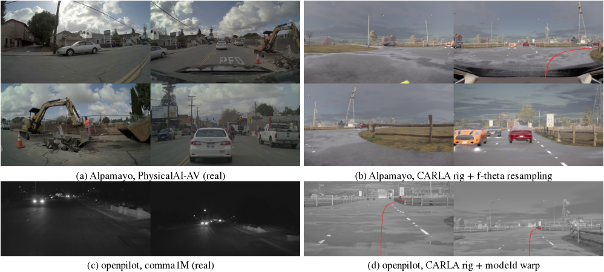
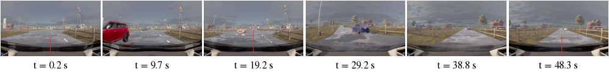
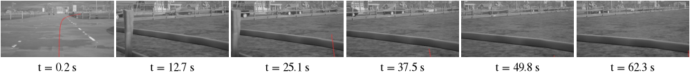

# Zero-shot 闭环考试：Alpamayo 1.5 与 openpilot 在 Bench2Drive 上

状态: 预注册已冻结（2026-09-24 17:20，smoke 之前；plumbing 只用来查适配，不计分）；smoke 完成；全量 220 条**等用户批准**
主题: ../../research/openpilot-and-open-driving-models.md、../../research/benchmarks-and-evaluation.md
相关: [Alpamayo smoke](../2026-09-24-alpamayo-smoke/README.md)、[openpilot smoke](../2026-09-24-openpilot-smoke/README.md)、
[控制器 API](../../docs/b2d-controller.md)、[闭环成本](../../docs/bench2drive-cost.md)

## 目标

把两个现成的开放驾驶模型不做任何训练、原样放进 Bench2Drive（CARLA 0.9.15 上的 220 条闭环路线，
指标是 DS（Driving Score，route completion 乘以违规惩罚系数）和 SR（Success Rate，无违规走完的比例））：
NVIDIA Alpamayo 1.5（10B reasoning VLA，输出 6.4 s 轨迹）和 comma openpilot 的 Lebowski（877M，输出 plan 与
desired curvature/accel）。这一轮只做 smoke（5 条路线）和全量成本估计；全量跑要用户看过估计之后批准。

闭环相对开环考试（WOD-E2E、NAVSIM）的优势是**传感器由我们摆**：相机的内参、FOV、安装位置和帧率都可以按模型
自己的车来生成，适配损失主要只剩渲染外观（domain gap）和车辆/道路环境本身。下面每一项都写清楚“复现了什么、
还剩什么妥协”，先冻结再跑。

## 预注册（冻结于 smoke 之前）

### 1. 传感器 rig

**Alpamayo 1.5。** 模型训练数据是 PhysicalAI-AV（NVIDIA Hyperion 车队）。我们下载了 chunk 3119 的标定
（`calibration/{camera_intrinsics,sensor_extrinsics,vehicle_dimensions}`，100 个 clip），取中位数作为 rig。
这批车的轴距 2.850 m、车长 4.87 m，与 Bench2Drive 的 ego（Lincoln MKZ 2020，轴距 2.860 m）几乎一样，
所以安装位置可以按“离后轴的距离”直接搬过来，不需要缩放。rig 坐标系原点在后轴中心地面，x 前 y 左 z 上，
这也正是模型 egomotion 和输出轨迹的坐标系（雷达与车长数据核对过：前保险杠在 x = 3.8 m）。

| 相机（模型 index） | 位置 x/y/z (m, 后轴地面) | yaw / pitch (°) | 原生镜头 | CARLA 渲染（pinhole） |
|---|---|---|---|---|
| cross-left (0) | 2.531 / 0.938 / 0.897 | 66.9 / 0.0 | f-theta 120°，1920×1080 | 1368×784，HFOV 135.6° |
| front-wide (1) | 1.779 / 0.000 / 1.433 | −0.4 / −0.5 | f-theta 120° | 1384×784，HFOV 136.2° |
| cross-right (2) | 2.535 / −0.926 / 0.902 | −66.6 / 0.7 | f-theta 120° | 1392×792，HFOV 136.3° |
| front-tele (6) | 1.729 / 0.093 / 1.446 | −0.1 / −0.2 | f-theta 30° | 608×352，HFOV 30.7° |

CARLA 只有 pinhole 相机，所以每路相机渲染一张覆盖整个 f-theta 视场的 pinhole 图，再在 policy server 的 GPU 上用
`grid_sample`（双线性）按该相机的 f-theta 多项式（`fw_poly/bw_poly`、主点 cx/cy，均为标定中位数）重采样成模型真正看到
的 576×320 图。576×320 就是 Qwen3-VL processor 对 1920×1080 原图的缩放结果（像素数在 163840–196608 之间、边长为 32
的倍数），所以我们直接生成这一尺寸，processor 不再缩放。pinhole 渲染的焦距取 f-theta 中心在 576 宽下的尺度
（279 px/rad），中心区域 1:1 采样、边缘过采样。几何上唯一没复现的是 roll（各相机都小于 0.25°）。
时序：4 帧 @10 Hz（CARLA `sensor_tick = 0.1`），与训练一致。

**openpilot（Lebowski）。** comma 3X 两路相机：road（1928×1208，焦距 2648 px，HFOV 40.0°）和 wide（同尺寸，
焦距 567 px，HFOV 118.9°）。openpilot 自己的 warp 把两者都当 pinhole 处理（`common/transformations/camera.py`），
我们在 CARLA 里按这两个内参原样渲染，再用 modeld 同款的最近邻 warp（`jevdrive/openpilot/frames.py`，
calibration rpy = 0，因为 CARLA 相机水平、正对前方，正是 calib frame）得到 512×256 的 model frame。
颜色：CARLA 的 RGB 按 BT.601 limited range 转 YUV420（comma1M 实测 Y 在 16–245，是 limited range），
chroma 取 2×2 平均，与 NV12 一致。

安装位置：与 Hyperion 的 front-wide 相机完全相同（后轴前 1.779 m、离地 1.433 m，即挡风玻璃上沿；同轴距的车，
位置可以直接搬）。plumbing 阶段试过两个更低的位置，都不行，数字留在这里：openpilot 的名义相机高 1.22 m 在 MKZ 上
让发动机盖占掉 road frame 底部约 20%（真实 comma road frame 看不到发动机盖）；1.35 m 时相机在 CARLA 这辆车的
挡风玻璃后面，玻璃是深色的，整幅图明显变暗（同一场景 Alpamayo 的相机亮度正常）。真车上 comma 装在玻璃内侧、比车顶线低几厘米；
我们为了避开 CARLA 的深色玻璃把它放在玻璃外、Hyperion 相机的高度，高出的几厘米是剩余妥协。
时序：两路都是 5 Hz（`sensor_tick = 0.2`），见下面第 4 节。

**两个模型共同的剩余妥协（都算 handicap，不修）：** CARLA 渲染外观（光照、材质、噪声、夜景）与真实相机 ISP 不同；
wide 相机在真车上是鱼眼，openpilot 按 pinhole 处理，我们渲染的是真 pinhole，所以 model frame 边缘的放大率与训练时略有
差别；Hyperion 车队的车身与 MKZ 不完全相同，cross 相机若被车身遮挡要在 smoke 的图里看出来。

### 2. 路线信息

Bench2Drive 给 agent 的是稠密路线（GPS + world 坐标 + RoadOption：LEFT/RIGHT/STRAIGHT/LANEFOLLOW/CHANGELANE*）。
我们只把模型在真车上能拿到的那一种形式交给它：

- **Alpamayo**：自然语言 nav（`<|route_start|>…<|route_end|>`）。用 GNSS+罗盘+里程计的位姿
  （`b2d_controller_adapter.PoseFilter`，只用传感器）在路线上求进度，往前找下一个 junction 命令；若是 LEFT/RIGHT
  且距离 ≤ 60 m（约模型 6.4 s 的视野），给 `"Turn left in {d}m"` / `"Turn right in {d}m"`（d 取整，在路口内为 0）。
  这是官方 notebook 和 `nav_demo_samples.json` 里唯一出现过的句式（TURN_LEFT/TURN_RIGHT，9–36 m）。
  直行路口、变道和一般跟车**不给 nav**（用默认 prompt），因为我们不知道训练里“直行”“变道”的句式，
  写一个模型没见过的句子比不写更糟。这意味着直行穿越路口时模型要自己判断，属于已知 handicap。
- **openpilot**：没有导航输入，只有 desire（8 维 one-hot，modeld 只喂上升沿脉冲）。路口 LEFT/RIGHT 前 20 m 起
  给 `turnLeft/turnRight`，在 CHANGELANELEFT/RIGHT 段内给 `laneChangeLeft/Right`，其余 `none`。openpilot 的
  turn desire 本来只在低速打灯时出现，模型是否会据此在路口转弯没有验证过；**预期它在需要转弯的路线上大量偏离路线**，
  这是这个模型在这个考试上的结构性 handicap，结果要单独标注。

### 3. 控制：两个模型都走同一个固定控制器

两个模型的轨迹都交给仓库的固定控制器 `scripts/b2d_controller.py`（`Controller(preset="carla")`，
纵向 vendor 模式，冻结的 MKZ 参数 `todos/2026-09-22-b2d-controller/results/controller_config.json`，
20 Hz 执行，按时间戳用里程计把轨迹重投影到当前位姿）。输入统一是后轴坐标、0.25–5.0 s 的 20 个点：
Alpamayo 的 64 点 @10 Hz 直接线性插值；openpilot 的 plan（33 个非均匀时间点，calib frame，原点在相机）先平移到后轴
（x + 1.779 m）、y 取反（device frame y 向右）再插值。

为什么 openpilot 也不用它自己的 desired curvature/accel：那两个量是给 openpilot 里按车型标定的横纵向控制器
（torque/angle 控制 + 车辆模型）用的，CARLA 的 MKZ 没有这层；把 curvature 换成方向盘角本来也要一个车辆模型，
那正是这个控制器已经标定过的部分。两个模型走同一个执行层，DS 的差别才能归到 planner 上。代价是 openpilot 的 plan
在它自己车上是由 MPC 跟踪的，这里换成 pure-pursuit/PID 式跟踪，属于轻微 handicap。curvature/accel 仍逐次记录，
方便事后对照。

### 4. 规划频率、同步与延迟

CARLA 以 20 Hz 同步步进，模型推理时仿真暂停，所以推理延迟只花墙钟，不影响驾驶；**不模拟延迟**（轨迹时间戳就是输入帧
的仿真时间）。这对 Alpamayo 是有利的偏差（真车上 0.7 s 的延迟会让轨迹变旧），写进结果的解读里。

- **Alpamayo：2 Hz 重规划**（每 5 个 10 Hz 相机组规划一次），两次之间控制器按 20 Hz 跟踪上一条轨迹（6.4 s 视野远大于
  0.5 s 间隔，控制器的 stale timeout 也是 0.5 s）。Bench2DriveZoo 的 AD-MLP 同样是 2 Hz 推理。
- **openpilot：5 Hz**，即它的 context 频率。Lebowski 的队列在 ONNX 外面，某一相位 t 的输出只依赖帧 t−4、t，
  隐状态 t−96…t−4（步长 4）和按 4 步对齐 max-pool 的 desire，所以**只跑一个相位与 20 Hz modeld 在该相位的输出完全
  相同**。已在 comma1M 段 `0045b4fe` 的 400 帧（含一个 turnLeft 脉冲）上验证：100 个相位步的输出最大差 **0**
  （`scripts/test_zeroshot_openpilot_context.py`，TRT fp16）。所以 5 Hz 不是近似，只是不计算用不到的相位。
- CARLA 的 `sensor_tick` 让不同相机的相位可能差一个 tick（生成顺序和 UE tick interval 的余量累积）。agent 把
  “每路都比上一组新”的帧拼成一组，组帧号取最新；各路帧号记录在 `plans.jsonl`。plumbing 实测（route 2390，
  40 次规划）：组间隔 117/117 都是 2 tick（正好 10 Hz），规划间隔 39/39 都是 10 tick；cross-left 在 38/40 组里比
  其他三路早一个 tick（50 ms），这一点不修，算剩余妥协（10 m/s 时约 0.5 m 的侧视图时差）。

### 5. 推理配置

- Alpamayo：SDPA + `torch.compile`（vision、expert）+ flow matching 5 步，n = 1 条轨迹，温度 0.6、top-p 0.98，
  seed = 规划序号。这是 Alpamayo smoke 里“输出基本不变”档的最快配置（p50 697 ms，与默认配置的轨迹差 0.17 m，
  远低于换 seed 的 1.28 m）。保留 CoC 推理（不关 reasoning）。
- openpilot：Lebowski，onnxruntime TensorRT EP fp16（smoke 数值等价已核），traffic convention 左舵。
- 一个 resident server 进程服务所有 CARLA worker（unix socket，`scripts/zeroshot_policy_server.py`），
  GPU 上用一把锁串行；openpilot 每个 worker 的递归状态在 server 里按连接分开保存。

### 6. Smoke 路线（按 id 预先固定）

| route | town | 场景 | 选它的理由 |
|---|---|---|---|
| 24211 | Town01 | DynamicObjectCrossing | 小镇、行人横穿；TCP 在我们这里 393 tick 跑完 |
| 2390 | Town12 | VanillaNonSignalizedTurn | 无信号路口转弯，考 nav/desire；控制器 smoke 的标准路线 |
| 1711 | Town12 | ParkingCutIn | 成本锚点：policy none 288 s / 1283 tick |
| 2373 | Town12 | VanillaSignalizedTurnEncounterRedLight | 红灯 + 转弯 |
| 3564 | Town13 | InvadingTurn | Town13 的每 tick 成本（全量里 Town12+13 占 69% 路线、83% 墙钟） |

TM seed 0，每条一次（`--max-attempts 1`，基础设施失败才重跑）。所有规划都存模型输入图（带预测轨迹投影）；
route 2390 另外合成视频。

### 7. 记什么、怎么判

- 官方 `results.json`：DS、RC（route completion）、违规列表、状态；SR 按 Bench2Drive `merge_route_json.py`
  的定义（完成且无违规）。
- 成本：每条路线的墙钟、tick 数、s/tick（`route_result.json` 的 tick profile），每次规划的往返时间和 server 推理时间。
- 适配是否正确（visual check）：模型输入图的地平线位置、车身遮挡、左右是否颠倒、投影后的轨迹是否落在可行驶区域；
  openpilot 与真实 comma1M model frame 对照。发现适配错误就修，修完**重跑受影响的 smoke**，不当作模型分数。
- 全量估计：用本次 smoke 实测的每 tick 成本（分模型、分 town）乘 full220 实测的每 town tick 数与 route 数，
  再按并发 worker 数和共享 GPU 的排程折算。

## Smoke 结果（2026-09-24，5 条路线 × 2 个模型）

两个模型各开 2 个 CARLA worker 同时跑，共用一张卡（同时还有 WOD-E2E / NAVSIM 考试的 Alpamayo 进程），
TM seed 0，每条路线一次、无基础设施重跑（`restarts 0`）。原始 run：box 上
`$DATA_DIR/runs/zeroshot-exam/b2d/smoke-{alpamayo,lebowski}/`；逐路线表拉回到
[research/results/zeroshot-b2d/](../../research/results/zeroshot-b2d/)（`scripts/zeroshot_b2d_report.py` 生成）。

### 驾驶结果

| route | town / 场景 | Alpamayo DS | RC | 状态与违规 | openpilot DS | RC | 状态与违规 |
|---|---|---:|---:|---|---:|---:|---|
| 24211 | Town01 DynamicObjectCrossing | **100.0** | 100 | Completed | 3.0 | 6.1 | 撞围栏、驶出车道，blocked |
| 2390 | Town12 VanillaNonSignalizedTurn | 28.7 | 28.7 | 路口按 nav 应右转，模型左转，route deviation | 2.1 | 3.2 | 直穿 T 字路口撞围栏，blocked |
| 1711 | Town12 ParkingCutIn | **100.0** | 100 | Completed | 2.5 | 5.4 | 冲上人行道撞建筑，blocked |
| 2373 | Town12 SignalizedTurn + 红灯 | 15.1 | 21.6 | 闯红灯（×0.7）后 route deviation | 6.0 | 9.3 | 撞围栏，blocked |
| 3564 | Town13 InvadingTurn | 60.0 | 100 | Completed，撞车一次（×0.6） | 0.0 | 4.0 | 撞物体、驶出车道，blocked |
| **均值** | | **60.8** | **70.1** | SR 2/5 | **2.7** | **5.6** | SR 0/5 |

DS 是官方 `score_composed`，RC 是 `score_route`，SR 按 Bench2Drive 的定义（Completed 且除 min-speed 外无违规）。
n = 5，只能当 sanity check，不是分数：Alpamayo 的 DS 在 0–100 之间跳，单条路线的随机性很大
（2390 在 plumbing 里同一路口右转成功，smoke 里 CoC 写着 "Nudge left due to the stopped vehicle blocking the right
side" 然后左转）。两件事是清楚的：

- **Alpamayo 能在 CARLA 里 zero-shot 开车。** 5 条里 3 条走完（RC 100），路口按 nav 转弯、跟车、停车让行都出现了，
  CoC 文本与图像内容对得上（红灯、前车、施工/停靠车辆）。它开得很慢：两条走完的路线平均速度约 2.1 m/s
  （132 m / 65.8 s、133 m / 60.3 s），min-speed 记录多达 18–20 条（B2D 0.0.4 不因此扣 DS）。
  停车时它常预测一条向后退的轨迹（x < 0），控制器把它执行成刹车。
- **openpilot 在这个考试上基本不能开。** 5 条全部在前 5–10 m 内驶离车道（偏向路边、人行道、围栏），撞上静态物体后
  停住，约 60 s 后被判 blocked，每条都是约 1250–1290 tick。它确实响应 desire：2390 起步时 turnRight 下 plan 画出了
  右转（图 2 第一格），但没有把车带进转弯。能看到的另一个现象是：在雨雾场景里 plan 在相邻两次（0.2 s）之间在
  “直行”和“急右转”之间来回跳（24211 的第 76/84/92 次规划）。同一个 5 Hz 相位链在真实 comma1M 视频上是平滑的
  （相邻步 3 s 处横向差 0.22 m，符号翻转比例 0.44，接近随机），所以这是 CARLA 外观下模型本身的双峰，不是 5 Hz
  步进造成的（5 Hz 与 20 Hz 在该相位逐位相同，见第 4 节）。

### 适配的 visual check



图 1：模型实际看到的输入，真实数据（左）与我们在 CARLA 里生成的（右）。(a)(b) Alpamayo 的四路相机
（左上 cross-left、右上 front-wide、左下 cross-right、右下 front-tele），576×320；(b) 是 route 2390 路口处，红线是模型
这一次预测的轨迹投影到 front-wide（f-theta 模型 + 外参），落在右转后的车道上。看三点：地平线高度、f-theta 边缘的弯曲、
发动机盖在 front-wide 底部占的比例，两边都一致；CARLA 侧额外看到后视镜的一角。(c)(d) openpilot 的 road（左半）
与 wide（右半）model frame（Y 通道）：地平线都在 road frame 第 48 行附近，plan（红线，按离地高度投影）沿车道画出
2390 起步处的右转。(c) 是夜间段，只用来对照几何。





图 2：route 2390 全程均匀取 6 次规划，上排 Alpamayo（front-wide，含预测轨迹），下排 openpilot（road frame，含 plan）。
Alpamayo 在路口前停车，让横穿的车先过（第 2 格），随后左转偏离路线（第 4 格起）；openpilot 在第 2 格已经越过 T 字路口停在围栏前。
整段视频在 box 上：`smoke-alpamayo/attempts/2390/1/route.mp4`（2 Hz 规划、10 fps）和
`smoke-lebowski/attempts/2390/1/route.mp4`（5 Hz、25 fps），`scripts/zeroshot_b2d_video.py` 生成。

相机同步（`plans.jsonl` 里的逐路帧号）：Alpamayo 规划间隔 10 tick 的比例 77–100%（Town13 最差，23% 的间隔是
9 或 11 tick），组内有一路相机与其他几路差 1 tick 的比例 0–98%（随路线不同，取决于传感器生成顺序）；
openpilot 规划间隔 4 tick 的比例 76–100%，road 与 wide 差 1 tick 的比例 1–83%。也就是说 CARLA 的 `sensor_tick`
让“10 Hz / 5 Hz”实际上是 ±1 tick 的抖动，这是剩余妥协，记下，不修（要修只能让相机每 tick 渲染，成本约翻倍）。

### 成本

| 模型 | route | ticks | 墙钟 (s) | s/tick | world_tick (ms) | tree (ms) | 规划次数 | 往返 (ms) | server 推理 (ms) | 排队 (ms) |
|---|---|---:|---:|---:|---:|---:|---:|---:|---:|---:|
| Alpamayo | 24211 | 1316 | 310 | 0.235 | 45 | 5 | 132 | 1712 | 1202 | 302 |
| Alpamayo | 2390 | 971 | 301 | 0.310 | 78 | 14 | 97 | 1509 | 1160 | 128 |
| Alpamayo | 1711 | 1205 | 373 | 0.310 | 90 | 40 | 121 | 1224 | 1008 | 17 |
| Alpamayo | 2373 | 488 | 193 | 0.396 | 112 | 17 | 49 | 1467 | 1020 | 219 |
| Alpamayo | 3564 | 1093 | 330 | 0.302 | 45 | 52 | 110 | 1280 | 1012 | 72 |
| openpilot | 24211 | 1286 | 72 | 0.056 | 26 | 5 | 322 | 47 | 9 | 0 |
| openpilot | 2390 | 1246 | 164 | 0.131 | 43 | 17 | 311 | 50 | 14 | 0 |
| openpilot | 1711 | 1285 | 207 | 0.161 | 62 | 36 | 321 | 55 | 19 | 0 |
| openpilot | 2373 | 1285 | 181 | 0.141 | 61 | 17 | 321 | 52 | 18 | 0 |
| openpilot | 3564 | 1248 | 211 | 0.169 | 47 | 42 | 312 | 48 | 12 | 0 |

s/tick = 墙钟 / tick，墙钟含加载地图和建场景（Town12/13 约 60–140 s）。读法：

- **Alpamayo 的成本几乎全在模型上。** 每 10 tick 一次规划，往返 1.2–1.7 s，折合每 tick 120–170 ms，而仿真本身
  （world_tick + tree）是 50–130 ms。server 端一次推理 1.0–1.2 s，比 Alpamayo smoke 在空卡上测的 0.70 s 慢 45–70%：
  卡上同时有 4 个 CARLA 在渲染、另外两个考试的 Alpamayo 在跑。往返里另外约 100 ms 是在 GPU 上做 f-theta 重采样
  和 processor（已挪到 GPU 锁外，和别的 worker 的推理重叠），约 150–250 ms 是 16 张 BGRA 渲染图（约 70 MB）走
  unix socket。2 个 worker 时 server 的排队 17–302 ms，说明一个 server 已经接近被两个 worker 喂满。
- **openpilot 的成本全在仿真上。** 一次规划往返 50 ms（TRT 推理 9–19 ms，YUV 转换 + warp 24 ms，其余是 2×9 MB 的
  传输），每 4 tick 一次，折合每 tick 12 ms；Town12/13 的 s/tick 0.13–0.17 由 CARLA 决定。

## 全量 220 条的成本估计与建议配置（待批准）

**tick 数。** Alpamayo smoke 平均 1015 tick/路线；它走完的路线平均速度约 2.1 m/s，220 条路线平均长 104 m
（full220 的 209 条 `route_length`），走完一条约 990 tick，和 smoke 均值一致，所以中心估计取 **1000 tick/路线**；
悲观估计取 2000（更多路口卡住让行、个别跑满 4000 tick 的 TickRuntime）。openpilot 5/5 都在约 64 s 仿真时间被判
blocked，取 **1270 tick/路线**，这个数很稳。

**Alpamayo 是 server-bound。** 一次规划占 GPU 锁 T_p 秒，220 × 1000 / 10 = 22,000 次规划，墙钟 ≈ 22,000 × T_p，
与 worker 数无关（只要 worker 够多把 server 喂满；按每个 worker 一个周期 = 10 tick 仿真 0.6–0.9 s + 往返，
3–4 个 worker 足够，另外要覆盖每条路线 60–140 s 的建场景空档）。

| Alpamayo 配置 | T_p (s/规划) | 1000 tick/路线 | 2000 tick/路线 | 显存 |
|---|---:|---:|---:|---:|
| 如 smoke：1 个 server、GPU 与其他考试共享 | 1.08（实测） | **6.6 h** | 13.2 h | 24 + 4×6.5 = 50 GB |
| 1 个 server、这段时间卡上没有别的 Alpamayo | 0.70（Alpamayo smoke 空卡实测） | **4.3 h** | 8.6 h | 50 GB |
| + 跨 worker 批处理 B = 3–4（未实现） | 0.40–0.50（由 smoke 里 n=6 每条 364 ms 推算） | 2.4–3.1 h | 4.9–6.1 h | 约 55 GB |
| 改成 1 Hz 重规划（**偏离预注册，不建议**） | 同上减半 | 2.2–3.3 h | | |

**openpilot 是 CARLA-bound。** 每条约 167 s worker 时间（smoke 均值，含建场景），220 条 = 36,700 worker·s：
6 个 worker 约 **1.7 h**（6×6.5 + 2.5 = 41.5 GB，约 20 核），4 个 worker 约 **2.6 h**（28.5 GB）。
Town13 上 scenario tree 占到 42–52 ms/tick，`--cache-lights`（docs/bench2drive-cost.md）只对 openpilot 这种仿真
bound 的跑法可能有用，未测。

**可以做但没做的优化（按收益排序）：**

1. **跨 worker 批处理 Alpamayo 请求**：把 2–4 个 worker 同时在排队的请求合成一次 `generate`（prompt 左填充，
   只改 wrapper，不改模型代码）。reasoning decode 是 n=1 延迟的最大一块（44%），批处理下几乎不涨；smoke 的 n=6
   每条 364 ms 对 697 ms 给出约 1.9× 的上限。需要先做逐请求数值等价检查，估计半天工作量。
2. **让 B2D 的 Alpamayo 段独占 GPU**（不和另外两个考试的 Alpamayo 同时跑）：T_p 1.08 → 约 0.7–0.8 s，−30%。
3. **第二个 resident 副本**（+24 GB）：只在 GPU 算力没被一个副本占满时有用；smoke 时整卡利用率已 85–97%，
   估计 ≤1.5×，不如 1 和 2 划算。
4. 传输改共享内存：只缩短单个 worker 的往返（约 −200 ms），server 已喂满时不改变总墙钟，不做。

**建议配置（等批准）：** 两个模型同一时段跑，Alpamayo 1 个 server + 4 个 CARLA worker（50 GB，约 16 核），
openpilot 1 个 server + 4 个 worker（28.5 GB，约 12 核），合计约 79 GB、接近 25 核上限；总墙钟由 Alpamayo 决定，
**独占时段约 4.3 h，与其他考试共卡约 6.6 h**（悲观 tick 数下翻倍），openpilot 在其中 2.6 h 内跑完。时段按
`~/data/runs/zeroshot-exam/gpu-plan.md` 里的约定：等 WOD-E2E（约 1.2 h）和 NAVSIM（约 3 h）的 Alpamayo 任务
结束后开始。先做优化 1 可以把 Alpamayo 段压到约 2.5–3 h，是否先做由用户决定。
另外按 docs/carla.md，Town12/13 上有 11 条路线在上一次全量里服务器反复崩溃，分数要连同完成路线数一起报。

## 复现

```bash
# box, repo root; one server per model, any number of workers
D=$DATA_DIR/runs/zeroshot-exam/b2d
scripts/tmux_run.sh zs-alp env HF_ENDPOINT=https://hf-mirror.com ~/data/third_party/alpamayo1.5/.venv/bin/python \
    scripts/zeroshot_policy_server.py alpamayo --socket $D/alpamayo.sock --ready-file $D/alpamayo.ready
scripts/tmux_run.sh zs-op ~/data/envs/openpilot/bin/python scripts/zeroshot_policy_server.py lebowski \
    --socket $D/lebowski.sock --ready-file $D/lebowski.ready
# agent config: {"model": "alpamayo"|"lebowski", "socket": ..., "plan_every": 5|1, "controller_preset": "carla",
#                "controller_config": ".../todos/2026-09-22-b2d-controller/results/controller_config.json",
#                "seed": 0, "dump_every": 1}
scripts/tmux_run.sh zs-smoke-alp env DATA_DIR=$DATA_DIR ~/data/envs/carla/bin/python scripts/b2d_run.py \
    --route-ids 2390,24211,1711,2373,3564 --workers 2 --server-index 230 --agent scripts/b2d_zeroshot_agent.py \
    --agent-config $D/agent-alpamayo-dump.json --decimate 2 --no-spectator --max-attempts 2 --out $D/smoke-alpamayo
# openpilot: --decimate 4, --server-index 220, agent-lebowski-dump.json, --out $D/smoke-lebowski
python3 scripts/zeroshot_b2d_report.py $D/smoke-alpamayo --out smoke-alpamayo.csv
~/data/envs/openpilot/bin/python scripts/test_zeroshot_openpilot_context.py      # 5 Hz == 20 Hz on one phase
.venv/bin/python scripts/zeroshot_b2d_figs.py <dir with pulled dumps>             # Mac
```

`--decimate` 在外部 agent 下只用来打开 `sensor_tick` 补丁（b2d_hooks），相机频率由 agent 自己的传感器定义决定。
