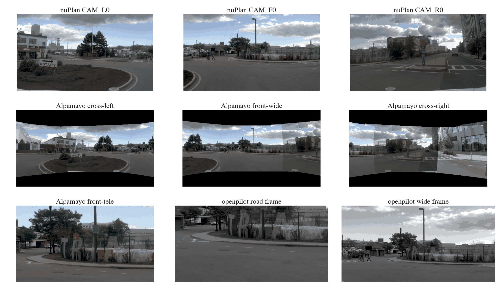
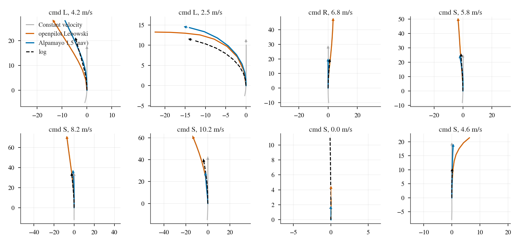
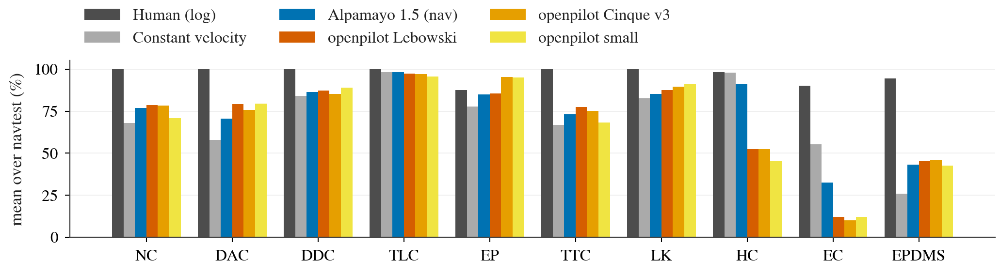
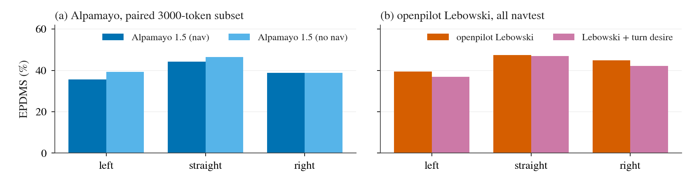
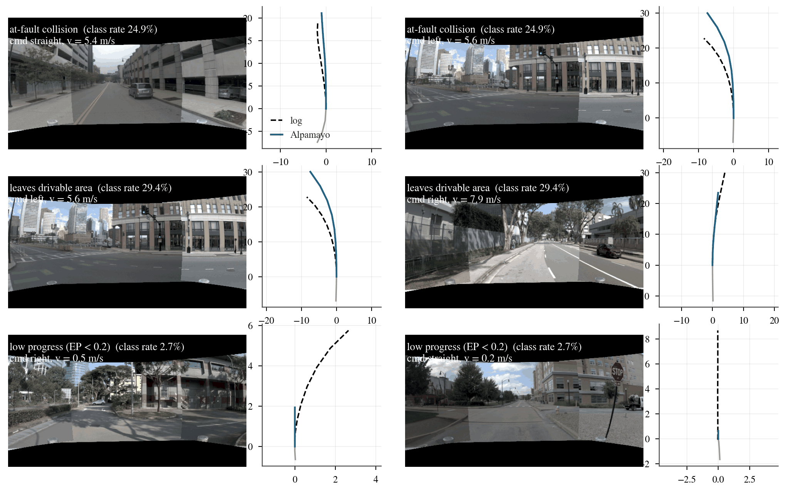

# Zero-shot 考试：Alpamayo 1.5 与 openpilot 在 NAVSIM 上的 PDMS / EPDMS

状态: done（navtest 全部完成；navhard 的 openpilot cmd / Cinque 行在最后补齐，见结果表）
主题: ../../research/openpilot-and-open-driving-models.md、../../research/benchmarks-and-evaluation.md
姊妹考试: [wod-e2e.md](wod-e2e.md)、[bench2drive.md](bench2drive.md)（同样两个模型，另外两个 agent）

## 目标

把两个开源的驾驶专用大模型原样放到它们没训练过的 NAVSIM 上，量它们的「通用驾驶能力」。
NAVSIM 是基于 nuPlan / OpenScene 真实日志的 non-reactive 开环仿真评测：agent 只给出一条 4 s 的轨迹，devkit 用
LQR 跟踪这条轨迹、和日志里的其他交通参与者一起前推 4 s，再按规则打分。主指标两个：

- **PDMS**（PDM Score，NAVSIM v1）：NC（No at-fault Collision）× DAC（Drivable Area Compliance）×
  加权平均（TTC 5、EP 5、Comfort 2）。TTC 是 time-to-collision 是否越界，EP 是 Ego Progress（相对 PDM-Closed 规划器的前进比例）。
- **EPDMS**（Extended PDMS，NAVSIM v2）：在 PDMS 上多乘 DDC（Driving Direction Compliance，逆行）和 TLC（Traffic
  Light Compliance，闯红灯），加权项多 LK（Lane Keeping）和 EC（Extended Comfort，相邻两帧规划是否一致），Comfort
  换成 HC（History Comfort，和自车历史运动是否衔接）；并且「人类在该项也违规」的情况不扣分。
- navhard two-stage EPDMS：v2 的 pseudo closed-loop 版本，第一阶段在真实场景打分，第二阶段在 3DGS（3D Gaussian
  Splatting，一种可重渲染的场景重建）合成的「偏离后」场景上再打一次，两段按 agent 第一阶段终点的远近加权后相乘。

**不做任何 fine-tuning，不拟合任何参数**，只写输入输出适配层；打分用官方 devkit，原样运行。

## 预登记（2026-09-24，在看到任何 NAVSIM 分数之前写死）

以下选择都在全量推理之前提交。之后的任何改动记到文末「偏离记录」，写清楚改了什么、为什么、对数字的影响。
适配器验证（步骤 2）只看图和 PhysicalAI-AV 上的 ADE，不看任何 NAVSIM 分数；devkit 的端到端检查只跑 devkit 自带的
constant velocity 和 human agent。

### 评测集、devkit 与 n

| 考卷 | devkit | 脚本 / 设置 | n | 已知参照 |
|---|---|---|---:|---|
| **navtest，PDMS** | navsim v1.1（官方 v1 榜） | `run_pdm_score.py`，non-reactive | navtest 全部 token（索引时实数，见下） | human 94.8，CV 20.6（NAVSIM v1 论文） |
| **navtest，EPDMS** | navsim main @ `0a380a9`（v2.2 + 2025-09 human-filter 修复） | `run_pdm_score_one_stage.py`，non-reactive log replay（devkit 默认） | 同上 | human 90.3 |
| **navhard two-stage，EPDMS** | 同上 | `run_pdm_score.py train_test_split=navhard_two_stage`，第二阶段 reactive IDM（devkit 默认） | stage-one + stage-two 全部 token | 见 research 表（DiffusionDrive 27.5 等） |

两个 devkit 共用 nuplan-devkit v1.2（navsim 的 requirements 指定的 tag），装在 `envs/navsim1`、`envs/navsim2`
（`scripts/setup_navsim_devkit.sh`，Python 3.10）。metric cache 各自用自己的 devkit 从 logs + maps 现建。
我们对 devkit 的唯一添加是一个「回放 agent」`jevdrive/navsim_agent.py`：它不看传感器，只按 token 读我们离线算好的
8 个位姿，这样两个 devkit 的打分代码一行不改。模型本身在各自的 venv 里离线跑，输入由 `scripts/navsim_zs_index.py`
在 devkit venv 里用官方 `SceneLoader` 冻结下来（token、4 帧历史、`AgentInput` 里的自车状态和 8 路相机的路径 + 标定），
所以模型看到的就是一个 NAVSIM agent 能看到的全部东西，没有任何未来信息或 NAVSIM 之外的帧。

### 数据上的硬约束：只有 2 Hz

box 上的 OpenScene 日志和相机 blob 都是 2 Hz（`navsim_logs/test/*.pkl` 相邻帧间隔 0.500 s，每帧 8 路 JPEG 都在），
nuPlan 原始的 10 Hz 相机没有下载，OpenScene 也不提供。更关键的是 NAVSIM 规则只给 agent 当前帧往前 4 帧
（t = −1.5、−1.0、−0.5、0 s）。所以两个模型要的高帧率输入都**拿不到**，下面每一项折中都会**让模型吃亏**，
报出来的分数是「模型 + 适配损失」，不是模型的上限。

### 模型与推理配置

| 模型 | 变体 | 配置 |
|---|---|---|
| Alpamayo 1.5（10B，`nvidia/Alpamayo-1.5-10B` @ `7aba829`） | **nav**（主）、**no-nav** | VLM 用 SDPA，`torch.compile` vision 与 expert（smoke 实测对默认 FA2 drift ≤ 0.02 m、CoC 100% 相同），flow matching 默认 10 步；**每个 token 1 条轨迹**（n = 1，一次 reasoning rollout），temperature 0.6、top-p 0.98、reasoning 上限 256 token（官方默认）；seed 取同一 batch 第一个 token 的前 8 位十六进制；按 nav 文本分桶做 batch（同桶 prompt 等长，不需要 padding），batch 大小由优化阶段决定并记入下面的吞吐表 |
| openpilot small（30M） | **none**（主）、cmd | onnxruntime TensorRT EP，图精度（smoke 里开 fp16 flag 会在分布外输入上溢出） |
| openpilot Cinque v3（382M） | **none**（主）、cmd | TensorRT EP fp16 |
| openpilot Lebowski（877M） | **none**（主）、cmd | TensorRT EP fp16，context-rate 步进（每个 5 Hz context 步一次，在输出相位上与 20 Hz modeld 逐位一致，由 B2D 考试的 `scripts/test_zeroshot_openpilot_context.py` 验证） |

**n = 1、无 oracle**：主表每个模型每个变体只交一条轨迹，不做任何「多采几条挑最好」的选择。

### Alpamayo：相机映射

Alpamayo 要 4 路 f-theta 相机（一种按入射角线性映射像素半径的鱼眼模型）：cross-left（index 0）、front-wide（1）、
cross-right（2）各 120°，front-tele（6）30°，每路 1920×1080，processor 缩到 576×320。虚拟 rig 直接用三场考试共用的
`scripts/zeroshot_rigs.py` 的 `ALPAMAYO_CAMERAS`（PhysicalAI-AV 100 个 clip 的标定中位数：cross 相机光轴 yaw ±67°，
front-wide / tele 朝前，pitch 都在 ±0.7° 内）。我们直接渲染 576×320 的模型图（与 processor 从 1920×1080 缩出来的像素网格一致），
processor 不再缩放。

nuPlan 有 8 路针孔相机，1920×1080，带明显桶形畸变（k1 = −0.356），fx = 1545，去畸变后水平约 72°、垂直约 ±21°；
光轴 yaw：F0 0°、L0/R0 ±55°、L1/R1 ±112°、L2/R2 ±141°、B0 180°。

**映射方法**：对每个虚拟相机的每个输出像素，按 f-theta 模型算入射射线（rig 系 = NAVSIM 自车系，x 前 y 左 z 上），
在 8 路 nuPlan 相机里找能看到它的、且射线离光轴最近的那一路，用该相机的内参 + Brown 畸变投影、双线性采样。
只做**纯旋转重投影**（忽略相机之间的平移，等价于场景在无穷远）；nuPlan 相机装在约 1.5 m 高的车顶，PhysicalAI 的 cross
相机在 0.9 m 高的翼子板，近处物体会有视差误差，这是无深度时唯一可做的映射，不修正。120° 的视图从 1/4 解码的源图采样
（DCT 缩放，386 px/rad，高于模型图中心需要的 278 px/rad），tele 从全分辨率 F0 采样。**看不到的地方填黑**：
nuPlan 相机垂直只有约 ±21°，虚拟相机要 ±34°，三路 120° 视图上下各有一条黑带，实测覆盖率约 64%（tele 100%）。
水平方向完全覆盖：front-wide 由 F0 + L0 + R0 拼成，cross-left 由 F0/L0/L1/L2 拼成，cross-right 对称。

### Alpamayo：时间轴与 egomotion

- **图像**：Alpamayo 要每路 4 帧 @10 Hz（t0−0.3 … t0），NAVSIM 只有 2 Hz。两个候选：
  `repeat`（4 个槽都放 t0 帧，场景看起来静止）和 `2hz`（放 t = −1.5、−1.0、−0.5、0 的 4 帧，时间被压缩 5 倍，运动看起来快 5 倍）。
  **选择规则（在看到 ablation 结果前写下）**：在 PhysicalAI-AV 的 31 个 clip 上（原生 10 Hz 数据，有真值，不是 NAVSIM）跑
  `repeat+rt+ego2hz` 和 `2hz+rt+ego2hz` 两种完整的 NAVSIM 式输入（rt = 经过 nuPlan 相机的往返渲染，ego2hz = 下一条的 2 Hz egomotion），
  每个 clip 6 条样本，**取 4 s 平均 ADE（6 条样本的均值，对应 n = 1 的期望误差）更低的那种**作为 NAVSIM 主设置。
- **ablation 结果与选择（2026-09-24 17:53，仍在任何 NAVSIM 分数之前）**：PhysicalAI-AV 31 个 clip（smoke run 的同一批，t0 = 5.1 s），
  每个 clip 每种输入 6 条样本，4 s 平均 ADE 先在 clip 内对 6 条取均值、再对 31 个 clip 取均值，括号是对 clip 的 bootstrap 95% CI。

  | 输入 | ADE@4s（m） | minADE_6@4s（m） | ADE@6.4s（m） |
  |---|---:|---:|---:|
  | native（原生 10 Hz 帧、原生 egomotion、原生相机） | **0.73** [0.59, 0.88] | **0.31** | **1.77** |
  | native + ego2hz | 0.74 [0.59, 0.90] | 0.31 | 1.78 |
  | native + rt（只做 nuPlan 相机往返） | 0.95 [0.73, 1.21] | 0.41 | 2.32 |
  | repeat（只改时间轴） | 1.42 [1.10, 1.73] | 0.61 | 3.65 |
  | 2hz（只改时间轴） | 1.37 [1.17, 1.58] | 0.68 | 3.17 |
  | **repeat + rt + ego2hz**（NAVSIM 式完整输入） | **1.43** [1.14, 1.78] | 0.67 | 3.71 |
  | 2hz + rt + ego2hz（NAVSIM 式完整输入） | 1.44 [1.19, 1.74] | 0.63 | 3.35 |

  读法：egomotion 从 2 Hz 插值几乎不掉（+0.004 m）；相机往返（黑边 + 视差 + 重采样）让 4 s ADE 涨 0.22 m；
  **掉得最多的是时间轴**，无论 repeat 还是 2hz 都让误差翻倍。两种完整输入之差 −0.01 m（repeat − 2hz，配对 bootstrap
  95% CI [−0.33, +0.28]，repeat 在 31 个里赢 14 个），实际上打平；按预先写下的规则取数值更低的 **repeat** 作为 NAVSIM 主设置。
  这张表也给出了适配损失的量级：同一个模型、同一批场景，NAVSIM 式输入的 4 s ADE 是原生输入的约 2 倍。
- **egomotion 历史**：Alpamayo 要 16 步 @10 Hz（t = −1.5 … 0）的 xyz 和旋转，NAVSIM 给 4 个 2 Hz 位姿（x、y、yaw，
  t0 后轴系）和各自的车体系速度。位置用三次 Hermite 插值（节点速度用实测速度转到 t0 系），yaw 用三次样条，z = 0，
  roll = pitch = 0。ablation 里的 `native+ego2hz` 单独量这一步的损失。
- **导航**：NAVSIM 的 driving command（左 / 直 / 右 / 未知）映射成 Alpamayo 的 route 文本，模板与 WOD-E2E 考试相同：
  左 → "Turn left"，直 → "Continue straight"，右 → "Turn right"，未知 → 不给 route。注意 Alpamayo 训练时的 nav 文本带距离
  （如 "Turn left in 11m"），NAVSIM 不提供到路口的距离，所以这个模板本身是分布外的。no-nav 变体完全不给 route。
- **输出**：64 个点 @10 Hz（0.1 … 6.4 s，t0 rig 系 = 后轴），取第 5、10、…、40 个点，正好是 NAVSIM 的 0.5 … 4.0 s，
  不需要插值；heading 取模型输出旋转矩阵的 yaw。

### openpilot：相机、时间轴与输出

- **相机**：只用 CAM_F0。openpilot 的 road（focal 910）和 wide（focal 455）两个 512×256 model frame，calib 系取 NAVSIM
  自车系（水平、正前）；按 openpilot 自己的 warp 做法，在整数 model 像素上最近邻采样，源图是 libjpeg 直接解出的 YCbCr、
  色度取 2×2 均值（与 WOD-E2E 考试的 openpilot runner 一致）。两个 frame 都完全落在 F0 里（覆盖率 100%）。
  相机高度约 1.5 m，高于 comma 设备的 1.22 m，不修正。
- **时间轴**：openpilot 在 20 Hz 时钟上跑，context 是 5 Hz、约 5 s。NAVSIM 只有 1.5 s 的 2 Hz 帧，所以每个 token
  从零状态开始，在 t = −1.5 … 0 的 20 Hz 时钟上走 31 步（Lebowski 走 8 个 context 步），每步喂「当前时刻之前最近的
  那一张 2 Hz 帧」（sample-and-hold），在 t0 帧刚到达的那一步取 plan。后果：模型看到的是一段「每 0.5 s 才动一下」的视频，
  context 里只有 1.5 s，前面约 3.5 s 是零状态。这是最大的一项 handicap。
- **desire**：主变体 none（openpilot 没有导航输入）；cmd 变体把左 / 右 command 映射成 desire turnLeft / turnRight，
  每步用该时刻那一帧的 command。
- **traffic convention**：sg-one-north（新加坡，左行）给 [0, 1]，其他城市 [1, 0]。
- **输出**：plan 的 33 个点（0 … 10 s，非均匀）在相机点的 calib 系里；按刚体关系换到后轴：
  rear(t) = d + p(t) − R(ψ_t)·d，d 是 F0 在后轴系里的 (x, y)，再在 0.5 … 4.0 s 线性插值 x、y、yaw（yaw 取反为逆时针）。

### baselines

- devkit 自带 constant velocity agent 与 human agent，在我们的 metric cache 上重跑（也作为 devkit 端到端检查：
  v1 的 CV 应接近 20.6、human 接近 94.8，v2 human 接近 90.3；差太多就先查 devkit，不跑模型）。
- 文献数字（不重跑）：TransFuser、DiffusionDrive 及已发表的 VLM 条目，取自 research/openpilot-and-open-driving-models.md 的表。

### 判读（预登记）

| 结果（Alpamayo nav，navtest） | 怎么读 |
|---|---|
| EPDMS ≥ 77（≥ TransFuser） | 在 5 倍时间压缩 / 静止帧、36% 黑边、分布外 nav 文本的条件下仍达到专门在 navtrain 上训练的 baseline，说明「通用驾驶能力」可以迁移 |
| 50 ≤ EPDMS < 77 | 部分迁移；按 sub-score 看是哪几项在扣（DAC / EP 说明几何或速度尺度，NC / TTC 说明交互） |
| EPDMS < 50 或低于 CV 之外的简单 baseline | 适配损失主导或模型不会开车；先用 PhysicalAI-AV ablation 的 ADE 退化量判断适配损失有多大 |
| nav − no-nav 的 EP / DAC 在左右转 command 子集上显著为正 | 模型读懂了模板化的导航文本 |

openpilot 没有 route、只看前视、context 被砍掉 70%，预期在路口 command 场景明显落后；它的数字主要回答
「车道跟随 + 纵向控制」这部分能力在 NAVSIM 规则下值多少分。

## GPU 协调与吞吐

三场考试共用 box，协调记录在 box 的 `~/data/runs/zeroshot-exam/gpu-plan.md`（append-only）。19:45 用户重启 box 加了第二张卡
（之后 2 × RTX PRO 6000、50 核），NAVSIM 分到 GPU 0；22:00 前后 Bench2Drive 暂停，GPU 1 也给了开环考试。

**优化**：Alpamayo 的 `sample_trajectories_from_data_with_vlm_rollout` 本身支持 batch 维，只要同一 batch 的 prompt 等长。
我们的 wrapper 按 nav 文本分桶（同一个 nav 文本、相同的 16 张 576×320 图 → token 数完全相同），不改模型代码就能做 batch 推理。
CPU 侧（JPEG DCT 缩放解码 + 重投影 + processor tokenize）放在 8 个线程里预取，和 GPU 重叠。

| 配置（64 个 navtest token，同一时刻卡上还有 WOD 的 Alpamayo 和 3 个 openpilot 进程） | ms / 样本 | 峰值显存 |
|---|---:|---:|
| smoke run 参照：空卡、FA2、batch 1 | 983 | 22.1 GB |
| SDPA + compile vision/expert，batch 1 | 2121 / 2140（两个 seed） | 24.5 GB |
| 同上，**batch 8** | **1248 / 1439** | 35–37 GB |
| 同上，batch 12 | 1252 | 41.8 GB |

batch 8 比 batch 1 快 1.5–1.7 倍，再大不再变快，所以取 8。等价性：采样本身是随机的，只能在分布上比——同 64 个 token，
batch 1 两个 seed 之间的 4 s ADE 中位数 0.94 m（噪声地板），batch 1 与 batch 8 之间 1.00–1.16 m，4 s 纵向终点均值差 0.7 m，
在噪声范围内。CPU 预处理 258 ms/样本（8 线程），完全被 GPU 时间盖住。全量运行时每个进程约 1.4 s/样本（GPU 0，与 openpilot
和 OP-MIGRATION 共卡）或 0.9 s/样本（GPU 1），2–4 个进程并行，用 32-token chunk 动态认领任务（`--claim`）让各进程同时结束。

**实际墙钟**：Alpamayo 全部推理（navtest nav 12146 + no-nav 3000 + navhard 5912 = 21058 个样本）18:40–22:42，其中约 20 分钟
因为 box 重启重跑；openpilot 三个模型 × 两个变体 × 两个 split 共 12 次运行，被 Alpamayo 挤在同一张卡上时每 token 0.3–0.5 s，
Alpamayo 结束后 0.15 s；官方打分（metric cache 3 份 + 30 次 scoring）全部在 CPU 上，每次 navtest 打分 10–15 分钟（12–16 线程）。

## 结果

原始 run 都在 box 的 `$DATA_DIR/runs/navsim/eval/<v>_<split>_<agent>/`；小结果文件拉回到
[research/results/navsim-zeroshot/](../../research/results/navsim-zeroshot/)（`results_navtest.csv`、`results_navhard.csv`、
`paired_navtest.csv`、`failures_navtest.csv`、`ade_navtest.csv`、`results.md`，以及 ablation 与 batch bench 的 csv）。
由 `scripts/navsim_zs_report.py` / `scripts/navsim_zs_figs.py` 生成。

### devkit 与回放管线的端到端检查（先于任何模型分数）

第一次跑出来的 constant velocity EPDMS 是 64（DAC 1.00、EP 1.00）——明显不对。查下来是 navsim 锁定的 numpy 1.23.4 自带的
OpenBLAS 在这台 box 的 Sapphire Rapids CPU 上选错 kernel，`inv`/`pinv` 静默给出错误结果（误差 ~1e3），PDM 的 LQR 仿真器炸到
10^4 m/s，metric cache 里的 PDM-Closed 参考轨迹也是错的。设 `OPENBLAS_CORETYPE=Haswell` 后修复，caches 全部重建
（`scripts/navsim_zs_score.sh` 里强制设置并在启动时自检；已写进 [docs/navsim.md](../../docs/navsim.md)）。修复后：

| agent | 路径 | PDMS（v1.1） | EPDMS（v2） | 已知值 |
|---|---|---:|---:|---|
| constant velocity | devkit 自带 agent | **20.65** | 25.88 | PDMS 20.6（NAVSIM v1 论文；NC 68.0、DAC 57.8、EP 19.4 也逐项对上） |
| constant velocity | 我们算出 8 个位姿 → 回放 agent | — | 25.88 | 与上一行逐位一致 |
| human（log） | devkit 自带 agent | **94.55** | 94.51 | PDMS 94.8；EPDMS 文献常引 90.3 |
| human（log） | logged future → 回放 agent | — | 94.51 | 与上一行一致（差 < 1e-10） |

读法：v1 两个参照都对上了；回放 agent（`jevdrive/navsim_agent.py`）和坐标约定（后轴系、x 前 y 左、yaw 逆时针）没有引入任何偏差。
human 的 EPDMS 94.5 高于文献的 90.3，是 devkit 版本差异（我们用的 main 含 2025-09 的 human-filter 修复），所以 EPDMS 之间的横向比较
只对同一 devkit 版本成立，文献 EPDMS 数字仅作量级参照。

### 适配器验证

图 1：navtest 索引里第一个 token（不是挑的）。第一行是 nuPlan 原始的 L0 / F0 / R0；第二、三行是模型真正看到的输入：
Alpamayo 的 cross-left / front-wide / cross-right（f-theta 120°，由 nuPlan 的 F0/L0/R0/L1/R1 拼出，上下黑带是 nuPlan 垂直视场不够的部分）、
front-tele（F0 中心放大），以及 openpilot 的 road / wide model frame（Y 通道）。几何连续（路缘、车道线在拼缝处对齐）、地平线水平、左右没有镜像。

图 2：seed 0 随机抽的 8 个 navtest token，NAVSIM 后轴系俯视（上 = 前，左 = +y），箭头是 4 s 处的 heading。黑虚线 log、蓝 Alpamayo（nav）、
橙 Lebowski、灰 constant velocity、浅灰历史。看左转的两格：两个模型的弯向、曲率和 log 一致，heading 箭头沿轨迹切线；openpilot 在直行格里明显跑得更远。

定量的坐标 / heading 检查（全部 12146 个 token）：

| 预测 | 4 s ADE（m） | 4 s y 与 log 的相关 | 4 s yaw 与 log 的相关 | 输出 yaw 与相邻位姿运动方向之差（中位 / p95，rad） | 4 s 纵向 / log 中位比 |
|---|---:|---:|---:|---:|---:|
| Alpamayo nav | 3.07 | 0.66 | 0.63 | 0.004 / 0.084 | 1.18 |
| Lebowski none | 9.29 | 0.86 | 0.83 | 0.015 / 0.198 | 1.53 |
| constant velocity | 2.80 | — | — | 0 / 0 | 1.07 |

左 / 右 command 下 4 s 横向位移的均值：Alpamayo +5.7 / −3.3 m、Lebowski +11.8 / −10.2 m、log +6.6 / −5.3 m——符号全对，所以不存在左右或 heading 约定错误。
openpilot 的横向、纵向都被放大约 1.5 倍，和预登记里的两个偏差方向一致（见下面的折中清单）。

### navtest 主表

n = 12146（no-nav 为 3000 个 token 的分层子集，见偏离 1），括号是对 token 的 bootstrap 95% CI。

| 模型 | 变体 | PDMS（v1.1） | EPDMS（v2） | NC | DAC | DDC | TLC | EP | TTC | LK | HC | EC |
|---|---|---:|---:|---:|---:|---:|---:|---:|---:|---:|---:|---:|
| human（log） | | 94.6 | 94.5 | 100 | 100 | 99.8 | 100 | 87.4 | 100 | 100 | 98.1 | 90.1 |
| constant velocity | | 20.7 | 25.9 | 68.1 | 57.8 | 84.2 | 98.1 | 77.8 | 66.9 | 82.7 | 97.9 | 55.3 |
| **Alpamayo 1.5** | **nav** | **44.3** [43.5, 45.0] | **43.2** [42.4, 43.9] | 76.8 | 70.7 | 86.3 | 98.3 | 84.8 | 73.2 | 85.4 | 91.0 | 32.7 |
| Alpamayo 1.5 | no-nav（3000 子集） | 41.9 | 41.6 | 81.4 | 63.9 | 82.2 | 98.4 | 81.6 | 76.7 | 83.5 | 88.5 | 29.7 |
| **openpilot Lebowski** | **none** | **50.9** [50.2, 51.6] | **45.5** [44.7, 46.2] | 78.6 | 79.1 | 87.2 | 97.4 | 85.5 | 77.6 | 87.6 | 52.4 | 12.3 |
| openpilot Lebowski | cmd | 49.4 | 44.3 | 78.2 | 76.9 | 86.1 | 97.4 | 85.0 | 77.2 | 86.8 | 54.0 | 12.4 |
| **openpilot Cinque v3** | **none** | **52.1** [51.3, 52.9] | **46.2** [45.4, 46.9] | 78.4 | 75.7 | 85.1 | 96.9 | 95.2 | 75.2 | 89.6 | 52.5 | 10.0 |
| openpilot Cinque v3 | cmd | 50.7 | 45.2 | 78.0 | 74.1 | 84.1 | 97.0 | 95.1 | 74.6 | 88.4 | 52.3 | 10.0 |
| **openpilot small** | **none** | **47.4** [46.6, 48.2] | **42.5** [41.8, 43.3] | 71.0 | 79.5 | 89.0 | 95.6 | 95.0 | 68.3 | 91.2 | 45.3 | 12.1 |
| openpilot small | cmd | 42.3 | 39.1 | 69.7 | 72.8 | 84.3 | 95.9 | 93.1 | 67.0 | 88.1 | 55.6 | 13.5 |
| *文献（在 navtrain 上训练）* TransFuser | | 84.0 | 76.7 | | | | | | | | | |
| *文献* DiffusionDrive | | 88.1 | 84.5 | | | | | | | | | |
| *文献* VLM：AutoVLA / ReCogDrive / DriveVLA-W0 | | 89.1 / 90.8 / 90.2 | — / 83.6 / 86.1 | | | | | | | | | |

sub-score 列是 EPDMS（v2）口径的均值（%）；PDMS 的 EP 定义不同（v1 相对 PDM-Closed 的比例，Alpamayo 42.6、Lebowski 49.7），不和 v2 的 EP 混排。
文献数字取自 [research/openpilot-and-open-driving-models.md](../../research/openpilot-and-open-driving-models.md) 的表（TransFuser 的 PDMS 84.0 取自 NAVSIM v1 论文），
不是我们重跑的，EPDMS 的 devkit 版本也可能不同。我们自己在 NAVSIM 上还没有 planner 的数字（research/decisions.md 里没有可比条目）。

图 3：navtest EPDMS 的各 sub-score 均值。两类模型的扣分结构不同：Alpamayo 主要丢在 NC / DAC / TTC（撞车、出界），comfort 类还行；
openpilot 的 NC / DAC 略好，但 HC（与历史运动衔接）只有 45–52%、EC 只有 10–12%，是 sample-and-hold 输入下规划本身在抖。

**读法**：按预登记的判读表，两个模型都落在「EPDMS < 50：适配损失主导或模型不会开车」一格。它们都明显好于 constant velocity
（Alpamayo +17.3 EPDMS [16.5, 18.0]、+23.6 PDMS），但离在 navtrain 上训练的 TransFuser（76.7 / 84.0）差 30–40 分。
三个 openpilot 模型（没有 route、只用前视）和 10B 的 Alpamayo 基本同分，Lebowski 甚至高 2.3 EPDMS [1.4, 3.2]、6.6 PDMS。

### nav 文本与 turn desire 有没有用（配对）

| 比较 | 口径 | 全部 | 左转 command | 直行 | 右转 command |
|---|---|---:|---:|---:|---:|
| Alpamayo nav − no-nav（3000 子集，每类 1000） | EPDMS | **−2.0** [−3.5, −0.6] | −3.8 [−6.3, −1.2] | −2.3 [−5.2, 0.8] | 0.0 [−2.2, 2.4] |
| 同上 | PDMS | −0.5 [−2.1, 1.1] | −2.8 [−5.5, −0.1] | +1.2 [−1.5, 4.1] | +0.1 [−2.5, 2.8] |
| Lebowski cmd − none（12146） | EPDMS | −1.2 [−1.5, −0.9] | −2.6 [−3.8, −1.4] | −0.5 | −2.7 [−4.2, −1.2] |
| Cinque cmd − none | EPDMS | −1.0 [−1.4, −0.6] | −1.1 [−2.3, 0.1] | −1.2 | +0.1 |
| small cmd − none | EPDMS | −3.4 [−3.9, −2.9] | −8.5 [−10.1, −7.0] | −2.3 | −1.1 |

图 4：按 driving command 分组的 EPDMS。(a) Alpamayo 在同一批 3000 个 token 上给 / 不给 nav 文本；(b) Lebowski 不给 / 给 turn desire。
预登记的「nav 在转弯子集上显著为正」没有出现：给了 "Turn left" 反而在左转 command 上低 3.8 分。openpilot 的 turn desire
同样一致地拖分——它在 openpilot 里本来是低速转弯 / 变道的触发信号，不是路口导航。

### navhard two-stage（EPDMS）

| 模型 | 变体 | stage 1 | stage 2 | EPDMS |
|---|---|---:|---:|---:|
| constant velocity | | 29.0 | 34.2 | **11.5** |
| Alpamayo 1.5 | nav | 34.1 | 32.6 | 10.8 |
| openpilot Lebowski | none | 31.8 | 30.2 | 10.2 |
| openpilot small | none | 28.7 | 31.5 | 10.2 |
| *文献* TransFuser / DiffusionDrive / VLM（SGDrive、ReCogDrive） | | | | 23.1 / 27.5 / 25.5、25.7 |

n = 5912（450 个真实 stage-one 场景 + 5462 个 3DGS 合成的 stage-two 场景）。human agent 在 navhard 上无法打分（合成场景没有未来帧，
devkit 的 pseudo closed-loop 聚合直接报错），所以这里没有 human 行。Lebowski cmd、Cinque 两行和 small cmd 的打分在报告写完时还在跑，
数字会补进 `results_navhard.csv`。读法：navhard 上 zero-shot 的两个模型都**不比 constant velocity 好**，stage 2（合成的、偏离后的状态）
对它们并不比 stage 1 更难，差距主要在 stage 1 就已经存在。

### 失败模式

| 预测（EPDMS） | NC 失败 | DAC 失败 | DDC 失败 | TTC 失败 | EC 失败 | NC 失败中 4 s 超出 log > 2 m 的比例（全体基线） | DAC 失败中转弯 command 的比例（全体基线） | DAC 失败的 4 s 横向误差中位（全体） |
|---|---:|---:|---:|---:|---:|---:|---:|---:|
| Alpamayo nav | 24.9% | 29.4% | 17.2% | 26.8% | 55.6% | 84% (57%) | 50% (34%) | 3.2 m (0.9) |
| Lebowski none | 22.5% | 20.9% | 15.1% | 22.4% | 72.5% | 83% (69%) | 51% (34%) | 7.6 m (1.6) |
| Cinque none | 23.4% | 24.3% | 17.2% | 24.8% | 74.4% | 85% (78%) | 62% (34%) | 6.9 m (1.3) |
| small none | 30.0% | 20.5% | 13.2% | 31.7% | 72.7% | 96% (86%) | 58% (34%) | 5.6 m (1.5) |
| constant velocity | 34.6% | 42.2% | 21.5% | 33.1% | 36.9% | 69% (48%) | 49% (34%) | 3.1 m (1.0) |

图 5：Alpamayo（nav）的三类失败，每类取 token 排序后的前两个（不挑）：front-wide 模型输入 + 俯视（黑虚线 log、蓝预测、灰历史）。
前两行是同一个路口左转，模型转得晚、半径大、速度快：既撞上路口的车，又出了可行驶区域；第三行是低速 / 停车的车在 log 里起步，
模型却几乎不动。

三个可以直接从数字读出的机制（前两条是结论，第三条是推测）：

1. **开太快、太远，撞前车**。Alpamayo 的 4 s 纵向终点中位是 log 的 1.18 倍，NC 失败里 84% 伴随 > 2 m 的超出（全体里 57%）。
   `repeat` 输入里 4 帧完全相同，场景看起来是静止的，模型看不到前车在减速或自己在接近，只能从 egomotion 外推；
   PhysicalAI-AV 上时间轴这一项单独就让 4 s ADE 翻倍（0.73 → 1.42 m），和这里的症状一致。openpilot 超得更多（1.5–1.9 倍），
   因为 sample-and-hold 让它最后一步看到的是 0.5 s 的位移却按 0.2 s 理解，速度被放大约 2.5 倍，再加上相机更高带来的尺度偏差。
2. **转弯出界**。DAC 失败里一半是转弯 command（全体只有 1/3），失败样本的横向误差中位 3.2 m（Alpamayo）/ 7.6 m（Lebowski）。
   Alpamayo 的转弯方向是对的，但半径和时机不对；openpilot 横向也被放大。nav 文本没有帮助（上一节）。
3. **舒适度（openpilot）**：HC 45–52%、EC 10–12%，即计划与自车历史不衔接、相邻两帧计划不一致。推测是 1.5 s、每 0.5 s 才跳一次的
   输入让 feature 队列处于从未见过的状态；验证办法是在 comma1M 上把 20 Hz 视频人为降成 2 Hz sample-and-hold，看 plan 的抖动是否同样出现。

### 适配折中清单与偏差方向

| # | 折中 | 影响的模型 | 预期偏差方向 | 证据 |
|---|---|---|---|---|
| 1 | 只有 2 Hz、1.5 s 历史；Alpamayo 4 个槽都放 t0 帧（静止场景） | Alpamayo | 看不到相对运动 → 跟车距离、起步判断差，NC / TTC 下降；**压低分数** | PhysicalAI-AV：4 s ADE 0.73 → 1.42 m；NC 失败 84% 伴随超出 |
| 2 | 同上，openpilot 用 sample-and-hold 在 20 Hz 时钟上喂 2 Hz 帧、零状态、context 只有 1.5 s | openpilot | 速度被高估约 2.5 倍、plan 抖动 → 超出、EC/HC 很低；**压低分数** | 纵向中位 1.5–1.9 倍 log；EC 10–12% |
| 3 | 纯旋转重投影，忽略相机间平移（视差） | 两者 | 近处物体位置偏；Alpamayo 的 cross 相机（0.9 m 高）差得最多；**压低** | PhysicalAI-AV 往返：+0.22 m ADE |
| 4 | nuPlan 垂直视场 ±21° < Alpamayo ±34°，三路 120° 图上下约 36% 填黑 | Alpamayo | 丢掉近处路面和引擎盖区域；**压低** | 同上（往返包含黑边） |
| 5 | 相机高度 1.5 m（comma 1.22 m），不做尺度修正 | openpilot | 距离估计偏大 → 纵向、横向都放大；**压低** | 横向 4 s 位移是 log 的约 1.8 倍 |
| 6 | nav 文本没有距离（"Turn left"），训练时是 "Turn left in 11m" | Alpamayo | 模板分布外；实测 nav 比 no-nav 低 2 EPDMS，**压低 nav 行** | 配对表 |
| 7 | openpilot 没有 route，turn desire 当导航用 | openpilot | desire 本意是低速转弯 / 变道；实测拖分 | 配对表 |
| 8 | egomotion 从 4 个 2 Hz 位姿 Hermite 插值成 16 步 @10 Hz，z = 0、roll = pitch = 0 | Alpamayo | 几乎无影响 | PhysicalAI-AV：+0.004 m |
| 9 | Alpamayo rig 取 PhysicalAI-AV 标定中位数（三场考试共用），不是某台车的精确标定 | Alpamayo | 亚度级，可忽略 | 标定标准差 < 1.2° |
| 10 | n = 1、固定 seed、batch 8（与 batch 1 在噪声内一致） | Alpamayo | 无系统偏差；单样本方差比 minADE_6 大 | batch bench |
| 11 | openpilot small 用 TensorRT 图精度、另两个用 fp16 | openpilot | 无（smoke 已验证数值等价） | openpilot smoke |

所有已知折中的方向都是**让模型吃亏**；没有发现任何一项会抬高分数。所以这里的数字是「模型 + 适配损失」的下限式读数，
不能读成两个模型能力的上限，也不能和在 navtrain 上训练的方法直接比能力。能说的是：**在 NAVSIM 标准输入（2 Hz、1.5 s）下，
两个大型驾驶专用模型不经训练，只比 constant velocity 好 15–20 分，离 navtrain 上训练的 60M 级 specialist 还差 30–40 分；
其中至少时间轴一项就足以让轨迹误差翻倍**。

## 偏离记录

1. **（2026-09-24 19:45，在看到任何 NAVSIM 分数之前）Alpamayo no-nav 只跑 navtest 的一个子集。** 预登记里 no-nav 的 n 写的是
   「同上」（全部 12146 个 token）。GPU 是三场考试共用的，navtest nav 两个进程并行已经要约 2.3 h（共享卡上 batch 8 每进程
   约 1.2–1.4 s/样本），全量 no-nav 还要约 2 h，并且会把 WOD 的最后一个任务和 Bench2Drive 的 4.3 h 全量跑往后推。
   改为：按 driving command 分层，左 / 直 / 右各用 seed 0 抽 1000 个（`jevdrive.navsim_zs.nonav_subset`，共 3000），
   no-nav 只跑这 3000 个；nav 与 no-nav 的比较全部在这 3000 个 token 上**配对**进行，主表的 nav 分数仍是全量 12146。
   左 / 右转 command 在子集里占 2/3（全量里只占 1/3），所以子集上的平均分不能直接和全量比，只用来做配对差。
2. **（运行中）box 重启。** 19:45 用户重启 box 加卡，正在跑的任务全部被杀。Alpamayo 的输出是逐行 JSON，已写的 5336 个样本保留、
   从断点续跑；metric cache 和 openpilot small / Cinque 的 navtest 运行从头重跑。对结果没有影响。
3. **（运行中）分片 bug，已修复并补跑。** 为了让新加的 GPU 1 进程分摊任务，改成按 chunk 动态认领；第一版按每个进程自己的
   待办列表切 chunk，不同时间启动的进程对 chunk 编号理解不同，漏掉了 600 个 no-nav 和 1000 个 navhard 样本（`collect_alpamayo`
   的完整性断言抓到的）。修正为按完整索引切 chunk 后补跑。补跑的样本用的是同一套配置和 seed 规则，对结果没有系统影响。
4. **no-nav 的打分只在 3000 个 token 上进行**（devkit 的 scene filter 限定 token），与偏离 1 一致。
5. **navhard 没有 human 行**：devkit 的 human agent 在合成场景上没有未来帧，聚合报错；不影响模型行。

